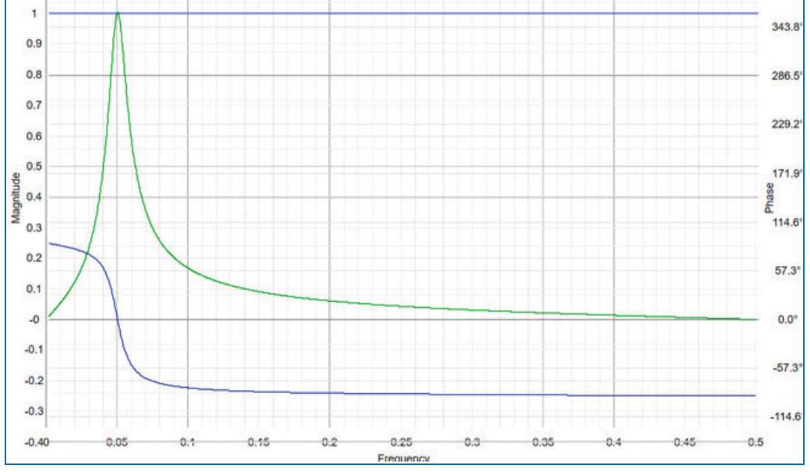

# A Conversation With John Ehlers

- **Source:** *Technical Analysis of Stocks & Commodities*, Volume 41, April 2023, pp. 28–32
- **Interviewer:** Kevin J. Davey
- **URL:** https://technical.traders.com/archive/article.asp?file=\V41\C04\598INTE.pdf

---

After four decades of providing products, services, and education to traders through his company, MESA Software, John F. Ehlers has announced his retirement. We congratulate him on his long and successful career. He has been a Contributing Editor to *Technical Analysis of Stocks & Commodities* since 1983, a year following the magazine's launch. He has written more than 100 articles for the magazine, more than any other contributor. Ehlers is a pioneer in the use of cycles and digital signal processing (DSP) technical analysis. He launched MESA Software in the early 1980s after developing the technique of maximum entropy spectral analysis as applied to trading and market analysis. MESA Software has focused on offering algorithmic trading strategies that adapt to different markets and market conditions.

Traders and technical analysts have benefitted from the research, tutorials, tools, software, and insights he has provided via his writings, his products, his speaking engagements, and through the annual seminars he offered through 2022, in which he would share some of his life's work on analyzing market data. He continues to contribute articles to this magazine based on his ongoing, latest research. In this issue, you will find an article in which he presents a practical and effective way to smooth market data.

Prior to launching MESA Software, he was a Senior Engineering Fellow with Raytheon and worked on special projects including SkyLab. It was during his time there that he started to become interested in studying market data and cycle analysis.

Ehlers can be reached through his website at MESAsoftware.com.

*Stocks & Commodities* Contributing Writer and "Algo Trading" columnist Kevin J. Davey interviewed John Ehlers via email in January 2023 to discuss his trading and analysis approach, his thoughts on where quantitative financial analysis is heading, and his long and meaningful contribution to the fields of technical analysis and quantitative financial analysis.

---

***John, your contributions over the years to the trading community are immense and far reaching. That makes it tough for someone new to algorithmic trading, or new to your material, to actually benefit from your great work. So let's start with the archives of this magazine. Out of the 100+ articles you have written for Stocks & Commodities, which one or two stand out to you, and why?***

To me, the importance of an article is directly related to my contribution to technical analysis. So, I think my best article was "A Technical Description Of Market Data For Traders," which appeared in the May 2021 issue of S&C.

In that article, I proved that volatility is orthogonal (that is, uncorrelated) to market timing signals. Astute strategy developers can save themselves an immense amount of time simply by avoiding volatility when trying to improve market timers. Instead, they can use volatility to establish amplitude thresholds to improve the probability of a trade being successful.

I also established that the signal information in the data is analogous to frequency modulation or phase modulation of a radio wave. The implication of this relationship is that band-limiting filters can recover trading information with greater accuracy than conventional technical indicators.

It is common knowledge that market data are fractal and the statistical shape of the market spectrum is pink noise. That means the amplitude swings of the frequency components are in direct proportion to their wavelength, which makes the measurement of cycles very difficult. In fact, cycles are ephemeral and measurement shows them to be all over the place. Therefore, it is just not practical to use measured frequency as a parameter to tune filters or indicators.

I also like "Predictive And Successful Indicators" in the January 2014 issue because I introduced the SuperSmoother and highpass filters there.

I introduced the bandpass filter in "The Bandpass Indicator" in the September 1994 issue.

I introduced the Hann-windowed FIR (finite impulse response) smoothing filter in "Windowing" in the September 2021 issue.

---

***There is definitely a lot to absorb in those articles. In the first article you reference, you mention how volatility is uncorrelated to market timing signals. Can you expand upon that a bit? For example, are you saying that Bollinger Bands—which give signals and use standard deviation as a volatility measure for the upper and lower bands—can be improved upon or modified by encompassing the ideas in that article of yours? If so, can you briefly explain?***

I want to underscore that I am referring to swing, or reversion to the mean, style of trading. With that style, a trader is attempting to enter a long position at the bottom of the cyclic swing and exit or reverse to a short position at the top of that swing. It is easy to add a volatility rule to apparently improve the percent winners or profit factor in historical testing. What I have proven is that such a rule is illusory, and a resulting strategy will be less robust in out-of-sample applications. Swing trade timing rules should be solely dependent upon the position of the phasor.

I don't think Bollinger Bands should be used for swing trading for several reasons, mostly because of computational lag. Bollinger Bands first require a moving average from which to compute the standard deviation. The lag of a moving average is approximately half the average length, and that alone is enough to make the swing trade timing signals ineffective.

---

***In the other articles you mentioned, filters are introduced. As a best practice, do you recommend the trader first analyze the market data with these indicators and filters to see if they can be tuned to the particular market, or would you rather people just incorporate the filters in strategies they are developing?***

I think of the market as a "blackbox system" when using digital signal processing (DSP). Such a system has an input, and output, and a transfer response linking the two. A system transfer response is often characterized by its response to an input impulse function. My research shows that the system response of the market is broadly described as the combination of a highpass filter and a lowpass filter, forming a relatively wide passband of spectral components. Since the market is nonstationary, the particular tuning of these filters varies with time. Therefore, a walk-forward-type procedure is advised to get the best strategy performance from the filters.

---

***Let's say I am a brand-new algo/systematic trader. What would be the best path for a newbie to start utilizing your research and material into their own trading?***

Nothing can replace preparation. First of all, my approach embraces swing, or reversion to the mean, trading. I do this because the algorithmic approach offers a better chance of having a higher probability of winning trades. Trend trading typically offers a higher probability of a larger profit factor. If you want to be a trend trader, about all my techniques will provide are smoothing filters.

If you embrace swing trading, read all that has been written and apply the concepts to your own particular market and style of trading. Don't avoid studying DSP because it appears to be too difficult. Thoroughly test your strategy for robustness. Now your work is done. When it comes to trading, just turn on the computer and let it process the trades for you. Don't override your algorithm. In fact, don't even look at the trades until they are closed. That way you can maintain your sanity and quality of life.

---

***Excellent points, both on the proper use of your work and on how to test and ultimately execute a strategy. That said, what are the two or three best tips you'd offer to brand-new algo/systematic traders?***

The most important aspect of algo trading is "keep it simple." A trading strategy absolutely has to be dirt-simple to be robust in all market conditions. One can see an immense interaction between tunable inputs when optimizing a strategy. Those same interactions are present when the fixed parameters are presented with the variable market data. So my rule is to use only one, or at most two, tunable parameters when developing a strategy.

---

***With limiting yourself to two tunable parameters, are you also including any stop-losses or profit targets in your strategy, as most traders do? If those values are also optimized or tuned, then you could have four parameters total. Or, do you mean a limit of two total for the whole strategy?***

I would prefer to not use stop-loss rules in my strategies because the stop-loss interferes with the performance of the trading rules. Having said this, I am not completely oblivious to real-world considerations. So my strategies include stop-losses that are merely disaster stops. They are set on the basis that they are rarely hit, and therefore have minimum interaction with my trading rules. Therefore, I don't count a disaster stop as a tunable parameter.

---

***Sorry for the sidetrack question. Please continue with new algo trader tips.***

Another tip is to manipulate the data to create tradable events. Since the data are fractal, the spectrum component amplitudes are in direct proportion to their wavelength. Taking a simple difference of successive data samples creates a filter whose amplitude outputs are inversely proportional to wavelength. Thus, the difference flattens the data spectrum amplitudes. Then, the information can be recovered by applying a smoothing filter to flattened spectrum data. Differencing sampled data is analogous to taking the derivative in calculus and smoothing is analogous to integration in calculus. Therefore, by simply applying the two inverse mathematical operations, one can create a nearly matched filter for trading. There are different combinations of filters and indicators that approximate the frequency response of a matched filter.

The third tip is to expand analysis into the frequency and phase domain. Most traders are familiar with the squiggly lines of indicators in the time domain. Those squiggly lines have a direct representation in the frequency domain as well. The chart in Figure 1 of the amplitude and phase response of a relatively narrow band bandpass filter illustrates my point. The green line is the amplitude response (left axis). The blue line is the phase response (right axis). Suppose the data consistently had a frequency less than 0.05 and your trading rules provided strategies that couldn't miss for weeks at a time. Then, the data shifts and now you can't get a winning trade to save your life. What happened? The answer is in the phase response. Successful trades occurred when the filter phase response was near +90 degrees. But when the data shifted to a frequency larger than 0.05, the filter phase response was near -90 degrees. Thus, the data shift caused a 180-degree phase reversal for the information provided to the trading rules and the trading rules are therefore dead wrong in the second case. This illustrates how important phase response is to a successful algorithmic strategy.



**Figure 1:**  Amplitude and phase response of a relatively narrow band bandpass filter
---

***Your material is math and science intensive (no surprise, considering your rocket science background!). Your answer to the above question is a great example of that. Here is a two-part question: First, can you recommend a good book for people starting out with digital signal processing, maybe that focuses more on concepts as opposed to the detailed math? Next, how can non-math-inclined traders best utilize your work in digital signal processing to help them be a successful trader?***

DSP is a relatively complicated subject, requiring advanced mathematics. But the necessity to minimize computational lag in trading applications means that only a tiny fraction of the entire DSP subject is used. I would advise traders not to try to learn all about DSP, but to just get a general understanding of the concepts. So, rather than recommending a book, traders can read my DSP tutorial at https://www.mesasoftware.com/DSPTutorial.htm or review the tutorial found at www.micromodeler.com/dsp.

Just don't be intimidated by technology. Learning a little bit about DSP is a whole lot easier than memorizing a bunch of patterns or trying to understand the relationship between price and volume. One key feature of DSP is that it exploits the duality of the time domain and the frequency domain. That is, the characteristics of the squiggly lines in the time domain can be explained in terms of filters in the frequency domain.

I think this is a profound overview of DSP applied to trading: Market data are fractal and has a pink noise spectrum. That means that the amplitude of the cyclic component swings are in direct proportion to their wavelength. A reasonable approximation is that the cyclic swing amplitudes increase at the rate of 6 dB per octave. Since the spectrum components do not have equal amplitude, cyclic analysis is possible only if the spectrum is equalized. The spectrum can be equalized by taking a simple difference of successive data samples, which is approximately the same as taking a derivative in calculus. The derivative has a frequency response of −6 dB per octave, which provides the equalization. The result of taking the difference is a band-limited signal (that is, an oscillator). The information in the band-limited signal can be recovered by using the opposite mathematical function—taking the integral of the band-limited signal. Integration is the equivalent of summation and summation is the basically the same as lowpass filtering. The result of using the two opposite calculus operations is an approximation to a statistically matched filter in the frequency domain. This matched filter can be tuned using combinations of highpass and lowpass filters.

I know the concept is difficult for traders to get their mind around, but once you master the concept, the rest of the application of DSP is just tuning simple filters.

---

***Over the years, you have seen many successful and unsuccessful traders. What do you think is the most important key to successful trading?***

Without question, the single most important key to successful trading is money management. It is simple. You have to have enough capital to stay in the game. That means a successful trader needs to understand his capability to absorb losses. This capability includes both financial and psychological aspects.

On the financial side, a trader's account must be sufficiently capitalized to fully implement the strategy being followed. In trading futures, that capability means having a respect for the effect margin can have on the downside. If you get a margin call, it is impossible to continue following your strategy without the influx of more capital.

On the emotional side, traders must realize that their role in the market is to provide capital so that producers and consumers can mitigate their risks. That means the trader is taking on risk, and that means that losses are inevitable. But taking a loss in real money is a lot different than looking at drawdown on a hypothetical historical study. Taking a loss is tough, and a trader must be prepared for it.

All of this also means that an important key to successful trading is to do thorough research before trading is begun. The research involves not only the probability of success of the selected strategy, but also the impact of the losses.

---

***For those wanting to learn more about your money management thoughts and practices, can you expand upon how you perform money management, or point readers to an article or book chapter you wrote on the topic?***

Money management is not my forte. I think the primary objective of money management is to stay alive so you can trade another day. So I simply approach the subject with the question of how many consecutive losers can I afford to take. That number, times the average loss per trade and initial margin, is the amount of capital I must have to trade. I use ten consecutive losers as my rule because the probability of this event is vanishingly small.

---

***I find it very interesting that a "numbers" guy like yourself, with so much research into DSP for trading, highlights the importance of emotions and psychology for good trading. Do you have anything (books, articles) that you have written or read that have really helped you emotionally?***

Nope. The numbers protect you against emotions. You just have to understand that losses are part of trading. You must also respect leverage when trading futures. One way of sidestepping many emotions is to put your computer on autotrade and don't even look at the results until the end of the day or end of the week.

---

***For many years you have been at the forefront of incorporating advanced concepts like digital signal processing into trading. What advanced concepts do you think will dominate trading the next 10–20 years? Machine learning, artificial intelligence, etc.***

I am fond of saying that artificial intelligence is better than real ignorance—but not by much. Computers are really, really dumb. They have no capacity to draw inferences. Anyone who has done even a little programming knows that computers are perversely literal. Computers can make blazingly fast calculations and have a semi-infinite memory, which makes them ideal for tasks like pattern matching. Pattern matching is useful for applications like facial recognition, voice recognition, or even making estimates of the best chess moves. In trading, pattern matching is synonymous with curve fitting. So, if you like curve fitting you will love AI. No matter how you slice it, AI is pattern matching on steroids.

Technology will bring more sophistication to the art of trading. Successful traders will be forced to acquire skills in signal processing and probabilities of outcomes. Traders of tomorrow probably will become the ones we call quants today.

---

***Do you think retail traders who do not embrace these advanced concepts will be able to succeed?***

Of course retail traders can succeed without quant skills because, at its core, trading is an art. But success is simply a matter of statistics. By using technology, one has a much higher probability of success. It takes a mountain of experience to be a successful seat-of-the-pants trader using skills that are nearly impossible to quantify, and many traders burn out before they acquire those skills. Then there is the emotional and psychological aspect of trading. Without technology, trading losses are closely linked to personal failure because the trader blames the losses on bad decisions. Then, the sense of failure ultimately leads to abandonment of trading altogether. On the other hand, knowing that the probability of losses is just part of the game, traders using technology avoid the personal involvement. So, using technology improves the probability of success.

---

***Now that you are wrapping up a long and successful career, will traders still be able to access your website, software, and work?***

I am keeping my website https://mesasoftware.com active as a resource for algorithmic traders. It contains a cycles tutorial and a DSP tutorial, as well as many of the more recent technical articles I have written.

---

*Thank you John, not just for this interview, but for all the work you've contributed to trading over the years. Your legacy in trading (or should I say "lagacy") will last for decades to come.*

*Kevin J. Davey may be reached at kdavey@kjtradingsystems.com.*

---

## Further Reading

- Ehlers, John F. [2013]. *Cycle Analytics For Traders*, John Wiley & Sons.
- Ehlers, John F. [2001]. *Rocket Science For Traders*, John Wiley & Sons.
- Ehlers, John F. [1994]. "The Bandpass Indicator," *Technical Analysis of Stocks & Commodities*, Volume 12: September.
- Ehlers, John F. [2014]. "Predictive And Successful Indicators," *Technical Analysis of Stocks & Commodities*, Volume 32: January.
- Ehlers, John F. [2021]. "A Technical Description Of Market Data For Traders," *Technical Analysis of Stocks & Commodities*, Volume 39: May.
- Ehlers, John F. [2021]. "Windowing," *Technical Analysis of Stocks & Commodities*, Volume 39: September.
- Montevirgen, Karl [2019]. "Market Data Insights With John Ehlers," interview, *Technical Analysis of Stocks & Commodities*, Volume 37: September.
- Gopalakrishnan, Jayanthi [2004]. "John F. Ehlers of MESA," interview, *Technical Analysis of Stocks & Commodities*, Volume 22: January.
- https://www.mesasoftware.com/DSPTutorial.htm
- www.micromodeler.com/dsp

---

## BibTeX

```bibtex
@article{davey2023conversation,
  author    = {Kevin J. Davey},
  title     = {A Conversation With {John Ehlers}},
  journal   = {Technical Analysis of Stocks \& Commodities},
  volume    = {41},
  number    = {4},
  pages     = {28--32},
  year      = {2023},
  month     = apr,
  url       = {https://technical.traders.com/archive/article.asp?file=\V41\C04\598INTE.pdf}
}
```
