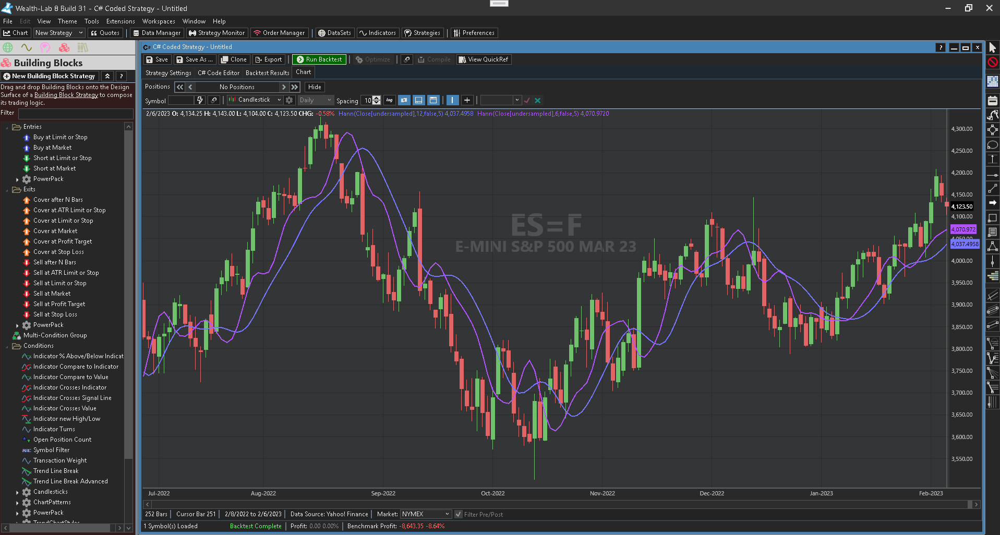
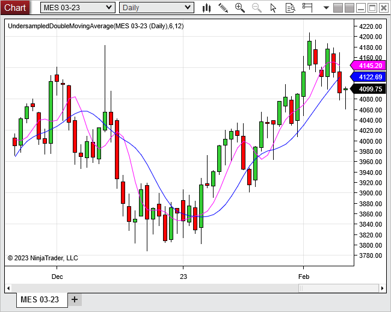
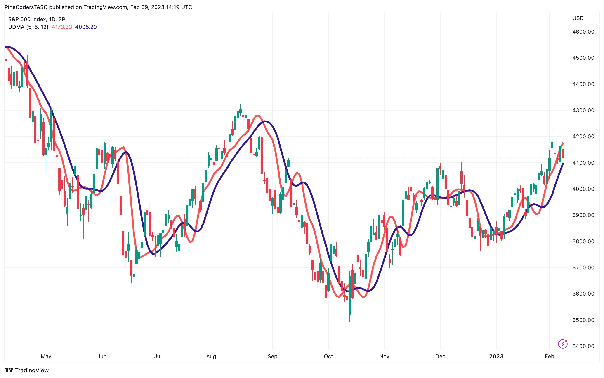
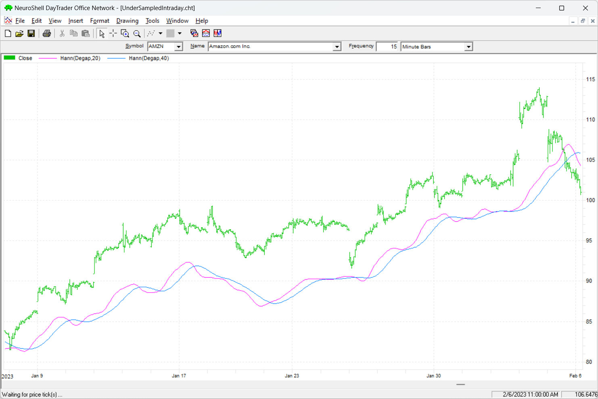
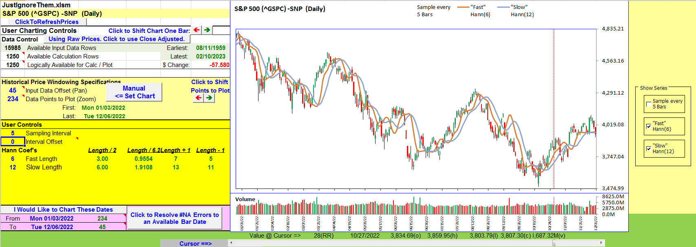
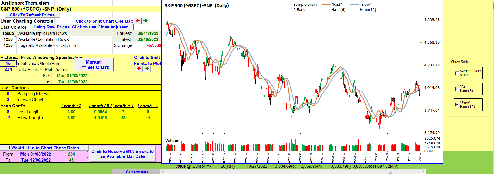
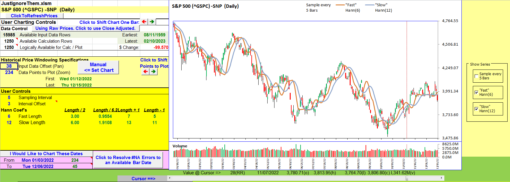

# Traders' Tips: Just Ignore Them

- **Article**: "Just Ignore Them: Undersampling The Data As A Smoothing Technique" by John F. Ehlers
- **Publication**: Technical Analysis of Stocks & Commodities, April 2023
- **URL**: <https://www.traders.com/Documentation/FEEDbk_docs/2023/04/TradersTips.html>

---

For this month's Traders' Tips, the focus is John Ehlers' article in this issue, "Just Ignore Them." Here, we present the April 2023 Traders' Tips code with possible implementations in various software.

## TradeStation

In his article in this issue, "Just Ignore Them: Undersampling The Data As A Smoothing Technique," John Ehlers explains that data smoothing is often used as a means to help avoid trading whipsaws. While this can result in fewer trading signals, it can also result in a lag in those trading signals. In the article, Ehlers describes how undersampling coupled with Hann-windowed finite impulse response (FIR) filters can be used to remove high-frequency components in price data, resulting in less lag than that of traditional smoothing filters.

**Function: $Hann** — [`tradestation-hann-function.els`](code/tradestation-hann-function.els)

```easylanguage
// TASC APR 2023
// Function: Hann Windowed Lowpass FIR Filter
// (c) 2021-2022 John F. Ehlers

inputs:
	Price( numericseries ),
	Length( numericsimple );
	
variables:
	Count( 0 ),
	Coef( 0 ),
	Filt( 0 );
	
Filt = 0;
Coef = 0;

for Count = 1 to Length 
begin
	Filt = Filt + (1 - Cosine(360 * Count / (Length + 
	 1))) * Price[Count - 1];
	Coef = Coef + 
	 (1 - Cosine(360 * Count / (Length + 1)));
end;

if Coef <> 0 Then 
	$Hann = Filt / Coef;
```

**Indicator: Undersampled Double MA** — [`tradestation-undersampled-double-ma.els`](code/tradestation-undersampled-double-ma.els)

```easylanguage
// TASC APR 2023
// Undersampled Double MA Indicator
// (c) 2022 John F. Ehlers

inputs:
	FastLength( 6 ),
	SlowLength( 12 );

variables:
	Sample( 0 ),
	FastAvg( 0 ),
	SlowAvg( 0 );
	
Sample = Sample[1];

//Sample every five days
if CurrentBar / 5 = IntPortion(CurrentBar / 5) then 
	Sample = Close;
//Find Fast Average using Hann FIR filter 
FastAvg = $Hann(Sample, FastLength);
//Find Slow Average using Hann FIR filter 
SlowAvg = $Hann(Sample, SlowLength);

Plot1(FastAvg, "FastAvg");
Plot2(SlowAvg, "SlowAvg");
```

**Indicator: Undersampled Intraday Double MA** — [`tradestation-undersampled-intraday-double-ma.els`](code/tradestation-undersampled-intraday-double-ma.els)

```easylanguage
// TASC APR 2023
// Undersampled Intraday Double MA Indicator
// (c) 2022 John F. Ehlers

inputs:
	BegDate( 1221117 ),
	FastLength( 20 ),
	SlowLength( 40 );

variables:
	Gap(0 ),
	Degap( 0 ),
	FastAvg( 0 ),
	SlowAvg( 0 );
	Degap = Degap[1]; 
	
if Time = 645 then
begin
	Gap = Close - Degap[1];
	Degap = Close - Gap;
end;

if Time = 800 or Time = 900 
 or Time = 1000 or Time = 1100 
 or Time = 1200 or Time = 1315 then 
 	Degap = Close - Gap;
 	
if Date < BegDate then 
	Degap = Close;
//Find Fast Average using Hann FIR filter 
FastAvg = $Hann(Degap, FastLength);
//Find Slow Average using Hann FIR filter 
SlowAvg = $Hann(Degap, SlowLength);

Plot1(FastAvg, "Fast Avg");
Plot2(SlowAvg, "Slow Avg");
```


*—John Robinson, TradeStation Securities, Inc., [www.TradeStation.com](https://www.tradestation.com/)*

## Wealth-Lab

In his article "Just Ignore Them" in this issue, John Ehlers suggests a smoothing method by undersampling the data and using Hann windowing.

The Hann indicator is ready for use in Wealth-Lab 8, allowing the user to choose whether to apply undersampling to the data or leave it as is. You can apply it equally using various tools in Wealth-Lab such as Building Blocks (to create no-code trading strategies), the Indicator Profiler (which tells how much of an edge an indicator provides), or our Strategy Optimizer.

With Wealth-Lab's ability to combine different indicators in a GUI wizard, Hann filters can even be used as a "smoother" to your favorite indicator like MFI, RSI, or momentum. The techniques, common to moving average interpretation, apply here as well.

Prototyping a trading system, including complex ideas, doesn't take much effort with the Building Blocks feature. If you're not familiar with Wealth-Lab, our **web-based backtesting engine** is free to use. Create a system (for example, applying the Hann filter to a price or indicator of choice) in its user-friendly interface and run backtests of your strategy right in the browser. As a natural next step, your strategy becomes instantly available in the Wealth-Lab desktop application for in-depth use. And if the strategy turns out to be good enough, you could choose to publish it for the benefit of the Wealth-Lab community of members. Strategies published by community members can be found at <https://www.wealth-lab.com/Strategy/PublishedStrategies>.



*—Gene Geren (Eugene), Wealth-Lab team, [www.wealth-lab.com](https://www.wealth-lab.com/)*

## NinjaTrader

The smoothing technique that John Ehlers presents in his article in this issue, "Just Ignore Them," using undersampling and Hann windowing is available for download from the following links for NinjaTrader 8 and for NinjaTrader 7:

- **NinjaTrader 8**: [www.ninjatrader.com/SC/April2023SCNT8.zip](https://www.ninjatrader.com/SC/April2023SCNT8.zip)
- **NinjaTrader 7**: [www.ninjatrader.com/SC/April2023SCNT7.zip](https://www.ninjatrader.com/SC/April2023SCNT7.zip)

Once the file is downloaded, you can import the indicator into NinjaTrader 8 from within the control center by selecting Tools → Import → NinjaScript Add-On and then selecting the downloaded file for NinjaTrader 8. To import into NinjaTrader 7, from within the control center window, select the menu File → Utilities → Import NinjaScript and select the downloaded file.

You can review the indicator's source code in NinjaTrader 8 by selecting the menu New → NinjaScript Editor → Indicators from within the control center window and selecting the file you wish to examine.

NinjaScript uses compiled DLLs that run native, not interpreted, which provides you with the highest performance possible.

Source code files: [`UndersampledDoubleMovingAverage.cs`](ninja-trader/UndersampledDoubleMovingAverage.cs), [`UndersampledDoubleMovingAverageIntraday.cs`](ninja-trader/UndersampledDoubleMovingAverageIntraday.cs)



*—Chelsea Bell, NinjaTrader, LLC, [www.ninjatrader.com](https://www.ninjatrader.com/)*

## TradingView

Here is TradingView Pine Script code implementing the undersampled double moving average indicator described in the article in this issue by John Ehlers, titled "Just Ignore Them: Undersampling The Data As A Smoothing Technique."

[`tradingview-undersampled-double-ma.pine`](code/tradingview-undersampled-double-ma.pine)

```pine
//@version=5
string title  = 'TASC 2023.04 Undersampled Double MA'
string stitle = 'UDMA'
indicator(title, stitle, true)

// @function Samples a source every period of bars.
sampledSource (int period = 5, float source = close) =>
   var float sample = source
   if bar_index % period == 0
       sample := source
   sample

// @function Hann Windowed Lowpass FIR Filter.
hann (float source, int length) =>
   float PIx2 = math.pi * 2.0, filt = 0.0, coef = 0.0
   for count = 1 to length
       float w = 1.0-math.cos(PIx2*count / (length + 1.0))
       filt += w * nz(source[count - 1])
       coef += w
   float hann = coef != 0.0 ? filt / coef : na
   hann

// @function Undersampled Double Moving Average.
udma (int length      =     6,
int      samplePeriod =     5,
float    source       = close
) =>
   float sample = sampledSource(samplePeriod, source)
   float result = hann(sample, length)
   result

int samplePeriod = input.int( 5, 'Sampling period:', 1)
int fastLength   = input.int( 6, 'Fast period:', 1)
int slowLength   = input.int(12, 'Slow period:', 1)

float fast = udma(fastLength, samplePeriod)
float slow = udma(slowLength, samplePeriod)

plot(fast, 'Fast UDMA', color.red, 4)
plot(slow, 'Slow UDMA', color.navy, 4)
```

The indicator is available on TradingView from the PineCodersTASC account at: <https://www.tradingview.com/u/PineCodersTASC/#published-scripts>.



*—PineCoders, for TradingView, [www.TradingView.com](https://www.tradingview.com/)*

## NeuroShell Trader

Using undersampling of the data as a smoothing technique, as described by John Ehlers in his article in this issue, "Just Ignore Them," can be easily implemented in NeuroShell Trader by combining some of NeuroShell Trader's 800+ indicators. To implement the undersampled intraday double MA indicator, select "new indicator" from the *insert* menu, and use the indicator wizard to set up the following indicators:

```
Gap         Sub(DayOpen(Date,Open,0),DayClose(Date,Close,1))
CumGap      CumSum( IfThenElse(A not equal B(Momentum( Gap, 1), 0), Gap, 0) ,0)
Price       Sub(Close, CumGap)	
SampleFreq  4
Degap       SelectiveAvg(Price,A=B(Remainder(CumSum(Add2(1,0),0), SampleFreq),0),1)
FastAvg     Hann(Degap, 20)
SlowAvg     Hann(Degap, 40)
```

Note that Ehlers' Hann filter indicator is created using NeuroShell Trader's ability to call external dynamic linked libraries (DLLs). After moving the Hann filter code given in the article to your preferred compiler and creating a DLL, you can insert the resulting indicator as follows:

1. Select "new indicator" from the *insert* menu.
2. Choose the *External Program & Library Calls* category.
3. Select the appropriate *External DLL Call* indicator.
4. Set up the parameters to match your DLL.
5. Select the *finished* button.



*—Ward Systems Group, Inc., [sales@wardsystems.com](mailto:sales@wardsystems.com), [www.neuroshell.com](https://www.neuroshell.com/)*

## The Zorro Project

All smoothing indicators, such as the simple moving average (SMA) or lowpass filter, trade more lag for more smoothing. In this issue's article "Just Ignore Them," John Ehlers suggests undersampling the price curves for achieving a better compromise between smoothness and lag. We can check that out by applying a Hann filter to the original price curve and a five-fold undersampled curve.

[`zorro-undersampled-double-ma.c`](code/zorro-undersampled-double-ma.c)

```c
var Hann(vars Data,int Length)
{
  var Filt = 0, Coeff = 0;
  int i;
  for(i=1; i<=Length; i++) {
    Filt += (1-cos(2*PI*i/(Length+1)))*Data[i-1];
    Coeff += 1-cos(2*PI*i/(Length+1));
  }
  return Filt/fix0(Coeff);
}

void run() 
{
  StartDate = 20220101;
  EndDate = 20221231;
  BarPeriod = 1440;

  set(PLOTNOW);
  asset("SPY");

  vars Samples = series();
  if(Init || Bar%5 == 0)
    Samples[0] = priceC(0);
  else
    Samples[0] = Samples[1];

  plot("Hann6",Hann(Samples,6),LINE,MAGENTA);
  plot("Hann12",Hann(Samples,12),LINE,BLUE);
  plot("Hann",Hann(seriesC(),12),0,DARKGREEN);
}
```

The resulting chart is shown in Figure 6. The blue line is the Hann filter of the undersampled curve with period 12, and magenta line with period 6. For comparison, we've added the Hann filter output from the original curve (green). You can see that the green line has less lag but is also less smooth.


A test script for the Hann indicator and undersampling can be downloaded from the 2022 script repository on <https://financial-hacker.com>. The Zorro platform can be downloaded from <https://zorro-project.com>.

*—Petra Volkova, The Zorro Project by oP group Germany, [zorro-project.com](https://zorro-project.com/)*

## Microsoft Excel

In his article in this issue, "Just Ignore Them: Undersampling The Data As A Smoothing Technique," John Ehlers presents an interesting approach to reducing the impact of noise in the data (high-frequency components) by way of undersampling the data and taking advantage of the resulting aliasing.

We can replicate his technique in Excel by using a two-step computation:

1. Undersample the data by collecting sample values a set number of bars apart. Then propagate this value forward as the sample value for the intervening bars until the next sample bar (Figure 7).
2. Compute two weighted averages of the sample values using different-length Hann weighting profiles (Figure 8).




A careful observer will notice that the fast and slow Hann plots presented here do not quite match Figure 2 in Ehlers' article in this issue. This difference really stands out in the right-most 12 or so bars. After researching this difference a bit, I determined that this is simply a case of "source data misalignment." It turns out that which bar we use to start the sampling and bar counting matters. Ehlers' sampling started with a different bar.

The formulas in this spreadsheet default the starting bar of the count to be the most recent bar available (right-most bar on the chart). But the misalignment problem could be the same if my count started with the oldest bar available.

To adjust the relative starting bar, I introduced an "interval offset" in the user controls area. A non-zero "interval offset" value shifts the logical starting bar to the right. With a sampling interval of 5, valid offset values are 0 through 4. Under the covers, higher offset values logically wrap back into 0 through 4 via a modulo calculation based on the sampling interval value.

An interval offset of 3 produced a chart (Figure 9) that is a near match to Ehlers' Figure 2. It was interesting to observe the changes of the fast and slow shapes and crossovers as I cycled through the possible interval offset values.



Determining the starting bar for the sampling process becomes particularly important as new data bars become available and older bars drop out of the calculation and charting window over time.

In Figure 10, I stepped 7 days forward in time without changing the interval offset. Here, the fast and slow shapes of the right-most bars look very similar to Figure 7. (Changing the interval offset to "4" restored the picture.)



With a sampling interval of 5, the fast and slow shapes for mid-plot bars will exhibit a repeating cycle every fifth new bar. This is similar to what we observed as we cycled the interval offset value.

A possible solution would be to specify a particular bar date as an anchor for the sampling interval rather than an interval offset. And you might need to keep track of that date for each symbol you look at.

**To download this spreadsheet:** The spreadsheet file for this Traders' Tip can be downloaded [here](https://www.traders.com/Documentation/FEEDbk_docs/2023/04/images/code/JustIgnoreThem.xlsm).

*—Ron McAllister, Excel and VBA programmer, [rpmac_xltt@sprynet.com](mailto:rpmac_xltt@sprynet.com)*

---

```bibtex
@misc{traderstips202304,
  title   = {Traders' Tips: Just Ignore Them},
  journal = {Technical Analysis of Stocks \& Commodities},
  volume  = {41},
  number  = {4},
  year    = {2023},
  month   = apr,
  url     = {https://www.traders.com/Documentation/FEEDbk_docs/2023/04/TradersTips.html},
  note    = {Implementations for: TradeStation, Wealth-Lab, NinjaTrader, TradingView, NeuroShell Trader, Zorro, Excel}
}
```
