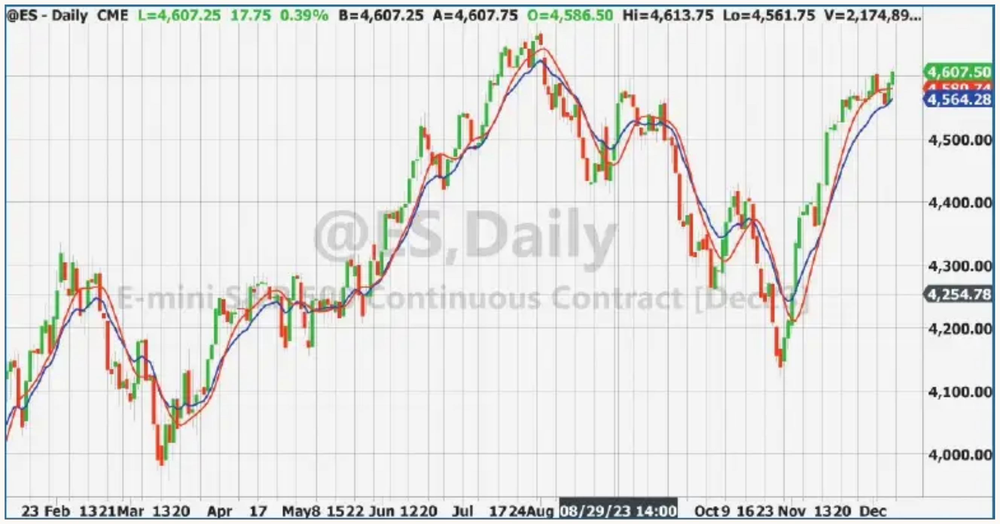
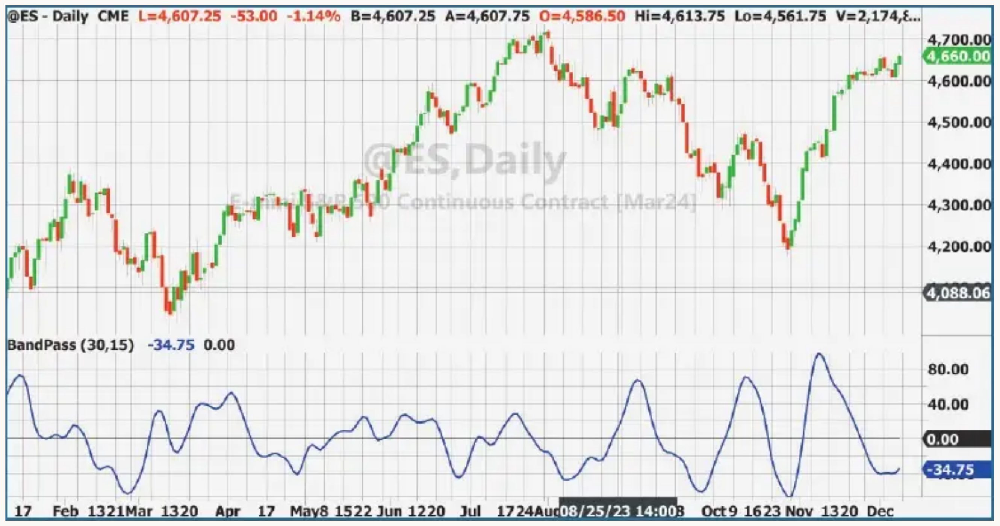
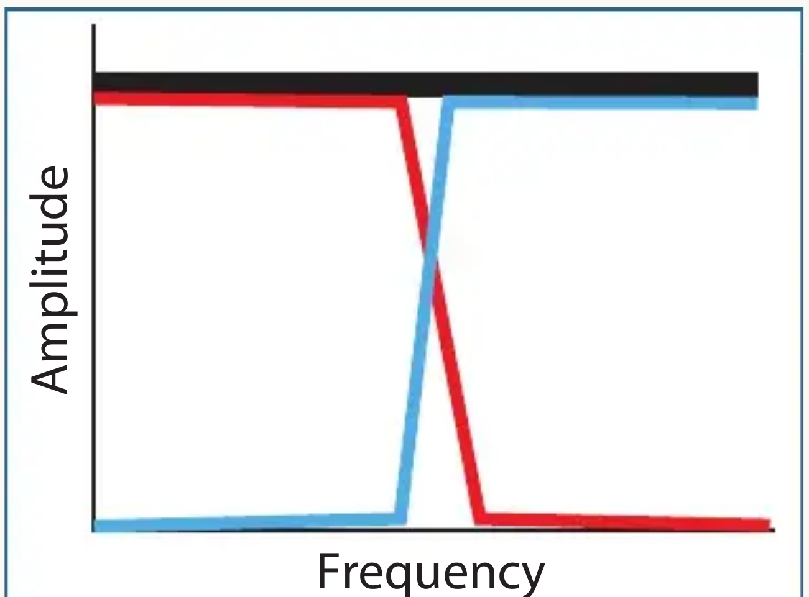
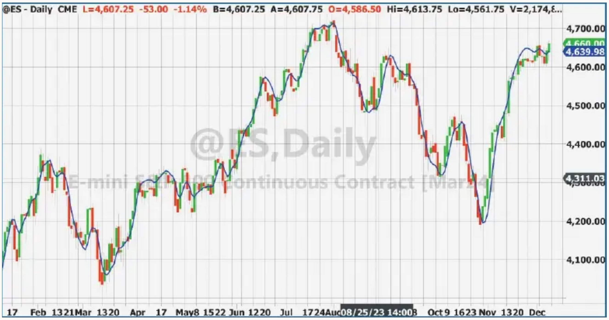

# The Ultimate Smoother

- **Author:** John F. Ehlers
- **Publication:** Technical Analysis of STOCKS & COMMODITIES, Volume 42, April 2024, pp. 8--15
- **Article URL:** [Article PDF](https://technical.traders.com/archive/article.asp?file=\V42\C04\778EHLE.pdf)
- **Traders' Tips URL:** [Traders' Tips, April 2024](https://www.traders.com/Documentation/FEEDbk_docs/2024/04/TradersTips.html)

---

## Digital Signal Processing: Smoothing Data With Less Lag

First, we introduced you to a super smoother. Here, we introduce an ultimate smoother. It's an advancement you won't want to miss.

A smoother is a low-pass filter that passes the low-frequency components of the input data spectrum essentially unchanged and rejects or attenuates the high-frequency components in the data. This rejection of the high-frequency components produces an output waveform that is smoother than the input waveform. Early in my engineering career, I designed filters using real inductors and real capacitors. This experience enabled me to invent the SuperSmoother as well as the UltimateSmoother, which I will describe later in this article.

## SuperSmoother

The SuperSmoother digital filter was translated from an analog filter having a maximally flat Butterworth low-pass response with a reduced lag. The EasyLanguage code for the SuperSmoother is shown in the sidebar, "SuperSmoother Function, In EasyLanguage." Here, it is written as a function so that it can be used in indicators and strategies as easily as a moving average.

The SuperSmoother is a second-order infinite impulse response (IIR) filter, meaning that it uses two previous calculations of the filter output in the current calculation of the filter response. The defining parameter of the SuperSmoother is the critical period. Critical period is the wavelength that divides the pass band and the reject band. Conceptually, think of it being the wavelength where all longer wavelengths are passed unaffected to the output and all shorter wavelengths are completely rejected at the output. Actually, there is a more gradual transition from the pass band to the stop band. The sharpness of this transition, to a greater degree, depends on the order of the IIR filter. For brevity, critical period is the input "period" in the code listing in the "SuperSmoother Function" sidebar.

An exponential moving average (EMA) is a first-order IIR filter, using only one previous calculation. It is a smoother described by the equation:

$$\text{EMA} = \alpha \times \text{Price} + (1 - \alpha) \times \text{EMA}[1]$$

where $\text{EMA}[1]$ is the value of EMA one bar ago.

The performance of an EMA can be compared to the performance of a SuperSmoother by letting alpha be equal to 3 divided by period. The code to plot the comparison of these two smoothers is given in the sidebar, "Plot SuperSmoother And EMA." The comparison chart is shown in Figure 1.


**FIGURE 1: SUPERSMOOTHER.** The SuperSmoother has a better response than an EMA for equivalent lag.

It is obvious that the second-order SuperSmoother (in red) has superior smoothing than a first-order EMA having an equivalent critical period (in blue). It is also obvious that both filters have a lag compared to the input price data. Lag of smoothing filters is a major bane for technical traders. It doesn't help to get the right answer if it comes too late.

It is possible to design higher-order smoothing filters. Higher-order filters sharpen the transition from the pass band to the stop band. However, the penalty is that such filters incur even more lag. Therefore, these higher-order filters are seldom employed in trading. In addition, the calculation of higher-order filters causes floating point errors on many trading platforms. A reasonable approximation to the response of a fourth-order filter without getting a floating-point error is to first filter the data with a SuperSmoother and then filter that result with a SuperSmoother again.

## High-Pass Filter

Low-pass filters are not the only kind of filters that can be employed. A second-order high-pass filter can be created by replacing the zeros in the filter transfer response at Nyquist (twice the sample period) with zeros at zero frequency. That is, the low-frequency components in the input data are rejected at the filter output and the high-frequency components are passed to the output unattenuated. The EasyLanguage code for a high-pass filter function is given in the sidebar, "High-Pass Filter Function, In EasyLanguage."

## Band-Pass Filter

Another kind of filter that can be designed is a band-pass filter. With this type of filter, there is a band of periods that are passed basically unattenuated to the output, periods longer than the lower critical period are rejected, and periods above the upper critical period are also rejected. I have designed several second-order band-pass filters, but I discourage their use because there is a temptation to use a relatively narrow bandwidth with such filters to get an output that looks similar to a sine wave. The sine wave appearance results from the filter passing only a narrow portion of the data spectrum to the output. When the bandwidth is on the order of 25% of the center period or less, the phase shift across the pass band is nearly continuous. The phase response, including the transition bands, approaches 180 degrees. So using such a filter can give fantastic in-phase response for a while. But if the character of the data shifts just a little, the output waveform can give a dead wrong trading signal due to the 180-degree phase shift. Recognizing the shift in the input data is nearly impossible in real time.

A better way to create a band-pass filter response is to use a SuperSmoother with the period set to the upper critical period of the pass band and a high-pass filter with the period set to the lower critical period of the pass band. The separation between the lower critical period and the upper critical period should be at least one octave. This way, the relative phase shift across the pass band is nearly consistent.

The sidebar "Band-Pass Filter, In EasyLanguage" provides an example of such a band-pass filter. The pass band is set to be the octave between a 15-bar cycle period and a 30-bar cycle period. These inputs can be adjusted to obtain the best results for a given set of data. The band-pass filter output is an oscillator-style indicator and can be used directly as an indicator. An example of the filter response is shown in Figure 2.


**FIGURE 2: BAND-PASS FILTER.** The band-pass filter gives an oscillator-style indicator output.

This band-pass filter is superior to a second-order band-pass filter because it provides sharper transitions between the pass band and the stop bands. Think of it this way: The second-order band pass applies one order to the upper filter edge and one order to the lower filter edge, whereas this band-pass filter applies two orders to both the upper and lower band edges.

## UltimateSmoother

Like the band-pass filter, the UltimateSmoother is comprised of two component filters. Smoothing filters always involve lag in their output, and lag is to be avoided if possible. From my analog filter design experience, I know that lower-frequency filters require larger inductors and capacitors, and the lag results from the increased energy required to build up the electric and magnetic fields in these components. Think in terms of big woofer speakers for low-frequency sound and tiny tweeters that produce high-frequency sound. That concept is lost with digital filters, where the filters are just code. But the principle is the same. You know a moving average becomes smoother the longer you make the average. That is the same thing as putting more energy into the filter. You also know that longer moving averages have more lag.

The UltimateSmoother conceptually has zero lag in the pass band and has minimum lag in the transition band because only a high-frequency filter is involved. The idea of the UltimateSmoother is described with reference to the schematic in Figure 3.


**FIGURE 3: DERIVATION OF THE ULTIMATESMOOTHER.** The UltimateSmoother is constructed by subtracting the high-pass filter response (blue) from the input data (black). The resulting filter response is shown in red.

The input data is mathematically described as an all-pass filter, shown in black. The response of a high-pass filter is shown in blue. The UltimateSmoother response is a result of subtracting the high-pass response from the all-pass response, and is shown in red. At the very low frequencies, the high-pass filter has virtually no amplitude, and so the result of the subtraction is that the UltimateSmoother output is the same as the input data in terms of both amplitude and lag. On the other hand, the response of the high-pass filter is almost the same as the input data and therefore the filtering is accomplished by cancellation.

> The UltimateSmoother can be applied to any input data, including other indicators.

For the mathematically inclined, the subtraction of the high-pass filter from the all-pass filter transfer function is described in terms of z transforms as:

$$\text{Transfer} = 1 - \frac{c_1 \times (1 - 2 \times z^{-1} + z^{-2})}{1 - c_2 \times z^{-1} - c_3 \times z^{-2}}$$

Putting over a common denominator, the transfer function in closed form is:

$$\text{Transfer} = \frac{(1 - c_1) + (2 c_1 - c_2) \times z^{-1} - (c_1 + c_3) \times z^{-2}}{1 - c_2 \times z^{-1} - c_3 \times z^{-2}}$$

This transfer function is translated to EasyLanguage code in the sidebar "UltimateSmoother Function, In EasyLanguage" which shows the UltimateSmoother written as a function.

Writing the EasyLanguage code for an UltimateSmoother filter is simple, as shown in the sidebar, "UltimateSmoother Example Filter."

The UltimateSmoother example is plotted in Figure 4. The amazing feature of the UltimateSmoother is that it has zero lag in the pass band. The lack of lag in Figure 4 can be compared to the lag of a SuperSmoother and EMA in Figure 1. In all cases, the critical period was set to 20 bars. The UltimateSmoother can be applied to any input data, including other indicators.


**FIGURE 4: ULTIMATESMOOTHER.** The UltimateSmoother has zero lag in the pass band.

## Conclusions

1. The UltimateSmoother has zero lag in the passband.
2. The UltimateSmoother is created by subtracting the response of a high-pass filter from the input data.
3. The UltimateSmoother output is not quite as smooth as that of the SuperSmoother because filtering is accomplished by cancellation. Amplitude and phase response of the high-pass filter in its pass band is not exactly the same as that of the input data.
4. The SuperSmoother is recommended for use instead of an EMA. In most cases, it can also be used instead of a simple moving average.
5. The best band-pass filter is created by the serial filtering of a high-pass filter and a SuperSmoother.
6. Band-pass filters should have a bandwidth exceeding an octave.
7. Code for the UltimateSmoother, SuperSmoother, and high-pass filter are provided as functions so they can be called as easily as a moving average.
8. The critical period is the defining parameter for filters. The critical period describes the period that separates the pass band from the stop band.

## SuperSmoother Function, In EasyLanguage

```easylanguage
{
    SuperSmoother Function
    (C) 2004-2024 John F. Ehlers
}
Inputs:
    Price(numericseries),
    Period(numericsimple);

Vars:
    a1(0),
    b1(0),
    c1(0),
    c2(0),
    c3(0);

a1 = expvalue(-1.414*3.14159 / Period);
b1 = 2*a1*Cosine(1.414*180 / Period);
c2 = b1;
c3 = -a1*a1;
c1 = 1 - c2 - c3;

If CurrentBar >= 4 Then $SuperSmoother =
    c1*(Price + Price[1]) / 2 + c2*$SuperSmoother[1] +
    c3*$SuperSmoother[2];
If Currentbar < 4 Then $SuperSmoother = Price;
```

## Plot SuperSmoother And EMA

```easylanguage
{
    Plot SuperSmoother And EMA
}
Inputs:
    Length(20);

Vars:
    SS(0),
    EMA(0),
    aa(0);

SS = $SuperSmoother(Close, Length);

aa = 3 / Length;
EMA = aa*Close + (1 - aa)*EMA[1];

Plot1(SS, "", red, 2, 2);
Plot2(EMA, "", blue, 2, 2);
```

## High-Pass Filter Function, In EasyLanguage

```easylanguage
{
    Highpass Function
    (C) 2004-2024 John F. Ehlers
}
Inputs:
    Price(numericseries),
    Period(numericsimple);

Vars:
    a1(0),
    b1(0),
    c1(0),
    c2(0),
    c3(0);

a1 = expvalue(-1.414*3.14159 / Period);
b1 = 2*a1*Cosine(1.414*180 / Period);
c2 = b1;
c3 = -a1*a1;
c1 = (1 + c2 - c3) / 4;

If CurrentBar >= 4 Then $HighPass = c1*(Price - 2*Price[1] +
    Price[2]) + c2*$HighPass[1] + c3*$HighPass[2];
If Currentbar < 4 Then $HighPass = 0;
```

## Band-Pass Filter, In EasyLanguage

```easylanguage
{
    BandPass Filter
}
Inputs:
    LowerPeriod(30),
    UpperPeriod(15);

Vars:
    HP(0),
    BP(0);

HP = $HighPass(Close, LowerPeriod);
BP = $SuperSmoother(HP, UpperPeriod);

Plot1(BP, "", blue, 4, 4);
Plot2(0, "", black, 2, 2);
```

## UltimateSmoother Function, In EasyLanguage

```easylanguage
{
    UltimateSmoother Function
    (C) 2004-2024 John F. Ehlers
}
Inputs:
    Price(numericseries),
    Period(numericsimple);

Vars:
    a1(0),
    b1(0),
    c1(0),
    c2(0),
    c3(0),
    US(0);

a1 = expvalue(-1.414*3.14159 / Period);
b1 = 2*a1*Cosine(1.414*180 / Period);
c2 = b1;
c3 = -a1*a1;
c1 = (1 + c2 - c3) / 4;

If CurrentBar >= 4 Then US = (1 - c1)*Price + (2*c1 -
    c2)*Price[1] - (c1 + c3)*Price[2] + c2*US[1] + c3*US[2];
If CurrentBar < 4 Then US = Price;
$UltimateSmoother = US;
```

## UltimateSmoother Example Filter

```easylanguage
{
    UltimateSmoother Filter
}
Inputs:
    Period(20);

Vars:
    US(0);

US = $UltimateSmoother(Close, Period);

Plot1(US, "", blue, 4, 4);
```

## Further Reading

- Ehlers, John [2014]. "Predictive And Successful Indicators," *Technical Analysis of STOCKS & COMMODITIES*, Volume 32, January.
- Ehlers, John [2004]. *Cybernetic Analysis For Stocks And Futures*, John Wiley & Sons.

## About The Author

John Ehlers is a retired electrical engineer and a retired technical analyst, specializing in the application of DSP (digital signal processing) to trading. For more information, see [www.mesasoftware.com](http://www.mesasoftware.com).

---

The code given in this article is available in the S&C Article Code section of the website, [Traders.com](https://www.traders.com). See the [Traders' Tips](https://www.traders.com/Documentation/FEEDbk_docs/2024/04/TradersTips.html) coding section of the magazine beginning on page 46 for implementation of John Ehlers' technique in various technical analysis programs and trading platforms.

---

## BibTeX

```bibtex
@article{ehlers2024ultimate_smoother,
  author  = {Ehlers, John F.},
  title   = {The Ultimate Smoother},
  journal = {Technical Analysis of STOCKS \& COMMODITIES},
  year    = {2024},
  month   = apr,
  volume  = {42},
  number  = {4},
  pages   = {8--15},
  url     = {https://technical.traders.com/archive/article.asp?file=\V42\C04\778EHLE.pdf}
}

@misc{traders_tips_2024_04,
  author       = {{Technical Analysis of STOCKS \& COMMODITIES}},
  title        = {Traders' Tips, April 2024: The Ultimate Smoother},
  year         = {2024},
  month        = apr,
  howpublished = {online},
  url          = {https://www.traders.com/Documentation/FEEDbk_docs/2024/04/TradersTips.html}
}
```
