# Traders' Tips: The Ultimate Smoother

- **Publication:** Technical Analysis of STOCKS & COMMODITIES, April 2024
- **Article:** "The Ultimate Smoother" by John F. Ehlers
- **Traders' Tips URL:** [Traders' Tips, April 2024](https://www.traders.com/Documentation/FEEDbk_docs/2024/04/TradersTips.html)

---


For this month's Traders' Tips, the focus is John F. Ehlers' article in this issue, "The Ultimate Smoother." Here, we present the April 2024 Traders' Tips code with possible implementations in various software.

The Traders' Tips section is provided to help the reader implement a selected technique from an article in this issue or another recent issue. The entries here are contributed by software developers or programmers for software that is capable of customization.

---

## TradeStation: April 2024

In his article in this issue, "The Ultimate Smoother," John Ehlers introduces an enhanced smoother, termed the UltimateSmoother, as an evolution of his previously developed SuperSmoother. The UltimateSmoother is not limited to price data and can be applied to other indicators.

The $UltimateSmoother function and accompanying indicator are provided here. The UltimateSmoother example filter from Ehlers' article has been slightly modified here to accept a user-defined price as an input.

**Function: $UltimateSmoother** ([tradestation-ultimate-smoother-function.els](tradestation-ultimate-smoother-function.els))

```easylanguage
{
	TASC APR 2024
	UltimateSmoother Function
	(C) 2004-2024 John F. Ehlers
}

inputs:
	Price( numericseries ),
	Period( numericsimple );
	
variables:
	a1( 0 ),
	b1( 0 ),
	c1( 0 ),
	c2( 0 ),
	c3( 0 ),
	US( 0 );
	
a1 = ExpValue(-1.414*3.14159 / Period);
b1 = 2 * a1 * Cosine(1.414*180 / Period);
c2 = b1;
c3 = -a1 * a1;
c1 = (1 + c2 - c3) / 4;

if CurrentBar >= 4 then 
 US = (1 - c1)*Price + (2 * c1 - c2) * Price[1] 
 - (c1 + c3) * Price[2] + c2*US[1] + c3 * US[2];
 
if CurrentBar < 4 then 
	US = Price;

$UltimateSmoother = US;
```

**Indicator: Ultimate Smoother** ([tradestation-ultimate-smoother-indicator.els](tradestation-ultimate-smoother-indicator.els))

```easylanguage
{
	TASC APR 2024
	UltimateSmoother
	(C) 2004-2024 John F. Ehlers
}

inputs:
	Period( 20 ),
	Price( Close );

variables:
	US( 0 );

US = $UltimateSmoother(Price, Period);
Plot1(US, "US");
```

A sample chart is shown in Figure 1.

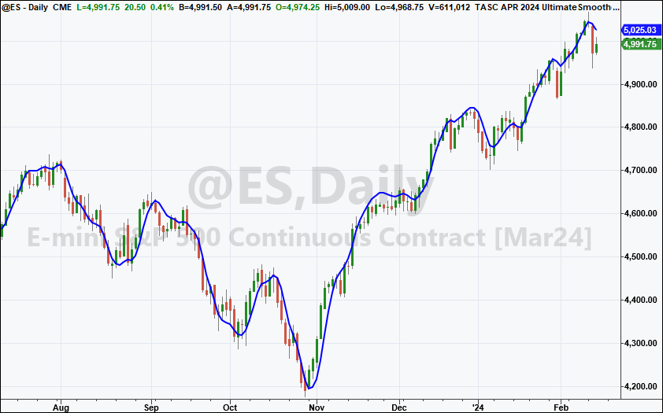
**FIGURE 1: TRADESTATION.** This TradeStation daily chart of the continuous emini S&P 500 futures contract displays a segment from 2023 and 2024 with the UltimateSmoother applied.

This article is for informational purposes. No type of trading or investment recommendation, advice, or strategy is being made, given, or in any manner provided by TradeStation Securities or its affiliates.

--John Robinson, TradeStation Securities, Inc., [www.TradeStation.com](http://www.tradestation.com/)

---

## Wealth-Lab.com: April 2024

In his article in this issue, titled "The Ultimate Smoother," John Ehlers introduces an "EMA killer"--a smoothing indicator with one of its highlights being zero lag in the passband.

To demonstrate how easy it is to verify whether a concept of a trading idea works or not, we can construct a quick-and-dirty system using Wealth-Lab's Building Blocks. Knowing that the UltimateSmoother runs circles around its same-period counterpart, we'll take their bullish and bearish crossovers as entry points for trades. Drag and drop two crossover rules onto the design surface and we're ready:

- **Entry.** UltimateSmoother (Close,20) crosses above the 20-period EMA
- **Exit.** UltimateSmoother (Close,20) crosses under the 20-period EMA

Figure 2 demonstrates prototyping a trading system, which is a simple task for Wealth-Lab 8.

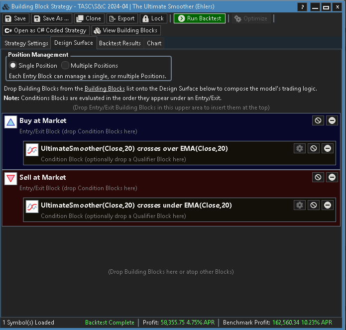
**FIGURE 2: WEALTH-LAB.** This demonstrates prototyping a trading system in Wealth-Lab 8 using its Building Blocks feature.

Freeing our time for something more creative than coding, we sketched a trading system in a few clicks of the mouse. Figure 3 shows characteristic trades in recent uptrends and market corrections. As always, any trading idea should be scrutinized with out-of-sample backtesting and walk-forward optimization.

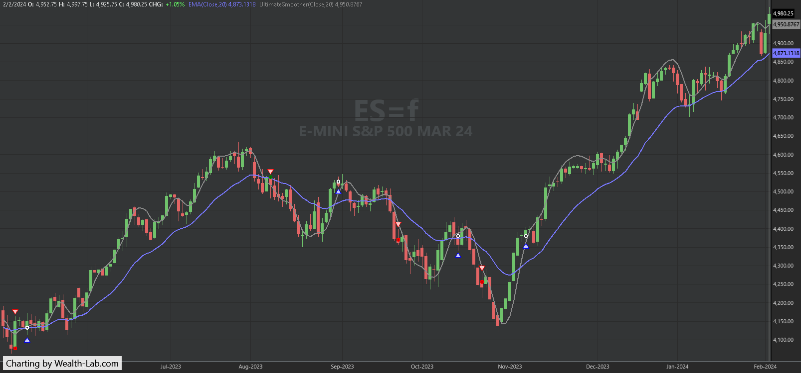
**FIGURE 3: WEALTH-LAB.** Trade signals given by the example trading system based on the UltimateSmoother are applied here to a daily chart of ES=F (emini S&P 500 continuous futures contract). Data provided by Yahoo! Finance.

--Gene Geren (Eugene), Wealth-Lab team, [www.wealth-lab.com](http://www.wealth-lab.com/)

---

## NinjaTrader: April 2024

The UltimateSmoother, which is introduced in the article "The Ultimate Smoother" in this issue by John Ehlers, is available for download at the following link for NinjaTrader 8:

- **NinjaTrader 8:** [www.ninjatrader.com/SC/APRIL2024SCNT8.zip](https://www.ninjatrader.com/SC/APRIL2024SCNT8.zip)

Once the file is downloaded, you can import the indicator into NinjaTrader 8 from within the control center by selecting Tools > Import > NinjaScript Add-On and then selecting the downloaded file for NinjaTrader 8.

You can review the indicator source code in NinjaTrader 8 by selecting the menu New > NinjaScript Editor > Indicators folder from within the control center window and selecting the file.

The NinjaTrader implementation includes four indicators: UltimateSmoother ([ninja-trader/UltimateSmoother.cs](ninja-trader/UltimateSmoother.cs)), SuperSmoother ([ninja-trader/SuperSmoother.cs](ninja-trader/SuperSmoother.cs)), HighPassFilter ([ninja-trader/HighPassFilter.cs](ninja-trader/HighPassFilter.cs)), and BandPassFilter ([ninja-trader/BandPassFilter.cs](ninja-trader/BandPassFilter.cs)).

A chart displaying the indicator is shown in Figure 4.

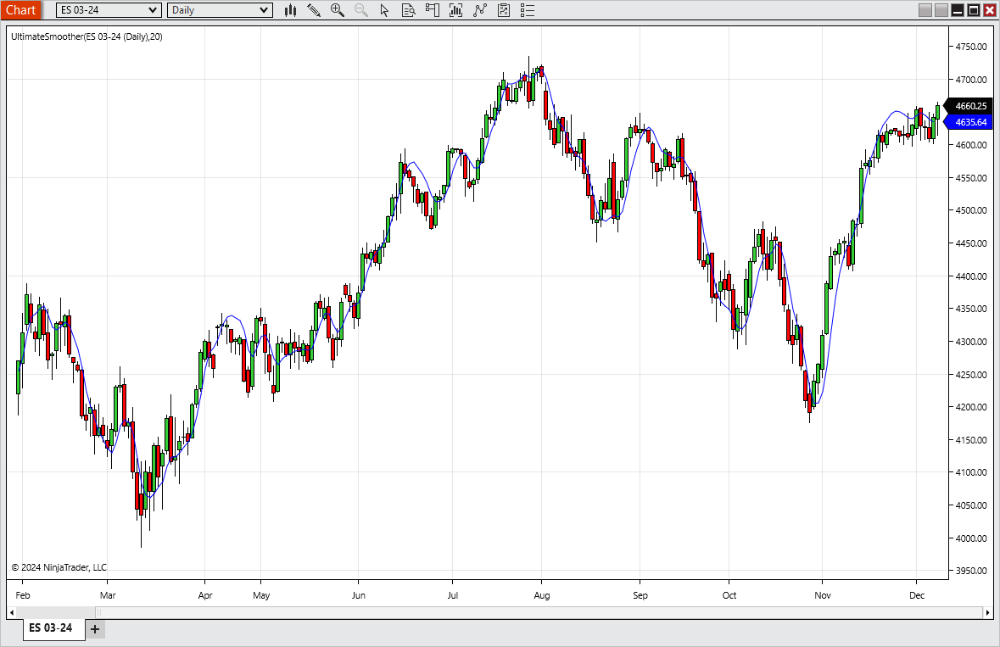
**FIGURE 4: NINJATRADER.** This chart demonstrates the UltimateSmoother on a chart of the continuous emini S&P 500 futures contract.

NinjaScript uses compiled DLLs that run native, not interpreted, to provide you with the highest performance possible.

--NinjaTrader, LLC, [www.ninjatrader.com](http://www.ninjatrader.com/)

---

## TradingView: April 2024

The TradingView Pine Script code shown here implements the UltimateSmoother, a filter introduced in John Ehlers' article in this issue, "The Ultimate Smoother."

([tradingview-ultimate-smoother.pine](tradingview-ultimate-smoother.pine))

```pine
//  TASC Issue: April 2024 - Vol. 42, Issue 4
//     Article: The Ultimate Smoother.
//              Smoothing data with less lag.
//  Article By: John F. Ehlers
//    Language: TradingView's Pine Script™ v5
// Provided By: PineCoders, for tradingview.com


//@version=5
string title  = 'TASC 2024.04 The Ultimate Smoother'
string stitle = 'US'
indicator(title, stitle, true)


// --- Inputs ---
float  src = input.source(close, 'Source Series:')
int period = input.int(      20, 'Critical Period:')


// --- Functions ---
// @function      The UltimateSmoother is a filter created
//                by subtracting the response of a high-pass 
//                filter from that of an all-pass filter.
// @param src     Source series.
// @param period  Critical period.
// @returns       Smoothed series.
UltimateSmoother (float src, int period) =>
    float a1 = math.exp(-1.414 * math.pi / period)
    float c2 = 2.0 * a1 * math.cos(1.414 * math.pi / period)
    float c3 = -a1 * a1
    float c1 = (1.0 + c2 - c3) / 4.0
    float us = src
    if bar_index >= 4
        us := (1.0 - c1) * src + 
              (2.0 * c1 - c2) * src[1] - 
              (c1 + c3) * src[2] + 
              c2 * nz(us[1]) + c3 * nz(us[2])
    us


// --- Plotting ---
plot(UltimateSmoother(src, period), 'US', color.blue, 2)
```

The indicator is available on TradingView from the PineCodersTASC account: [https://www.tradingview.com/u/PineCodersTASC/#published-scripts](https://www.tradingview.com/u/PineCodersTASC/#published-scripts).

An example chart is shown in Figure 5.

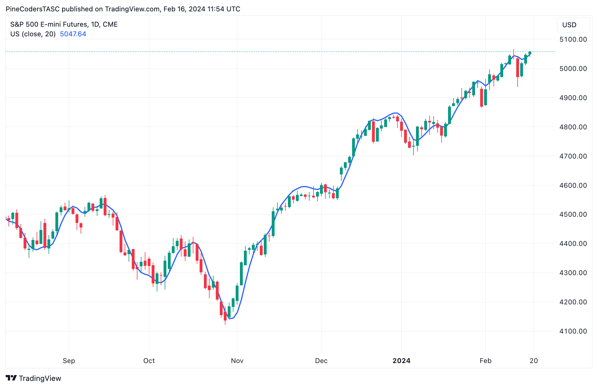
**FIGURE 5: TRADINGVIEW.** This chart demonstrates the UltimateSmoother on a chart of the continuous emini S&P 500 futures contract.

--PineCoders, for TradingView, [www.TradingView.com](http://www.tradingview.com/)

---

## NeuroShell Trader: April 2024

The SuperSmoother, bandpass filter, and UltimateSmoother indicators presented in John Ehlers' article in this issue, "The Ultimate Smoother," can be easily implemented in NeuroShell Trader using NeuroShell Trader's ability to call external dynamic linked libraries. Dynamic linked libraries can be written in C, C++, or Power Basic.

After moving the code given in Ehlers' article to your preferred compiler and creating a DLL, you can insert the resulting indicator as follows:

1. Select "**New Indicator...**" from the **Insert** menu.
2. Choose the **External Program & Library Calls** category.
3. Select the appropriate **External DLL Call** indicator.
4. Set up the parameters to match your DLL.
5. Select the *finished* button.

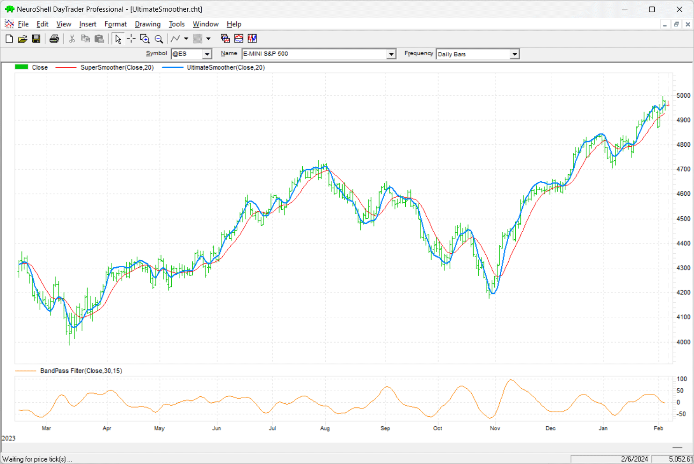
**FIGURE 6: NEUROSHELL TRADER.** This NeuroShell Trader chart shows the SuperSmoother, UltimateSmoother, and bandpass filter on a chart of ES (continuous emini S&P 500 futures contract).

Users of NeuroShell Trader can go to the Stocks & Commodities section of the NeuroShell Trader free technical support website to download a copy of this or any previous Traders' Tips.

--Ward Systems Group, Inc., [sales@wardsystems.com](mailto:sales@wardsystems.com), [www.neuroshell.com](http://www.neuroshell.com/)

---

## RealTest: April 2024

In "The Ultimate Smoother" in this issue, John Ehlers presents several of his smoothing techniques, including his latest technique he named his UltimateSmoother, which builds on and surpasses the SuperSmoother filter he had developed earlier.

The following is coding in text format for use in RealTest (mhptrading.com) to implement the author's technique:

([realtest-ultimate-smoother.txt](realtest-ultimate-smoother.txt))

```text
Parameters:
    period:    20
    
Data:
    // SuperSmoother calculation
    a1:    exp(-1.414*3.14159 / period)
    b1:    2 * a1 * Cosine(1.414*180 / period)
    c2:    b1
    c3:    -a1 * a1
    c1:    1 - c2 - c3
    price:    close
    super:    if(BarNum >= 4, c1 * (Price + Price[1]) / 2 + c2 * super[1] + c3 * super[2], price)

    // UltimateSmoother calculation
    c4:    (1 + c2 - c3) / 4
    ultimate:    if(BarNum >= 4, (1 - c4) * price + (2 * c4 - c2) * price[1] - (c4 + c3) * price[2] + c2 * ultimate[1] + c3 * ultimate[2], price)
    
Charts:
    super:    super
    ultimate:    ultimate
```

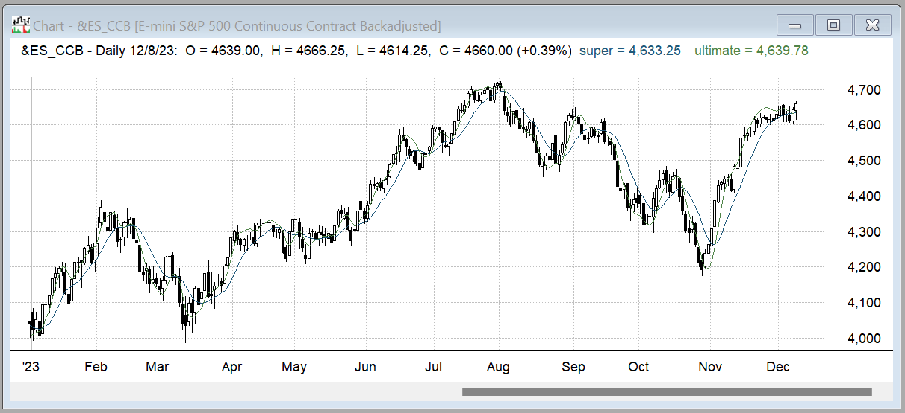
**FIGURE 7: REALTEST.** Here, John Ehlers' UltimateSmoother filter is demonstrated on a chart of ES (continuous emini S&P 500 futures contract).

--Marsten Parker, MHP Trading, [mhptrading.com](http://www.mhptrading.com/), [mhp@mhptrading.com](mailto:mhp@mhptrading.com)

---

## Optuma: April 2024

The Optuma software already includes more than 20 of John Ehlers' tools, including his SuperSmoother filter and bandpass filter ([https://www.optuma.com/kb/optuma/tools/ehlers](https://www.optuma.com/kb/optuma/tools/ehlers)). Users can choose to use and combine these tools to implement and replicate the technique Ehlers describes in his article in this issue, "The Ultimate Smoother." An example chart in Optuma demonstrating his smoothing technique and some of the available tools in Optuma is in Figure 8.

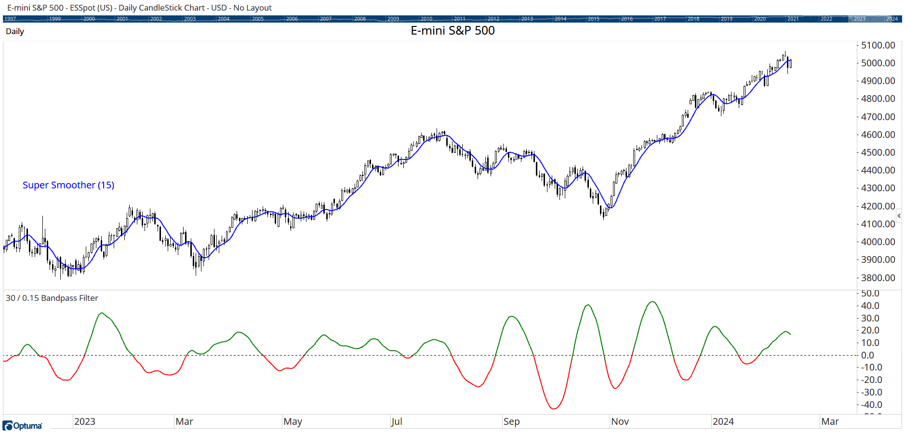
**FIGURE 8: OPTUMA.** This sample chart demonstrates some of the tools available in Optuma to implement John Ehlers' smoothing techniques.

--[support@optuma.com](mailto:support@optuma.com)

---

## The Zorro Platform: April 2024

In his article in this issue, "The Ultimate Smoother," John Ehlers presents several functions for smoothing a price curve without lag, smoothing it even more, and applying a high-pass and band-pass filter. No-lag smoothing, high-pass, and band-pass filters are already available in the indicator library of the Zorro platform. This makes my task easy, since I need only implement Ehlers' latest invention, the ultimate smoother. It achieves its smoothing power by subtracting the high-frequency components from the curve using a high-pass filter.

The function shown here is a straightforward conversion of Ehlers' EasyLanguage code given in his article to C:

([zorro-ultimate-smoother.c](zorro-ultimate-smoother.c))

```c
var UltimateSmoother (var *Data, int Length)
{
  var f = (1.414*PI) / Length;
  var a1 = exp(-f);
  var c2 = 2*a1*cos(f);
  var c3 = -a1*a1;
  var c1 = (1+c2-c3)/4;
  vars US = series(*Data,4);
  return US[0] = (1-c1)*Data[0] + (2*c1-c2)*Data[1] - (c1+c3)*Data[2]
   + c2*US[1] + c3*US[2];
}
```

For comparing lag and smoothing power, we can apply the UltimateSmoother, the SuperSmoother, and a standard EMA to a chart of ES from 2023 using the following code:

([zorro-ultimate-smoother-comparison.c](zorro-ultimate-smoother-comparison.c))

```c
void run() 
{
  BarPeriod = 1440;
  StartDate = 20230201;
  EndDate = 20231201;
  assetAdd("ES","YAHOO:ES=F");
  asset("ES");
  int Length = 30;
  plot("UltSmooth", UltimateSmoother(seriesC(),Length),LINE,MAGENTA);
  plot("Smooth",Smooth(seriesC(),Length),LINE,RED);
  plot("EMA",EMA(seriesC(),3./Length),LINE,BLUE);
}
```

The resulting chart, Figure 9, replicates the chart shown in the article. The EMA is shown in blue, the SuperSmoother filter in red, and the UltimateSmoother in magenta. We can see that the UltimateSmoother indeed produces the best, albeit smoothed, representation of the price curve.

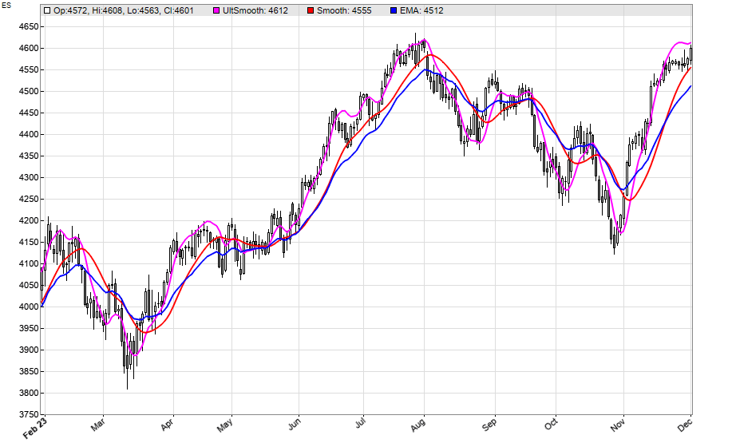
**FIGURE 9: ZORRO.** The EMA is shown in blue, the SuperSmoother filter is in red, and the UltimateSmoother is in magenta on a 2023 chart of ES (continuous emini S&P 500 futures contract).

The code can be downloaded from the 2023 script repository on [https://financial-hacker.com](https://financial-hacker.com/). The Zorro platform can be downloaded from [https://zorro-project.com](https://zorro-project.com/).

--Petra Volkova, The Zorro Project by oP group Germany, [https://zorro-project.com](https://zorro-project.com/)

---

## Microsoft Excel: April 2024

In his article in this issue, "The Ultimate Smoother," John Ehlers takes us another step into his realm of interesting filters as smoothers.

He opens his article with a review of his SuperSmoother filter and compares that with an EMA that uses a nonstandard alpha value calculation of 3 over length.

That led me make the *alpha numerator* into a user control value (cell F17) that we can play with. (It can be quite interesting to see what changing the numerator of *alpha* does to the EMA plot...) See Figure 10, which compares the Ehlers SuperSmoother with an EMA using a custom alpha defined as "3 / length."

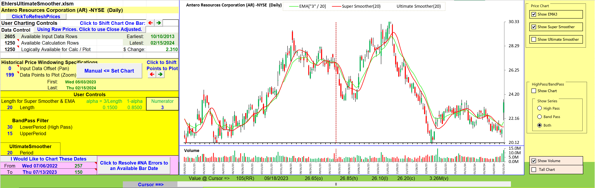
**FIGURE 10: EXCEL.** In this chart, you can compare Ehlers' SuperSmoother filter to an EMA that uses a custom alpha defined as 3 / length.

Next, Ehlers walks us through the lag problem inherent in low-pass filters and offers the alternative of subtracting high-pass filters, with their inherent minimal lag, from our input, thus leaving as a residue our low-pass signal with the same minimal lag as the high-pass filter.

First, I'll show the high-pass output (Figure 11), which tends to reflect our frequent stepwise close differences without the longer trending implications.

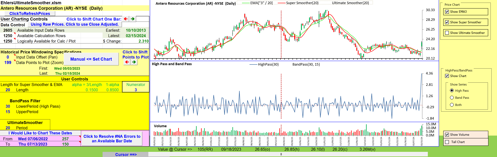
**FIGURE 11: EXCEL.** The high-pass output is shown here. The high-pass result tends to reflect frequent stepwise close differences without the longer trending implications, making the close plot look jittery.

Ehlers refines the output of the high-pass filter with his SuperSmoother to create his band-pass result.

When high-pass and band-pass are plotted on the same chart, as in Figure 12, things get a little messy. To spread things out a bit vertically, I added the "tall chart" option button. Or you may zero in on the band-pass by way of the "band-pass-only" button to the right of the charts.

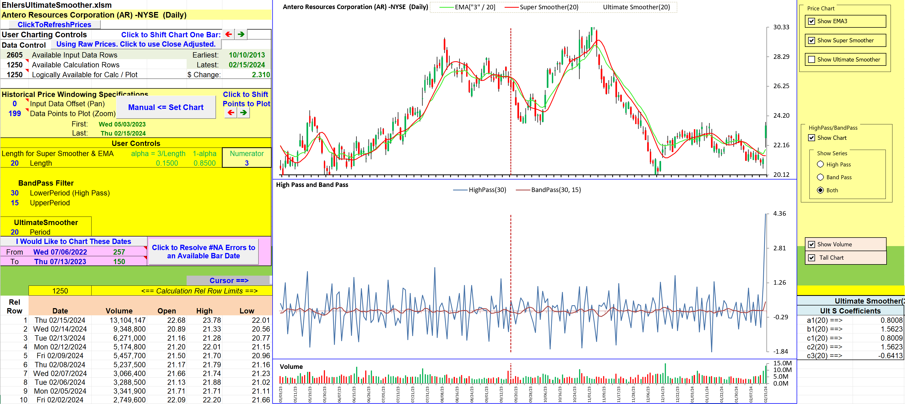
**FIGURE 12: EXCEL.** When the high-pass and band-pass are plotted on the same chart, the chart gets hard to read. As a solution, a "tall chart" option has been custom-added to the spreadsheet as an easy-to-use button you can click to spread out the chart vertically. Alternatively, you can use the button on the right to select to show only the band-pass filter in order to zero in on the band-pass.

In Figure 13, we can see the improved lag and signal fidelity of the UltimateSmoother compared with the SuperSmoother.

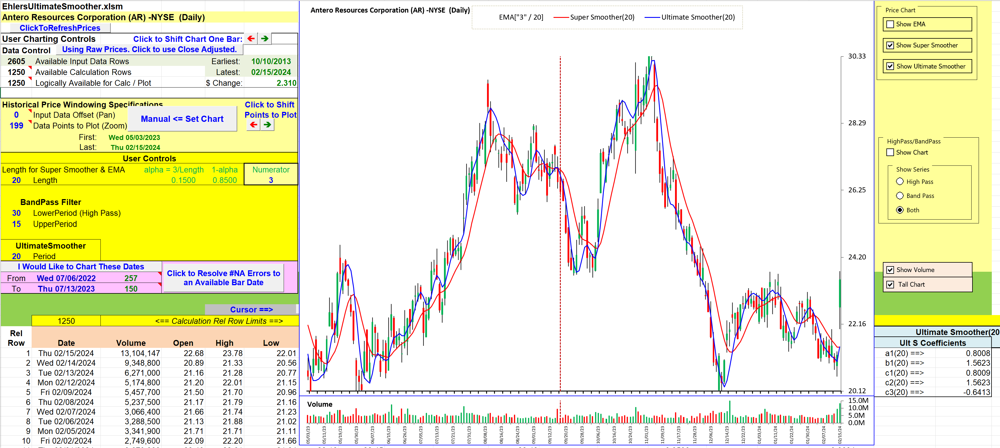
**FIGURE 13: EXCEL.** Here, the SuperSmoother (red line) and UltimateSmoother (blue line) are both plotted on a daily chart of Antero Resources Corp. (AR) for comparison. You can see the improved lag and signal fidelity of the UltimateSmoother compared with the SuperSmoother.

**To download this spreadsheet:** The spreadsheet file for this Traders' Tip can be downloaded [here](http://www.traders.com/Documentation/FEEDbk_docs/2024/04/images/code/EhlersUltimateSmoother.xlsm). To successfully download it, follow these steps:

- Right-click on the [Excel file link](https://www.traders.com/Documentation/FEEDbk_docs/2024/04/images/code/EhlersUltimateSmoother.xlsm), then
- Select "save as" (or "save target as") to place a copy of the spreadsheet file on your hard drive.

--Ron McAllister, Excel and VBA programmer, [rpmac_xltt@sprynet.com](mailto:rpmac_xltt@sprynet.com)

---

Originally published in the April 2024 issue of *Technical Analysis of* STOCKS & COMMODITIES magazine. All rights reserved. Copyright 2024, Technical Analysis, Inc.

---

## BibTeX

```bibtex
@misc{traders_tips_2024_04,
  author       = {{Technical Analysis of STOCKS \& COMMODITIES}},
  title        = {Traders' Tips, April 2024: The Ultimate Smoother},
  year         = {2024},
  month        = apr,
  howpublished = {online},
  url          = {https://www.traders.com/Documentation/FEEDbk_docs/2024/04/TradersTips.html}
}
```
