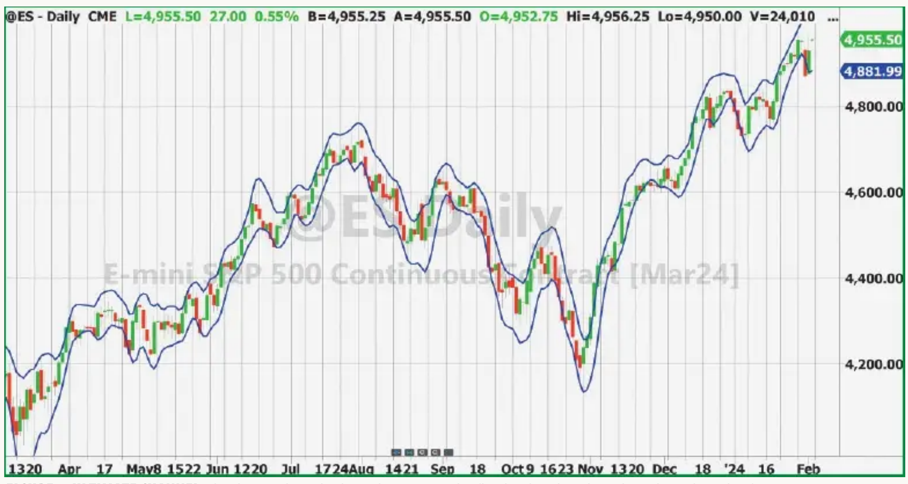
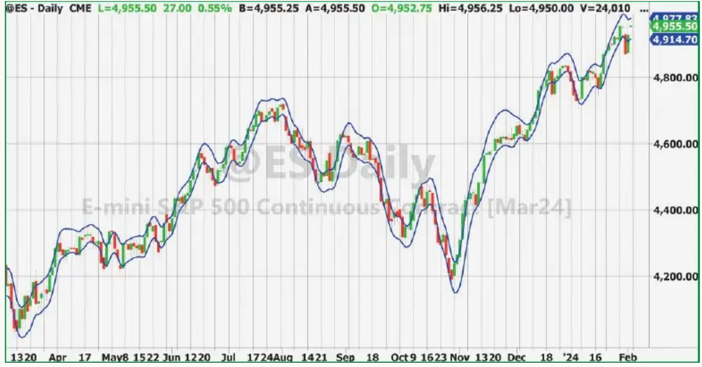

# Ultimate Channels And Ultimate Bands

- **Author:** John F. Ehlers
- **Publication:** Technical Analysis of STOCKS & COMMODITIES, Volume 42, May 2024, pp. 9--11
- **Article URL:** [Article PDF](https://technical.traders.com/archive/article.asp?file=\V42\C05\791EHLE.pdf)
- **Traders' Tips URL:** [Traders' Tips, May 2024](https://www.traders.com/Documentation/FEEDbk_docs/2024/05/TradersTips.html)

---

## Digital Signal Processing: Getting The Lag Out Of Two Classic Indicators

Last time, we introduced an advancement in quantitative analysis for smoothing data with less lag: a new filter called the UltimateSmoother. Here, we show you how you can put it to use in your indicators.

A key element in the construction of Keltner channels and Bollinger Bands is the use of moving averages to determine the nominal center of their ranges. Use of moving averages in the indicators introduces lag, and lag leads to delayed entry and exit signals.

In my April 2024 article in this magazine I presented the UltimateSmoother technique I developed. In that article, I described its advantages for smoothing data with less lag and I detailed its construction.

In this article, I explore the use of the UltimateSmoother, instead of using moving averages, to mitigate indicator lag.

## Ultimate Channel

The Keltner channel uses an exponential moving average (EMA) to determine the center of the channel and average true range (ATR) to establish the width of the channel. The ATR has lag due to averaging as well as the lag due to the EMA. With reference to the code listing in the sidebar "The Ultimate Channel Indicator, In EasyLanguage," both averages are replaced with UltimateSmoothers.

The true high (TH) is the close of the previous bar if it is higher than the high of the current bar, otherwise it is the high of the current bar. Similarly, the true low (TL) is the close of the previous bar if it is lower than the low of the current bar, otherwise it is the low of the current bar. The true range is the difference between the true high and the true low.

Rather than compute the ATR, the code mitigates lag by computing the smooth true range (STR) using the UltimateSmoother function. For flexibility, the length of the data used to compute the STR is an input variable. The upper channel value is computed as the UltimateSmoother of closes plus the STR times the input multiplier. Similarly, the lower channel value is computed as the UltimateSmoother of closes minus the STR times the input multiplier.

An example of the ultimate channel indicator is shown in Figure 1, where both length and STRLength are set to 20 and the NumSTRs is set to 1. Clearly, the channel has nearly zero lag. The channel limits can be smoothed by increasing the input length parameter. Doing this will modestly increase the indicator lag.


**FIGURE 1: ULTIMATE CHANNEL.** The ultimate channel indicator has minimum lag (less lag than the Keltner channel, not shown here).

## Ultimate Bands

Bollinger Bands use a simple moving average to determine the center of the band and the standard deviations from it to establish the indicator band. Both increase the lag of the indicator. With reference to the code listing in the sidebar "The Ultimate Band Indicator, In EasyLanguage," both averages are replaced with UltimateSmoothers.

Smooth is the center of the indicator band. It is computed using the UltimateSmoother function. The deviation at each data sample is the difference between smooth and the close at that data point. The standard deviation (SD) is computed as the square root of the average of the squares of the individual deviations. The bands are computed as smooth plus or minus the input variable NumSDs times the SDs.

An example of the ultimate band indicator is shown in Figure 2, where the length is set to 20 and the NumSDs is set to 1. Clearly, the indicator band has nearly zero lag. The band limits can be smoothed by increasing the input length parameter. Doing this will modestly increase the indicator lag. Interestingly, the ultimate band indicator does not differ from the ultimate channel indicator in any major fashion.


**FIGURE 2: ULTIMATE BAND.** The ultimate band also has minimum lag (less lag than Bollinger Bands, not shown here).

## Use And Application

The ultimate channel and ultimate band indicators can be used about the same way Keltner channels and Bollinger Bands are used to interpret price action. There is sufficient variation in the indicator displays over a wide range of instruments through the use of the input variables to make the indicators be a useful addition to your technical trading library. The main difference is that indicator lag is greatly reduced compared to the standard indicators.

A simple trading strategy is to hold a position in the direction of the UltimateSmoother and exit that position when the price pops outside the channel or band in the opposite direction. This is basically a trend-following strategy with an automatic following stop.

## The Ultimate Channel Indicator, In EasyLanguage

```easylanguage
{
Ultimate Channel
(c) 2024 John F. Ehlers
}

Inputs:
    STRLength(20),
    Length(20),
    NumSTRs(1);

Vars:
    TH(0),
    TL(0),
    ROC(0),
    STR(0),
    UpperChnl(0),
    LowerChnl(0);

If Close[1] > High Then TH = Close[1] Else TH = High;
If Close[1] < Low Then TL = Close[1] Else TL = Low;
STR = $UltimateSmoother(TH - TL, STRLength);
UpperChnl = $UltimateSmoother(Close, Length) + NumSTRs*STR;
LowerChnl = $UltimateSmoother(Close, Length) - NumSTRs*STR;
Plot1(UpperChnl, "", Blue, 4, 4);
Plot2(LowerChnl, "", Blue, 4, 4);
```

## The Ultimate Band Indicator, In EasyLanguage

```easylanguage
{
Ultimate Bands
(c) 2024 John F. Ehlers
}

Inputs:
    Length(20),
    NumSDs(1);

Vars:
    Smooth(0),
    Sum(0),
    count(0),
    SD(0),
    UpperBand(0),
    LowerBand(0);

Smooth = $UltimateSmoother(Close, Length);

Sum = 0;
For count = 0 to Length - 1 Begin
    Sum = Sum + (Close[count] - Smooth[count])*(Close[count] - Smooth[count]);
End;
If Sum <> 0 Then SD = SquareRoot(Sum / Length);
UpperBand = Smooth + NumSDs*SD;
LowerBand = Smooth - NumSDs*SD;
Plot1(UpperBand, "", Blue, 4, 4);
Plot2(LowerBand, "", Blue, 4, 4);
```

## Further Reading

- Ehlers, John [2024]. "The Ultimate Smoother," *Technical Analysis of STOCKS & COMMODITIES*, Volume 42, April.
- Ehlers, John [2014]. "Predictive And Successful Indicators," *Technical Analysis of STOCKS & COMMODITIES*, Volume 32, January.
- Ehlers, John [2004]. *Cybernetic Analysis For Stocks And Futures*, John Wiley & Sons.

## About The Author

John Ehlers is a retired electrical engineer and a retired technical analyst, specializing in the application of DSP (digital signal processing) to trading. For more information, see [www.mesasoftware.com](http://www.mesasoftware.com).

---

The code given in this article is available in the S&C Article Code section of the website, [Traders.com](https://www.traders.com). See the [Traders' Tips](https://www.traders.com/Documentation/FEEDbk_docs/2024/05/TradersTips.html) coding section of the magazine beginning on page 42 for implementation of John Ehlers' technique in various technical analysis programs and trading platforms.

---

## BibTeX

```bibtex
@article{ehlers2024ultimate_channels,
  author  = {Ehlers, John F.},
  title   = {Ultimate Channels And Ultimate Bands},
  journal = {Technical Analysis of STOCKS \& COMMODITIES},
  year    = {2024},
  month   = may,
  volume  = {42},
  number  = {5},
  pages   = {9--11},
  url     = {https://technical.traders.com/archive/article.asp?file=\V42\C05\791EHLE.pdf}
}

@misc{traders_tips_2024_05,
  author       = {{Technical Analysis of STOCKS \& COMMODITIES}},
  title        = {Traders' Tips, May 2024: Ultimate Channels And Ultimate Bands},
  year         = {2024},
  month        = may,
  howpublished = {online},
  url          = {https://www.traders.com/Documentation/FEEDbk_docs/2024/05/TradersTips.html}
}
```
