# Traders' Tips: Ultimate Channels And Ultimate Bands

- **Publication:** Technical Analysis of STOCKS & COMMODITIES, May 2024
- **Article:** "Ultimate Channels And Ultimate Bands" by John F. Ehlers
- **Traders' Tips URL:** [Traders' Tips, May 2024](https://www.traders.com/Documentation/FEEDbk_docs/2024/05/TradersTips.html)

---

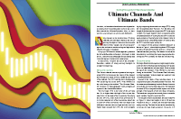

For this month's Traders' Tips, the focus is John F. Ehlers' article in this issue, "Ultimate Channels And Ultimate Bands." Here, we present the May 2024 Traders' Tips code with possible implementations in various software.

The Traders' Tips section is provided to help the reader implement a selected technique from an article in this issue or another recent issue. The entries here are contributed by software developers or programmers for software that is capable of customization.

---

## TradeStation: May 2024

In his article in this issue, "Ultimate Channels And Ultimate Bands," John Ehlers builds on his prior work of the Ultimate Smoother, this time demonstrating its practical application to create two new indicators. The first example draws upon Keltner channels, while the second draws upon Bollinger Bands. In both instances, he showcases the replacement of the conventional moving average with the UltimateSmoother.

The two indicators, along with the $UltimateSmoother function, are shown here:

**Indicator: Ultimate Channel** ([tradestation-ultimate-channel.els](tradestation-ultimate-channel.els))

```easylanguage
{
	TASC MAY 2024
	Ultimate Channel
	(c) 2024 John F. Ehlers
}

inputs:
	STRLength( 20 ),
	Length( 20 ),
	NumSTRs( 1 );
	
variables:
	TH( 0 ),
	TL( 0 ),
	ROC( 0 ),
	STR( 0 ),
	UpperChnl( 0 ),
	LowerChnl( 0 );

if Close[1] > High then 
	TH = Close[1] 
else 
	TH = High;

if Close[1] < Low then 
	TL = Close[1] 
else 
	TL = Low;
	
STR = $UltimateSmoother(TH - TL, STRLength);

UpperChnl = $UltimateSmoother(Close, Length) 
 + NumSTRs * STR;

LowerChnl = $UltimateSmoother(Close, Length) 
 - NumSTRs * STR;

Plot1(UpperChnl, "Upper Channel");
Plot2(LowerChnl, "Lower Channel");
```

**Indicator: Ultimate Bands** ([tradestation-ultimate-bands.els](tradestation-ultimate-bands.els))

```easylanguage
{
	TASC MAY 2024
	Ultimate Bands
	(c) 2024 John F. Ehlers
}

inputs:
	Length( 20 ),
	NumSDs( 1 );
	
variables:
	Smooth( 0 ),
	Sum( 0 ),
	Count( 0 ),
	SD( 0 ),
	UpperBand( 0 ),
	LowerBand( 0 );
	
Smooth = $UltimateSmoother(Close, Length);
Sum = 0;
	
for Count = 0 to Length - 1 
begin
	Sum = Sum + (Close[Count] 
	 - Smooth[Count]) * (Close[Count] - Smooth[Count]);
end;

if Sum <> 0 then 
	SD = SquareRoot(Sum / Length);

UpperBand = Smooth + NumSDs * SD;
LowerBand = Smooth - NumSDs * SD;

Plot1(UpperBand, "Upper Band");
Plot2(LowerBand, "Lower Band");
```

**Function: $UltimateSmoother** ([tradestation-ultimate-smoother.els](tradestation-ultimate-smoother.els))

```easylanguage
{
	TASC APR 2024
	UltimateSmoother Function
	(C) 2004-2024 John F. Ehlers
}

inputs:
	Price( numericseries ),
	Period( numericsimple );
	
variables:
	a1( 0 ),
	b1( 0 ),
	c1( 0 ),
	c2( 0 ),
	c3( 0 ),
	US( 0 );
	
a1 = ExpValue(-1.414*3.14159 / Period);
b1 = 2 * a1 * Cosine(1.414*180 / Period);
c2 = b1;
c3 = -a1 * a1;
c1 = (1 + c2 - c3) / 4;

if CurrentBar >= 4 then 
 US = (1 - c1)*Price + (2 * c1 - c2) * Price[1] 
 - (c1 + c3) * Price[2] + c2*US[1] + c3 * US[2];
 
if CurrentBar < 4 then 
	US = Price;

$UltimateSmoother = US;
```

Sample charts are shown in Figures 1 & 2.

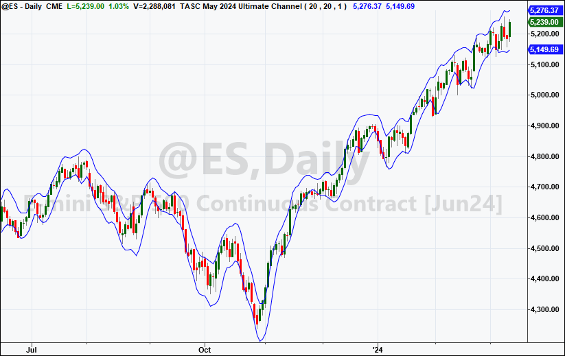
**FIGURE 1: TRADESTATION.** This TradeStation daily chart of the continuous emini S&P (@ES) demonstrates the ultimate channel indicator applied.

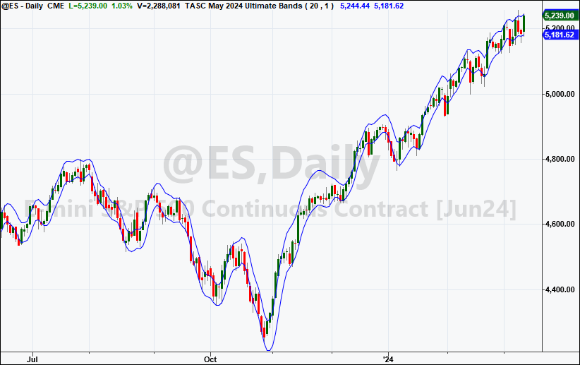
**FIGURE 2: TRADESTATION.** This TradeStation daily chart of the continuous emini S&P (@ES) demonstrates the ultimate bands indicator applied.

*This article is for informational purposes. No type of trading or investment recommendation, advice, or strategy is being made, given, or in any manner provided by TradeStation Securities or its affiliates.*

--John Robinson, TradeStation Securities, Inc., [www.TradeStation.com](http://www.tradestation.com/)

---

## Wealth-Lab.com: May 2024

I must say, I was a little reluctant to include these ultimate indicators, since by being "ultimate" they may finally signify the end of John Ehlers' two-decade effort in the coding of technical indicators! But then, I realized that even software applications that purport to be bug-free can somehow still have remarkably long change logs ... so hopefully, we will continue to enjoy more work from Ehlers.

In his article in this issue, titled "Ultimate Channels And Ultimate Bands," Ehlers offers two examples of implementing his UltimateSmoother indicator, an indicator that was introduced in his article last month in this magazine.

These newly implemented indicators are now available to any of the various tools across Wealth-Lab.

Therefore, we can implement and test the trend-following trading strategy that Ehlers mentions as an example in his article. Its rules are to "hold a position in the direction of the UltimateSmoother and exit that position when the price pops outside the channel or band in the opposite direction."

With the building blocks feature of Wealth-Lab 8, trading system development is almost as effortless as asking an AI-powered language model to do it. The proposed idea comes down to the outline of the process you see in Figure 3:

- **Entry.** Buy at market next bar when high crosses above UltimateSmoother (Close,20).
- **Exit.** Sell at market next bar either low crosses below UltimateBandLower (Close,20,2.0) or Close crosses under UltimateChannelLower(20,20,2.0).

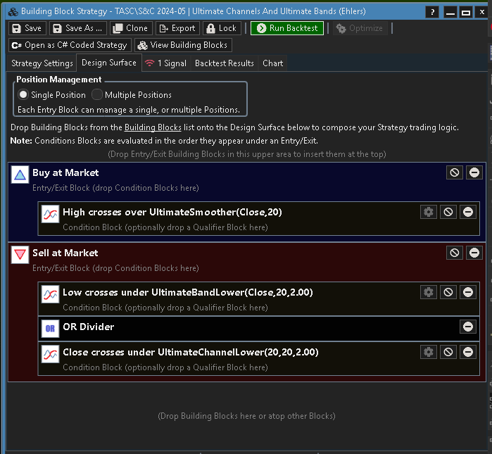
**FIGURE 3: WEALTH-LAB.** The example trading system's two exit rules implement an automatic following stop.

In Figure 4, you can see some sample trades using the emini S&P 500 futures market as an example.

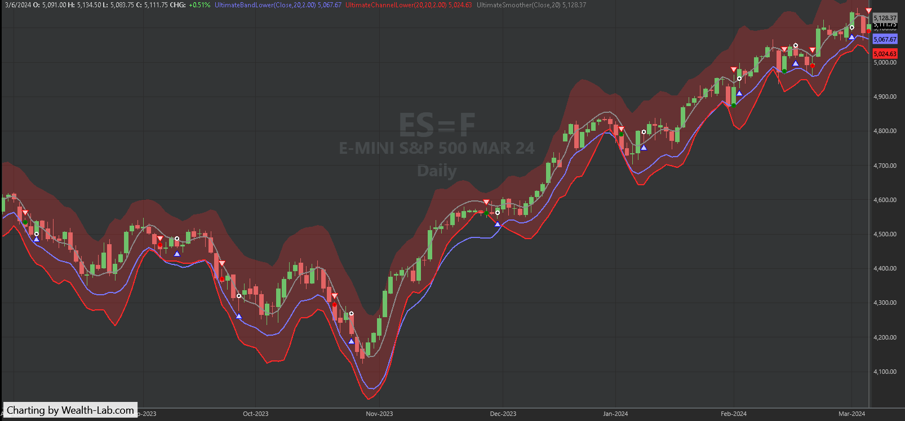
**FIGURE 4: WEALTH-LAB.** Here you can see some sample trades taken by the system applied to a daily chart of ES=F (emini S&P 500 continuous futures contract). Data provided by Yahoo! Finance.

--Gene Geren (Eugene), Wealth-Lab team, [www.wealth-lab.com](http://www.wealth-lab.com/)

---

## NinjaTrader: May 2024

The ultimate channel and ultimate bands indicators, which are described in the article "Ultimate Channels And Ultimate Bands" in this issue by John Ehlers, are available for download at the following link for NinjaTrader 8:

- **NinjaTrader 8:** [www.ninjatrader.com/SC/MAY2024SCNT8.zip](https://www.ninjatrader.com/SC/MAY2024SCNT8.zip)

Once the file is downloaded, you can import the indicator into NinjaTrader 8 from within the control center by selecting Tools > Import > NinjaScript Add-On and then selecting the downloaded file for NinjaTrader 8.

You can review the indicator source code in NinjaTrader 8 by selecting the menu New > NinjaScript Editor > Indicators folder from within the control center window and selecting the file.

Sample charts demonstrating the two indicators are shown in Figures 5 and 6.

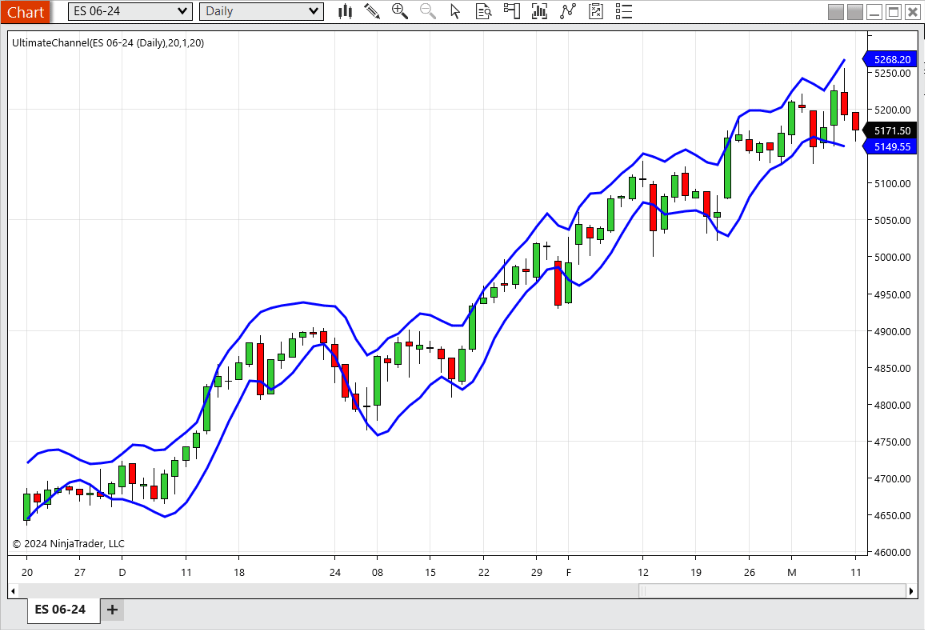
**FIGURE 5: NINJATRADER.** This chart demonstrates the ultimate channel indicator on a chart of the continuous emini S&P 500 futures contract.

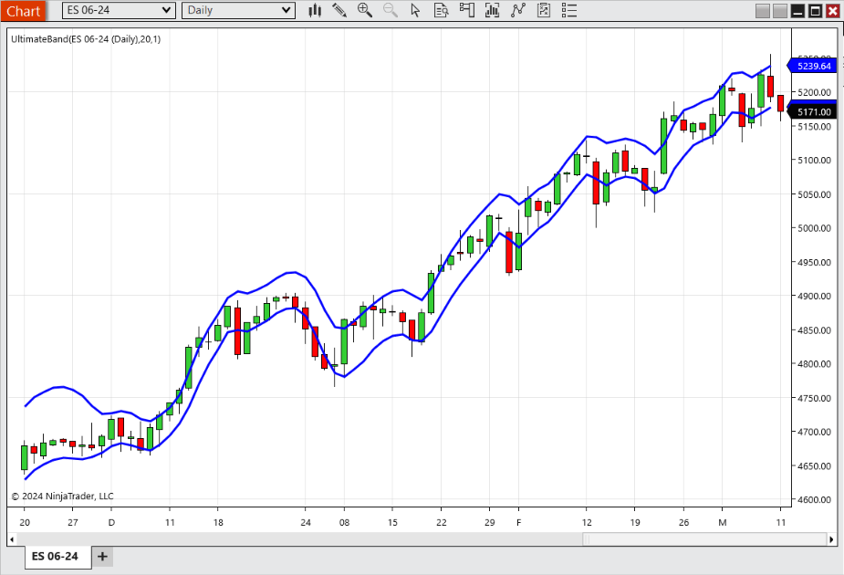
**FIGURE 6: NINJATRADER.** This chart demonstrates the ultimate bands indicator on a chart of the continuous emini S&P 500 futures contract.

NinjaScript uses compiled DLLs that run native, not interpreted, to provide you with the highest performance possible.

--NinjaTrader, LLC, [www.ninjatrader.com](http://www.ninjatrader.com/)

---

## TradingView: May 2024

The TradingView Pine Script code provided here implements indicators based on the concepts of Keltner channels and Bollinger Bands, as discussed in John Ehlers' article in this issue, titled "Ultimate Channels And Ultimate Bands." In the article, he replaces the traditional moving averages with his UltimateSmoother to mitigate lag in the indicators.

The UltimateSmoother function was introduced in Ehlers' April 2024 article in this magazine.

The TradingView Pine Script code implementing the two example indicators, *ultimate channels* and *ultimate bands*, is as follows. Example charts showing the ultimate channels and ultimate bands indicators are shown in Figure 7.

([tradingview-ultimate-channels-bands.pine](tradingview-ultimate-channels-bands.pine))

```pine
//  TASC Issue: May 2024 - Vol. 42, Issue 5
//     Article: Ultimate Channels And Ultimate Bands
//              Getting The Lag Out Of Two Classic Indicators
//  Article By: John F. Ehlers
//    Language: TradingView's Pine Script™ v5
// Provided By: PineCoders, for tradingview.com


//@version=5
title  = 'TASC 2024.05 Ultimate Channels and Ultimate Bands'
stitle = 'UCUB'
indicator(title, stitle, true)


// --- Inputs ---
string M00  = 'Channel'
string M01  = 'Bands'
string mode       = input.string(M00, 'Mode:', [M00, M01]) 
int    length0    = input.int(20,     'Length:')
int    length1    = input.int(20,     'STR Length:')
float  multiplier = input.float(1.0,  'Width Multiplier:')


// --- Functions ---
// @function Applies the UltimateSmoother filter.
// @param    src        Source series.
// @param    period     Critical period.
// @returns  us         Smoothed series.
UltimateSmoother (float src, int period) =>
    float a1 = math.exp(-1.414 * math.pi / period)
    float c2 = 2.0 * a1 * math.cos(1.414 * math.pi / period)
    float c3 = -a1 * a1
    float c1 = (1.0 + c2 - c3) / 4.0
    float us = src
    if bar_index >= 4
        us := (1.0 - c1) * src + 
              (2.0 * c1 - c2) * src[1] - 
              (c1 + c3) * src[2] + 
              c2 * nz(us[1]) + c3 * nz(us[2])
    us


// @function Uses the UltimateSmoother to calculate
//           the center of the channel and the smooth
//           true range (STR) that defines the width.
// @param    length     Critical period for the center.
// @param    lengthSTR  Critical period for the STR.
// @param    mult       STR multiplier.
// @returns  tuple      Upper and lower channel series.
UltimateChannel(int length, int lengthSTR, float mult) =>
    float mid = UltimateSmoother(close, length)
    float str = UltimateSmoother(ta.tr,lengthSTR) * mult
    [mid + str, mid - str]


// @function Uses the UltimateSmoother to calculate
//           the center of the band.
// @param    length     Critical period.
// @param    mult       Standard deviation multiplier.
// @returns  tuple      Upper and lower band series.
UltimateBands(float src, int length, float mult) =>
    float mid = UltimateSmoother(src, length)
    float sd  = ta.stdev(src - mid, length) * mult
    [mid + sd, mid - sd]


// --- Calculations ---
[uc, lc] = if mode == M00
    UltimateChannel(length0, length1, multiplier)
else
    UltimateBands(close, length0, multiplier)


// --- Plotting ---
u = plot(uc, 'Upper', color.rgb(30, 150, 250), 2)
l = plot(lc, 'Lower', color.rgb(30, 150, 250), 2)
fill(u, l,  color.rgb(30, 150, 250, 95))
```

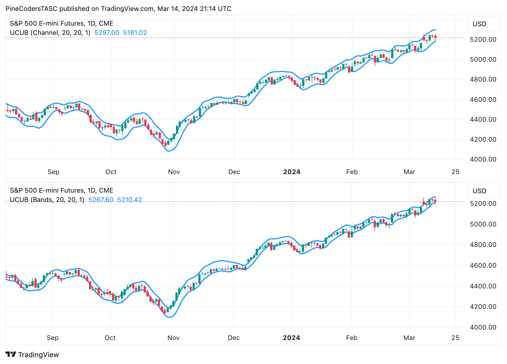
**FIGURE 7: TRADINGVIEW.** The ultimate channel indicator (top) and band indicator (bottom) is applied here to a daily chart of the emini S&P 500 futures contract.

The indicators are available on TradingView from the PineCodersTASC account: [https://www.tradingview.com/u/PineCodersTASC/#published-scripts](https://www.tradingview.com/u/PineCodersTASC/#published-scripts)

--PineCoders, for TradingView, [www.TradingView.com](http://www.tradingview.com/)

---

## NeuroShell Trader: May 2024

The ultimate channel and ultimate band indicators, as described in John Ehlers' article in this issue titled "Ultimate Channels And Ultimate Bands," can be easily implemented using a few of NeuroShell Trader's 800+ indicators. Simply select "new indicator..." from the *insert* menu and use the indicator wizard to create the following indicators:

```
STR:           UltimateSmoother(Sub(Max2(Lag(Close,1),High),Min2(Lag(Close,1),Low)),20)
UpperChannel:  Add2(UltimateSmoother(Close,20), Mul2(1, STR))
LowerChannel:  Subtract(UltimateSmoother(Close,20), Mul2(1, STR))

SD:            SqrRt(Avg(Pow(Sub(Close,UltimateSmoother(Close,20)),2),20))
UpperBand:     Add2(UltimateSmoother(Close,20), Mul2(1,SD))
LowerBand:     Subtract(UltimateSmoother(Close,20), Mul2(1,SD))
```

Note that the UltimateSmoother used here is from Ehlers' article in the April 2024 issue and found in our Traders' Tip from that issue.

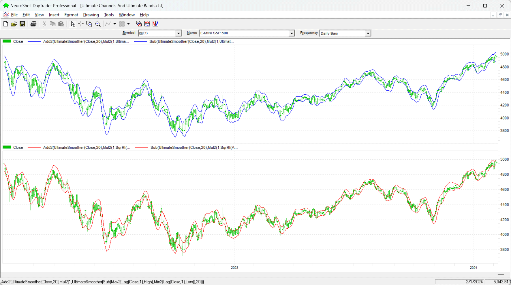
**FIGURE 8: NEUROSHELL TRADER.** This sample NeuroShell Trader chart demonstrates the ultimate channel and ultimate band indicators.

Users of NeuroShell Trader can go to the Stocks & Commodities section of the NeuroShell Trader free technical support website to download a copy of this or any previous Traders' Tips.

--Ward Systems Group, Inc., [sales@wardsystems.com](mailto:sales@wardsystems.com), [www.neuroshell.com](http://www.neuroshell.com/)

---

## RealTest: May 2024

In the article "Ultimate Channels And Ultimate Bands" in this issue, John Ehlers follows up his article last month that presented an ultimate smoothing function. This time, he offers two examples of using his UltimateSmoother in indicators. The first example is based on Keltner channels and the second example is based on the Bollinger Bands concept. In both examples, he replaces the traditional moving average with the UltimateSmoother.

The following is coding in text format for use in RealTest ([mhptrading.com](http://mhptrading.com/)) to implement the author's technique.

([realtest-ultimate-channels-bands.rtest](realtest-ultimate-channels-bands.rtest))

```realtest
Import:
	DataSource:	Norgate
	IncludeList:	&ES_CCB
	StartDate:	2/1/23
	EndDate:	2/1/24
	SaveAs:	es.rtd

Settings:
	DataFile:	es.rtd
	BarSize:	Daily

Parameters:
	Len:	20
	NumSTRs:	1
	NumSDs:	1

Data:
	// General calculations (independent of item being smoothed)
	a1:	exp(-1.414*3.14159 / Len)
	b1:	2 * a1 * Cosine(1.414*180 / Len)
	c2:	b1
	c3:	-a1 * a1
	c1:	1 - c2 - c3
	c4:	(1 + c2 - c3) / 4

	// UltimateSmoother of Close
	ult_sm_close:	if(BarNum >= 4, (1 - c4) * Close + (2 * c4 - c2) * Close[1] - (c4 + c3) * Close[2] + c2 * ult_sm_close[1] + c3 * ult_sm_close[2], Close)

	// UltimateSmoother of True Range
	ult_sm_tr:	if(BarNum >= 4, (1 - c4) * TR + (2 * c4 - c2) * TR[1] - (c4 + c3) * TR[2] + c2 * ult_sm_tr[1] + c3 * ult_sm_tr[2], TR)

	// Ultimate Channel (pseudo Keltner channel)
	ult_kc_upper:	ult_sm_close + NumSTRs * ult_sm_tr
	ult_kc_lower:	ult_sm_close - NumSTRs * ult_sm_tr

	// Ultimate Band (pseudo Bollinger bands)
	ult_bb_upper:	ult_sm_close + NumSDs * StdDev(ult_sm_close, Len)
	ult_bb_lower:	ult_sm_close - NumSDs * StdDev(ult_sm_close, Len)

Charts:
	// Ultimate Channel
	ult_kc_upper:	ult_kc_upper
	ult_kc_lower:	ult_kc_lower

	// Ultimate Band
	ult_bb_upper:	ult_bb_upper
	ult_bb_lower:	ult_bb_lower
```

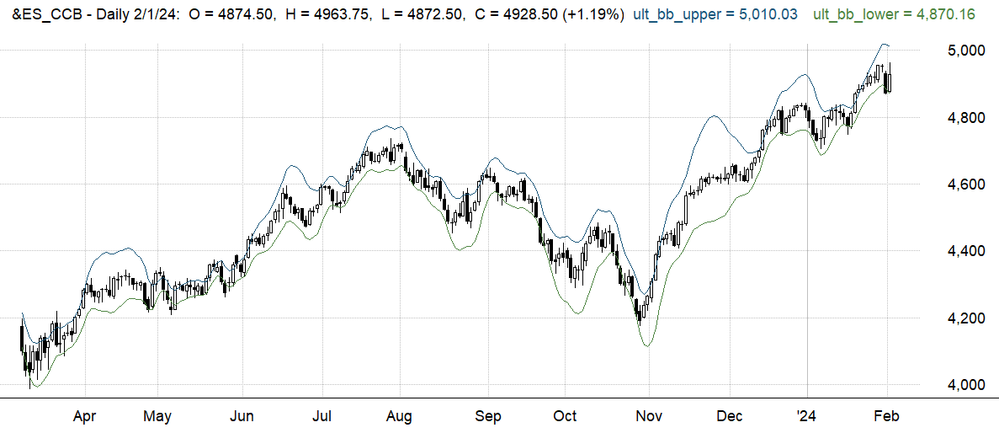
**FIGURE 9: REALTEST.** This example chart from RealTest software demonstrates John Ehlers' ultimate bands indicator, which is based on the Bollinger Bands concept but replaces the traditional moving average with Ehlers' UltimateSmoother.

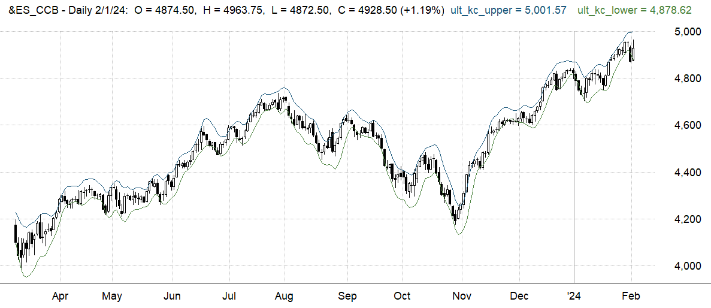
**FIGURE 10: REALTEST.** This example chart from RealTest software demonstrates John Ehlers' ultimate channel indicator, which is based on the Keltner channel concept but replaces the traditional moving average with Ehlers' UltimateSmoother.

--Marsten Parker, MHP Trading, [mhptrading.com](http://mhptrading.com/), [mhp@mhptrading.com](mailto:mhp@mhptrading.com)

---

## The Zorro Project: May 2024

In his article in this issue, "Ultimate Channels And Ultimate Bands," John Ehlers follows up his article last month that presented an ultimate smoothing function. In this month's article, he presents two different band indicators that uses his UltimateSmoother.

Band indicators can be used to trigger long or short positions when the price hits the upper or lower band. The first band indicator, the *ultimate channel* indicator, is a straightforward conversion to the C language from Ehlers' EasyLanguage code:

([zorro-ultimate-channel.c](zorro-ultimate-channel.c))

```c
var UltimateChannel(int Length,int STRLength,int NumSTRs)
{
  var TH = max(priceC(1),priceH());
  var TL = min(priceC(1),priceL());
  var STR = UltimateSmoother(series(TH-TL),STRLength);
  var Center = UltimateSmoother(seriesC(),Length);
  rRealUpperBand = Center + NumSTRs*STR;
  rRealLowerBand = Center - NumSTRs*STR;
  return Center; 
}
```

**rRealUpperBand** and **rRealLowerBand** are predefined global variables that are used by band indicators in the indicator library of the Zorro platform. For testing the new indicator, we can apply it to an ES chart:

([zorro-ultimate-channel-test.c](zorro-ultimate-channel-test.c))

```c
void run() 
{
  BarPeriod = 1440;
  StartDate = 20230301;
  EndDate = 20240201;
  assetAdd("ES","YAHOO:ES=F");
  asset("ES");
  UltimateChannel(20,20,1);
  plot("UltChannel1",rRealUpperBand,BAND1,BLUE);
  plot("UltChannel2",rRealLowerBand,BAND2,BLUE|TRANSP); 
}
```

The resulting chart (Figure 11) replicates the chart of the S&P 500 emini futures market (ES) shown in Ehlers' article.

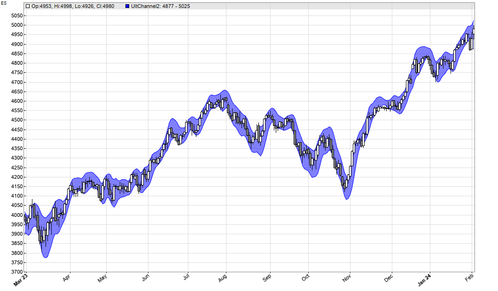
**FIGURE 11: ZORRO.** This demonstrates the ultimate channel indicator on a chart of S&P 500 emini futures market (ES), implemented in Zorro.

The second band indicator, ultimate bands, requires less code than Ehlers' implementation, since lite-C can apply functions to a whole data series:

([zorro-ultimate-bands.c](zorro-ultimate-bands.c))

```c
var UltimateBands(int Length,int NumSDs)
{
  var Center = UltimateSmoother(seriesC(),Length);
  vars Diffs = series(priceC()-Center);
  var SD = sqrt(SumSq(Diffs,Length)/Length);
  rRealUpperBand = Center + NumSDs*SD;
  rRealLowerBand = Center - NumSDs*SD;
  return Center; 
}
```

Again, we can apply it to an ES chart (Figure 12):

([zorro-ultimate-bands-test.c](zorro-ultimate-bands-test.c))

```c
void run() 
{
  BarPeriod = 1440;
  StartDate = 20230301;
  EndDate = 20240201;
  assetAdd("ES","YAHOO:ES=F");
  asset("ES");
  UltimateBands(20,1);
  plot("UltBands1",rRealUpperBand,BAND1,BLUE);
  plot("UltBands2",rRealLowerBand,BAND2,BLUE|TRANSP);
}
```

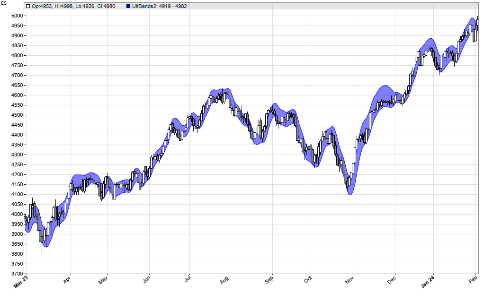
**FIGURE 12: ZORRO.** This demonstrates the ultimate bands indicator on a chart of S&P 500 emini futures market (ES), implemented in Zorro.

We can see that both indicators produce relatively similar bands with low lag.

The code can be downloaded from the 2024 script repository on [https://financial-hacker.com](https://financial-hacker.com). The Zorro platform can be downloaded from [https://zorro-project.com](https://zorro-project.com).

--Petra Volkova, The Zorro Project by oP group Germany, [https://zorro-project.com](https://zorro-project.com)

---

## Microsoft Excel: May 2024

In his article in this issue, "Ultimate Channels And Ultimate Bands," John Ehlers shows us how his UltimateSmoother (which was introduced last month in his April 2024 article) may be used to improve on two well-known indicators.

First, he derives an *ultimate channel* indicator (Figure 13) by replacing the two EMAs used in the derivation of Keltner channels with the UltimateSmoother. Once he substitutes his UltimateSmoother for the standard EMA when calculating the smoothed close, it becomes the channel's logical centerline (not plotted here). Then he calculates the ATR component, which becomes the STR (perhaps this stands for "smoothed TR"). STR substitutes for ATR as the plus and minus channel plot offset from the centerline.

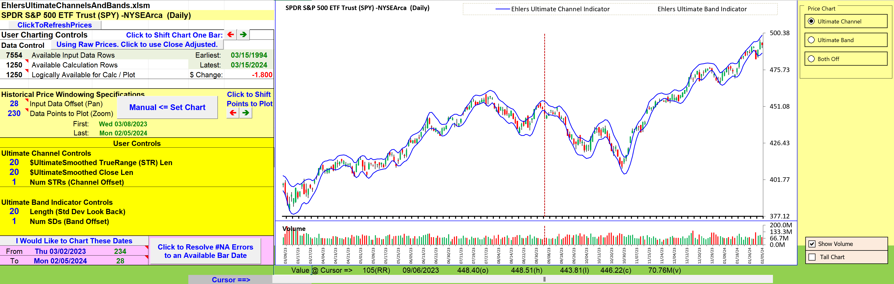
**FIGURE 13: EXCEL.** This chart demonstrates John Ehlers' ultimate channel indicator.

Next, he derives an *ultimate bands* indicator (Figure 14). Here, Ehlers replaces the EMA of the close, which is typically used in the derivation of Bollinger Bands, with an UltimateSmoother of the close. This becomes the logical centerline of the bands.

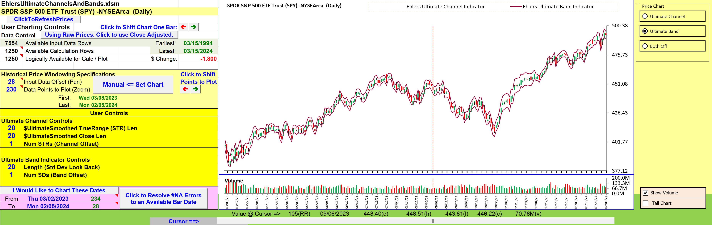
**FIGURE 14: EXCEL.** This chart demonstrates John Ehlers' ultimate bands indicator.

Step 2 creates an interesting variation on the standard deviation calculation, wherein the bar-by-bar value of the ultimate-smoothed close stands in as the bar-by-bar "mean of the sample." So, bar by bar, we take the difference between the close and the smoothed close for that bar. We square and sum those differences for the specified number of preceding bars, then divide by the length and take the square root to arrive at our thus-modified deviation.

This modified deviation becomes the plus and minus band plot offset from the centerline.

**To download this spreadsheet:** The spreadsheet file for this Traders' Tip can be downloaded [here](http://www.traders.com/Documentation/FEEDbk_docs/2024/05/images/code/EhlersUltimateChannelsAndBands.xlsm). To successfully download it, follow these steps:

- Right-click on the [Excel file link](https://www.traders.com/Documentation/FEEDbk_docs/2024/05/images/code/EhlersUltimateChannelsAndBands.xlsm), then
- Select "save as" (or "save target as") to place a copy of the spreadsheet file on your hard drive.

--Ron McAllister, Excel and VBA programmer, [rpmac_xltt@sprynet.com](mailto:rpmac_xltt@sprynet.com)

---

Originally published in the May 2024 issue of *Technical Analysis of* STOCKS & COMMODITIES magazine. All rights reserved. Copyright 2024, Technical Analysis, Inc.

---

## BibTeX

```bibtex
@misc{traders_tips_2024_05,
  author       = {{Technical Analysis of STOCKS \& COMMODITIES}},
  title        = {Traders' Tips, May 2024: Ultimate Channels And Ultimate Bands},
  year         = {2024},
  month        = may,
  howpublished = {online},
  url          = {https://www.traders.com/Documentation/FEEDbk_docs/2024/05/TradersTips.html}
}
```
