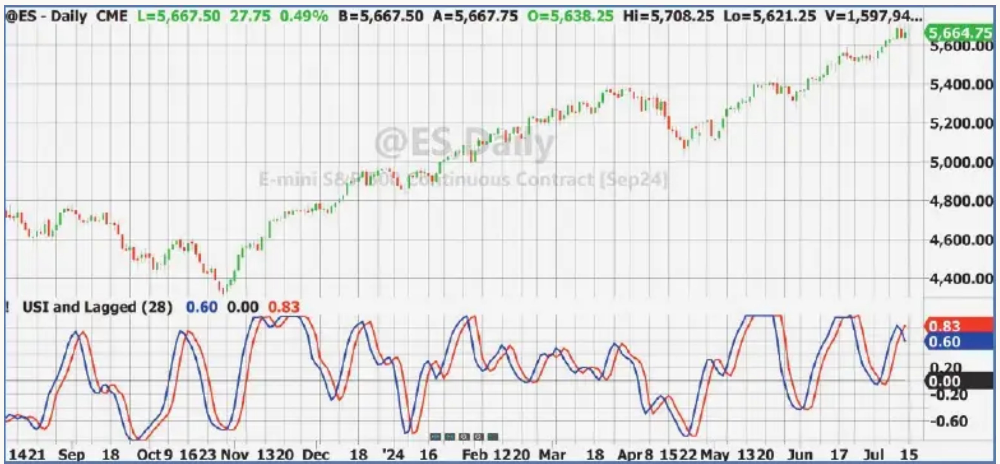

# Ultimate Strength Index (USI)

- **Author:** John F. Ehlers
- **Source:** *Technical Analysis of Stocks & Commodities*, Volume 42, November 2024, pp. 8–12
- **URL:** https://technical.traders.com/archive/article.asp?file=\V42\C11\870EHLE.pdf
- **Traders' Tips:** https://www.traders.com/Documentation/FEEDbk_docs/2024/11/TradersTips.html

---

## Less Lag, More Data

Introducing a new version of the RSI that has an exceptionally small amount of lag. Here's how you can calculate and use it.

Undoubtedly the most popular indicator used by technical traders is J. Welles Wilder's RSI (relative strength index). Its popularity is well deserved because it provides a normalized output regardless of the instrument being analyzed, because it clearly shows cyclic variations in the data, and because it simultaneously shows the strength of trends. A major key to the art of its application and interpretation is the length of data used in its calculations. However, like all technical indicators, it has lag due to the use of historical data in its computation.

Indicator lag is the bane of technical traders. The purpose of this article is to derive a variation of the RSI that offers a significant reduction in lag.

First, I will review the computation of the RSI. I will use my own notation of the variables to facilitate the derivation from the RSI to my ultimate strength index (USI).

## Computation

If the close of the current bar is higher than the close of the previous bar, their difference is the strength up (SU) for that bar, otherwise SU = 0. Similarly, if the close of the previous bar is higher than the close of the current bar, their difference is the strength down (SD) for that bar, otherwise SD = 0. Both SU and SD are positive numbers. The next step is to average SU and SD over the length of data to be analyzed. The RSI is then calculated as the average of strength up to the average of the total strength. Its equation is:

$$\text{RSI} = \frac{\text{Avg}(SU)}{\text{Avg}(SU) + \text{Avg}(SD)}$$

If the average of SU is zero, the value of the RSI is zero. If the average of SD is zero, the value of the RSI is 1. So, the RSI swings between the values of 0 and 1. The classical RSI multiplies the result by 100.

I prefer the indicator to swing between the limits of −1 and +1 because the zero value becomes the balance point between bullish and bearish conditions. The math operation is a simple dilation and translation to do this. That is, multiply the RSI by 2 so it swings between 0 and 2, and then subtract 1 from that product. After a little algebraic manipulation, the revised RSI becomes:

$$\text{MyRSI} = \frac{\text{Avg}(SU) - \text{Avg}(SD)}{\text{Avg}(SU) + \text{Avg}(SD)}$$

Both RSI and MyRSI have a lot of high-frequency jitter and require additional filtering to sufficiently smooth the indicator to be truly useful. In one of my previous articles, "(Yet Another) Improved RSI," which received the 2022 Readers' Choice Award, I recognized that an average is just a low-pass filter, and I replaced the average with a Hann FIR low-pass filter to get a much smoother indicator. I called that indicator MyRSIH. Although smoother, MyRSIH still had substantial lag.

I developed the UltimateSmoother low-pass filter to minimize filter lag. (See my April 2024 S&C article, "The Ultimate Smoother.") Basically, the UltimateSmoother filters by cancellation, subtracting the result of high-pass filtering from the unfiltered data. This operation in the calculation avoids the necessity of using the very long wavelengths of information in the data, with the result that filtering lag is almost insignificant.

With this background, it is only a small step to create a version of the RSI that has an exceptionally small amount of lag. All I do is replace the average function in MyRSI with an UltimateSmoother low-pass filter. I call this new indicator the ultimate strength index (USI). The equation for USI is:

$$\text{USI} = \frac{\text{Ult}(SU) - \text{Ult}(SD)}{\text{Ult}(SU) + \text{Ult}(SD)}$$

EasyLanguage code for the UltimateSmoother function is given in the sidebar "The Ultimate Smoother, In EasyLanguage." The name of the function in code is `$UltimateSmoother`. The dollar sign in the function name puts this function at the top of the list of functions in the library.

EasyLanguage code for the USI is given in the sidebar "The Ultimate Strength Index, In EasyLanguage." The variables SU and SD are exceptionally ragged waveforms, and therefore I chose a four-bar average within the function calls for the computation of the variables USU and USD. The short averages further reduce the amount of high-frequency chop in the result. This smoothing within the function calls carries a penalty of two bars of lag. The conditional clause in the USI calculation avoids a divide-by-zero problem and cases when both USU and USD have small values.

Interestingly, the USI requires much more data than an RSI to get a useful indicator. Figure 1 shows the USI (in blue) using a length of 28 bars compared to MyRSIH (in red) using a length of 14 bars. Although the USI uses twice as much data in its calculation, it has significantly less lag. For example, the zero crossings of the USI typically precede the zero crossings of the MyRSIH by three bars or so. Both indicators show bullish conditions when they are above zero and bearish conditions when they are below zero. It is obvious that the USI is not as smooth as MyRSIH. Reducing lag comes at the expense of filtering efficiency.


**Figure 1:** The Ultimate Strength Index (USI) vs. MyRSIH. The USI has less lag than the MyRSIH although it's using twice as much data. In this example, the USI (blue) uses a length of 28 bars compared to MyRSIH (red) using a length of 14 bars. Zero crossings of the USI typically precede zero crossings of the MyRSIH by about three bars.

The filtering character of the USI changes when the data length is changed, but there is a minimal impact on lag when this is done. This means that, in general, the data length will be less sensitive when optimized in a strategy.

When used in a strategy, the zero crossings can be used for the timing of buy and sell signals. For example, buy when the indicator crosses over zero and exit or go short when the indicator crosses under zero. Using more data will hold the trend positions longer with less chop. However, using longer data will not have a large effect on the trade entry and exit points.

Trend traders will want to use a longer data length in the computation of the USI to avoid whipsaw trades. With reference to Figure 2, the bottom subgraph is the USI using 28 bars of data — the same as in Figure 1 — while the USI in the first subgraph is tuned for trends using a data length four times longer at 112 bars. The result is that the whipsaws from bullish to bearish and back again, as indicated by the zero crossings of the indicator in the bottom subgraph, are eliminated. While the whipsaws are eliminated, the timing of the onset of the trend in November 2023 is not greatly affected. The trend reversals in May 2024 are also identified. The message here is that the USI still identifies the trend onset in a timely manner even when a large amount of data is used.


**Figure 2:** Different lookback lengths. Trend traders can use a longer data length in the computation of the USI to avoid whipsaw trades. The bottom subgraph is the USI using 28 bars of data (same as in Figure 1) while the top subgraph is the USI using a data length four times longer at 112 bars — so that it is tuned for trends. Despite using a long data length, the trend reversals in May 2024 are still identified by the USI.

When using the shorter data length, it is important to note that the peaks and valleys in the USI are almost perfectly aligned with the peaks and valleys in the price data. In a strategy, we would like to make a long trade entry at the valley and a short trade entry at a peak to make the maximum profit on each swing in the data. We can approach identification of the peaks and valleys by examining the crossovers of the USI with itself delayed by two bars, as shown in Figure 3. There will be some whipsaw trades using this approach, but they can be reduced by altering the USI data length or using some auxiliary rules.


**Figure 3:** USI crossovers. Trade entry and exits are identified by crossovers of USI with itself delayed by two bars.

## The UltimateSmoother Function, In EasyLanguage

```easylanguage
{
  Ultimate Smoother Function
  (C) 2004-2024 John F. Ehlers
}
Inputs:
  Price(numericseries),
  Period(numericsimple);
Vars:
  a1(0),
  b1(0),
  c1(0),
  c2(0),
  c3(0),
  US(0);

a1 = expvalue(-1.414*3.14159 / Period);
b1 = 2*a1*Cosine(1.414*180 / Period);
c2 = b1;
c3 = -a1*a1;
c1 = (1 + c2 - c3) / 4;

If CurrentBar >= 4 Then US = (1 - c1)*Price + (2*c1 - c2)*Price[1]
  - (c1 + c3)*Price[2] + c2*US[1] + c3*US[2];
If CurrentBar < 4 Then US = Price;

$UltimateSmoother = US;
```

## The Ultimate Strength Index (USI), In EasyLanguage

```easylanguage
{
  Ultimate Strength Index (USI)
  (C) 2024 John F. Ehlers
}
Inputs:
  Length(14);
Vars:
  SU(0),
  USU(0),
  SD(0),
  USD(0),
  USI(0);

If Close > Close[1] Then SU = Close - Close[1] Else SU = 0;
USU = $UltimateSmoother(Average(SU, 4), Length);
If Close < Close[1] Then SD = Close[1] - Close Else SD = 0;
USD = $UltimateSmoother(Average(SD, 4), Length);

If (USU + USD <> 0 and USU > .01 and USD > .01) Then
  USI = (USU - USD) / (USU + USD);

Plot1(USI, "", blue, 4, 4);
Plot2(0, "", black, 1, 1);
```

## Conclusions

The ultimate strength index (USI) is an indicator that includes many of the advantages of a traditional RSI with the added benefit of reduced lag in its computation. It shows bullish and bearish conditions that can be altered using different lengths of data. The USI generally uses much more data than an RSI to get similar results. The USI can be successfully used in trend trading by using a long data length. When the data length is shorter, the peaks and valleys of the USI are almost aligned with the major peaks and valleys in the price data. This makes the USI a successful timer for swing trading.

With these attributes, the USI is a valuable asset to keep in your trading toolbox.

---

*John Ehlers is a retired electrical engineer and a retired technical analyst, specializing in the application of DSP (digital signal processing) to trading. For more information, see www.mesasoftware.com.*

*The code given in this article is available in the Article Code section of our website, Traders.com. See our Traders' Tips section of the magazine beginning on page 46 for implementation of John Ehlers' technique in various technical analysis and trading platforms.*

## Further Reading

- Ehlers, John [2022]. "(Yet Another) Improved RSI," *Technical Analysis of Stocks & Commodities*, Volume 40, January.
- Ehlers, John [2024]. "The Ultimate Smoother," *Technical Analysis of Stocks & Commodities*, Volume 42, April.
- Ehlers, John [2014]. "Predictive And Successful Indicators," *Technical Analysis of Stocks & Commodities*, Volume 32, January.
- Ehlers, John [2004]. *Cybernetic Analysis For Stocks And Futures*, John Wiley & Sons.
- Ehlers, John [2013]. *Cycle Analytics For Traders*, John Wiley & Sons.
- Ehlers, John [2021]. "A Technical Description of Market Data for Traders," *Technical Analysis of Stocks & Commodities*, Volume 39, May.

---

## BibTeX

```bibtex
@article{ehlers2024usi,
  author    = {John F. Ehlers},
  title     = {Ultimate Strength Index (USI)},
  journal   = {Technical Analysis of Stocks \& Commodities},
  volume    = {42},
  number    = {11},
  pages     = {8--12},
  year      = {2024},
  month     = nov,
  url       = {https://technical.traders.com/archive/article.asp?file=\V42\C11\870EHLE.pdf}
}

@misc{traderstips2024nov,
  title     = {Traders' Tips: Ultimate Strength Index (USI)},
  year      = {2024},
  month     = nov,
  url       = {https://www.traders.com/Documentation/FEEDbk_docs/2024/11/TradersTips.html},
  note      = {Implementations of Ehlers' Ultimate Strength Index in various platforms}
}
```
