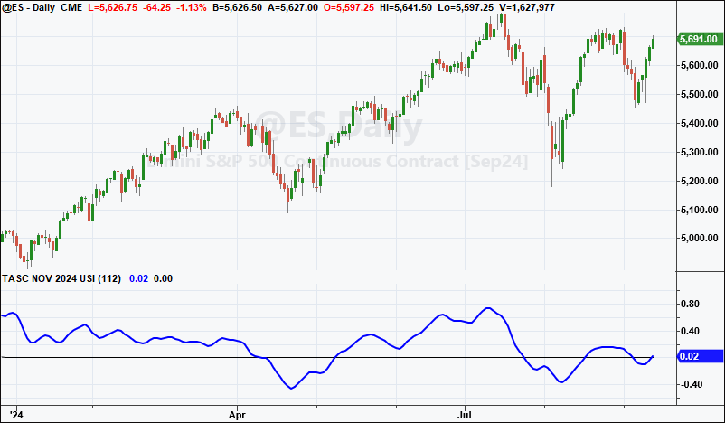
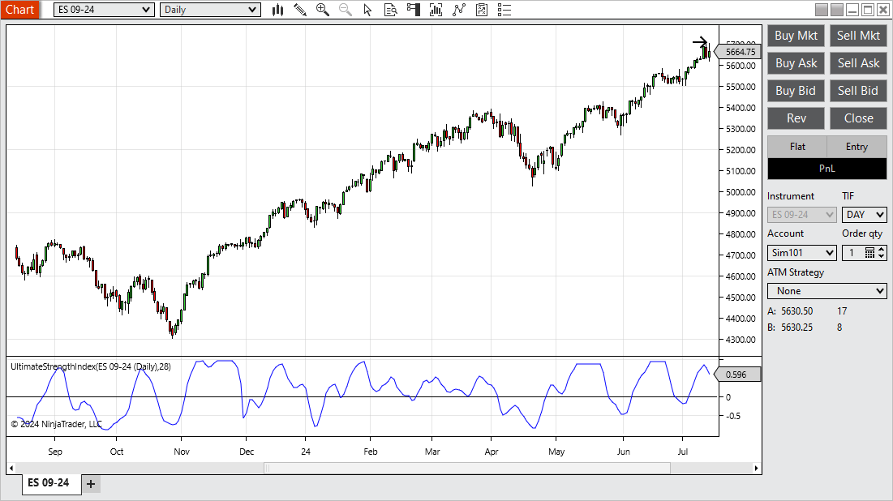
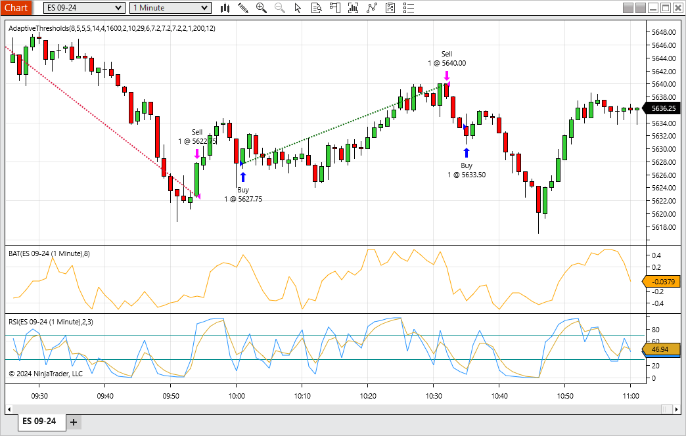
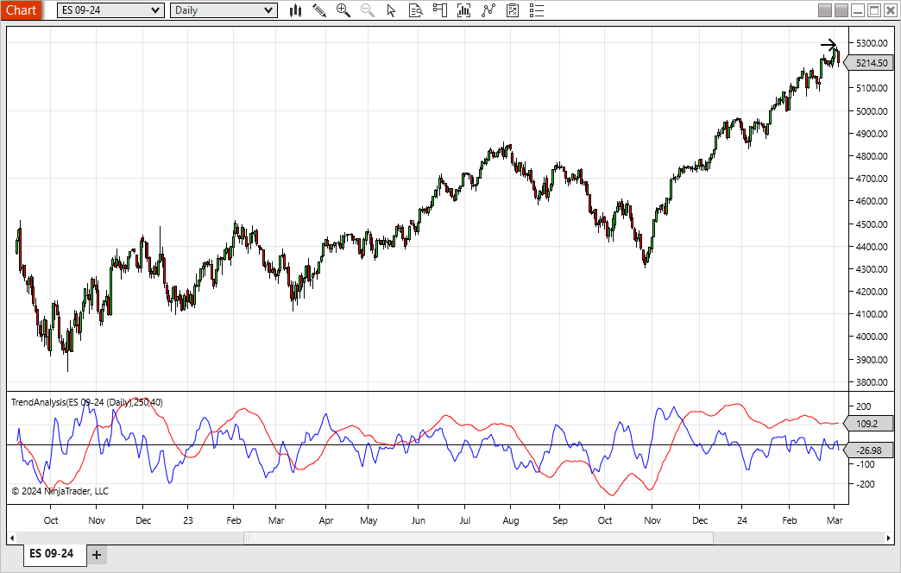
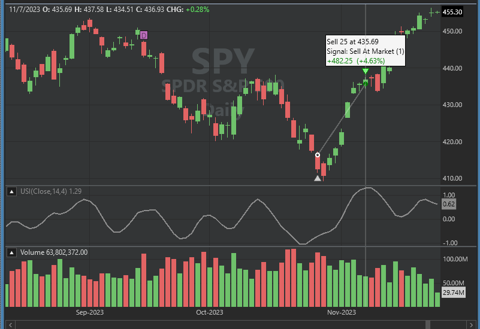
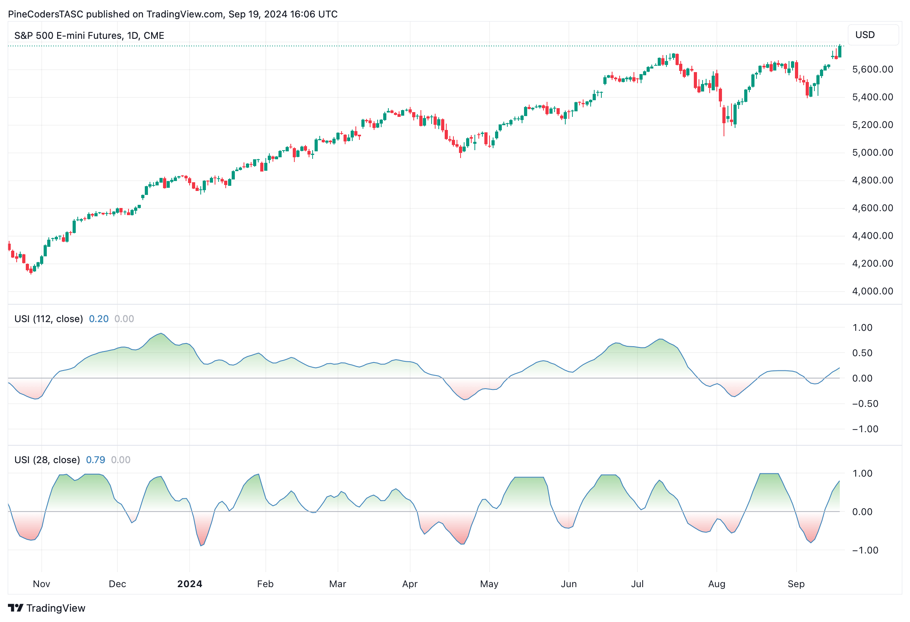
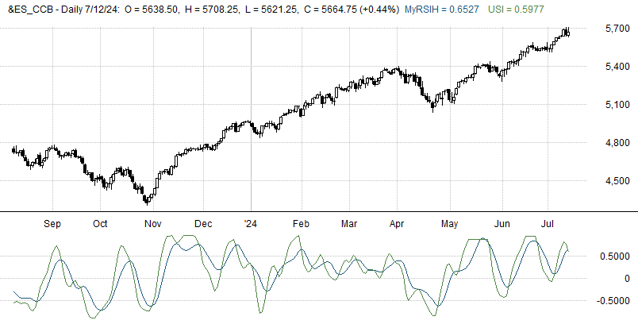
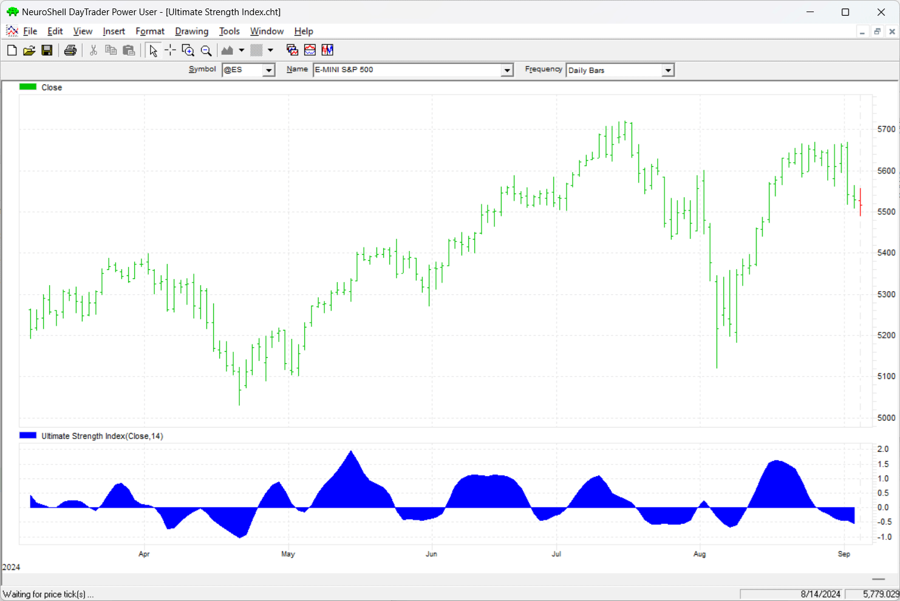
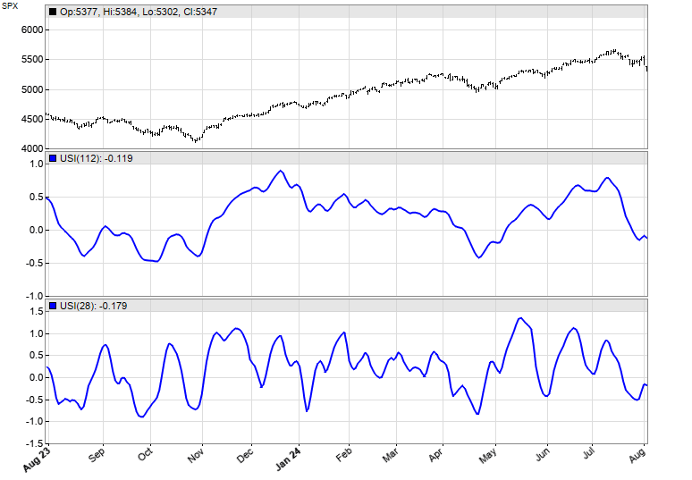
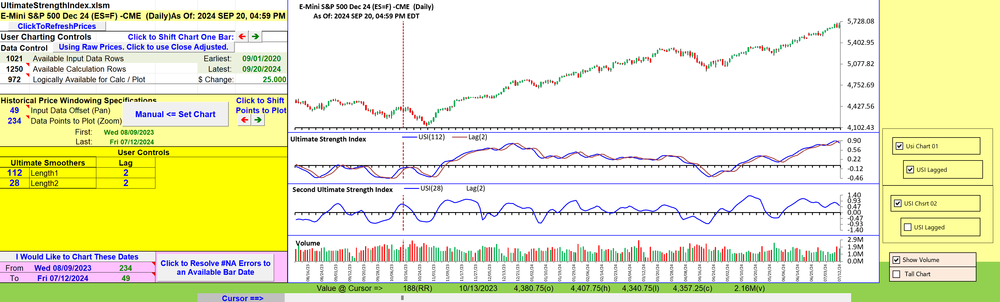

# Traders' Tips: Ultimate Strength Index (USI)

- **Article:** "Ultimate Strength Index (USI)" by John F. Ehlers, *Technical Analysis of Stocks & Commodities*, November 2024
- **URL:** https://www.traders.com/Documentation/FEEDbk_docs/2024/11/TradersTips.html

---

For this month's Traders' Tips, the focus is John F. Ehlers' article in this issue, "Ultimate Strength Index (USI)." Here, we present the November 2024 Traders' Tips code with possible implementations in various software.

---

## TradeStation

In "Ultimate Strength Index (USI)" in this issue, John Ehlers introduces an enhanced version of the RSI with significantly reduced lag. The USI retains many benefits of the traditional RSI, while providing faster, more responsive results. It highlights bullish and bearish conditions and allows for adjustments based on different data lengths, typically using more data than the standard RSI to achieve comparable outcomes.

**Code:** [`TradeStation_USI.els`](TradeStation_USI.els)

```easylanguage
Function: $UltimateSmoother

{
	UltimateSmoother Function
	(C) 2004-2024 John F. Ehlers
}

inputs:
	Price( numericseries ),
	Period( numericsimple );
	
variables:
	a1( 0 ),
	b1( 0 ),
	c1( 0 ),
	c2( 0 ),
	c3( 0 ),
	US( 0 );
	
a1 = ExpValue(-1.414*3.14159 / Period);
b1 = 2 * a1 * Cosine(1.414*180 / Period);
c2 = b1;
c3 = -a1 * a1;
c1 = (1 + c2 - c3) / 4;

if CurrentBar >= 4 then 
 US = (1 - c1)*Price + (2 * c1 - c2) * Price[1] 
 - (c1 + c3) * Price[2] + c2*US[1] + c3 * US[2];
 
if CurrentBar < 4 then 
	US = Price;

$UltimateSmoother = US;

Indicator: Ultimate Strength Index (USI) 

{
	TASC NOVEMBER 2024
	Ultimate Strength Index (USI)
	(C) 2024 John F. Ehlers
}

inputs:
	Length( 14 );

variables:
	SU( 0 ),
	USU( 0 ),
	SD( 0 ),
	USD( 0 ),
	USI( 0 );

if Close > Close[1] then 
	SU = Close - Close[1] 
else 
	SU = 0;

USU = $UltimateSmoother(Average(SU,4), Length);

if Close < Close[1] then 
	SD = Close[1] - Close 
else 
	SD = 0;

USD = $UltimateSmoother(Average(SD, 4), Length);

If (USU + USD <> 0 and USU > .01 and USD > .01) then 
	USI = (USU - USD) / (USU + USD);

Plot1( USI, "USI" );
Plot2( 0, "Zero Line" );
```

A sample chart is shown in Figure 1.



*This article is for informational purposes. No type of trading or investment recommendation, advice, or strategy is being made, given, or in any manner provided by TradeStation Securities or its affiliates.*

*—John Robinson, TradeStation Securities, Inc., www.TradeStation.com*

---

## NinjaTrader: November 2024

The ultimate strength index, which is introduced in the article by John Ehlers in this issue, is available for download at the following link for NinjaTrader 8:

- **NinjaTrader 8:** https://ninjatrader.com/SC/November2024SCNT8.zip

Once the file is downloaded, you can import the indicator into NinjaTrader 8 from within the control center by selecting Tools → Import → NinjaScript Add-On and then selecting the downloaded file for NinjaTrader 8.

You can review the indicator source code in NinjaTrader 8 by selecting the menu New → NinjaScript Editor → Indicators folder from within the control center window and selecting the file.

A sample chart displaying the indicator is shown in Figure 2.



NinjaScript uses compiled DLLs that run native, not interpreted, to provide you with the highest performance possible.

*—NinjaTrader, LLC, www.ninjatrader.com*

---

## NinjaTrader: October 2024

The October 2024 issue contained an article by Francesco Bufi titled "Overbought/Oversold Oscillators: Useless Or Just Misused?" In that article, Bufi presents a strategy based on the relative strength index (RSI) that continuously adjusts the buying level. Coding for NinjaTrader based on the code provided in Bufi's article is available for download at the following link for NinjaTrader 8:

- **NinjaTrader 8:** https://ninjatrader.com/SC/October2024SCNT8.zip

Once the file is downloaded, you can import the file into NinjaTrader 8 from within the control center by selecting Tools → Import → NinjaScript Add-On and then selecting the downloaded file for NinjaTrader 8.

You can review the indicator source code in NinjaTrader 8 by selecting the menu New → NinjaScript Editor → Indicators folder from within the control center window and selecting the file.

A sample chart displaying the indicator is shown in Figure 3.



*—NinjaTrader, LLC, www.ninjatrader.com*

---

## NinjaTrader: September 2024

The September 2024 issue contained an article by John Ehlers titled "Precision Trend Analysis," which described a method for trend detection and confirmation. Code for NinjaTrader based on the coding included in Ehlers' September 2024 article is available for download at the following link for NinjaTrader 8:

- **NinjaTrader 8:** https://ninjatrader.com/SC/September2024SCNT8.zip

Once the file is downloaded, you can import the file into NinjaTrader 8 from within the control center by selecting Tools → Import → NinjaScript Add-On and then selecting the downloaded file for NinjaTrader 8.

You can review the indicator source code in NinjaTrader 8 by selecting the menu New → NinjaScript Editor → Indicators folder from within the control center window and selecting the file.

A sample chart displaying the indicator is shown in Figure 4.



NinjaScript uses compiled DLLs that run native, not interpreted, to provide you with the highest performance possible.

*—NinjaTrader, LLC, www.ninjatrader.com*

---

## MetaStock

John Ehlers' article in this issue, "Ultimate Strength Index (USI)", introduces his latest modification to the RSI indicator. Here is the formula to add that indicator to MetaStock.

**Code:** [`MetaStock_USI.txt`](MetaStock_USI.txt)

```metastock
Ultimate Strength Index (USI):

len:= Input("Length", 4, 150, 14);

a1:= exp(-1.414*3.14159 / len);
b1:= 2*a1*Cos(1.414*180 / len);
c1:= -a1*a1;
x:= (1 + b1 - c1) / 4;

SU:= if(C > Ref(C, -1), C - Ref(C, -1), 0);
avSU:= Mov(SU, 4, S);
SD:= if(C < Ref(C, -1), Ref(C, -1) - C, 0);
avSD:= Mov(SD, 4, S);

{calculate ultimate smoother values of SU and SD}
USU:= if(cum(1) < 8, avSU,
(1-x)*avSU + (2*x - b1)*Ref(avSU, -1) - (x + c1)*Ref(avSU, -2) + b1*Prev + c1*Ref(Prev, -1));

USD:= if(cum(1) < 8, avSD,
(1-x)*avSD + (2*x - b1)*Ref(avSD, -1) - (x + c1)*Ref(avSD, -2) + b1*Prev + c1*Ref(Prev, -1));

denom:= if( (USU + USD <> 0), USU + USD, -1);
if(denom = -1, 0, (USU-USD) / denom)
```

*—William Golson, MetaStock Technical Support, MetaStock.com*

---

## Wealth-Lab.com

We have added John Ehlers' ultimate strength index (USI) as a built-in indicator in WealthLab 8. We then proceeded to create a simple, example drag-and-drop trading strategy with the following rules:

- Buy next bar at open after USI crosses above -1
- Sell next bar at open after USI crosses above 1

This quick proof of concept highlights the value of this indicator, as the strategy achieved an impressive 77% profitable trade rate. The sample chart in Figure 5 shows a representative trade.



*—Dion Kurczek, Wealth-Lab team, www.wealth-lab.com*

---

## TradingView

The TradingView Pine Script code presented here implements the ultimate strength index (USI) introduced by John Ehlers in his article in this issue.

**Code:** [`TradingView_USI.pine`](TradingView_USI.pine)

```pine
//  TASC Issue: November 2024
//     Article: Ultimate Strength Index (USI)
//  Article By: John F. Ehlers
//    Language: TradingView's Pine Script™ v5
// Provided By: PineCoders, for tradingview.com


//@version=5
title ='TASC 2024.11 Ultimate Strength Index'
stitle = 'USI'
indicator(title, stitle, false)


int length1 = input.int(28, 'USI Length:', minval = 1)
float   src = input.source(close, "Source")


// --- Functions ---
// @function      The UltimateSmoother is a filter created
//                by subtracting the response of a high-pass 
//                filter from that of an all-pass filter.
// @param src     Source series.
// @param period  Critical period.
// @returns       Smoothed series.
UltimateSmoother (float src, int period) =>
    float a1 = math.exp(-1.414 * math.pi / period)
    float c2 = 2.0 * a1 * math.cos(1.414 * math.pi / period)
    float c3 = -a1 * a1
    float c1 = (1.0 + c2 - c3) / 4.0
    float us = src
    if bar_index >= 4
        us := (1.0 - c1) * src + 
              (2.0 * c1 - c2) * src[1] - 
              (c1 + c3) * src[2] + 
              c2 * nz(us[1]) + c3 * nz(us[2])
    us


// @function Ultimate Strength Index is a new version of 
// the RSI calculation that has a small ammount of lag.
// @param   src Source Series.
// @param   l1  Length of Ultimate smoother function.
// @param   l2  Length of the short period smoothing.
// @returns USI value.
UltimateStrengthIndex (float src, int l1=14, int l2=4) =>
    float eps = syminfo.mintick
    float diff = src - src[1]
    float SU = diff > 0.0 ?  diff : 0.0
    float SD = diff < 0.0 ? -diff : 0.0
    USU = UltimateSmoother(ta.sma(SU, l2), l1)
    USD = UltimateSmoother(ta.sma(SD, l2), l1)
    USI = 0.0
    USI := nz(USI[1])
    if USU + USD != 0 and USU > eps and USD > eps
        USI := (USU - USD) / (USU + USD)
    USI


// --- Calculations ---
float usi = UltimateStrengthIndex(src, length1)
usiLine   = plot(usi, 'USI', #377eb8)
midLine   = plot(0, 'Zero Line', color.silver)


fill(usiLine, midLine, 1, 0, 
     color.new(#4daf4a, 50), color.new(#4daf4a, 100))
fill(usiLine, midLine, 0,-1, 
     color.new(#e41a1c, 100), color.new(#e41a1c, 50))
```

The indicator is available on TradingView from the PineCodersTASC account: https://www.tradingview.com/u/PineCodersTASC/#published-scripts.

An example chart is shown in Figure 6.



*—PineCoders, for TradingView, www.TradingView.com*

---

## RealTest

Provided here is coding for use in the RealTest platform to implement John Ehlers' ultimate strength index (USI) indicator, which is described in his article in this issue.

**Code:** [`RealTest_USI.rts`](RealTest_USI.rts)

```realtest
Notes:

	Ultimate Strength Index (USI)
	TASC Trader's Tips for November 2024 article by John Ehlers


Import:

	DataSource:	Norgate
	IncludeList:	&ES_CCB
	StartDate:	2023-01-01
	EndDate:	2024-08-01
	SaveAs:	es.rtd


Settings:

	DataFile:	es.rtd
	BarSize:	Daily


Parameters:

	rsi_len:	14
	usi_len:	28
	

Data:

	// "MyRSIH" calculation (January 2022 article)
	CU:	Sum(if(C > C[1], (1 - Cosine(360 * (rsi_len - FunBar + 1) / (rsi_len + 1)))*(C - C[1]), 0), rsi_len)
	CD:	Sum(if(C < C[1], (1 - Cosine(360 * (rsi_len - FunBar + 1) / (rsi_len + 1)))*(C[1] - C), 0), rsi_len)
	MyRSIH:	if(BarNum > rsi_len, (CU - CD) / (CU + CD), nan)

	// Ultimate Smoother common
	a1:	exp(-1.414*3.14159 / usi_len)
	b1:	2 * a1 * Cosine(1.414*180 / usi_len)
	c2:	b1
	c3:	-a1 * a1
	c1:	(1 + c2 - c3) / 4

	// "USI" calculation (November 2024 article)
	SU4:	Avg(if(C > C[1], C - C[1], 0), 4)
	USU:	if(BarNum > rsi_len, (1 - c1) * SU4 + (2 * c1 - c2) * SU4[1] - (c1 + c3) * SU4[2] + c2 * USU[1] + c3 * USU[2], 0)
	SD4:	Avg(if(C < C[1], C[1] - C, 0), 4)
	USD:	if(BarNum > rsi_len, (1 - c1) * SD4 + (2 * c1 - c2) * SD4[1] - (c1 + c3) * SD4[2] + c2 * USD[1] + c3 * USD[2], 0)
	USI:	if(USU + USD <> 0 and USU > 0.01 and USD > 0.01, (USU - USD) / (USU + USD), USI[1])


Charts:

	MyRSIH:	MyRSIH {|}
	USI:	USI {|}
```

Figure 7 demonstrates the indicator plotted on a daily chart of the emini S&P 500 continuous futures contract (ES).



*—Marsten Parker, MHP Trading, mhp@mhptrading.com*

---

## NeuroShell Trader

The ultimate strength index (USI), introduced in John Ehlers' article in this issue, can be easily implemented with a few of NeuroShell Trader's 800+ indicators. Simply select "new indicator..." from the *insert* menu and use the indicator wizard to create the following indicators:

**Code:** [`NeuroShell_USI.txt`](NeuroShell_USI.txt)

```text
USU:	UltimateSmoother(Avg(IfThenElse(A>B(Close,Lag(Close,1)),Sub(Close,Lag(Close,1)),0),4),14)
USD:	UltimateSmoother(Avg(IfThenElse(A<B(Close,Lag(Close,1)),Sub(Lag(Close,1),Close),0),4),14)
USI:	Divide ( Subtract( USU, USD ), Add2( USU, USD ) )
```

Note that the UltimateSmoother indicator is from the April 2024 issue and April 2024 Traders' Tips. Users of NeuroShell Trader can go to the Stocks & Commodities section of the NeuroShell Trader free technical support website to download a copy of this or any previous Traders' Tips.

A sample chart is shown in Figure 8.



*—Ward Systems Group, Inc., sales@wardsystems.com, www.neuroshell.com*

---

## The Zorro Project

In his article in this issue, John Ehlers proposes a replacement for the popular RSI indicator. His ultimate strength index (USI) has the advantage of symmetry -- the range is -1 to 1 -- and less lag. Like the RSI, it enhances cycles and trends in the data, and thus, the author proposes it is well suited for different types of trading systems. Let's look how to realize it in code.

The USI is based on another indicator developed by John Ehlers, the UltimateSmoother, which was described in an article in the April 2024 issue. Here again is that code in C:

**Code:** [`Zorro_UltimateSmoother.c`](Zorro_UltimateSmoother.c)

```c
var UltimateSmoother (var *Data, int Length)
{
  var f = (1.414*PI) / Length;
  var a1 = exp(-f);
  var c2 = 2*a1*cos(f);
  var c3 = -a1*a1;
  var c1 = (1+c2-c3)/4;
  vars US = series(*Data,4);
  return US[0] = (1-c1)*Data[0] + (2*c1-c2)*Data[1] - (c1+c3)*Data[2]
   + c2*US[1] + c3*US[2];
}
```

Similar to the RSI, the ultimate strength index calculates the normalized differences of the ups and downs in the price curve, after no-lag smoothing. Here is the EasyLanguage code given in Ehlers' article in this issue converted to C:

**Code:** [`Zorro_USI_Indicator.c`](Zorro_USI_Indicator.c)

```c
var UltimateStrength (int Length)
{
  vars SU = series(max(0,priceC(0) - priceC(1)));
  var USU = UltimateSmooth(series(SMA(SU,4)),Length);
  vars SD = series(max(0,priceC(1) - priceC(0)));
  var USD = UltimateSmooth(series(SMA(SD,4)),Length);
  return (USU-USD)/fix0(USU+USD);
}
```

For checking the correctness of our conversion, we will plot the USI with two different time periods on a chart of SPX. Here is the code to plot it:

**Code:** [`Zorro_USI_Chart.c`](Zorro_USI_Chart.c)

```c
void run() 
{
  BarPeriod = 1440;
  StartDate = 20230801;
  EndDate = 20240801;
  assetAdd("SPX","STOOQ:^SPX");
  asset("SPX");
  plot("USI(112)",UltimateStrength(112),NEW|LINE,BLUE);
  plot("USI(28)",UltimateStrength(28),NEW|LINE,BLUE);
}
```

The resulting chart (Figure 9) replicates the chart in Ehlers' article in this issue.



We can see that the long timeframe USI enhances the beginning and end of trends, and the short timeframe USI makes the cycles visible.

The code can be downloaded from the 2024 script repository on https://financial-hacker.com. The Zorro platform can be downloaded from https://zorro-project.com.

*—Petra Volkova, The Zorro Project by oP group Germany, https://zorro-project.com*

---

## Microsoft Excel

In John Ehlers' article in this issue, "Ultimate Strength Index (USI)" Ehlers shows an incremental lag and jitter-reduction effort applied to the widely used RSI. In it, he simply applies his UltimateSmoother to a 4-bar average of each of the up and down components prior to substituting each smoothed result for the corresponding bits of the standard RSI formula to arrive at his ultimate strength index (USI).

In Figure 10, you can see longer- and shorter-period USI plots. The longer-period USI plot stays above zero for much of the longer uptrend. The shorter-period USI plot is more sensitive to short swings.



Ehlers notes in his article that crossovers created by adding a two-bar delay plot can assist in identifying swing trade opportunities.

**To download this spreadsheet:** The spreadsheet file for this Traders' Tip can be downloaded from: http://www.traders.com/Documentation/FEEDbk_docs/2024/11/images/code/UltimateStrengthIndex.xlsm

### Problem fix notice

Early Saturday on the morning of September 7, 2024, recent Traders' Tips spreadsheets began displaying the following message:

```
Status(4) - Get Prices Error: Symbol (A) "401 - Unauthorized"
```

The changes necessary to make the spreadsheet provided here (that is, for the November 2024 issue) functional were extensive. Therefore, a "REPAIRS!" tab is provided in this month's spreadsheet that will allow you to select a problem spreadsheet and then automatically apply a cumulative set of repairs that should make your problem Traders' Tip spreadsheet functional once again. Details and necessary setup steps are described in the "REPAIRS!" tab.

*—Ron McAllister, Excel and VBA programmer, rpmac_xltt@sprynet.com*

---

Originally published in the November 2024 issue of *Technical Analysis of Stocks & Commodities* magazine. All rights reserved. © Copyright 2024, Technical Analysis, Inc.

---

## BibTeX

```bibtex
@misc{traderstips2024nov,
  title     = {Traders' Tips: Ultimate Strength Index (USI)},
  year      = {2024},
  month     = nov,
  url       = {https://www.traders.com/Documentation/FEEDbk_docs/2024/11/TradersTips.html},
  note      = {Implementations of Ehlers' Ultimate Strength Index in various platforms}
}
```
