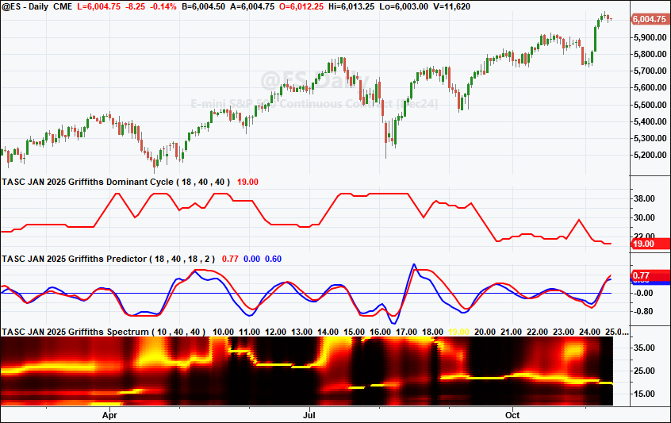
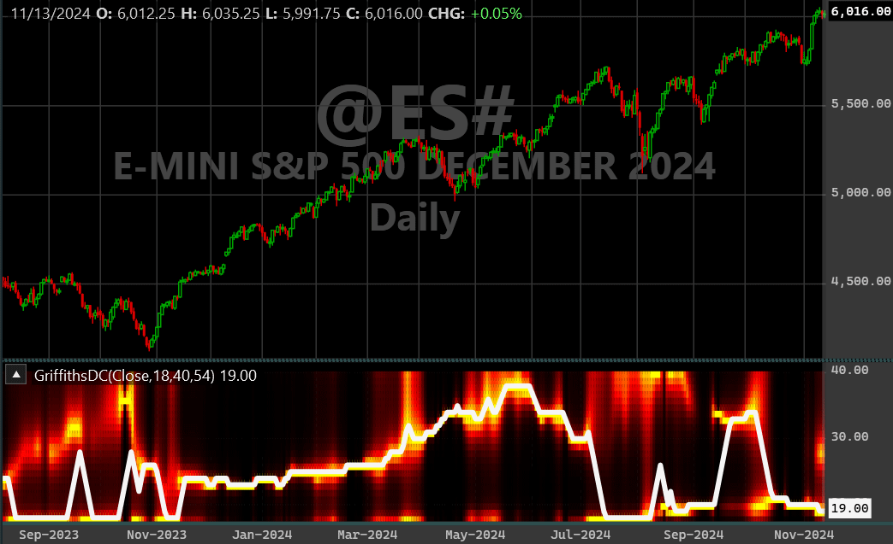
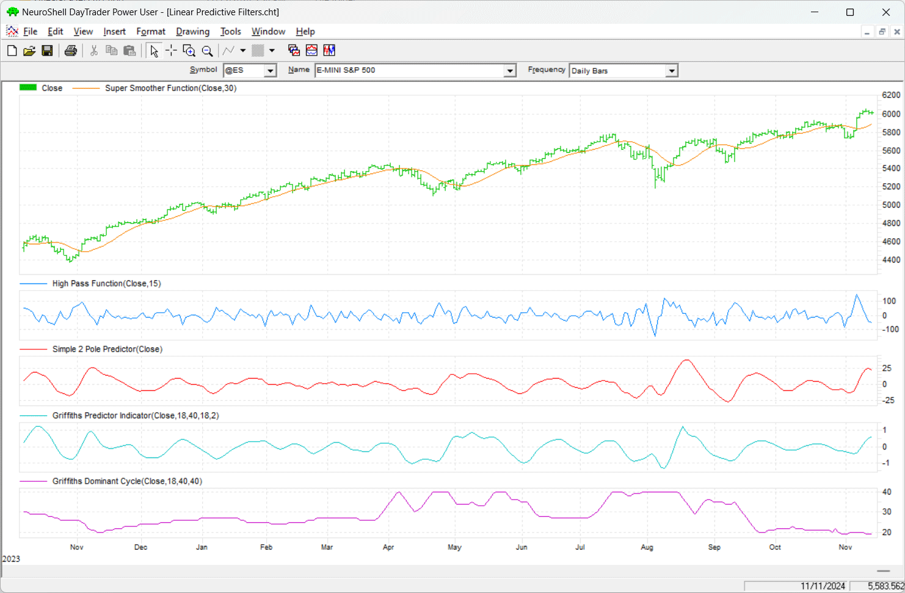
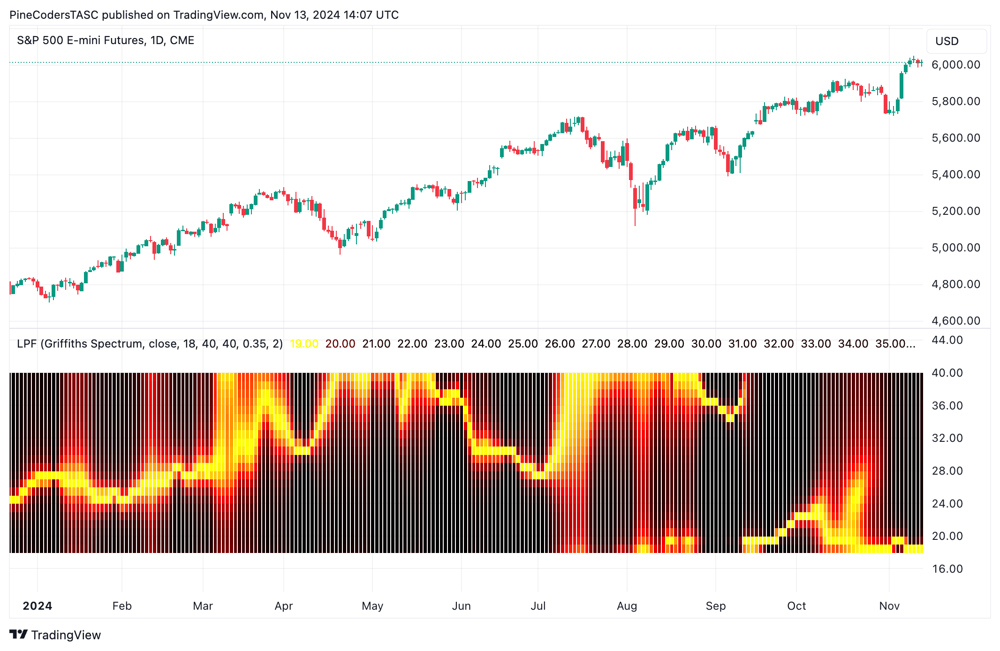

# Traders' Tips — January 2025

**Article reference:** John F. Ehlers, "Linear Predictive Filters And Instantaneous Frequency"

- Traders' Tips URL: <https://traders.com/Documentation/FEEDbk_docs/2025/01/TradersTips.html>

---

For this month's Traders' Tips, the focus is John F. Ehlers' article in this issue, "Linear Predictive Filters And Instantaneous Frequency." Here, we present the January 2025 Traders' Tips code with possible implementations in various software.

The Traders' Tips section is provided to help the reader implement a selected technique from an article in this issue or another recent issue. The entries here are contributed by software developers or programmers for software that is capable of customization.

---

## TradeStation: January 2025

In "Linear Predictive Filters And Instantaneous Frequency," John Ehlers explores the use of linear predictive filters, applying the Griffiths approach and key digital signal processing principles to tackle the challenge of adaptively tuning indicators for evolving market conditions. He discusses how this approach can identify and adjust to the dominant cycle within market data.

Code in EasyLanguage for the Ehlers' approach can be found in Ehlers article in this issue, and is also shown below.

### $HighPass Function

External file: [`TradeStation_HighPass.els`](TradeStation_HighPass.els)

```easylanguage
Function: $HighPass
{
	$HighPass Function
 	(C) 2004-2024 John F. Ehlers
}

inputs:
	Price(numericseries),
	Period(numericsimple);
	
variables:
	a1( 0 ),
	b1( 0 ),
	c1( 0 ),
	c2( 0 ),
	c3( 0 );

a1 = ExpValue(-1.414 * 3.14159 / Period);
b1 = 2 * a1 * Cosine(1.414 * 180 / Period);
c2 = b1;
c3 = -a1 * a1;
c1 = (1 + c2 - c3) / 4;

if CurrentBar >= 4 then 
 	$HighPass = c1*(Price - 2 * Price[1] + Price[2]) +
	 c2 * $HighPass[1] + c3 * $HighPass[2];
if Currentbar < 4 then 
	$HighPass = 0;
```

### $SuperSmoother Function

External file: [`TradeStation_SuperSmoother.els`](TradeStation_SuperSmoother.els)

```easylanguage
Function: $SuperSmoother
{
	SuperSmoother Function
 	(C) 2004-2024 John F. Ehlers
}

inputs:
	Price(numericseries),
	Period(numericsimple);

variables:
	a1( 0 ),
	b1( 0 ),
	c1( 0 ),
	c2( 0 ),
	c3( 0 );

a1 = ExpValue(-1.414 * 3.14159 / Period);
b1 = 2 * a1 * Cosine(1.414 * 180 / Period);
c2 = b1;
c3 = -a1 * a1;
c1 = 1 - c2 - c3;

if CurrentBar >= 4 then 
	$SuperSmoother = c1*(Price + Price[1]) / 2 
	 + c2 * $SuperSmoother[1] + c3 * $SuperSmoother[2];
if CurrentBar < 4 then 
	$SuperSmoother = Price;
```

### Griffiths Predictor Indicator

External file: [`TradeStation_GriffithsPredictor.els`](TradeStation_GriffithsPredictor.els)

```easylanguage
Indicator: Griffiths Predictor 
{
	TASC JAN 2025
	Griffiths Predictor Indicator
	(C) 2024 John F. Ehlers
	From "Rapid Measurement of Digital Instantaneous 
	Frequency", IEEE Transactions ASSP-23
}
inputs:
	LowerBound( 18 ),
	UpperBound( 40 ),
	Length( 18 ),
	BarsFwd( 2 );

variables:
	Mu( 0 ),
	HP( 0 ),
	LP( 0 ),
	HH( 0 ),
	LL( 0 ),
	Signal( 0 ),
	Peak( .1 ),
	XBar( 0 ),
	count( 0 ),
	XPred( 0 ),
	Advance( 0 );

arrays:
	XX[200](0),
	Coef[200](0),
	Pwr[200,2](0);
	
Mu = 1 / Length;
HP = $HighPass(Close, UpperBound);
LP = $SuperSmoother(HP, LowerBound);
Peak = .991 * Peak[1];

if AbsValue(LP) > Peak then 
	Peak = AbsValue(LP);

if Peak <> 0 then 
	Signal = LP / Peak;
	
//Perfect cycle test signal
//Signal = Sine(360*currentbar / 30);

for Count = 1 to Length 
begin
	XX[count] = Signal[Length - count];
end;

XBar = 0;

for Count = 1 to Length 
begin
	XBar = XBar + XX[Length - count] * Coef[count];
end;

for count = 1 to Length
begin
	coef[count] = coef[count] + Mu*(XX[Length] 
	 - XBar)*XX[Length - count];
end;

//Prediction
for Advance = 1 to BarsFwd 
begin
	XPred = 0;

	for count = 1 to Length 
	begin
		XPred = XPred + XX[Length + 1 - count]*coef[count];
	end;
	
	for count = advance to Length - advance 
	begin
		XX[count] = XX[count + 1];
	end;
	
	for count = 1 to Length - 1 
	begin
		XX[count] = XX[count + 1];
	end;
	
	XX[Length] = XPred;
end;

Plot1( Signal, "Signal" );
Plot2( 0, "Zero Line" );
Plot3( XPred, "XPred" );
```

### Griffiths Dominant Cycle Indicator

External file: [`TradeStation_GriffithsDominantCycle.els`](TradeStation_GriffithsDominantCycle.els)

```easylanguage
Indicator: Griffiths Dominant Cycle
{
	TASC JAN 2025
	Griffiths Dominant Cycle Indicator
	(C) 2024 John F. Ehlers
	from "Rapid Measurement of Digital Instantaneous 
	Frequency", IEEE Transactions ASSP-23
}

inputs:
	LowerBound( 18 ),
	UpperBound( 40 ),
	Length( 40 );
	
variables:
	Mu( 0 ),
	HP( 0 ),
	LP( 0 ),
	HH( 0 ),
	LL( 0 ),
	Signal( 0 ),
	Peak( .1 ),
	XBar( 0 ),
	Count( 0 ),
	Advance( 0 ),
	Period( 0 ),
	Real( 0 ),
	Imag( 0 ),
	Denom( 0 ),
	MaxPwr( 0 ),
	Cycle( 0 );
	
arrays:
	XX[200]( 0 ),
	coef[200]( 0 ),
	Pwr[200,2]( 0 );
	
Mu = 1 / Length;
HP = $HighPass(Close, UpperBound);
LP = $SuperSmoother(HP, LowerBound);
Peak = .991*Peak[1];

if AbsValue(LP) > Peak then 
	Peak = AbsValue(LP);
	
if Peak <> 0 then 
	Signal = LP / Peak;

//Signal = Sine(360*currentbar / 30);
for Count = 1 to Length 
begin
	XX[count] = Signal[Length - count];
end;

XBar = 0;

for Count = 1 to Length 
begin
	XBar = XBar + XX[Length - Count] * coef[count];
end;

For count = 1 to Length
begin
	coef[count] = coef[count] + Mu*(XX[Length] 
	 - XBar) * XX[Length - count];
end;

//Instantaneous Frequency
for Period = LowerBound to UpperBound 
begin
	Real = 0;
	Imag = 0;

	for count = 1 to Length 
	begin
		Real = Real + coef[count] 
		 * Cosine(360*count / Period);
		Imag = Imag + coef[count] 
		 * Sine(360*count / Period);
	end;
	
	Denom = (1 - Real)*(1 - Real) + Imag*Imag;
	Pwr[Period, 1] = .1 / Denom;
end;

MaxPwr = 0;

for Period = LowerBound to UpperBound 
begin
	If Pwr[Period, 1] > MaxPwr then 
	begin
		MaxPwr = Pwr[Period, 1];
		Cycle = Period;
	end;
end;

if Cycle > Cycle[1] + 2 then 
	Cycle = Cycle[1] + 2;
if Cycle < Cycle[1] - 2 then 
	Cycle = Cycle[1] - 2;
	
Plot1(Cycle, "Cycle" ); 
```

### Griffiths Spectrum Indicator

External file: [`TradeStation_GriffithsSpectrum.els`](TradeStation_GriffithsSpectrum.els)

```easylanguage
Indicator: Griffiths Spectrum
{
	TASC JAN 2025
	Griffiths Spectrum Indicator
	(C) 2024 John F. Ehlers
	From "Rapid Measurement of Digitial Instantaneous 
	Frequency", IEEE Transactions ASSP-23
}

inputs:
	LowerBound( 10 ),
	UpperBound( 40 ),
	Length( 40 );

variables:
	Mu( 0 ) ,
	HP( 0 ),
	LP( 0 ),
	HH( 0 ),
	LL( 0 ),
	Signal( 0 ),
	Peak( .1 ),
	XBar( 0 ),
	Count( 0 ),
	advance( 0 ),
	Period( 0 ),
	Real( 0 ),
	Imag( 0 ),
	Denom( 0 ),
	MaxPwr( 0 ),
	Color1( 0 ),
	Color2( 0 ),
	PlotColor( 0 );

arrays:
	XX[100]( 0 ),
	coef[100]( 0 ),
	Pwr[100, 2]( 0 );

Mu = 1 / Length;
HP = $HighPass(Close, UpperBound);
LP = $SuperSmoother(HP, LowerBound);
Peak = .991 * Peak[1];

if AbsValue(LP) > Peak then 
	Peak = AbsValue(LP);

if Peak <> 0 then 
	Signal = LP / Peak;

for count = 1 to Length 
begin
	XX[count] = Signal[Length - count];
end;

XBar = 0;

for count = 1 to Length 
begin
	XBar = XBar + XX[Length - count]*coef[count];
end;

for count = 1 to Length 
begin
	coef[count] = coef[count] + Mu*(XX[Length] -
	 XBar)*XX[Length - count];
end;

//Instantaneous Frequency
For Period = LowerBound to UpperBound 
begin
	Pwr[Period, 2] = Pwr[Period, 1];
	Real = 0;
	Imag = 0;
	for count = 1 to Length 
	begin
		Real = Real + coef[count] 
		 * Cosine(360 * Count / Period);
		Imag = Imag + coef[count] 
		 * Sine(360 * Count / Period);
	end;
	Denom = (1 - Real)*(1 - Real) + Imag*Imag;
	Pwr[Period, 1] = .1 / Denom + .9*Pwr[Period, 2];
end;

MaxPwr = 0;

For Period = LowerBound to UpperBound 
begin
	if Pwr[Period, 1] > MaxPwr then 
		MaxPwr = Pwr[Period, 1];
end;

for Period = LowerBound to UpperBound 
begin
	if MaxPwr <> 0 then 
		Pwr[Period, 1] = Pwr[Period, 1] / MaxPwr;
end;

//Plot the Spectrum as a Heatmap
for Period = LowerBound to UpperBound 
begin
	//Convert Power to RGB Color for Display
	if Pwr[Period, 1] >= .5 then 
	begin
		Color1 = 255;
		Color2 = 255*(2*Pwr[Period, 1] - 1);
	end
	else 
	begin
		Color1 = 255*2*Pwr[Period, 1];
		Color2 = 0;
	End;
	
	PlotColor = RGB(Color1, Color2, 0);

	if period = 3 then Plot3(3, "S5", PlotColor, 0, 4);
	if period = 4 then Plot4(4, "S4", PlotColor, 0, 4);
	{ ... periods 5-99 follow the same pattern ... }
	if period = 99 then Plot99(99, "S99", PlotColor, 0, 4);
end; 
```

*(Full code with all Plot statements is in the external file.)*



*This article is for informational purposes. No type of trading or investment recommendation, advice, or strategy is being made, given, or in any manner provided by TradeStation Securities or its affiliates.*

—John Robinson
TradeStation Securities, Inc.
[www.TradeStation.com](http://www.tradestation.com/)

---

## Wealth-Lab.com: January 2025

Leave it John Ehlers to remind former electrical engineers how much we've forgotten! In "Linear Predictive Filters And Instantaneous Frequency" in this issue, Ehlers uses the Griffiths approach with elements of digital signal processing to offer coding for some indicators to help solve the challenge of adaptively tuning indicators and strategy algorithms to the dominant cycle of the data. The article includes several code listings to calculate and plot the indicators on a chart. Just to translate all the code presented in the article took the better part of a day, but the result is worth it.

Atop the Griffiths spectrum in Figure 2, you'll see the "white hot" dominant cycle (DC) indicator snapping to the frequency with the most energy. Note however that it's constrained to change only by two cycles per bar to prevent "bouncing." The heat map is primarily eye candy (useful to impress your spouse and friends), but the Griffith DC indicator is the key to "adaptively tune indicators and strategy algorithms," as Ehlers states in his article. The GriffithsDC and GriffithsPredictor indicators can now be found in our WealthLab.TASC indicator library.

External file: [`WealthLab_GriffithsSpectrum.cs`](WealthLab_GriffithsSpectrum.cs)

```csharp
using System;
using WealthLab.Backtest;
using WealthLab.Core;
using WealthLab.TASC;

namespace WealthScript
{
    public class GriffithSpectrum : UserStrategyBase
    {
        Parameter _ub, _lb, _length;
        
        public GriffithSpectrum()
        {
            _lb = AddParameter("Lowerbound", ParameterType.Int32, 18, 5, 40, 5);
            _ub = AddParameter("Upperbound", ParameterType.Int32, 40, 20, 125, 5);
            _length = AddParameter("Length", ParameterType.Int32, 54, 30, 60, 1);
        }
        
        public override void Initialize(BarHistory bars)
        {
            TimeSeries ds = bars.Close;
            int ubound = _ub.AsInt;
            if (ubound > ds.Count) ubound = ds.Count;

            SetPaneDrawingOptions("GrSp", 20);
            int nser = ubound - _lb.AsInt + 1;
            TimeSeries[] Raster = new TimeSeries[nser];
            for (int n = 0; n < nser; n++)
            {
                Raster[n] = new TimeSeries(bars.DateTimes, n + _lb.AsInt);
                PlotTimeSeriesLine(Raster[n], "", "GrSp", WLColor.Black, 8, suppressLabels:true);
            }

            double[] XX = new double[_length.AsInt];
            double[] coef = new double[_length.AsInt];
            double[,] Pwr = new double[nser, 2];
            int L1 = _length.AsInt - 1;

            double Mu = 1.0 / _length.AsInt;
            TimeSeries HP = new HighPass(ds, ubound);
            TimeSeries LP = new SuperSmoother(HP, _lb.AsInt);
            TimeSeries Peak = new TimeSeries(ds.DateTimes, 0.1);
            TimeSeries Signal = new TimeSeries(ds.DateTimes, 0);
            
            for (int bar = Math.Max(ubound, _length.AsInt); bar < ds.Count; bar++)
            {
                Peak[bar] = 0.991 * Peak[bar - 1];
                if (Math.Abs(LP[bar]) > Peak[bar])
                    Peak[bar] = Math.Abs(LP[bar]);

                Signal[bar] = Peak[bar] != 0 ? LP[bar] / Peak[bar] : Signal[bar - 1];

                for (int count = 0; count < _length.AsInt; count++)
                    XX[count] = Signal[bar - (L1 - count)];

                double XBar = 0;
                for (int count = 0; count < _length.AsInt; count++)
                    XBar += XX[L1 - count] * coef[count];

                for (int count = 0; count < _length.AsInt; count++)
                    coef[count] += Mu * (XX[L1] - XBar) * XX[L1 - count];

                for (int pidx = 0; pidx < nser; pidx++)
                {
                    double period = pidx + _lb.AsInt;
                    Pwr[pidx, 1] = Pwr[pidx, 0];
                    double real = 0;
                    double imag = 0;

                    for (int count = 0; count < _length.AsInt; count++)
                    {
                        real += coef[count] * Math.Cos(2 * Math.PI * count / period);
                        imag += coef[count] * Math.Sin(2 * Math.PI * count / period);
                    }
                    double denom = (1 - real) * (1 - real) + imag * imag;
                    Pwr[pidx, 0] = 0.1 / denom + 0.9 * Pwr[pidx, 1];
                }

                double maxPwr = 0;
                for (int pidx = 0; pidx < nser; pidx++)
                    if (Pwr[pidx, 0] > maxPwr) 
                        maxPwr = Pwr[pidx, 0];
                    
                for (int pidx = 0; pidx < nser; pidx++)
                    if (maxPwr != 0) Pwr[pidx, 0] = Pwr[pidx, 0] / maxPwr;

                for (int pidx = 0; pidx < nser; pidx++)
                {
                    double clr1 = Pwr[pidx, 0] >= 0.5 ? 255 : 255 * 2 * Pwr[pidx, 0]; 
                    double clr2 = Pwr[pidx, 0] >= 0.5 ? 255 * (2 * Pwr[pidx, 0] - 1) : 0; 
                    SetSeriesBarColor(Raster[pidx], bar, WLColor.FromRgb((byte)clr1, (byte)clr2, 0));
                }
            }

            GriffithsDC gdc = GriffithsDC.Series(ds, _lb.AsInt, _ub.AsInt, _length.AsInt);
            PlotTimeSeriesLine(gdc, gdc.Description, "GrSp", WLColor.WhiteSmoke, 4);
        }

        public override void Execute(BarHistory bars, int idx)
        {  }
    }
}
```



—Robert Sucher
Wealth-Lab team
[www.wealth-lab.com](http://www.wealth-lab.com/)

---

## NeuroShell Trader: January 2025

The highpass, SuperSmoother, 2-pole predictor and Griffiths indicators presented in John Ehlers' article in this issue, "Linear Predictive Filters And Instantaneous Frequency," can be easily implemented in NeuroShell Trader using NeuroShell Trader's ability to call external dynamic linked libraries (DLLs). Dynamic linked libraries can be written in C, C++ and Power Basic.

After moving the code given in the article to your preferred compiler and creating a DLL, you can insert the resulting indicator as follows:

1. Select "new indicator" from the *insert* menu.
2. Choose the **External Program & Library Calls** category.
3. Select the appropriate **External DLL Call** indicator.
4. Set up the parameters to match your DLL.
5. Select the *finished* button.



Users of NeuroShell Trader can go to the Stocks & Commodities section of the NeuroShell Trader free technical support website to download a copy of this or any previous Traders' Tips.

—Ward Systems Group, Inc.
[sales@wardsystems.com](mailto:sales@wardsystems.com)
[www.neuroshell.com](http://www.neuroshell.com/)

---

## TradingView: January 2025

The TradingView Pine Script code presented here implements the Griffiths predictor, Griffiths dominant cycle indicator, and Griffiths spectrum, as discussed in John Ehlers' article in this issue, "Linear Predictive Filters And Instantaneous Frequency."

External file: [`TradingView_LinearPredictiveFilters.pine`](TradingView_LinearPredictiveFilters.pine)

```pine
//  TASC Issue: January 2025
//     Article: Linear Predictive Filters And
//              Instantaneous Frequency
//  Article By: John F. Ehlers
//    Language: TradingView's Pine Script™ v5
// Provided By: PineCoders, for tradingview.com


//@version=5
title ='TASC 2025.01 Linear Predictive Filters'
stitle = 'LPF'
indicator(title, stitle, false)


//#region Inputs and Constants:

DSPA = display.all
DSPN = display.none
PSH = plot.style_columns
float FROT = 2.0 * math.pi
float SQRT2 = math.sqrt(2.0)
float TS = math.sin(FROT * bar_index / 30.0)

enum eID
    SMP = 'Simple 2-Pole Predictor'
    GP = 'Griffiths Predictor'
    GS = 'Griffiths Spectrum'
    GD = 'Griffiths Dominant Cycle'
    GSD = 'Griffiths Spectrum and Dominant Cycle'

eID iChoice = input.enum(eID.SMP, 'Select Indicator:')
bool iTest = input.bool(false, 'Use Test Signal:')

float Src  = input.source(close, 'Source:')
int LBound = input.int(18, 'Lower Bound:')
int UBound = input.int(40, 'Upper Bound:')
int Length = input.int(40, 'Length:')
float Q = input.float(0.35, 'Simple Predictor Q:')
int BarsF = input.int(2,'Griffiths Predictor Bars Forward:')
//#endregion
//#region Filter functions

HP (float Source, int Period) =>
    float a0 = math.pi * math.sqrt(2.0) / Period
    float a1 = math.exp(-a0)
    float c2 = 2.0 * a1 * math.cos(a0)
    float c3 = -a1 * a1
    float c1 = (1.0 + c2 - c3) * 0.25
    float hp = 0.0
    if bar_index >= 4
        hp := c1 * (Source - 2.0 * Source[1] + Source[2]) + 
              c2 * nz(hp[1]) + c3 * nz(hp[2])
    hp

SS (float Source, int Period) =>
    float a0 = math.pi * math.sqrt(2.0) / Period
    float a1 = math.exp(-a0)
    float c2 = 2.0 * a1 * math.cos(a0)
    float c3 = -a1 * a1
    float c1 = 1.0 - c2 - c3
    float ss = Source
    if bar_index >= 4
        ss := c1 * ((Source + Source[1]) / 2.0) + 
              c2 * nz(ss[1]) + c3 * nz(ss[2])
    ss

CF (float Source=close, int LowerB=18, int UpperB=40, 
 bool Test=false ) =>
    float HP = HP(Source, UpperB)
    float LP = SS(HP, LowerB)
    float Peak = 0.1
    Peak := .991 * nz(Peak[1])
    if math.abs(LP) > Peak
        Peak := math.abs(LP)
    if Test
        TS
    else
        float Signal = 0.0
        if Peak != 0.0
            Signal := LP / Peak
        Signal

//#endregion
//#region Simple 2 Pole Predictor

SP (float Source=close, int lengthHP=15, int lengthLP=30, 
 float Q=0.35, bool Test=false) =>
    float HP = HP(Source, lengthHP)
    float LP = SS(HP, lengthLP)
    float Signal = Test ? TS : LP
    float c0 = 1.0 , float c1 = 1.8 * Q , float c2 = -Q * Q
    float sum = 1.0 - c1 - c2
    c0 := (c0 / sum) * Signal
    c1 := (c1 / sum) * Signal[1]
    c2 := (c2 / sum) * Signal[2]
    float Predict = c0 - c1 - c2
    [Signal, Predict]

//#endregion
//#region Griffiths Predictor

GP (float source=close, int lowerB=18, int upperB=40,
 int length=18, int barsF=2, bool Test=false) =>
    float MU = 1.0 / length
    float Signal = CF(source, lowerB, upperB, Test)
    float[] XX = array.new<float>(length+1, 0.0)
    var float[] Coef = array.new<float>(length+1, 0.0)
    float XBar = 0.0
    XX.set(length, Signal)
    for count = 1 to length - 1
        XX.set(count, nz(Signal[length - count]))
    for count = 1 to length
        XBar += XX.get(length-count) * Coef.get(count)
    for count = 1 to length
        Coef.set(count, Coef.get(count) + 
                 MU * (XX.get(length) - XBar) *
                 XX.get(length-count))
    float XPred = 0.0
    for advance = 1 to barsF
        XPred := 0.0
        for count = 1 to length
            XPred += XX.get(length+1-count)*Coef.get(count)
        for count = advance to length - advance
            XX.set(count, XX.get(count + 1))
        for count = 1 to length - 1
            XX.set(count, XX.get(count + 1))
        XX.set(length, XPred)
    [Signal, XPred]

//#endregion
//#region Griffiths Spectrum

GS (float source=close, int lowerB=10, int upperB=40, 
 int length=40, bool Test=false) =>
    int LP1 = length + 1 , float MU = 1.0 / length
    float Signal = CF(source, lowerB, upperB, Test)
    float[] XX = array.new<float>(LP1, 0.0)
    var float[] Coef = array.new<float>(LP1, 0.0)
    var matrix<float> Pwr = matrix.new<float>(LP1, 2, 0.0)
    float XBar = 0.0
    XX.set(length, Signal)
    for count = 1 to length - 1
        XX.set(count, nz(Signal[length - count]))
    for count = 1 to length
        XBar += XX.get(length-count) * Coef.get(count)
    for count = 1 to length
        Coef.set(count, Coef.get(count) + 
                 MU * (XX.get(length) - XBar) *
                 XX.get(length-count))
    for period = lowerB to upperB
        Pwr.set(period, 1, Pwr.get(period, 0))
        float re = 0.0 , float im = 0.0
        for count = 1 to length
            float a0 = FROT * count / period
            re += Coef.get(count) * math.cos(a0)
            im += Coef.get(count) * math.sin(a0)
        denom = math.pow(1.0 - re, 2.0) + math.pow(im, 2.0)
        Pwr.set(period, 0, 0.1 / denom)
    float MaxPwr = Pwr.col(0).max()
    if MaxPwr != 0 
        for period = lowerB to upperB
            Pwr.set(period, 0, Pwr.get(period, 0) / MaxPwr)
    color[] Spectrum = array.new<color>(100, #000000)
    for period = lowerB to upperB
        float p0 = Pwr.get(period, 0)
        float r = p0 >= 0.5 ? 255.0 : 255.0 * 2.0 * p0
        float g = p0 >= 0.5 ? 255.0 * (2.0 * p0 - 1.0) : 0.0
        Spectrum.set(period, color.rgb(r, g, 0.0))
    Spectrum

//#endregion
//#region Griffiths Dominant Cycle

GD (float source=close, int lowerB=18, int upperB=40,
 int length=40, bool Test=false) =>
    int LP1 = length + 1 , float MU = 1.0 / length
    float Signal = CF(source, lowerB, upperB, Test)
    float[] XX = array.new<float>(LP1, 0.0)
    var float[] Coef = array.new<float>(LP1, 0.0)
    var matrix<float> Pwr = matrix.new<float>(LP1, 2, 0.0)
    float XBar = 0.0
    XX.set(length, Signal)
    for count = 1 to length - 1
        XX.set(count, nz(Signal[length - count]))
    for count = 1 to length
        XBar += XX.get(length-count) * Coef.get(count)
    for count = 1 to length
        Coef.set(count, Coef.get(count) + 
                 MU * (XX.get(length) - XBar) *
                 XX.get(length-count))
    for period = lowerB to upperB
        Pwr.set(period, 1, Pwr.get(period, 0))
        float re = 0.0 , float im = 0.0
        for count = 1 to length
            float a0 = FROT * count / period
            re += Coef.get(count) * math.cos(a0)
            im += Coef.get(count) * math.sin(a0)
        denom = math.pow(1.0 - re, 2.0) + math.pow(im, 2.0)
        Pwr.set(period, 0, 0.1 / denom)
    float MaxPwr = Pwr.col(0).max()
    float cycle = Pwr.col(0).indexof(MaxPwr)
    cycle := switch
        cycle >= cycle[1] + 2.0 => cycle[1] + 2.0
        cycle <= cycle[1] - 2.0 => cycle[1] - 2.0
        => cycle
    cycle

//#endregion
//#region Plots:

D0 = iChoice == eID.SMP ? DSPA : DSPN
D1 = iChoice == eID.GP ? DSPA : DSPN
D2 = iChoice == eID.GS or iChoice == eID.GSD ? DSPA : DSPN
D3 = iChoice == eID.GD or iChoice == eID.GSD ? DSPA : DSPN

[s1, p1] = SP(Src, LBound, UBound, 0.35, iTest)
plot(s1, 'Signal', color.blue, display=D0)
hline(0, display=D0)
plot(p1, 'Predict', color.red, display=D0)

[s2, p2] = GP(Src, LBound, UBound, Length, 2, iTest)
plot(s2, 'Signal', color.blue, display=D1)
hline(0, display=D1)
plot(p2, 'Predict', color.red, display=D1)

SP = GS(Src, LBound, UBound, Length, iTest)
plot(19, '', SP.get(18), 1, PSH, false, 18, display=D2)
{ ... periods 20-40 follow the same pattern ... }
plot(40, '', SP.get(39), 1, PSH, false, 39, display=D2)

cycle = GD(Src, LBound, UBound, Length, iTest)
plot(cycle, 'Dominant Cycle', color.blue, 3, display=D3)
//#endregion
```

*(Full code with all plot statements is in the external file.)*

The indicator is available on TradingView from the PineCodersTASC account: <https://www.tradingview.com/u/PineCodersTASC/#published-scripts>.



—PineCoders, for TradingView
[https://TradingView.com](https://tradingview.com/)

---

## NinjaTrader: January 2025

In the article "Linear Predictive Filters And Instantaneous Frequency" in this issue, John Ehlers discusses some digital signal processing techniques and an approach using Griffiths spectrum. Several of the indicators discussed in the article are available for download at the following link for NinjaTrader 8:

[www.ninjatrader.com/SC/January2025SCNT8.zip](http://www.ninjatrader.com/SC/January2025SCNT8.zip)

Once the file is downloaded, you can import it into NinjaTrader 8 from within the control center by selecting Tools → Import → NinjaScript Add-On and then selecting the downloaded file for NinjaTrader 8.

You can review the source code in NinjaTrader 8 by selecting the menu New → NinjaScript Editor → Indicators folder from within the control center window and selecting the file.

NinjaScript uses compiled DLLs that run native, not interpreted, to provide you with the highest performance possible.

—Chelsea Bell
NinjaTrader, LLC
[www.ninjatrader.com](http://www.ninjatrader.com/)

---

*Originally published in the January 2025 issue of Technical Analysis of Stocks & Commodities magazine. All rights reserved. Copyright 2024, Technical Analysis, Inc.*

---

## BibTeX

```bibtex
@misc{traderstips2025jan,
  title        = {Traders' Tips --- January 2025},
  howpublished = {Technical Analysis of Stocks \& Commodities},
  year         = {2025},
  month        = jan,
  url          = {https://traders.com/Documentation/FEEDbk_docs/2025/01/TradersTips.html},
  note         = {Implementations of John F. Ehlers' Linear Predictive Filters And Instantaneous Frequency in various platforms}
}
```
