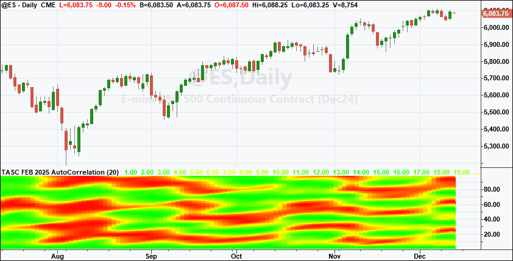
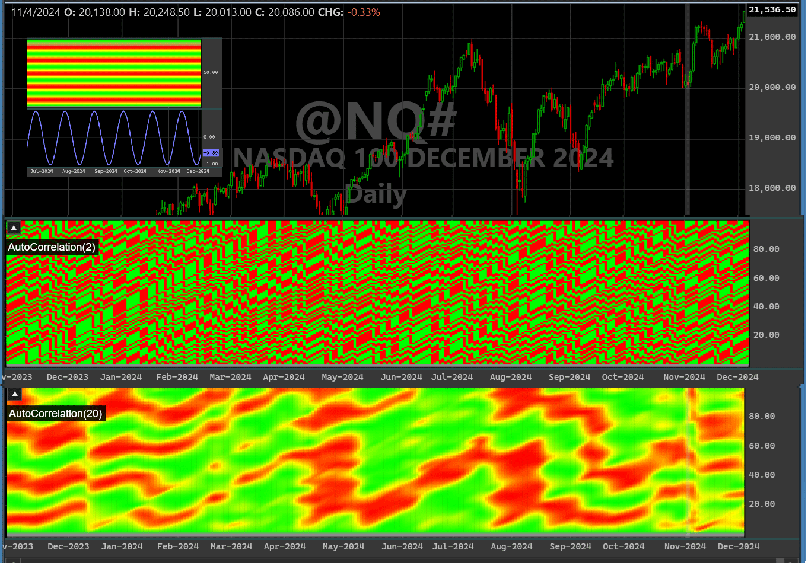
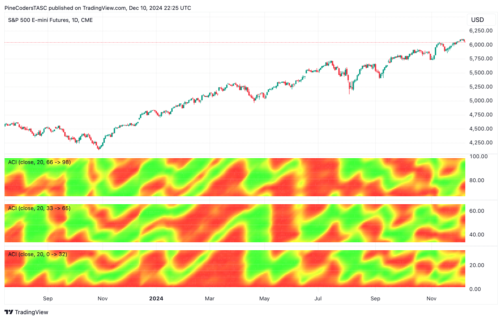
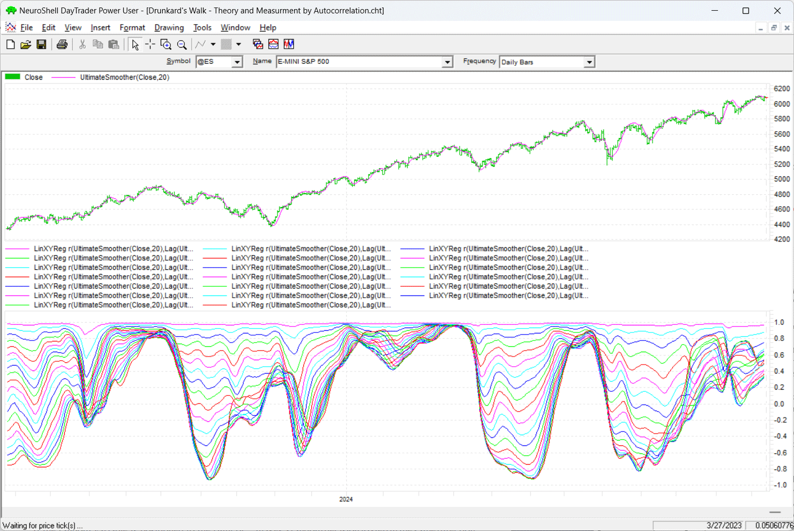
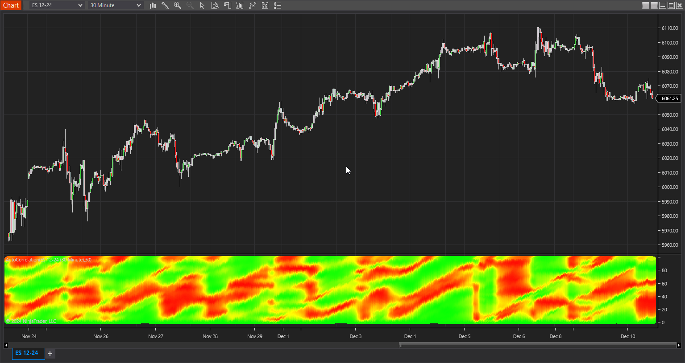

# Traders' Tips — February 2025

**Article reference:** John F. Ehlers, "Drunkard's Walk: Theory And Measurement By Autocorrelation"

- Traders' Tips URL: <https://traders.com/Documentation/FEEDbk_docs/2025/02/TradersTips.html>

---

For this month's Traders' Tips, the focus is John F. Ehlers' article in this issue, "Drunkard's Walk: Theory And Measurement By Autocorrelation." Here, we present the February 2025 Traders' Tips code with possible implementations in various software.

The Traders' Tips section is provided to help the reader implement a selected technique from an article in this issue or another recent issue. The entries here are contributed by software developers or programmers for software that is capable of customization.

---

## TradeStation: February 2025

John Ehlers' new autocorrelation indicator, introduced in this article in this issue ("Drunkard's Walk: Theory And Measurement By Autocorrelation") can be used to identify patterns in financial markets, which often behave unpredictably, like a "drunkard's walk." This indicator draws upon mathematical models—the diffusion equation for trends and the wave equation for cycles—to uncover hidden order within seemingly random price movements. By analyzing the correlation of price data over different periods, the indicator can be used to reveal cyclical patterns, potential reversals, and emerging trends.

### $SuperSmoother Function

External file: [`TradeStation_SuperSmoother.els`](TradeStation_SuperSmoother.els)

```easylanguage
Function: $SuperSmoother
{
	SuperSmoother Function
 	(C) 2004-2024 John F. Ehlers
}

inputs:
	Price(numericseries),
	Period(numericsimple);

variables:
	a1( 0 ),
	b1( 0 ),
	c1( 0 ),
	c2( 0 ),
	c3( 0 );

a1 = ExpValue(-1.414 * 3.14159 / Period);
b1 = 2 * a1 * Cosine(1.414 * 180 / Period);
c2 = b1;
c3 = -a1 * a1;
c1 = 1 - c2 - c3;

if CurrentBar >= 4 then 
	$SuperSmoother = c1*(Price + Price[1]) / 2 
	 + c2 * $SuperSmoother[1] + c3 * $SuperSmoother[2];
if CurrentBar < 4 then 
	$SuperSmoother = Price;
```

### Autocorrelation Indicator

External file: [`TradeStation_Autocorrelation.els`](TradeStation_Autocorrelation.els)

```easylanguage
Indicator: Autocorrelation 
{
	TASC FEB 2025
	AutoCorrelation Indicator
	(C) 2024 John F. Ehlers
}

inputs:
	Length( 20 );

variables:
	Filt( 0 ),
	Lag( 0 ),
	J( 0 ),
	Sx( 0 ),
	Sy( 0 ),
	Sxx( 0 ),
	Sxy( 0 ),
	Syy( 0 ),
	X( 0 ),
	Y( 0 ),
	Color1( 0 ), 
	Color2( 0 );

arrays:
	Corr[100]( 0 );
	
Filt = $UltimateSmoother( Close, 20 );

// Cycle test waveform
// Filt = Sine(360*CurrentBar / 20);

// >>>>>>>>> Correlation >>>>>>>>>>>>
for Lag = 0 to 99 
begin
	Sx = 0;
	Sy = 0;
	Sxx = 0;
	Sxy = 0;
	Syy = 0;
	for J = 0 to Length - 1 
	begin
		X = Filt[J];
		Y = Filt[Lag + J];
		Sx = Sx + X;
		Sy = Sy + Y;
		Sxx = Sxx + X*X;
		Sxy = Sxy + X*Y;
		Syy = Syy + Y*Y;
	end;
	
	If (Length*Sxx - Sx*Sx > 0) and (Length*Syy - Sy*Sy > 0) Then
	Corr[Lag + 1] = (Length*Sxy - Sx*Sy) / SquareRoot((Length*Sxx -
	Sx*Sx)*(Length*Syy - Sy*Sy));
end;

//Plot the AutoCorrelation as a Heatmap
for Lag = 1 to 99 
begin
	//Convert Power to RGB Color for Display
	if Corr[Lag + 1] >= 0 Then 
	begin
		Color2 = 255;
		Color1 = 255*(1 - Corr[Lag + 1]);
	end;

	if Corr[Lag + 1] < 0 then 
	begin
		Color2 = 255*(1 + Corr[Lag + 1]);
		Color1 = 255;
	end;

	switch( Lag )
	begin
		case 0:
			Plot1(0, "S0", RGB(Color1, Color2, 0), 0, 4);
		case 1:
			Plot2(1, "S1", RGB(Color1, Color2, 0), 0, 4);
		{ ... cases 2-98 follow the same pattern ... }
		case 98:
			Plot99(98, "S98", RGB(Color1, Color2, 0), 0, 4);
	end;
end;
```

*(Full code with all case statements is in the external file.)*



*This article is for informational purposes. No type of trading or investment recommendation, advice, or strategy is being made, given, or in any manner provided by TradeStation Securities or its affiliates.*

—John Robinson
TradeStation Securities, Inc.
[www.TradeStation.com](http://www.tradestation.com/)

---

## Wealth-Lab.com: February 2025

So...a Z-transform and a LaPlace transform walked into a smokey bar and began solving the continuous variable random walk problem with differential and wave equations. They stumbled out in a drunkard's walk...

In the article "Drunkard's Walk: Theory And Measurement By Autocorrelation" in this issue, John Ehlers presents coding for his autocorrelation indicator and heatmap display. WealthLab's version of that code is presented here, with the result given in Figure 2.

We find that the 2-period autocorrelation is quick to predict reversals and may produce many false alarms.

External file: [`WealthLab_Autocorrelation.cs`](WealthLab_Autocorrelation.cs)

```csharp
using WealthLab.Backtest;
using System;
using WealthLab.Core;
using WealthLab.Indicators;
using WealthLab.TASC;

namespace WealthScript6 
{
    public class DrunkardAutoCorr : UserStrategyBase
    {
        Parameter _period;
        Parameter _testWave;

        public DrunkardAutoCorr()
        {
            _period = AddParameter("Period", ParameterType.Int32, 20, 5, 60, 1);
            _testWave = AddParameter("Sine Test", ParameterType.Int32, 0, 0, 1);
        }

        public override void Initialize(BarHistory bars)
        {
            int length = _period.AsInt;
            double[] corr = new double[101];

            TimeSeries[] raster = new TimeSeries[101];
            for (int n = 0; n < 101; n++)
            {
                raster[n] = new TimeSeries(bars.DateTimes, n);
                PlotTimeSeriesLine(raster[n], "", "A/C", WLColor.Black, 4, suppressLabels: true);
            }
            DrawHeaderText($"AutoCorrelation({length})", WLColor.White, 12, "A/C");
            SetPaneDrawingOptions("A/C", 40);
            TimeSeries _filt = UltimateSmoother.Series(bars.Close, _period.AsInt);

            if (_testWave.AsInt == 1)
            {
                _filt = new TimeSeries(bars.DateTimes);
                for (int n = 0; n < bars.Count; n++)
                    _filt[n] = Math.Sin(2 * Math.PI * n / 20);
                PlotTimeSeriesLine(_filt, "Sine", "Sine");
            }

            for (int bar = length + 100; bar < bars.Count; bar++)
            {
                for (int lag = 0; lag < 100; lag++)
                {
                    double Sx = 0, Sy = 0, Sxx = 0, Sxy = 0, Syy = 0;
                    for (int j = 0; j < length; j++)
                    {
                        double X = _filt[bar - j];
                        double Y = _filt[bar - (lag + j)];
                        Sx += X; Sy += Y;
                        Sxx += X * X; Sxy += X * Y; Syy += Y * Y;
                    }
                    if (length * Sxx - Sx * Sx > 0 && length * Syy - Sy * Sy > 0)
                        corr[lag + 1] = (length * Sxy - Sx * Sy) /
                            Math.Sqrt((length * Sxx - Sx * Sx) * (length * Syy - Sy * Sy));
                }

                for (int lag = 1; lag < 100; lag++)
                {
                    byte clr1 = 255, clr2 = 255;
                    if (corr[lag + 1] >= 0)
                        clr1 = (byte)(255 * (1 - corr[lag + 1]));
                    else
                        clr2 = (byte)(255 * (1 + corr[lag + 1]));
                    SetSeriesBarColor(raster[lag + 1], bar, WLColor.FromRgb(clr1, clr2, 0));
                }
            }
        }

        public override void Execute(BarHistory bars, int idx)
        {  }
    }
}
```



—Robert Sucher
Wealth-Lab team
[www.wealth-lab.com](http://www.wealth-lab.com/)

---

## TradingView: February 2025

The TradingView Pine Script code presented here implements John Ehlers' autocorrelation indicator, introduced in his article in this issue titled "Drunkard's Walk: Theory And Measurement By Autocorrelation."

External file: [`TradingView_Autocorrelation.pine`](TradingView_Autocorrelation.pine)

```pine
//  TASC Issue: February 2025
//     Article: Drunkard's Walk:
//              Theory And Measurement By Autocorrelation.
//  Article By: John F. Elhers
//    Language: TradingView's Pine Script™ v5
// Provided By: PineCoders, for tradingview.com


//@version=5
title ='TASC 2025.02 Autocorrelation Indicator'
stitle = 'ACI'
indicator(title, stitle, false)


// --- Inputs and Constants ---

enum R
    R1 = '0 -> 32'
    R2 = '33 -> 65'
    R3 = '66 -> 98'

float FROT = 2.0 * math.pi
float SQRT2 = math.sqrt(2.0)
float TS = math.sin(FROT * bar_index / 30.0)

float Src  = input.source(close, 'Source:')
int Length = input.int(100, 'Length:')
bool iTest = input.bool(false, 'Use Test Signal:')
R iR = input.enum(R.R1, 'Range Selection:')


// --- Functions ---

UltimateSmoother (float src, int period) =>
    float a1 = math.exp(-1.414 * math.pi / period)
    float c2 = 2.0 * a1 * math.cos(1.414 * math.pi / period)
    float c3 = -a1 * a1
    float c1 = (1.0 + c2 - c3) / 4.0
    float us = src
    if bar_index >= 4
        us := (1.0 - c1) * src + 
              (2.0 * c1 - c2) * src[1] - 
              (c1 + c3) * src[2] + 
              c2 * nz(us[1]) + c3 * nz(us[2])
    us

correlation (float src, int length) =>
    float[] _corr = array.new<float>(101, 0.0)
    color[] _col = array.new<color>(101, #00000000)
    for _l = 0 to 99
        float _Sx = 0.0, float _Sy = 0.0
        float _Sxx = 0.0, float _Sxy = 0.0, float _Syy = 0.0
        for _j = 0 to length - 1
            float _x = src[_j]
            float _y = src[_l + _j]
            _Sx += _x, _Sy += _y
            _Sxx += _x * _x, _Sxy += _x * _y, _Syy += _y * _y
        float _ca1 = length * _Sxx - _Sx * _Sx
        float _ca2 = length * _Syy - _Sy * _Sy
        if _ca1 > 0.0 and _ca2 > 0.0
            _corr.set(_l + 1, (length * _Sxy - _Sx * _Sy) / math.sqrt(_ca1 * _ca2))
    for _l = 1 to 99
        float _c = _corr.get(_l + 1)
        if _c >= 0.0
            _col.set(_l, color.rgb(255, 255 * (1.0 - _c), 0))
        if _c < 0.0
            _col.set(_l, color.rgb(255 * (1.0 + _c), 255, 0))
    _col


// --- Calculations ---

float Filt = iTest ? TS : UltimateSmoother(Src, Length)
color[] C = correlation(Filt, Length)

switch iR
    R.R1 => C := C.slice(0, 32)
    R.R2 => C := C.slice(33, 65)
    => C := C.slice(66, 98)

// ... IDX and plot statements for 32 lag bands ...
```

*(Full code with all IDX variables and plot statements is in the external file.)*

The indicator is available on TradingView from the PineCodersTASC account at <https://www.tradingview.com/u/PineCodersTASC/#published-scripts>.



—PineCoders, for TradingView
[www.TradingView.com](http://www.tradingview.com/)

---

## Neuroshell Trader: February 2025

In "Drunkard's Walk: Theory And Measurement By Autocorrelation" in this issue, John Ehlers introduces his autocorrelation indicator displayed on a periodogram. Ehlers designed the approach he describes in the article to help to analyze price data over different periods.

This type of sliding window correlation can be easily implemented in NeuroShell Trader. Simply select "New indicator ..." from the *insert* menu and use the indicator wizard to create the indicator. Note that by entering a parameter value of 0:99, NeuroShell Trader will automatically insert the correlation with lags between 0 and 99 in one single step onto your NeuroShell Trader chart:

```
LinXYReg r( UltimateSmoother(Close,20), Lag(UltimateSmoother(Close,20),0:99),20)
```

Users of NeuroShell Trader can go to the Stocks & Commodities section of the NeuroShell Trader free technical support website to download a copy of this or any previous Traders' Tips.



—Ward Systems Group, Inc.
[sales@wardsystems.com](mailto:sales@wardsystems.com)
[www.neuroshell.com](http://www.neuroshell.com/)

---

## The Zorro Project: February 2025

John Ehlers' article in this issue, "Drunkard's Walk: Theory And Measurement By Autocorrelation," deals with the usage of price autocorrelation for trading. Autocorrelation can be found in real price curves but is not found in completely random data. Depending on market regime, prices correlate with themselves shifted by some lag into the past. This is caused by some cyclic behavior of price curves, and can be used for trading systems.

In his EasyLanguage script, Ehlers generates an autocorrelation heatmap over a lag range from 1 to 100. He is not using raw price data, but rather, filters it beforehand with his UltimateSmoother. That filter was the topic of a past S&C article by Ehlers and the accompanying Traders' Tips section, so I already coded it. Here again is the code for the UltimateSmoother, in C:

External file: [`Zorro_UltimateSmoother.c`](Zorro_UltimateSmoother.c)

```c
var UltimateSmoother (var *Data, int Length)
{
  var f = (1.414*PI) / Length;
  var a1 = exp(-f);
  var c2 = 2*a1*cos(f);
  var c3 = -a1*a1;
  var c1 = (1+c2-c3)/4;
  vars US = series(*Data,4);
  return US[0] = (1-c1)*Data[0] + (2*c1-c2)*Data[1] - (c1+c3)*Data[2]
   + c2*US[1] + c3*US[2];
}
```

Next, we can replicate Ehlers' autocorrelation heatmap from his article in this issue. His script plots every pixel of the heatmap in a separate function. The Zorro platform provides heatmap and contour plots as part of its advanced plotting functions. This results in somewhat simpler and shorter code:

External file: [`Zorro_Autocorrelation.c`](Zorro_Autocorrelation.c)

```c
void run() 
{
  BarPeriod = 1440;
  StartDate = 20231001;
  EndDate = 20240901;
  LookBack = 150;
  assetAdd("SPY","STOOQ:SPY.US");
  asset("SPY");
  int Lag, Length = 20;
  vars Prices = series(SmoothUltimate(seriesC(),Length));
  if(!is(LOOKBACK))
    for(Lag=1; Lag<100; Lag++) {
      int Row = dataRow(1,dataAppendRow(1,3));
      dataSet(1,Row,0,Correlation(Prices+Length,Prices+Length+Lag,Length));
      dataSet(1,Row,1,wdate());
      dataSet(1,Row,2,(var)Lag);
   }
if(is(EXITRUN))
  dataChart(1,0,CONTOUR,NULL);}
```

In this code, we're storing the correlation value, the date, and the lag in a dataset. For the correlation, we're using the Pearson correlation function. The resulting heatmap replicates the chart in Ehlers' article, but I think it looks a bit prettier! (See Figure 5).


The y-axis is the lag, and the x-axis is the date in the Windows DATE format, which is simply the number of days since 1899. Green areas have strong correlation, while the red areas show strong anticorrelation. We can see from the periodic patterns that the SPY price curve indeed has cyclic components which allow, to some degree, the prediction of short-term price trends.

The code can be downloaded from the 2024 script repository on [https://financial-hacker.com](https://financial-hacker.com/). The Zorro platform can be downloaded from [https://zorro-project.com](https://zorro-project.com/).

—Petra Volkova
The Zorro Project by oP group Germany
[https://zorro-project.com](https://zorro-project.com/)

---

## NinjaTrader: February 2025

In "Drunkard's Walk: Theory And Measurement By Autocorrelation" in this issue, John Ehlers introduces his autocorrelation indicator. The indicator discussed in the article is available for download at the following link for NinjaTrader 8:

- **NinjaTrader 8:** [ninjatrader.com/SC/February2025SCNT8.zip](http://www.traders.com/Documentation/FEEDbk_docs/2025/02/images/code/Feburary2025SCNT8.zip)

Once the file is downloaded, you can import the indicator into NinjaTrader 8 from within the control center by selecting Tools → Import → NinjaScript Add-On and then selecting the downloaded file for NinjaTrader 8.

You can review the indicator source code in NinjaTrader 8 by selecting the menu New → NinjaScript Editor → Indicators folder from within the control center window and selecting the file.



NinjaScript uses compiled DLLs that run native, not interpreted, to provide you with the highest performance possible.

—NinjaTrader_JesseN.
NinjaTrader, LLC
[www.ninjatrader.com](http://www.ninjatrader.com/)

---

*Originally published in the February 2025 issue of Technical Analysis of Stocks & Commodities magazine. All rights reserved. Copyright 2025, Technical Analysis, Inc.*

---

## BibTeX

```bibtex
@misc{traderstips2025feb,
  title        = {Traders' Tips --- February 2025},
  howpublished = {Technical Analysis of Stocks \& Commodities},
  year         = {2025},
  month        = feb,
  url          = {https://traders.com/Documentation/FEEDbk_docs/2025/02/TradersTips.html},
  note         = {Implementations of John F. Ehlers' Drunkard's Walk Autocorrelation indicator in various platforms}
}
```
