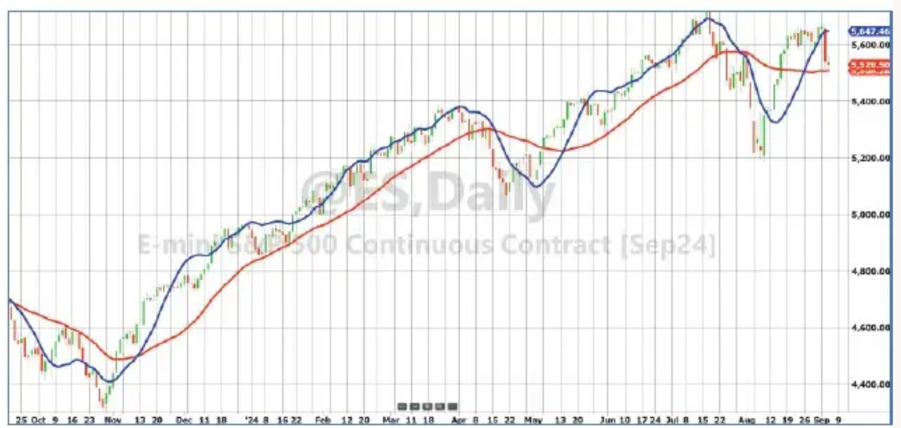
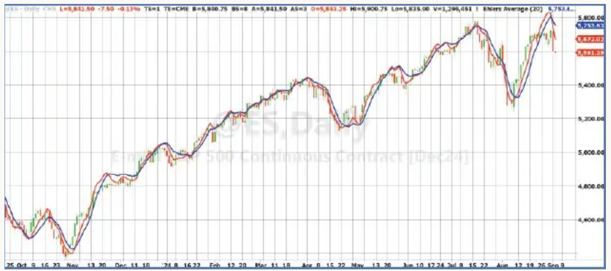

# Removing Moving Average Lag

**John F. Ehlers**
*Technical Analysis of Stocks & Commodities*, Volume 43, March 2025, pp. 8–12

- **Article**: <https://technical.traders.com/archive/article.asp?file=\V43\C03\923EHLE.pdf>
- **Traders' Tips**: <https://www.traders.com/Documentation/FEEDbk_docs/2025/03/TradersTips.html>

---

> The lag effect in a moving average is its tradeoff. Reducing lag improves the timeliness of trading signals. Here, we present a new simple but elegant solution that all traders will appreciate.

The best statistical estimate of a block of price values is the average of all the prices. When in a time series, the position of that estimate is in the center of the block along the time axis. That establishes a dot in the time–price space. A moving average is created by sequentially moving the block over one space in the time axis and then connecting the dots. The result is that the moving average indicator line lags the prices on the chart by half the length of data.

Timing is important to a technical trader, and better trading results if the lag can be reduced. In this article, I will describe a new moving average that is superior to a simple moving average (SMA) because it can provide a significant improvement in trade timing.

## Introducing the Projected Moving Average (PMA)

The slope of the time series block of data can be computed from the covariance in linear regression. The apparent lag of the moving average can be removed by adding the slope times half the length of the average to the average itself. The average is centered in the window along the time axis (because of the uniform sampling rate). The average is positioned vertically along the price axis. To move the average to the right-hand side of the window, it must move to the right by half the window width. The slope, determined from the covariance, determines the projection of the average vertically at the right-hand side of the window. The equation to do this is:

$$\text{Projected Moving Average} = \text{Average} + \text{Slope} \cdot \text{Length} / 2$$

By using slope to remove lag, the PMA can be considered as a first-order prediction of an SMA. Also, formulated as counting backwards from the current bar, the PMA is the same as the "y-intercept" of a linear regression.

Figure 1 compares a 30-bar SMA in red with the 30-bar PMA in blue. Prices vary about the PMA due to the half-length projection rather than having the SMA lag the prices.


**Figure 1:** PMA vs. SMA. The projected moving average (in blue) is a better fit to the data than a simple moving average (in red).

It is common to use a 200-day moving average in technical analysis. Figure 2 compares the 200-day SMA to the 200-day PMA. When the lag is removed, the prices appear to be plotted as a deviation from the average line rather than as a trend crossing.


**Figure 2:** 200-day projected moving average. When the lag is removed from the moving average, the prices appear to be plotted as a deviation from the average line rather than as a trend crossing. Price appears here as a deviation from a 200-day PMA (in blue). A 200-day SMA is shown in red for comparison.

I have written the PMA as a function so that you can apply it to your charts as easily as applying an SMA. The EasyLanguage code for the PMA function as well as the SMA is given in the sidebar "Projected Moving Average Function ($PMA), in EasyLanguage." The name of the function is $PMA. The dollar sign in the name moves this function to the top of the code listings. The negative sign in the function to compute the slope results from computing the covariance from right to left, but the projection is applied left to right.

Code for plotting the PMA indicator and its prediction is given in the sidebar "Projected Moving Average And Its Prediction, In EasyLanguage." The prediction is a second-order prediction, using the rate change of slope for the calculation. You can also plot the SMA by removing the comment slash marks in the last line of the code. An example chart displaying the PMA in blue and its prediction in red is shown in Figure 3.


**Figure 3:** PMA and its prediction, with crossings as signals. The PMA is shown in blue and its prediction is shown in red. Crossings identify timely buying and selling opportunities.

## Prediction to Further Reduce Lag

Forming a prediction is a way of further reducing indicator lag. In the case of the PMA, the first-order prediction is formed by adding the slope across half the data window to the value of the SMA.

The usefulness of almost any indicator can be enhanced by including its prediction because the prediction crossing the indicator forms events that flag buying and selling opportunities.

In classical physics, slope is analogous to velocity and distance is equal to velocity times time. That is $x = v \cdot t$. Acceleration is the rate change of velocity, and distance is computed as $x = 0.5 \cdot a \cdot t^2$. In our case, time is just the unit sampling rate. So we can compute acceleration as one half of the two-bar difference of slope. The two-bar difference provides a zero in the transfer response at the Nyquist frequency, thereby reducing the high-frequency chop in the calculation of the acceleration term compared to a one-bar difference of slope.

The derivation of a generalized prediction of an indicator, where the indicator variable is "Smooth," is as follows:

$$
\begin{aligned}
\text{Prediction} &= \text{Smooth} + \text{Velocity} + 0.5 \cdot \text{Acceleration} \\
&= \text{Smooth} + \text{Slope} + 0.5 \cdot (\text{Previous Slope} - \text{Slope}) \\
&= \text{Smooth} + 0.5 \cdot \text{Slope} + 0.5 \cdot \text{Previous Slope} \\
&= \text{Smooth} + 0.5 \cdot (\text{Smooth} - \text{Smooth}[2]) + 0.5 \cdot (\text{Smooth}[2] - \text{Smooth}[4]) \\
&= 1.5 \cdot \text{Smooth} - 0.5 \cdot \text{Smooth}[4]
\end{aligned}
$$

The notation Smooth[4] means the value of the variable Smooth four bars ago.

The data slope computed in a linear regression is a high-fidelity indicator of the price action with the trend removed. This slope is provided as an output of the $PMA function. Slope is used to demonstrate a generalized oscillator and its generalized prediction. This is given in the sidebar "Plot Slope And Its Prediction, In EasyLanguage." An example chart of the output is shown in Figure 4.


**Figure 4:** Slope. By using slope to remove lag, the PMA can be considered as a first-order prediction of an SMA. The slope (in blue) is a high-fidelity oscillator-type indicator. Crossings of the prediction indicator (red) identify timely buying and selling opportunities.

## Conclusions

1. The projected moving average is a simple moving average with its lag removed.
2. SMA lag is removed by projecting the average, which is located at the center of the data window, to the right-hand side of the data window by adding the slope times half the window length to the value of the average.
3. The projected moving average is the same as the y-intercept of linear regression.
4. A second-order prediction of the projected moving average is produced by adding a two-bar difference of slope times half the window length to the PMA value.
5. A generalized second-order prediction of any indicator line is computed as 1.5 times the indicator value less one-half the indicator value four bars ago.

---

## Code Listings

### Projected Moving Average Function ($PMA), in EasyLanguage

Here is the projected moving average (PMA) as a function coded in EasyLanguage so it can be applied to charts just as any moving average would be applied. The name of the function as coded here is “$PMA.” Note that the dollar sign in the name is solely to move the function to the top of the list in TradeStation, but it is part of the name of the function. The function, $PMA, is distinctly different from PMA, the indicator (given in the next sidebar).

Note also that computing the covariance from right to left in the slope computation results in a negative sign, but the projection is applied left to right.

```easylanguage
{
    Projected Moving Average Function
    (C) 2024 John F. Ehlers
}
Inputs:
    Price(numericseries),
    Length(numericsimple),
    PMA(numericref),
    Slope(numericref),
    SMA(numericref);
Vars:
    count(0),
    Sx(0),
    Sy(0),
    Sxx(0),
    Syy(0),
    Sxy(0);

Sx = 0;
Sy = 0;
Sxx = 0;
Syy = 0;
Sxy = 0;
For count = 1 to Length Begin
    Sx = Sx + count;
    Sy = Sy + Price[count - 1];
    Sxx = Sxx + count*count;
    Syy = Syy + Price[count - 1]*Price[count - 1];
    Sxy = Sxy + count*Price[count - 1];
End;
Slope = -(Length*Sxy - Sx*Sy) / (Length*Sxx - Sx*Sx);
SMA = Sy / Length;
PMA = SMA + Slope*Length / 2;

//Function Return Value
$PMA = 1;
```

### Projected Moving Average Indicator and Its Prediction, in EasyLanguage

Here is EasyLanguage code to plot the PMA indicator and its prediction. The prediction is a second-order prediction, using the rate change of slope for the calculation. You can also plot the SMA by removing the comment slash marks in the last line of the code.

```easylanguage
{
  Projected Moving Average (PMA)
  (C) 2024 John F. Ehlers
}
Inputs:
    Length(20);
Vars:
    ReturnValue(0),
    PMA(0),
    Slope(0),
    SMA(0),
    Predict(0);

ReturnValue = $PMA(Close, Length, PMA, Slope, SMA);
Predict = PMA + .5*(Slope - Slope[2])*Length;
Plot1(PMA);
Plot2(Predict);
//Plot3(SMA);
```

### Plot Slope and Its Prediction, in EasyLanguage

Slope is provided as an output of the $PMA function. Slope is used to demonstrate a generalized oscillator and its generalized prediction.

```easylanguage
{
    PMA Slope and Its Prediction
    (C) 2024 John F. Ehlers
}
Inputs:
    Length(20);
Vars:
    ReturnValue(0),
    PMA(0),
    Slope(0),
    SMA(0),
    Predict(0);

ReturnValue = $PMA(Close, Length, PMA, Slope, SMA);
Predict = 1.5*Slope - .5*Slope[4];
Plot1(Slope);
Plot2(0);
Plot3(Predict);
```

---

## References

```bibtex
@article{ehlers2025pma,
  author  = {Ehlers, John F.},
  title   = {Removing Moving Average Lag},
  journal = {Technical Analysis of Stocks \& Commodities},
  volume  = {43},
  number  = {3},
  pages   = {8--12},
  year    = {2025},
  month   = mar,
  url     = {https://technical.traders.com/archive/article.asp?file=\V43\C03\923EHLE.pdf}
}

@misc{traderstips2025mar,
  title        = {Traders' Tips},
  howpublished = {Technical Analysis of Stocks \& Commodities},
  year         = {2025},
  month        = mar,
  note         = {Implementations of Ehlers' Projected Moving Average in various platforms},
  url          = {https://www.traders.com/Documentation/FEEDbk_docs/2025/03/TradersTips.html}
}
```

---

*John Ehlers is a retired electrical engineer and a retired technical analyst, specializing in the application of DSP (digital signal processing) to trading. For more information, see [www.mesasoftware.com](http://www.mesasoftware.com).*
