# Traders' Tips — March 2025

**Article reference:** John F. Ehlers, "Removing Moving Average Lag"

- Traders' Tips URL: <https://traders.com/Documentation/FEEDbk_docs/2025/03/TradersTips.html>

---

For this month's Traders' Tips, the focus is John F. Ehlers' article in this issue, "Removing Moving Average Lag." Here, we present the March 2025 Traders' Tips code with possible implementations in various software.

The Traders' Tips section is provided to help the reader implement a selected technique from an article in this issue or another recent issue. The entries here are contributed by software developers or programmers for software that is capable of customization.

---

## TradeStation: March 2025

In "Removing Moving Average Lag" in this issue, John Ehlers introduces a *projected moving average* (PMA) designed to remove the lag inherent in moving averages. He does this by adding the slope times half the length of the average to the average itself. A function labeled $PMA is provided for the calculations. A sample chart displaying the PMA, the PMA slope, and its prediction, as discussed in Ehlers' article, is shown in Figure 1.

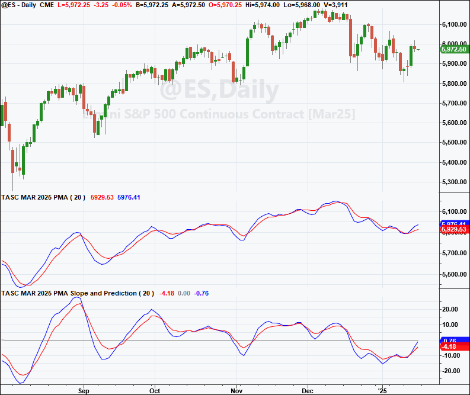

External file: [`TradeStation_PMA.els`](TradeStation_PMA.els)

```easylanguage
Function: $PMA
{
	TASC MAR 2025
	Projected Moving Average ($PMA) Function
	(C) 2024 John F. Ehlers
}

inputs:
	Price( numericseries ),
	Length( numericsimple ),
	PMA( numericref ),
	Slope( numericref ),
	SMA( numericref );

variables:
	Count( 0 ),
	Sx( 0 ),
	Sy( 0 ),
	Sxx( 0 ),
	Syy( 0 ),
	Sxy( 0 );

Sx = 0;
Sy = 0;
Sxx = 0;
Syy = 0;
Sxy = 0;

for Count = 1 to Length
begin
	Sx = Sx + Count;
	Sy = Sy + Price[Count - 1];
	Sxx = Sxx + Count * Count;
	Syy = Syy + Price[Count - 1] * Price[Count - 1];
	Sxy = Sxy + count*Price[Count - 1];
end;

Slope = -(Length * Sxy - Sx * Sy) / (Length * Sxx - Sx * Sx);
SMA = Sy / Length;
PMA = SMA + Slope * Length / 2;

//Function Return Value
$PMA = 1;


Indicator: Projected Moving Average (PMA)
{
	TASC MAR 2025
	Projected Moving Average (PMA)
	(C) 2024 John F. Ehlers
}

inputs:
	Length( 20 );

variables:
	ReturnValue( 0 ),
	PMA( 0 ),
	Slope( 0 ),
	SMA( 0 ),
	Predict( 0 );
	
ReturnValue = $PMA(Close, Length, PMA, Slope, SMA);
Predict = PMA + .5 * (Slope - Slope[2])*Length;

Plot1( PMA, "PMA" );
Plot2( Predict, "Predict" );
//Plot3( SMA, "SMA" )


Indicator: PMA Slope and Prediction
{
	TASC MAR 2025
	PMA Slope and Its Prediction
	(C) 2024 John F. Ehlers
}

inputs:
	Length( 20 );

variables:
	ReturnValue( 0 ),
	PMA( 0 ),
	Slope( 0 ),
	SMA( 0 ),
	Predict( 0 );

ReturnValue = $PMA(Close, Length, PMA, Slope, SMA);
Predict = 1.5 * Slope - .5 * Slope[4];

Plot1( Slope, "Slope" );
Plot2( 0, "Zero Line" );
Plot3( Predict, "Predict" );
```

*This article is for informational purposes. No type of trading or investment recommendation, advice, or strategy is being made, given, or in any manner provided by TradeStation Securities or its affiliates.*

—John Robinson
TradeStation Securities, Inc.
[www.TradeStation.com](http://www.tradestation.com/)

---

## Wealth-Lab.com: March 2025

We have implemented John Ehlers' *projected moving average* (PMA) as a core indicator that comes out of the box in WealthLab 8.

We can put it to the test with a simple strategy created with drag-and-drop building blocks (Figure 2). We enter at market close when the PMA(30) turns up and exit at market close when it turns down. WealthLab 8's Strategy Monitor has built-in features to allow you to trade an "at-close" strategy like this by running it a few seconds before the actual close and using the up-to-the-second closing price as a proxy for the eventual actual close. In a test on TQQQ, this simple example strategy generated an annualized return of nearly 20% with and average profit of 1.69% per trade.

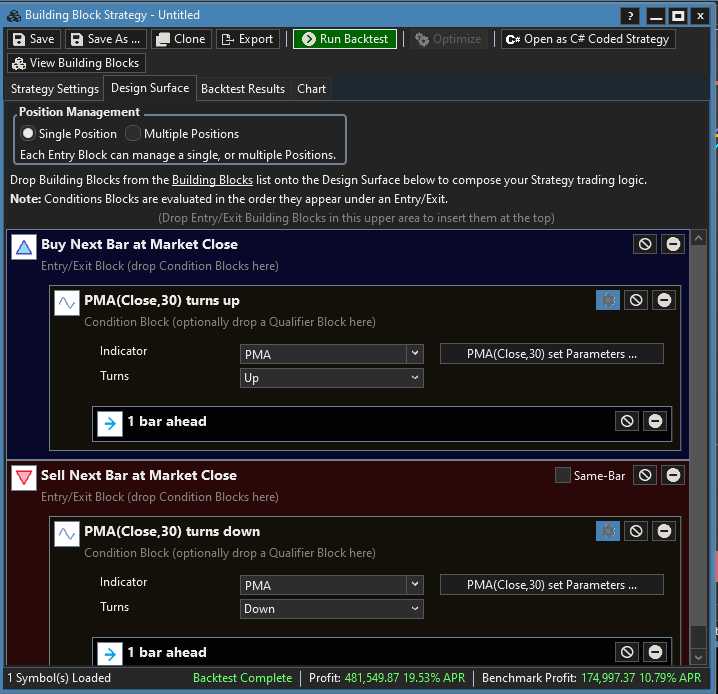

An example chart showing the PMA along with the example strategy on a chart of TQQQ is in Figure 3.

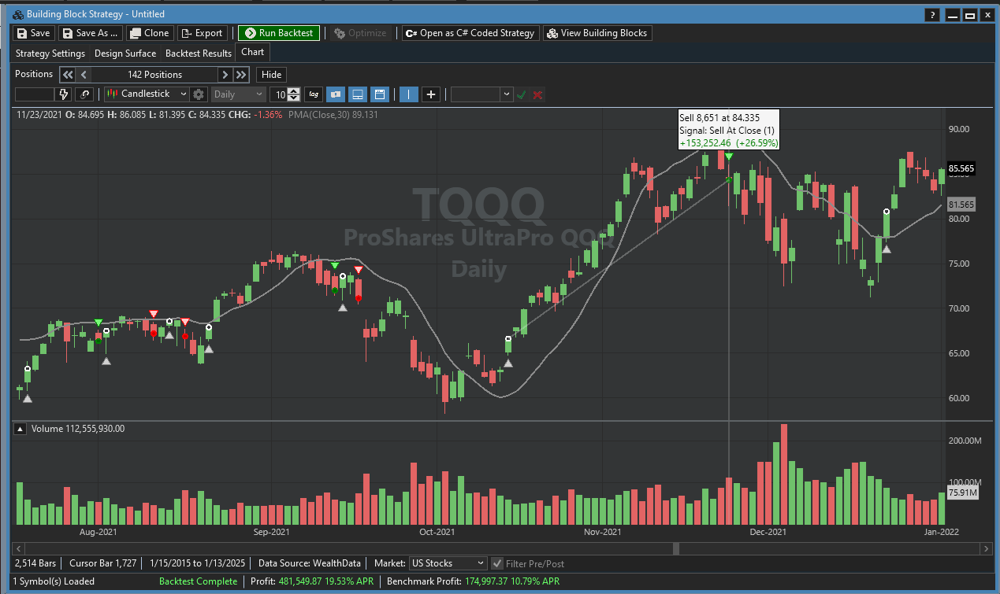

—Dion Kurczek
Wealth-Lab team
[www.wealth-lab.com](http://www.wealth-lab.com/)

---

## TradingView: March 2025

Here is TradingView Pine Script code implementing John Ehlers' projected moving average (PMA), introduced in his article in this issue titled "Removing Moving Average Lag." The PMA is designed to remove the lag inherent in moving averages.

External file: [`TradingView_PMA.pine`](TradingView_PMA.pine)

```pine
//  TASC Issue: March 2025
//     Article: A New Solution
//              Removing Moving Average Lag
//  Article By: John F. Elhers
//    Language: TradingView's Pine Script® v6
// Provided By: PineCoders, for tradingview.com

//@version=6
title ='TASC 2025.03 A New Solution'+
     ' Removing Moving Average Lag'
stitle = 'TASC'
indicator(title, stitle, false)

// @function Projected Moving Average.
pma (float src, int length) =>
    float Sx = 0.0 , float Sy = 0.0
    float Sxx = 0.0 , float Syy = 0.0 , float Sxy = 0.0
    for count = 1 to length
        float src1 = src[count - 1]
        Sx += count
        Sy += src[count - 1]
        Sxx += count * count
        Syy += src1 * src1
        Sxy += count * src1
    float Slope = -(length*Sxy-Sx*Sy) / (length*Sxx-Sx*Sx)
    float SMA = Sy / length
    float PMA = SMA + Slope * length / 2
    [PMA, SMA, Slope]

enum DISP
    MA = 'Moving Averages'
    SP = 'Slope And Prediction'

DISP disp = input.enum(DISP.MA, 'Display Mode:')
float src = input.source(close, 'Source:')
int length = input.int(30, 'Length:')

bool is_disp_ma = disp == DISP.MA
bool is_disp_sp = disp == DISP.SP

[pma, sma, slope] = pma(src, length)
float predict = switch
    is_disp_ma => pma + .5 * (slope - slope[2]) * length
    is_disp_sp => 1.5 * slope - 0.5 * slope[4]
    => float(na)

show_ma = is_disp_ma ? display.all : display.none
show_sp = is_disp_sp ? display.all : display.none

plot(src, 'SRC', color.blue, display=show_ma)
plot(pma, 'PMA', color.green, display=show_ma)
plot(predict, 'Predict', color.lime, display=show_ma)
plot(sma, 'SMA', color.red, display=show_ma)

plot(slope, 'Slope', color.blue, display=show_sp)
plot(0, '0', color.silver, display=show_sp)
plot(predict, 'Predict', color.lime, display=show_sp)
```

The indicator is available on TradingView from the PineCodersTASC account: <https://www.tradingview.com/u/PineCodersTASC/#published-scripts>.

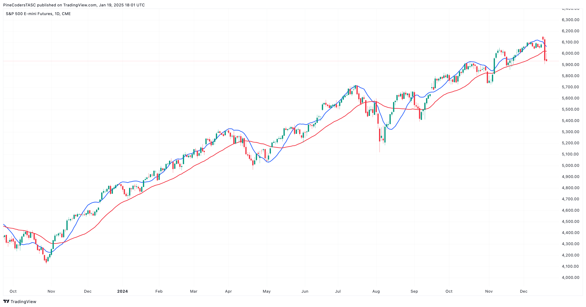

—PineCoders, for TradingView
[www.TradingView.com](http://www.tradingview.com/)

---

## Neuroshell Trader: March 2025

The projected moving average, its prediction, the slope oscillator, and the oscillator prediction, described in John Ehlers' article in this issue titled "Removing Moving Average Lag," can be easily implemented in NeuroShell Trader by selecting "New indicator ..." from the *insert* menu and using the indicator wizard to create the following indicators:

```
Slope:	LinTimeReg Slope(Close,30)
PMA:	Add2(Avg(Close,30),Mul3(Slope, 30,0.5))

PMA Prediction:	Add2(PMA,Mul3(0.5,Momentum(Slope,2),30))

Oscillator Prediction:	Sub(Mul2(1.5, Oscillator),Mul2(0.5,Lag(Oscillator, 4)))
```

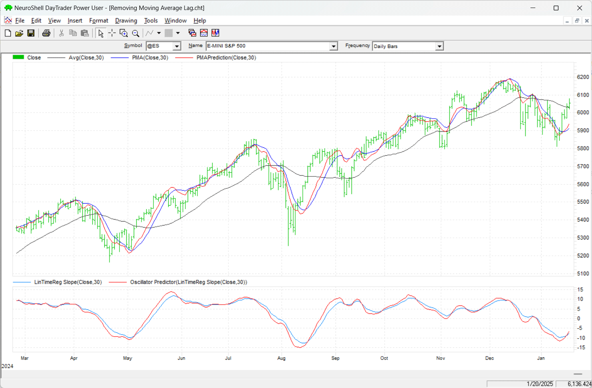

Users of NeuroShell Trader can go to the Stocks & Commodities section of the NeuroShell Trader free technical support website to download a copy of this or any previous Traders' Tips.

—Ward Systems Group, Inc.
[sales@wardsystems.com](mailto:sales@wardsystems.com)
[www.neuroshell.com](http://www.neuroshell.com/)

---

## RealTest: March 2025

Provided here is coding for use in the RealTest platform to implement the indicators described in John Ehlers' article in this issue, "Removing Moving Average Lag."

External file: [`RealTest_PMA.rts`](RealTest_PMA.rts)

```
Notes:
	Projected Moving Average
	TASC Trader's Tips for March 2025 article by John Ehlers

Import:
	DataSource:	Norgate
	IncludeList:	&ES
	StartDate:	1/1/20
	EndDate:	Latest
	SaveAs:	es.rtd
	
Settings:
	DataFile:	es.rtd
	StartDate:	Earliest
	EndDate:	Latest
	BarSize:	Daily

Parameters:
	len:	20

Data:
	smaN:	avg(c, len)
	slopeN:	slope(c, len)
	pmaN:	smaN + slopeN * len / 2
	pmaPredict:	pmaN + 0.5 * (slopeN - slopeN[2]) * len
	slopePredict:	1.5*slopeN-0.5*slopeN[4]
	
Charts:
	smaN:	smaN
	pmaN:	pmaN
	pmaPredict:	pmaPredict
	slopeN:	slopeN {|}
	slopePredict:	slopePredict {|}
```

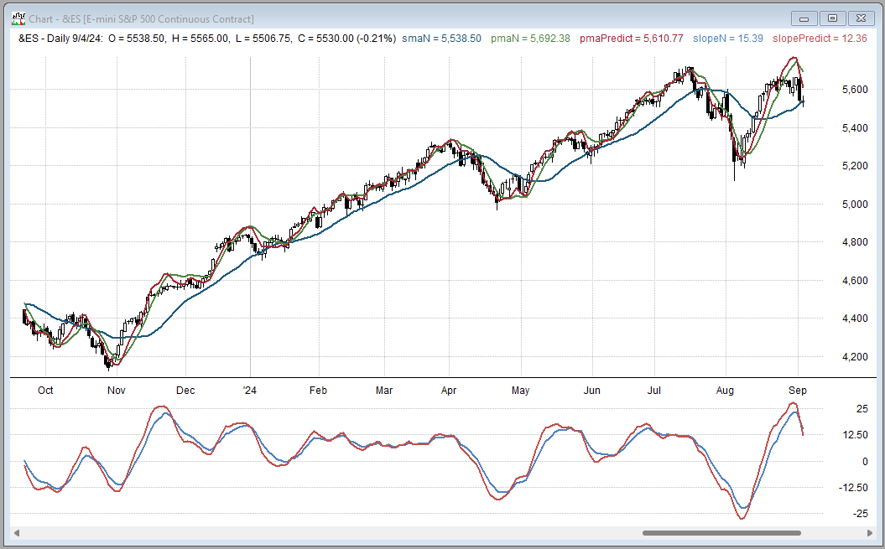

—Marsten Parker
MHP Trading
[mhp@mhptrading.com](mailto:mhp@mhptrading.com)

---

## The Zorro Project: March 2025

In his article in this issue, "Removing Moving Average Lag," John Ehlers proposes a moving average variant that does not suffer from the usual moving average problem: lag. A simple moving average lags by half its period behind the price. The projected moving average (PMA) indicator overcomes this problem by projecting its value by half a period into the future—thus, zero lag.

The PMA function provided here is a straightforward conversion to C of Ehlers' EasyLanguage code given in his article in this issue.

External file: [`Zorro_PMA.c`](Zorro_PMA.c)

```c
var PMA(vars Data,int Length)
{
  var Sx = 0, Sy = 0, Sxx = 0, Syy = 0, Sxy = 0;
  int i;
  for(i=1; i<=Length; i++) {
    Sx += i;
    Sy += Data[i-1];
    Sxx += i*i;
    Syy += Data[i-1]*Data[i-1];
    Sxy += i*Data[i-1];
  }
  var Slope = -(Length*Sxy - Sx*Sy) / (Length*Sxx - Sx*Sx);
  return Sy/Length + Slope*Length/2;
}

void run() 
{
  BarPeriod = 1440;
  StartDate = 20231001;
  EndDate = 20241001;
  LookBack = 30;
  assetAdd("SPX","STOOQ:^SPX");
  asset("SPX");
  plot("PMA",PMA(seriesC(),LookBack),LINE,BLUE);
  plot("SMA",SMA(seriesC(),LookBack),LINE,RED);
}
```

We can see that the PMA (blue) follows the price line much closer than the SMA (red) with the same period.

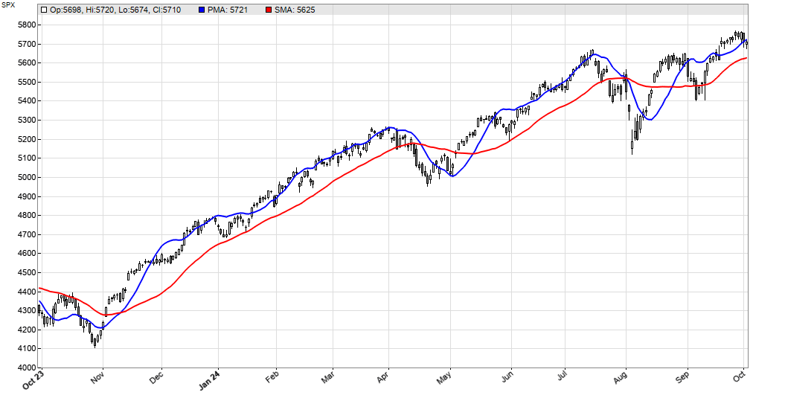

The code can be downloaded from the 2025 script repository on https://financial-hacker.com. The Zorro platform can be downloaded from [https://zorro-project.com](https://zorro-project.com/).

—Petra Volkova
The Zorro Project by oP group Germany
[https://zorro-project.com](https://zorro-project.com/)

---

## NinjaTrader: March 2025

In "Removing Moving Average Lag" in this issue, John Ehlers presents the projected moving average (PMA) and some accompanying indicators. Several of the indicators discussed in the article are available for download at the following link for NinjaTrader 8:

- **NinjaTrader 8:** [ninjatrader.com/SC/March2025SCNT8.zip](https://ninjatrader.com/SC/March2025SCNT8.zip)

Once the file is downloaded, you can import the indicator into NinjaTrader 8 from within the control center by selecting Tools → Import → NinjaScript Add-On and then selecting the downloaded file for NinjaTrader 8.

You can review the indicator source code in NinjaTrader 8 by selecting the menu New → NinjaScript Editor → Indicators folder from within the control center window and selecting the file.

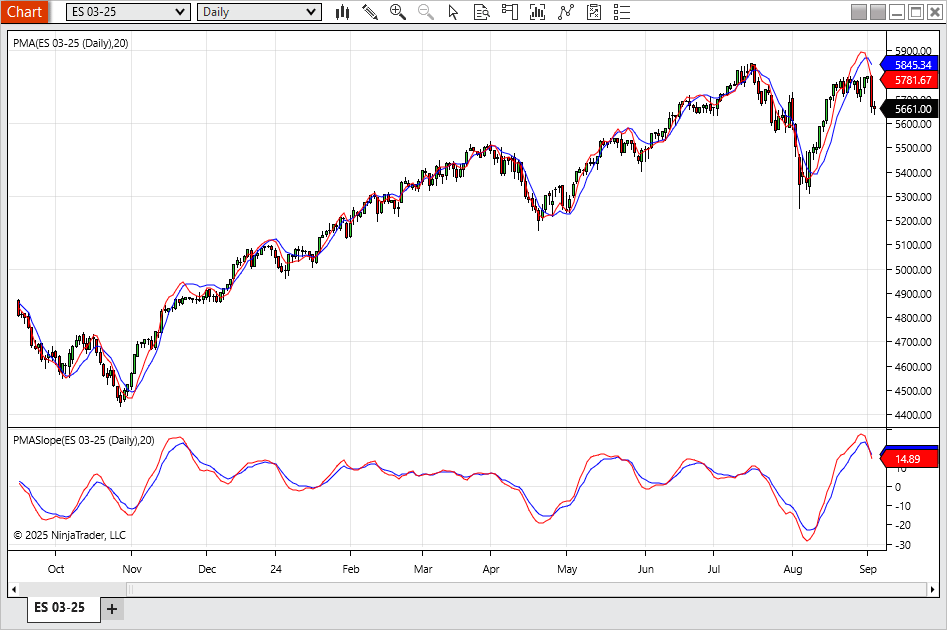

NinjaScript uses compiled DLLs that run native, not interpreted, to provide you with the highest performance possible.

—Jesse N.
NinjaTrader, LLC
[www.ninjatrader.com](http://www.ninjatrader.com/)

---

## Python: March 2025

In "Removing Moving Average Lag" in this issue, John Ehlers introduces his *projected moving average* (PMA), designed to remove the lag inherent in moving averages. His approach involves adding the slope times half the length of the average to the average itself to accomplish the projected moving average. The code listings given in Ehlers' article cover the projected moving average as a function; the projected moving average indicator (and its prediction) to plot on a chart; and slope and its prediction, which in this case is an output from the PMA function code and is used to create an oscillator.

External file: [`Python_PMA.py`](Python_PMA.py)

```python
import pandas as pd
import numpy as np
import datetime as dt
import matplotlib.pyplot as plt
import yfinance as yf

symbol = '^GSPC'
ohlcv = yf.download(symbol, start="2015-01-15", end="2025-01-22")

def linear_regression_slope(samples):
    m, b = np.polyfit(np.arange(len(samples)), np.array(samples), 1)
    return m
    
def calc_linear_regression_slope(in_series, length):
    slope = in_series.rolling(length).apply(linear_regression_slope)
    return slope

def calc_sma(in_series, length):
    return in_series.rolling(length).mean()

def calc_pma(in_series, length):
    sma = calc_sma(in_series, length)
    slope = calc_linear_regression_slope(in_series, length)
    pma = (sma + slope * length / 2)
    return pma

def calc_pma_prediction(pma, slope, length):
    predict = pma + (slope - slope.shift(2)) * length / 2
    return predict

def calc_general_prediction(smooth): 
    predict = 1.5*smooth - 0.5*smooth.shift(4) 
    return predict

length = 30
df = ohlcv.copy()
df['SMA'] = calc_sma(df['Close'], length)
df['PMA'] = calc_pma(df['Close'], length)
df['Slope'] = df['Close'].rolling(length).apply(linear_regression_slope)
df['Predict'] = calc_pma_prediction(df['PMA'], df['Slope'], length)
df['Signal'] = np.where(df['Predict'] > df['PMA'], 1, 0)
df['Slope Predict'] = calc_general_prediction(df['Slope'])
```

*(Full code including plotting functions is in the external file.)*

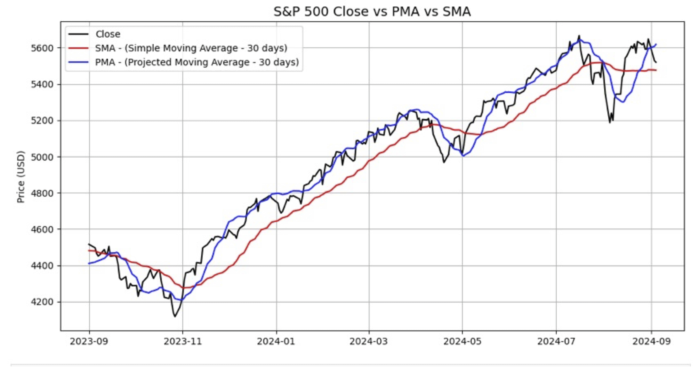

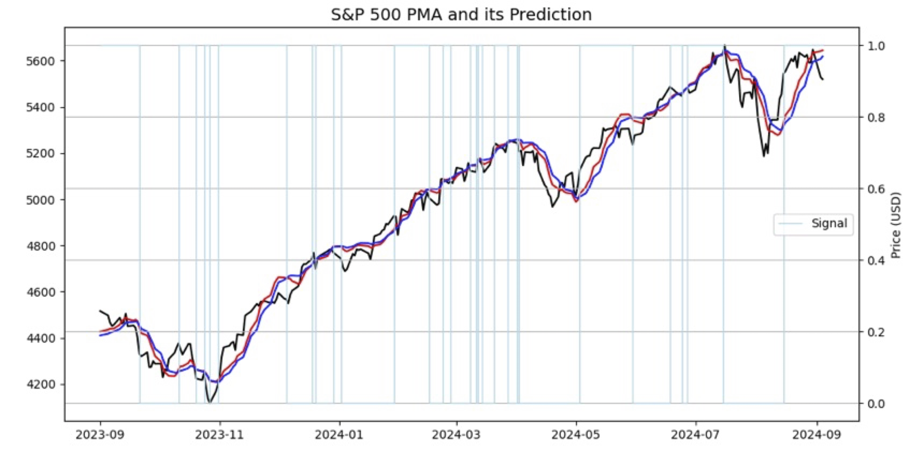


—Rajeev Jain
[jainraje@yahoo.com](mailto:jainraje@yahoo.com)

---

## Python: February 2025

In the article "Drunkard's Walk: Theory And Measurement By Autocorrelation" that appeared in the February 2025 issue, John Ehlers presents coding for his autocorrelation indicator and periodogram display, a technique Ehlers designed to help to analyze price data over different periods.

Following is an implementation of Ehlers' autocorrelation indicator coding to the Python programming language.

External file: [`Python_Autocorrelation_Feb2025.py`](Python_Autocorrelation_Feb2025.py)

```python
import pandas as pd
import numpy as np
import random
import matplotlib.pyplot as plt
import yfinance as yf

def ultimate_smoother(price_data, period):
    US = np.zeros_like(price_data)
    a1 = np.exp(-1.414 * 3.14159 / period)
    b1 = 2 * a1 * np.cos(1.414 * 180 / period)
    c2 = b1
    c3 = -a1 * a1
    c1 = (1 + c2 - c3) / 4
    for i in range(len(price_data)):
        if i >= 2:
            US[i] = (1 - c1) * price_data[i] + (2 * c1 - c2) * price_data[i - 1] \
                    - (c1 + c3) * price_data[i - 2] + c2 * US[i - 1] + c3 * US[i - 2]
        else:
            US[i] = price_data[i]
    return US

def autocorrelation_indicator(data, length=20):
    filt = ultimate_smoother(data, length)
    num_lags = 100
    num_bars = len(filt)
    corr_matrix = np.zeros((num_lags, num_bars))
    for lag in range(num_lags):
        for time_idx in range(length, num_bars):
            sx = sy = sxx = sxy = syy = 0
            for j in range(length):
                x = filt[time_idx - j] if (time_idx - j) >= 0 else 0
                y = filt[time_idx - lag - j] if (time_idx - lag - j) >= 0 else 0
                sx += x; sy += y
                sxx += x * x; sxy += x * y; syy += y * y
            denominator_x = (length * sxx - sx ** 2)
            denominator_y = (length * syy - sy ** 2)
            if denominator_x > 0 and denominator_y > 0:
                corr_matrix[lag, time_idx] = (length * sxy - sx * sy) / \
                    sqrt(denominator_x * denominator_y)
    return corr_matrix
```

*(Full code including random walk simulations and plotting is in the external file.)*


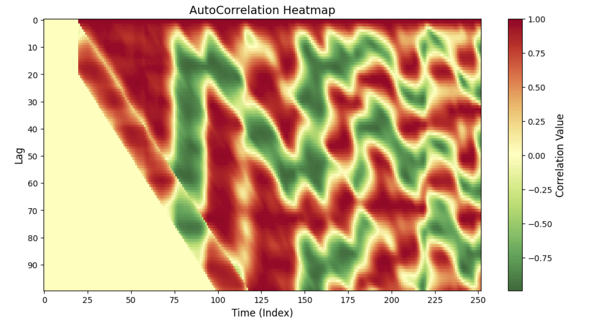

—Rajeev Jain
[jainraje@yahoo.com](mailto:jainraje@yahoo.com)

---

*Originally published in the March 2025 issue of Technical Analysis of Stocks & Commodities magazine. All rights reserved. Copyright 2025, Technical Analysis, Inc.*

---

## BibTeX

```bibtex
@misc{traderstips2025mar,
  title        = {Traders' Tips --- March 2025},
  howpublished = {Technical Analysis of Stocks \& Commodities},
  year         = {2025},
  month        = mar,
  url          = {https://traders.com/Documentation/FEEDbk_docs/2025/03/TradersTips.html},
  note         = {Implementations of John F. Ehlers' Projected Moving Average (PMA) in various platforms}
}
```
