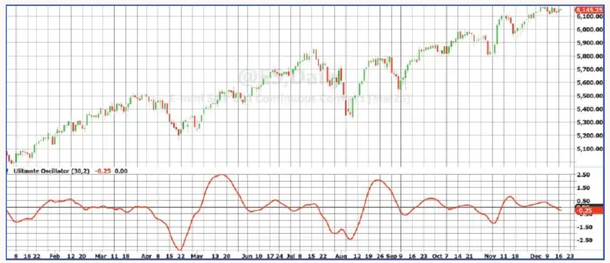

# The Ultimate Oscillator

**John F. Ehlers**
*Technical Analysis of Stocks & Commodities*, Volume 43, April 2025, pp. 8–13

- **Article**: <https://technical.traders.com/archive/article.asp?file=\V43\C04\945EHLE.pdf>
- **Traders' Tips**: <https://www.traders.com/Documentation/FEEDbk_docs/2025/04/TradersTips.html>

---

> In a recent article, we introduced a new method to eliminate lag in smoothing indicators. Here, we apply that method to achieve, at last, a no-lag oscillator that you can use.

One of the biggest challenges in technical trading is the delay, or lag, that indicators introduce. Even if an indicator gives the right signal, it's useless if it doesn't arrive in time to act on it. In this article, I'll show you how to use a method that removes lag from oscillators, which are indicators that show momentum or trends in the market.

In the past, I introduced the UltimateSmoother technique (see my April 2024 S&C article, "The Ultimate Smoother") which reduced lag with a little DSP jiu jitsu and was used to create lag-free versions of Keltner channels and Bollinger Bands. Now, I'll explain a similar technique to improve oscillators by eliminating that troublesome delay.

## What Are Filters?

Indicators are essentially filters. They help remove unwanted noise (unnecessary information) from market data. In simple terms, they process the data to focus on the most important information and ignore the rest. Filters can be thought of as a way of controlling what type of signals (or frequencies) pass through.

- **Analog filters** use physical components like inductors and capacitors to filter signals, usually used in audio equipment, where low frequencies (bass sounds) and high frequencies (treble sounds) are separated.
- **Digital filters**, on the other hand, use computer code to achieve the same thing. The main idea is that filters work by allowing certain frequencies to pass while blocking others. Low-frequency signals, which take more energy to process, tend to cause more lag in digital filters, while high-frequency signals cause less lag.

There are three basic types of filters:

1. **Lowpass filters**: These allow low-frequency signals (slow-moving data) to pass through while blocking higher frequencies.
2. **Highpass filters**: These allow high-frequency signals (fast-moving data) to pass through while blocking lower frequencies.
3. **Bandpass filters**: A combination of both, allowing only certain frequencies to pass.

## How the UltimateSmoother Minimizes Lag

The key to minimizing lag is to combine different types of filters in a way that keeps the useful signals while reducing unnecessary delays.

One way to do this is by subtracting the output of a highpass filter from the original data. The highpass filter removes the low-frequency signals by cancellation (brute force filtering is the cause of lag), so the remaining data stays close to the original signal without much delay.

In simpler terms:

- The highpass filter removes the slow-moving signals, leaving behind faster changes.
- By subtracting the highpass-filtered data from the original, you get a lowpass filter without much of the lag.

I call this technique the UltimateSmoother. It helps make indicators respond quickly, giving you more accurate timing when making trades.

## The UltimateOscillator

The UltimateOscillator is based on this same concept. It's built by using two highpass filters, each with a different setting. The first filter removes slow signals. Then, the output of the second filter is subtracted from the first, creating a result that also removes the fast signals.

This combination works like a bandpass filter because it focuses on a specific range of frequencies, but with the advantage of having little to no lag.

## How to Interpret the UltimateOscillator

When you look at the UltimateOscillator, you'll see how it reacts to price movements in the market. For example, let's look at the daily chart of the emini S&P futures for most of calendar 2024 (see Figure 1). The indicator's peaks and valleys closely match the original price data, meaning it reacts to price changes almost immediately, without lag.

Here's how you can interpret the oscillator:

- **Bullish market**: When the indicator is above zero, the market is likely in an upward trend.
- **Bearish market**: When the indicator is below zero, the market is likely in a downward trend.

The key turning points (where the market changes direction) can be easily identified by checking when the rate of change of the indicator crosses zero.


**Figure 1:** Ultimate Oscillator. Peaks and valleys of the UltimateOscillator reflect the price data variations without lag.

## Creating a Trading Strategy

Because the UltimateOscillator gives such precise signals, you can use it to develop a trading strategy. You can focus on when the rate of change of the oscillator crosses above or below zero, which helps pinpoint the best times to enter or exit a trade.

## Code for the UltimateOscillator

Code for the UltimateOscillator in EasyLanguage is given below. It has two main settings you can adjust:

- **BandEdge**: This determines the critical wavelength of the second highpass filter.
- **Bandwidth**: This controls the width of the range of frequencies the oscillator focuses on. The product of these two settings gives the critical wavelength of the first highpass filter. Bandwidth can be as large as desired, but should not be less than 1.4. The default setting of 2 works well for most applications.

Since the UltimateOscillator has a nominal zero mean, root mean square (RMS) is synonymous with standard deviation. So, dividing the raw indicator value by its RMS value enables the display to be scaled in standard deviations.

### Ultimate Oscillator Indicator, in EasyLanguage

```easylanguage
{
  Ultimate Oscillator Indicator
  (C) 2024 John F. Ehlers
}
Inputs:
    BandEdge(20),
    Bandwidth(2);
Vars:
    HP1(0),
    HP2(0),
    Signal(0),
    RMS(0),
    UltimateOsc(0);

HP1 = $HighPass(Close, Bandwidth*BandEdge);
HP2 = $HighPass(Close, BandEdge);
Signal = HP1 - HP2;
RMS = $RMS(Signal, 100);

If RMS <> 0 Then UltimateOsc = Signal / RMS;

Plot1(UltimateOsc);
Plot2(0);
```

### Highpass Filter Function, in EasyLanguage

```easylanguage
{
  Highpass Function
  (C) 2004-2024 John F. Ehlers
}
Inputs:
    Price(numericseries),
    Period(numericsimple);
Vars:
    a1(0),
    b1(0),
    c1(0),
    c2(0),
    c3(0);

a1 = expvalue(-1.414*3.14159 / Period);
b1 = 2*a1*Cosine(1.414*180 / Period);
c2 = b1;
c3 = -a1*a1;
c1 = (1 + c2 - c3) / 4;

If CurrentBar >= 4 Then
    $HighPass = c1*(Price - 2*Price[1] + Price[2]) + c2*$HighPass[1] + c3*$HighPass[2];
If Currentbar < 4 Then $HighPass = 0;
```

### Root Mean Square (RMS) Function, in EasyLanguage

```easylanguage
{
  RMS Function
  (C) 2015-2022 John F. Ehlers
}
Inputs:
    Price(numericseries),
    Length(numericsimple);
Vars:
    SumSq(0),
    count(0);

SumSq = 0;
for count = 0 to Length - 1 Begin
    SumSq = SumSq + Price[count]*Price[count];
End;

If SumSq <> 0 Then $RMS = SquareRoot(SumSq / Length);
```

## Key Takeaways

1. The UltimateOscillator has almost no lag, making it a fast and accurate tool.
2. The turning points of the oscillator match closely with the turning points in the price data, so it's reliable.
3. You can find the exact turning points by looking for when the rate of change crosses zero.
4. The market is bullish when the oscillator is above zero and bearish when it's below zero.

In conclusion, the UltimateOscillator is a powerful tool for traders who want to reduce lag and make more precise trades. By eliminating delays and focusing on the key signals in the market, it helps traders make better decisions in real time.

## Further Reading

- Ehlers, John [2024]. "The Ultimate Smoother," *Technical Analysis of Stocks & Commodities*, Volume 42, April.
- Ehlers, John [2014]. "Predictive And Successful Indicators," *Technical Analysis of Stocks & Commodities*, Volume 32, January.
- Ehlers, John [2004]. *Cybernetic Analysis For Stocks And Futures*, John Wiley & Sons.
- Ehlers, John [2013]. *Cycle Analytics For Traders*, John Wiley & Sons.
- Ehlers, John [2021]. "A Technical Description of Market Data for Traders," *Technical Analysis of Stocks & Commodities*, Volume 39, May.

---

## BibTeX

```bibtex
@article{ehlers2025ultimateoscillator,
  author  = {John F. Ehlers},
  title   = {The Ultimate Oscillator},
  journal = {Technical Analysis of Stocks \& Commodities},
  volume  = {43},
  number  = {4},
  pages   = {8--13},
  month   = apr,
  year    = {2025},
  url     = {https://technical.traders.com/archive/article.asp?file=\V43\C04\945EHLE.pdf}
}

@misc{traderstips202504,
  title        = {Traders' Tips},
  howpublished = {Technical Analysis of Stocks \& Commodities},
  month        = apr,
  year         = {2025},
  url          = {https://www.traders.com/Documentation/FEEDbk_docs/2025/04/TradersTips.html},
  note         = {Implementations of John Ehlers' Ultimate Oscillator for various platforms}
}
```
