# Traders' Tips — April 2025

**Article:** "The Ultimate Oscillator" by John F. Ehlers  
**Source:** [Traders' Tips, TASC April 2025](https://traders.com/Documentation/FEEDbk_docs/2025/04/TradersTips.html)

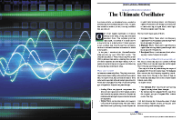

For this month's Traders' Tips, the focus is John F. Ehlers' article in this issue, "The Ultimate Oscillator." Here, we present the April 2025 Traders' Tips code with possible implementations in various software.

---

## TradeStation

In "The Ultimate Oscillator" in this issue, John Ehlers explains how he developed this indicator by using two highpass filters with different periods to remove lag. The UltimateOscillator closely follows price movements, making it highly responsive to changes in market conditions. A value above zero suggests a bullish trend, while a reading below zero indicates a bearish trend. Key turning points, where market direction changes, are identified when the rate of change crosses zero.

```easylanguage
Function: $RMS
{
	RMS Function
	(C) 2015-2022 John F. Ehlers
}

inputs:
	Price( numericseries ),
	Length( numericsimple );

variables:
	SumSq( 0 ),
	count( 0 );

SumSq = 0;

for count = 0 to Length - 1 
begin
	SumSq = SumSq + Price[count] * Price[count];
end;

If SumSq <> 0 then 
	$RMS = SquareRoot(SumSq / Length);

Function: $HighPass
{
	$HighPass Function
 	(C) 2004-2024 John F. Ehlers
}

inputs:
	Price(numericseries),
	Period(numericsimple);
	
variables:
	a1( 0 ),
	b1( 0 ),
	c1( 0 ),
	c2( 0 ),
	c3( 0 );

a1 = ExpValue(-1.414 * 3.14159 / Period);
b1 = 2 * a1 * Cosine(1.414 * 180 / Period);
c2 = b1;
c3 = -a1 * a1;
c1 = (1 + c2 - c3) / 4;

if CurrentBar >= 4 then 
 	$HighPass = c1*(Price - 2 * Price[1] + Price[2]) +
	 c2 * $HighPass[1] + c3 * $HighPass[2];
if Currentbar < 4 then 
	$HighPass = 0;

Indicator: Ultimate Oscillator
{
	TASC APR 2025
	Ultimate Oscillator Indicator
	(C) 2024 John F. Ehlers
}

inputs:
	BandEdge( 20 ),
	Bandwidth( 2 );

variables:
	HP1( 0 ),
	HP2( 0 ),
	Signal( 0 ),
	RMS( 0 ),
	UltimateOsc( 0 );
	
HP1 = $HighPass(Close, Bandwidth*BandEdge);
HP2 = $HighPass(Close, BandEdge);

Signal = HP1 - HP2;
RMS = $RMS(Signal, 100);

if RMS <> 0 then 
	UltimateOsc = Signal / RMS;

Plot1( UltimateOsc, "Ultimate OSC" );
Plot2( 0, "Zero Line" );
```

**Code file:** [TradeStation_UltimateOscillator.els](TradeStation_UltimateOscillator.els)

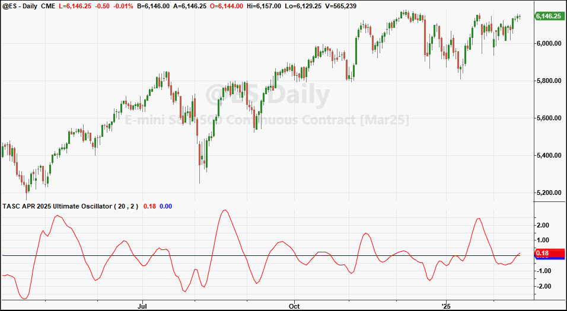

**FIGURE 1: TRADESTATION.** This demonstrates a daily chart of the continuous emini S&P 500 (ES) showing a portion of 2024 and 2025 with the indicator applied.

*—John Robinson, TradeStation Securities, Inc., [www.TradeStation.com](http://www.tradestation.com/)*

---

## MetaStock

John Ehlers' article in this issue, "The Ultimate Oscillator," introduces his indicator of the same name. Here is the formula to add that indicator to MetaStock:

```metastock
{Ultimate Oscillator Indicator}
Len:= 20;
Bandwidth:= 2;
a1:= exp(-1.414*3.14159 / (Len*Bandwidth));
b1:= 2*a1*Cos(1.414*180 / (Len*Bandwidth));
c1:= -a1*a1;
x1:= (1 + b1 - c1) / 4;
HP1:= x1*(C - Ref(2*C,-1) + Ref(C, -2)) + b1*Prev + c1*Ref(Prev, -1);

a2:= exp(-1.414*3.14159 / Len);
b2:= 2*a2*Cos(1.414*180 / Len);
c2:= -a2*a2;
x2:= (1 + b2 - c2) / 4;
HP2:= x2*(C - Ref(2*C,-1) + Ref(C, -2)) + b2*Prev + c2*Ref(Prev, -1);

sig:= HP1 - HP2;
RMS:= sqrt( Sum( C * C, 100)/ 100 );
sig / RMS
```

**Code file:** [MetaStock_UltimateOscillator.txt](MetaStock_UltimateOscillator.txt)

*—William Golson, MetaStock Technical Support, [MetaStock.com](http://metastock.com/)*

---

## Wealth-Lab

We have recreated John Ehlers' UltimateOscillator for use in Wealth-Lab based on Ehlers' article in this issue, "The Ultimate Oscillator," so that Wealth-Lab users can more easily get the benefit of this new oscillator.

Figure 2 shows an example of using the UltimateOscillator in a simple trading strategy. The strategy, built with Wealth-Lab's Building Blocks feature, is shown in the inset. It buys when the UltimateOscillator is above 0 and exits when crossing below 0. Aggressive traders could investigate taking action when the indicator turns from +/- 2.0 standard deviations.

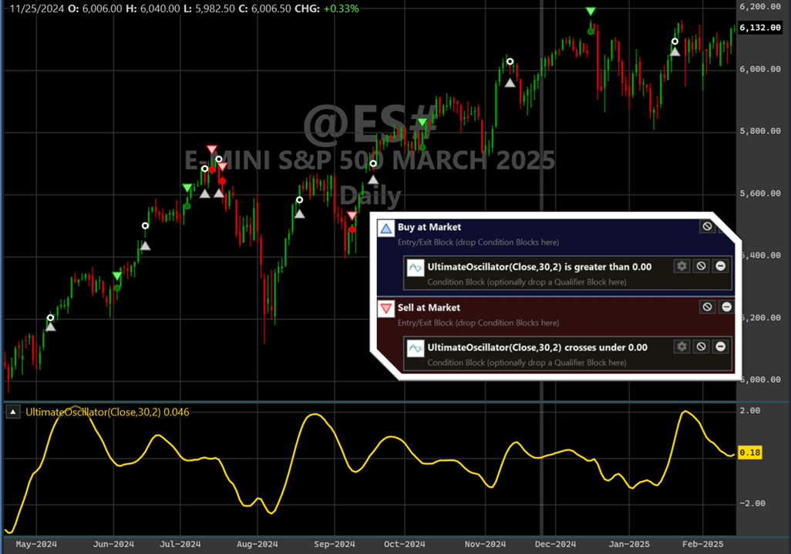

**FIGURE 2: WEALTH-LAB.** A simple trading strategy based on John Ehlers' UltimateOscillator (30, 2) is demonstrated on a chart of the emini S&P 500 continuous futures contract. The oscillator is plotted in the bottom pane.

*—Robert Sucher, Wealth-Lab team, [www.wealth-lab.com](http://www.wealth-lab.com/)*

---

## NinjaTrader

In "The Ultimate Oscillator" in this issue, John Ehlers presents a no-lag oscillator. The indicator discussed in the article is available for download at the following link for NinjaTrader 8:

- **NinjaTrader 8:** [www.ninjatrader.com/SC/April2025SCNT8.zip](https://www.ninjatrader.com/SC/April2025SCNT8.zip)

Once the file is downloaded, you can import the indicator into NinjaTrader 8 from within the control center by selecting Tools → Import → NinjaScript Add-On and then selecting the downloaded file for NinjaTrader 8.

You can review the indicator source code in NinjaTrader 8 by selecting the menu New → NinjaScript Editor → Indicators folder from within the control center window and selecting the file.

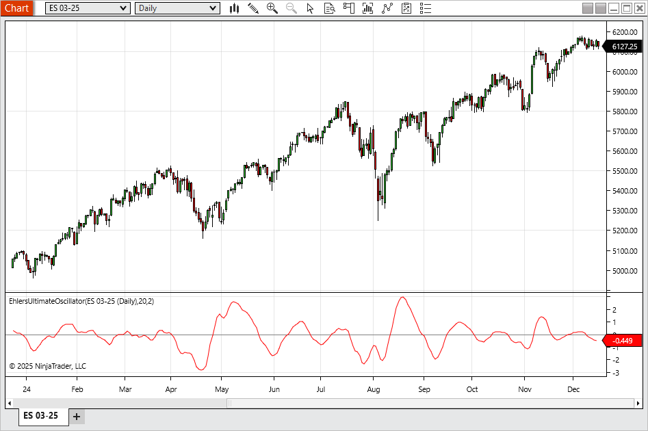

**FIGURE 3: NINJATRADER.** The UltimateOscillator is plotted on a daily chart of the emini S&P 500 continuous contract (ES).

*—NinjaTrader, LLC, [www.ninjatrader.com](http://www.ninjatrader.com/)*

---

## RealTest

Provided here is coding for use in the RealTest platform to implement John Ehlers' indicator described in his article in this issue, "The Ultimate Oscillator."

```realtest
Notes:
	John Ehlers "Ultimate Oscillator", TASC, April 2025
	Implements and plots the indicators as in the article
	
Import:
	DataSource:	Norgate
	IncludeList:	&ES
	StartDate:	2022-01-01
	EndDate:	2024-12-17
	SaveAs:	es.rtd
	
Settings:
	DataFile:	es.rtd
	BarSize:	Daily

Parameters:
	BandEdge:	30 // note author's code says 20 but chart in article shows 30
	BandWidth:	2
	RMSlen:	100

Data:
	// Common constants
	decay_factor:	-1.414 * 3.14159
	phase_angle:	1.414 * 180
	
	// Lengths
	length1:	BandWidth * BandEdge
	length2:	BandEdge
	
	// Price Value
	price:	Close

	// Highpass Filter Length1
	hp1a1:	exp(decay_factor / Length1)
	hp1b1:	2 * hp1a1 * Cosine(phase_angle / Length1)
	hp1c2:	hp1b1
	hp1c3:	-hp1a1 * hp1a1
	hp1c1:	(1 + hp1c2 - hp1c3) / 4
	HP1:	if(BarNum >= 4, hp1c1 * (price - 2 * price[1] + price[2]) + hp1c2 * HP1[1] + hp1c3 * HP1[2], 0)

	// Highpass Filter Length2
	hp2a1:	exp(decay_factor / Length2)
	hp2b1:	2 * hp2a1 * Cosine(phase_angle / Length2)
	hp2c2:	hp2b1
	hp2c3:	-hp2a1 * hp2a1
	hp2c1:	(1 + hp2c2 - hp2c3) / 4
	HP2:	if(BarNum >= 4, hp2c1 * (price - 2 * price[1] + price[2]) + hp2c2 * HP2[1] + hp2c3 * HP2[2], 0)
	
	// Signal
	Signal:	HP1 - HP2
	
	// Root Mean Square of Signal
	RMS:	Sqr(SumSQ(Signal, RMSlen) / RMSlen)
	
	// Ultimate Oscillator
	UltimateOsc:	Signal / RMS
	
Charts:
	UltimateOsc:	UltimateOsc {|}
	Zero:	0 {|}
```

**Code file:** [RealTest_UltimateOscillator.rts](RealTest_UltimateOscillator.rts)

Figure 4 plots an example of the UltimateOscillator in RealTest. The chart replicates Ehlers' chart in his article using the parameters (30, 2), meaning that one highpass filter has a critical period of 30 and the other has a critical period of 60.

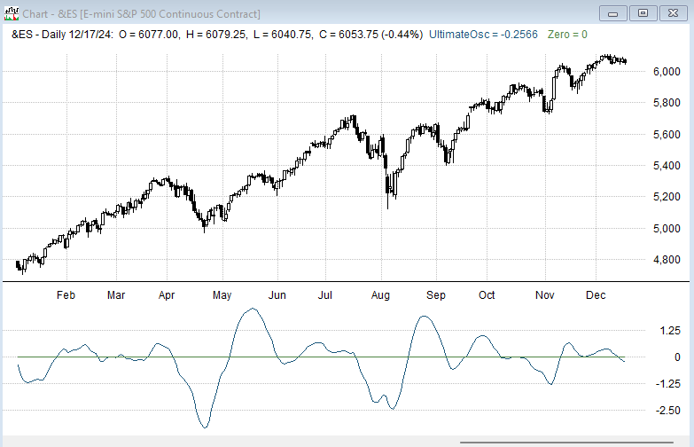

**FIGURE 4: REALTEST.** Here you see an example of John Ehlers' UltimateOscillator (30, 2) plotted on a daily chart of the emini S&P 500 continuous futures contract.

*—Marsten Parker, MHP Trading, mhp@mhptrading.com*

---

## TradingView

The TradingView Pine Script code here implements the oscillator introduced in John Ehlers' article in this issue, "The Ultimate Oscillator." Ehlers' oscillator uses Ehlers' method of reducing lag.

```pine
//  TASC Issue: April 2025
//     Article: Less Lag In Momentum Indicators
//              The Ultimate Oscillator
//  Article By: John F. Ehlers
//    Language: TradingView's Pine Script® v6
// Provided By: PineCoders, for TradingView.com

//version=6
title ='TASC 2025.04 Less Lag In Momentum Indicators' +
 ' The Ultimate Oscillator'
stitle = 'UO'
indicator(title, stitle, false)

// import library for RMS function
import TradingView/ta/9 as ta

// function High Pass Filter.
HP (float src, int Period) =>
    float a0 = math.pi * math.sqrt(2.0) / Period
    float a1 = math.exp(-a0)
    float c2 = 2.0 * a1 * math.cos(a0)
    float c3 = -a1 * a1
    float c1 = (1.0 + c2 - c3) * 0.25
    float hp = 0.0
    if bar_index >= 4
        hp := c1 * (src - 2.0 * src[1] + src[2]) + 
              c2 * nz(hp[1]) + c3 * nz(hp[2])
    hp

UO (float src, int Bandwidth=2, int BandEdge=20) =>
    float HP1 = HP(src, Bandwidth * BandEdge)
    float HP2 = HP(src, BandEdge)
    float Signal = HP1 - HP2

    float RMS = ta.rms(Signal, 100)
    float UO = RMS == 0 ? 0 : Signal / RMS
    UO

float src = input.source(close, 'Source:')
int Bandwidth = input.int(2, 'Bandwidth:')
int BandEdge = input.int(20, 'BandEdge:')

UO = UO (src, Bandwidth, BandEdge)

plot(UO , 'Ultimate Oscillator', color.red, 2)

hline(0)
```

**Code file:** [TradingView_UltimateOscillator.pine](TradingView_UltimateOscillator.pine)

The script is available on TradingView from the PineCodersTASC account: [https://www.tradingview.com/u/PineCodersTASC/#published-scripts](https://www.tradingview.com/u/PineCodersTASC/#published-scripts).

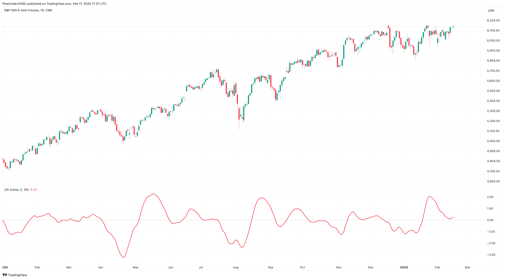

**FIGURE 5: TRADINGVIEW.** Here you see an example of the UltimateOscillator on a chart of the emini S&P 500 futures (ES).

*—PineCoders, for TradingView, [www.TradingView.com](http://www.tradingview.com/)*

---

## NeuroShell Trader

The UltimateOscillator indicator introduced in John Ehlers' article in this issue can be easily implemented in NeuroShell Trader using NeuroShell Trader's ability to call external dynamic linked libraries. Dynamic linked libraries can be written in C, C++ and Power Basic.

After moving the code given in the article to your preferred compiler and creating a DLL, you can insert the resulting indicator as follows:

1. Select "New Indicator …" from the *insert* menu.
2. Choose the **External Program & Library Calls** category.
3. Select the appropriate **External DLL Call** indicator.
4. Setup the parameters to match your DLL.
5. Select the *finished* button.

Users of NeuroShell Trader can go to the Stocks & Commodities section of the NeuroShell Trader free technical support website to download a copy of this or any previous Traders' Tips.

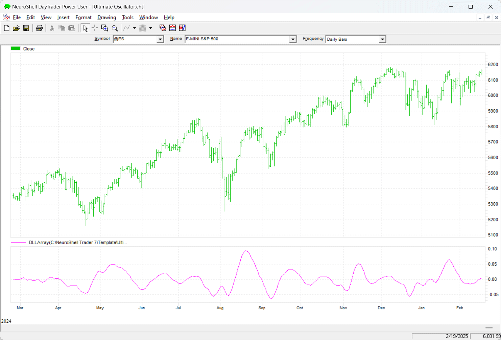

**FIGURE 6: NEUROSHELL TRADER.** This example NeuroShell Trader chart shows the UltimateOscillator indicator on a chart of the emini S&P 500.

*—Ward Systems Group, Inc., sales@wardsystems.com, [www.neuroshell.com](http://www.neuroshell.com/)*

---

## The Zorro Project

In his article in this issue, "The Ultimate Oscillator," John Ehlers introduces his UltimateOscillator, which is an indicator that seeks to have the lag removed. It is built from the difference of two highpass filters, and the author presents it to indicate the market direction with almost no lag.

The highpass function below is a straightforward conversion of the EasyLanguage code in Ehlers' article to C:

```c
var HighPass3(vars Data,int Period)
{
  var a1 = exp(-1.414*PI / Period);
  var c2 = 2*a1*cos(1.414*PI/2 / Period);
  var c3 = -a1*a1;
  var c1 = (1.+c2-c3) / 4;
  vars HP = series(0,3);
  return HP[0] = c1*(Data[0]-2*Data[1]+Data[2])
    + c2*HP[1] + c3*HP[2];
}
```

We've named the function **HighPass3** in Zorro because we already have three other highpass filters in the Zorro indicator library, all with different code. Ehlers' UltimateOscillator is the difference of two highpass filters with different periods, and scaled by its root mean square for converting the output to standard deviations. Since Zorro has already a sum of squares function, the code is somewhat simpler than in Ehlers' article:

```c
var UltimateOsc(vars Data,int Edge,int Width)
{
  vars Signals = series(HighPass3(Data,Width*Edge)-HighPass3(Data,Edge));
  var RMS = sqrt(SumSq(Signals,100)/100);
  return Signals[0]/fix0(RMS);
}
```

For comparing lag and smoothing power, we can apply the UltimateOscillator to an S&P 500 chart from 2024 using the following code:

```c
void run() 
{
  BarPeriod = 1440;
  StartDate = 20240101;
  EndDate = 20241231;
  asset("SPX500");
  plot("UltOsc", UltimateOsc(seriesC(),20,2),LINE,RED);
}
```

**Code file:** [Zorro_UltimateOscillator.c](Zorro_UltimateOscillator.c)

The resulting chart (Figure 7) replicates Ehlers' chart in his article. The oscillator output is the red line. We can see that the UltimateOscillator reproduces the market trend well and with no visible lag.

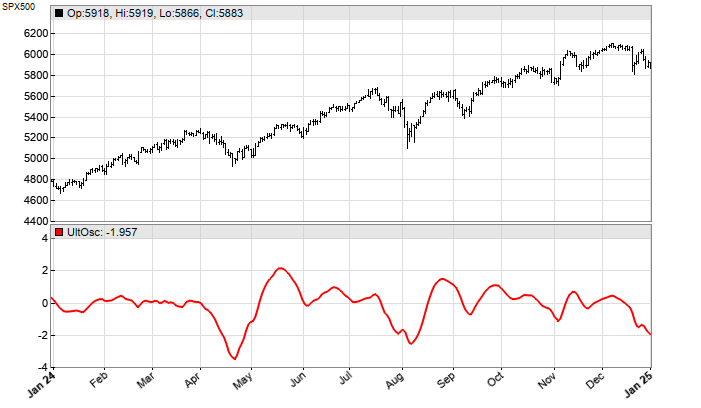

**FIGURE 7: ZORRO.** Here is an example of the UltimateOscillator plotted on a chart of the S&P 500 index. The oscillator is the red line.

The code can be downloaded from the 2025 script repository on [https://financial-hacker.com](https://financial-hacker.com). The Zorro platform can be downloaded from [https://zorro-project.com](https://zorro-project.com).

*—Petra Volkova, The Zorro Project by oP group Germany, [https://zorro-project.com](https://zorro-project.com)*

---

## Python

Here is Python code based on John Ehlers' article in this issue, "The Ultimate Oscillator." An example chart plotting the UltimateOscillator is shown in Figure 8.

```python
#
# import required python libraries
#
import pandas as pd
import numpy as np
import matplotlib.pyplot as plt
import yfinance as yf
import math

#
# Retrieve S&P 500 daily price data from Yahoo Finance
# 

symbol = '^GSPC'
ohlcv = yf.download(symbol, start="2000-01-01", end="2025-02-21", group_by="Ticker")
# ohlcv = ohlcv[symbol]  # un-comment for older versions of yf module
ohlcv


#
# Python code for highpass, rms and ultimate oscillator functions highlighted in the article
# 

def calc_highpass(price, period):
    
    a1 = np.exp(-1.414 * np.pi / period)
    b1 = 2 * a1 * np.cos(math.radians(1.414 * 180 / period))
    c2 = b1
    c3 = -a1 * a1
    c1 = (1 + c2 - c3)/4

    out_values = []
    for i in range(len(price)):
        if i >= 4:
            out_values.append(
                c1*(price[i] - 2*price[i-1] + price[i-2]) + c2*out_values[i-1] + c3*out_values[i-2]
            )
        else:
            out_values.append(price[i])
    
    return out_values


def calc_rms(price):

    length = len(price)
    sum_sq = 0
    for count in range(length):
        sum_sq += price[count] * price[count]
    return np.sqrt(sum_sq / length)
    

def calc_ultimate_oscillator(close, band_edge, band_width):

    df = close.to_frame('Close')
    df['HP1'] = calc_highpass(df['Close'], band_width * band_edge)
    df['HP2'] = calc_highpass(df['Close'], band_edge)
    df['Signal'] = df['HP1'] - df['HP2']
    df['RMS'] = df['Signal'].rolling(100).apply(calc_rms)
    df['UO'] = df['Signal']/df['RMS']
    
    return df['UO'] 

#
# S&P500 applying EMA and Ultimate Oscillator
# 

band_edge=30
band_width=2
length = band_edge

df = ohlcv.copy()
df['EMA'] = calc_ema(df['Close'], period=length)
df['UO'] = calc_ultimate_oscillator(df['Close'], band_edge, band_width)

# Plot using MatPlotLib python package
plot_uo(df['2024':'2024'])
```

**Code file:** [Python_UltimateOscillator.py](Python_UltimateOscillator.py)

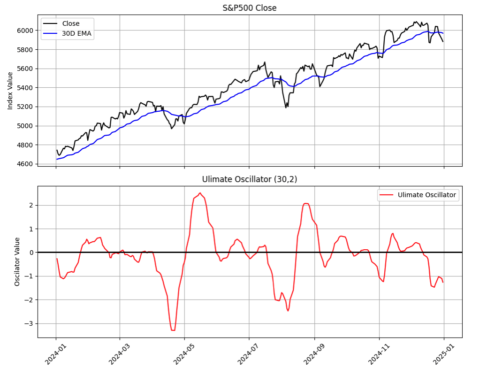

**FIGURE 8: PYTHON.** The UltimateOscillator is shown plotted on a daily chart of the S&P 500 index. The chart replicates John Ehlers's chart in his article, using (30, 2) as the input parameters, meaning that one highpass has a critical period of 30 and the other has a critical period of 60.

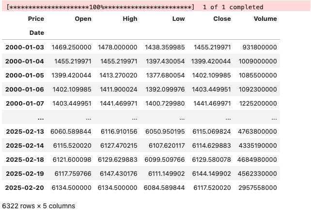

**FIGURE 9: PYTHON.** S&P 500 daily price data is retrieved from Yahoo Finance using Python code and Python libraries.

*—Rajeev Jain, jainraje@yahoo.com*

---

## Microsoft Excel

In "The Ultimate Oscillator" in this issue, John Ehlers builds on his UltimateSmoother indicator to create an oscillator with very minimal lag. The result is an oscillator that is very sensitive to shifts in momentum (see Figure 10).

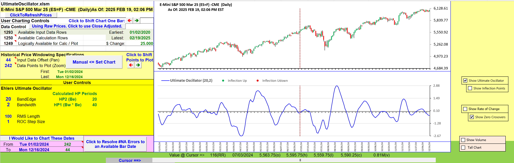

**FIGURE 10: EXCEL.** The UltimateOscillator is seen on a chart of ES. This chart is similar to Figure 1 from John Ehlers' article in this issue.

In his article, Ehlers suggests that one can find exact turning points by applying rate of change (ROC) to the UltimateOscillator and use the ROC zero crossings to pinpoint UltimateOscillator turning points. (See Figure 11.)

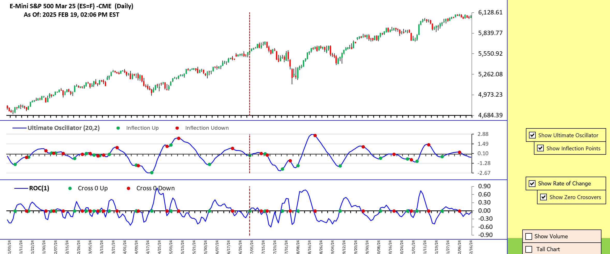

**FIGURE 11: EXCEL.** Here you see rate-of-change (ROC) zero crossings and corresponding turning points in the UltimateOscillator.

**To download this spreadsheet:** The spreadsheet file for this Traders' Tip can be downloaded [here](https://www.traders.com/Documentation/FEEDbk_docs/2025/04/images/code/UltimateOscillator.xlsm).

*—Ron McAllister, Excel and VBA programmer, rpmac_xltt@sprynet.com*

---

## References

```bibtex
@article{ehlers2025ultimateoscillator,
  author  = {John F. Ehlers},
  title   = {The Ultimate Oscillator},
  journal = {Technical Analysis of Stocks \& Commodities},
  year    = {2025},
  month   = {April},
  volume  = {43},
  number  = {4},
  url     = {https://traders.com/Documentation/FEEDbk_docs/2025/04/TradersTips.html}
}
```

---

*Originally published in the April 2025 issue of Technical Analysis of Stocks & Commodities magazine. All rights reserved. © Copyright 2025, Technical Analysis, Inc.*
