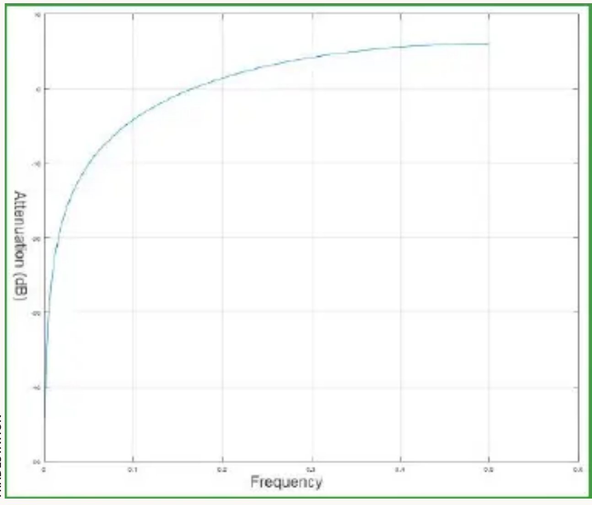
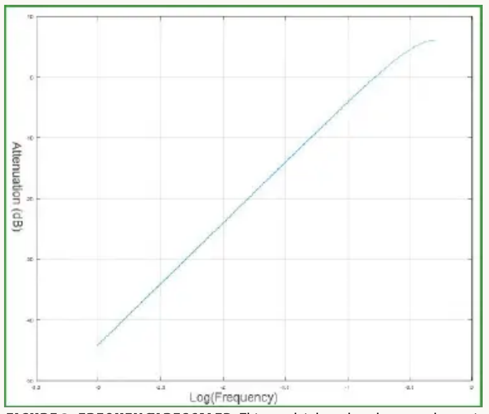
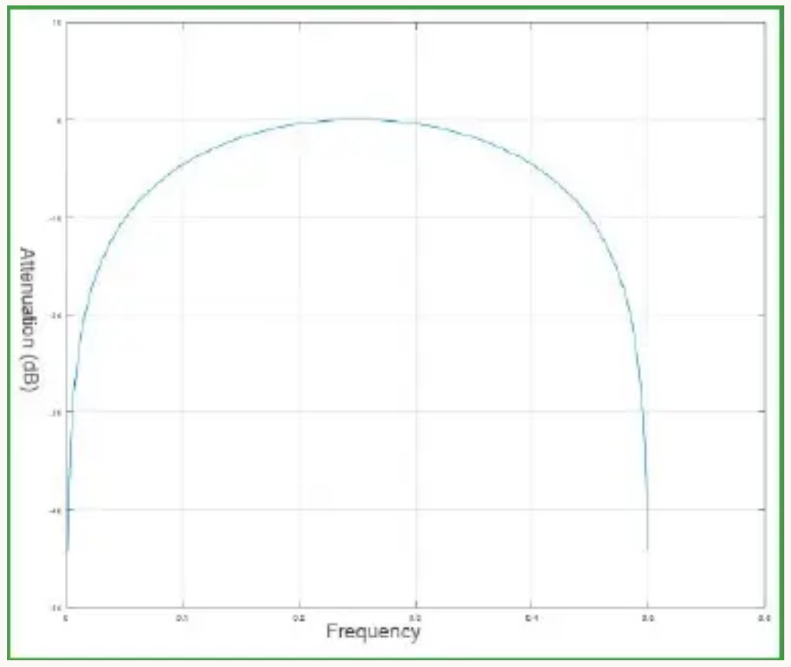
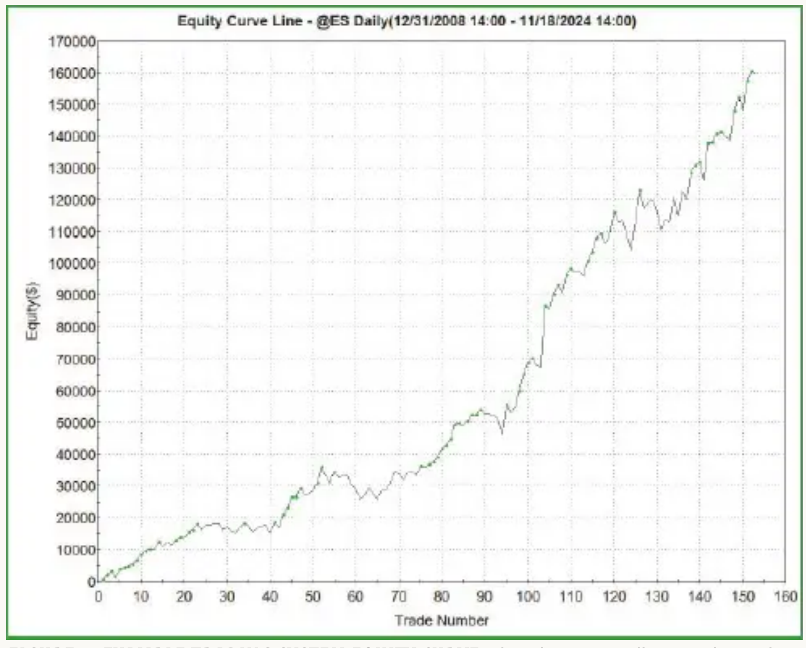

# Making A Better Oscillator

- **Author:** John F. Ehlers
- **Source:** *Technical Analysis of Stocks & Commodities*, Volume 43, June 2025, pp. 8–14, 19
- **URL:** https://technical.traders.com/archive/article.asp?file=\V43\C06\970EHLE.pdf
- **Traders' Tips:** https://www.traders.com/Documentation/FEEDbk_docs/2025/06/TradersTips.html

---

## The Cybernetic Oscillator For More Flexibility

Here, we introduce a new oscillator that allows you to set the inputs for the upper and lower band edges independently for greater flexibility. Here's how it works and how you can use it.

An oscillator is a technical indicator that is characterized by having a difference incorporated into its calculation. This difference causes the indicator to be plotted as swinging about zero, or, with translation and dilation, swinging between 0 and 100. Oscillators also incorporate smoothing to help ease interpretation of the meaning of the plot.

Entire volumes have been written about how to interpret the meaning of the squiggly lines in the time domain. A basic principle of digital signal processing (DSP) is that whatever happens in the time domain can be equally described in the frequency domain. In this article, I will use this duality to derive a new, more flexible oscillator indicator using frequency domain considerations.

## Market Data Characteristics

We must first understand the characteristics of the data we want to analyze. Statistically, market data has a pink noise power spectrum. That means that the amplitude swings of the data are in direct proportion to their wavelength.

You can test this for yourself. Create a chart using daily data, noting its appearance and scaling. Then create a similar chart using weekly data. You will see the charts appear to be similar, but the one using weekly data has about a five times larger scale factor. This means that the cycle amplitudes of market data increase 6 dB per octave of wavelength (or, equivalently, 20 dB per decade).

This scaling runs from wavelengths measured in years down to wavelengths of less than one minute. We are analyzing sampled data rather than continuous data, with the result that the shortest wavelength we can see has a two-bar cycle period, called the Nyquist period. Data with shorter wavelengths are folded back into the observable spectrum in a process called aliasing.

The data spectrum does not necessarily have complete cycles in its composition. For example, a long trend can be considered as a short segment of an even longer wavelength. Frequency is the reciprocal of wavelength. It is important to remember that market data amplitudes increase at the rate of 6 dB per octave and the shortest observable wavelength is the Nyquist wavelength.

Since all oscillator indicators involve a difference, let's examine how a simple difference performs as a function of frequency. At Nyquist, the sampling is performed exactly twice per cycle. That is, the sampling is done with 180 degrees of phase shift between samples. Thus, a data sequence can be [+ − + − + − …]. The data sequence one bar ago is necessarily [− + − + − + …]. So, when you subtract the data with one bar of lag from the current datastream, the sample amplitude doubles! That is, taking a one-bar difference of data causes the resultant to be amplified by 6 dB at Nyquist. This is why taking the difference in data always makes the data look noisier.

Figure 1 shows how the differencing behaves as a function of frequency. A one-bar difference is a highpass filter, allowing the higher-frequency components (shorter wavelengths) to pass through it while more severely attenuating lower-frequency components. In the limit, zero-frequency components are completely blocked. Figure 2 displays the same data except the horizontal axis is scaled to the logarithm of frequency. Figure 2 shows the attenuation rate is 20 dB per decade (or, equivalently, 6 dB per octave).


**Figure 1:**  Attenuation and frequency. A one-bar difference of data amplifies its amplitude by 6 dB at Nyquist and completely blocks the zero frequency component.


**Figure 2:**  Frequency rescaled. This graph is based on the same data as in Figure 1 except here, the horizontal axis is scaled to the logarithm of frequency. The attenuation rate of a simple difference is 6 dB per octave.

The 6 dB gain at Nyquist produced by differencing can be mitigated by lowpass filtering the resultant. For example, a two-bar average is a simple lowpass filter that places a zero of transmission in its transfer response at Nyquist. The resultant net response in the frequency domain is shown in Figure 3. Since oscillator indicators all incorporate differencing and smoothing, Figure 3 is a prototype oscillator response in the frequency domain.


**Figure 3:**  Response in the frequency domain. The two-bar average of a one-bar difference gives a prototype oscillator indicator response in the frequency domain.

Here is the kicker: Since the market data cyclic component amplitudes increase at the rate of 6 dB per octave, and since differencing only attenuates at the rate of 6 dB per octave, oscillator indicators have no net impact on the longer wavelength components in the data. The only reason the longer wavelengths do not blow up the oscillator response is that the data window of the oscillator only captures a small fraction of the low-frequency cycles.

The residual low-frequency components in the oscillator outputs are bad news for traders. For example, if the oscillator is used to provide entry and exit signals for swing trading, the signals will be in error because the expected reversion to the mean will be off since the mean has been shifted away from zero. All of the conventional oscillators carry the residual low-frequency component in their output. Here is a brief review of some of the conventional oscillators:

### RSI

The RSI, without concern for scaling, is just the difference between the sum of closes up and the sum of closes down. The differencing gives the indicator a 6 dB per octave attenuation rolloff in the frequency domain. It is obvious that the sum of closes up will be consistently larger than the sum of closes down in an uptrend. The reverse is true in a downtrend. The RSI is more difficult to smooth because the closes up and closes down datastreams are punctuated with null values.

### Stochastic Oscillator

The stochastic oscillator indicator famously retains the trend information. It is calculated as the difference between the current price and the lowest price within the data window. This difference gives it the low-frequency attenuation. It is obvious that the difference between the current price and the lowest price will be reasonably consistent during a trend.

### MACD

The MACD is just the difference between two EMAs. The smoothing is basically provided by the shortest EMA, while the difference between the two EMA attenuation responses is consistent over most of the entire frequency band. The MACD histogram removes the low-frequency content by subtracting out the MACD average.

All of these indicators can give dramatically different responses if they are preceded by a highpass filter. But, by following the Occam's razor principle that *simplest is best*, and focusing on responses in the frequency domain, there is a way to make a better oscillator indicator.

## Introducing the Cybernetic Oscillator

The new oscillator I am introducing here, which I call the *cybernetic oscillator*, is just a SuperSmoother lowpass filter for smoothing, followed by a second-order highpass filter to attenuate the low-frequency components in the data. ("Cybernetic" is a term used in the field of mechanical-electrical communication systems.)

According to linear filter theory, the order of filter application is irrelevant. The filtered response is scaled to its RMS (root mean squared) value so the display is scaled in standard deviations if the waveform has a normal probability distribution. This scaling is a reasonable approximation for most trading applications, and is consistent regardless of the particular data being analyzed.

The SuperSmoother is a second-order lowpass filter so that the attenuation rolls off at the rate of 12 dB per octave. The highpass filter is also a second-order filter whose attenuation rate is 12 dB per octave. The 12 dB per octave rolloff swamps the natural 6 dB per-octave increase of market data.

The cybernetic oscillator code in EasyLanguage is given in the sidebar "Cybernetic Oscillator Indicator, In EasyLanguage Code," and the function code for the SuperSmoother, highpass filters, and RMS are given in the next three sidebars, respectively.

The cybernetic oscillator is flexible because the upper and lower band edges can be independently set as inputs. The oscillator is more responsive if the upper edge is smaller and is smoother if the upper edge is larger. The upper edge usually should be greater than 8 to ensure that most of the aliased content in the sampled data is attenuated. The lower edge usually should be at least a half-octave (1.4 times) larger than the upper edge to avoid undesired transient responses when the data is fast-moving. The lower edge can be as large as you want, depending on how much of the low-frequency response you want in your indicator.

Figure 4 shows two examples of the cybernetic oscillator. In the first subgraph, the cybernetic oscillator is shown in red. The high end is set to 20 so that smoothing is accomplished by attenuation of cyclic components shorter than one month and the low end is set to 30 so that trend components longer than a month and a half are attenuated. In this case, note that the indicator peaks and valleys are synchronous with the peaks and valleys in the price data. Therefore, swing extremes larger than one standard deviation can be used for swing trade entries and exits. In the second subgraph, the cybernetic oscillator is shown in blue. The high-end setting in this case is also 20. However, the low-end setting is 250, allowing cycle periods shorter than one year to be in the passband of the filter. As a result, the trends are indicated when the indicator values are above or below zero.


**Figure 4:**  Two versions of the cybernetic oscillator. The cybernetic oscillator is flexible because inputs for the upper and lower band edges can be set independently. Here, you see a version of the cybernetic oscillator useful for a swing trading timeframe (red) and a version for a trend-trading timeframe (blue).

The real test of an indicator is whether or not it is useful as part of a trading strategy. I have written a super-simple strategy using two versions of the cybernetic oscillator. Both versions use the same high-end setting. One uses a low-end setting typical for swing trading and the other uses a low-end setting typical for trend trading.

The strategy philosophy can be summarized as taking a swing position only in the direction of a trend. This is done by correlating the directions of rate-of-change of the two indicators.

I applied this strategy to the emini S&P futures over the 15-year span from the beginning of 2009 to the current data as I write this article. After historical optimization of the input variables, the equity curve is shown in Figure 5. Although optimized, the strategy is implied to be robust because 153 trades were produced at a rate of little less than one trade a month over a wide range of market conditions without reoptimization.


**Figure 5:**  Example trading system equity curve. The cybernetic oscillator can be used in a trading strategy. A simple dual rate strategy tested produced the equity growth curve shown here over a 15-year span.

This simple strategy produced $159,675 profit (without allowance for trading costs), with a 2.39 profit factor and 64% winning trades. The average profit per trade was $1,043. The entry efficiency was 61% and the exit efficiency was 57%. These results could probably be improved with the addition of a stop-loss and rules that exit a losing trade earlier and reduce the probability of entering a losing trade.

## Code Listings

### Cybernetic Oscillator Indicator, In EasyLanguage Code

```easylanguage
{
    Cybernetic Oscillator
    (C) 2025 John F. Ehlers
}
Inputs:
    HPLength(30),
    LPLength(20);
Vars:
    HP(0),
    LP(0),
    RMS(0),
    CyberneticOsc(0);

HP = $HighPass(Close, HPLength);
LP = $SuperSmoother(HP, LPLength);
RMS = $RMS(LP, 100);
If RMS <> 0 Then CyberneticOsc = LP / RMS;

Plot1(CyberneticOsc);
Plot2(0);
```

### SuperSmoother Function, In EasyLanguage Code

```easylanguage
{
    SuperSmoother Function
    (C) 2004-2025 John F. Ehlers
}
Inputs:
    Price(numericseries),
    Period(numericsimple);
Vars:
    a1(0),
    b1(0),
    c1(0),
    c2(0),
    c3(0);

a1 = expvalue(-1.414*3.14159 / Period);
b1 = 2*a1*Cosine(1.414*180 / Period);
c2 = b1;
c3 = -a1*a1;
c1 = 1 - c2 - c3;

If CurrentBar >= 4 Then $SuperSmoother =
    c1*(Price + Price[1]) / 2 + c2*$SuperSmoother[1] +
    c3*$SuperSmoother[2];
If Currentbar < 4 Then $SuperSmoother = Price;
```

### Second-Order Highpass Filter Function, In EasyLanguage Code

```easylanguage
{
    Highpass Function
    (C) 2004-2024 John F. Ehlers
}
Inputs:
    Price(numericseries),
    Period(numericsimple);
Vars:
    a1(0),
    b1(0),
    c1(0),
    c2(0),
    c3(0);

a1 = expvalue(-1.414*3.14159 / Period);
b1 = 2*a1*Cosine(1.414*180 / Period);
c2 = b1;
c3 = -a1*a1;
c1 = (1 + c2 - c3) / 4;

If CurrentBar >= 4 Then $HighPass = c1*(Price - 2*Price[1] +
    Price[2]) + c2*$HighPass[1] + c3*$HighPass[2];
If Currentbar < 4 Then $HighPass = 0;
```

### Root Mean Square (RMS) Function, In EasyLanguage Code

```easylanguage
{
    RMS Function
    (C) 2015-2025 John F. Ehlers
}
Inputs:
    Price(numericseries),
    Length(numericsimple);
Vars:
    SumSq(0),
    count(0);

SumSq = 0;
for count = 0 to Length - 1 Begin
    SumSq = SumSq + Price[count]*Price[count];
End;
If SumSq <> 0 Then $RMS = SquareRoot(SumSq / Length);
```

### Simple Rate-Of-Change (ROC) Strategy, In EasyLanguage Code

```easylanguage
{
    Simple Dual ROC Strategy
    (C) 2025 John F. Ehlers
}
Inputs:
    LPLength(20),
    FastHPLength(55),
    SlowHPLength(156);
Vars:
    LP(0),
    BP1(0), BP2(0),
    ROC1(0), ROC2(0);

LP = $SuperSmoother(Close, LPLength);
BP1 = $HighPass(LP, FastHPLength);
ROC1 = BP1 - BP1[2];
BP2 = $HighPass(LP, SlowHPLength);
ROC2 = BP2 - BP2[2];

If MarketPosition <> 1 and ROC1 > 0 and ROC2 > 0 Then Buy
    Next Bar on Open;
If MarketPosition = 1 and (ROC1 < 0 OR ROC2 < 0) Then Sell
    Next Bar on Open;
```

## Conclusions

From consideration of filter performance in the frequency domain and the application of Occam's razor, the cybernetic oscillator is simply the serial connection of a SuperSmoother lowpass filter and a second-order highpass filter. The filtered results are nominally scaled in standard deviations. The cybernetic oscillator is flexible because the upper and lower limits are independently set by input parameters. This flexibility allows the cybernetic oscillator to be used for timely swing trading rules or to incorporate low-frequency components to have the look and feel of standard oscillators.

*John Ehlers is a retired electrical engineer and technical analyst, specializing in the application of DSP (digital signal processing) to trading. For more information, see www.mesasoftware.com.*

---

## Further Reading

- Ehlers, John [2013]. *Cycle Analytics For Traders*, John Wiley & Sons.
- Ehlers, John [2004]. *Cybernetic Analysis For Stocks And Futures*, John Wiley & Sons.
- Ehlers, John [2014]. "Predictive And Successful Indicators," *Technical Analysis of Stocks & Commodities*, Volume 32, January.
- Ehlers, John [2021]. "A Technical Description of Market Data for Traders," *Technical Analysis of Stocks & Commodities*, Volume 39, May.
- Ehlers, John [2025]. "Removing Moving Average Lag," *Technical Analysis of Stocks & Commodities*, Volume 43, March.
- Ehlers, John [2025]. "Linear Predictive Filters And Instantaneous Frequency," *Technical Analysis of Stocks & Commodities*, Volume 43, January.

---

## BibTeX

```bibtex
@article{ehlers2025cybernetic,
  author    = {John F. Ehlers},
  title     = {Making A Better Oscillator},
  journal   = {Technical Analysis of Stocks \& Commodities},
  volume    = {43},
  number    = {6},
  pages     = {8--14, 19},
  year      = {2025},
  month     = jun,
  url       = {https://technical.traders.com/archive/article.asp?file=\V43\C06\970EHLE.pdf}
}

@misc{traderstips2025jun,
  title     = {Traders' Tips: Making A Better Oscillator},
  year      = {2025},
  month     = jun,
  url       = {https://www.traders.com/Documentation/FEEDbk_docs/2025/06/TradersTips.html},
  note      = {Implementations of Ehlers' Cybernetic Oscillator in various platforms}
}
```
