# Traders' Tips: Making A Better Oscillator

- **Article:** "Making A Better Oscillator" by John F. Ehlers, *Technical Analysis of Stocks & Commodities*, June 2025
- **URL:** https://www.traders.com/Documentation/FEEDbk_docs/2025/06/TradersTips.html

---

For this month's Traders' Tips, the focus is John F. Ehlers' article in this issue, "Making A Better Oscillator." Here, we present the June 2025 Traders' Tips code with possible implementations in various software.

---

## TradeStation

In the article "Making A Better Oscillator" in this issue, John Ehlers introduces a new indicator he calls the cybernetic oscillator. This indicator applies a multistep filter. The data is smoothed using a highpass filter ($HighPass function), which is then smoothed using the lowpass filter ($SuperSmoother function). The result is then scaled to its RMS (root mean squared).

**Code:** [`TradeStation_CyberneticOscillator.els`](TradeStation_CyberneticOscillator.els)

```easylanguage
Function: Cybernetic Oscillator
{
	TASC JUN 2025
	Cybernetic Oscillator
	(C) 2025 John F. Ehlers
}

inputs:
	HPLength( 30 ),
	LPLength( 20 );

variables:
	HP( 0 ),
	LP( 0 ),
	RMS( 0 ),
	CyberneticOsc( 0 );
	
HP = $HighPass(Close, HPLength);
LP = $SuperSmoother(HP, LPLength);
RMS = $RMS(LP, 100);

if RMS <> 0 then 
	CyberneticOsc = LP / RMS;
	
Plot1( CyberneticOsc, "Cybernetic Osc" );
Plot2( 0, "Zero Line" );

Function: $HighPass
{
	$HighPass Function
 	(C) 2004-2025 John F. Ehlers
}

inputs:
	Price(numericseries),
	Period(numericsimple);
	
variables:
	a1( 0 ),
	b1( 0 ),
	c1( 0 ),
	c2( 0 ),
	c3( 0 );

a1 = ExpValue(-1.414 * 3.14159 / Period);
b1 = 2 * a1 * Cosine(1.414 * 180 / Period);
c2 = b1;
c3 = -a1 * a1;
c1 = (1 + c2 - c3) / 4;

if CurrentBar >= 4 then 
 	$HighPass = c1*(Price - 2 * Price[1] + Price[2]) +
	 c2 * $HighPass[1] + c3 * $HighPass[2];
if Currentbar < 4 then 
	$HighPass = 0;

Function: $SuperSmoother
{
	$SuperSmoother Function
 	(C) 2004-2025 John F. Ehlers
}

inputs:
	Price(numericseries),
	Period(numericsimple);

variables:
	a1( 0 ),
	b1( 0 ),
	c1( 0 ),
	c2( 0 ),
	c3( 0 );

a1 = ExpValue(-1.414 * 3.14159 / Period);
b1 = 2 * a1 * Cosine(1.414 * 180 / Period);
c2 = b1;
c3 = -a1 * a1;
c1 = 1 - c2 - c3;

if CurrentBar >= 4 then 
	$SuperSmoother = c1*(Price + Price[1]) / 2 
	 + c2 * $SuperSmoother[1] + c3 * $SuperSmoother[2];
if CurrentBar < 4 then 
	$SuperSmoother = Price;

Indicator: $RMS
{
	RMS Function
	(C) 2015-2025 John F. Ehlers
}

inputs:
	Price( numericseries ),
	Length( numericsimple );

variables:
	SumSq( 0 ),
	count( 0 );

SumSq = 0;

for count = 0 to Length - 1 
begin
	SumSq = SumSq + Price[count] * Price[count];
end;

If SumSq <> 0 then 
	$RMS = SquareRoot(SumSq / Length);
```

*—John Robinson, TradeStation Securities, Inc., www.TradeStation.com*

---

## MetaStock

John Ehlers' article in this issue, "Making A Better Oscillator," introduces his indicator he calls the cybernetic oscillator and also offers an example simple rate-of-change trading strategy to demonstrate using the oscillator in a strategy. Here are the formulas to add that indicator and system test to MetaStock:

**Code:** [`MetaStock_CyberneticOscillator.txt`](MetaStock_CyberneticOscillator.txt)

```metastock
The Cybernetic Oscillator:

{by John Ehlers}
HPLen:= 30;
LPLen:= 20;

{High Pass filter of Close}
a1:= exp(-1.414*3.14159 / HPLen);
b1:= 2*a1*Cos(1.414*180 / HPLen);
c1:= -a1*a1;
x1:= (1 + b1 - c1) / 4;
HP1:= x1*(C - Ref(2*C,-1) + Ref(C, -2)) + b1*Prev + c1*Ref(Prev, -1);

{Super Smoother of High Pass}
a2:= exp(-1.414*3.14159 / LPLen);
b2:= 2*a2*Cos(1.414*180 / LPLen);
c2:= -a2*a2;
x2:= (1 + b2 - c2) / 4;
LP1:= x2*(Sum(HP1,2)/2) + b2*Prev + c2*Ref(Prev, -1);

{Root Mean Square of Super Smoother}
RMS:= SQRT(Sum(LP1 * LP1, 100) / 100);

{divide by zero trap}
denom:= if(RMS = 0, -1, RMS);
If(denom = -1, 0, LP1/denom)

Simpel Rate of Change Strategy

Buy Order:
LPLen:= 20;
fastHPLen:= 55;
slowHPLen:= 156;

{Super Smoother of Close}
a1:= exp(-1.414*3.14159 / LPLen);
b1:= 2*a1*Cos(1.414*180 / LPLen);
c1:= -a1*a1;
x1:= (1 + b1 - c1) / 4;
LP1:= x1*(Sum(C,2)/2) + b1*Prev + c1*Ref(Prev, -1);

{fast High Pass filter of Super Smoother}
a2:= exp(-1.414*3.14159 / fastHPLen);
b2:= 2*a2*Cos(1.414*180 / fastHPLen);
c2:= -a2*a2;
x2:= (1 + b2 - c2) / 4;
HP1:= x2*(LP1 - Ref(2*LP1,-1) + Ref(LP1, -2)) + b2*Prev + c2*Ref(Prev, -1);
ROC1:= HP1 - Ref(HP1, -2);

{slow High Pass filter of Super Smoother}
a3:= exp(-1.414*3.14159 / slowHPLen);
b3:= 2*a3*Cos(1.414*180 / slowHPLen);
c3:= -a3*a3;
x3:= (1 + b3 - c3) / 4;
HP2:= x3*(LP1 - Ref(2*LP1,-1) + Ref(LP1, -2)) + b3*Prev + c3*Ref(Prev, -1);
ROC2:= HP2 - Ref(HP2, -2);

ROC1>0 AND ROC2>0


Sell Order:
LPLen:= 20;
fastHPLen:= 55;
slowHPLen:= 156;

{Super Smoother of Close}
a1:= exp(-1.414*3.14159 / LPLen);
b1:= 2*a1*Cos(1.414*180 / LPLen);
c1:= -a1*a1;
x1:= (1 + b1 - c1) / 4;
LP1:= x1*(Sum(C,2)/2) + b1*Prev + c1*Ref(Prev, -1);

{fast High Pass filter of Super Smoother}
a2:= exp(-1.414*3.14159 / fastHPLen);
b2:= 2*a2*Cos(1.414*180 / fastHPLen);
c2:= -a2*a2;
x2:= (1 + b2 - c2) / 4;
HP1:= x2*(LP1 - Ref(2*LP1,-1) + Ref(LP1, -2)) + b2*Prev + c2*Ref(Prev, -1);
ROC1:= HP1 - Ref(HP1, -2);

{slow High Pass filter of Super Smoother}
a3:= exp(-1.414*3.14159 / slowHPLen);
b3:= 2*a3*Cos(1.414*180 / slowHPLen);
c3:= -a3*a3;
x3:= (1 + b3 - c3) / 4;
HP2:= x3*(LP1 - Ref(2*LP1,-1) + Ref(LP1, -2)) + b3*Prev + c3*Ref(Prev, -1);
ROC2:= HP2 - Ref(HP2, -2);

ROC1<0 AND ROC2<0
```

*—William Golson, MetaStock Technical Support, MetaStock.com*

---

## Wealth-Lab.com

In his article in this issue titled "Making A Better Oscillator," John Ehlers introduces his cybernetic oscillator. We are offering this new oscillator in WealthLab's TASC indicator library (named CyberneticOsc), so the user can drag and drop it into charts or strategies.

The code provided in the article didn't use CyberneticOsc's RMS version, but the result would likely be similar. Position sizing appears to have been one fixed contract for the entire backtest.

**Code:** [`WealthLab_CyberneticOscillator.cs`](WealthLab_CyberneticOscillator.cs)

```csharp
using System;
using WealthLab.Backtest;
using WealthLab.Core;
using WealthLab.Indicators;
using WealthLab.TASC;

namespace WealthScript8
{
    public class CyberneticSystem : UserStrategyBase
    {
        Parameter _LPLength, _HPFast, _HPSlow;
        Momentum _mo1, _mo2;

        public CyberneticSystem()
        {
            _LPLength = AddParameter("LP Length", ParameterType.Int32, 20, 15, 30, 5);
            _HPFast = AddParameter("HP Fast", ParameterType.Int32, 55, 30, 75, 5);
            _HPSlow = AddParameter("HP Slow", ParameterType.Int32, 155, 100, 200, 5);
            StartIndex = _HPSlow.AsInt;
        }

        public override void Initialize(BarHistory bars)
        {
            //create and plot indicators
            SuperSmoother LP = new(bars.Close, _LPLength.AsInt);
            HighPass BP1 = new(LP, _HPFast.AsInt);
            HighPass BP2 = new(LP, _HPSlow.AsInt);

            _mo1 = new Momentum(BP1, 2);
            _mo2 = new Momentum(BP2, 2);
            PlotIndicatorLine(_mo1, WLColor.Green);
            PlotIndicatorLine(_mo2, WLColor.Red);
            DrawHorzLine(0, WLColor.White, 1, LineStyle.Dashed, _mo1.PaneTag);
        }

        public override void Execute(BarHistory bars, int idx)
        {
            //trading rules
            if (!HasOpenPosition(bars, PositionType.Long))
            {
                if (_mo1[idx] > 0 && _mo2[idx] > 0)
                    PlaceTrade(bars, TransactionType.Buy, OrderType.Market);
            }
            else
            {
                Position p = LastPosition;
                if (_mo1[idx] < 0 || _mo2[idx] < 0)
                    ClosePosition(p, OrderType.Market);
            }
        }
    }
}
```

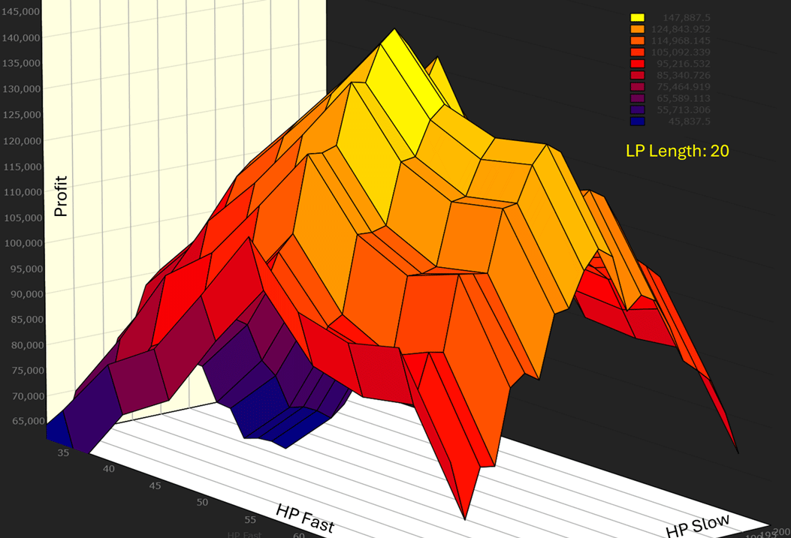

*—Robert Sucher, Wealth-Lab team, www.wealth-lab.com*

---

## NinjaTrader

In "Making A Better Oscillator" in this issue, John Ehlers presents a new oscillator he calls the cybernetic oscillator. The indicator discussed in the article is available for download at the following link for NinjaTrader 8:

- **NinjaTrader 8:** https://www.ninjatrader.com/SC/June2025SCNT8.zip

Once the file is downloaded, you can import the indicator into NinjaTrader 8 from within the control center by selecting Tools → Import → NinjaScript Add-On and then selecting the downloaded file.

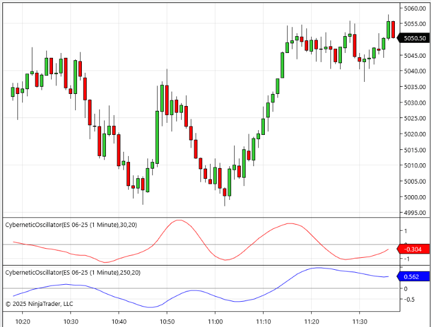

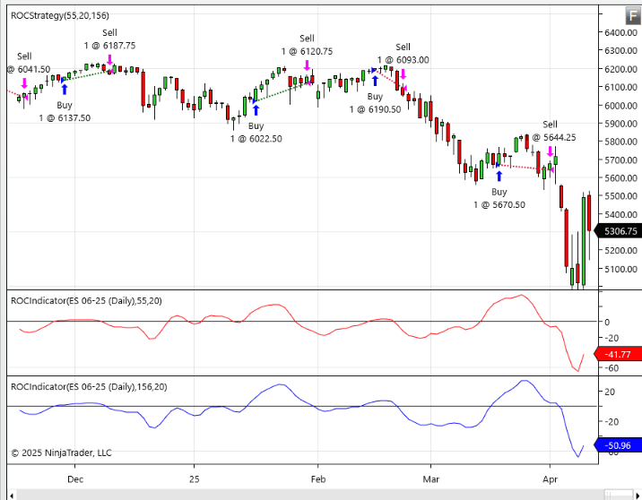

*—Helom S., NinjaTrader, LLC, www.ninjatrader.com*

---

## RealTest

Provided here is coding for use in the RealTest platform to create and plot the cybernetic oscillator indicator introduced in John Ehlers' article in this issue, "Making A Better Oscillator." The second listing codes the example strategy from the article.

**Code (indicator):** [`RealTest_CyberneticOscillator_Indicator.rts`](RealTest_CyberneticOscillator_Indicator.rts)

```text
Notes:
	John Ehlers "Cybernetic Oscillator", TASC, June 2025
	Implements and plots the indicators as in the article
	
Import:
	DataSource:	Norgate
	IncludeList:	&ES
	StartDate:	2023-01-01
	EndDate:	2025-04-01
	SaveAs:	es.rtd
	
Settings:
	DataFile:	es.rtd
	BarSize:	Daily

Parameters:
	HPLength:	30
	SSLength:	20
	RMSlen:	100

Data:
	// Common constants
	decay_factor:	-1.414 * 3.14159
	phase_angle:	1.414 * 180
	
	// Highpass Filter of Close
	hp_a1:	exp(decay_factor / HPLength)
	hp_b1:	2 * hp_a1 * Cosine(phase_angle / HPLength)
	hp_c2:	hp_b1
	hp_c3:	-hp_a1 * hp_a1
	hp_c1:	(1 + hp_c2 - hp_c3) / 4
	HPC:	if(BarNum >= 4, hp_c1 * (Close - 2 * Close[1] + Close[2]) + hp_c2 * HPC[1] + hp_c3 * HPC[2], 0)

	// SuperSmoother of HPC
	ss_a1:	exp(decay_factor / SSLength)
	ss_b1:	2 * ss_a1 * Cosine(phase_angle / SSLength)
	ss_c2:	ss_b1
	ss_c3:	-ss_a1 * ss_a1
	ss_c1:	(1 - ss_c2 - ss_c3)
	SSHPC:	if(BarNum >= 4, ss_c1 * (HPC + HPC[1]) / 2 + ss_c2 * SSHPC[1] + ss_c3 * SSHPC[2], HPC)

	// RMS of SSHPC
	RMS_SSHPC:	Sqr(SumSQ(SSHPC, RMSLen) / RMSLen)

	// Cybernetic Oscillator
	CyberneticOsc:	SSHPC / RMS_SSHPC
	
Charts:
	CyberneticOsc:	CyberneticOsc {|}
```

**Code (strategy):** [`RealTest_CyberneticOscillator_Strategy.rts`](RealTest_CyberneticOscillator_Strategy.rts)

```text
Notes:
	John Ehlers "Simple ROC Strategy", TASC, June 2025
	
Import:
	DataSource:	Norgate
	IncludeList:	&ES
	StartDate:	2009-01-01
	EndDate:	2025-01-01
	SaveAs:	es.rtd
	
Settings:
	DataFile:	es.rtd
	BarSize:	Daily
	StartDate:	2010-01-01
	EndDate:	Latest

Parameters:
	SSLength:	20
	FastHPLength:	55
	SlowHPLength:	156

Data:
	// Common constants
	decay_factor:	-1.414 * 3.14159
	phase_angle:	1.414 * 180
	
	// SuperSmoother of Close
	ss_a1:	exp(decay_factor / SSLength)
	ss_b1:	2 * ss_a1 * Cosine(phase_angle / SSLength)
	ss_c2:	ss_b1
	ss_c3:	-ss_a1 * ss_a1
	ss_c1:	(1 - ss_c2 - ss_c3)
	SSC:	if(BarNum >= 4, ss_c1 * (Close[1] + Close[2]) / 2 + ss_c2 * SSC[1] + ss_c3 * SSC[2], Close)

	// Fast Highpass Filter of SSC
	fhp_a1:	exp(decay_factor / FastHPLength)
	fhp_b1:	2 * fhp_a1 * Cosine(phase_angle / FastHPLength)
	fhp_c2:	fhp_b1
	fhp_c3:	-fhp_a1 * fhp_a1
	fhp_c1:	(1 + fhp_c2 - fhp_c3) / 4
	FHPSS:	if(BarNum >= 4, fhp_c1 * (SSC - 2 * SSC[1] + SSC[2]) + fhp_c2 * FHPSS[1] + fhp_c3 * FHPSS[2], 0)
	ROC1:	FHPSS - FHPSS[2]
	
	// Slow Highpass Filter of SSC
	shp_a1:	exp(decay_factor / SlowHPLength)
	shp_b1:	2 * shp_a1 * Cosine(phase_angle / SlowHPLength)
	shp_c2:	shp_b1
	shp_c3:	-shp_a1 * shp_a1
	shp_c1:	(1 + shp_c2 - shp_c3) / 4
	SHPSS:	if(BarNum >= 4, shp_c1 * (SSC - 2 * SSC[1] + SSC[2]) + shp_c2 * SHPSS[1] + shp_c3 * SHPSS[2], 0)
	ROC2:	SHPSS - SHPSS[2]
	
Strategy: Dual_ROC
	Side:	Long
	Quantity:	1
	EntrySetup:	ROC1 > 0 and ROC2 > 0
	ExitRule:	ROC1 < 0 or ROC2 < 0
```

*—Marsten Parker, MHP Trading, mhp@mhptrading.com*

---

## TradingView

This TradingView Pine Script code provided here implements the cybernetic oscillator introduced by John Ehlers in his article in this issue, "Making A Better Oscillator."

**Code:** [`TradingView_CyberneticOscillator.pine`](TradingView_CyberneticOscillator.pine)

```pine
//  TASC Issue: June 2025
//     Article: The Cybernetic Oscillator For More Flexibility
//              Making A Better Oscillator
//  Article By: John F. Ehlers
//    Language: TradingView's Pine Script® v6
// Provided By: PineCoders, for tradingview.com


//@version=6
title ='TASC 2025.06 Making A Better Oscillator'
stitle = 'Making A Better Oscillator'
indicator(title, stitle, false) 


//Inputs:


float src = input.source(close, 'Source Series:')
int HPLength = input.int(30, 'High Pass Length:')
int LPLength = input.int(20, 'Low Pass Length:')
int RMSLength = input.int(100, 'RMS Length:')


//Functions:


// @function High Pass Filter.
HP (float Source, int Period) =>    
    var float hp = 0.0
    var float a0 = math.pi * 1.414 / Period
    var float a1 = math.exp(-a0)
    var float c2 = 2.0 * a1 * math.cos(a0)
    var float c3 = -a1 * a1
    var float c1 = (1.0 + c2 - c3) * 0.25
    if bar_index >= 4
        hp := c1 * (Source - 2.0 * Source[1] + Source[2]) + 
              c2 * nz(hp[1]) + 
              c3 * nz(hp[2])
    hp


// @function Super Smoother.
SS (float Source, int Period) =>    
    var float ss = Source
    var float a0 = math.pi *  1.414 / Period
    var float a1 = math.exp(-a0)
    var float c2 = 2.0 * a1 * math.cos(a0)
    var float c3 = -a1 * a1
    var float c1 = 1.0 - c2 - c3
    if bar_index >= 4
        ss := c1 * ((Source + Source[1]) / 2.0) + 
              c2 * nz(ss[1]) + 
              c3 * nz(ss[2])
    ss


// @function Root Mean Square.
RMS (float Source, int Length) =>
    var float rms = 0
    float s2 = math.sum(Source * Source, Length)
    if s2 != 0
        rms := math.sqrt(s2 / Length)
    rms


// @function Cybernetic Oscillator.
CO (float Source, int HPLength=30, int LPLength=20, 
 int RMSLength=100) =>
    var float co = 0
    float HP = HP(Source, HPLength)
    float LP = SS(HP, LPLength)
    float RMS = RMS(LP, RMSLength)
    if RMS != 0
        co := LP / RMS
    co


//Calculations:
float CO = CO(src, HPLength, LPLength, RMSLength)


//Plot + Zero Line:
plot(CO, 'Cybernetic Oscillator', color.blue)
hline(0)
```

The indicator is available for TradingView from the PineCodersTASC account: https://www.tradingview.com/u/PineCodersTASC/#published-scripts

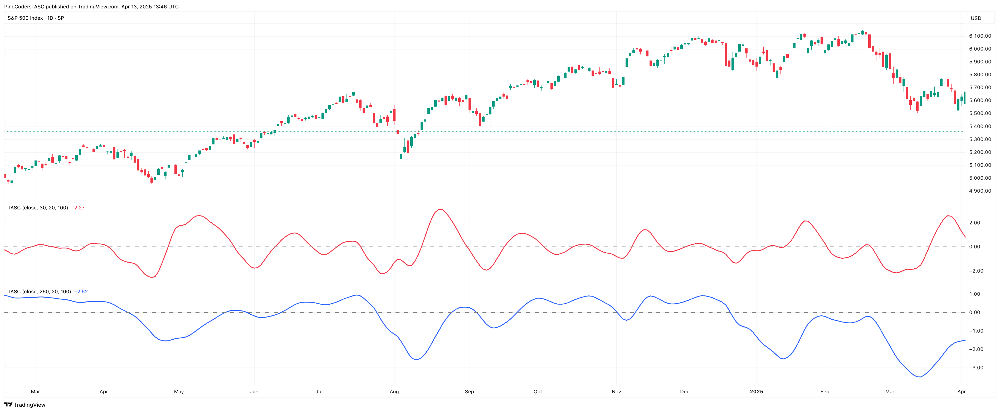

*—PineCoders, for TradingView, www.TradingView.com*

---

## NeuroShell Trader

The John Ehlers' cybernetic oscillator, highpass filter, and SuperSmoother can be easily implemented in NeuroShell Trader using NeuroShell Trader's ability to call external dynamic linked libraries.

**Code:** [`NeuroShell_CyberneticOscillator.txt`](NeuroShell_CyberneticOscillator.txt)

```text
BUY LONG CONDITIONS: [All of which must be true]
     A>B(Momentum(High Pass Filter(Super Smoother(Close,20),55),2),0)
     A>B(Momentum(High Pass Filter(Close,156),2),0)
SELL LONG CONDITIONS: [1 of which must be true]
     A<B(Momentum(High Pass Filter(Super Smoother(Close,20),55),2),0)
     A<B(Momentum(High Pass Filter(Close,156),2),0)
```

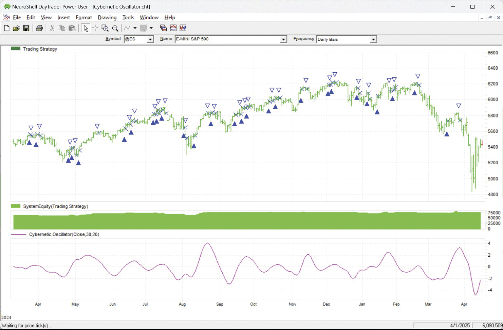

*—Ward Systems Group, Inc., www.neuroshell.com*

---

## The Zorro Project

The cybernetic oscillator is built by applying a highpass and afterwards a lowpass filter to the price curve, then normalizing the result. Having these indicators in the Zorro library already makes the cybernetic oscillator easy to code in C.

**Code (indicator):** [`Zorro_CyberneticOscillator_Indicator.c`](Zorro_CyberneticOscillator_Indicator.c)

```c
var CyberOsc(vars Data,int HPLength,int LPLength)
{
  vars HP = series(HighPass3(Data,HPLength));
  vars LP = series(Smooth(HP,LPLength));
  var RMS = sqrt(SumSq(LP,100)/100);
  return LP[0]/fix0(RMS);
}
```

**Code (chart):** [`Zorro_CyberneticOscillator_Chart.c`](Zorro_CyberneticOscillator_Chart.c)

```c
void run() 
{
  BarPeriod = 1440;
  LookBack = 250;
  StartDate = 20240301;
  EndDate = 20250407;
  asset("SPX500");
  plot("CyberOsc1",CyberOsc(seriesC(),30,20),NEW|LINE,RED);
  plot("CyberOsc2",CyberOsc(seriesC(),250,20),NEW|LINE,BLUE);
}
```

**Code (strategy):** [`Zorro_CyberneticOscillator_Strategy.c`](Zorro_CyberneticOscillator_Strategy.c)

```c
function run()
{
  BarPeriod = 1440; 
  LookBack = 250; 
  StartDate = 2009; 
  EndDate = 2025;
  Fill = 2; // enter at next open
  assetList("AssetsIB"); // simulate IBKR
  asset("SPY");
  vars LP = series(Smooth(seriesC(),20));
  vars BP1 = series(HighPass3(LP,55));
  var ROC1 = BP1[0] - BP1[2];
  vars BP2 = series(HighPass3(LP,156));
  var ROC2 = BP2[0] - BP2[2];
  if(!NumOpenLong && ROC1 > 0 && ROC2 > 0)
    enterLong();
  if(NumOpenLong && (ROC1 < 0 || ROC2 < 0))
    exitLong();
}
```

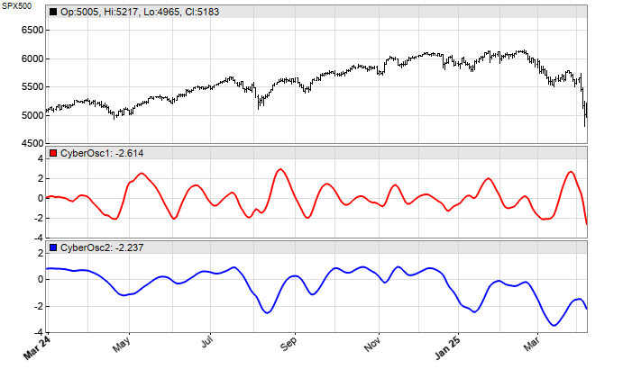

*—Petra Volkova, The Zorro Project by oP group Germany, https://zorro-project.com*

---

## Python

The Python code presented here is based on John Ehlers' article in this issue, "Making A Better Oscillator," which introduces his new cybernetic oscillator. The routines given here perform tasks related to implementing the cybernetic oscillator using the Python language.

**Code:** [`Python_CyberneticOscillator.py`](Python_CyberneticOscillator.py)

```python
#
# import required python libraries
#
%matplotlib inline
import pandas as pd
import numpy as np
import matplotlib.pyplot as plt
import yfinance as yf
import math
import datetime as dt
print(yf.__version__)

#
# Use Yahoo Finance python package to obtain OHLCV data 
#
symbol = '^GSPC'
symbol = 'SPY'
ohlcv = yf.download(symbol, start="1995-01-01", end="2025-04-18", group_by="Ticker", auto_adjust=True)
ohlcv = ohlcv[symbol]

#
# Use pandas built in plot function to see simple price chart 
#
ax = ohlcv['Close'].plot(
    figsize=(9,6), 
    grid=True, 
    title=f'{symbol}', 
    #marker='.'
)


#
# Building block / routines used to implement cybernetic oscillaor indicator 
#
def calc_highpass(price, period):
    
    a1 = np.exp(-1.414 * np.pi / period)
    b1 = 2 * a1 * np.cos(math.radians(1.414 * 180 / period))
    c2 = b1
    c3 = -a1 * a1
    c1 = (1 + c2 - c3)/4

    out_values = []
    for i in range(len(price)):
        if i >= 4:
            out_values.append(
                c1*(price[i] - 2*price[i-1] + price[i-2]) + c2*out_values[i-1] + c3*out_values[i-2]
            )
        else:
            out_values.append(price[i])
    
    return out_values

def calc_super_smoother(price, period):
        
        a1 = np.exp(-1.414 * np.pi / period)
        b1 = 2 * a1 * np.cos(math.radians(1.414 * 180 / period))
        c2 = b1
        c3 = -a1 * a1
        c1 = (1 - c2 - c3)
    
        out_values = []
        for i in range(len(price)):
            if i >= 4:
                out_values.append(c1*(price[i]+price[i-1])/2 + c2*out_values[i-1] + c3*out_values[i-2])
            else:
                out_values.append(price[i])
        
        return out_values

def calc_rms(price):
    
    length = len(price)
    sum_sq = 0
    for count in range(length):
        sum_sq += price[count] * price[count]
    return np.sqrt(sum_sq / length)

def calc_cybernetic_oscillator(close, params=(30, 20)):

    hp_length = params[0]
    lp_length = params[1]
    
    df = pd.DataFrame(index=close.index, data=close)
    df['HP'] = calc_highpass(close, hp_length)
    df['LP'] = calc_super_smoother(df['HP'], lp_length)
    df['RMS'] = df['LP'].rolling(100).apply(calc_rms)
    df['CO'] = df['LP']/df['RMS']

    return df['CO']

#
# Exampe python code to create two versions of the cybernetic oscillator 
# as presented in June 2005 Trader Tip article
#

lp_length = 20
hp1_length = 30
hp2_length = 250

co1_params=(hp1_length, lp_length)
co2_params=(hp2_length, lp_length)

df = ohlcv.copy()
df['CO1'] = calc_cybernetic_oscillator(ohlcv['Close'], params=co1_params)
df['CO2'] = calc_cybernetic_oscillator(ohlcv['Close'], params=co2_params)
df


#
# MatPlotLib routine to plot Close, CO1 and CO2 values
#
def plot_indicators1(df):
    # Create a figure with three subplots stacked vertically
    fig, (ax1, ax2, ax3) = plt.subplots(3, 1, figsize=(9, 6), sharex=True)

    # Plotting the first subplot (e.g., Price Data)
    ax1.set_title(f"S&P 500")
    ax1.plot(df.index, df['Close'], label='Close', color='blue', marker='.')
    ax1.grid(True, linestyle='--', alpha=0.5)
    ax1.set_ylabel('Price Plot')
    ax1.legend(loc='upper left', bbox_to_anchor=(1, 1))

    # Plotting the second subplot
    ax2.set_title(f'Cybernetic Oscillator {co1_params}')
    ax2.plot(df.index, df['CO1'], label='CO1', color='red')
    ax2.axhline(y=0, color='black', linestyle='-', label='zero')
    #ax2.set_ylabel('Linear Slope')
    ax2.grid(True, linestyle='-', alpha=0.5)
    ax2.legend(loc='upper left', bbox_to_anchor=(1, 1))

    # Plotting the third subplot
    ax3.set_title(f'Cybernetic Oscillator {co2_params}')
    ax3.plot(df.index, df['CO2'], label='CO2', color='blue')
    ax3.axhline(y=0, color='black', linestyle='-', label='zero')
    ax3.grid(True, linestyle='-', alpha=0.5)
    ax3.legend(loc='upper left', bbox_to_anchor=(1, 1))
    
    # Rotate x-axis labels for better readability
    plt.xticks(rotation=45)

    # Improve overall layout
    plt.tight_layout()

    # Show the plot
    plt.show()


plot_indicators1(df['2024-03':'2025'])


#
# Example python code to implement the simple dual ROC strategy showcased 
# in trader tip article the python code is bundled in a *strategy* routine 
# so it can easily be called, paramater as passed into the routine as a variable
#
def strategy(ohlcv, params):
    
    df = ohlcv.copy()
    df['LP'] = calc_super_smoother(df['Close'], params[0])
    df['BP1'] = calc_highpass(df['LP'],params[1] )
    df['ROC1'] = df['BP1'] - df['BP1'].shift(2)
    
    df['BP2'] = calc_highpass(df['LP'],params[2])
    df['ROC2'] = df['BP2'] - df['BP2'].shift(2)
    
    df['Signal'] = np.where((df['ROC1'] > 0 ) & (df['ROC2'] >0 ), 1, np.nan)
    df['Signal'] = np.where((df['ROC1'] < 0 ) & (df['ROC2'] <0 ), 0, df['Signal'])
    df['Signal'] = df['Signal'].fillna(method='ffill')
    return df


params=(20, 55, 156)
data = strategy(ohlcv, params)
data


#
# The Simple Dual ROC strategy indicators are visualized in the MatplotLib 
# routine below. Here LP, BP1 and BP2 can be see observed along with price
#
def plot_indicators2(df):
    
    # Create a figure with three subplots stacked vertically
    fig, (ax1, ax2, ax3) = plt.subplots(3, 1, figsize=(9, 6), sharex=True)

    # Plotting the first subplot (e.g., Price Data)
    ax1.set_title(f"Ticker={symbol}")
    ax1.plot(df.index, df['Close'], label='Close', color='blue',)
    ax1.plot(df.index, df['LP'], label='LP', color='orange', )
    ax1.grid(True, linestyle='--', alpha=0.5)
    ax1.set_ylabel('Price Plot')
    ax1.legend(loc='upper left', bbox_to_anchor=(1, 1))

    # Plotting the second subplot
    ax2.set_title(f'BP1')
    ax2.plot(df.index, df['BP1'], label='BP1', color='red')
    ax2.axhline(y=0, color='black', linestyle='--', label='zero')
    #ax2.set_ylabel('Linear Slope')
    ax2.grid(True, linestyle='-', alpha=0.5)
    ax2.legend(loc='upper left', bbox_to_anchor=(1, 1))

    # Plotting the third subplot
    ax3.set_title(f'BP2')
    ax3.plot(df.index, df['BP2'], label='BP2', color='blue')
    ax3.axhline(y=0, color='black', linestyle='--', label='zero')
    ax3.grid(True, linestyle='-', alpha=0.5)
    ax3.legend(loc='upper left', bbox_to_anchor=(1, 1))
    
    # Rotate x-axis labels for better readability
    plt.xticks(rotation=45)

    # Improve overall layout
    plt.tight_layout()

    # Show the plot
    plt.show()

plot_indicators2(data['2024-03':'2025'])


#
# A simple backtest framework/routines are provided which allow changing 
# parameters and visualize performance results. Performance can be compared 
# against Buy&Hold of same ticker by setting. All buy and sell occur on the 
# day of the buy/sell signal using market close values
#
def backtest(data):

    df = data.copy()
    
    df['Return Ratio'] = np.where(df['Signal'].shift()==1, 1+df['Close'].pct_change(),1 )
    df['Strategy'] = df['Return Ratio'].cumprod()
    df['BH'] = (1+df['Close'].pct_change()).cumprod()

    df['Peak'] = df['Strategy'].cummax()
    df['% DD'] = 100*(df['Strategy']/df['Peak']-1)

    df['Peak'] = df['BH'].cummax()
    df['BH % DD'] = 100*(df['BH']/df['Peak']-1)

    df.at[df.index[0], 'Strategy'] = 1
    df.at[df.index[0], 'BH'] = 1

    return df


def plot_backtest_results(df, strategy_name="Simple Dual ROC Strategy", compare_bh_ena=False):

    fig, (ax1, ax2) = plt.subplots(2, 1, figsize=(9, 6), sharex=True)

    ax1.set_title(f"{strategy_name}, Ticker={symbol},")
    ax1.plot(df.index, df['Strategy'], label='Strategy Equity Curve', color='blue',)

    if compare_bh_ena:
        ax1.plot(df.index, df['BH'], label='Buy & Hold Equity Curve', color='orange',)
    ax1.grid(True, linestyle='--', alpha=0.5)
    ax1.set_ylabel('Cumulative Return')
    ax1.legend(loc='upper left', bbox_to_anchor=(1, 1))

    ax2.set_title(f"% Drawdown")
    ax2.plot(df.index, df['% DD'], label='Strategy Drawdown', color='blue',)

    if compare_bh_ena:
        ax2.plot(df.index, df['BH % DD'], label='Buy & Hold Drawdown', color='orange',)

    ax2.grid(True, linestyle='--', alpha=0.5)
    ax2.set_ylabel('% drawdown')
    ax2.legend(loc='upper left', bbox_to_anchor=(1, 1))

#
# Putting the building blocks toegther, parameters can be changed and results viewed visually
# Here using default values presenyed in article
#
params=(20, 55, 156)
data = strategy(ohlcv, params)
df = backtest(data['2009':'2024'])
plot_backtest_results(df, strategy_name="Simple Dual ROC Strategy", compare_bh_ena=False)


#
# Here change parameter and see results compared to buy & hold of same ticker
#
params=(50, 55, 156)
data = strategy(ohlcv, params)
df = backtest(data['2009':'2024'])
plot_backtest_results(df, compare_bh_ena=True)
```

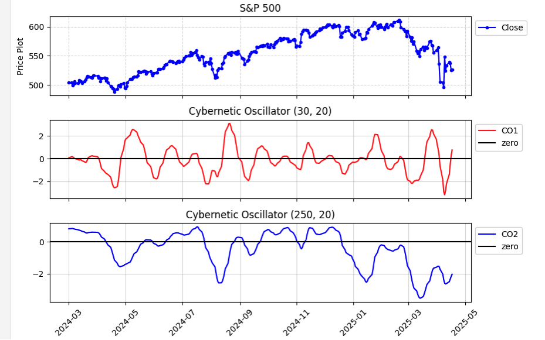

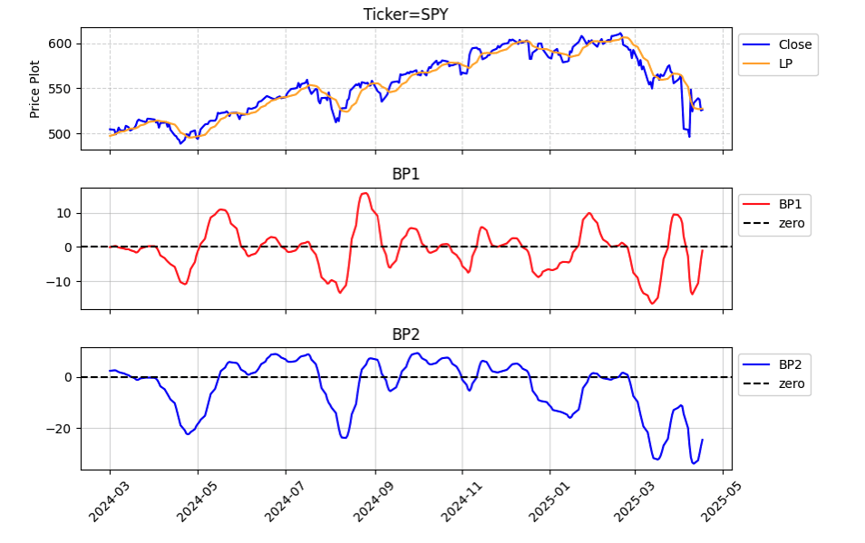

*—Rajeev Jain, jainraje@yahoo.com*

---

## Microsoft Excel

In his article in this issue, "Making A Better Oscillator," John Ehlers combines a couple of the bits taken from his recent articles to build an oscillator where we can tune the upper and lower frequency limits of our band of interest.

The spreadsheet file for this Traders' Tip can be downloaded from: https://www.traders.com/Documentation/FEEDbk_docs/2025/06/images/code/CyberneticOscillator.xlsm

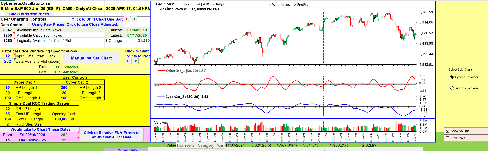

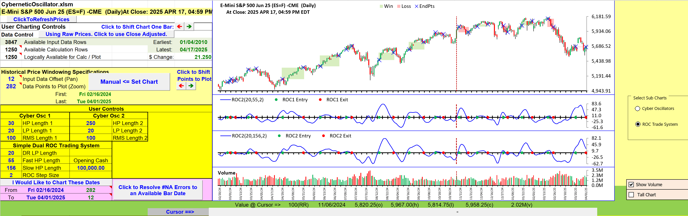

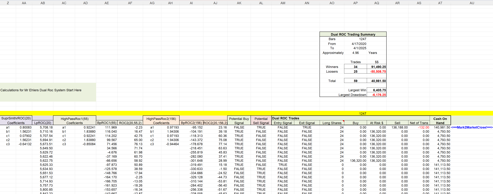

*—Ron McAllister, Excel and VBA programmer, rpmac_xltt@sprynet.com*

---

Originally published in the June 2025 issue of *Technical Analysis of Stocks & Commodities* magazine. All rights reserved. © Copyright 2025, Technical Analysis, Inc.

---

## BibTeX

```bibtex
@misc{traderstips2025jun,
  title     = {Traders' Tips: Making A Better Oscillator},
  year      = {2025},
  month     = jun,
  url       = {https://www.traders.com/Documentation/FEEDbk_docs/2025/06/TradersTips.html},
  note      = {Implementations of Ehlers' Cybernetic Oscillator in various platforms}
}
```
