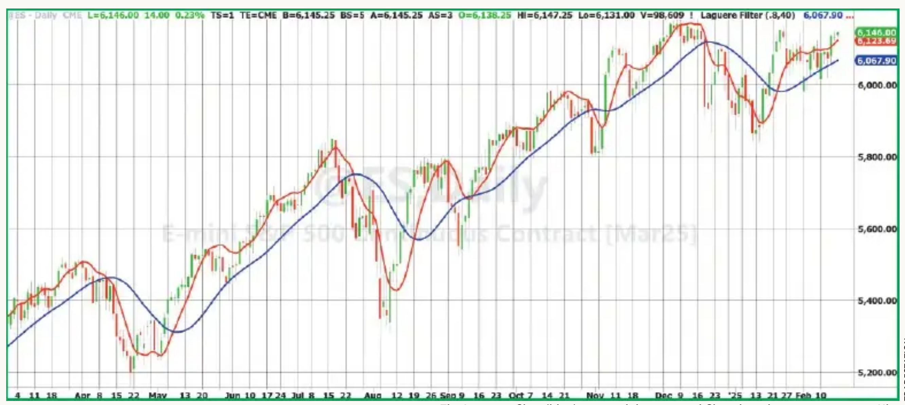
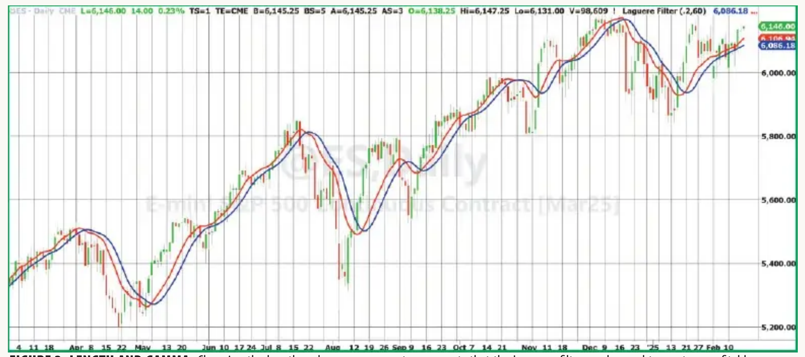
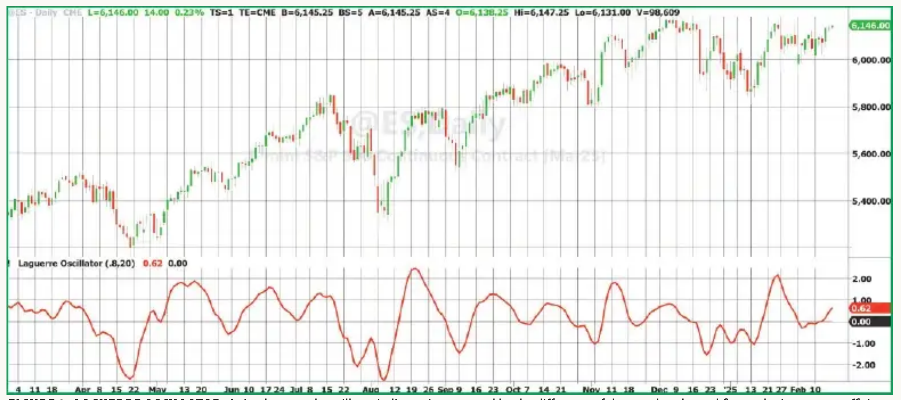

# Laguerre Filters

**John F. Ehlers**
*Technical Analysis of Stocks & Commodities*, Volume 43, July 2025, pp. 9–12

- **Article**: <https://technical.traders.com/archive/article.asp?file=\V43\C07\984EHLE.pdf>
- **Traders' Tips**: <https://www.traders.com/Documentation/FEEDbk_docs/2025/07/TradersTips.html>

---

> Here, we'll demonstrate a filter for trend trading that doesn't suffer the lag that conventional filters with equivalent smoothing have.

Laguerre filters have an exceptional capability for smoothing long wavelength components in the data spectrum. This makes them an ideal candidate as a tool for trend trading. I first described Laguerre filters in my book *Cybernetic Analysis For Stocks and Futures*. In this article, I will briefly describe Laguerre polynomials, show advanced trend filters, describe an advanced oscillator indicator, and suggest how to make a profitable trading strategy.

## Laguerre Background

Laguerre polynomials are solutions to a differential equation solved by Edmond Laguerre (1834–1886). For a discrete system, the nth coefficient of the polynomial is:

$$
L_N = \frac{1 - \gamma}{1 - \gamma Z^{-1}} \left[ \frac{Z^{-1} - \gamma}{1 - \gamma Z^{-1}} \right]^N
$$

I recognized that the first term (zeroth-order term) is the Z transform expression for an exponential moving average (EMA), and the square-bracketed term is the Z transform expression for an allpass filter. An allpass filter passes the input to the output with no change in amplitude but with a nonlinear phase relationship that depends on gamma. This structure makes the Laguerre polynomial an ideal candidate for use in a transversal filter.

A transversal filter consists of three main components: delay elements, multipliers, and an adder. The input signal is passed through a series of delay elements, creating multiple delayed versions of the signal. The delayed signals are tapped at various points along the delay line. Each tapped signal is multiplied by a coefficient (weight) to adjust its contribution to the output, and the weighted signals are summed to form the filter output. A simple moving average (SMA) is one example of a transversal filter where the weighting is uniform. A finite impulse response (FIR) filter is a more general example, where the coefficients are established by windowing.

Actually, an EMA is not a very good filter. With a goal of improving filtering results by reducing lag, I will modify the Laguerre polynomial by replacing the EMA with an UltimateSmoother. (See my April 2024 article, "The Ultimate Smoother," for more on this indicator.)

## Computing the Laguerre Filter

The computation of the Laguerre filter is coded in the sidebar, "Laguerre Filter Example, In EasyLanguage Code." Code for the UltimateSmoother function is shown in the sidebar, "$UltimateSmoother Function, In EasyLanguage Code," for your convenience.

The zeroth-order term is computed by calling the UltimateSmoother function using the input parameters. Then, sequentially, each term of the Laguerre polynomial is computed as the allpass filter delay of the previous term. I chose a fifth-order filter, but the filter can be as long or as short as desired. I chose binomial weighting of the coefficients in the summation, but weighting is not necessary. Perhaps the filter performance could be improved if Hann windowing were employed, but this increases the complexity of the code. Two plot lines are provided so you can compare the Laguerre filter to the UltimateSmoother.

The example Laguerre filter (in blue), using a gamma of 0.8 and a period of 30, is compared to the UltimateSmoother (in red) in Figure 1. It is obvious that the Laguerre filter is a much better trend filter than the responsive UltimateSmoother. The filtering characteristics can be changed rather dramatically by changing the input parameters, length, and gamma.


**Figure 1:** Laguerre Filter vs. UltimateSmoother for trends. The Laguerre filter (blue) is a much better trend filter than the more responsive UltimateSmoother (red).

For example, Figure 2 suggests that the crossovers of the UltimateSmoother and Laguerre filter can be used effectively as buy and sell signals in a trading strategy. I used a gamma of 0.2 and a period of 60 in creating Figure 2. Crossovers of different orders of the Laguerre polynomial may be a better selection for use in a trading strategy than the crossovers of the UltimateSmoother and the Laguerre filter.


**Figure 2:** Length and gamma. Changing the length and gamma parameters suggests that the Laguerre filter can be used to create a profitable crossover strategy.

## Creating an Oscillator Based on the Laguerre Filter

Since the Laguerre coefficients are nonlinear delay functions, it is a trivial matter to create a smooth and timely oscillator as the difference between the zeroth-order and first-order Laguerre coefficients. This Laguerre oscillator is shown in Figure 3, using a gamma of 0.8 and a period of 20. The indicator is scaled in standard deviations to assist in swing trading decisions.


**Figure 3:** Laguerre Oscillator. A timely, smooth oscillator indicator is generated by the difference of the zeroth-order and first-order Laguerre coefficients. The display is scaled in standard deviations to guide swing trading.

Code for the Laguerre oscillator is given in the sidebar, "Laguerre Oscillator, In EasyLanguage Code." Code for the RMS function is given in the sidebar, "$RMS Function, In EasyLanguage Code."

A smoother oscillator, but having more lag, can be created by taking the difference of the zeroth-order Laguerre term and the second-order term.

## Conclusions

The coefficients of a Laguerre polynomial suggest that an allpass filter is an ideal candidate for the delay elements of a transversal filter. The allpass filter does not change the data amplitude across the entire spectrum, but has a nonlinear phase response that favors the longer wavelengths. This nonlinear phase response results in a filter characteristic that is helpful for trend trading without the additional lag that would result by using conventional filters with equivalent smoothing.

## Code

### Laguerre Filter Example, in EasyLanguage

```easylanguage
{
  Laguerre Filter
  (C) 2002-2025 John F. Ehlers
}

Inputs:
    gama(.8),
    Length(40);

Vars:
    L0(0),
    L1(0),
    L2(0),
    L3(0),
    L4(0),
    Laguerre(0);

L0 = $UltimateSmoother(Close, Length);

L1 = -gama*L0[1] + L0[1] + gama*L1[1];
L2 = -gama*L1[1] + L1[1] + gama*L2[1];
L3 = -gama*L2[1] + L2[1] + gama*L3[1];
L4 = -gama*L3[1] + L3[1] + gama*L4[1];

Laguerre = (L0 + 4*L1 + 6*L2 + 4*L3 + L4) / 16;

Plot1(Laguerre);
Plot2(L0);
```

### $UltimateSmoother Function, in EasyLanguage

```easylanguage
{
  UltimateSmoother Function
  (C) 2004-2024 John F. Ehlers
}

Inputs:
    Price(numericseries),
    Period(numericsimple);

Vars:
    a1(0),
    b1(0),
    c1(0),
    c2(0),
    c3(0),
    US(0);

a1 = expvalue(-1.414*3.14159 / Period);
b1 = 2*a1*Cosine(1.414*180 / Period);
c2 = b1;
c3 = -a1*a1;
c1 = (1 + c2 - c3) / 4;

If CurrentBar >= 4 Then US = (1 - c1)*Price + (2*c1 - c2)*Price[1] - (c1 + c3)*Price[2] + c2*US[1] + c3*US[2];
If CurrentBar < 4 Then US = Price;

$UltimateSmoother = US;
```

### Laguerre Oscillator, in EasyLanguage

```easylanguage
{
  Laguerre Oscillator
  (C) 2002-2025 John F. Ehlers
}

Inputs:
    gama(.5),
    Length(30);

Vars:
    L0(0),
    L1(0),
    RMS(0),
    LaguerreOsc(0);

L0 = $UltimateSmoother(Close, Length);
L1 = -gama*L0[1] + L0[1] + gama*L1[1];

RMS = $RMS(L0 - L1, 100);

If RMS <> 0 Then LaguerreOsc = (L0 - L1) / RMS;

Plot1(LaguerreOsc);
Plot2(0);
```

### $RMS Function, in EasyLanguage

```easylanguage
{
  RMS Function
  (C) 2015-2022 John F. Ehlers
}

Inputs:
    Price(numericseries),
    Length(numericsimple);

Vars:
    SumSq(0),
    count(0);

SumSq = 0;
for count = 0 to Length - 1 Begin
    SumSq = SumSq + Price[count]*Price[count];
End;

If SumSq <> 0 Then $RMS = SquareRoot(SumSq / Length);
```

## Further Reading

- Ehlers, John [2004]. *Cybernetic Analysis For Stocks And Futures*, John Wiley & Sons.
- Ehlers, John [2013]. *Cycle Analytics For Traders*, John Wiley & Sons.
- Ehlers, John [2021]. "A Technical Description of Market Data for Traders," *Technical Analysis of Stocks & Commodities*, Volume 39, May.
- Ehlers, John [2024]. "The Ultimate Smoother," *Technical Analysis of Stocks & Commodities*, Volume 42, April.

---

## BibTeX

```bibtex
@article{ehlers2025laguerrefilters,
  author  = {John F. Ehlers},
  title   = {Laguerre Filters},
  journal = {Technical Analysis of Stocks \& Commodities},
  volume  = {43},
  number  = {7},
  pages   = {9--12},
  month   = jul,
  year    = {2025},
  url     = {https://technical.traders.com/archive/article.asp?file=\V43\C07\984EHLE.pdf}
}

@misc{traderstips202507,
  title        = {Traders' Tips},
  howpublished = {Technical Analysis of Stocks \& Commodities},
  month        = jul,
  year         = {2025},
  url          = {https://www.traders.com/Documentation/FEEDbk_docs/2025/07/TradersTips.html},
  note         = {Implementations of John Ehlers' Laguerre Filters for various platforms}
}
```
