# Traders' Tips — July 2025

**Article:** "Laguerre Filters" by John F. Ehlers  
**Source:** [Traders' Tips, TASC July 2025](https://traders.com/Documentation/FEEDbk_docs/2025/07/TradersTips.html)

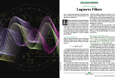

For this month's Traders' Tips, the focus is John F. Ehlers' article in this issue, "Laguerre Filters." Here, we present the July 2025 Traders' Tips code with possible implementations in various software.

---

## TradeStation

In "Laguerre Filters" in this issue, John Ehlers presents a trend-trading technique using the Laguerre filter. Since Laguerre filters excel at smoothing long-wavelength components in a data set, this makes them particularly well-suited for identifying trading trends.

```easylanguage
Function: Laguerre Filter
{
	TASC JUL 2025
	Laguerre Filter
	(C) 2002-2025 John F. Ehlers
}

inputs:
	Gama( .8 ),
	Length( 40 );

variables:
	L0( 0 ),
	L1( 0 ),
	L2( 0 ),
	L3( 0 ),
	L4( 0 ),
	Laguerre( 0 );
	
L0 = $UltimateSmoother(Close, Length);
L1 = -Gama * L0[1] + L0[1] + Gama * L1[1];
L2 = -Gama * L1[1] + L1[1] + Gama * L2[1];
L3 = -Gama * L2[1] + L2[1] + Gama * L3[1];
L4 = -Gama * L3[1] + L3[1] + Gama * L4[1];

Laguerre = (L0 + 4*L1 + 6*L2 + 4*L3 + L4) / 16;


Plot1( Laguerre );
Plot2( L0 );


Indicator: Laguerre Oscillator
{
	TASC JUL 2025
	Laguerre Oscillator
	(C) 2002-2025 John F. Ehlers
}

inputs:
	Gama( .5 ),
	Length( 30 );

variables:
	L0( 0 ),
	L1( 0 ),
	RMS( 0 ),
	LaguerreOsc( 0 );

L0 = $UltimateSmoother(Close, Length);
L1 = -Gama * L0 + L0[1] + Gama * L1[1];
RMS = $RMS(L0 - L1, 100);

if RMS <> 0 then 
	LaguerreOsc = (L0 - L1) / RMS;
	
Plot1( LaguerreOsc, "Laguerre Osc" );
Plot2( 0, "Zero Line" );

Function: $RMS
{
	RMS Function
	(C) 2015-2025 John F. Ehlers
}

inputs:
	Price( numericseries ),
	Length( numericsimple );

variables:
	SumSq( 0 ),
	count( 0 );

SumSq = 0;

for count = 0 to Length - 1 
begin
	SumSq = SumSq + Price[count] * Price[count];
end;

If SumSq <> 0 then 
	$RMS = SquareRoot(SumSq / Length);

Function: $UltimateSmoother
{
	UltimateSmoother Function
	(C) 2004-2025 John F. Ehlers
}

inputs:
	Price( numericseries ),
	Period( numericsimple );
	
variables:
	a1( 0 ),
	b1( 0 ),
	c1( 0 ),
	c2( 0 ),
	c3( 0 ),
	US( 0 );
	
a1 = ExpValue(-1.414*3.14159 / Period);
b1 = 2 * a1 * Cosine(1.414*180 / Period);
c2 = b1;
c3 = -a1 * a1;
c1 = (1 + c2 - c3) / 4;

if CurrentBar >= 4 then 
 US = (1 - c1)*Price + (2 * c1 - c2) * Price[1] 
 - (c1 + c3) * Price[2] + c2*US[1] + c3 * US[2];
 
if CurrentBar < 4 then 
	US = Price;

$UltimateSmoother = US;
```

**Code file:** [TradeStation_LaguerreFilters.els](TradeStation_LaguerreFilters.els)

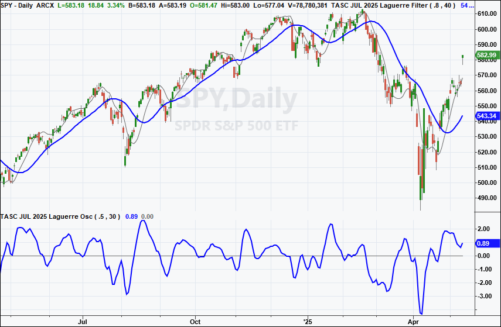

**FIGURE 1: TRADESTATION.** This demonstrates a daily chart of SPY showing a portion of 2024 and 2025 with the indicators applied.

*—John Robinson, TradeStation Securities, Inc., [www.TradeStation.com](http://www.tradestation.com/)*

---

## MetaStock

John Ehlers' article in this issue, "Laguerre Filters," introduces two indicators, the Laguerre filter and Laguerre oscillator. Here are the formulas to add those indicators to MetaStock.

```metastock
THE LAGUERRE FILTER

{Laguerre Filter}
{by John Ehlers}
gama:= 0.8;
len:= 40;

{Ultimate Smoother}
a1:= exp(-1.414*3.14159 / len);
b1:= 2*a1*Cos(1.414*180 / len);{c2}
c1:= -a1*a1; {c3}
x1:= (1 + b1 - c1) / 4; {c1}
L0:= (1-x1)*Close + (2*x1-b1)*Ref(Close,-1) -
 (x1+c1)*Ref(Close,-2) + b1*Prev + c1*Ref(prev,-1);

{Laguerre calculation}
L1:= -gama*Ref(L0,-1) + Ref(L0,-1) + gama*Prev;
L2:= -gama*Ref(L1,-1) + Ref(L1,-1) + gama*Prev;
L3:= -gama*Ref(L2,-1) + Ref(L2,-1) + gama*Prev;
L4:= -gama*Ref(L3,-1) + Ref(L3,-1) + gama*Prev;
 
Laguerre:= (L0 + 4*L1 + 6*L2 + 4*L3 + L4)/16;
 
if(BarsSince(cum(1)>=len+5)=0, Laguerre, C);
if(BarsSince(cum(1)>=len+5)=0, L0, C)
 


THE LAGUERRE OSCILLATOR

{Laguerre Oscillator}
{by John Ehlers}
gama:= 0.5;
len:= 30;
 
{Ultimate Smoother}
a1:= exp(-1.414*3.14159 / len);
b1:= 2*a1*Cos(1.414*180 / len);{c2}
c1:= -a1*a1; {c3}
x1:= (1 + b1 - c1) / 4; {c1}
L0:= (1-x1)*Close + (2*x1-b1)*Ref(Close,-1) -
 (x1+c1)*Ref(Close,-2) + b1*Prev + c1*Ref(prev,-1);
 
L1:= -gama* Ref(L0,-1) + Ref(L0,-1) + gama*Prev;
diff:= L0 - L1;
 
{RMS of diff}
RMS:= SQRT(Sum(diff * diff, 100) / 100);
 
{divide by zero trap}
denom:= if(RMS = 0, -1, RMS);
LaguerreOsc:= If(denom = -1, 0, diff/denom);
 
LaguerreOsc;
0
```

**Code file:** [MetaStock_LaguerreFilters.txt](MetaStock_LaguerreFilters.txt)

*—William Golson, MetaStock Technical Support, [MetaStock.com](http://metastock.com/)*

---

## Wealth-Lab

You'll find the Laguerre indicator and the LaguerreOsc indicator in WealthLab's TASC Indicator library to drag and drop into charts or block strategies.

As suggested at the end of John Ehlers' article in this issue, "Laguerre Filters," a (long-only) *UltimateSmoother/Laguerre* crossover strategy is somewhat profitable, even without optimizing. However, we goosed the profit significantly in the backtest period by entering *long before a crossover* when *LaguerreOsc* turns up from between -2 and -3 standard deviations. This entry required adding a stop-loss, which we fixed at -3%. The first two entries in Figure 2 are examples of how timely this bonus signal can be!

```csharp
using WealthLab.TASC;
using System;
using WealthLab.Backtest;
using WealthLab.Core;
using WealthLab.Indicators;

namespace WealthScript
{
    public class LaguerreX : UserStrategyBase
    {
        public LaguerreX()
        {
            _period = AddParameter("Period", ParameterType.Int32, 60, 20, 80, 10);
            _gamma = AddParameter("Gamma", ParameterType.Double, 0.2, 0.1, 0.5, 0.1);
        }

        public override void Initialize(BarHistory bars)
        {
            PlotStopsAndLimits(3);
            _laguerre = new Laguerre(bars.Close, _period.AsInt, _gamma.AsDouble);
            _ultsmooth = new UltimateSmoother(bars.Close, _period.AsInt);
            _lagOsc = new LaguerreOsc(bars.Close, _period.AsInt, _gamma.AsDouble);

            PlotIndicatorLine(_laguerre, WLColor.Aqua);
            PlotIndicatorLine(_ultsmooth, WLColor.Red);
            PlotIndicatorLine(_lagOsc, WLColor.Gold);
            DrawHorzLine(-2, WLColor.White, 2, LineStyle.Dashed, _lagOsc.PaneTag);
            StartIndex = Math.Max(100, _period.AsInt);
        }

        public override void Execute(BarHistory bars, int idx)
        {
            if (!HasOpenPosition(bars, PositionType.Long))
            {
                if (_ultsmooth.CrossesOver(_laguerre, idx))
                    PlaceTrade(bars, TransactionType.Buy, OrderType.Market, 0, 1);
                if (_lagOsc.TurnsUp(idx) && _lagOsc[idx - 1] < -2 && _lagOsc[idx - 1] > -3)
                    PlaceTrade(bars, TransactionType.Buy, OrderType.Market, 0, 2);
            }
            else
            {
                Position p = LastPosition;
                ClosePosition(p, OrderType.Stop, p.EntryPrice * 0.97, "SL");
                if (_ultsmooth.CrossesUnder(_laguerre, idx))
                    ClosePosition(p, OrderType.Market, 0, "XU");
            }
        }

        Parameter _period;
        Parameter _gamma;
        IndicatorBase _laguerre;
        IndicatorBase _ultsmooth;
        IndicatorBase _lagOsc;
    }
}
```

**Code file:** [WealthLab_LaguerreFilters.cs](WealthLab_LaguerreFilters.cs)

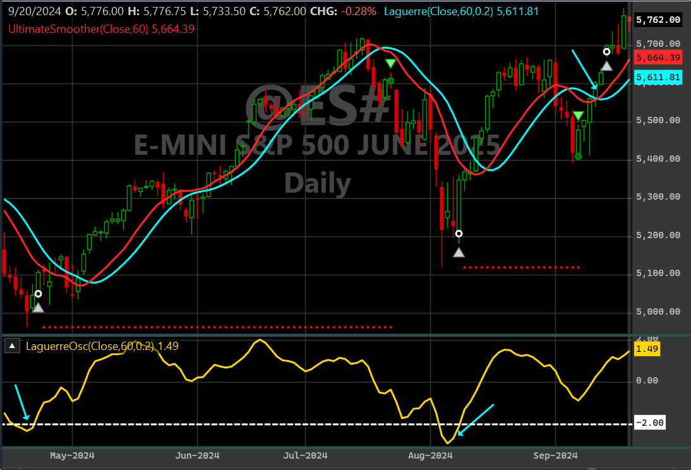

**FIGURE 2: WEALTH-LAB.** This demonstrates using the Laguerre oscillator and smoothing filter on a daily chart of the emini S&P 500 contract. In this example you see the modified crossover strategy with two entries triggered by LaguerreOsc.

*—Robert Sucher, Wealth-Lab team, [www.wealth-lab.com](http://www.wealth-lab.com/)*

---

## NinjaTrader

In his article "Laguerre Filters" in this issue, John Ehlers presents two indicators, the Laguerre filter and the Laguerre oscillator. The indicators are available for download at the following link for NinjaTrader 8:

- **NinjaTrader 8:** [ninjatrader.com/SC/July2025SCNT8.zip](https://ninjatrader.com/SC/July2025SCNT8.zip)

Once the file is downloaded, you can import the indicators into NinjaTrader 8 from within the control center by selecting Tools → Import → NinjaScript Add-On and then selecting the downloaded file for NinjaTrader 8.

You can review the indicator source code in NinjaTrader 8 by selecting the menu New → NinjaScript Editor → Indicators folder from within the control center window and selecting the file.

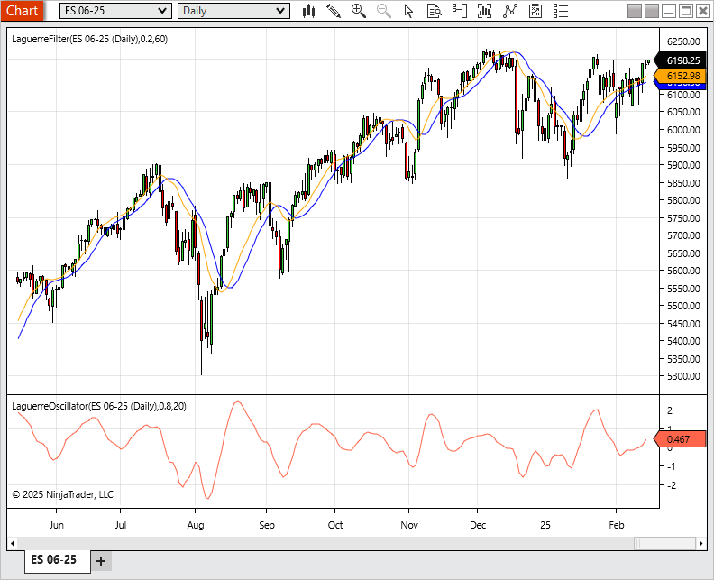

**FIGURE 3: NINJATRADER.** The indicators are demonstrated on a daily chart of ES.

*—Eduardo, NinjaTrader, LLC, [www.ninjatrader.com](http://www.ninjatrader.com/)*

---

## RealTest

Provided here is a RealTest script for the RealTest platform to implement the indicators described in John Ehlers' article in this issue, "Laguerre Filters."

Figure 4 demonstrates the Laguerre filter on a daily chart of the emini S&P 500 continuous futures contract (ES). Figure 5 demonstrates the Laguerre oscillator on a daily chart of ES.

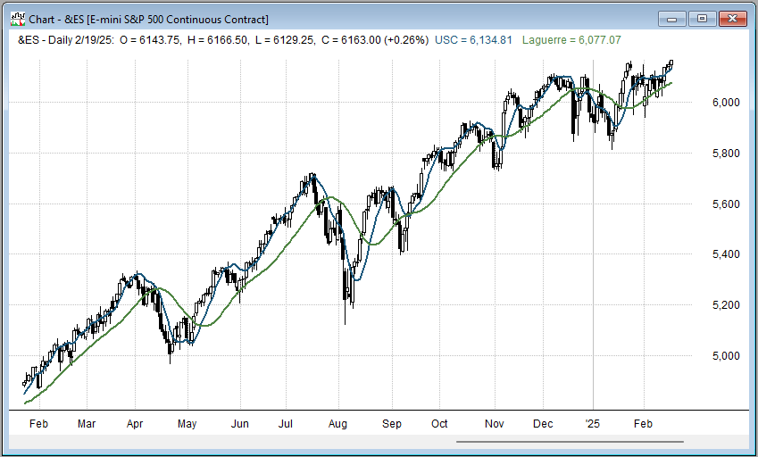

**FIGURE 4: REALTEST.** Here you see an example of the Laguerre filter applied to a daily chart of the emini S&P 500 continuous futures contract (ES).

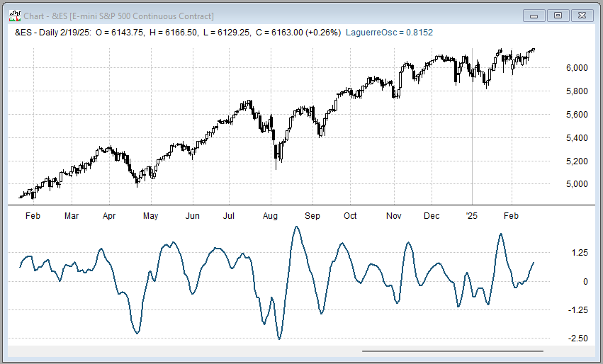

**FIGURE 5: REALTEST.** This demonstrates the Laguerre oscillator on a daily chart of ES.

```realtest
Notes:
	John Ehlers "Laguerre Filters", TASC July 2025.
	Implements and plots the indicators as in the article.
	
Import:
	DataSource:	Norgate
	IncludeList:	&ES
	StartDate:	2023-02-01
	EndDate:	Latest
	SaveAs:	es.rtd
	
Settings:
	DataFile:	es.rtd
	BarSize:	Daily

Parameters:
	gama:	0.8 
	len:	20
	RMSlen:	100
	
Data:
	
// Common constants
	
	decay_factor:	-1.414 * 3.14159
	phase_angle:	1.414 * 180
	two_pi:	6.28
	
	// Ultimate Smoother of Close
	
	a1:	exp(decay_factor / len)
	b1:	2 * a1 * Cosine(phase_angle / len)
	c2:	b1
	c3:	-a1 * a1
	c1:	(1 + c2 - c3) / 4
	USC:	if(BarNum >= 4, (1 - c1) * Close + (2 * c1 - c2) * Close[1] - (c1 + c3) * Close[2] + c2 * USC[1] + c3 * USC[2], Close)
	
	// Laguerre Filter of USC
	
	L1:	-gama * USC[1] + USC[1] + gama*nonan(L1[1])
	L2:	-gama * L1[1] + L1[1] + gama*nonan(L2[1])
	L3:	-gama * L2[1] + L2[1] + gama*nonan(L3[1])
	L4:	-gama * L3[1] + L3[1] + gama*nonan(L4[1])
	Laguerre:	(USC + 4 * L1 + 6 * L2 + 4 * L3 + L4) / 16
	
	// Laguerre Oscillator
	
	LUSC:	-gama * USC + USC[1] + gama * nonan(LUSC[1])
	RMS:	Sqr(SumSQ(USC - LUSC, RMSlen) / RMSlen)
	LaguerreOsc:	(USC - LUSC) / RMS
	

Charts:

//	USC:	USC 

//	Laguerre:	Laguerre 
	LaguerreOsc:	LaguerreOsc {|}
```

**Code file:** [RealTest_LaguerreFilters.rts](RealTest_LaguerreFilters.rts)

*—Marsten Parker, MHP Trading, mhp@mhptrading.com*

---

## TradingView

The TradingView Pine Script code presented here implements the Laguerre filter discussed by John Ehlers in his article in this issue, "Laguerre Filters."

```pine
//  TASC Issue: July 2025
//     Article: A Tool For Trend Trading
//              Laguerre Filters
//  Article By: John F. Ehlers
//    Language: TradingView's Pine Script® v6
// Provided By: PineCoders, for tradingview.com

//@version=6
indicator("TASC 2025.07 Laguerre Filters", "", false)

//#region  Inputs:

// @variable The Source series to process. 
float src = input.source(close, 'Source:')
// @variable Weigth - Gamma. 
float gamma = input.float(0.5, 'Gamma:')
// @variable The UltimateSmoother filter period. 
int length1 = input.int(30, 'L1:')
// @variable The number of bars in the RMS calculation.
int length2 = input.int(100, 'L2:')

//#endregion
//#region  Functions:

//  from:
//  TASC Issue: April 2024, Article: The Ultimate Smoother
//
// @function       The UltimateSmoother is a filter created
//                 by subtracting the response of a high-pass 
//                 filter from that of an all-pass filter.
// @param src      Source series.
// @param period   The length of the filter's critical period.
// @returns        Smoothed series.
UltimateSmoother (float src, int period) =>
    float a1 = math.exp(-1.414 * math.pi / period)
    float c2 = 2.0 * a1 * math.cos(1.414 * math.pi / period)
    float c3 = -a1 * a1
    float c1 = (1.0 + c2 - c3) / 4.0
    float us = src
    if bar_index >= 4
        us := (1.0 - c1) * src + 
              (2.0 * c1 - c2) * src[1] - 
              (c1 + c3) * src[2] + 
              c2 * nz(us[1]) + c3 * nz(us[2])
    us

// @function Laguerre Filter
// @param src      Source series, default=`close`.
// @param gamma    Weigth used in LF calculation, default=0.8.
// @param length   Period used in UltimateSmoother, default=40.
// @returns        Laguerre Filter used on chart.
LF (float src=close, float gamma=0.8, int length=40) =>
    float L0 = UltimateSmoother(src, length)
    float L1 = 0.0 , float L2 = 0.0 , float L3 = 0.0
    float L4 = 0.0 , float L5 = 0.0
    L1 := -gamma * nz(L0[1]) + nz(L0[1]) + gamma * nz(L1[1]) 
    L2 := -gamma * nz(L1[1]) + nz(L1[1]) + gamma * nz(L2[1]) 
    L3 := -gamma * nz(L2[1]) + nz(L2[1]) + gamma * nz(L3[1]) 
    L4 := -gamma * nz(L3[1]) + nz(L3[1]) + gamma * nz(L4[1]) 
    L5 := -gamma * nz(L4[1]) + nz(L4[1]) + gamma * nz(L5[1])
    float LF = nz(L0 + 4 * L1 + 6 * L2 + 4 * L3 + L5) / 16

// @function         Calculates the root mean square (RMS) of a series.
// @param Source     The series of values to process.
// @param Length     The number of bars in the calculation.
// @returns          The RMS of the `Source` values over `Length` bars.
RMS (float Source, int Length) =>
    math.sqrt(ta.sma(Source * Source, Length))

// @function Laguerre Oscillator
// @param src      Source series, default=`close`.
// @param gamma    Weigth used in LO calculation, default=0.5.
// @param length1  Period used in UltimateSmoother, default=30.
// @param length2  Period used in RMS, default=100.
// @returns        Laguerre Oscillator used on a separate pane.
LO (float src=close
  , float gamma=0.5
  , int length1=30
  , int length2=100) =>
    float L0 = UltimateSmoother(src, length1)
    float L1 = 0.0
    L1 := -gamma * L0 + nz(L0[1]) + gamma * nz(L1[1])
    float RMS = RMS(L0 - L1, length2)
    float LO = na
    if RMS != 0
        LO := (L0 - L1) / RMS
    LO

//#endregion
//#region  Laguerre Filter/Oscillator:

float lf = LF(src, gamma, length1)
float lo = LO(src, gamma, length1, length2)

plot(lf
  , 'Laguerre Filter'
  , force_overlay=true
  , linewidth=2)
plot(lo
  , 'Laguerre Oscillator'
  , color=#f23645
  , linewidth=2)
hline(0
  , "Zero-line"
  , chart.fg_color)

//#endregion
```

**Code file:** [TradingView_LaguerreFilters.pine](TradingView_LaguerreFilters.pine)

The indicator is available on TradingView from the PineCodersTASC account: [https://www.tradingview.com/u/PineCodersTASC/#published-scripts](https://www.tradingview.com/u/PineCodersTASC/#published-scripts).

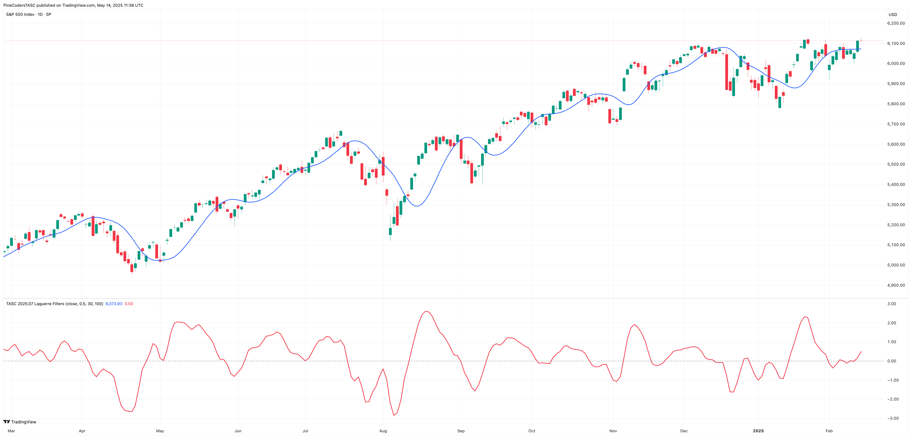

**FIGURE 6: TRADINGVIEW.** Here you see an example of the Laguerre filter on a daily chart of the S&P 500 index.

*—PineCoders, for TradingView, [www.TradingView.com](http://www.tradingview.com/)*

---

## NeuroShell Trader

The Laguerre filter and oscillator introduced in "Laguerre Filters" this issue by John Ehlers can be easily implemented in NeuroShell Trader using NeuroShell Trader's ability to call external dynamic linked libraries. Dynamic linked libraries can be written in C, C++ and Power Basic.

After moving the code given in the article to your preferred compiler and creating a DLL, you can insert the resulting indicator(s) as follows:

1. Select "New Indicator" from the *insert* menu.
2. Choose the **External Program & Library Calls** category.
3. Select the appropriate **External DLL Call** indicator.
4. Setup the parameters to match your DLL.
5. Select the *finished* button.

Users of NeuroShell Trader can go to the Stocks & Commodities section of the NeuroShell Trader free technical support website to download a copy of this or any previous Traders' Tips.

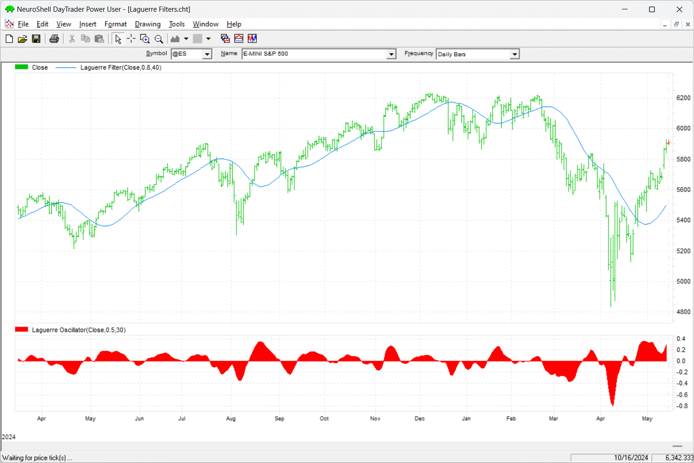

**FIGURE 7: NEUROSHELL TRADER.** This NeuroShell Trader chart demonstrates the Laguerre filter and Laguerre oscillator on a daily chart of the emini S&P 500 (ES).

*—Ward Systems Group, Inc., sales@wardsystems.com, [www.neuroshell.com](http://www.neuroshell.com/)*

---

## Python

Here we present Python code to implement concepts in John Ehlers' article in this issue, "Laguerre Filters." The code implements the Laguerre filter, the Laguerre oscillator, and the UltimateSmoother. The indicators are plotted using the MatplotLib and MplFinance Python packages.

```python
# import required python libraries
# %matplotlib inline

import pandas as pd
import numpy as np
import yfinance as yf
import math
import datetime as dt
import matplotlib.pyplot as plt
import mplfinance as mpf

print(yf.__version__)


# Use Yahoo Finance python package to obtain OHLCV data 
symbol = '^GSPC'
symbol = 'SPY'
ohlcv = yf.download(symbol, start="1995-01-01", end="2025-04-18", group_by="Ticker", auto_adjust=True)
ohlcv = ohlcv[symbol]


# Python code building block/routines used to implement the Laguerre filter, 
# the Laguerre oscillator, and the UltimateSmoother as defined by John Ehlers
# in his article. 

def calc_ultimate_smoother(price, period):
    
    a1 = np.exp(-1.414 * np.pi / period)
    b1 = 2*a1*np.cos(math.radians(1.414 * 180 / period))
    c2 = b1
    c3 = -a1 * a1
    c1 = (1 + c2 - c3)/4

    us_values = []

    for i in range(len(price)):
        if i >= 4:
            us_values.append(
                (1-c1)*price[i] + (2*c1 - c2)*price[i-1] - (c1 + c3)*price[i-2] + c2*us_values[i-1] + c3*us_values[i-2]
            )
        else:
            us_values.append(price[i]) 

    return us_values


def calc_rms(price):
    
    length = len(price)
    sum_sq = 0
    for count in range(length):
        sum_sq += price[count] * price[count]
    return np.sqrt(sum_sq / length)


def laguerre_filter(prices, length=40, gama=0.8):
    prices = pd.Series(prices)
    
    # Apply the Ultimate Smoother to get L0
    L0 = calc_ultimate_smoother(prices, length)
    
    # Initialize lagged values
    L1 = pd.Series(np.zeros_like(prices), index=prices.index)
    L2 = pd.Series(np.zeros_like(prices), index=prices.index)
    L3 = pd.Series(np.zeros_like(prices), index=prices.index)
    L4 = pd.Series(np.zeros_like(prices), index=prices.index)
    L5 = pd.Series(np.zeros_like(prices), index=prices.index)
    Laguerre = pd.Series(np.zeros_like(prices), index=prices.index)
        
    for i in range(1, len(prices)):
        L1[i] = -gama * L0[i-1] + L0[i-1] + gama * L1[i-1]
        L2[i] = -gama * L1[i-1] + L1[i-1] + gama * L2[i-1]
        L3[i] = -gama * L2[i-1] + L2[i-1] + gama * L3[i-1]
        L4[i] = -gama * L3[i-1] + L3[i-1] + gama * L4[i-1]
        L5[i] = -gama * L4[i-1] + L4[i-1] + gama * L5[i-1]
        Laguerre[i] = (L0[i] + 4 * L1[i] + 6 * L2[i] + 4 * L3[i] + L5[i]) / 16

    return Laguerre

def laguerre_oscillator(prices, length=40, gama=0.8):
    prices = pd.Series(prices)
    
    # Apply the Ultimate Smoother to get L0
    L0 = calc_ultimate_smoother(prices, length)
    
    # Initialize lagged values
    L1 = pd.Series(np.zeros_like(prices), index=prices.index)
    LaguerreOsc = pd.Series(np.zeros_like(prices), index=prices.index)
        
    for i in range(1, len(prices)):
        L1[i] = -gama * L0[i] + L0[i-1] + gama * L1[i-1]
    
    rms = L1.rolling(100).apply(calc_rms)
    LaguerreOsc = (L0 - L1)/rms
    
    return LaguerreOsc


def simple_plot1(df):
    
    cols = ['Close', 'US', 'Laguerre']
    ax = df[cols].plot(marker='.', grid=True, figsize=(9,6), title=f'Laguerre Filter vs UltimateSmoother, Ticker={symbol}')
    ax.set_xlabel('')

# Below is example usage to run the Laguerre filter and the UltimateSmoother 
# indicator calculations using the length and gamma suggested in John Ehlers' article
# with a simple plot presenting price overlaid with indicators.

length = 30
gama = 0.8

df = ohlcv.copy()
df['US'] = calc_ultimate_smoother(df['Close'], period=length)
df['Laguerre'] = laguerre_filter(df['Close'], length=length, gama=gama)
simple_plot1(df['2024-03':'2025-02-10'])

# Example usage to run the Laguerre Filter, Laguerre Oscillator, and 
# UltimateSmoother indicator calculations using the length and gamma 
# suggested in the article.

df = ohlcv.copy()
df['US'] = calc_ultimate_smoother(df['Close'], period=40)
df['Laguerre'] = laguerre_filter(df['Close'], length=40, gama=0.2)
df['LaguerreOsc'] = 100/3*laguerre_oscillator(df['Close'], 20, 0.8)
df
mpf_plot1(df['2024-03':'2025-02-10'])
```

**Code file:** [Python_LaguerreFilters.py](Python_LaguerreFilters.py)

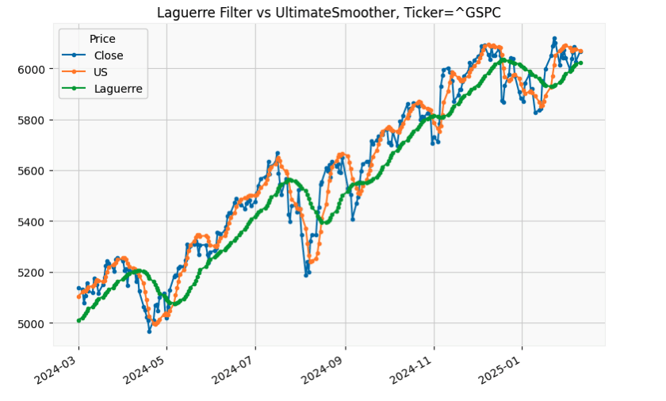

**FIGURE 8: PYTHON.** This shows an example of both the Laguerre filter and the UltimateSmoother, for comparison, overlaid on a chart of the S&P 500 stock index (GSPC). The indicator calculations used here are based on the length and gamma suggested in John Ehlers' article in this issue.

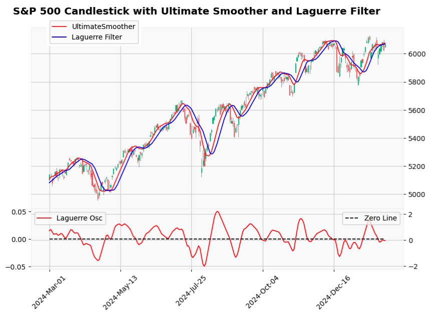

**FIGURE 9: PYTHON.** This shows an example of the Laguerre oscillator applied to a chart of the S&P 500 index in the subplot. In the main pane, crossovers of the Laguerre filter and the UltimateSmoother are overlaid on price candles.

*—Rajeev Jain, jainraje@yahoo.com*

---

## Microsoft Excel

In his article in this issue, "Laguerre Filters," John Ehlers makes a simple adjustment to the Laguerre calculation by applying his UltimateSmoother as the first layer of the calculation. Then he compares the resulting Laguerre filter with the UltimateSmoother (see Figure 10). That chart in his article shows the Laguerre filter to be the better trend follower.

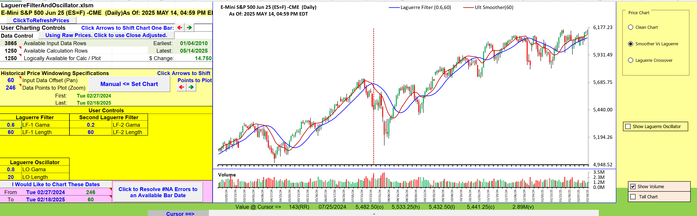

**FIGURE 10: EXCEL.** Here you see the Laguerre filter and the UltimateSmoother plotted on a chart of the emini S&P 500 index futures contract (ES) for comparison. The Laguerre filter appears to be a better trend-follower.

In his article, Ehlers proceeds to demonstrate the effectiveness of pairing two Laguerre filters with slightly different specifications to generate trend-following signals. (See Figure 11.)

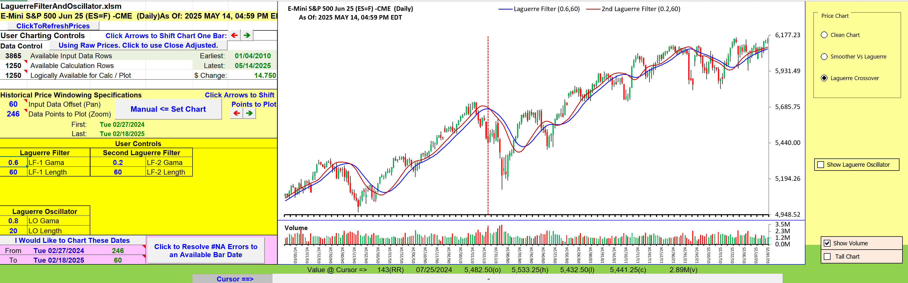

**FIGURE 11: EXCEL.** Here is a demonstration of two Laguerre filters, each with different length and gamma specs, used to generate trend-following signals.

As a last option, Ehlers shows how to turn parts of the Laguerre calculation into a trend-following oscillator, where values above zero generally correspond to upward movement and values below zero to downward movement. (See Figure 12.)

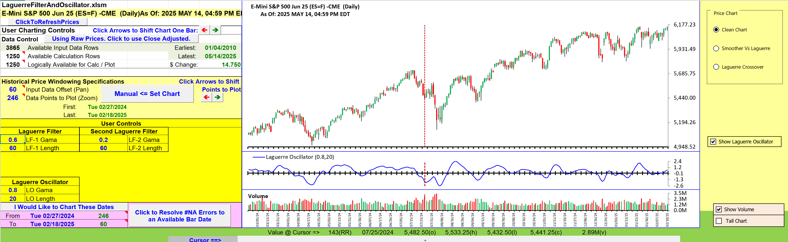

**FIGURE 12: EXCEL.** Here is a demonstration of the Laguerre oscillator, a low-lag trend indicator, applied to a chart of ES. Values above zero generally correspond to upward movement and values below zero generally correspond to downward movement.

**To download this spreadsheet:** The spreadsheet file for this Traders' Tip can be downloaded [here](https://www.traders.com/Documentation/FEEDbk_docs/2025/07/images/code/LaguerreFilterAndOscillator.xlsm).

*—Ron McAllister, Excel and VBA programmer, rpmac_xltt@sprynet.com*

---

## References

```bibtex
@article{ehlers2025laguerrefilters,
  author  = {John F. Ehlers},
  title   = {Laguerre Filters},
  journal = {Technical Analysis of Stocks \& Commodities},
  year    = {2025},
  month   = {July},
  volume  = {43},
  number  = {7},
  url     = {https://traders.com/Documentation/FEEDbk_docs/2025/07/TradersTips.html}
}
```

---

*Originally published in the July 2025 issue of Technical Analysis of Stocks & Commodities magazine. All rights reserved. © Copyright 2025, Technical Analysis, Inc.*
