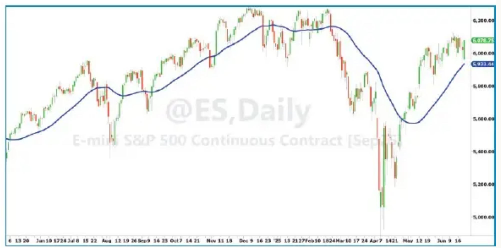
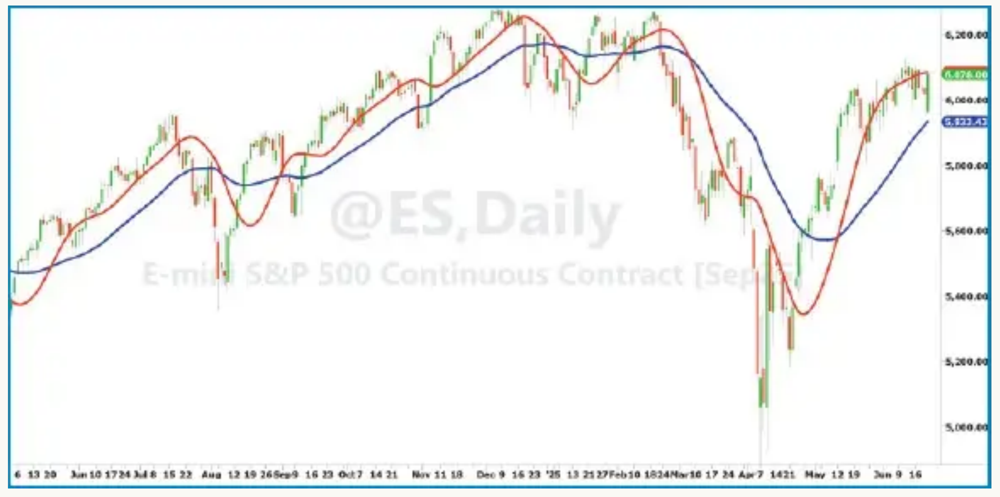
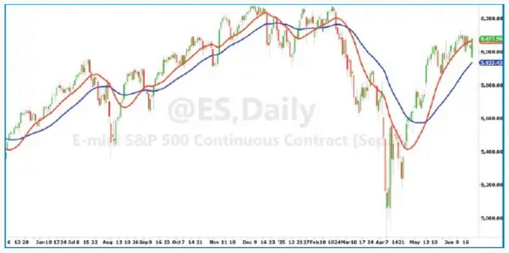
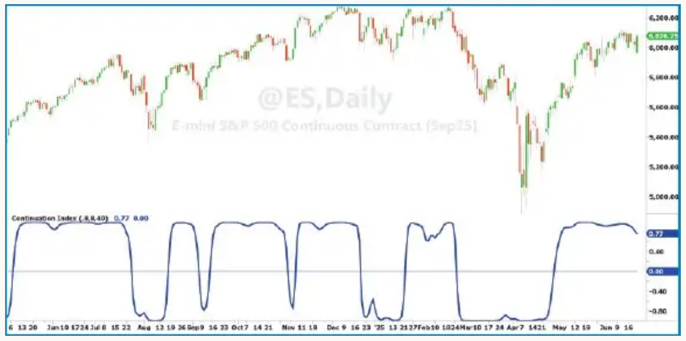

# The Continuation Index

**Trend Onset And Trend Exhaustion**

*by John F. Ehlers*

*Here, we introduce an indicator named the continuation index to provide early indication of trend onset and early indication of a trend exhaustion.*

- **Article**: [Technical Analysis of Stocks & Commodities, V43, September 2025, pp 9–12](https://technical.traders.com/archive/article.asp?file=\V43\C09\012EHLE.pdf)
- **Traders' Tips**: [September 2025 Traders' Tips](https://www.traders.com/Documentation/FEEDbk_docs/2025/09/TradersTips.html)

---

I began developing the *continuation index* with the observation that a Laguerre filter is a reasonable representation of a trend, and when in a trend, prices tend to stay on one side of the filter or the other. I recently wrote about the Laguerre filter in my previous article in this magazine ("The Laguerre Filter," July 2025 issue) and I also describe the Laguerre filter in my new book, *Cybernetic Trading Indicators*.

An example of an eighth-order Laguerre filter using a gamma of 0.8 is shown in Figure 1, demonstrating the trend characterization of the filter output and the position of prices relative to the filter line when the market is in an identifiable trend.

I created the *continuation index* based on the Laguerre filter. The purpose of the continuation index (CI) is to provide a timely indication of the onset of a trend, continuation of that trend, and a timely indication of the trend exhaustion. With the assumption that the market is either trending up or trending down, the CI primarily has two states:

- If the index has a value of **+1**, this suggests a **long** position.
- If the index has a value of **-1**, this suggests the trading position should be **flat or short** (depending on your preferred trading style).

Having only two states, the exhaustion of the trend in one direction is the same as the onset of a trend in the opposite direction except for a very short transition period.

Almost all indicators require smoothing so that you can make some sense of them, and the CI is no exception. An UltimateSmoother filter is used to minimize computational lag of the index. The UltimateSmoother is also described in my book *Cybernetic Trading Indicators* as well as in several of my previous articles in this magazine (see "Further reading" at end.)

To further minimize computational lag, the length of data used for the UltimateSmoother is half the length of the Laguerre filter.



**FIGURE 1: LAGUERRE FILTER.** A Laguerre filter shows the market trend characteristic.

## Calculation

The continuation index is basically formed by normalizing the difference between the UltimateSmoother and the Laguerre filter to the average difference over the length of the Laguerre filter. The aesthetics of the CI are enhanced by doubling the normalized difference and applying an inverse Fisher transform to compress the display to be approximately +1 or -1. That's it!

The sidebar "Continuation Index, In EasyLanguage Code" provides coding to compute the continuation index.

The change of state of the CI is caused by price crossing the Laguerre filter, so the timing of the crossing depends on the settings for the Laguerre filter. There are two parameters that control the filter response. These parameters are *gamma* and the filter *order*.

### Gamma

"Gama" is a variable that can be set to between zero and one, and primarily controls the filter response. (Note: Since "gamma" is a reserved word in EasyLanguage, I named my variable "gama".) When gamma is zero, the Laguerre filter is exactly the same as the UltimateSmoother.

Figure 2 shows the Laguerre filter response for a gamma of 0.4 (red), compared to the original Laguerre filter response as in Figure 1 for a gamma of 0.8 (blue). While the smaller gamma value produces a faster state reversal, the penalty is the introduction of whipsaw indications. It is probably a good idea to keep the value of gamma near the default setting of 0.8.



**FIGURE 2: LAGUERRE FILTER RESPONSE, GAMMA PARAMETER COMPARISON.** Compared here is the Laguerre filter response for a gamma setting of 0.4 (red) versus the response using the default gamma setting of 0.8 (blue).

### Order

The "order" variable is the order of the Laguerre filter, which can vary from 1 to 10. The primary impact of changing the order is to change the computational lag of the filter. When the order equals 1, the Laguerre filter is exactly the same as an UltimateSmoother. Changing the lag of the filter has a greater influence on the timing of the state reversal of the CI.

Figure 3 shows the Laguerre filter response for an order of 4 (red) compared to the original Laguerre filter response of order 8 (blue).



**FIGURE 3: LAGUERRE FILTER RESPONSE, ORDER PARAMETER COMPARISON.** Here you see the Laguerre filter response for an order of 4 (or "fourth-order," in red) compared to the original Laguerre filter response of order 8 (or "eighth-order," in blue).

### Length

The *length* input of the CI primarily affects the smoothness of the display. A good starting point for the length is to use your desired time to be in a trade position. For example, if you want to hold a trade for a month, use *length* = 20 (20 trading days). If you want to hold a trade for a quarter, use *length* = 60 (60 trading days).

## Applying the Continuation Index

The continuation index response using the default settings of "gama" = 0.8 and "order" = 8 is shown in Figure 4 for approximately one year of the emini S&P futures contract. It is clear that the state reversal is a timely signal for the onset of the trend in one direction and the exhaustion of the trend in the opposite direction. Departures of the CI value from +1 can be used as signals to "buy on a dip." Although less likely, there are signals to "sell short on a pop."

The most likely application of the CI uses daily bars. If your particular symbol has a trend bias, such as the market indexes, you probably want to use a long-only trading philosophy. On the other hand, there are markets such as Treasury bonds or gold futures that can be profitably traded both long and short.

There is sufficient flexibility in the CI using the *gama*, *order*, and *length* inputs that it can be used to trade intraday data. In this case, it is a pretty good idea to remove the daily opening gaps because these gaps distort the computed trend for a large portion of the day.

Here are two lines of code to remove the opening gap from every bar during the day so you can trade the short-term trends during the day on the degapped data:

```easylanguage
If Time = SessionStartTime + BarSize Then gap = Open – Degap[1];
Degap = Close – gap;
```

As mentioned, the sidebar "Continuation Index, In EasyLanguage Code" provides code to compute the continuation index. This code uses the UltimateSmoother and Laguerre filter functions code given in the additional two sidebars, "UltimateSmoother Function, In EasyLanguage Code" and "Laguerre Filter Function, In EasyLanguage Code."



**FIGURE 4: CONTINUATION INDEX.** This shows an example of the continuation index using default settings for daily bars of the emini S&P futures contract (ES).

## Conclusion

The continuation index provides an early indication of a trend onset and an early indication of a trend exhaustion. The continuation index has two states: +1 to indicate a long position and -1 to indicator a flat or short position, depending on your trading philosophy. Short-term failures to hold a solid state value indicates an opportunity to add to your position by "buying on a dip" or conversely, "sell short on a pop." The continuation index inputs provide flexibility to trade a wide variety of markets, including intraday.

---

## Continuation Index, In EasyLanguage Code

```easylanguage
{
    Continuation Index
    (C) 2025  John F. Ehlers
}

Inputs:
    gama(.8),
    order(8),
    Length(40);

Vars:
    US(0),
    LG(0),
    Ref(0),
    Variance(0),
    CI(0);

//Ultimate Smoother
US = $UltimateSmoother(Close, Length / 2);

//Laguerre Filter
LG = $Laguerre(Close, gama, order, Length);

//Average the filter difference
Variance = Average(AbsValue(US - LG), Length);

//Double the normalized variance
If Variance <> 0 Then Ref = 2*(US - LG) / Variance;

//Compress using an Inverse Fisher Transform
CI = (ExpValue(2*Ref) - 1) / (ExpValue(2*Ref) + 1);

plot1(CI);
Plot2(0);
```

## UltimateSmoother Function, In EasyLanguage Code

```easylanguage
{
    $Ultimate Smoother Function
    (C) 2025  John F. Ehlers
}

Inputs:
    Price(numericseries),
    Period(numericsimple);

Vars:
    a0(0),
    Q(0),
    c1(0),
    c2(0),
    US(0);

Q = expvalue(-1.414*3.14159 / Period);
c1 = 2*Q*Cosine(1.414*180 / Period);
c2 = Q*Q;
a0 = (1 + c1 + c2) / 4;

If CurrentBar >= 4 Then US = (1 - a0)*Price + (2*a0 -
c1)*Price[1] + (c2 - a0)*Price[2] + c1*US[1] - c2*US[2];
If CurrentBar < 4 Then US = Price;

$UltimateSmoother = US;
```

## Laguerre Filter Function, In EasyLanguage Code

```easylanguage
{
    Laguerre Filter Function
    (C) 2005-2022  John F. Ehlers

    Usage:  $Laguerre(Price, gama, Order, Length);
            gama must be less than 1 and equal to or greater
    than zero
            order must be an integer, 10 or less
}

Inputs:
    Price(numericseries),
    gama(numericsimple),
    order(numericsimple),
    Length(numericsimple);

Vars:
    count(0),
    FIR(0);

Arrays:
    LG[10, 2](0);

//load the current values of the arrays to be the values one
//bar ago
For count = 1 to order Begin
    LG[count, 2] = LG[count, 1];
End;

//compute the Laguerre components for the current bar
For count = 2 to order Begin
    LG[count, 1] = -gama*LG[count - 1, 2] + LG[count - 1, 2]
    + gama*LG[count, 2];
End;
LG[1, 1] = $UltimateSmoother(Price, Length);

//sum the Laguerre components
FIR = 0;
For count = 1 to order Begin
    FIR = FIR + LG[count, 1];
End;

$Laguerre = FIR / order;
```

---

## Further Reading

- Ehlers, John [2025]. *Cybernetic Trading Indicators*, Amazon.com.
- --- [2013]. *Cycle Analytics For Traders*, John Wiley & Sons.
- --- [2004]. *Cybernetic Analysis For Stocks And Futures*, John Wiley & Sons.
- --- [2021]. "A Technical Description of Market Data for Traders," *Technical Analysis of Stocks & Commodities*, Volume 39: May.
- --- [2014]. "Predictive And Successful Indicators," *Technical Analysis of Stocks & Commodities*, Volume 32: January.
- --- [2025]. "The Ultimate Oscillator," *Technical Analysis of Stocks & Commodities*, Volume 43: April.
- --- [2025]. "Laguerre Filters," *Technical Analysis of Stocks & Commodities*, Volume 43, July.

‡TradeStation
‡See Editorial Resource Index

*The code given in this article is available in the **Article Code** section of our website, Traders.com.*

*See our **Traders' Tips** section beginning on page 50 for implementation of John Ehlers' technique in various technical analysis programs and trading platforms. Code found in the Traders' Tips section is also posted to Traders.com.*

---

*John Ehlers is a retired electrical engineer and a retired technical analyst, specializing in the application of DSP (digital signal processing) to trading. His new book is Cybernetic Trading Indicators. For more information about his work, see www.mesasoftware.com.*

---

## BibTeX

```bibtex
@article{ehlers2025continuationindex,
  author  = {John F. Ehlers},
  title   = {The Continuation Index},
  journal = {Technical Analysis of Stocks \& Commodities},
  volume  = {43},
  number  = {9},
  pages   = {9--12},
  year    = {2025},
  month   = sep,
  url     = {https://technical.traders.com/archive/article.asp?file=\V43\C09\012EHLE.pdf}
}

@misc{traderstips2025sep,
  title        = {Traders' Tips: September 2025},
  howpublished = {Technical Analysis of Stocks \& Commodities},
  year         = {2025},
  month        = sep,
  url          = {https://www.traders.com/Documentation/FEEDbk_docs/2025/09/TradersTips.html},
  note         = {Implementations of the Continuation Index by John F. Ehlers in various platforms}
}
```
