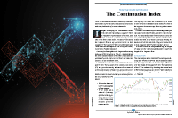
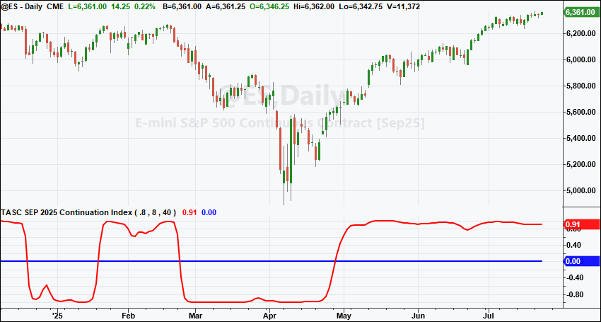
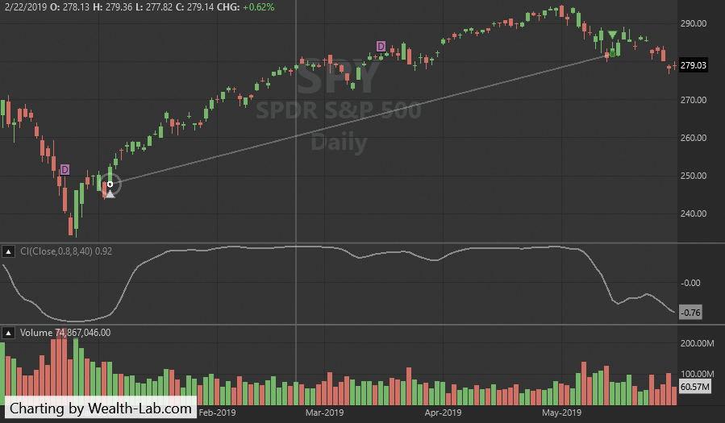
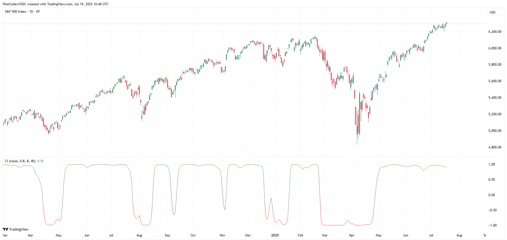
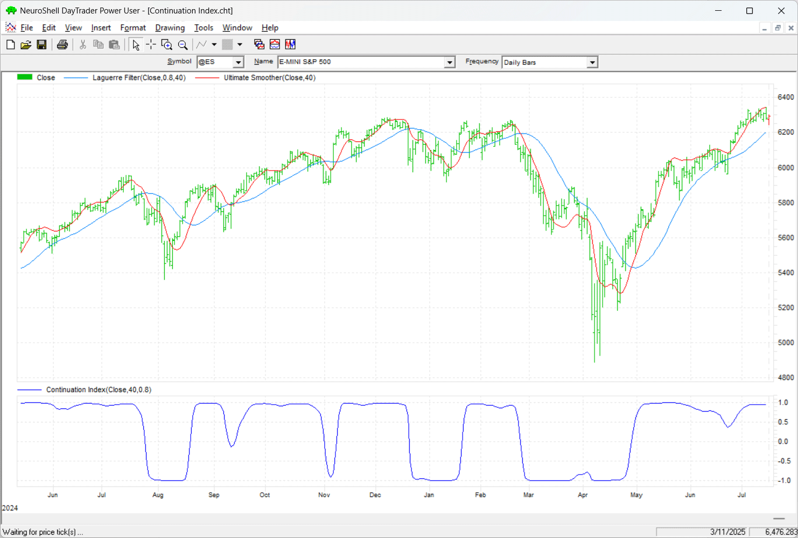
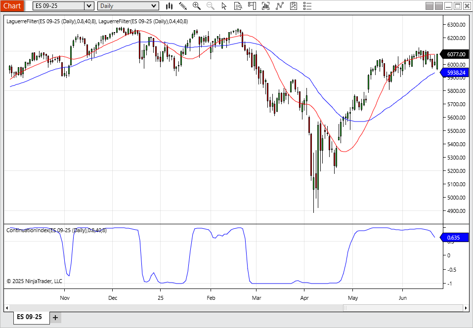

# Traders' Tips — September 2025

**Article:** "The Continuation Index" by John F. Ehlers  
**Source:** [Traders' Tips, TASC September 2025](https://traders.com/Documentation/FEEDbk_docs/2025/09/TradersTips.html)



For this month's Traders' Tips, the focus is John F. Ehlers' article in this issue, "The Continuation Index." Here, we present the September 2025 Traders' Tips code with possible implementations in various software.

---

## TradeStation

In "The Continuation Index" in this issue, John Ehlers presents an indicator named the continuation index, designed to signal both the early onset and potential exhaustion of a trend. The indicator is based on the Laguerre filter and reduces computational lag using the UltimateSmoother filter.

```easylanguage
Indicator: Continuation Index
{
 	TASC SEPTEMBER 2025
	Continuation Index
	(C) 2025 John F. Ehlers
}
inputs:
	Gama( .8 ),
	Order( 8 ),
	Length( 40 );

variables:
	US( 0 ),
	LG( 0 ),
	Ref( 0 ),
	Variance( 0 ),
	CI( 0 );

//Ultimate Smoother
US = $UltimateSmoother(Close, Length / 2);
//Laguerre Filter
LG = $Laguerre(Close, Gama, Order, Length);
//Average the filter difference
Variance = Average(AbsValue(US - LG), Length);
//Double the normalized variance
if Variance <> 0 then 
	Ref = 2*(US - LG) / Variance;
//Compress using an Inverse Fisher Transform
CI = ( ExpValue(2 * Ref) - 1) / (ExpValue(2 * Ref) + 1);

plot1( CI );
Plot2( 0 );

Function: $Laguerre
{
 Laguerre Filter Function
 (C) 2005-2022 John F. Ehlers

 Usage: $Laguerre(Price, gama, Order, Length);
 ` gama must be less than 1 and equal to or greater
 than zero order must be an integer, 10 or less
}
inputs:
	Price( numericseries ),
	Gama( numericsimple ),
	Order( numericsimple ),
	Length( numericsimple );
	
variables:
	Count( 0 ),
	FIR( 0 );

arrays:
	LG[10, 2]( 0 );
	
//load the current values of the arrays to be the values 
// one bar ago
for count = 1 to order 
begin
	LG[count, 2] = LG[count, 1];
end;

//compute the Laguerre components for the current bar
for count = 2 to order
begin
	LG[count, 1] = -gama*LG[count - 1, 2] + LG[count - 1, 2]
	 + gama*LG[count, 2];
End;

LG[1, 1] = $UltimateSmoother(Price, Length);
//sum the Laguerre components
FIR = 0;
for count = 1 to order 
begin
	FIR = FIR + LG[count, 1];
end;

$Laguerre = FIR / order;

Function: $UltimateSmoother
{
	UltimateSmoother Function
	(C) 2004-2025 John F. Ehlers
}

inputs:
	Price( numericseries ),
	Period( numericsimple );
	
variables:
	a1( 0 ),
	b1( 0 ),
	c1( 0 ),
	c2( 0 ),
	c3( 0 ),
	US( 0 );
	
a1 = ExpValue(-1.414*3.14159 / Period);
b1 = 2 * a1 * Cosine(1.414*180 / Period);
c2 = b1;
c3 = -a1 * a1;
c1 = (1 + c2 - c3) / 4;

if CurrentBar >= 4 then 
 US = (1 - c1)*Price + (2 * c1 - c2) * Price[1] 
 - (c1 + c3) * Price[2] + c2*US[1] + c3 * US[2];
 
if CurrentBar < 4 then 
	US = Price;

$UltimateSmoother = US;
```

**Code file:** [TradeStation_ContinuationIndex.els](TradeStation_ContinuationIndex.els)



**FIGURE 1: TRADESTATION.** A daily chart of the continuous emini S&P 500 futures showing a portion of 2024 and 2025 demonstrates the indicator applied.

*—John Robinson, TradeStation Securities, Inc., [www.TradeStation.com](http://www.tradestation.com/)*

---

## Wealth-Lab

We've added John Ehlers' continuation index (CI) indicator to WealthLab 8 as a built-in indicator with adjustable parameters for *gamma*, *order* and *length*.

Shown here is a simple strategy (for demonstration purposes only) based on the indicator, built using our drag-and-drop strategy builder feature. The strategy uses the following rules:

- Buy when CI crosses above -0.9
- Sell when CI crosses below 0

These settings appear to capture long-term trends. Positions can be held until a major turnaround of the trend is detected. Figure 2 shows an example trade that occurred recently on SPY in a backtest.



**FIGURE 2: WEALTH-LAB.** This demonstrates applying a simple trading strategy to a chart of SPY to test trading signals produced by the continuation index. Here you can see a recent trade it signaled.

*—Dion Kurczek, [www.wealth-lab.com](http://www.wealth-lab.com/)*

---

## TradingView

The TradingView Pine Script code presented here implements the continuation index introduced by John Ehlers in his article in this issue, "The Continuation Index."

```pine
//  TASC Issue: September 2025
//     Article: Trend Onset And Trend Exhaustion
//              The Continuation Index
//  Article By: John F. Ehlers
//    Language: TradingView's Pine Script® v6
// Provided By: PineCoders, for tradingview.com

//@version=6
indicator("TASC 2025.09 The Continuation Index", "CI", false)

//#region Inputs:

float src = input.source(close, "Data Source:")
float gamma = input.float(0.8, "Gamma:", minval=0.0, maxval=1.0)
int order = input.int(8, "Order:", minval=1, maxval=10)
int length = input.int(40, "Length:")

//#endregion


//#region   Functions:

//  from: TASC 2025.07
// @function      The UltimateSmoother is a filter created
//                by subtracting the response of a high-pass 
//                filter from that of an all-pass filter.
// @param src     Source series.
// @param period  Critical period.
// @returns       Smoothed series.
UltimateSmoother (float src, int period) =>
    float a1 = math.exp(-1.414 * math.pi / period)
    float c2 = 2.0 * a1 * math.cos(1.414 * math.pi / period)
    float c3 = -a1 * a1
    float c1 = (1.0 + c2 - c3) / 4.0
    float us = src
    if bar_index >= 4
        us := (1.0 - c1) * src + 
              (2.0 * c1 - c2) * src[1] - 
              (c1 + c3) * src[2] + 
              c2 * nz(us[1]) + c3 * nz(us[2])
    us

// @function Laguerre Filter.
// @param src Data source.
// @param gama Gamma value controls the the filter response, range: `[0, 1]`.
// @param order Order of the laguerre filter lag, range: `[1, 10]`.
// @param length Length of the smoothness effect.
// @returns Laguerre filtered value.
LF (float src=close, float gama=0.8, float order=8, int length=40) =>
    var matrix<float> LG = matrix.new<float>(10, 2, 0.0)
    // load the current values of the arrays to be the values one bar ago.
    for i = 0 to order - 1
        LG.set(i, 1, LG.get(i, 0))
    // compute the laguerre components for the current bar.
    for i = 1 to order - 1
        LG.set(i, 0, 
         -gama * LG.get(i-1, 1) + LG.get(i-1, 1) + gama * LG.get(i, 1))
    LG.set(0, 0, UltimateSmoother(src, length))
    // sum the laguerre components
    float FIR = 0.0
    for i = 0 to order - 1
        FIR += LG.get(i, 0)
    FIR / order

// @function Continuation Index.
// @param src Data source.
// @param gama Gamma value controls the the filter response, range: `[0, 1]`.
// @param order Order of the laguerre filter lag, range: `[1, 10]`.
// @param length Length of the smoothness effect.
// @returns Continuation index value.
CI (
 float src=close, 
 float gamma=0.8, 
 int order=8, 
 int length=40
 ) =>
    float US = UltimateSmoother(src, int(length / 2))
    float LG = LF(src, gamma, order, length)
    float Variance = ta.sma(math.abs(US - LG), length)
    float Ref = Variance != 0.0 ? 2.0 * (US - LG) / Variance : 0.0
    (math.exp(2.0 * Ref) - 1.0) / (math.exp(2.0 * Ref) + 1.0)


//#endregion


//#region Display:

float CI = CI(src, gamma, order, length)

color ci_col = switch 
    CI >  0.5 => color.from_gradient(CI,  0.5,  1.0, color.gray, color.green)
    CI < -0.5 => color.from_gradient(CI, -0.5, -1.0, color.red, color.gray)
    => color.gray

plot(CI, "Continuation index", ci_col)
barcolor(ci_col)

//#endregion
```

**Code file:** [TradingView_ContinuationIndex.pine](TradingView_ContinuationIndex.pine)

The indicator is available on TradingView from the PineCodersTASC account at [https://www.tradingview.com/u/PineCodersTASC/#published-scripts](https://www.tradingview.com/u/PineCodersTASC/#published-scripts).



**FIGURE 3: TRADINGVIEW.** Here you see an example chart of SPY with the continuation index indicator applied.

*—PineCoders, for TradingView, [www.TradingView.com](https://www.tradingview.com/)*

---

## NeuroShell Trader

The continuation index, as introduced by John Ehlers' article in this issue, can be easily implemented in NeuroShell Trader by combining some of NeuroShell Trader's 800+ indicators and Ehlers' UltimateSmoother and Laguerre filter indicators (see the July 2025 Traders' Tips). To implement the continuation index, select "New indicator" from the insert menu and use the indicator wizard to create the following indicators:

```
DIFF:               Subtract( Ultimate Smoother(Close,40), Laguerre Filter(Close,0.8,40) )
VARIANCE:           MovAvg( Abs(DIFF), 40 )
EXP:                Exp( Divide( Mul2( 4, DIFF )))
CONTINUATION INDEX: Divide( Subtract( EXP, 1 ), Add2( EXP, 1 ) )
```



**FIGURE 4: NEUROSHELL TRADER.** This example NeuroShell Trader chart shows the continuation index (bottom pane) applied to a daily chart of the emini S&P 500 continuous contract (ES) along with Ehlers' UltimateSmoother and Laguerre filter indicators plotted.

*—Ward Systems Group, Inc., sales@wardsystems.com, [www.neuroshell.com](http://www.neuroshell.com/)*

---

## Python

Following is an implementation of the continuation index in the Python programming language. The continuation index is based on Ehlers' UltimateSmoother function and the Laguerre filter function. The code imports the required Python libraries, imports data from Yahoo Finance, converts the EasyLanguage code given in Ehlers' article to Python for the continuation index, and compares parameters.

```python
"""
Written By: Rajeev Jain, 2025-07-23
Trader Tips python code for TAS&C Magazine article "The Continuation Index"

"""

# import required python libraries
# %matplotlib inline

import pandas as pd
import numpy as np
import math
import datetime as dt
import yfinance as yf
import matplotlib.pyplot as plt

print(yf.__version__)


# Use Yahoo Finance python package to obtain OHLCV data for the SP500 index
symbol = '^GSPC'
ohlcv = yf.download(
    symbol, 
    start="2019-01-01", 
    end="2025-07-24", 
    auto_adjust=True,
    multi_level_index=False,
    progress=False,
)

# Python functions to implement UltimateSmoother, Laguerre Filter and 
# Continuation Index as defined in John Ehlers' article. 
def ultimate_smoother(price_series, period):
    """
    Ultimate Smoother function converted from EasyLanguage to Python.
    """
    price_series = np.asarray(price_series)
    n = len(price_series)
    US = np.zeros(n)

    # Filter coefficients
    Q = math.exp(-1.414 * math.pi / period)
    c1 = 2 * Q * math.cos(1.414 * math.pi / period)
    c2 = Q * Q
    a0 = (1 + c1 + c2) / 4

    for i in range(n):
        if i < 3:
            US[i] = price_series[i]
        else:
            US[i] = ((1 - a0) * price_series[i] +
                     (2 * a0 - c1) * price_series[i - 1] +
                     (c2 - a0) * price_series[i - 2] +
                     c1 * US[i - 1] -
                     c2 * US[i - 2])
    return US

def laguerre_filter(price_series, gama, order, length):
    """
    Laguerre Filter Function converted from EasyLanguage to Python.
    """
    assert 0 <= gama < 1, "gama must be in [0, 1)"
    assert order <= 10 and order >= 1, "order must be integer between 1 and 10"
    price_series = np.asarray(price_series)
    n = len(price_series)
    output = np.zeros(n)

    # Initialize Laguerre matrix: shape (order+1, 2)
    LG = np.zeros((order + 1, 2))

    # Precompute ultimate smoother once
    smoothed_price = ultimate_smoother(price_series, length)
    for t in range(n):
        # Shift previous values
        LG[:, 1] = LG[:, 0]
        # Update LG[1] using the smoothed price at current time
        LG[1, 0] = smoothed_price[t]
        # Compute rest of the Laguerre components recursively
        for count in range(2, order + 1):
            LG[count, 0] = (
                -gama * LG[count - 1, 1] +
                LG[count - 1, 1] +
                gama * LG[count, 1]
            )
        # Sum current values of LG[1] to LG[order]
        FIR = np.sum(LG[1:order + 1, 0])
        output[t] = FIR / order
    return output

def continuation_index(close_prices, gama=0.8, order=8, length=40):
    """
    Continuation Index by John F. Ehlers (converted from EasyLanguage).
    """
    close_prices = np.asarray(close_prices)
    n = len(close_prices)

    # Step 1: Ultimate Smoother with Length / 2
    US = ultimate_smoother(close_prices, length / 2)
    # Step 2: Laguerre Filter
    LG = laguerre_filter(close_prices, gama, order, length)
    # Step 3: Variance = avg(abs(US - LG)) over Length
    diff = np.abs(US - LG)
    variance = np.convolve(diff, np.ones(length)/length, mode='same')
    # Step 4: Normalized difference, scaled by 2
    with np.errstate(divide='ignore', invalid='ignore'):
        ref = np.where(variance != 0, 2 * (US - LG) / variance, 0)
    # Step 5: Inverse Fisher Transform compression
    CI = (np.exp(2 * ref) - 1) / (np.exp(2 * ref) + 1)
    return CI

# Compare Laguerre filter response for gamma setting of 0.4 vs 0.8
gama1 = 0.4
gama2 = 0.8
order = 8
length = 40
df = ohlcv.copy()
df['Laguerre_0.4'] = laguerre_filter(df['Close'], gama1, order, length)
df['Laguerre_0.8'] = laguerre_filter(df['Close'], gama2, order, length)
cols = ['Close', 'Laguerre_0.4', 'Laguerre_0.8']
ax = df[-255:][cols].plot(marker='.', grid=True, figsize=(9,6), 
    title=f'Ticker={symbol}, Laguerre Filter Response, Gamma Parameter Comparison')
ax.set_xlabel('')
plt.show()

# Compare Laguerre filter response for order of 4 vs order of 8
order1 = 4
order2 = 8
length = 40
gama = 0.8
df = ohlcv.copy()
df['Laguerre_4th'] = laguerre_filter(df['Close'], gama, order1, length)
df['Laguerre_8th'] = laguerre_filter(df['Close'], gama, order2, length)
cols = ['Close', 'Laguerre_4th', 'Laguerre_8th']
ax = df[-255:][cols].plot(marker='.', grid=True, figsize=(9,6), 
    title=f'Ticker={symbol}, Laguerre Filter Response, Order Parameter Comparison')
ax.set_xlabel('')
plt.show()

# Example of continuation index using default setting
def plot_ci(df):
    ax = df[['Close', 'Laguerre']].plot(
        marker='.', grid=True, figsize=(9,4), title=f'Ticker={symbol}')
    ax.set_xlabel('')
    ax = df[['CI']].plot(
        marker='.', grid=True, figsize=(9,2), title=f'Continuation Index')
    ax.set_xlabel('')

gama=0.8
order=8
length=40
df = ohlcv.copy()
df['Laguerre'] = laguerre_filter(df['Close'], gama, order, length)
df['CI'] = continuation_index(df['Close'], gama, order, length)
plot_ci(df[-252:])
```

**Code file:** [Python_ContinuationIndex.py](Python_ContinuationIndex.py)


**FIGURE 5: PYTHON.** This demonstrates John Ehlers' continuation index (bottom pane) on a daily chart of the emini S&P 500.

*—Rajeev Jain, jainraje@yahoo.com*

---

## NinjaTrader

In his article "The Continuation Index" in this issue, John Ehlers presents an indicator named the continuation index. The indicator is available for download at the following link for NinjaTrader 8:

- **NinjaTrader 8:** [ninjatrader.com/SC/September2025SCNT8.zip](https://ninjatrader.com/SC/September2025SCNT8.zip)

Once the file is downloaded, you can import the indicator into NinjaTrader 8 from within the control center by selecting Tools → Import → NinjaScript Add-On and then selecting the downloaded file for NinjaTrader 8.

You can review the indicator source code in NinjaTrader 8 by selecting the menu New → NinjaScript Editor → Indicators folder from within the control center window and selecting the file.



**FIGURE 6: NINJATRADER.** The continuation index is displayed in the bottom pane on a daily chart of the emini S&P 500 futures (ES). The Laguerre filter (in two different settings) is displayed in the price pane.

*—Chelsea Bell, NinjaTrader, LLC, [www.ninjatrader.com](http://www.ninjatrader.com/)*

---

## References

```bibtex
@article{ehlers2025continuationindex,
  author  = {John F. Ehlers},
  title   = {The Continuation Index},
  journal = {Technical Analysis of Stocks \& Commodities},
  year    = {2025},
  month   = {September},
  volume  = {43},
  number  = {9},
  url     = {https://traders.com/Documentation/FEEDbk_docs/2025/09/TradersTips.html}
}
```

---

*Originally published in the September 2025 issue of Technical Analysis of Stocks & Commodities magazine. All rights reserved. © Copyright 2025, Technical Analysis, Inc.*
