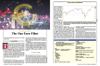
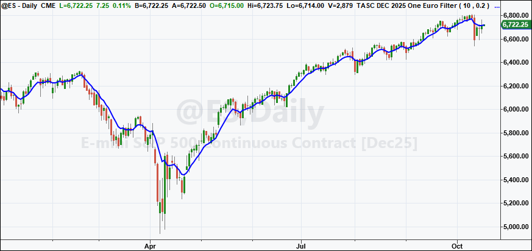
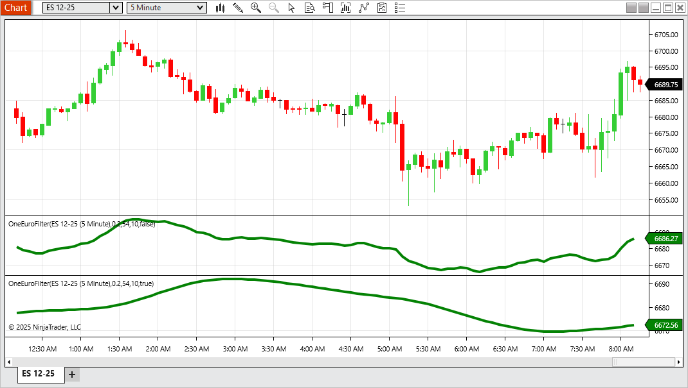
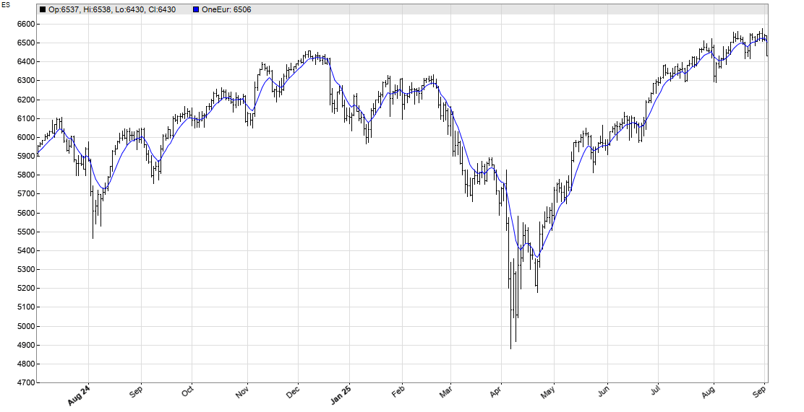
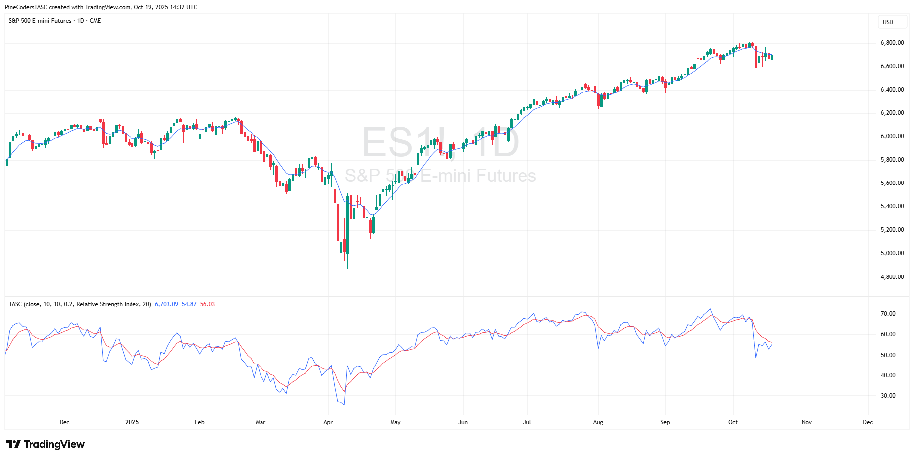
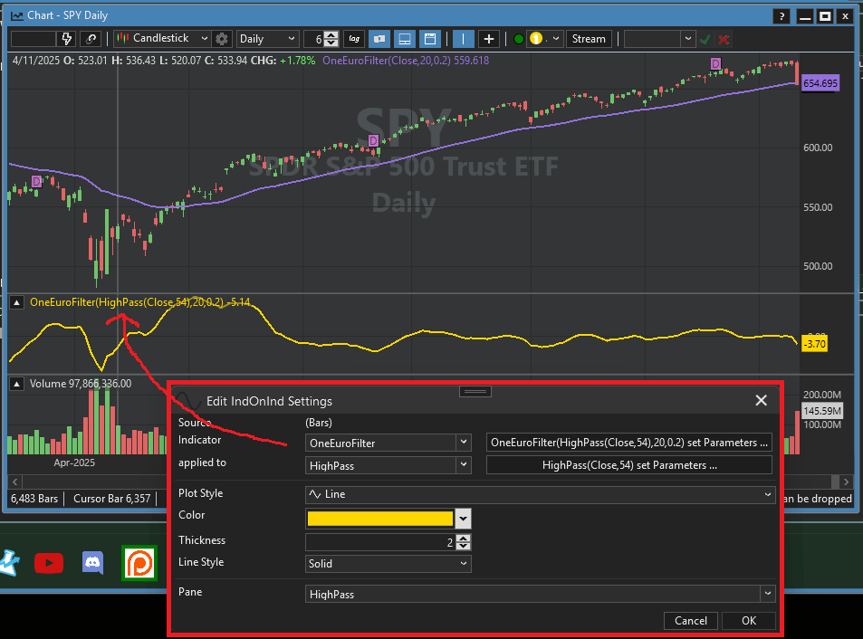
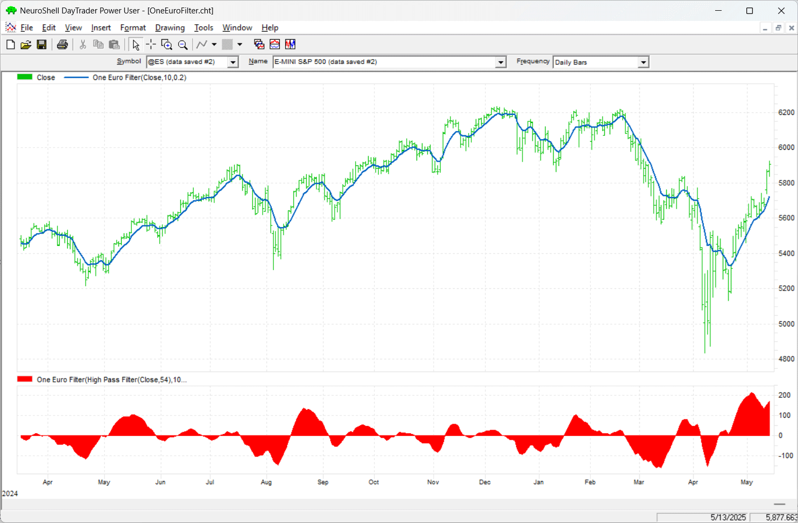
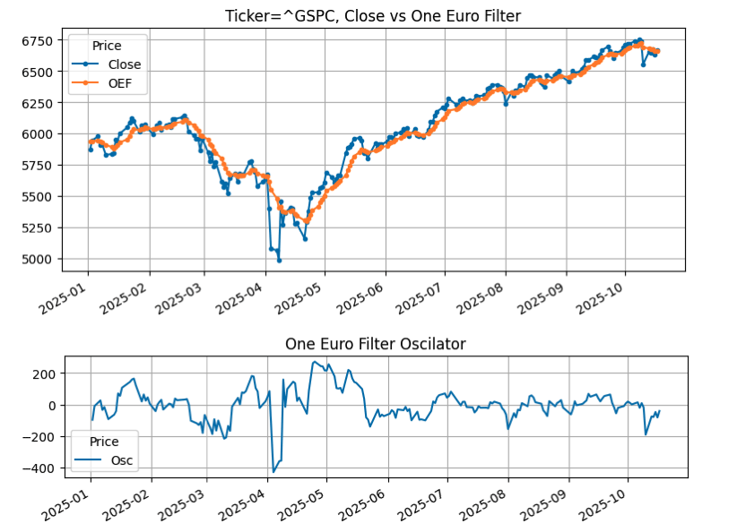

# Traders' Tips — December 2025

**Article:** "The One Euro Filter" by John F. Ehlers  
**Source:** [Traders' Tips, TASC December 2025](https://traders.com/Documentation/FEEDbk_docs/2025/12/TradersTips.html)



For this month's Traders' Tips, the focus is John F. Ehlers' article in this issue, "The One Euro Filter." Here, we present the December 2025 Traders' Tips code with possible implementations in various software.

---

## TradeStation

In "The One Euro Filter" in this issue, John Ehlers presents the one euro filter indicator, originally developed by Georges Casiez, Nicolas Roussel, and Daniel Vogel. Unlike a conventional exponential moving average (EMA) that relies on a fixed smoothing constant, this indicator dynamically adjusts its coefficient in response to the rate of change in the input signal.

```easylanguage
Indicator: One Euro Filter
{
	TASC DEC 2025
	One Euro Filter Indicator
	From "1€ Filter: A Simple Speed-Based Low-Pass Filter
	For Noisy Input In Interactive Systems" (CHI 2012)
	By Georges Casiez, Nicolas Roussel, and Daniel Vogel
	(C) 2025 John F. Ehlers
}

inputs:
	PeriodMin( 10 ), // Minimum cutoff frequency
	BetaVal( 0.2 ); // Responsiveness factor

variables:
	Price( 0 ),
	PeriodDX( 10 ),
	AlphaDX( 0 ),
	SmoothedDX( 0 ),
	Cutoff( 0 ),
	Alpha3( 0 ),
	Smoothed( 0 );

Price = Close;
AlphaDX = 2 * 3.14159 / (4 * 3.14159 + PeriodDX);

// Initialize
if CurrentBar = 1 then 
begin
	SmoothedDX = 0;
	Smoothed = Price;
end;

// EMA the Delta Price
SmoothedDX = AlphaDX * (Price - Price[1]) + (1 -
 AlphaDX) * SmoothedDX[1];
// Adjust cutoff period based on fraction of the rate of 
// change
Cutoff = PeriodMin + BetaVal * AbsValue(SmoothedDX);
// Compute adaptive alpha
Alpha3 = 2*3.14159 / (4 * 3.14159 + Cutoff);
//Adaptive smoothing
Smoothed = Alpha3 * Price + (1 - Alpha3) * Smoothed[1];
//Plot
Plot1( Smoothed );
```

**Code file:** [TradeStation_OneEuroFilter.els](TradeStation_OneEuroFilter.els)



**FIGURE 1: TRADESTATION.** This demonstrates a daily chart of the continuous emini S&P 500 contract (ES) showing a portion of 2025 with the indicator applied.

*—John Robinson, TradeStation Securities, Inc., [www.TradeStation.com](http://www.tradestation.com/)*

---

## NinjaTrader

In "The One Euro Filter" in this issue, John Ehlers discussed the *one euro filter*. The indicator is available for download at the following link for NinjaTrader 8:

- **NinjaTrader 8:** [www.ninjatrader.com/SC/December2025SCNT8.zip](https://www.ninjatrader.com/SC/December2025SCNT8.zip)

Once the file is downloaded, you can import the indicator into NinjaTrader 8 from within the control center by selecting Tools → Import → NinjaScript Add-On and then selecting the downloaded file for NinjaTrader 8.

You can review the indicator source code in NinjaTrader 8 by selecting the menu New → NinjaScript Editor → Indicators folder from within the control center window and selecting the file.



**FIGURE 2: NINJATRADER.** The OneEuroFilter is demonstrated on a 5-minute chart of the emini S&P 500 (ES).

*—Jesse N., NinjaTrader, LLC, [www.ninjatrader.com](http://www.ninjatrader.com/)*

---

## The Zorro Project

You know what happens when John Ehlers writes about an indicator in an article in this magazine? I crack it open and wire it straight into C for the Zorro platform. The *one euro filter* is a minimalistic yet surprisingly effective low-latency smoother that reacts instantly to volatility with less lag than the usual adaptive averages tend to have. This is achieved by dynamically adapting its time period.

Here is the **OneEurFilter** function in C, converted straight from Ehlers' EasyLanguage code given in his article, with the comments left in place:

```c
var OneEurFilter(vars Data, int PeriodMin, var Factor)
{
  vars SmoothedDX = series(Data[0],2), Smoothed = series(Data[0],2);
  var Alpha = 2*PI/(4*PI + 10);
//EMA the Delta Price
  SmoothedDX[0] = Alpha*(Data[0]-Data[1]) + (1.-Alpha)*SmoothedDX[1];
//Adjust cutoff period based on a fraction of the rate of change
  var Cutoff = PeriodMin + Factor*abs(SmoothedDX[0]);
//Compute adaptive alpha
  Alpha = 2*PI/(4*PI + Cutoff);
//Adaptive smoothing
  return Smoothed[0] = Alpha*Data[0] + (1.-Alpha)*Smoothed[1];
}
```

**Code file:** [Zorro_OneEuroFilter.c](Zorro_OneEuroFilter.c)

Figure 3 shows an example of the OneEurFilter applied on an ES chart. It reproduces perfectly the chart in Ehlers' article. Cheap, efficient, low-latency—I'd say it's one euro well spent.



**FIGURE 3: ZORRO.** The OneEurFilter is applied to a daily price chart of ES.

The code can be downloaded from the 2025 script repository on [https://financial-hacker.com](https://financial-hacker.com). The Zorro platform can be downloaded from [https://zorro-project.com](https://zorro-project.com).

*—Petra Volkova, The Zorro Project by oP group Germany, [https://zorro-project.com](https://zorro-project.com)*

---

## TradingView

The TradingView Pine Script code given here implements the one euro filter that is discussed by John Ehlers in his article in this issue, "The One Euro Filter."



**FIGURE 4: TRADINGVIEW.** Here you see an example of the one euro filter plotted on a price chart of the daily ES. The relative strength index is plotted in the bottom pane.

```pine
//  TASC Issue: December 2025
//     Article: Low-Latency Smoothing
//              The One Euro Filter
//  Article By: John F. Ehlers
//    Language: TradingView's Pine Script® v6
// Provided By: PineCoders, for tradingview.com

//@version=6
indicator("", "TASC", false)

//#region Constants

const float PI = math.pi

//#endregion

//#region Inputs

enum OM
    HP = "High Pass Filter"
    RSI = "Relative Strength Index"
    BBW = "Bollingers Band Width %"
    CCI = "Commodity Channel Index"
    ST = "Stochastic"
    CMO = "Chande Momentum Oscillator"
    ATR = "Average True Range"
    MFI = "Money Flow Index"
    MOM = "Momentum"

float src = input.source(close, "Source:")
int period = input.int(10, "Period:")
int minPeriod = input.int(10, "Min. Period:")
float beta = input.float(0.2, "Beta:")
OM oscMethod = input.enum(OM.HP, "Osc. Method:", inline = "osc")
int oscPeriod = input.int(20, "Osc. Period:")

//#endregion


//#region Functions

// @function High Pass Filter.
HP (float Source, int Period) =>
    float a0 = PI * math.sqrt(2.0) / Period
    float a1 = math.exp(-a0)
    float c2 = 2.0 * a1 * math.cos(a0)
    float c3 = -a1 * a1
    float c1 = (1.0 + c2 - c3) * 0.25
    float hp = 0.0
    if bar_index >= 4
        hp := c1 * (Source - 2.0 * Source[1] + Source[2]) + 
              c2 * nz(hp[1]) + c3 * nz(hp[2])
    hp

// @function One Euro Filter.
one_euro (float src=close,
 int period=10, int minPeriod=10, float beta=0.2) =>
    float _a = 2.0 * PI / (4.0 * PI + period)
    float _sm = src , float _sdx = 0.0
    _sdx := _a * (src - src[1]) + (1.0 - _a) * nz(_sdx[1])
    // Adjust cutoff period based on fraction of the ROC.
    float _cutoff = minPeriod + beta * math.abs(_sdx)
    // Compute adaptive alpha
    float _a3 = 2.0 * PI / (4.0 * PI + _cutoff)
    // Adaptive smoothing
    _sm := _a3 * src + (1.0 - _a3) * nz(_sm[1])
    _sm

//#endregion

//#region Calculations

float oeFilter = one_euro(src, period, minPeriod, beta)

float osc = switch oscMethod
    OM.HP => HP(src, oscPeriod)
    OM.RSI => ta.rsi(src, oscPeriod)
    OM.BBW => ta.bbw(src, oscPeriod, 2.0)
    OM.CCI => ta.cci(src, oscPeriod)
    OM.ST => ta.stoch(src, src, src, oscPeriod)
    OM.CMO => ta.cmo(src, oscPeriod)
    OM.ATR => ta.atr(oscPeriod)
    OM.MFI => ta.mfi(src, oscPeriod)
    OM.MOM => ta.mom(src, oscPeriod)
    => 0.0

float oscFilter = one_euro(osc, period, minPeriod, beta)

//#endregion

//#region Display

plot(oeFilter, force_overlay=true)

plot(osc)
plot(oscFilter, "", color.red)

//#endregion
```

**Code file:** [TradingView_OneEuroFilter.pine](TradingView_OneEuroFilter.pine)

The indicator is available on TradingView from the PineCodersTASC account at [https://www.tradingview.com/u/PineCodersTASC/#published-scripts](https://www.tradingview.com/u/PineCodersTASC/#published-scripts).

*—PineCoders, for TradingView, [www.TradingView.com](http://www.tradingview.com/)*

---

## Wealth-Lab

We have added the *one euro filter* to our "TASC Indicators" library in the latest release of the Wealth Lab 8 backtesting platform. Figure 5 shows an example of the one euro filter plotted on a chart of SPY. In the bottom pane, we applied the one euro filter to a highpass indicator with a period of 54 to turn it into an oscillator, as John Ehlers describes in his article in this issue ("The One Euro Filter"). For that, we used Wealth Lab's **IndOnInd** indicator, which allows the user to apply one indicator to another, the perfect use case for this type of operation.



**FIGURE 5: WEALTH-LAB.** The one euro filter is plotted on a daily price chart of SPY. In the bottom pane, an oscillator created from the one euro filter is plotted.

*—Dion Kurczek, Wealth-Lab team, [www.wealth-lab.com](http://www.wealth-lab.com/)*

---

## NeuroShell Trader

The *one euro filter* and *one euro oscillator*, which are discussed in John Ehlers' article in this issue, "The One Euro Filter," can be easily implemented in NeuroShell Trader using NeuroShell Trader's ability to call external dynamic linked libraries. Dynamic linked libraries (DLLs) can be written in C, C++, or Power Basic.

After moving the code given in Ehlers' article to your preferred compiler and creating a DLL, you can insert the resulting indicator(s) as follows:

1. Select '**New Indicator...**' from the insert menu.
2. Choose the **External Program & Library Calls** category.
3. Select the appropriate **External DLL Call** indicator.
4. Setup the parameters to match your DLL.
5. Select the *finished* button.



**FIGURE 6: NEUROSHELL TRADER.** This example NeuroShell Trader chart displays the one euro filter on a daily price chart of ES, with the one euro oscillator displayed in the bottom pane.

Users of NeuroShell Trader can go to the Stocks & Commodities section of the NeuroShell Trader free technical support website to download a copy of this or any previous Traders' Tips.

*—Ward Systems Group, Inc., sales@wardsystems.com, [www.neuroshell.com](http://www.neuroshell.com/)*

---

## Python

In his article in this issue, "The One Euro Filter," John Ehlers discusses the *one euro filter*, which was originally developed and written about by Georges Casiez, Nicolas Roussel, and Daniel Vogel in 2012. In his article, Ehlers demonstrates how to plot this smoothing filter, discusses its effectiveness, and also discusses how this smoothing filter can be converted into an oscillator.

Following is a Python code implementation based on the EasyLanguage code provided in Ehlers' article for the one euro filter and oscillator.

```python
"""
Trader Tips python code for TAS&C Magazine article "The One Euro Filter"
December 2025
"""

# import required python libraries

import pandas as pd
import numpy as np
import yfinance as yf
import math
import datetime as dt
import matplotlib.pyplot as plt
import mplfinance as mpf

print(yf.__version__)

# three helper functions to 1) run one euro filter calculations 2) run 
# oscillator calculations and to 3) plot the close vs one euro filter output 
# on one subplot and the oscillator on a second subplot using built-in 
# matplotlib capabilities.

def calc_one_euro_filter(close, period_min=10, beta=0.2):
    """
    One Euro Filter Indicator
    Adapted from Georges Casiez et al. (CHI 2012)
    Converted from EasyLanguage to Python 
    
    Args:
        close (array-like): List or NumPy array of closing prices
        period_min (float): Minimum cutoff period (default=10)
        beta (float): Responsiveness factor (default=0.2)
        
    Returns:
        np.ndarray: Smoothed signal
    """
    close = np.asarray(close)
    n = len(close)
    
    # Initialize arrays
    smoothed = np.zeros(n)
    smoothed_dx = np.zeros(n)
    
    period_dx = 10.0
    alpha_dx = 2 * np.pi / (4 * np.pi + period_dx)
    
    # Initialization
    smoothed[0] = close[0]
    smoothed_dx[0] = 0.0
    
    for i in range(1, n):
        # Delta smoothing (EMA of price change)
        smoothed_dx[i] = alpha_dx * (close[i] - close[i - 1]) + (1 - alpha_dx) * smoothed_dx[i - 1]
        
        # Adjust cutoff based on rate of change
        cutoff = period_min + beta * abs(smoothed_dx[i])
        
        # Compute adaptive alpha
        alpha3 = 2 * np.pi / (4 * np.pi + cutoff)
        
        # Adaptive smoothing
        smoothed[i] = alpha3 * close[i] + (1 - alpha3) * smoothed[i - 1]
    
    return smoothed


def calc_highpass(price, period):
    """
    Two-pole high-pass filter (John Ehlers style)
    
    Args:
        price (array-like): Sequence of prices
        period (float): Filter period
    
    Returns:
        np.ndarray: High-pass filtered values
    """
    price = np.asarray(price, dtype=float)
    n = len(price)
    out = np.zeros(n)

    # Filter coefficients
    a1 = np.exp(-1.414 * np.pi / period)
    b1 = 2 * a1 * np.cos(math.radians(1.414 * 180 / period))
    c2 = b1
    c3 = -a1 ** 2
    c1 = (1 + c2 - c3)/4

    # Main filter loop
    for i in range(2, n):
        out[i] = (
            c1 * (price[i] - 2 * price[i - 1] + price[i - 2])
            + c2 * out[i - 1]
            + c3 * out[i - 2]
        )

    # Initialize first values (pass-through)
    out[0:2] = price[0:2]

    return out


def plot_one_euro_filter(df):
    
    ax = df[['Close', 'OEF']].plot(grid=True, title=f"Ticker={symbol}, Close vs One Euro Filter", figsize=(9,4), marker='.')
    ax.set_xlabel('')

    ax = df[['Osc']].plot(grid=True, title=f"One Euro Filter Oscillator", figsize=(9,2))
    ax.set_xlabel('')


# Use Yahoo Finance python package to obtain OHLCV data for desired symbol

symbol = '^GSPC'
start = "1990-01-01"
end = dt.datetime.now().strftime('%Y-%m-%d') 

ohlcv = yf.download(
    symbol, 
    start, 
    end,
    group_by="Ticker",  
    auto_adjust=False
)
ohlcv = ohlcv[symbol]


# call helper functions to calculate the One Euro Filter output (named OEF) and the 
# Oscillator output (named Osc) and then plot close, OEF and Osc values.

df = ohlcv.copy()
df['OEF'] = calc_one_euro_filter(df['Close'], period_min=10, beta=0.2)
df['Osc'] = calc_highpass(df['Close'], period=54)
plot_one_euro_filter(df['2025':])
```

**Code file:** [Python_OneEuroFilter.py](Python_OneEuroFilter.py)



**FIGURE 7: PYTHON.** The one euro filter (OEF) is plotted on a chart of the S&P 500 index (GSPC) using data from Yahoo Finance, from January 2025. The one euro oscillator is plotted in the bottom pane.

*—Rajeev Jain, jainraje@yahoo.com*

---

## References

```bibtex
@article{ehlers2025oneeurofilter,
  author  = {John F. Ehlers},
  title   = {The One Euro Filter},
  journal = {Technical Analysis of Stocks \& Commodities},
  year    = {2025},
  month   = {December},
  volume  = {43},
  number  = {12},
  url     = {https://traders.com/Documentation/FEEDbk_docs/2025/12/TradersTips.html}
}
```

---

*Originally published in the December 2025 issue of Technical Analysis of Stocks & Commodities magazine. All rights reserved. © Copyright 2025, Technical Analysis, Inc.*
