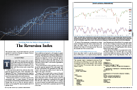
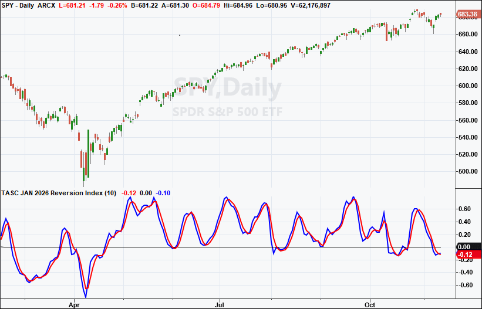
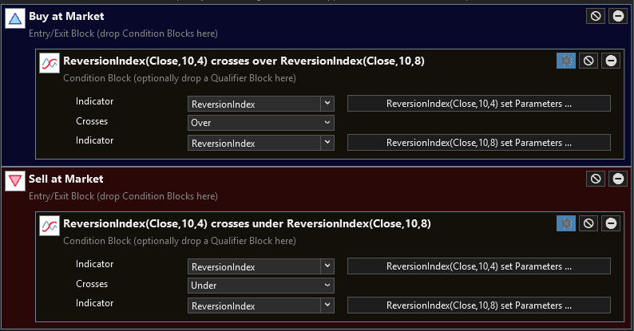
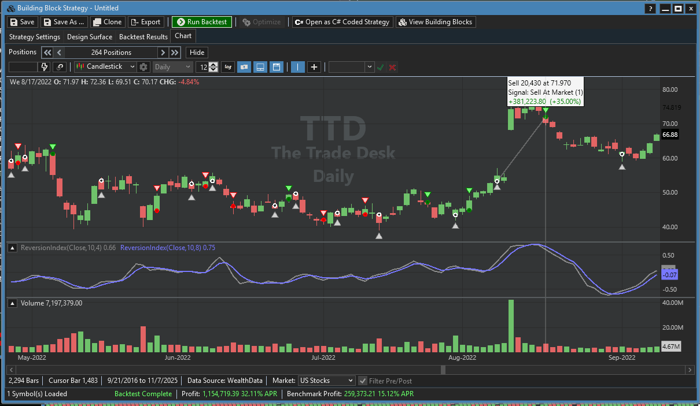
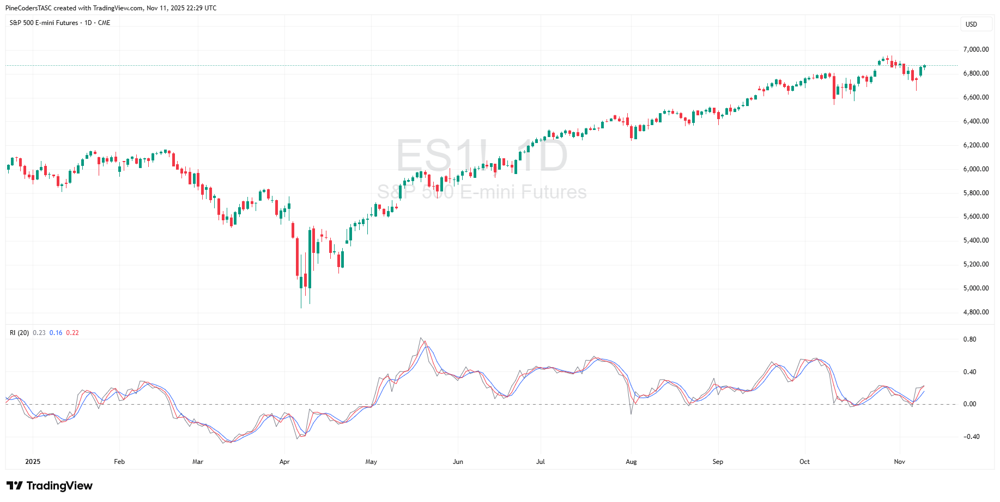
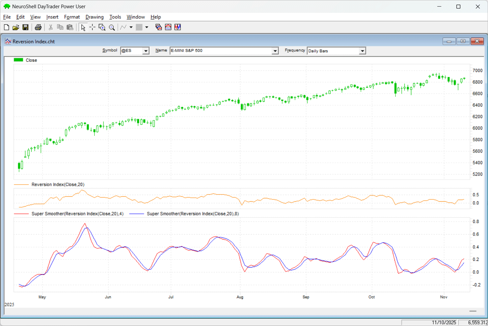
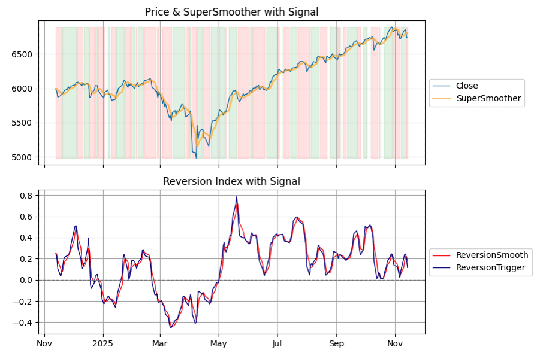
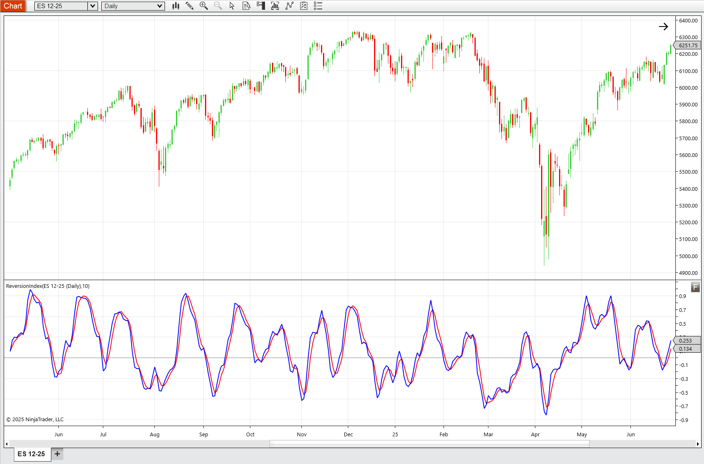

# Traders' Tips — January 2026

**Article:** "The Reversion Index" by John F. Ehlers  
**Source:** [Traders' Tips, TASC January 2026](https://traders.com/Documentation/FEEDbk_docs/2026/01/TradersTips.html)



For this month's Traders' Tips, the focus is John F. Ehlers' article in this issue, "The Reversion Index." Here, we present the January 2026 Traders' Tips code with possible implementations in various software.

---

## TradeStation

In John Ehlers' article in this issue, "The Reversion Index," he presents an indicator that produces timely buy and sell signals for mean-reversion strategies by summing bar-to-bar price changes and normalizing them by their absolute values. He explains that the summation should cover about half of the dominant cycle in the data, and that peaks and valleys are identified by the crossings of two SuperSmoother filters with different lengths. The reversion index is a normalized sum of price differences that oscillates between -1 and +1.

```easylanguage
Indicator: Reversion Index

{
	TASC APR 2026
	Reversion Index
	(C) 2005 John F. Ehlers
}

inputs:
	Length( 20 );
	
variables:
	DeltaSum( 0 ),
	AbsDeltaSum( 0 ),
	Count( 0 ),
	Ratio( 0 ),
	Smooth( 0 ),
	Trigger( 0 );

DeltaSum = 0;
AbsDeltaSum = 0;

for Count = 0 to Length - 1 
begin
	DeltaSum = DeltaSum + Close[Count] - Close[Count + 1];
	AbsDeltaSum = AbsDeltaSum + AbsValue( Close[Count] 
	 - Close[Count + 1] );
end;

if AbsDeltaSum <> 0 then 
	Ratio = DeltaSum / AbsDeltaSum;

Smooth = $SuperSmoother( Ratio, 8 );
Trigger = $SuperSmoother( Ratio, 4 );

Plot1( Smooth, "Smooth" );
Plot2( 0, "Zero" );
Plot3( Trigger, "Triger" );

Function: $SuperSmoother

{
	SuperSmoother Function
 	(C) 2025 John F. Ehlers
}

inputs:
	Price(numericseries),
	Period(numericsimple);

variables:
	a1( 0 ),
	b1( 0 ),
	c1( 0 ),
	c2( 0 ),
	c3( 0 );

a1 = ExpValue(-1.414 * 3.14159 / Period);
b1 = 2 * a1 * Cosine(1.414 * 180 / Period);
c2 = b1;
c3 = -a1 * a1;
c1 = 1 - c2 - c3;

if CurrentBar >= 4 then 
	$SuperSmoother = c1*(Price + Price[1]) / 2 
	 + c2 * $SuperSmoother[1] + c3 * $SuperSmoother[2];
if CurrentBar < 4 then 
	$SuperSmoother = Price;
```

**Code file:** [TradeStation_ReversionIndex.els](TradeStation_ReversionIndex.els)



**FIGURE 1: TRADESTATION.** This daily chart of the S&P 500 ETF SPY showing a portion of 2025 demonstrates the indicator applied with the length set to 10.

*—John Robinson, TradeStation Securities, Inc., [www.TradeStation.com](http://www.tradestation.com/)*

---

## Wealth-Lab

We added the reversion index, which is introduced in John Ehlers' article in this issue, to our TASC indicator library in WealthLab 8, so you can use it in drag-and-drop strategy development.

Our implementation has two parameters: a period with a default of 10, and a smoothing factor (internally using the SuperSmoother) with a default of 4.

We used our building block strategy designer to quickly mock up a strategy by dropping the *indicator crosses indicator* condition block onto the buy and sell blocks. (See Figure 2.) We set up the indicators to use the reversion index with a smoothing of 4 crossing over a reversion index with a smoothing of 8 for entries, and crossing under for exits.



**FIGURE 2: WEALTH-LAB.** Wealth-Lab's drag-and-drop building block feature is demonstrated to design a trading strategy based on the reversion index oscillator.

Figure 3 demonstrates the strategy applied to The Trade Desk (TTD), showing some representative trades. It appears to work very well on a volatile stock such as this one, capturing the upward moves while protecting from larger drawdowns.



**FIGURE 3: WEALTH-LAB.** The example strategy based on the reversion index is demonstrated on a chart of The Trade Desk (TTD).

*—Dion Kurczek, Wealth-Lab team, [www.wealth-lab.com](http://www.wealth-lab.com/)*

---

## TradingView

The TradingView Pine Script code presented here implements the reversion index as introduced by John Ehlers in his article in this issue, "The Reversion Index (Identifying Peaks And Valleys In Ranging Markets)."

```pine
//  TASC Issue: January 2026
//     Article: Identifying Peaks And Valleys In Ranging Markets
//              The Reversion Index
//  Article By: John F. Ehlers
//    Language: TradingView's Pine Script® v6
// Provided By: PineCoders, for tradingview.com

//@version=6
indicator('TASC 2026.01 The Reversion Index', 'RI', overlay = false)

//#region Inputs

int length = input.int(20)

//#endregion

//#region Functions

//===== Super Smoother Filter =====//
superSmoother(float Series, float Period) =>
    var float ALPHA =  math.pi * math.sqrt(2.0) / Period
    var float BETA  =  math.exp(-ALPHA )
    var float COEF2 = -math.pow(BETA, 2)
    var float COEF1 =  math.cos( ALPHA ) * 2.0 * BETA
    var float COEF0 =  1.0 - COEF1 - COEF2
    float sma2   = math.avg(Series, nz(Series[1], Series))
    float smooth = na, smooth := COEF0 *      sma2      +
                                 COEF1 *  nz(smooth[1]) +
                                 COEF2 *  nz(smooth[2])

reversionIndex (int length) =>
    float d = close - close[1]
    float ds = math.sum(d, length)
    float ads = math.sum(math.abs(d), length)
    float ratio = ads != 0.0 ? ds / ads : 0.0
    ratio

//#endregion

//#region Calculations

float ri = reversionIndex(length)
float sm = superSmoother(ri, 8)
float tr = superSmoother(ri, 4)

//#endregion

//#region Display

hline(0)
plot(ri, 'RI', color.gray)
plot(sm, 'Smooth', color.blue)
plot(tr, 'Trigger', color.red)

//#endregion
```

**Code file:** [TradingView_ReversionIndex.pine](TradingView_ReversionIndex.pine)

The indicator is available on TradingView from the PineCodersTASC account at: [https://www.tradingview.com/u/PineCodersTASC/#published-scripts](https://www.tradingview.com/u/PineCodersTASC/#published-scripts).



**FIGURE 4: TRADINGVIEW.** Here you see an example of the reversion index plotted on a chart of emini S&P 500 futures (ES).

*—PineCoders, for TradingView, [www.TradingView.com](http://www.tradingview.com/)*

---

## NeuroShell Trader

The reversion index introduced in John Ehlers' article in this issue can be easily implemented in NeuroShell Trader by selecting *new indicator* from the *insert* menu and using the indicator wizard to create the following indicators:

```
Reversion index: 
Divide(Sum(Momentum(Close,1),20),Sum(Abs(Momentum(Close,1)),20))

Smoothed:
Super Smoother( Reversion Index, 4)
Super Smoother( Reversion Index, 8)
```

Note that the SuperSmoother indicator being used here was created and described in earlier Traders' Tips (such as in the June 2025 and May 2021 issues). Users of NeuroShell Trader can go to the Stocks & Commodities section of the NeuroShell Trader free technical support website to download a copy of this or any previous Traders' Tips.



**FIGURE 5: NEUROSHELL TRADER.** This NeuroShell Trader chart demonstrates the reversion index on a chart of emini S&P 500 futures (ES) along with its SuperSmoother filtered version.

*—Ward Systems Group, Inc., sales@wardsystems.com, [www.neuroshell.com](http://www.neuroshell.com/)*

---

## Python

Following is Python code to implement concepts described in John Ehlers' article in this issue, "The Reversion Index."

```python
"""
Written By: Rajeev Jain, jainraje@yahoo.com

Python code to implement concepts in Technical Analysis of S&C Magazine 
January 2026 article "The Reversion Index" by John F Ehlers. This python 
code is provided for TraderTips section of the magazine.

2025-11-12  Initial implementation
2025-11-14  Uploaded to github

https://github.com/jainraje/TraderTipArticles/

"""

# Import required python libraries

# %matplotlib inline

import pandas as pd
import numpy as np
import yfinance as yf
import math
import datetime as dt
import matplotlib.pyplot as plt


# Use Yahoo Finance python package to obtain OHLCV data for desired instrument.

symbol = '^GSPC'
start = "2023-11-13"
end = dt.datetime.now().strftime('%Y-%m-%d') 
end = '2025-11-15'
ohlcv = yf.download(
    symbol, 
    start, 
    end,
    group_by="Ticker",  
    auto_adjust=True
)
ohlcv = ohlcv[symbol]
ohlcv


# three functions to implement concepts: 1) super_smoother 2) reversion_index 
# and 3) plot_reversion_index to plot relevant signals

def super_smoother(price: pd.Series, period: float) -> pd.Series:
    """
    Vectorized Ehlers SuperSmoother filter (© John F. Ehlers)
    """
    q = np.exp(-1.414 * np.pi / period)
    c1 = 2 * q * np.cos(np.radians(1.414 * 180 / period))
    c2 = q * q
    a0 = (1 - c1 + c2) / 2

    price_vals = price.to_numpy()
    out_values = np.zeros_like(price_vals)
    
    # Initialize first four values to the original price
    out_values[:4] = price_vals[:4]

    # Apply recursive filter from index 4 onward
    for i in range(4, len(price_vals)):
        out_values[i] = a0 * (price_vals[i] + price_vals[i-1]) + c1 * out_values[i-1] - c2 * out_values[i-2]

    return pd.Series(out_values, index=price.index)


def reversion_index(close: pd.Series, length: int = 20) -> pd.DataFrame:
    """
    Ehlers Reversion Index (© 2025 John F. Ehlers)
    """
    close = close.astype(float)
    
    # Delta: change from previous bar
    delta = close.diff().fillna(0)
    
    # Rolling sums of delta and absolute delta
    delta_sum = delta.rolling(window=length, min_periods=1).sum()
    abs_delta_sum = delta.abs().rolling(window=length, min_periods=1).sum()
    
    # Ratio: safely avoid division by zero
    ratio = delta_sum / abs_delta_sum.replace(0, np.nan)
    ratio = ratio.fillna(0)
    
    # Smooth and trigger lines
    smooth = super_smoother(ratio, period=8)
    trigger = super_smoother(ratio, period=4)
    
    return pd.DataFrame({
        'ReversionSmooth': smooth,
        'ReversionTrigger': trigger
    }, index=close.index)


def plot_reversion_index(df):
    
    import matplotlib.pyplot as plt
    import matplotlib.dates as mdates
    
    fig, (ax1, ax2) = plt.subplots(2, 1, figsize=(12, 9), sharex=True, gridspec_kw={'height_ratios':[2,2]})
    
    # ----- Top: Price & SuperSmoother -----
    ax1.plot(df.index, df['Close'], label='Close', linewidth=1)
    ax1.plot(df.index, df['SuperSmoother'], label='SuperSmoother', linewidth=2, alpha=0.6, color='orange')
    
    # Shading for bullish/bearish signals
    ax1.fill_between(df.index, df['Close'].min(), df['Close'].max(), 
                     where=df['Signal'] == 1, color='green', alpha=0.1)
    ax1.fill_between(df.index, df['Close'].min(), df['Close'].max(), 
                     where=df['Signal'] == -1, color='red', alpha=0.1)
    
    ax1.set_title('Price & SuperSmoother with Signal')
    ax1.grid(True)
    ax1.legend(loc='center left', bbox_to_anchor=(1, 0.5))
    
    # ----- Bottom: ReversionSmooth & ReversionTrigger -----
    ax2.plot(df.index, df['ReversionSmooth'], label='ReversionSmooth', linewidth=1, color='red')
    ax2.plot(df.index, df['ReversionTrigger'], label='ReversionTrigger', linewidth=1, color='darkblue')
    ax2.axhline(0, color='gray', linestyle='--', linewidth=1)
    
    ax2.set_title('Reversion Index with Signal')
    ax2.grid(True)
    ax2.legend(loc='center left', bbox_to_anchor=(1, 0.5))
    
    # ----- Improve date formatting -----
    ax2.xaxis.set_major_locator(mdates.AutoDateLocator())
    ax2.xaxis.set_major_formatter(mdates.ConciseDateFormatter(mdates.AutoDateLocator()))
    plt.setp(ax2.get_xticklabels(), rotation=0, ha='center')
    
    plt.tight_layout()
    plt.show()
	

# Call functions to run required calculations.
df = ohlcv.copy()
df['SuperSmoother'] = super_smoother(df['Close'], period=10)
df = df.join(reversion_index(df['Close'], length=20))
df['Signal'] = np.where(df['ReversionTrigger'] > df['ReversionSmooth'], 1, -1)
plot_reversion_index(df[-252:])
```

**Code file:** [Python_ReversionIndex.py](Python_ReversionIndex.py)

The top plot in Figure 6 shows an example of the SuperSmoother and its signals superimposed on price; the red and green vertical shading highlights when buy and sell signals are active. The bottom chart plots the reversion index along with its smoothed version.



**FIGURE 6: PYTHON.** The SuperSmoother is plotted along with price. The red and green vertical shading highlights when buy and sell signals are active (top). The reversion index and its smoothed version are demonstrated (bottom).

*—Rajeev Jain, jainraje@yahoo.com*

---

## NinjaTrader

In "The Reversion Index (Identifying Peaks And Valleys In Ranging Markets)" in this issue, John Ehlers introduces an indicator he designed for use with mean-reversion strategies.

The indicator is available for download at the following link for NinjaTrader 8:

- **NinjaTrader 8:** [ninjatrader.com/SC/January2026SCNT8.zip](https://ninjatrader.com/SC/January2026SCNT8.zip)

Once the file is downloaded, you can import it into NinjaTrader 8 from within the control center by selecting Tools → Import → NinjaScript Add-On and then selecting the downloaded file for NinjaTrader 8.

You can review the source code in NinjaTrader 8 by selecting New → NinjaScript Editor → Indicators from within the control center window and selecting the file.



**FIGURE 7: NINJATRADER.** The reversion index is demonstrated on a daily chart of emini S&P 500 futures (ES) over about a one-year period.

*—Helom, NinjaTrader, LLC, [www.ninjatrader.com](http://www.ninjatrader.com/)*

---

## References

```bibtex
@article{ehlers2026reversionindex,
  author  = {John F. Ehlers},
  title   = {The Reversion Index},
  journal = {Technical Analysis of Stocks \& Commodities},
  year    = {2026},
  month   = {January},
  volume  = {44},
  number  = {1},
  url     = {https://traders.com/Documentation/FEEDbk_docs/2026/01/TradersTips.html}
}
```

---

*Originally published in the January 2026 issue of Technical Analysis of Stocks & Commodities magazine. All rights reserved. © Copyright 2025, Technical Analysis, Inc.*
