# Introducing SwamiCharts

**By John Ehlers**

- **Downloaded from:** [Mesa Software — SwamiCharts](https://www.mesasoftware.com/papers/SwamiCharts.ppt)

---

## Slide 1. Not Rocket Science – An Intuitive New Display


## Slide 2. SwamiCharts Overview

- Welles Wilder published the RSI in 1978 using a 14 period lookback period
- I started on a decades-long research to find the correct lookback period for indicators
  - MESA measures the dominant cycle
- I have now discovered a new display technique that lets you see the results of all lookback periods at a glance
  - Enables easy cross-indicator correlation (price / volume)
- This new display has also spawned new indicators
  - Relative Performance – Useful for sector rotation
  - Convolution – Conclusively isolates turning points
  - Market Mode – Identifies Trends and Swing conditions
  - Swing Wave – View the complex price wave structure

## Slide 3. SwamiCharts Structure

- SwamiCharts are placed in subgraphs below the price chart
  - The indicators are in time sync with prices
- SwamiChart vertical scales are the lookback periods of the indicators
- Colors represent indicator values over the range of time and lookback periods. Generally:
  - Green represents increasing values
  - Red represents decreasing values
  - Yellow represents intermediate values
- Some SwamiChart indicators have contrasting hues to maximize interpretation

## Slide 4. Standard Indicators are Confusing

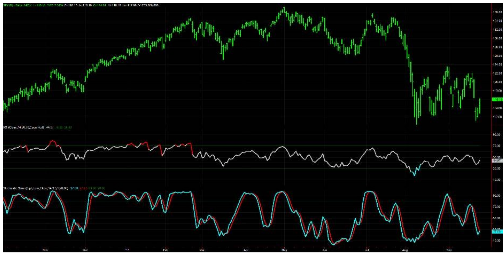

## Slide 5. SwamiChart Indicators Give a Clear Interpretation

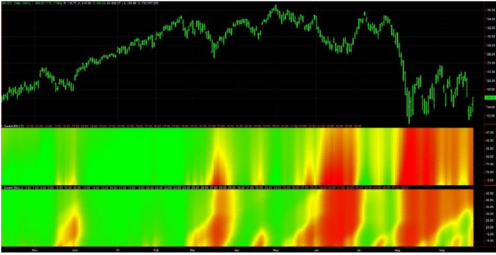

## Slide 6. SwamiCharts Predict is Superior to the Classic Stochastic

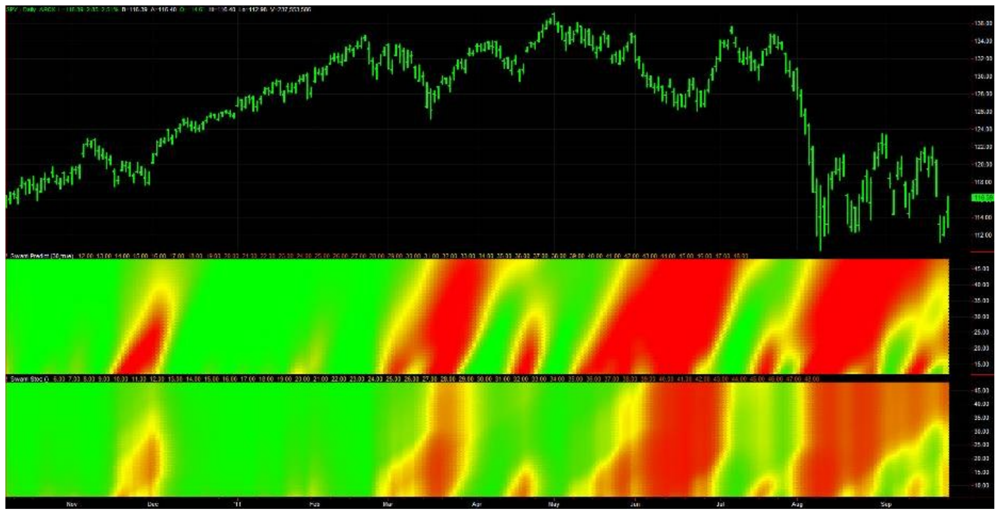

## Slide 7. SwamiCharts Predict & Volume Enable Easy Indicator Correlation

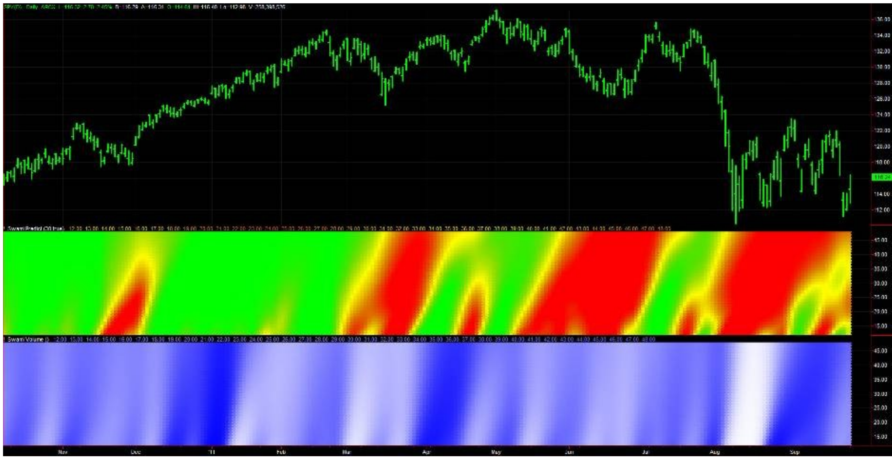

## Slide 8. SwamiCharts Accumulation/Distribution Combines Price and Volume Movements

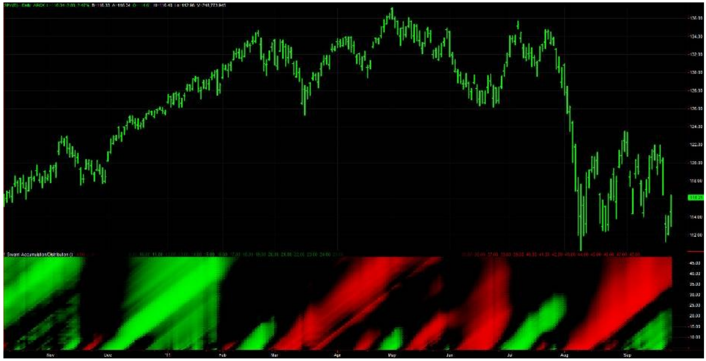

## Slide 9. SwamiCharts Relative Performance Is Useful for Sector Rotation

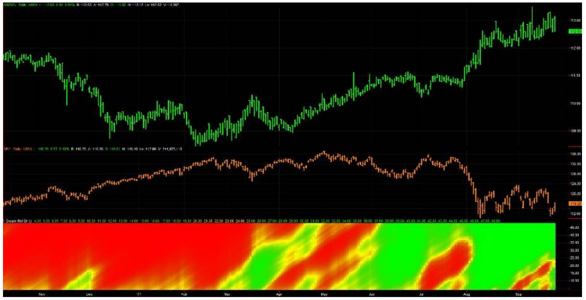

## Slide 10. SwamiCharts Swing Wave Clarifies Complex Market Waves

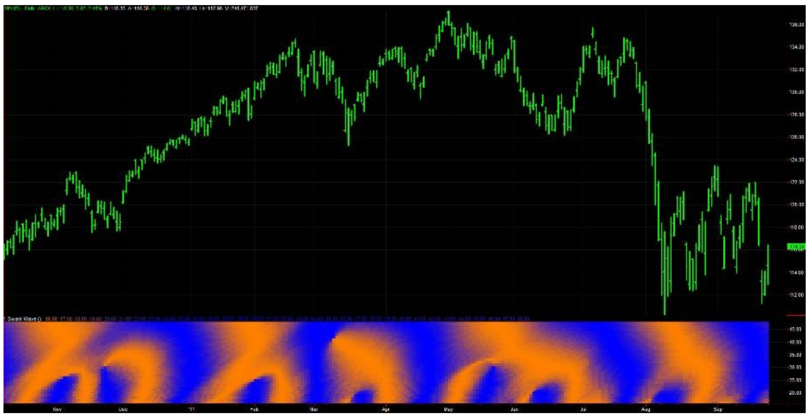

## Slide 11. Wave Motion Does Not Consider Trends – Trend Slopes Can Swamp Swings

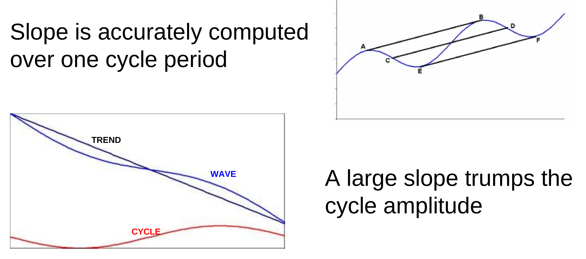

- Slope is accurately computed over one cycle period
- A large slope trumps the cycle amplitude
- Conclusion – Don't swing trade if the trend slope exceeds the peak-to-peak swing over the cycle period

## Slide 12. SwamiCharts Market Mode Identifies Trends Up/Down & Cycle Modes

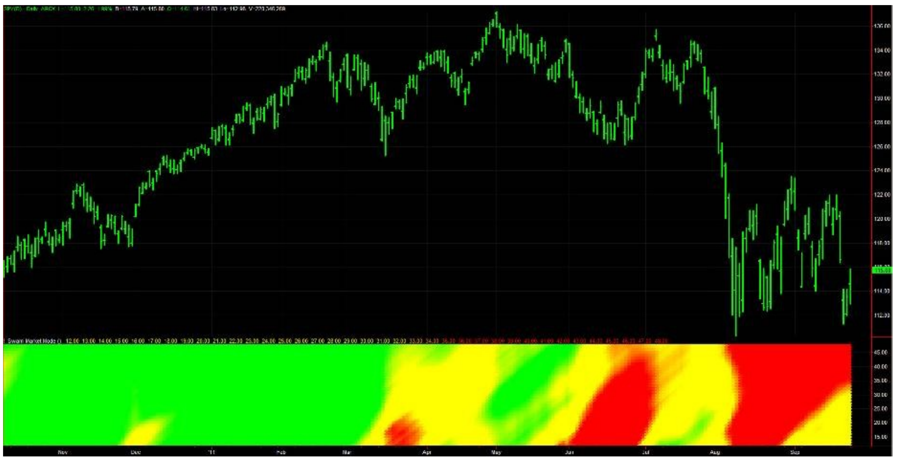

## Slide 13. Convolution Means "Folding"

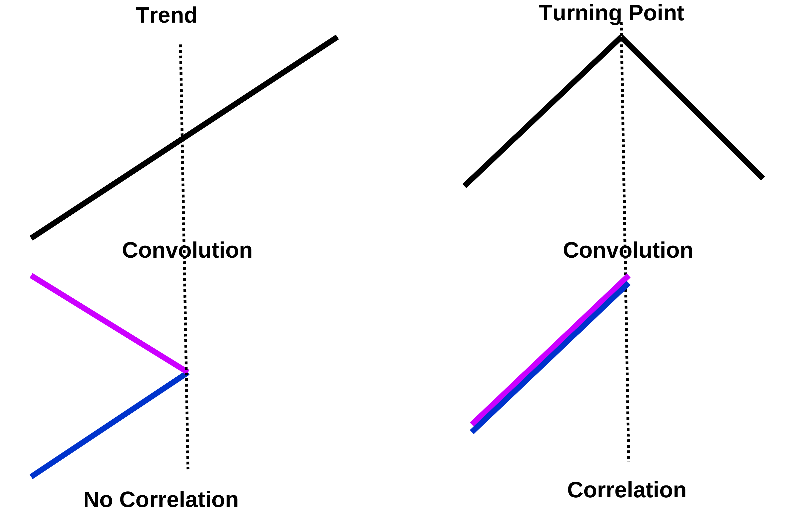

- Trend: No Correlation
- Turning Point: Correlation

## Slide 14. SwamiCharts Convolution Pinpoints Major Turning Points

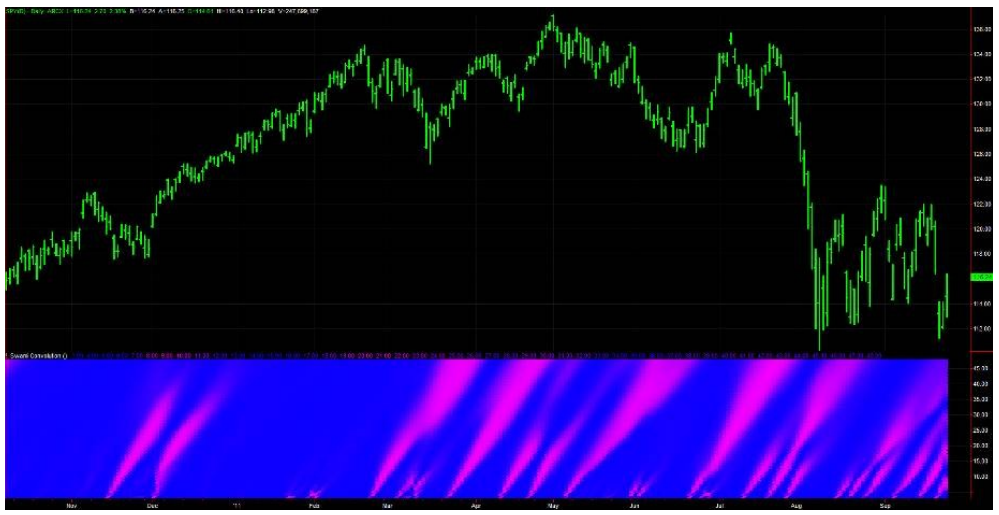

## Slide 15. SwamiCharts Classic Package (FREE)

Available on TradeStation Network – Search "SwamiCharts" or "John Ehlers"

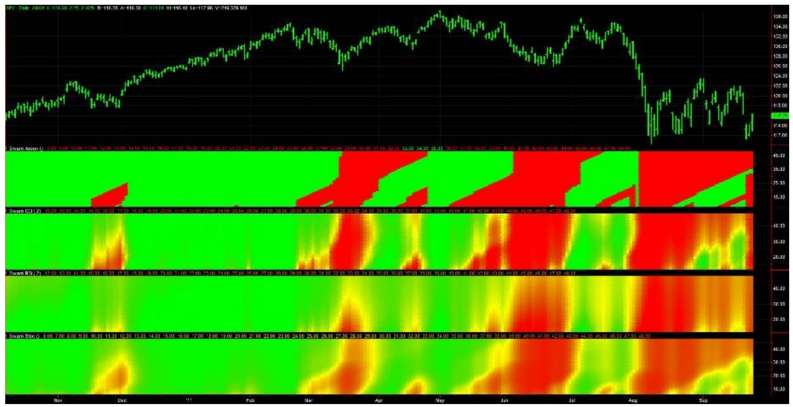

## Slide 16. SwamiCharts Essentials Package – $35 / Month

Available on TradeStation Network – Search "SwamiCharts" or "John Ehlers"

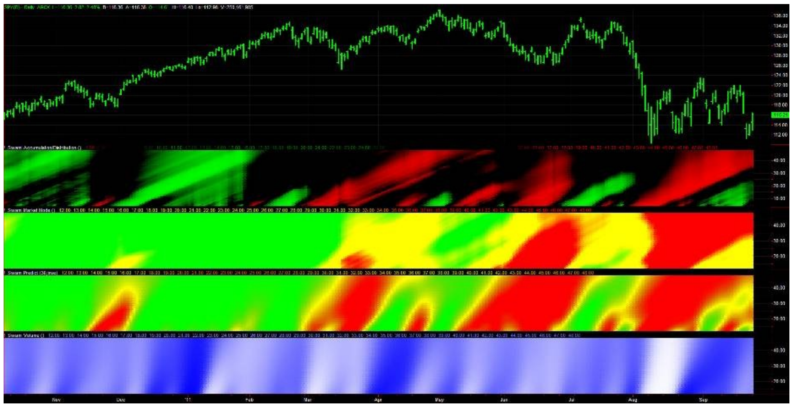

## Slide 17. SwamiCharts Advanced Package – $50 / Month

Available on TradeStation Network – Search "SwamiCharts" or "John Ehlers"

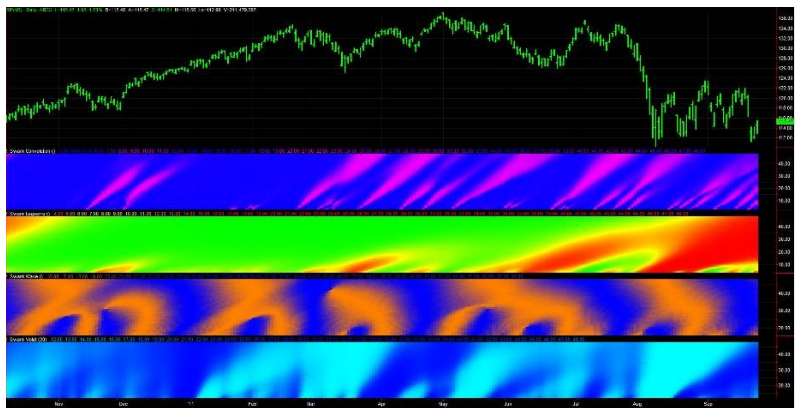

## Slide 18. SwamiCharts Intraday Package – $75 / Month

Available on TradeStation Network – Search "SwamiCharts" or "John Ehlers"

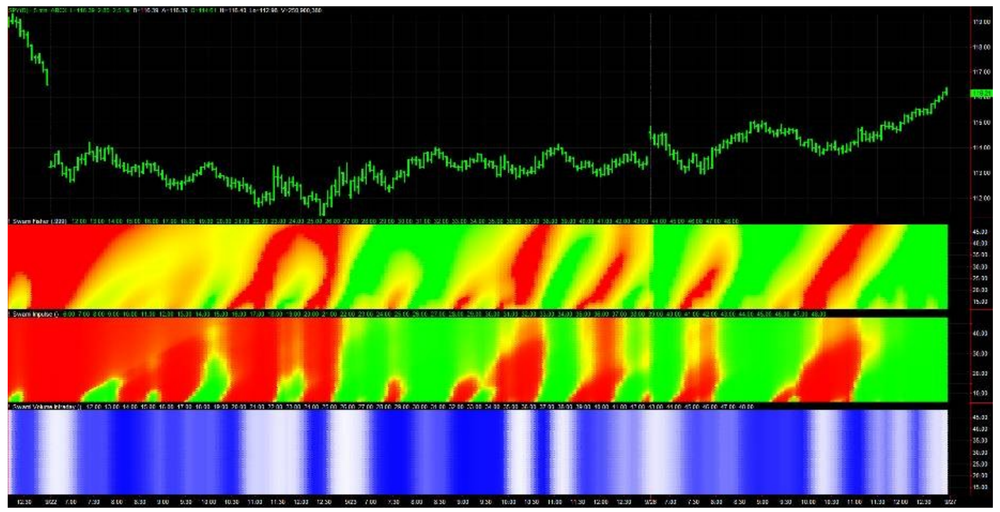

## Slide 19. Your Portal to a New Trading Dimension


---

## BibTeX

```bibtex
@misc{ehlers_swamicharts,
  author       = {John F. Ehlers},
  title        = {Introducing SwamiCharts},
  year         = {2012},
  howpublished = {online},
  url          = {https://www.mesasoftware.com/papers/SwamiCharts.ppt}
}
```
