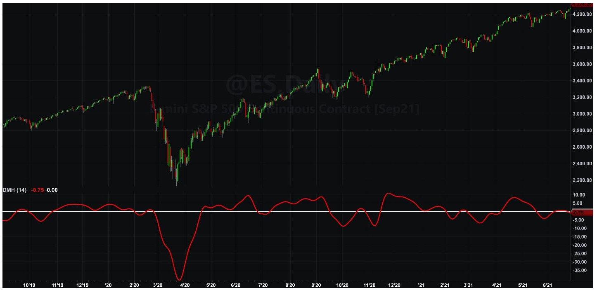

# DMH – An Improved Directional Movement Indicator

**By John Ehlers**

- **Downloaded from:** [Mesa Software — DMH](https://www.mesasoftware.com/papers/DMH.pdf)

---

I hardly know where to start. Directional Movement[^1] has been part of Technical Analysis for five decades, invented using pencil and paper for its calculations. Seriously! Check out the worksheets in Wilder's book. The book can be downloaded from the internet for free. Directional Movement is actually a pretty good indicator, but it carries a lot of baggage due to the available technology at the time it was created. It is time to freshen it up for use in modern algorithmic trading.

The basic idea of Directional Movement is that the summation of changes in Highs will be greater than the summation of changes in Lows in an uptrend. Conversely, the summation of the changes in the Lows will be greater than the summation of the Highs in a downtrend. The crossovers of the two summations are the timing signals.

The original Directional Movement used ATR (Average True Range) as a scaling factor. ATR scaled both the summation of the Highs and the summation of the Lows, so it had no impact on the timing signals. Moreover, the classic DMI was formed as a ratio, so that ATR algebraically drops out altogether. So, we can dispense with the use of ATR when computing a modern version of Directional Movement.

Not using a scaling function means that Directional Movement is just the differences of the two summations. The Directional Movement rules allow only the selection of the changes in the Highs or only the selection of the changes of the Lows on a given bar, but not both. Further, an inside day precludes the selection of either. The result is that the Directional Movements are a series of relatively sparsely populated spikes. A more nearly continuous function is created by summing the movements in an Exponential Moving Average. I showed[^2] that Moving Averages are not particularly good filters and that filtering can be substantially improved using Hann Window coefficients with summation over the analysis period. I therefore propose DMH (Directional Movement using Hann Windows) as the modern version of Directional Movement because it can easily be calculated by computers.

The DMH calculation is given in Code Listing 1. The computation starts with the classic definition of PlusDM and MinusDM. These Directional Movements are summed in an Exponential Moving Average (EMA). Then, this EMA is further smoothed in an FIR filter using Hann Window coefficients over the calculation period.

The zero crossings of this indicator are the original timing signals according to Wilder. However, these zero crossings have substantial lag. In my opinion, better timing signals are the peaks and valleys of the indicator. The peaks and valleys of the indicator can be identified by noting when the rate of change of the indicator is zero. In other words, a valley occurs when the one bar difference of the indicator crosses over zero and a peak occurs when the one bar difference of the indicator crosses under zero. While the default indicator length is Wilder's 14 bars, I think the length for the indicator is left to the discretion of the trader or can be determined by optimization if the DMH is used in a strategy.

Figure 1 is an example of DMH applied to the emini S&P continuous Futures contract.


**Figure 1. DMH Indicator Zero Crossings Reflect Changes in the Trend**

## Code Listing 1. DMH Indicator

```easylanguage
{
DMH - Directional Movement using Hann Windowing
(C) 2021 John F. Ehlers
}
Inputs:
Length(14);

Vars:
SF(0), PlusDM(0), MinusDM(0),
UpperMove(0), LowerMove(0), EMA(0),
DMSum(0), coef(0), count(0), DMH(0);

SF = 1 / Length;

UpperMove = High - High[1];
LowerMove = Low[1] - Low;

PlusDM = 0;
MinusDM = 0;
If UpperMove > LowerMove and UpperMove > 0 Then
    PlusDM = UpperMove
Else If LowerMove > UpperMove and LowerMove > 0 Then
    MinusDM = LowerMove;

EMA = SF*(PlusDM - MinusDM) + (1 - SF)*EMA[1];

//Smooth Directional Movements with Hann Windowed FIR filter
DMSum = 0;
coef = 0;
For count = 1 to Length Begin
    DMSum = DMSum + (1 - Cosine(360*count / (Length + 1)))*EMA[count - 1];
    coef = coef + (1 - Cosine(360*count / (Length + 1)));
End;
If coef <> 0 Then DMH = DMSum / coef;

Plot1(DMH, "", red, 4, 4);
Plot2(0, "", white, 1, 1);
```

---

## BibTeX

```bibtex
@misc{ehlers_dmh,
  author       = {John F. Ehlers},
  title        = {DMH -- An Improved Directional Movement Indicator},
  year         = {2021},
  howpublished = {online},
  url          = {https://www.mesasoftware.com/papers/DMH.pdf}
}
```

[^1]: J. Welles Wilder, Jr., "New Concepts in Technical Trading Systems", Trend Research, 1978
[^2]: John Ehlers, "Windowing", *Stocks & Commodities*
