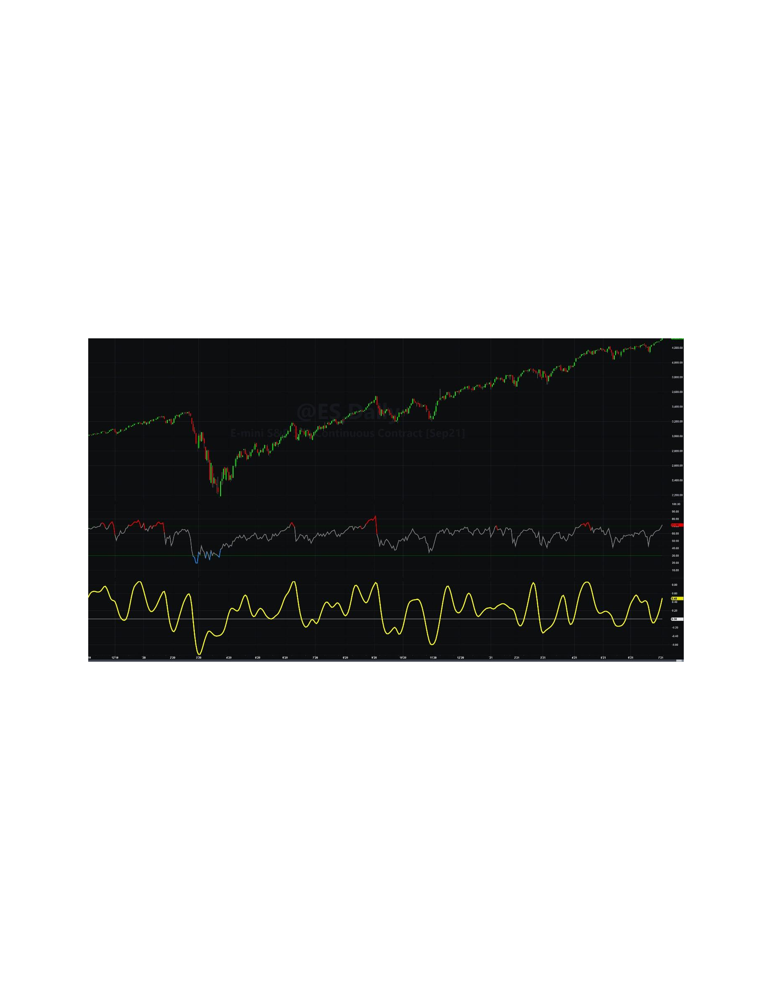

# (Yet Another) Improved RSI

**By John Ehlers**

- **Downloaded from:** [Mesa Software — Improved RSI](https://www.mesasoftware.com/papers/RSI.pdf)

---

When I started trading I questioned why 14 days were used in the calculation of the RSI. My broker said "Because Welles Wilder said so." Well, that response was certainly unsatisfying to this engineer, and it set me on my lifelong quest to establish rationale in the design of indicators and a scientific approach to trading strategies. After all my research, it is now time to close the loop and describe the best RSI I can create.

The RSI starts with the concept of "Closes Up" and "Closes Down". Closes Up is when the sum of the differences of the close of the current bar is higher than the close of the previous bar, otherwise the difference is ignored. Similarly, Closes Down is when the sum of the differences of the close of the previous bar is higher than the close of the current bar, otherwise the difference is ignored. The notation CU and CD means the summation over the observation period of the indicator. In other words, CU and CD are FIR type filters similar to simple moving averages. Relative Strength is a function of the ratio of CU to CD. Just to be clear, the RSI is not limited to closing prices. Any time series data can be used because "Closes Up" is just a notation. The classic RSI is defined as:

$$
RSI=100-\frac{100}{1+RS}\ \ where RS=\frac{CU}{CD}
$$

Let's simplify the classic definition by ignoring the 100 scale factor and making the substitution for RS. The algebra gives us this simplification:

$$
RSI=1-\frac{1}{1+\frac{CU}{CD}}=1-\frac{CD}{CU+CD}=\frac{CU+CD-CD}{CU+CD}=\frac{CU}{CU+CD}
$$

Now, it is easy to see that the RSI swings from 0, when there are no "Closes Up" to 1, when there are no "Closes Down". At this point I would like to depart from the classic RSI because I prefer oscillator-type indicators to have a zero mean. We can achieve this simply by multiplying the classic RSI by two, so it swings from 0 to 2, and then subtract 1 from the product so the indicator swings from -1 to +1. When we do this, the algebra gives us a new indicator as:
$$
RSI=\frac{2\cdot CU}{CU+CD}-1=\frac{2\cdot CU-CU-CD}{CU+CD}
$$
$$
RSI=\frac{CU-CD}{CU+CD}
$$

Again, CU and CD are basically Simple Moving Averages. I have previously shown[^1] that Simple Moving Averages are not very good filters and the results of FIR filters can be improved through the use of Hann Windows. Using Hann Windows eliminates the need for additional filtering of the RSI because the smoothing is native to the computation itself.

I call my improved RSIH. It is simply the classic RSI dilated and translated to swing from -1 to +1 with Hann windows used to compute CU and CD. The EasyLanguage code for the improved RSI is given in Code Listing 1.

The classic RSI and the improved RSIH are shown by comparison in Figure 1. The classic RSI is shown in the first subgraph and the RSIH is shown in the second subgraph in yellow. The length parameter input in both cases is 14. Bear in mind that 14 may not be the best analysis length. The RSI reaches its peak when there are no "Closes Down". This is from the cycle valley to the cycle peak of a theoretical sine wave. Thus, the correct RSI analysis length is half the dominant cycle period in the data. The Hann windowing requires that the window length be longer to get the equivalent amount of smoothing of a simple average. So, the best length to use for an RSIH indicator is on the order of the dominant cycle period in the data.


**Figure 1. RSIH Has a Zero Mean and is Smoother Than a Classic RSI**

## Code Listing 1. Improved RSI Code

```easylanguage
{
RSIH - RSI with Hann Windowing
(C) 2005-2021 John F. Ehlers
}
Inputs:
RSILength(14);

Vars:
count(0),
CU(0),
CD(0),
RSIH(0);

//Accumulate "Closes Up" and "Closes Down"
CU = 0;
CD = 0;
For count = 1 to RSILength Begin
    If Close[count - 1] - Close[count] > 0 Then
        CU = CU + (1 - Cosine(360*count / (RSILength + 1)))*(Close[count - 1] - Close[count]);
    If Close[count] - Close[count - 1] > 0 Then
        CD = CD + (1 - Cosine(360*count / (RSILength + 1)))*(Close[count] - Close[count - 1]);
End;
If CU + CD <> 0 Then RSIH = (CU - CD) / (CU + CD);

Plot1(RSIH, "", red, 4, 4);
Plot2(0, "", white, 1, 1);
```

---

## BibTeX

```bibtex
@misc{ehlers_improved_rsi,
  author       = {John F. Ehlers},
  title        = {(Yet Another) Improved RSI},
  year         = {2022},
  howpublished = {online},
  url          = {https://www.mesasoftware.com/papers/RSI.pdf}
}
```

[^1]: John Ehlers, "Windowing", *Stocks & Commodities*
