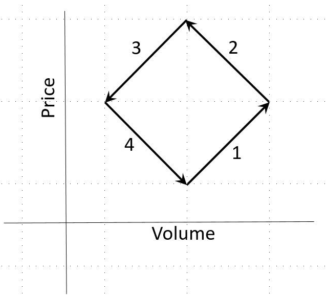
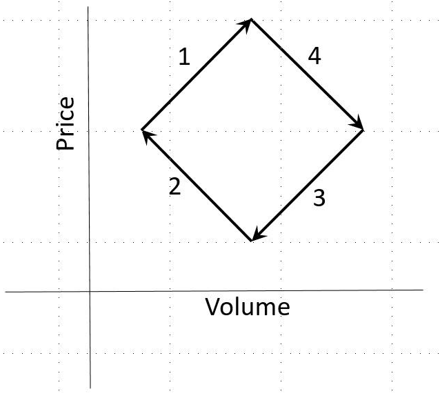
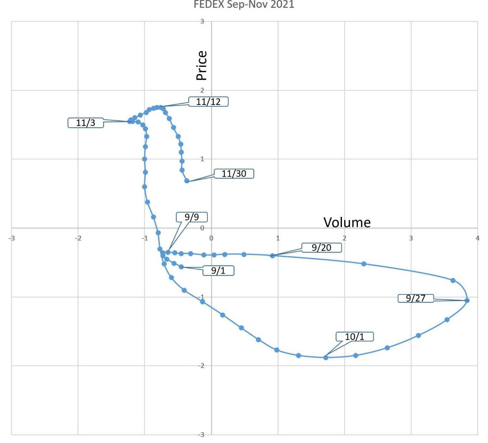

# Ehlers Loops

**By John Ehlers**

- **Downloaded from:** [Mesa Software — Ehlers Loops](https://www.mesasoftware.com/papers/EHLERS%20LOOPS.pdf)

---

"Volume leads price" is a philosophical dogma that has been part of technical analysis forever. In this article we will examine the relationship between volume and price of a stock to see if there is any predictive value gained by including volume in our analysis.

I, frankly, have had a hard time seeing a relationship between volume and price. Perhaps that is because I have been primarily a Commodity and Futures trader, and Futures are used for hedging as well as speculation. Or, perhaps, it is because I have seen a greater correlation on the price of intraday Futures to time of day rather than volume. Ben Crocker invented Crocker Charts[^1] in the 1950s to try to make some sense of volume-price relationships. These charts plotted price on the vertical axis versus volume on the horizontal axis, and the points were connected as a function of time. The result was a jumble of scratches that have been described like a child's Etch-a-Sketch. However, the charts often resembled a jumbled pile of pick-up-sticks and were difficult to interpret. Crocker Charts never became popular because of their interpretation difficulty.

There are many mind-numbing descriptions of the relationships between volume and price. Most descriptions follow the principles of supply and demand, and many of the descriptions are contradictory. There are four conditions where there is general agreement. These are:

1. Increasing volume and increasing price is bullish. Generally, this is considered a trend continuation condition. Plotted as price versus volume, this would be a vector from lower left to upper right.
2. Decreasing volume and increasing price is bearish. This is generally considered an extinguishing of demand. Plotted as price versus volume, this would be a vector from lower right to upper left.
3. Decreasing volume and decreasing price is bullish. This is generally considered an extinguishing of supply. Plotted as price versus volume, this would be a vector from upper right to lower left – exactly the opposite of the condition above.
4. Increasing volume and decreasing price is bearish. This is generally considered a continuation of a downtrend. Plotted as price versus volume, this would be a vector from upper left to lower right.

I don't necessarily ascribe to the rationale, but if these conditions are plotted sequentially 1-2-3-4 in a Crocker Chart as a bull-bear type of cycle, the plot would be a diamond that has a counterclockwise rotation as a function of time as shown in Figure 1. On the other hand, if the bull-bear cycle is plotted in the 1-4-3-2 vector sequence, the plot would be a diamond that has a clockwise rotation as a function of time, as shown in Figure 2. These directions of rotation are easily discernable, and further, their motion is a predictor of future prices. The problem is that the jumbled Crocker Charts are hard to read.


**Figure 1. A 1-2-3-4 Bull-Bear Sequence Plots as a Counterclockwise Diamond**


**Figure 2. A 1-4-3-2 Bull-Bear Sequence Plots as a Clockwise Diamond**

Modern computer technology and DSP make volume-price charts easy to read and enable these charts to be predictive of future prices. First, both price and volume are filtered to be band limited signals (oscillators having a nominal zero mean). This is done by limiting the spectral content by filtering in a roofing filter. The roofing filter is comprised of a High Pass filter[^2] and a Low Pass SuperSmoother filter[^3]. The High Pass filter conceptually eliminates all spectrum components whose wavelengths are longer than HPPeriod and passes all spectrum components whose wavelengths are shorter than HPPeriod. The Low Pass SuperSmoother filter conceptually passes all spectrum components whose wavelengths are longer than LPPeriod and eliminates all spectrum components whose wavelength are shorter than LPPeriod. The result is a relatively wide bandwidth carrying the desired data wavelengths appropriate for trading.

The price and volume filtered data are both scaled in terms of Standard Deviations by dividing each by their respective RMS values. The resultant price-volume plots are Ehlers Loops where the trader can trace the history of their relationship and can extend the direction of the plots to form a prediction. Since both price and volume are plotted in Standard Deviations, the plots are consistently interpreted when the trader moves from one symbol to another. It is worthy of note there is a 68% probability of reversal at one Standard Deviation, 95% probability of reversal at two Standard Deviations, and a 99.7% probability of reversal at three Standard Deviations. Recognizing these probabilities will help you predict upcoming reversals in either volume or price.

Ehlers Loops are best explained by example. Figure 3 shows the progress of the price-volume Ehlers Loops of FEDEX for three months in 2021. The LPPeriod was set to 10 to obtain minimum lag with just a little smoothing. The HPPeriod was set to 125 (a half year) to capture the longer term moves. The loop plot starts on September 1. By September 9 there was a sharp volume reversal, starting a clockwise loop. However there was no clear price direction. By September 20 the clockwise rotation continued, giving a bearish outlook. By September 27 the volume reverses at a value over 3 Standard Deviations. But the clockwise rotation continues, signaling a continued bearish outlook. By October 1, prices were near negative two Standard Deviations, giving a bullish outlook because of the continued clockwise rotation. Prices did, indeed, increase through October.

But by 3 November there was a small whifferdill where a counterclockwise rotation had started. This put up flags that a price top was in the near future. However, the clockwise rotation resumed, giving a bearish outlook on 12 November. Indeed, prices continued to fall through the rest of November.

From this brief description, and by comparing the Ehlers Loop to the actual FEDEX prices for the three month period, you can see that the Ehlers Loop is predictive of future prices.


**Figure 3. Three Month Ehlers Loop for FEDEX is Predictive of Future Prices**

Ehlers Loops are created by first filtering, scaling, and plotting price and volume as conventional indicators. In addition, the date of each data point, the price, and the volume are output to text file. That text file is then read by Excel. The volume and price in columns B and C, respectively, are then plotted as a scatter plot for the selected time span. The appearance of the Ehlers Loops can be altered by changing the LPPeriod and HPPeriod input parameters. If the difference between the two inputs is large, then a wide range of data cycle components are included in the analysis. This can result in whifferdills in the loops because of the multiple frequencies in the data. This effect can be reduced by reducing the difference between HPPeriod and LPPeriod. I suggest making the difference more than 20 percent of their average value because a too-narrow bandwidth can cause "tunnel vision" at a single component of the spectrum. Reducing the value of LPPeriod reduces the lag of the indicator, but it also reduces its smoothness. Increasing the value of HPPeriod includes more of the longer wavelength trending components.

The values of HPPeriod and LPPeriod can be customized to your trading style. For example, if your desired holding time for a trade position is 20 days (about one month) you would want the average of HPPeriod and LPPeriod to be about 40 bars. That is because the time between a 40 bar cycle valley and its peak is 20 bars. 20% of 40 bars is 8 bars, so setting LPPeriod to 35 and HPPeriod to 45 is in the right ballpark for your trading style.

The code to generate the Ehlers Loops is described with reference to Code Listing 1. After declaration of variables the coefficients for the HighPass and SuperSmoother filters are calculated only on the first bar of data for computational efficiency. Then, both Price and Volume are filtered individually in identical filters. As a result, both are band limited signals having a nominal zero mean. Their RMS (Root Mean Square) values are computed as EMAs of their squares, and the EMA coefficient of 0.0242 corresponds to a critical period of one year. Dividing each by their RMS values scales them to both be plotted in terms of Standard Deviations.

The filtered and scaled values of Volume and Price are conventionally plotted. In addition, their values are exported to a text file so that the Ehlers Loops can be plotted using Excel. Several precautions regarding the text file should be taken. First, your computer must have a C:\Temp folder to contain the exported text file. Secondly, the Excel file cannot be open during live trading because trying to write to an open file will crash the indicator.

## Code Listing 1. Ehlers Loops EasyLanguage Code

```easylanguage
{
Ehlers Loops
(C) 2005-2021 John F. Ehlers
}
Inputs:
LPPeriod(20),
HPPeriod(125);

Vars:
hpa1(0),
hpb1(0),
hpc1(0),
hpc2(0),
hpc3(0),
ssa1(0),
ssb1(0),
ssc1(0),
ssc2(0),
ssc3(0),
HP(0), VolHP(0),
Price(0), PriceMS(0), PriceRMS(0),
Vol(0), VolMS(0), VolRMS(0);

If CurrentBar = 1 Then Begin
    hpa1 = expvalue(-1.414*3.14159 / HPPeriod);
    hpb1 = 2*hpa1*Cosine(1.414*180 / HPPeriod);
    hpc2 = hpb1;
    hpc3 = -hpa1*hpa1;
    hpc1 = (1 + hpc2 - hpc3) / 4;

    ssa1 = expvalue(-1.414*3.14159 / LPPeriod);
    ssb1 = 2*ssa1*Cosine(1.414*180 / LPPeriod);
    ssc2 = ssb1;
    ssc3 = -ssa1*ssa1;
    ssc1 = 1 - ssc2 - ssc3;
End;

//Normalized Roofing Filter for Price
// 2 Pole Butterworth Highpass Filter
HP = hpc1*(Close - 2*Close[1] + Close[2]) + hpc2*HP[1] + hpc3*HP[2];
If CurrentBar < 3 Then HP = 0;

// Smooth with a Super Smoother Filter
Price = ssc1*(HP + HP[1]) / 2 + ssc2*Price[1] + ssc3*Price[2];
If CurrentBar < 3 Then Price = 0;

//Scale Price in terms of Standard Deviations
If CurrentBar = 1 then PriceMS = Price*Price
Else PriceMS = .0242*Price*Price + .9758*PriceMS[1];
If PriceMS <> 0 Then PriceRMS = Price / SquareRoot(PriceMS);

//Normalized Roofing Filter for Volume
// 2 Pole Butterworth Highpass Filter
VolHP = hpc1*(Volume - 2*Volume[1] + Volume[2]) + hpc2*VolHP[1] + hpc3*VolHP[2];
If CurrentBar < 3 Then VolHP = 0;

// Smooth with a Super Smoother Filter
Vol = ssc1*(VolHP + VolHP[1]) / 2 + ssc2*Vol[1] + ssc3*Vol[2];
If CurrentBar < 3 Then Vol = 0;

//Scale Vol in terms of Standard Deviations
If CurrentBar = 1 then VolMS = Vol*Vol
Else VolMS = .0242*Vol*Vol + .9758*VolMS[1];
If VolMS <> 0 Then VolRMS = Vol / SquareRoot(VolMS);

//Conventional Plots
Plot1(PriceRMS, "", red, 4, 4);
Plot2(0, "", white, 1, 1);
Plot3(VolRMS, "", yellow, 4, 4);

//Output to Text File
Print(File("c:\Temp\EhlersLoops.csv"), Date, ",", VolRMS, ",", PriceRMS);
```

To plot Ehlers Loops in Excel, simply highlight columns B and C for the desired date range and click on INSERT and choose Scatter Plot with smooth lines and indicators.

So there you have it. Ehlers Loops are a new way to discretionarily predict bullish and bearish moves based on the curvature and direction of rotation of motion as a function of time in the Price-Volume Chart. It is worth remembering that a Price move greater than one or two Standard Deviations means there is a high probability of a reversal.

## Takeaways

1. Ehlers Loops are a tool to discretionarily predict price movement based on the curvature and direction of rotation in a Price versus Volume chart.
2. Both volume and price are individually filtered in identical HighPass and SuperSmoother filters to become band limited signals with a nominal zero mean.
3. Both volume and price are scaled in terms of Standard Deviations.
4. The shape of the Ehlers Loops can be modified by changing the LPPeriod and HPPeriod of the data filters.
5. Decreasing the value of LPPeriod reduces lag and also reduces the smoothness of the filtered output.
6. Increasing the value of HPPeriod increases the contribution of longer wave components in the data.
7. The difference between HPPeriod and LPPeriod should not be less than 20 percent of their average value.

---

## BibTeX

```bibtex
@misc{ehlers_ehlers_loops,
  author       = {John F. Ehlers},
  title        = {Ehlers Loops},
  year         = {2022},
  howpublished = {online},
  url          = {https://www.mesasoftware.com/papers/EHLERS%20LOOPS.pdf}
}
```

[^1]: Buff Dormeier, "Investing With Volume Analysis", FT Press, 2011
[^2]: John Ehlers, "Prediction", *Stocks & Commodities*
[^3]: John Ehlers, "Predictive and Successful Indicators", *Stocks & Commodities* V32:1 (16–25)
