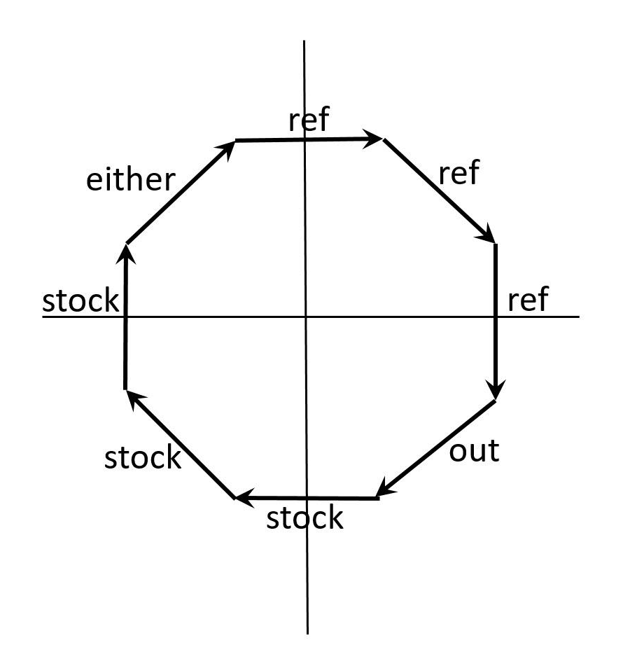
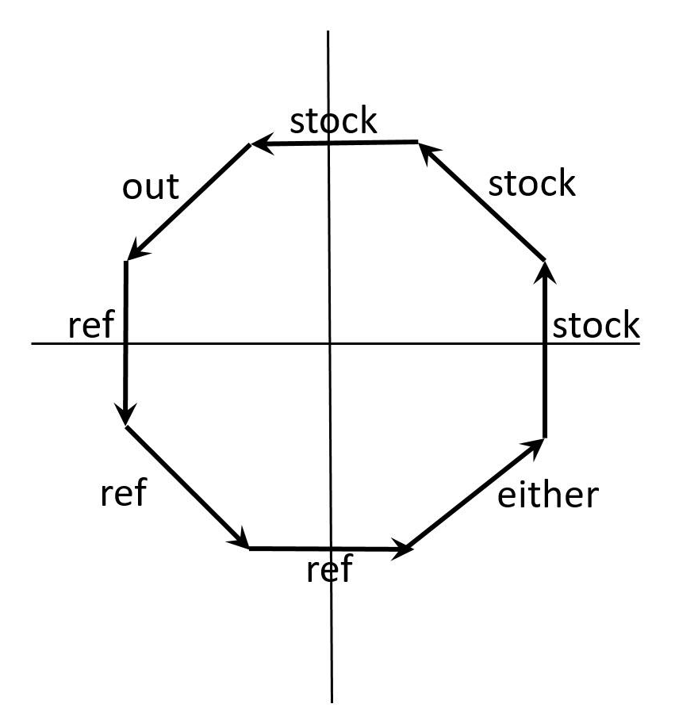
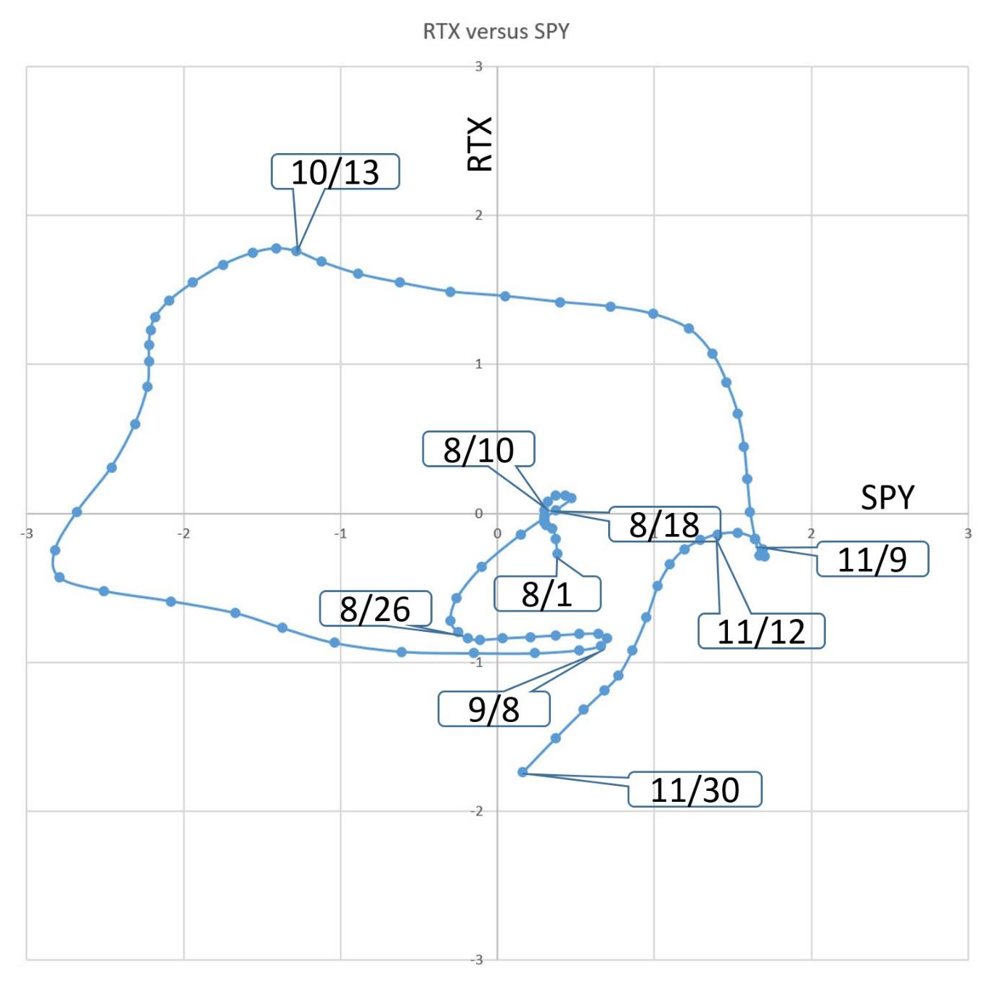

# Pairs Rotation

**By John Ehlers**

- **Downloaded from:** [Mesa Software — Pairs Rotation](https://www.mesasoftware.com/papers/PAIRS%20ROTATION.pdf)

---

Pairs Rotation is a strategy whose goal is to minimize drawdown while simultaneously maximizing return on capital. It works by having a long position in only one of two securities, depending on which is stronger at any point in time. For example, it can be applied to two sector ETFs that are generally anticorrelated to form a kind of sector rotation investment. If your goal is to beat the S&P, then you could chose a stock as one selection and the ETF SPY as the other. In this case, you would be holding the stock when it is strong relative to SPY and holding SPY when it is stronger. The trick is knowing when to rotate from one security to the other.

I developed Ehlers Loops[^1] to visualize the performance of one data stream against another. It was originally described as plotting Price versus Volume, but Ehlers Loops are also an ideal tool to determine the timing of the Pairs Rotation strategy. In Ehlers Loops, both securities are individually filtered in identical HighPass filters and SuperSmoother filters so the results are band limited data streams having a nominally zero mean. The filter data are scaled in terms of Standard Deviations for consistent interpretation.

Ehlers Loops can rotate either clockwise or counterclockwise. When plotting a stock versus a reference (e.g. SPY) you want to be long the stock when the vertical move up is the strongest condition and you want to be long the reference when the horizontal move to the right is the strongest condition. There are eight conditions in the loop that affect the timing. The conditions for the long positions are shown in Figures 1 and 2 for each direction of rotation.


**Figure 1. Long Position as a Function of Loop Position for Clockwise rotation**


**Figure 2. Long Position as a Function of Loop Position for CounterClockwise rotation**

Pairs Rotation is best described by example. In Figure 3, Raytheon Technologies (RTX) is compared to SPY for the four months from August through November 2021. At the beginning on August 1 the chart is moving vertically, so the recommended position would be long RTX. By August 10 a clockwise rotation has started, signaling a rotation to be long SPY. But by August 18 the clockwise rotation signals a downward direction in both securities, so it is best to be out of the market. By August 26 the rotation switches to counterclockwise, signaling a long position in SPY. The rotation reverses to clockwise on September 8, which is a signal to not be long SPY, so the best trade would be long RTX. The clockwise rotation continues to reach nearly -3 Standard Deviations in SPY and nearly 2 standard deviations in RTX. Holding a long position in RTX during this time is the best trade decision. The Ehlers Loop retreats from its maximum vertical displacement on October 13, signaling a rotation to be long SPY. Actually, being long SPY from its negative maximum excursion would not be a bad alternative trading decision. The clockwise rotation of the Ehlers Loop continues to November 9, when the little whifferdill causes concern, but being near +2 Standard Deviations at the time, the best decision would be to exit the SPY long position. By November 12, a counterclockwise rotation of the Ehlers Loop is established, meaning it would not be a good time to be long in either SPY or RTX. The flat trading position is held until the end of November.


**Figure 3. Trading FEDEX versus SPY Would Have Minimized Drawdown and Maximized Return on Capital**

The code to generate the Ehlers Loops is described with reference to Code Listing 1. After declaration of variables the coefficients for the HighPass and SuperSmoother filters are calculated only on the first bar of data for computational efficiency. Then, both Price1 and Price2 are filtered individually in identical filters. As a result, both are band limited signals having a nominal zero mean. Their RMS (Root Mean Square) values are computed as EMAs of their squares, and the EMA coefficient of 0.0242 corresponds to a critical period of one year. Dividing each by their RMS values scales them to both be plotted in terms of Standard Deviations.

The filtered and scaled values of Price1 and Price2 are conventionally plotted. In addition, their values are exported to a text file so that the Ehlers Loops can be plotted using Excel. Price1 is plotted along the horizontal axis and Price2 is plotted along the vertical axis. Several precautions regarding the text file should be taken. First, your computer must have a C:\Temp folder to contain the exported text file. Secondly, the Excel file cannot be open during live trading because trying to write to an open file will crash the indicator.

## Code Listing 1. Ehlers Loops Pairs Rotation EasyLanguage Code

```easylanguage
{
Ehlers Loops Pairs Rotation Chart
(C) 2005-2021 John F. Ehlers
}
Inputs:
LPPeriod(20),
HPPeriod(125);

Vars:
HP1(0), HP2(0),
hpa1(0),
hpb1(0),
hpc1(0),
hpc2(0),
hpc3(0),
ssa1(0),
ssb1(0),
ssc1(0),
ssc2(0),
ssc3(0),
Price1(0), Price1MS(0), Price1RMS(0),
Price2(0), Price2MS(0), Price2RMS(0);

If CurrentBar = 1 Then Begin
    hpa1 = expvalue(-1.414*3.14159 / HPPeriod);
    hpb1 = 2*hpa1*Cosine(1.414*180 / HPPeriod);
    hpc2 = hpb1;
    hpc3 = -hpa1*hpa1;
    hpc1 = (1 + hpc2 - hpc3) / 4;

    ssa1 = expvalue(-1.414*3.14159 / LPPeriod);
    ssb1 = 2*ssa1*Cosine(1.414*180 / LPPeriod);
    ssc2 = ssb1;
    ssc3 = -ssa1*ssa1;
    ssc1 = 1 - ssc2 - ssc3;
End;

//Normalized Roofing Filter for Data1 (horizontal plot)
// 2 Pole Butterworth Highpass Filter
HP1 = hpc1*(Close of Data1 - 2*Close[1] of Data1 + Close[2] of Data1) + hpc2*HP1[1] + hpc3*HP1[2];
If CurrentBar < 3 Then HP1 = 0;

// Smooth with a Super Smoother Filter
Price1 = ssc1*(HP1 + HP1[1]) / 2 + ssc2*Price1[1] + ssc3*Price1[2];
If CurrentBar < 3 Then Price1 = 0;

//Scale Price in terms of Standard Deviations
If CurrentBar = 1 then Price1MS = Price1*Price1
Else Price1MS = .0242*Price1*Price1 + .9758*Price1MS[1];
If Price1MS <> 0 Then Price1RMS = Price1 / SquareRoot(Price1MS);

//Normalized Roofing Filter for Data2 (vertical plot)
// 2 Pole Butterworth Highpass Filter
HP2 = hpc1*(Close of Data2 - 2*Close[1] of Data2 + Close[2] of Data2) + hpc2*HP2[1] + hpc3*HP2[2];
If CurrentBar < 3 Then HP2 = 0;

// Smooth with a Super Smoother Filter
Price2 = ssc1*(HP2 + HP2[1]) / 2 + ssc2*Price2[1] + ssc3*Price2[2];
If CurrentBar < 3 Then Price2 = 0;

//Scale Price in terms of Standard Deviations
If CurrentBar = 1 then Price2MS = Price2*Price2
Else Price2MS = .0242*Price2*Price2 + .9758*Price2MS[1];
If Price2MS <> 0 Then Price2RMS = Price2 / SquareRoot(Price2MS);

//Conventional Plots
Plot1(Price1RMS, "", red, 4, 4);
Plot2(0, "", white, 1, 1);
Plot3(Price2RMS, "", yellow, 4, 4);

//Output to Text File
Print(File("c:\Temp\EhlersLoopsRotation.csv"), Date, ",", Price1RMS, ",", Price2RMS);
```

To plot Ehlers Loops in Excel, simply highlight columns B and C for the desired date range and click on INSERT and choose Scatter Plot with smooth lines and indicators.

So there you have it. Ehlers Loops are a new way to discretionarily minimize drawdown and maximize return on capital based on the curvature and direction of rotation of motion as a function of time in Ehlers Loop. It is worth remembering that a Price move greater than one or two Standard Deviations means there is a high probability of a reversal.

## Takeaways

1. Ehlers Loops are a tool to discretionarily predict the best rotational timing based on the curvature and direction of rotation in a Price versus Volume chart.
2. Both Price1 and Price2 are individually filtered in identical HighPass and SuperSmoother filters to become band limited signals with a nominal zero mean.
3. Both Price1 and Price2 are scaled in terms of Standard Deviations.
4. The shape of the Ehlers Loops can be modified by changing the LPPeriod and HPPeriod of the data filters.
5. Decreasing the value of LPPeriod reduces lag and also reduces the smoothness of the filtered output.
6. Increasing the value of HPPeriod increases the contribution of longer wave components in the data.
7. The difference between HPPeriod and LPPeriod should not be less than 20 percent of their average value.

---

## BibTeX

```bibtex
@misc{ehlers_pairs_rotation,
  author       = {John F. Ehlers},
  title        = {Pairs Rotation},
  year         = {2022},
  howpublished = {online},
  url          = {https://www.mesasoftware.com/papers/PAIRS%20ROTATION.pdf}
}
```

[^1]: John Ehlers, "Ehlers Loops", *Stocks & Commodities*
