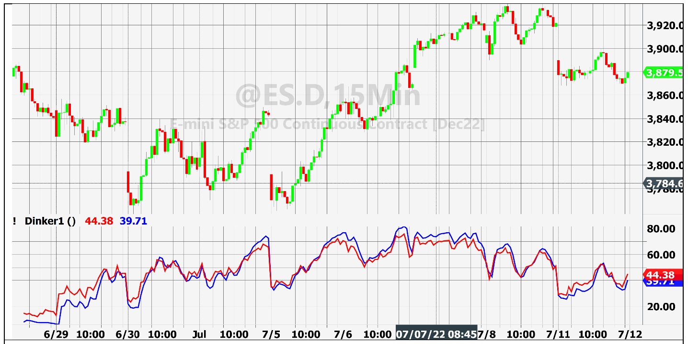

# Every Little Bit Helps

**By John Ehlers**

- **Downloaded from:** [Mesa Software — Every Little Bit Helps](https://www.mesasoftware.com/papers/EveryLittleBitHelps.pdf)

---

Market data are sampled data. We technicians usually use the closing price of a bar to represent the sampled price for that bar. Sometimes the average of the high, low, and close are used to represent the sampled data for that bar. In this article I will show you a simple trick that makes a small, but measurable improvement in your sample.

Using sampled data, the shortest wavelength that can be used has a wavelength of two bars. This is called the Nyquist frequency. The DSP trick reduces noise near the Nyquist frequency, but otherwise leaves the signal unchanged in the information band of the signal spectrum.

The trick is to note that the opening price of a bar is virtually synonymous with the closing price of the previous bar, particularly if we are dealing with intraday data. So, averaging the opening price with the closing price of the same bar is almost the same thing as taking a two-bar average of the closes of continuous data. That being the case, we can achieve a 6 dB reduction in noise at Nyquist by using an average of the Open and Close, compared to using only Closing price as our sample. An additional advantage is that the average provides a theoretical half bar lead along the time axis.

In fact, measured power near Nyquist using the average of the Open and the Close is nearly 6 dB less than using the Close alone. Difference of the measured power in the signal band of the spectrum (e.g., at a 30-bar period) using the two sampling techniques is imperceptible. Measured power reduction near Nyquist using the average of the high, low, and close is only on the order of 1 dB, making it hardly worth the effort.

Noise reduction near Nyquist is irrelevant if you are using an indicator with a zero in its transfer function at Nyquist or if you have a well-designed smoothing filter such as a Hann windowed FIR filter[^1]. This is because these filters already suppress signals near Nyquist. On the other hand, commonly used indicators such as the RSI, MACD, and Stochastic do not have zeros at Nyquist in their transfer responses.

Figure 1 shows a comparison of using a 14 bar RSI on 15 minute bars of the Emini S&P Futures data. Sampling using on closing prices is shown in red. Sampling using the average of the Open and Close is shown in blue. The blue line in noticeably smoother with regard to the high frequency wiggle, relative to the red line. You can reproduce the test using the EasyLanguage code in Code Listing 1.


**Figure 1. Averaging Open and Close Provides a Smoother Indicator**

## Code Listing 1. EasyLanguage Code to Test Data Sampling

```easylanguage
// Data Sampling Test
// (c) John Ehlers 2022
Vars:
CTest(0),
OCTest(0);

CTest = RSI(close, 14);
OCTest = RSI((Open + close) / 2, 14);

Plot1(CTest, "", red, 4, 4);
Plot3(OCTest, "", blue, 4, 4);
```

---

## BibTeX

```bibtex
@misc{ehlers_every_little_bit_helps,
  author       = {John F. Ehlers},
  title        = {Every Little Bit Helps},
  year         = {2023},
  howpublished = {online},
  url          = {https://www.mesasoftware.com/papers/EveryLittleBitHelps.pdf}
}
```

[^1]: John Ehlers, "Windowing", *Stocks & Commodities Magazine*, September 2021
