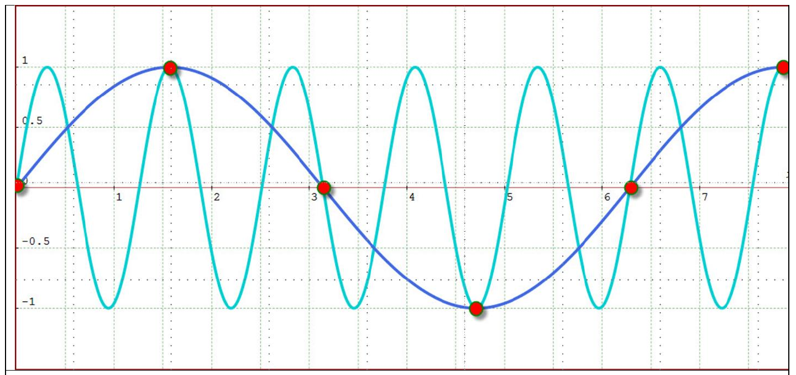
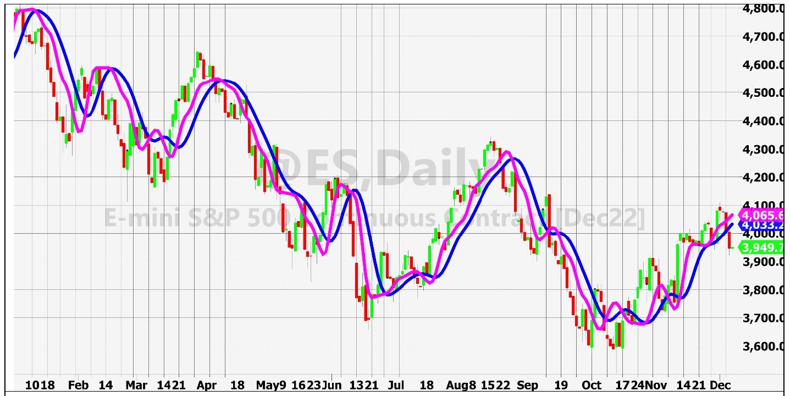
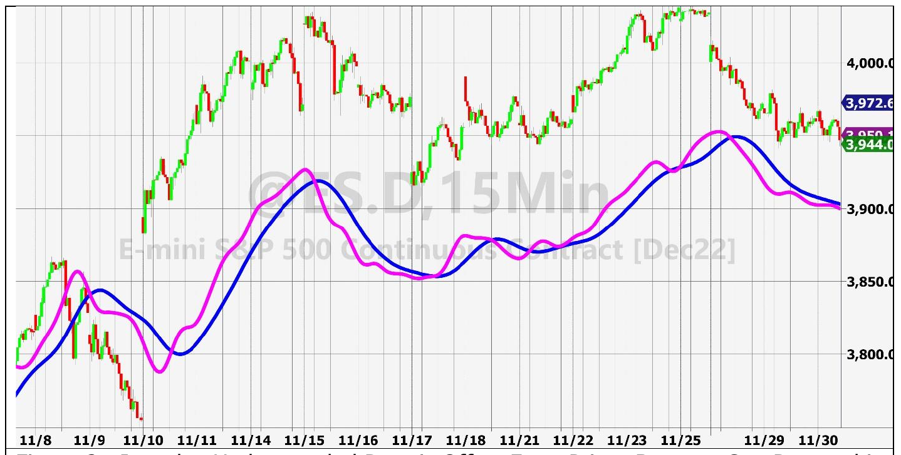

# Just Ignore Them

**By John Ehlers**

- **Downloaded from:** [Mesa Software — Just Ignore Them](https://www.mesasoftware.com/papers/JustIgnoreThem.pdf)

---

## Introduction

High frequency components in the data spectra are the bane of traders because they often lead to whipsaw trades. The usual approach is to reduce their effect on trading rules through the use of smoothing filters, such as moving averages. In the past I have introduced more effective smoothing filters, like the SuperSmoother[^1] IIR filter and the Hann Windowed[^2] FIR filter. I now propose to eliminate those high frequency components with a new approach.

Market data are sampled data. For example, using daily data, we get only one sample per day. It doesn't much matter if that sample is the close representing the data for that day, the average of the high, low, and close; or any other combination of available statistics. We still only get one sample per day. The sample rate can be increased. For example, trading intraday on 15 minute bars is not uncommon. There is a temptation to increase the sample rate further, using 5 minute bars, one minute bars, or even tick bars. The temptation is caused by confusing resolution with accuracy. More intricate market activity is revealed by the higher sampling rate, but the increased resolution doesn't necessarily lead to greater trading profits. The reason for this is that the market data are fractal and has the spectral density of pink noise. That is, the amplitude of the cycle components in the spectrum are directly correlated with their wavelength. If you shorten the wavelength by a factor of 2, then you can expect the cycle amplitude to be reduced to half amplitude. So, increasing the sampling rate necessarily leads to a lower gross profit per trade because the data swings are less, all other things being equal. When carried far enough, transaction costs of slippage and commission can exceed your average gross profit per trade. The bottom line is there is a "sweet spot" for sampling rate that depends on the trader's technique.

## A New Approach to Smoothing

No matter the sampling rate, we still have to get rid of those pesky high frequency components. My radical proposal is to simply ignore them. But ignoring the high frequency components doesn't come for free.

Sampled data is different from continuous data because its shortest possible wavelength has exactly two samples per cycle. This is called the Nyquist frequency. Sampled data simply does not contain information whose wavelengths are shorter than that of the Nyquist frequency. Of course, those spectrum components are still there in continuous data. The sampling process handles those shorter wavelength components by aliasing. That is, the shorter wavelength components are simply folded back into observable spectrum. Figure 1 illustrates the principle of aliasing, where the cyan line is sampled every 1.25 cycles. The wavelength of the cyan line is shorter than the Nyquist frequency, and so it appears that the signal is the blue line. The samples exactly fit both the cyan and blue sine waves, but the blue line has a longer wavelength than the Nyquist frequency. Thus, in this case, the observable spectrum component is the blue line.


**Figure 1. Sampled Data Must Have At Least Two Samples Per Cycle**

The reason that we can ignore the high frequency components in market data is because market data is fractal. It is a workable approximation that the cycle amplitude is halved every time the cycle spectrum component wavelength is doubled. So, if we sample once every five days, a five-day cycle period component is aliased back into our observable spectrum at half amplitude, a 2.5 day period component is aliased back into the observable spectrum at one quarter amplitude, etc. So, the aliased energy falls off rapidly compared to the desired signal energy. Further, market data are nonstationary and so the aliased energy does not fold back coherently. Rather, it is simply a little more noise added to the already noisy signal. The end result is that aliasing is hardly noticed, as a practical matter.

The undersampled data also undergoes a quantization lag that is half the quantization step size. If daily data is sampled every 5 days the induced lag is 2.5 days. This lag is much shorter than that of smoothing filters that reject cyclic components longer than the Nyquist rate (10 days) if we were using daily samples.

A practical application of smoothing by undersampling is shown in Figure 2. The undersampled data are further smoothed by a 6 period Hann Filter and a 12 period Hann Filter to be the equivalent of a Double Moving Average. It is apparent that the high frequency components in the data have been removed by the combination of undersampling and Hann-windowed FIR filters.


**Figure 2. Undersampled Double MA Indicator Is Very Smooth**

The EasyLanguage code to produce the Double MA indicator is given in Code Listing 1. The sampled value is the same as the previous sampled value except when the integer portion of the current bar divided by 5 is exactly equal to the current bar divided by 5. In this case the sampled value is assigned the value of the closing price. Thus, the data is effectively sampled every 5 bars. The Hann Filter is written as a Function, and the Function is given in Code Listing 2. Note that the Dollar Sign in naming of the Function is important.

Intraday data can also be smoothed by undersampling. The method to do this is described with reference to Code Listing 3. Intraday data for Index Futures is available as a "Day Session" that runs from 6:30 AM to 1:15 PM Pacific Time (you will need to adjust for your time zone). I have assumed 15 minute bars are used, so the first bar of the day is 645. At the close of the first bar of the day the Gap value is computed as the difference of the closing price and the previous value of Degap. Then, that Gap value is mathematically removed from every sample during the day. This technique removes the opening price gap from the overnight period and provides a more continuous function for analysis. The sampling is conducted only on the hour and at the session closing time. Otherwise, the previous value of Degap is held. So, the data is effectively sampled every four bars. The little jitter in the sampling clock due to the time offset of the first and last bar of the day doesn't matter much because the data are not coherent.

The beginning date for the indicator is provided as an input. This is required because the impact of the opening gap is cumulative, and the degapped undersampled data can drift from the absolute values of the prices.

Just to demonstrate the smoothing process of undersampling, a double moving average type indicator is shown, using Hann windowed FIR filters. This indicator is shown in Figure 3.


**Figure 3. Intraday Undersampled Data is Offset From Prices Because Gap Removal is Cumulative.**

## Conclusion

I have shown that undersampling removes the high frequency components in price data. Elimination of these components is done with less lag than that of conventional smoothing filters. Quantization lag is only half the undersampling step size. This magic is possible because the market data is fractal, so the aliased components have a small amplitude relative to the desired signal components. Further, the folding of the aliased component into the observable spectrum is performed noncoherently.

Undersampling can also be applied to intraday data, removing the overnight gap openings as well.

The degree of undersampling is designer's choice. However, care should be taken not to get carried away and start folding desired signals back onto the observable spectrum.

---

## Code Listing 1. Undersampled Double MA

```easylanguage
{
Undersampled Double MA Indicator
(c) 2022
John F. Ehlers
}
Inputs:
Fast Length(6),
Slow Length(12);

Vars:
Sample(0),
Fasting(0),
Slowing(0);

Sample = Sample[1];
//Sample every five days
If CurrentBar / 5 = IntPortion(CurrentBar / 5) Then Sample = Close;
//Find Fast Average using Hann FIR filter
FastAvg = $Hann(Sample, FastLength);
//Find Slow Average using Hann FIR filter
SlowAvg = $Hann(Sample, SlowLength);

Plot1(FastAvg, "", magenta, 6, 6);
Plot2(SlowAvg, "", blue, 6, 6);
```

## Code Listing 2. $Hann Function EasyLanguage Code

```easylanguage
{
Function: Hann Windowed Lowpass FIR Filter
(c) 2021-2022
John F. Ehlers
}
Inputs:
Price(numericseries),
Length(numericsimple);

Vars:
count(0),
coef(0),
Filt(0);

Filt = 0;
coef = 0;
For count = 1 to Length Begin
    Filt = Filt + (1 - Cosine(360*count / (Length + 1)))*Price[count - 1];
    coef = coef + (1 - Cosine(360*count / (Length + 1)));
End;
If coef <> 0 Then $Hann = Filt / coef;
```

## Code Listing 3. Undersampled Intraday Double MA Indicator

```easylanguage
{
Undersampled Intraday Double MA Indicator
(c) 2022
John F. Ehlers
}
Inputs:
BegDate(1221117),
FastLength(20),
SlowLength(40);

Vars:
Gap(0),
Degap(0),
FastAvg(0),
SlowAvg(0);

Degap = Degap[1];
If Time = 645 Then Begin
    Gap = Close - Degap[1];
    Degap = Close - Gap;
End;
If Time = 800 or Time = 900 or Time = 1000 or Time = 1100 or Time = 1200
   or Time = 1315 Then Degap = Close - Gap;
If Date < BegDate Then Degap = Close;

//Find Fast Average using Hann FIR filter
FastAvg = $Hann(Degap, FastLength);
//Find Slow Average using Hann FIR filter
SlowAvg = $Hann(Degap, SlowLength);

Plot1(FastAvg, "", magenta, 6, 6);
Plot2(SlowAvg, "", blue, 6, 6);
```

---

## BibTeX

```bibtex
@misc{ehlers_just_ignore_them,
  author       = {John F. Ehlers},
  title        = {Just Ignore Them},
  year         = {2023},
  howpublished = {online},
  url          = {https://www.mesasoftware.com/papers/JustIgnoreThem.pdf}
}
```

[^1]: John Ehlers, "Predictive and Successful Indicators", *Stocks & Commodities Magazine*, V 32:1 (16–25)
[^2]: John Ehlers, "Windowing", *Stocks & Commodities Magazine*, V39:09 (8–14)
