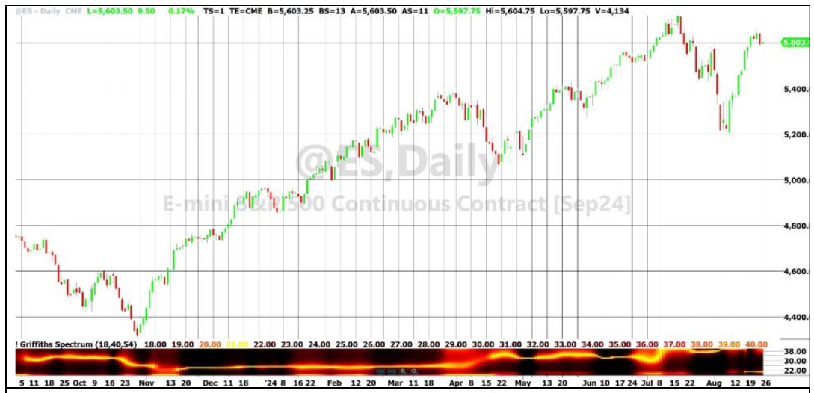
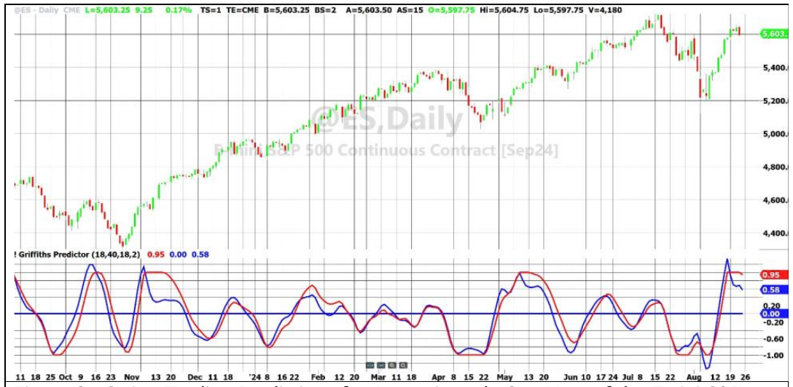
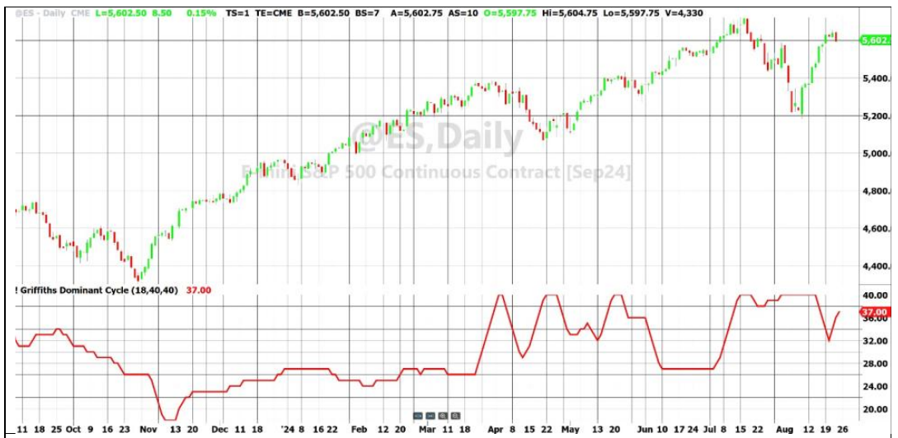

# Linear Predictive Filters and Instantaneous Frequency

**By John Ehlers**

- **Downloaded from:** [Mesa Software — Linear Predictive Filters](https://www.mesasoftware.com/papers/Linear%20Predictive%20Filters.pdf)

---

**SPOILER ALERT:** We are going to take a relatively deep dive into DSP (Digital Signal Processing) in this article. But the dive will be worth it because it will answer the most vexing question of technical traders. That question is: "Why did my technical indicator or algorithmic trading rule suddenly fail after looking so good in backtest?". The short answer is that the indicators and rules have static parameters, but the price data has a dynamic time variation.

The price data has a complex waveform in the time domain. From Fourier theory, the complex waveform can equally well be described in the frequency domain. Figure 1 shows approximately one year of the Emini S&P futures contract, with the measured spectrum in the frequency domain in the first subgraph. The wavelength of spectral components is displayed along the vertical axis of the subgraph, and the amplitude of the spectral components are shown in color — from white hot, through red hot, down to ice cold in black. The spectrum display is in time sync with the price chart. From an overview perspective, we see the market had a 32 bar dominant cycle period in the Fall of 2023 that radically changed to a 25 bar dominant cycle period in the runup of the Winter and Spring of 2024. There was a shift of the dominant cycle period in May, and yet another major shift in July. Unless your indicator could accommodate or adapt to these shifts it is doomed to failure. A typical technical analysis approach is to use one kind of indicator until it fails — then adjust the parameters or use another indicator to fit the new market conditions. One of the results of our dive will be to recognize and adjust to the market changes as they occur.


**Figure 1. The Measured Spectrum Show Major Shifts in the Dominant Cycle in Price Data**

## The Problem to be Solved

Market data can be described as the Drunkard's walk. The solutions to the Drunkard's Walk problem are either the Wave Equation or the Diffusion Equation, depending on your choice of random variables. These equations are partial differential equations. There is no closed form solution for them because they are boundary value problems, and the boundaries cannot be defined for price data. In my opinion, the market seems to vary between a Wave Equation solution and a Diffusion Equation solution as a function of time. The Diffusion Equation solution is nearly synonymous with randomness, so there is no solid predictability. The good news is that we can make effective predictions if the market is in a Wave Equation mode.

Mathematical tools have been developed to help solve differential equations. LaPlace transforms were developed to solve them as if they were algebraic equations. LaPlace transforms have a complete solution for transient conditions. Fourier transforms are just like LaPlace transforms except they are constrained to solve for only so-called steady state conditions. Fourier transforms require the use of complex variables. Fourier transforms can equally well describe a problem in the time domain or the frequency domain. Z transforms are the "kissin' cousin" of Fourier transforms, but are restricted to sampled data. Z transforms are particularly simple, using the notation that $Z^{-1}$ means one unit of delay.

So, in a nutshell, we want to solve the Drunkard's Walk problem with Z transforms because we are dealing with sampled data. Price and its rate of change are about all we have to work with. The use of volume to predict price is demonstrably worthless, at least with intraday data. Using patterns is subjective and the statistics on the success of using patterns for price prediction is abysmal. In my opinion, the use of numerology, position of the planets, etc. is just black art.

## Band-Limited Signals

We must put some constraints on the data input if we expect to have a solution at all. One of these constraints is that the data must be band-limited. The data spectrum theoretically contains all wavelengths. But we must limit the range of the spectrum to eliminate phenomena such as aliasing or data that is irrelevant to our trading activity. For example, keeping a 50-year trend in the data complicates our solution for intraday trading with little or no benefit.

In the big picture, most indicators such as the RSI, Stochastic, MACD, and CCI, are band limiters. They eliminate the zero frequency and long wavelength components in the data spectrum. They all involve smoothing, which attenuates the shorter wavelength components in the spectrum. However, each of these indicators introduce artifacts that are not well controlled. These artifacts include scaling, lag, and preferential amplification of some spectral components.

I prefer to use a bandpass filter to band-limit the price data used for analysis because the lag response and phase response are predictable and it provides nearly unity gain across the filter bandwidth. I use a second order highpass filter and a second order lowpass filter to independently set the filter band edges because they provide much better attenuation for out-of-band signals than a first order filter. The filter bandwidth should be on the order of an octave or more to accommodate the variations in the data dominant cycle, such as shown in Figure 1.

In general, the bandpass filter parameters are fixed while the spectral aspects of the input data are variable. If the wavelength of the input data is longer than the period at the center of the filter, the filter output will be leading in phase relative to the input. Correspondingly, if the wavelength of the input data is shorter than the period at the center of the filter, the filter output will be lagging in phase. That is just how filters work, and there is no fix for that. The phase slope across the filter is a function of the filter bandwidth and the order of the filter. This is one reason why higher order filters are not used in technical analysis. Their phase response can cause a 180-degree flip in output phase when the dominant cycle period of the input data shifts just a little.

Think of a bandpass filter this way: it is a simple mathematical manipulation. A one bar difference is a highpass filter in the frequency domain, and is analogous to a derivative in calculus. An average is a lowpass filter in the frequency domain and is analogous to an integral in calculus. So, a highpass filter followed by a lowpass filter is basically the same as a derivative followed by an integrator. The reciprocal calculus operators cancel, so the filter output is a replica of the input signal. That is about as close to an indicator without distortion as you can get.

## Linear Predictive Filters

The transfer response of a linear filter is expressed as a rational fraction of $Z^{-1}$ polynomials. A predictive filter is where the polynomial is only in the denominator. From the first law of algebra, any polynomial can be factored into zeros of the polynomial. Since the linear predictive filter polynomial has zeros in the denominator, these are called poles. Thus, a linear predictive filter has an all-pole design. There is no divide-by-zero problem with these filters because the poles lie in the complex Z plane and filter operation is constrained to the unit circle in that plane.

So here is a simple example of how it works. The transfer response is:

$$
H(Z) = \frac{1}{1 - (c_1 Z^{-1} + c_2 Z^{-2})}
$$

The transfer response is the ratio of the Output to the Input. So, substituting, cross-multiplying, and using mixed notation, we get:

$$
In = (1 - (c_1 Z^{-1} + c_2 Z^{-2})) \cdot Out
$$

Further changing notation as EasyLanguage delay, the equation becomes:

```
In = Out - c1*Out[1] - c2*Out[2]
```

In this context "In" is the new data point. In other words, it is the prediction.

A simple predictive filter is coded in Code Listing 1. Codes for the Highpass and SuperSmoother functions are given in Code Listings 2 and 3, respectively. At zero frequency $Z^{-1} = 1$, and we want to have unity gain at this frequency. Therefore, each of the coefficients must be normalized to their sum for this to happen. You can uncomment one line of code to get a deterministic sinewave having a 20-bar wavelength and its prediction. You can also play with the value of Q. If you make Q too small there is not much of a prediction. If you make Q too large (but less than 1) the filter becomes a peaking filter and the prediction becomes erratic. Of course, the prediction can be extended by making the first prediction be a new data point and then running the process again.

So, making a predictive filter is simple. The trick is how to compute the coefficients.

## MESA

MESA is an acronym for "Maximum Entropy Spectral Analysis". The MESA algorithm uses an all-pole filter. The coefficients were computed using the Levinson recursion algorithm for a selected time block of data by maximizing the entropy of the denominator polynomial. The block of data would be moved forward one bar and the process was repeated to get the time-based output. This process created a filter that absolutely provided the best solution for the selected block of data. The spectral analysis part was obtained by (conceptually) running a sweep generator across the filter coefficients, knowing the filter response is the same as the spectrum of the input data.

The MESA process is computationally intensive. As I recall, a single analysis took 30 minutes to an hour on an Apple II. It was so bad that I mapped the computing register to the display register to watch it working just to know that the computer had not crashed. I must say it was fascinating to watch the computer work at the bit level.

## Griffiths

Griffiths[^1] described an adaptive technique for estimating the frequency domain structure of digital signals that have a narrow band, rapidly time-varying spectrum. This data description can easily describe price data for trading. Griffith's approach is vastly more computationally simple than the maximum entropy approach and probably produces better practical results due to time continuity. The Griffiths approach also uses a linear predictive filter but with coefficients that are adaptive. The filter coefficients are continuously updated with each new data input sample.

The Griffiths approach is described with reference to Code Listing 4. The data signal is first band-limited to accommodate the range of wavelengths we see in Figure 1. If we were interested in position trading, we would set the upper bound wavelength to 125 (about half a year) or more. In my examples we are interested in swing trading the nominal monthly (20 bar) wavelength we assume to be present. So, the upper bound is set to 40 to make sure we include the expected conditions. The lower bound is set at 18 to capture the shortest cycle period found in the Figure 1 survey. The lower bound should be set to be greater than 8 to ensure the effects of aliasing are effectively eliminated from the calculations. The upper bound should be at least an octave more than the lower bound to produce a low phase slope across the piece of spectrum we are analyzing.

When computing the spectrum or dominant cycle it is good practice to use a length of data at least as long as the upper bound to ensure we get at least one full cycle of the data at the upper bound. If you make the length of data too long you could lose some of the shorter wavelength response due to averaging over the longer data length. When only making the prediction, a relatively small length of data can be used because the data autocorrelation falls off rapidly as a function of lag.

The data is assumed to be ergotic and have a unity autocorrelation factor. For this reason, the data is normalized to swing between -1 and +1 using a fast-attack, slow decay AGC (Automatic Gain Control). If the band-limited waveform absolute amplitude is larger than the historical peak, then the historical peak is reset to the larger value. If the amplitude of the band-limited signal is less than the historical peak, then the peak is reset to .991 of its previous value on each sample. For a 30-bar cycle component in the spectrum we expect to get a new maximum absolute amplitude every 15 bars. In that 15-bar time the peak will have dropped to $0.991^{15} = 0.873$ of the real maximum. This is only a little more than 1 dB of distortion in the normalized signal, which I think is acceptable.

If you prefer, you can unremark one line of code to replace the normalized data input with a pure sine wave having a 30-bar period as a test signal.

The next step is to convert the normalized data variable to an array. I do this because the counter for a variable goes from right to left from the current bar whereas an array in technical publications goes from left to right. In addition, the variable counter starts at zero whereas the array counter starts at 1. So, I convert the data to an array simply to not go crazy when coding the rest of the procedure.

In the next step we find the prediction value of the normalized data exactly the same way we found the prediction in the simple example. That is, the prediction is the sum of the products of the coefficients and the data across the array. The process is adaptive, so don't worry about the initial values of the coefficients.

The coefficients are computed by minimizing the error between the last data point and the prediction XBar. The process converges with each new data sample with the convergence factor Mu, which is just the reciprocal of the data length.

The prediction is made with exactly the same process as used computing the value of the coefficients, finding XPred instead of XBar. The process is extended by selecting the BarsFwd you want for the prediction. You will find that the prediction falls apart if extended more than several bars into the future. With no new data input, the information content is degraded with each prediction iteration.

Figure 2 shows the prediction in blue and the band-limited and normalized data in red for 2 BarsFwd. The lower bound was set at 18, and the upper bound and data length were set at 40. In general, the prediction crossing the signal line provide excellent timing for swing trading entries and exits.


**Figure 2. Swing Trading Predictions for Approximately One Year of the Emini S&P**

### Griffiths Spectrum

The general expression for the transfer function of a linear predictive filter of order L is:

$$
H(Z) = \frac{1}{1 - \sum_{l=1}^L c_l Z^{-l}}
$$

We can find the response in the frequency domain simply by substituting the Fourier $e^{(-j\omega l)}$ for the Z transform $Z^{-1}$. Therefore, the spectrum shape is in the content of the optimized filter coefficients. That is, when the filter is perfectly tuned, the difference between the prediction and the last data point is zero. Therefore, the coefficients carry the spectrum information as a function of frequency. We can obtain the power spectrum by squaring the transfer response. This ensures a real solution from complex variables.

The power spectrum for a linear predictive filter is:

$$
P(\omega) = \frac{1}{\left(1 - \sum_{l=1}^L c_l e^{(-j\omega l)}\right)^2}
$$

So, all we have to do to recover the spectrum is to run the operation with complex frequencies across the band of interest.

The EasyLanguage code to compute the Griffiths spectrum is given in Code Listing 5. Finding the coefficients is done exactly as was done for the Griffiths Predictor. The arrays are scaled at 100 because the indicator is constrained to have no more than 99 indicator lines.

The spectrum is found by scanning the periods from the lower bound to the upper bound by the complex frequencies. `Cosine()` are the real components and `Sine()` are the imaginary components. The value of the spectrum is found for each period. This, in essence, is mathematically the same as applying a sweep generator to a filter and observing the output. Each spectral component is smoothed in an EMA with an alpha = 0.1 to calm down some of the noisiness in the output. The amplitude of the largest spectral component is found by sweeping across the band, and the largest value is used to normalize the spectrum to have the largest value as unity.

The spectrum amplitudes are converted to colors. Color1 is red and Color2 is green. When the spectrum value is 1, both Color1 and Color2 are 255, so the combination produces yellow. When the spectrum value drops to .5, Color2 goes to zero so that only red is left. When the spectrum value drops to 0, both Color1 and Color2 are zero, producing black. So, color represents the amplitude of the spectrum component at each wavelength for a given data point, and the vertical position of that data point is proportional to the wavelength. The display advances horizontally across the screen for each time sample. The display can be considered as a raster scan of each wavelength across the screen.

Figure 1 is an example of the Griffiths Spectrum for a lower bound of 10, and upper bound of 40, and a data length of 54.

### Griffiths Dominant Cycle

Displaying the entire spectrum is often overwhelming and unnecessary. In Code Listing 6 the Dominant Cycle in the data is captured as the largest amplitude component. Then, that Dominant Cycle is displayed as an indicator. The Dominant Cycle for the Emini S&P over approximately the last year and cycle period range between 18 and 40 bars is shown in Figure 3. With sufficient caution regarding computational delay, the Dominant Cycle can be used to adaptively tune indicators and strategy algorithms to changing market conditions.


**Figure 3. Data Dominant Cycle Extracted from the Griffiths Spectrum**

## Conclusions

Thank you for joining me into this deep dive into DSP. It is my motto to "Provide left-brained concepts for traders in their right mind". I trust that I have delivered that to you in this article. In summary, here are some key points I hope you remember:

- A bandpass filter has more fidelity to the input data than any other technical indicator.
- A bandpass filter should have a bandwidth of an octave or more to minimize phase slope across the band of interest.
- A bandpass filter should have a lower bound of no less than 8 bars to nearly eliminate the effects of aliasing.
- AGC retains fidelity of a band-limited signal and normalizes the amplitude to swing between -1 and +1.
- Linear predictive (all-pole) filters actually have a predictive capability. The prediction improves as the bandwidth of the band-limited data is reduced.
- The Griffiths procedure computes linear predictive filter coefficients by adaptively minimizing the error between the last data point and the prediction.
- The data spectrum is captured by the coefficients of a linear predictive filter. The spectrum display is extracted by applying a sweep generator to the filter band and observing the filter output.
- The Dominant Cycle period is the spectrum component having the largest amplitude.
- The Dominant Cycle can be used to tune other indicators and strategy algorithms to adapt to changing market conditions.

---

## Code Listing 1. EasyLanguage Code for a Simple 2 Pole Predictor

```easylanguage
{
Simple Predictor
(C) 2024 John F. Ehlers
}
Vars:
Q(.35),
HP(0),
LP(0),
c0(0), c1(0), c2(0), sum(0),
Predict(0);

//one octave bandpass filter between 15 and 30 bar cycle periods
HP = $Highpass(Close, 15);
LP = $SuperSmoother(HP, 30);

//LP = Sine(360*CurrentBar / 20);

c0 = 1;
c1 = 1.8*Q;
c2 = -Q*Q;
sum = 1 - c1 - c2;
c0 = c0 / sum;
c1 = c1 / sum;
c2 = c2 / sum;

Predict = c0*LP - c1*LP[1] - c2*LP[2];

Plot1(LP);
Plot2(0);
Plot3(Predict);
```

## Code Listing 2. EasyLanguage Code for the Highpass Function

```easylanguage
{
Highpass Function
(C) 2004-2024 John F. Ehlers
}
Inputs:
Price(numericseries),
Period(numericsimple);

Vars:
a1(0),
b1(0),
c1(0),
c2(0),
c3(0);

a1 = expvalue(-1.414*3.14159 / Period);
b1 = 2*a1*Cosine(1.414*180 / Period);
c2 = b1;
c3 = -a1*a1;
c1 = (1 + c2 - c3) / 4;

If CurrentBar >= 4 Then
    $HighPass = c1*(Price - 2*Price[1] + Price[2]) +
                c2*$HighPass[1] + c3*$HighPass[2];
If Currentbar < 4 Then $HighPass = 0;
```

## Code Listing 3. EasyLanguage Code for the SuperSmoother Function

```easylanguage
{
SuperSmoother Function
(C) 2004-2024 John F. Ehlers
}
Inputs:
Price(numericseries),
Period(numericsimple);

Vars:
a1(0),
b1(0),
c1(0),
c2(0),
c3(0);

a1 = expvalue(-1.414*3.14159 / Period);
b1 = 2*a1*Cosine(1.414*180 / Period);
c2 = b1;
c3 = -a1*a1;
c1 = 1 - c2 - c3;

If CurrentBar >= 4 Then
    $SuperSmoother = c1*(Price + Price[1]) / 2 +
                     c2*$SuperSmoother[1] + c3*$SuperSmoother[2];
If Currentbar < 4 Then $SuperSmoother = Price;
```

## Code Listing 4. EasyLanguage Code for the Griffiths Predictor

```easylanguage
{
Griffiths Predictor Indicator
(C) 2024 John F. Ehlers
from "Rapid Measurement of Digital Instantaneous Frequency",
IEEE Transactions ASSP-23
}
Inputs:
LowerBound(18),
UpperBound(40),
Length(18),
BarsFwd(2);

Vars:
Mu(0),
HP(0),
LP(0),
HH(0),
LL(0),
Signal(0),
Peak(.1),
XBar(0),
count(0),
XPred(0),
advance(0);

Arrays:
XX[200](0),
coef[200](0),
Pwr[200,2](0);

Mu = 1 / Length;

HP = $HighPass(Close, UpperBound);
LP = $SuperSmoother(HP, LowerBound);
Peak = .991*Peak[1];
If AbsValue(LP) > Peak Then Peak = AbsValue(LP);
If Peak <> 0 Then Signal = LP / Peak;

//Perfect cycle test signal
//Signal = Sine(360*currentbar / 30);

For count = 1 to Length Begin
    XX[count] = Signal[Length - count];
End;

XBar = 0;
For count = 1 to Length Begin
    XBar = XBar + XX[Length - count]*coef[count];
End;

For count = 1 to Length Begin
    coef[count] = coef[count] + Mu*(XX[Length] - XBar)*XX[Length - count];
End;

//Prediction
For advance = 1 to BarsFwd Begin
    XPred = 0;
    For count = 1 to Length Begin
        XPred = XPred + XX[Length + 1 - count]*coef[count];
    End;
    For count = advance to Length - advance Begin
        XX[count] = XX[count + 1];
    End;
    For count = 1 to Length - 1 Begin
        XX[count] = XX[count + 1];
    End;
    XX[Length] = XPred;
End;

Plot1(Signal);
Plot2(0);
Plot3(XPred);
```

## Code Listing 5. EasyLanguage Code for the Griffiths Spectrum

```easylanguage
{
Griffiths Spectrum Indicator
(C) 2024 John F. Ehlers
from "Rapid Measurement of Digital Instantaneous Frequency",
IEEE Transactions ASSP-23
}
Inputs:
LowerBound(10),
UpperBound(40),
Length(40);

Vars:
Mu(0),
HP(0),
LP(0),
HH(0),
LL(0),
Signal(0),
Peak(.1),
XBar(0),
count(0),
advance(0),
Period(0),
Real(0),
Imag(0),
Denom(0),
MaxPwr(0),
Color1(0),
Color2(0);

Arrays:
XX[100](0),
coef[100](0),
Pwr[100, 2](0);

Mu = 1 / Length;

HP = $HighPass(Close, UpperBound);
LP = $SuperSmoother(HP, LowerBound);
Peak = .991*Peak[1];
If AbsValue(LP) > Peak Then Peak = AbsValue(LP);
If Peak <> 0 Then Signal = LP / Peak;

For count = 1 to Length Begin
    XX[count] = Signal[Length - count];
End;

XBar = 0;
For count = 1 to Length Begin
    XBar = XBar + XX[Length - count]*coef[count];
End;

For count = 1 to Length Begin
    coef[count] = coef[count] + Mu*(XX[Length] - XBar)*XX[Length - count];
End;

//Instantaneous Frequency
For Period = LowerBound to UpperBound Begin
    Pwr[Period, 2] = Pwr[Period, 1];
    Real = 0;
    Imag = 0;
    For count = 1 to Length Begin
        Real = Real + coef[count]*Cosine(360*count / Period);
        Imag = Imag + coef[count]*Sine(360*count / Period);
    End;
    Denom = (1 - Real)*(1 - Real) + Imag*Imag;
    Pwr[Period, 1] = .1 / Denom + .9*Pwr[Period, 2];
End;

MaxPwr = 0;
For Period = LowerBound to UpperBound Begin
    If Pwr[Period, 1] > MaxPwr Then Begin
        MaxPwr = Pwr[Period, 1];
    End;
End;

For Period = LowerBound to UpperBound Begin
    If MaxPwr <> 0 Then Pwr[Period, 1] = Pwr[Period, 1] / MaxPwr;
End;

//Plot the Spectrum as a Heatmap
For Period = LowerBound to UpperBound Begin
    //Convert Power to RGB Color for Display
    If Pwr[Period, 1] >= .5 Then Begin
        Color1 = 255;
        Color2 = 255*(2*Pwr[Period, 1] - 1);
    End;
    If Pwr[Period, 1] < .5 Then Begin
        Color1 = 255*2*Pwr[Period, 1];
        Color2 = 0;
    End;
    If Period = 3 Then Plot3(3, "S5", RGB(Color1, Color2, 0),0,4);
    If Period = 4 Then Plot4(4, "S4", RGB(Color1, Color2, 0),0,4);
    If Period = 5 Then Plot5(5, "S5", RGB(Color1, Color2, 0),0,4);
    If Period = 6 Then Plot6(6, "S6", RGB(Color1, Color2, 0),0,4);
    If Period = 7 Then Plot7(7, "S7", RGB(Color1, Color2, 0),0,4);
    If Period = 8 Then Plot8(8, "S8", RGB(Color1, Color2, 0),0,4);
    If Period = 9 Then Plot9(9, "S9", RGB(Color1, Color2, 0),0,4);
    If Period = 10 Then Plot10(10, "S10", RGB(Color1, Color2, 0),0,4);
    If Period = 11 Then Plot11(11, "S11", RGB(Color1, Color2, 0),0,4);
    If Period = 12 Then Plot12(12, "S12", RGB(Color1, Color2, 0),0,4);
    If Period = 13 Then Plot13(13, "S13", RGB(Color1, Color2, 0),0,4);
    If Period = 14 Then Plot14(14, "S14", RGB(Color1, Color2, 0),0,4);
    If Period = 15 Then Plot15(15, "S15", RGB(Color1, Color2, 0),0,4);
    If Period = 16 Then Plot16(16, "S16", RGB(Color1, Color2, 0),0,4);
    If Period = 17 Then Plot17(17, "S17", RGB(Color1, Color2, 0),0,4);
    If Period = 18 Then Plot18(18, "S18", RGB(Color1, Color2, 0),0,4);
    If Period = 19 Then Plot19(19, "S19", RGB(Color1, Color2, 0),0,4);
    If Period = 20 Then Plot20(20, "S20", RGB(Color1, Color2, 0),0,4);
    If Period = 21 Then Plot21(21, "S21", RGB(Color1, Color2, 0),0,4);
    If Period = 22 Then Plot22(22, "S22", RGB(Color1, Color2, 0),0,4);
    If Period = 23 Then Plot23(23, "S23", RGB(Color1, Color2, 0),0,4);
    If Period = 24 Then Plot24(24, "S24", RGB(Color1, Color2, 0),0,4);
    If Period = 25 Then Plot25(25, "S25", RGB(Color1, Color2, 0),0,4);
    If Period = 26 Then Plot26(26, "S26", RGB(Color1, Color2, 0),0,4);
    If Period = 27 Then Plot27(27, "S27", RGB(Color1, Color2, 0),0,4);
    If Period = 28 Then Plot28(28, "S28", RGB(Color1, Color2, 0),0,4);
    If Period = 29 Then Plot29(29, "S29", RGB(Color1, Color2, 0),0,4);
    If Period = 30 Then Plot30(30, "S30", RGB(Color1, Color2, 0),0,4);
    If Period = 31 Then Plot31(31, "S31", RGB(Color1, Color2, 0),0,4);
    If Period = 32 Then Plot32(32, "S32", RGB(Color1, Color2, 0),0,4);
    If Period = 33 Then Plot33(33, "S33", RGB(Color1, Color2, 0),0,4);
    If Period = 34 Then Plot34(34, "S34", RGB(Color1, Color2, 0),0,4);
    If Period = 35 Then Plot35(35, "S35", RGB(Color1, Color2, 0),0,4);
    If Period = 36 Then Plot36(36, "S36", RGB(Color1, Color2, 0),0,4);
    If Period = 37 Then Plot37(37, "S37", RGB(Color1, Color2, 0),0,4);
    If Period = 38 Then Plot38(38, "S38", RGB(Color1, Color2, 0),0,4);
    If Period = 39 Then Plot39(39, "S39", RGB(Color1, Color2, 0),0,4);
    If Period = 40 Then Plot40(40, "S40", RGB(Color1, Color2, 0),0,4);
    If Period = 41 Then Plot41(41, "S41", RGB(Color1, Color2, 0),0,4);
    If Period = 42 Then Plot42(42, "S42", RGB(Color1, Color2, 0),0,4);
    If Period = 43 Then Plot43(43, "S43", RGB(Color1, Color2, 0),0,4);
    If Period = 44 Then Plot44(44, "S44", RGB(Color1, Color2, 0),0,4);
    If Period = 45 Then Plot45(45, "S45", RGB(Color1, Color2, 0),0,4);
    If Period = 46 Then Plot46(46, "S46", RGB(Color1, Color2, 0),0,4);
    If Period = 47 Then Plot47(47, "S47", RGB(Color1, Color2, 0),0,4);
    If Period = 48 Then Plot48(48, "S48", RGB(Color1, Color2, 0),0,4);
    If Period = 49 Then Plot49(49, "S49", RGB(Color1, Color2, 0),0,4);
    If Period = 50 Then Plot50(50, "S50", RGB(Color1, Color2, 0),0,4);
    If Period = 51 Then Plot51(51, "S51", RGB(Color1, Color2, 0),0,4);
    If Period = 52 Then Plot52(52, "S52", RGB(Color1, Color2, 0),0,4);
    If Period = 53 Then Plot53(53, "S53", RGB(Color1, Color2, 0),0,4);
    If Period = 54 Then Plot54(54, "S54", RGB(Color1, Color2, 0),0,4);
    If Period = 55 Then Plot55(55, "S55", RGB(Color1, Color2, 0),0,4);
    If Period = 56 Then Plot56(56, "S56", RGB(Color1, Color2, 0),0,4);
    If Period = 57 Then Plot57(57, "S57", RGB(Color1, Color2, 0),0,4);
    If Period = 58 Then Plot58(58, "S58", RGB(Color1, Color2, 0),0,4);
    If Period = 59 Then Plot59(59, "S59", RGB(Color1, Color2, 0),0,4);
    If Period = 60 Then Plot60(60, "S60", RGB(Color1, Color2, 0),0,4);
    If Period = 61 Then Plot61(61, "S61", RGB(Color1, Color2, 0),0,4);
    If Period = 62 Then Plot62(62, "S62", RGB(Color1, Color2, 0),0,4);
    If Period = 63 Then Plot63(63, "S63", RGB(Color1, Color2, 0),0,4);
    If Period = 64 Then Plot64(64, "S64", RGB(Color1, Color2, 0),0,4);
    If Period = 65 Then Plot65(65, "S65", RGB(Color1, Color2, 0),0,4);
    If Period = 66 Then Plot66(66, "S66", RGB(Color1, Color2, 0),0,4);
    If Period = 67 Then Plot67(67, "S67", RGB(Color1, Color2, 0),0,4);
    If Period = 68 Then Plot68(68, "S68", RGB(Color1, Color2, 0),0,4);
    If Period = 69 Then Plot69(69, "S69", RGB(Color1, Color2, 0),0,4);
    If Period = 70 Then Plot70(70, "S70", RGB(Color1, Color2, 0),0,4);
    If Period = 71 Then Plot71(71, "S71", RGB(Color1, Color2, 0),0,4);
    If Period = 72 Then Plot72(72, "S72", RGB(Color1, Color2, 0),0,4);
    If Period = 73 Then Plot73(73, "S73", RGB(Color1, Color2, 0),0,4);
    If Period = 74 Then Plot74(74, "S74", RGB(Color1, Color2, 0),0,4);
    If Period = 75 Then Plot75(75, "S75", RGB(Color1, Color2, 0),0,4);
    If Period = 76 Then Plot76(76, "S76", RGB(Color1, Color2, 0),0,4);
    If Period = 77 Then Plot77(77, "S77", RGB(Color1, Color2, 0),0,4);
    If Period = 78 Then Plot78(78, "S78", RGB(Color1, Color2, 0),0,4);
    If Period = 79 Then Plot79(79, "S79", RGB(Color1, Color2, 0),0,4);
    If Period = 80 Then Plot80(80, "S80", RGB(Color1, Color2, 0),0,4);
    If Period = 81 Then Plot81(81, "S81", RGB(Color1, Color2, 0),0,4);
    If Period = 82 Then Plot82(82, "S82", RGB(Color1, Color2, 0),0,4);
    If Period = 83 Then Plot83(83, "S83", RGB(Color1, Color2, 0),0,4);
    If Period = 84 Then Plot84(84, "S84", RGB(Color1, Color2, 0),0,4);
    If Period = 85 Then Plot85(85, "S85", RGB(Color1, Color2, 0),0,4);
    If Period = 86 Then Plot86(86, "S86", RGB(Color1, Color2, 0),0,4);
    If Period = 87 Then Plot87(87, "S87", RGB(Color1, Color2, 0),0,4);
    If Period = 88 Then Plot88(88, "S88", RGB(Color1, Color2, 0),0,4);
    If Period = 89 Then Plot89(89, "S89", RGB(Color1, Color2, 0),0,4);
    If Period = 90 Then Plot90(90, "S90", RGB(Color1, Color2, 0),0,4);
    If Period = 91 Then Plot91(91, "S91", RGB(Color1, Color2, 0),0,4);
    If Period = 92 Then Plot92(92, "S92", RGB(Color1, Color2, 0),0,4);
    If Period = 93 Then Plot93(93, "S93", RGB(Color1, Color2, 0),0,4);
    If Period = 94 Then Plot94(94, "S94", RGB(Color1, Color2, 0),0,4);
    If Period = 95 Then Plot95(95, "S95", RGB(Color1, Color2, 0),0,4);
    If Period = 96 Then Plot96(96, "S96", RGB(Color1, Color2, 0),0,4);
    If Period = 97 Then Plot97(97, "S97", RGB(Color1, Color2, 0),0,4);
    If Period = 98 Then Plot98(98, "S98", RGB(Color1, Color2, 0),0,4);
    If Period = 99 Then Plot99(99, "S99", RGB(Color1, Color2, 0),0,4);
End;
```

## Code Listing 6. EasyLanguage Code for the Griffiths Dominant Cycle

```easylanguage
{
Griffiths Dominant Cycle Indicator
(C) 2024 John F. Ehlers
from "Rapid Measurement of Digital Instantaneous Frequency",
IEEE Transactions ASSP-23
}
Inputs:
LowerBound(18),
UpperBound(40),
Length(40);

Vars:
Mu(0),
HP(0),
LP(0),
HH(0),
LL(0),
Signal(0),
Peak(.1),
XBar(0),
count(0),
advance(0),
Period(0),
Real(0),
Imag(0),
Denom(0),
MaxPwr(0),
Cycle(0);

Arrays:
XX[200](0),
coef[200](0),
Pwr[200,2](0);

Mu = 1 / Length;

HP = $HighPass(Close, UpperBound);
LP = $SuperSmoother(HP, LowerBound);
Peak = .991*Peak[1];
If AbsValue(LP) > Peak Then Peak = AbsValue(LP);
If Peak <> 0 Then Signal = LP / Peak;

//Signal = Sine(360*currentbar / 30);

For count = 1 to Length Begin
    XX[count] = Signal[Length - count];
End;

XBar = 0;
For count = 1 to Length Begin
    XBar = XBar + XX[Length - count]*coef[count];
End;

For count = 1 to Length Begin
    coef[count] = coef[count] + Mu*(XX[Length] - XBar)*XX[Length - count];
End;

//Instantaneous Frequency
For Period = LowerBound to UpperBound Begin
    Real = 0;
    Imag = 0;
    For count = 1 to Length Begin
        Real = Real + coef[count]*Cosine(360*count / Period);
        Imag = Imag + coef[count]*Sine(360*count / Period);
    End;
    Denom = (1 - Real)*(1 - Real) + Imag*Imag;
    Pwr[Period, 1] = .1 / Denom + .9*Pwr[Period, 2];
End;

MaxPwr = 0;
For Period = LowerBound to UpperBound Begin
    If Pwr[Period, 1] > MaxPwr Then Begin
        MaxPwr = Pwr[Period, 1];
        Cycle = Period;
    End;
End;

If cycle > cycle[1] + 2 Then cycle = cycle[1] + 2;
If cycle < cycle[1] - 2 Then cycle = cycle[1] - 2;

Plot1(Cycle);
```

---

## BibTeX

```bibtex
@misc{ehlers_linear_predictive_filters,
  author       = {John F. Ehlers},
  title        = {Linear Predictive Filters and Instantaneous Frequency},
  year         = {2026},
  howpublished = {online},
  url          = {https://www.mesasoftware.com/papers/Linear%20Predictive%20Filters.pdf}
}
```

[^1]: Lloyd J. Griffiths, "Rapid Measurement of Digital Instantaneous Frequency", *IEEE Transaction ASSP-23*, pp. 187–202
