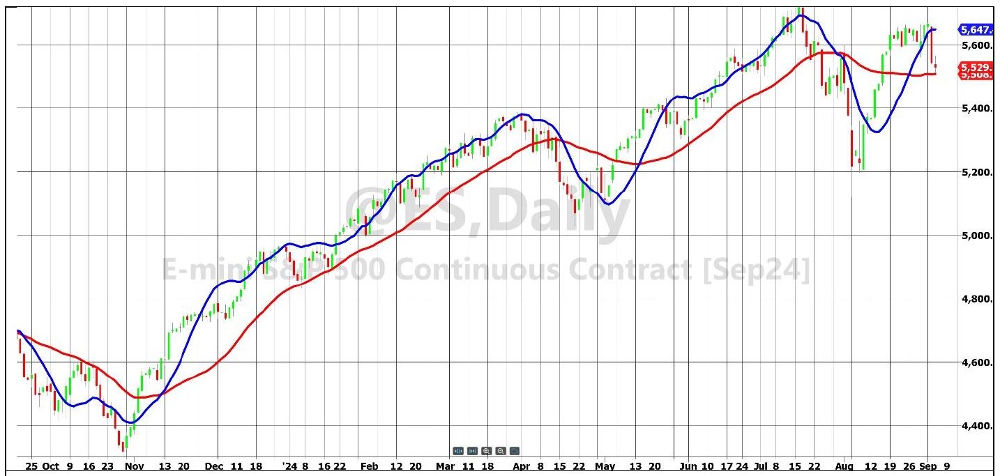
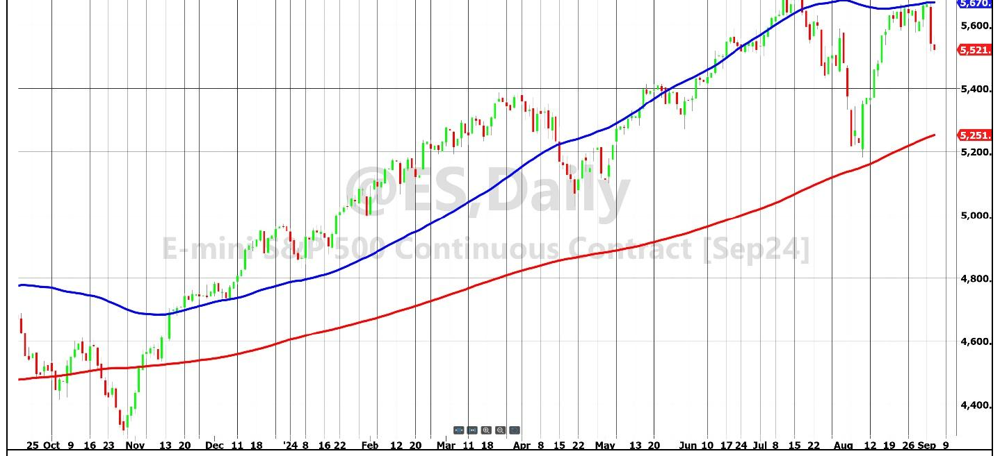
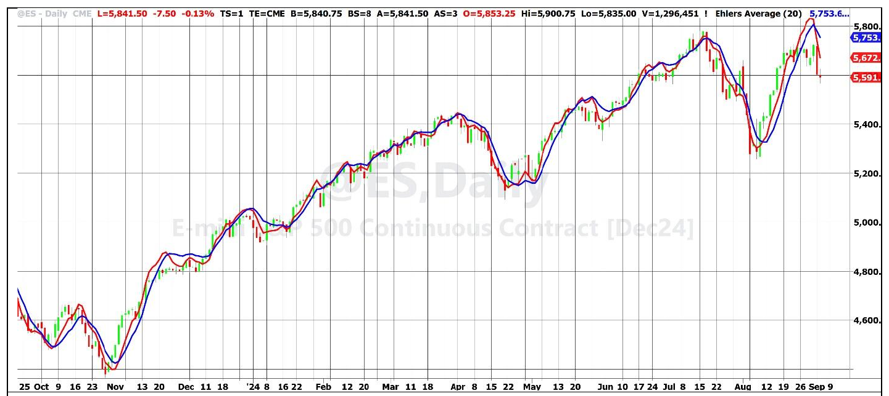
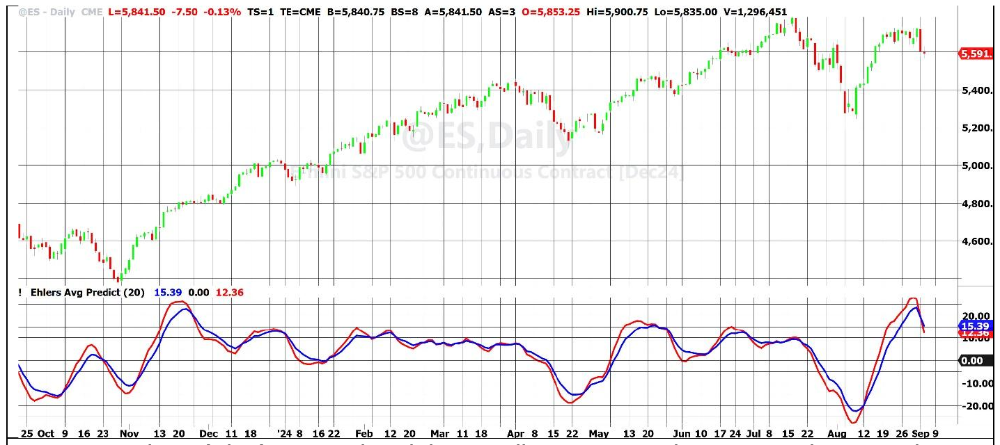

# Removing Moving Average Lag

**By John Ehlers**

- **Downloaded from:** [Mesa Software — Removing Moving Average Lag](https://www.mesasoftware.com/papers/Removing%20Moving%20Average%20Lag.pdf)

---

The best statistical estimate of a block of price values is the average of all the prices. When in a time series, the position of that estimate is in the center of the block along the time axis. That establishes a dot in the time-price space. A moving average is created by sequentially moving the block over one space in the time axis and then connecting the dots. The result is that the moving average indicator line lags the prices on the chart by half the length of data. Timing is important to a technical trader, and better trading results if the lag can be reduced. I will describe a new moving average that is superior to a SMA (Simple Moving Average) because it can provide a significant improvement in trade timing.

The slope of the time series block of data can be computed from the covariance in linear regression. The apparent lag of the moving average can be removed by adding the slope times half the length of the average to the average itself. The average is centered in the window along the time axis (because of the uniform sampling rate). The average is positioned vertically along the price axis. To move the average to the right-hand side of the window, it must move to the right by half the window width. The slope, determined from the covariance, determines the projection of the average vertically at the right-hand side of the window. The equation to do this is:

```
EhlersAverage = Average + Slope*Length / 2
```

By using slope to remove lag, the Ehlers Average can be considered as a first order prediction of a SMA. Also, formulated as counting backwards from the current bar, the Ehlers Average is the same as the "Y Intercept" of a linear regression. Figure 1 compares a 30 bar Simple Moving Average (SMA) in red with the 30 bar Ehlers Average in blue. Prices vary about the Ehlers Average due to the half-length projection rather having the SMA lag the prices.


**Figure 1. Ehlers Average (Blue) Is a Better Fit to Data Than a SMA (Red)**

It is common to use a 200 day moving average in technical analysis. Figure 2 compares the 200 day SMA to the 300 day Ehlers Average. When the lag is removed, the prices appear to be plotted as a deviation from the average line rather than as a trend crossing.


**Figure 2. Prices Appear as a Deviation from a 200 Day Ehlers Average (Blue). 200 Day SMA is shown in Red.**

I have written the Ehlers Average as a Function so that you can apply it to your charts as easily as applying a SMA. The EasyLanguage Function code for the Ehlers Average as well as the SMA is given in Code Listing 1. The name of the Function is `$EhlersAverage`. The dollar sign in the name moves this Function to the top of the code listings. The negative sign in the function to compute the slope results from computing the covariance from right to left, but the projection is applied left to right.

Code for plotting the Ehlers Average Indicator and its prediction is given in Code Listing 2. The prediction is a second order prediction, using the rate-change of slope for the calculation. You can also plot the SMA by removing the comment slash marks in the last line of the code. An example chart displaying the Ehlers Average in blue and its prediction, in red, is shown in Figure 3.


**Figure 3. Ehlers Average (Blue) and Its Prediction (Red) Crossings Identify Timely Buying and Selling Opportunities.**

Forming a prediction is a way of further reducing indicator lag. In the case of the Ehlers Average, the first order prediction is formed by adding the slope across half the data window to the value of the SMA.

The usefulness of almost any indicator can be enhanced by including its prediction because the prediction crossing the indicator forms events that flag buying and selling opportunities. In classical physics slope is analogous to velocity and distance is equal to velocity times time. That is $x = v \cdot t$. Acceleration is the rate-change of velocity, and distance is computed as $x = \frac{1}{2} a t^2$. In our case time is just the unit sampling rate. So, we can compute acceleration as one half of the two-bar difference of slope. The two-bar difference provides a zero in the transfer response at the Nyquist frequency, thereby reducing the high frequency chop in the calculation of the acceleration term compared to a one bar difference of slope.

The derivation of a generalized prediction of an indicator, where the indicator variable is "Smooth" is:

```
Prediction = Smooth + Velocity + .5*Acceleration
           = Smooth + Slope + .5*(Previous Slope – Slope)
           = Smooth + .5*Slope + .5*Previous Slope
           = Smooth + .5*(Smooth – Smooth[2]) + .5*(Smooth[2] – Smooth[4])
           = 1.5*Smooth – .5*Smooth[4]
```

The notation `Smooth[4]` means the value of the variable Smooth four bars ago.

The data slope computed in a linear regression is a high fidelity indicator of the price action with the trend removed. This slope is provided as an output of the `$EhlersAverage` Function. Slope is used to demonstrate a generalized oscillator and its generalized prediction is given in Code Listing 3. An example chart is shown in Figure 4.


**Figure 4. Slope (Blue) is a High Fidelity Oscillator Type Indicator. Prediction Indicator (Red) Crossings Identify Timely Buying and Selling Opportunities.**

## Conclusions

1. The Ehlers Average is a SMA (Simple Moving Average) with its lag removed.
2. SMA lag is removed by projecting the average, which is located at the center of the data window, to the right hand side of the data window by adding the slope times half the window length to the value of the average.
3. The Ehlers Average is the same as the Y Intercept of linear regression.
4. A second order prediction of the Ehlers Average is produced by adding a two bar difference of slope times half the window length to the Ehlers Average value.
5. A generalized second order prediction of any indicator line is computed as 1.5 times the indicator value less one-half the indicator value four bars ago.

---

## Code Listing 1. EasyLanguage Code for the $EhlersAverage Function

```easylanguage
{
$EhlersAverage Function
(C) 2024 John F. Ehlers
}
Inputs:
Price(numericseries),
Length(numericsimple),
EhlersAverage(numericref),
Slope(numericref),
SMA(numericref);

Vars:
count(0),
Sx(0),
Sy(0),
Sxx(0),
Syy(0),
Sxy(0);

Sx = 0;
Sy = 0;
Sxx = 0;
Syy = 0;
Sxy = 0;
For count = 1 to Length Begin
    Sx = Sx + count;
    Sy = Sy + Price[count - 1];
    Sxx = Sxx + count*count;
    Syy = Syy + Price[count - 1]*Price[count - 1];
    Sxy = Sxy + count*Price[count - 1];
End;
Slope = -(Length*Sxy - Sx*Sy) / (Length*Sxx - Sx*Sx);
SMA = Sy / Length;
EhlersAverage = SMA + Slope*Length / 2;

//Function Return Value
$EhlersAverage = 1;
```

## Code Listing 2. EasyLanguage Code for the Ehlers Average and Its Prediction

```easylanguage
{
Reduced Lag Moving Average
(C) 2024 John F. Ehlers
}
Inputs:
Length(20);

Vars:
ReturnValue(0),
EhlersAverage(0),
Slope(0),
SMA(0),
Predict(0);

ReturnValue = $EhlersAverage(Close, Length, EhlersAverage, Slope, SMA);
Predict = EhlersAverage + .5*(Slope - Slope[2])*Length;

Plot1(EhlersAverage);
Plot2(Predict);
//Plot3(SMA);
```

## Code Listing 3. EasyLanguage Code to Plot Slope and Its Prediction

```easylanguage
{
Slope and Its Prediction
(C) 2024 John F. Ehlers
}
Inputs:
Length(20);

Vars:
ReturnValue(0),
EhlersAverage(0),
Slope(0),
SMA(0),
Predict(0);

ReturnValue = $EhlersAverage(Close, Length, EhlersAverage, Slope, SMA);
Predict = 1.5*Slope - .5*Slope[4];

Plot1(Slope);
Plot2(0);
Plot3(Predict);
```

---

## BibTeX

```bibtex
@misc{ehlers_removing_ma_lag,
  author       = {John F. Ehlers},
  title        = {Removing Moving Average Lag},
  year         = {2026},
  howpublished = {online},
  url          = {https://www.mesasoftware.com/papers/Removing%20Moving%20Average%20Lag.pdf}
}
```
