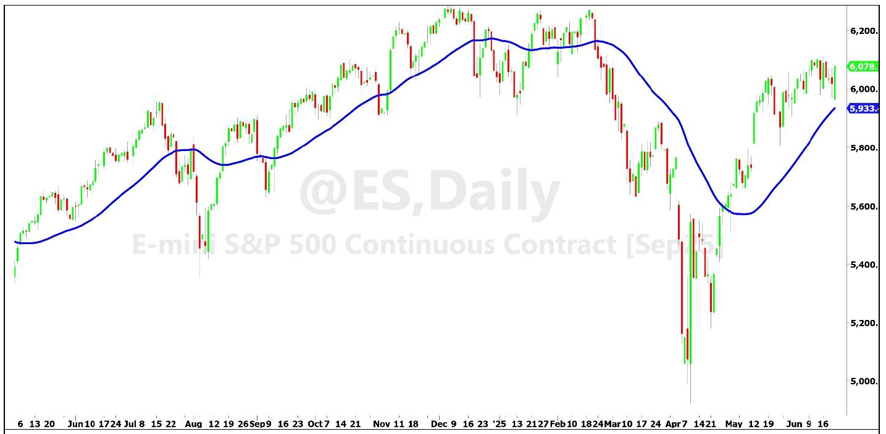
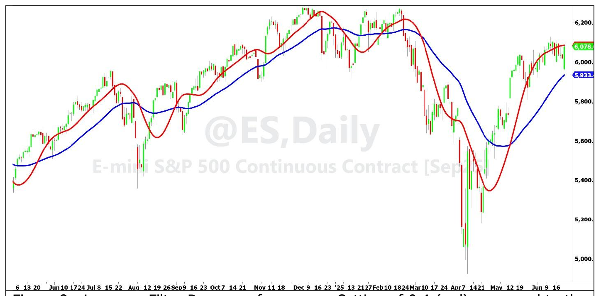
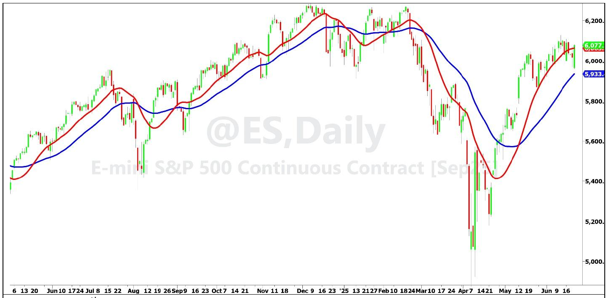
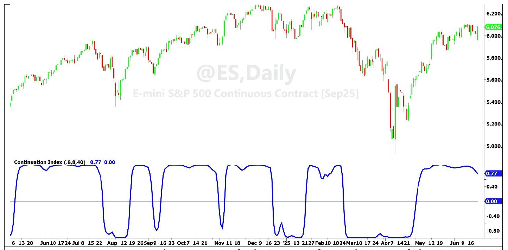

# Continuation Index

**By John Ehlers**

- **Downloaded from:** [Mesa Software — Continuation Index](https://www.mesasoftware.com/papers/Continuation%20Index.pdf)

---

The purpose of the Continuation Index (CI) is to provide a timely indication of the onset of a trend, continuation of that trend, and a timely indication of the trend exhaustion. With the assumption that the market is either trending up or trending down, the CI primarily has two states. If the Index has a value of +1, then the trading position should be long. If the Index has a value of -1, then the trading position should be flat or short; depending on your preferred trading style. Having only two states, the exhaustion of the trend in one direction is the same as the onset of a trend in the opposite direction except for a very short transition period.

The development of the Continuation Index started with the observation that a Laguerre Filter is reasonable representation of a trend, and when in a trend the prices tend to stay on one side of the filter or the other. The Laguerre filter is described in my book *Cybernetic Trading Indicators* and in a previous article in S&C Magazine. An example of an eighth order Laguerre Filter using a gamma of 0.8 is shown in Figure 1, demonstrating the trend characterization of the filter output and the position of prices relative to the filter line when the market is in an identifiable trend.


**Figure 1. A Laguerre Filter Shows the Market Trend Characteristic**

Almost all indicators require smoothing so you can make some sense of them, and the CI is no exception. An UltimateSmoother filter is used to minimize computational lag of the Index. The UltimateSmoother is also described in my book *Cybernetic Trading Indicators* and in a previous issue of S&C Magazine. The length of data used for the UltimateSmoother is half the length of the Laguerre Filter to further minimize computational lag.

The CI is basically formed by normalizing the difference between the UltimateSmoother and the Laguerre Filter to the average difference over the length of the Laguerre Filter. The aesthetics of the CI is enhanced by doubling the normalized difference and applying an Inverse Fisher Transform to compress the display to be approximately +1 or -1. That's it!

Since the change of state of the CI is caused by Price crossing the Laguerre filter, the timing of the crossing depends on the settings for the Laguerre filter. There are two parameters that control the filter response. These parameters are Gamma and the filter Order.

Gamma is a variable that can be set between zero and one, and primarily controls the filter response. When gamma is zero the Laguerre Filter is exactly the same as the UltimateSmoother. Figure 2 shows the Laguerre Filter response for a gamma of 0.4 (red), compared to the original Laguerre Filter response as in Figure 1 for a gamma of 0.8 (blue). While the smaller gamma value produces a faster state reversal, the penalty is the introduction of more whipsaw indications. It is probably a good idea to keep the value of gamma near the default setting of 0.8.


**Figure 2. Laguerre Filter Response for a gamma Setting of 0.4 (red) compared to the Response Using the Default gamma Setting of 0.8 (blue).**

The Order variable is the order of the Laguerre Filter, which can vary from 1 to 10. The primary impact of changing the order is to change the computational lag of the filter. When the order equals 1, the Laguerre Filter is exactly the same as an UltimateSmoother. Changing the lag of the filter has a greater influence on the timing of the state reversal of the CI. Figure 3 shows the Laguerre Filter response for an order of 4 (red) compared to the original Laguerre Filter response of order 8 (blue).

The Length input of the CI primarily affects the smoothness of the display. A good starting point for the Length is to use your desired time to be in a trade position. For example, if you want to hold a trade for a month, use Length = 20 (20 trading days). If you want to hold a trade for a quarter, use Length = 60 (60 trading days).


**Figure 3. 4th Order Laguerre Filter Response (red) compared to the Response of the Default 8th Order Filter (blue).**

The Continuation Index response using the default settings of gamma = 0.8 and Order = 8 is shown in Figure 4 for approximately one year of the Emini S&P Futures contract. It is clear that the state reversal is a timely signal for the onset of the trend in one direction and the exhaustion of the trend in the opposite direction. Departures of the CI value from +1 can be used as signals to "buy on a dip". Although less likely, there are signals to "sell short on a pop".


**Figure 4. Continuation Index Using Default Settings for Daily Bars of the Emini S&P Futures Contract.**

The most likely application of the CI uses daily bars. If your particular symbol has a trend bias, such as the market indexes, you probably want to use a long-only trading philosophy. On the other hand, there are markets such as Treasury Bonds or Gold Futures that can be profitably traded both long and short.

There is sufficient flexibility in the CI using the gamma, Order and Length inputs that it can be used to trade intraday data. In this case it is a pretty good idea to remove the daily opening gaps because these gaps distort the computed trend for a large portion of the day. Here are two lines of code to remove the opening gap from every bar during the day so you can trade the short term trends during the day on the degapped data:

```
If Time = SessionStartTime + BarSize Then gap = Open – Degap[1];
Degap = Close – gap;
```

The EasyLanguage code to compute the Continuation Index is given in Code Listing 1. This code uses the UltimateSmoother and Laguerre Filter functions given in Code Listings 2 and 3, respectively.

## Conclusion

The Continuation Index provides an early indication of a trend onset and an early indication of a trend exhaustion. The Continuation Index has two states: +1 to indicate a long position and -1 to indicate a flat or short position, depending upon your trading philosophy. Short term failures to hold a solid state value indicates an opportunity to add to your position by "buying on a dip" or conversely "sell short on a pop". The Continuation Index inputs provide flexibility to trade a wide variety of markets, including intraday.

---

## Code Listing 1. EasyLanguage Code for the Continuation Index

```easylanguage
{
Continuation Index
(C) 2025 John F. Ehlers
}
Inputs:
gama(.8),
order(8),
Length(40);

Vars:
US(0),
LG(0),
Ref(0),
Variance(0),
CI(0);

//Ultimate Smoother
US = $UltimateSmoother(Close, Length / 2);
//Laguerre Filter
LG = $Laguerre(Close, gama, order, Length);
//Average the filter difference
Variance = Average(AbsValue(US - LG), Length);
//Double the normalized variance
If Variance <> 0 Then Ref = 2*(US - LG) / Variance;
//Compress using an Inverse Fisher Transform
CI = (ExpValue(2*Ref) - 1) / (ExpValue(2*Ref) + 1);
plot1(CI);
Plot2(0);
```

## Code Listing 2. EasyLanguage Function for the UltimateSmoother

```easylanguage
{
$Ultimate Smoother Function
(C) 2025 John F. Ehlers
}
Inputs:
Price(numericseries),
Period(numericsimple);

Vars:
a0(0),
Q(0),
c1(0),
c2(0),
US(0);

Q = expvalue(-1.414*3.14159 / Period);
c1 = 2*Q*Cosine(1.414*180 / Period);
c2 = Q*Q;
a0 = (1 + c1 + c2) / 4;

If CurrentBar >= 4 Then
    US = (1 - a0)*Price + (2*a0 - c1)*Price[1] + (c2 - a0)*Price[2]
         + c1*US[1] - c2*US[2];
If CurrentBar < 4 Then US = Price;
$UltimateSmoother = US;
```

## Code Listing 3. EasyLanguage Function for the Laguerre Filter

```easylanguage
{
Laguerre Filter Function
(C) 2005-2022 John F. Ehlers
}

Usage: $Laguerre(Price, gama, Order, Length);

gama must be less than 1 and equal to or greater than zero
order must be an integer, 10 or less

Inputs:
Price(numericseries),
gama(numericsimple),
order(numericsimple),
Length(numericsimple);

Vars:
count(0),
FIR(0);

Arrays:
LG[10, 2](0);

//load the current values of the arrays to be the values one bar ago
For count = 1 to order Begin
    LG[count, 2] = LG[count, 1];
End;

//compute the Laguerre components for the current bar
For count = 2 to order Begin
    LG[count, 1] = -gama*LG[count - 1, 2] + LG[count - 1, 2]
                   + gama*LG[count, 2];
End;
LG[1, 1] = $UltimateSmoother(Price, Length);

//sum the Laguerre components
FIR = 0;
For count = 1 to order Begin
    FIR = FIR + LG[count, 1];
End;
$Laguerre = FIR / order;
```

---

## BibTeX

```bibtex
@misc{ehlers_continuation_index,
  author       = {John F. Ehlers},
  title        = {Continuation Index},
  year         = {2026},
  howpublished = {online},
  url          = {https://www.mesasoftware.com/papers/Continuation%20Index.pdf}
}
```
