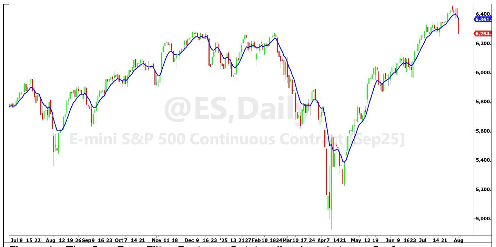

# The One Euro Filter

**By John F. Ehlers**

- **Downloaded from:** [Mesa Software — The One Euro Filter](https://www.mesasoftware.com/papers/The%20One%20Euro%20Filter.pdf)

---

The One Euro Filter was developed in 2012 by Georges Casiez, Nicolas Roussel, and Daniel Vogel. They gave it the name to suggest that it is cheap and efficient, like something you would buy for one Euro. Contrary to its depreciating name, the One Euro Filter displays outstanding low latency performance while providing data smoothing.

The One Euro Filter is an Exponential Moving Average (EMA) at its core, but having a dynamically tuned EMA coefficient. As an EMA, the filter always has unity gain, which means it can closely follow a trend without overshoot when the market direction reverses.

A smoothing filter is a low pass filter, passing the low frequency components in the data spectrum below its critical frequency and rejecting high frequency components above the critical frequency. The critical frequency is the frequency point where the amplitude response of the filter is half power (-3 dB) relative to its response at zero frequency. Wavelength is the reciprocal of frequency, and it is easier for traders to think in terms wavelengths rather than frequency. Therefore, I usually describe performance in terms of wavelength. I showed that the EMA coefficient alpha is related to the critical period as[^1]

```
α = 2π / (4π + Period)
```

With that background, here's how the One Euro Filter works: The current one-bar price difference is smoothed in the first EMA and a fraction of that value is added to the minimum critical period (an input parameter). The fraction is also an input parameter, Beta. The summation is used as the critical period to calculate the EMA coefficient used to compute the filtered output for the current bar. The process is repeated for the next bar, but the EMA coefficient is likely to have a different value. Thus, the adaptive process is in kind of a loop, dynamically adapting the final EMA gain with changes in the one bar volatility of the data.

The One Euro Filter is related to Tushar Chande's VIDYA (Variable Index Dynamic Average). With VIDYA, volatility is measured in one step and then that volatility is applied to modify the alpha of an EMA. It is also related to Perry Kaufman's KAMA (Kaufman Adaptive Moving Average). With KAMA the EMA alpha is based on the efficiency ratio, the ratio of trend to volatility. The two step process of the adaptive moving averages introduces lag due to computing volatility. On the other hand, the One Euro Filter immediately incorporates the current one-bar volatility in its adaptive behavior. Figure 1 shows a typical application to about one year's worth of daily data for the Emini S&P Futures contract.


**Figure 1. The One Euro Filter Features Outstanding Low Latency Performance**

The EasyLanguage code to compute the One Euro Filter is given in Code Listing 1. I have taken liberty from the original code to simplify the filter. For example, there are only two input parameters, the minimum length period to be used in the calculation of the EMA alpha and the fraction (Beta) of the smoothed one-bar volatility to also be used in that calculation. I also calculate both EMA alphas in terms of critical period rather than critical frequency.

You can convert the One Euro Filter to be an oscillator indicator by changing price to be the result of a high pass filter. For example, using the `$Highpass` function with a critical period of 54 bars, that line of code would be:

```
Price = $Highpass(Close, 54);
```

## In a Nutshell

The One Euro Filter is an adaptive moving average that adapts the filtering coefficient to the current volatility on a bar-by-bar basis. The average always has unity gain, so there is no overshoot at turning points in the market. The key feature of the One Euro Filter is its low latency.

---

## Code Listing 1. The One Euro Filter in EasyLanguage

```easylanguage
{
One Euro Filter Indicator
From "1Euro Filter: A Simple Speed-based Low-pass Filter for Noisy Input in
Interactive Systems" (CHI 2012)
By Georges Casiez, Nicolas Roussel, and Daniel Vogel
(c) 2025
John F. Ehlers
}
Inputs:
PeriodMin(10),      // Minimum cutoff frequency
Beta(0.2);           // Responsiveness factor

Vars:
Price(0),
PeriodDX(10),
AlphaDX(0),
SmoothedDX(0),
Cutoff(0),
Alpha3(0),
Smoothed(0);

Price = Close;
AlphaDX = 2*3.14159 / (4*3.14159 + PeriodDX);

// Initialize
If CurrentBar = 1 Then Begin
    SmoothedDX = 0;
    Smoothed = Price;
End;

//EMA the Delta Price
SmoothedDX = AlphaDX*(Price - Price[1]) + (1 - AlphaDX)*SmoothedDX[1];

//Adjust cutoff period based on fraction of the rate of change
Cutoff = PeriodMin + Beta*AbsValue(SmoothedDX);

//Compute adaptive alpha
Alpha3 = 2*3.14159 / (4*3.14159 + Cutoff);

//Adaptive smoothing
Smoothed = Alpha3*Price + (1 - Alpha3)*Smoothed[1];

//Plot
Plot1(Smoothed);
```

---

## BibTeX

```bibtex
@misc{ehlers_one_euro_filter,
  author       = {John F. Ehlers},
  title        = {The One Euro Filter},
  year         = {2026},
  howpublished = {online},
  url          = {https://www.mesasoftware.com/papers/The%20One%20Euro%20Filter.pdf}
}
```

[^1]: John Ehlers, "What is the Real Meaning of EMA Alpha", *Stocks & Commodities*, July 2024
