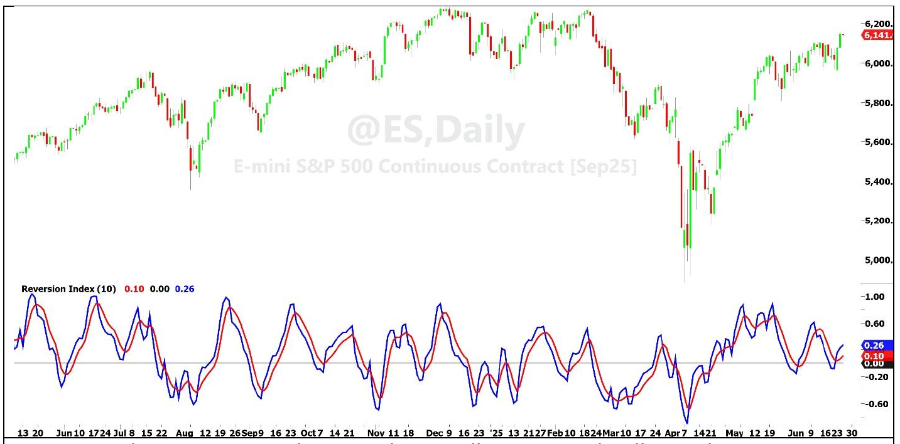

# Reversion Index

**By John F. Ehlers**

- **Downloaded from:** [Mesa Software — Reversion Index](https://www.mesasoftware.com/papers/Reversion%20Index.pdf)

---

The basic idea of the Reversion Index is simple. It is the short term sum of the bar-to-bar price differences normalized to the sum of the absolute values of those price differences. In an ideal world the Reversion Index swings from -1 to +1.

From a mathematical perspective, the sample-to-sample differences in sampled data is analogous to differentiation in calculus. The short term sum of those differences is analogous to integration in calculus. Since the opposite operations of differentiation and integration are employed, the operations cancel each other; and the result is that the Reversion Index is an accurate representation of price movement.

From a cycles perspective, the summation is maximum during the upswing segment of the cycle period. But the sum is referenced to the right-hand side of the data window, which lags the middle of that window by 90 degrees. The result is the same. The peak of the Reversion Index occurs at the peak swing in the data. Similarly, the valley of the Reversion Index occurs at the cycle valley of the data. The ideal length of the data window is half the cycle period of the data so that the summation is conducted over the range from the cycle valley to the cycle peak. For example, you expect a monthly cycle (20 trading days) in the stock indexes, so you would select a summation period of 10 in this case.

Of course, if the summation is conducted over a large number of samples the Index fails to identify the cyclic peaks and valleys. Rather, it can be described as an estimate of the trend over the longer period. That is not the intended use of the Reversion Index.

Since a short data window is used, the normalized sum of price differences is very irregular, making identification of the peaks and valleys difficult. For example, using the zero rate of change to sense the peaks and valleys is out of the question. The solution is to further smooth the summation with two SuperSmoother filters having different calculation lengths. Since the lag of the filters are proportional to their calculation lengths, the two filter plots cross almost exactly at the peaks and valleys in the price data. The suggested lengths of the SuperSmoother filters are 4 bars and 8 bars. The Reversion Index using a data window length of 10 is shown in Figure 1 below approximately one year of Emini S&P Futures data. The SuperSmoother crossings beyond thresholds of, say, ±0.3 provide excellent buy and sell short (or sell to exit) trading signals.


**Figure 1. The Reversion Index Provides Excellent Buy and Sell Signals**

The EasyLanguage code for the Reversion Index is given in Code Listing 1 and the function for the SuperSmoother is given in Code Listing 2.

## In a Nutshell

The Reversion Index provides timely buy and sell signals for reversion to the mean types of strategies. It is computed as the summation of bar-to-bar price differences normalized to the summation of the absolute amplitudes of those differences. The summation is conducted over approximately half the period of the dominant cycle contained within the data. Identification of the peaks and valleys is accomplished by the crossings of two SuperSmoothers having different calculation lengths.

---

## Code Listing 1. EasyLanguage Code for the Reversion Index

```easylanguage
{
Reversion Index
(C) 2025 John F. Ehlers
}
Inputs:
Length(10);

Vars:
DeltaSum(0),
AbsDeltaSum(0),
count(0),
Ratio(0),
Smooth(0),
Trigger(0),
Trigger1(0);

DeltaSum = 0;
AbsDeltaSum = 0;
For count = 0 to Length - 1 Begin
    DeltaSum = DeltaSum + Close[count] - Close[count + 1];
    AbsDeltaSum = AbsDeltaSum + AbsValue(Close[count] - Close[count + 1]);
End;
If AbsDeltaSum <> 0 Then Ratio = DeltaSum / AbsDeltaSum;

Smooth = $SuperSmoother(Ratio, 8);
Trigger = $SuperSmoother(Ratio, 4);

//Enhance crossover visibility
If Trigger >= Smooth Then Trigger1 = Trigger + .1 Else Trigger1 = Trigger - .1;

Plot1(Smooth);
Plot2(0);
Plot3(Trigger1);
```

## Code Listing 2. SuperSmoother Function

```easylanguage
{
$SuperSmoother Function
(C) 2025 John F. Ehlers
}
Inputs:
Price(numericseries),
Period(numericsimple);

Vars:
a0(0),
Q(0),
c1(0),
c2(0);

Q = expvalue(-1.414*3.14159 / Period);
c1 = 2*Q*Cosine(1.414*180 / Period);
c2 = Q*Q;
a0 = (1 - c1 + c2) / 2;

If CurrentBar >= 4 Then
    $SuperSmoother = a0*(Price + Price[1]) +
        c1*$SuperSmoother[1] - c2*$SuperSmoother[2];
If Currentbar < 4 Then $SuperSmoother = Price;
```

---

## BibTeX

```bibtex
@misc{ehlers_reversion_index,
  author       = {John F. Ehlers},
  title        = {Reversion Index},
  year         = {2026},
  howpublished = {online},
  url          = {https://www.mesasoftware.com/papers/Reversion%20Index.pdf}
}
```
