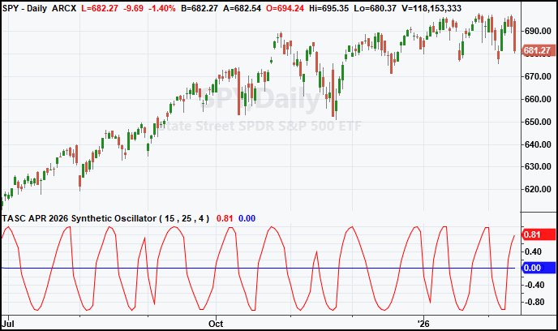
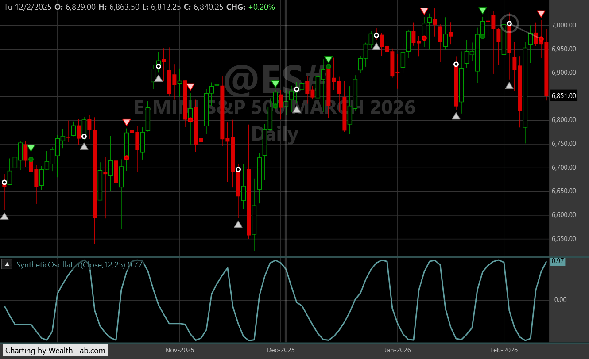
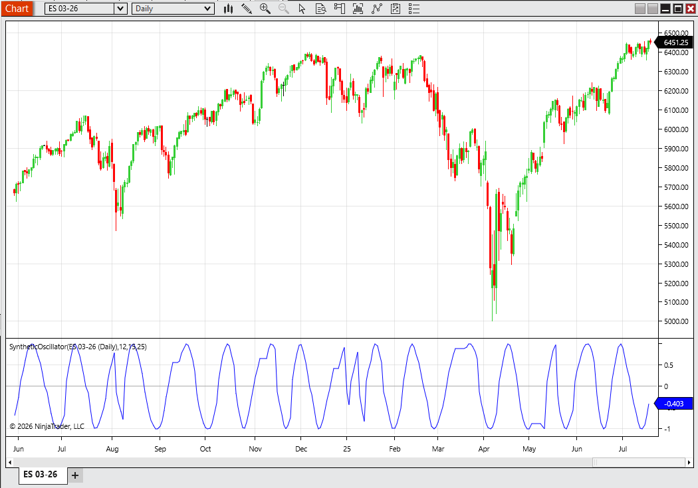
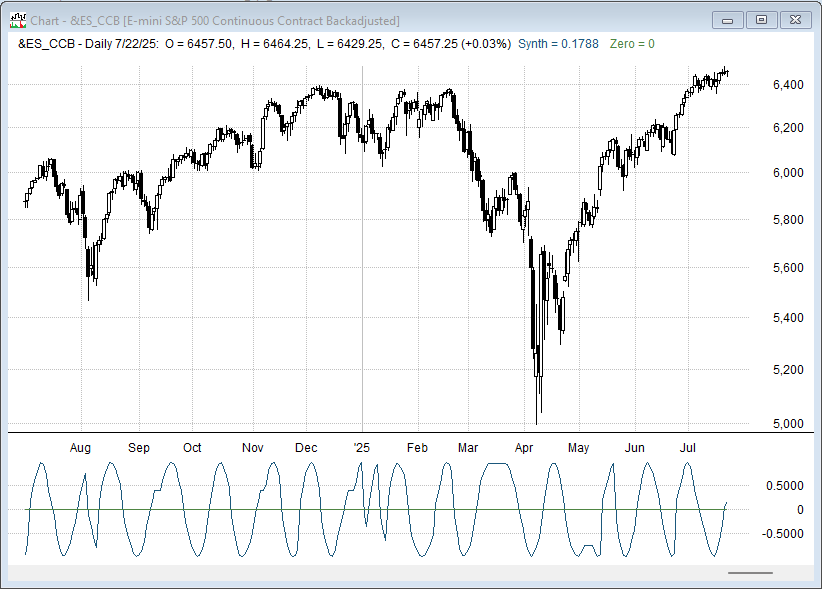
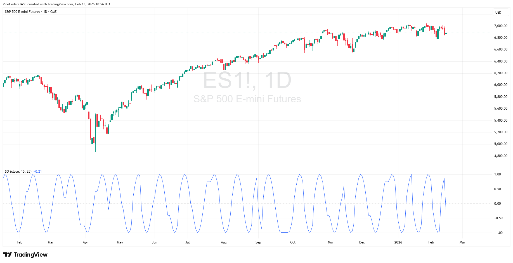
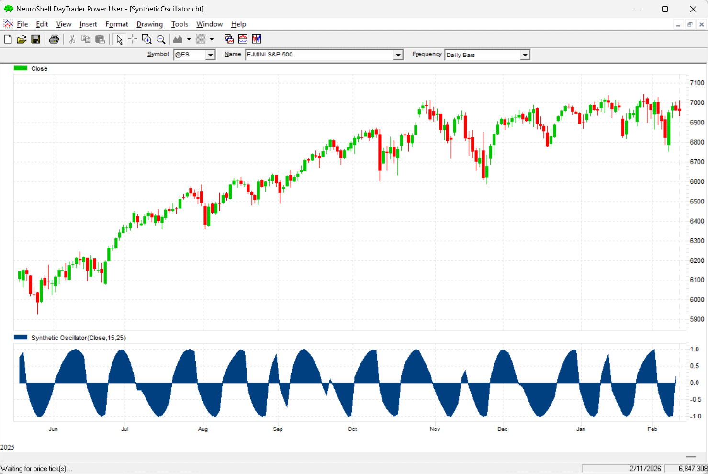
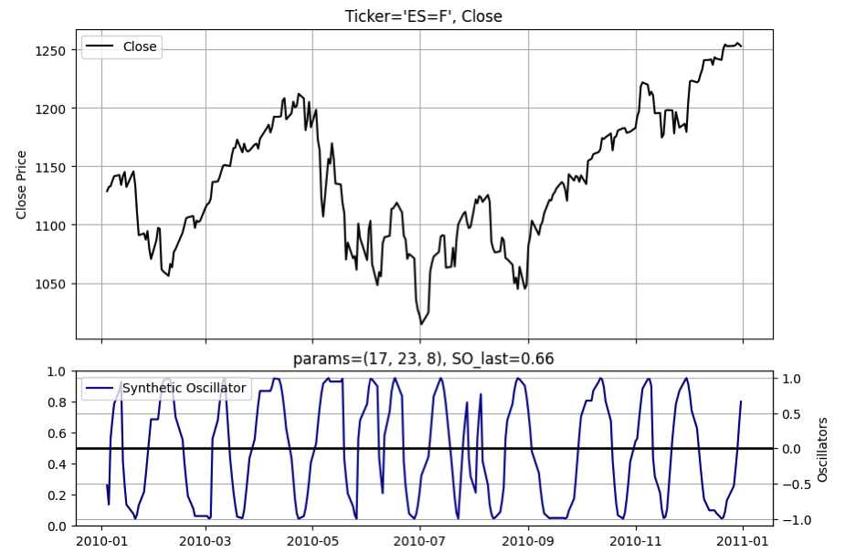
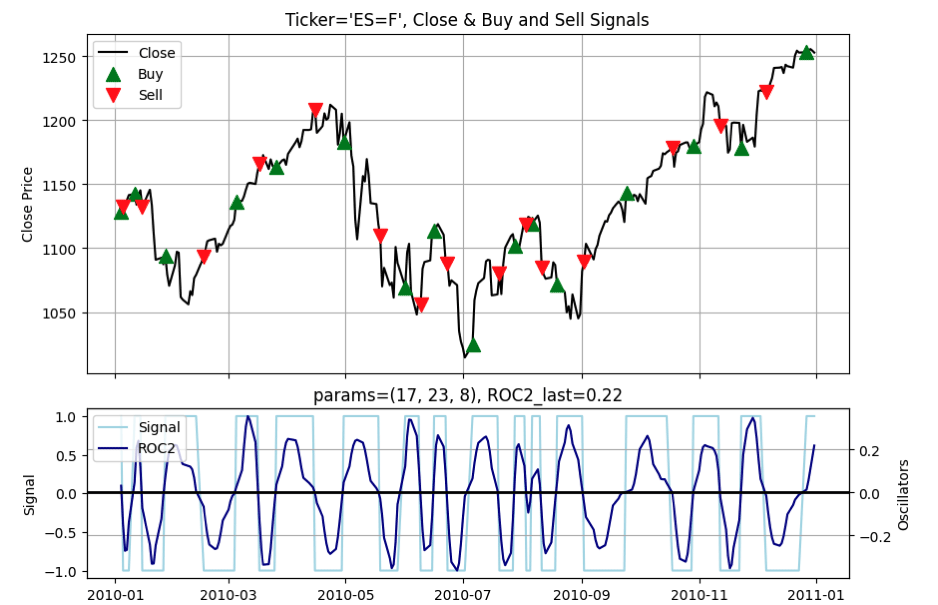

# Traders' Tips: April 2026

- **Article:** A Synthetic Oscillator by John F. Ehlers
- **Traders' Tips URL:** [Traders' Tips, April 2026](https://www.traders.com/Documentation/FEEDbk_docs/2026/04/TradersTips.html)

---

## TradeStation: April 2026

In "A Synthetic Oscillator" in this issue, John Ehlers introduces a nonlinear oscillator designed to reduce lag while maintaining smooth, responsive trading signals. The indicator adapts to changing market conditions by measuring the instantaneous dominant cycle period and using that measurement to construct a synthetic sine wave via phase accumulation.

EasyLanguage code for the indicator is shown here and a sample chart plotting the indicator is shown in Figure 1.


**FIGURE 1: TradeStation.** Sample chart.

```easylanguage
// See SyntheticOscillator.els for full code listing
```

*Full code: [SyntheticOscillator.els](SyntheticOscillator.els)*

—John Robinson  
TradeStation Securities, Inc.  
www.TradeStation.com

---

## Wealth-Lab.com: April 2026

In his article in this issue, John Ehlers introduces a synthetic oscillator he developed for reversion-to-the-mean-type trading.

In Wealth-Lab, users don't need to code it; they can simply drag and drop the `SyntheticOscillator` onto a chart from WealthLab's list of TASC preprogrammed indicators. This can easily be done using Wealth-Lab's building blocks.

For Wealth-Lab users who also want to see or use the C# code, this time with optimizable parameters, we are also showing that code below.


**FIGURE 2: Wealth-Lab.** Sample chart with entry/exit trades.

```csharp
// See SyntheticOscillator.cs for full code listing
```

*Full code: [SyntheticOscillator.cs](SyntheticOscillator.cs)*

—Robert Sucher  
Wealth-Lab  
www.wealth-lab.com

---

## NinjaTrader: April 2026

In "A Synthetic Oscillator" in this issue, John Ehlers introduces an indicator he developed. The synthetic oscillator discussed in the article is available for download at the following link for NinjaTrader 8:

Once the file is downloaded, you can import the indicator into NinjaTrader 8 from within the control center by selecting Tools → Import → NinjaScript Add-On and then selecting the downloaded file for NinjaTrader 8.

You can review the indicator source code in NinjaTrader 8 by selecting the menu New → NinjaScript Editor → Indicators folder from within the control center window and selecting the file.


**FIGURE 3: NinjaTrader.** Sample chart.

NinjaScript uses compiled DLLs that run native, not interpreted, to provide you with the highest performance possible.

*NinjaTrader source files: [ninja-trader/SyntheticOscillator.cs](ninja-trader/SyntheticOscillator.cs), [ninja-trader/HannFilter.cs](ninja-trader/HannFilter.cs), [ninja-trader/HighPassFilter.cs](ninja-trader/HighPassFilter.cs), [ninja-trader/RMS.cs](ninja-trader/RMS.cs), [ninja-trader/SuperSmoother.cs](ninja-trader/SuperSmoother.cs), [ninja-trader/UltimateSmoother.cs](ninja-trader/UltimateSmoother.cs)*

—Jesse N.  
NinjaTrader, LLC  
www.ninjatrader.com

---

## RealTest: April 2026

Provided here is coding for use in the RealTest platform to implement the indicator introduced in John Ehlers' article in this issue, "A Synthetic Oscillator."


**FIGURE 4: RealTest.** ES chart with oscillator.

```text
// See SyntheticOscillator.rtest for full code listing
```

*Full code: [SyntheticOscillator.rtest](SyntheticOscillator.rtest)*

—Marsten Parker  
MHP Trading  
mhp@mhptrading.com

---

## TradingView: April 2026

The TradingView Pine Script code presented here implements the synthetic oscillator presented in John Ehlers' article in this issue, "A Synthetic Oscillator."


**FIGURE 5: TradingView.** Sample chart.

```pine
// See SyntheticOscillator.pine for full code listing
```

*Full code: [SyntheticOscillator.pine](SyntheticOscillator.pine)*  
*Published script: [PineCodersTASC account](https://www.tradingview.com/u/PineCodersTASC/#published-scripts)*

—PineCoders, for TradingView  
www.TradingView.com

---

## NeuroShell Trader: April 2026

The synthetic oscillator, introduced in John Ehlers' article in this issue, "A Synthetic Oscillator," can be easily implemented in NeuroShell Trader using NeuroShell Trader's ability to call external dynamic linked libraries. Dynamic linked libraries can be written in C, C++, or Power Basic.

After moving the code given in the article to your preferred compiler and creating a DLL, you can insert the resulting indicator(s) as follows:

1. Select **New Indicator** from the Insert menu.
2. Choose the **User Function** category.
3. Select the appropriate DLL.

Users of NeuroShell Trader can go to the Stocks & Commodities section of the NeuroShell Trader free technical support website to download a copy of this or any previous Traders' Tips.


**FIGURE 6: NeuroShell Trader.** Sample chart.

—Ward Systems Group, Inc.  
sales@wardsystems.com  
www.neuroshell.com

---

## Python: April 2026

Provided here is Python code to implement concepts described in John Ehlers' article in this issue, "A Synthetic Oscillator."


**FIGURE 7: Python.** Synthetic Oscillator indicator plot.


**FIGURE 8: Python.** Buy/sell signals with Synthetic Oscillator ROC2.

```python
# See SyntheticOscillator.py for full code listing
```

*Full code: [SyntheticOscillator.py](SyntheticOscillator.py)*  
*Jupyter notebook: [other/Apr_2026_synthetic_oscilator_final.ipynb](other/Apr_2026_synthetic_oscilator_final.ipynb)*  
*GitHub: [github.com/jainraje/TraderTipArticles](https://github.com/jainraje/TraderTipArticles)*

—Rajeev Jain  
jainraje@yahoo.com

---

Originally published in the April 2026 issue of *Technical Analysis of STOCKS & COMMODITIES* magazine. All rights reserved. © Copyright 2026, Technical Analysis, Inc.

---

## BibTeX

```bibtex
@misc{traders_tips_2026_04,
  author       = {{Technical Analysis of STOCKS \& COMMODITIES}},
  title        = {Traders' Tips: April 2026 -- A Synthetic Oscillator},
  year         = {2026},
  howpublished = {online},
  url          = {https://www.traders.com/Documentation/FEEDbk_docs/2026/04/TradersTips.html}
}
```
