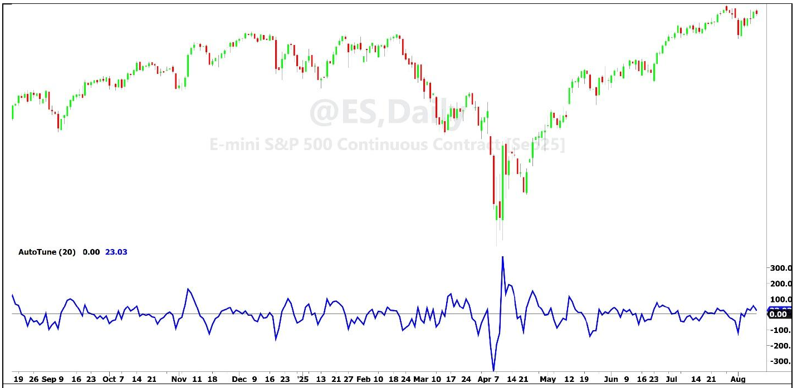
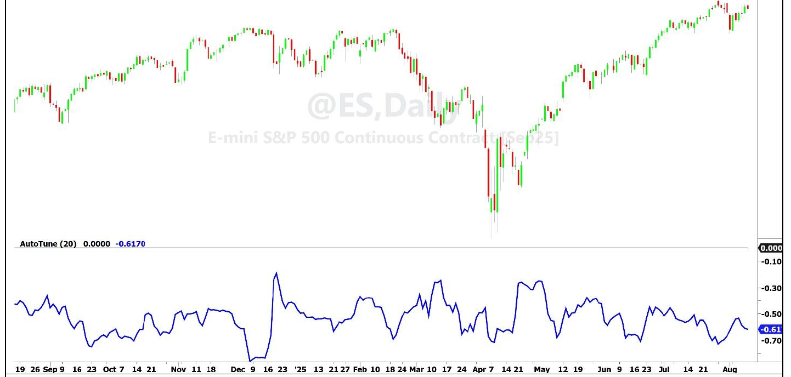
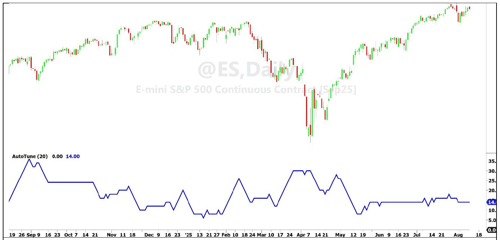
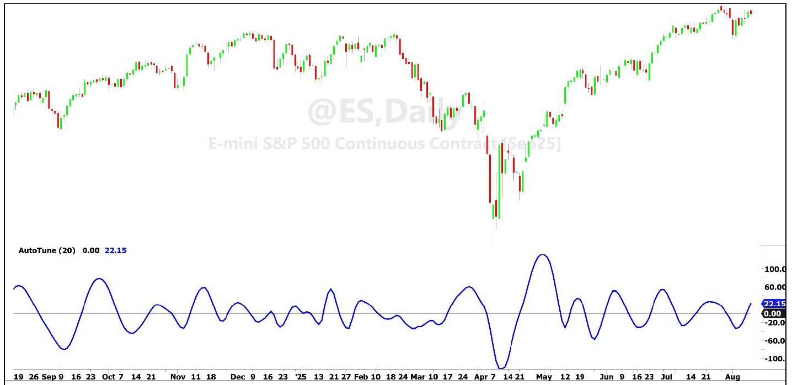
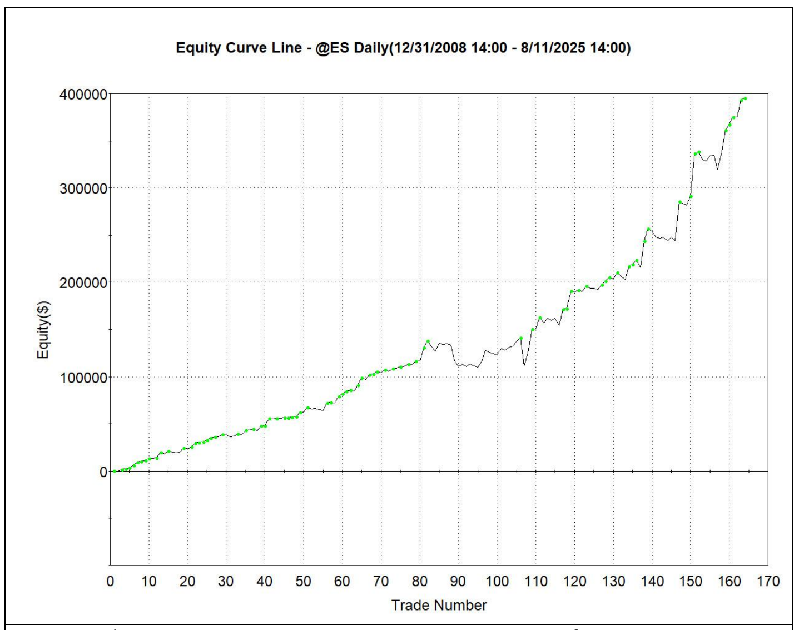

# The AutoTune Filter

**By John F. Ehlers**

- **Downloaded from:** [Mesa Software — The AutoTune Filter](https://www.mesasoftware.com/papers/The%20AutoTune%20Filter.pdf)

---

The Ornstein-Uhlenbeck process is a mathematical model often used to describe random price movements that tend to revert toward a mean. This process incorporates both randomness and a type of "friction" that pulls values back to equilibrium. In practical terms, this means that market prices can be simulated by applying an Exponential Moving Average (EMA) to a random number generator. For example, if you generate random numbers between 0 and 100 and then smooth them with an EMA, you'll get a time series that oscillates around a mean of 50 — closely resembling the behavior of actual market prices. This simple exercise highlights an important point: randomness, when filtered, can create patterns that look surprisingly similar to those we observe in financial markets. The challenge, however, is that meaningful analysis becomes difficult because the underlying data is still fundamentally random.

In the time domain, traders have given names to these apparent patterns: trends, waves, flags, pennants, support and resistance, and more. Throughout history, even astrology and numerology have been employed in attempts to explain these movements. Humans are naturally adept at identifying patterns. Our survival as a species has depended on spotting connections in our environment. But this strength can also mislead us. We often see patterns where none exist, such as constellations in the night sky, animals in cloud formations, or even the face of Elvis on a piece of burnt toast.

This tendency to overinterpret patterns has consequences for trading strategies. Traditional filters and indicators that are fixed in design often produce unsatisfactory results because they respond inconsistently to shifting patterns in the data. Adaptive filters, such as adaptive moving averages or Kalman filters, have been introduced as solutions; allowing the filter to adjust dynamically to market conditions. Yet these approaches also fall short. They are generally reactive rather than predictive, and volatility-based tuning parameters often fail to capture the underlying structure of the data.

A more effective approach is to step outside the time domain entirely and examine market data in the frequency domain. Fourier Theory teaches us that any time series waveform can be described equally well in terms of frequencies rather than time. For example, in the time domain, we might say that an EMA smooths irregular price fluctuations. In the frequency domain, however, we describe the same action as the EMA allowing only low-frequency components to pass through, while blocking high-frequency "noise." Put simply, filtering in the frequency domain means we're stripping out the short-term wiggles and keeping only the broader, slower-moving cycles.

The bridge between the time domain and frequency domain is provided by the autocorrelation function. Autocorrelation measures how a time series relates to itself when delayed by a certain lag. With a small lag, such as one bar, the correlation is very high — prices don't change dramatically from one bar to the next. With a lag of two or three bars, correlation quickly drops, and in many cases the series becomes effectively uncorrelated. This explains why even advanced predictive software like MESA[^1] can only forecast a few bars into the future with confidence.

However, when the lag is increased further, something unexpected happens: anticorrelation emerges. Anticorrelation means that the lagged data begins to move in the opposite direction of the current data. While the relationship is rarely perfect due to noise, there is typically a clear point where the correlation reaches its most negative value. After this minimum, correlation begins to increase again as the lag grows longer.

To better understand this, imagine the input as a pure tone — a perfect sine wave. In this case, autocorrelation gradually decreases until it reaches perfect anticorrelation at half the wavelength of the tone. At this lag, one wave's peaks align with the other's valleys. When the lag extends to a full wavelength, perfect correlation reappears. This alternating pattern of correlation and anticorrelation repeats indefinitely, creating a clear definition of the tone's period and frequency. This relationship is called a periodogram.[^2]

To describe this behavior in markets, I coined the term "Dominant Cycle". Unlike a pure tone with a fixed wavelength, the Dominant Cycle of price data is noisy and irregular, constantly shifting in time. Still, by identifying the lag where autocorrelation is most negative, we can calculate half the Dominant Cycle's period. Doubling this lag gives us the full cycle length.

The problem with fixed-tuned filters is that their transfer response changes unpredictably as the Dominant Cycle itself changes. In fact, phase shifts of 180 degrees are not uncommon. This means that a strategy built on signals from a filter that once worked well can suddenly begin giving completely inverted signals when the Dominant Cycle shifts.

The solution lies in being able to measure the Dominant Cycle in real time and then adapting our filters accordingly. This is the foundation of the AutoTune filter. By tuning dynamically to the Dominant Cycle, we can maintain consistent filter performance and avoid destructive phase shifts.

Having the means to measure the Dominant Cycle in real time has implications that trading strategies can be greatly improved.

## Practical Steps for Building an AutoTune Trading Strategy

1. Filter the data in a two pole Highpass filter. This provides for retention of only the spectral components we want to keep for autocorrelation. An added benefit is that the high frequency cycles all swing symmetrically about zero, giving the series a nominally zero mean.
2. Compute a rolling autocorrelation of the filtered data. The window length of the correlation calculations is the same as the critical period of the Highpass filter.
3. Identify the shortest lag of the autocorrelation with the most negative correlation. That is, the length giving the minimum anticorrelation. This is half the Dominant Cycle period.
4. Use the Dominant Cycle period computed on a bar-by-bar basis to tune a Bandpass filter.
5. Find the peaks and valleys of the Bandpass-filtered data by identifying when the rate of change crosses zero.
6. Trade the peaks and valleys of the Bandpass-filtered data as a return to the mean type of strategy.

This trading strategy works because the Bandpass filter is always tuned to the Dominant Cycle in the data, so that the phase shift in the transfer response of that filter is always constant.

Perhaps surprisingly, there can simultaneously be more than one Dominant Cycle in the data. In general, the Dominant Cycle period is proportional to the window length. This is consistent with the concept that market data has a pink noise spectrum. With a pink noise spectrum, the amplitude of the cycle swing is proportional to its wavelength. You can adjust the window length of the autocorrelation function to select the Dominant Cycle that provides the best results or that best fits your preferred trading frequency.

## AutoTune Implementation

The EasyLanguage code showing the process to develop the AutoTune filter is given in Code Listing 1. It uses the Highpass filter function given in Code Listing 3 and the Bandpass filter function given in Code Listing 4. There are five plot statements at the end of the code. The first of these is just plotting a zero reference line. Three of the four remaining can be commented out, with the uncommented line showing a particular aspect of the AutoTune filter construction. Figures 1 through 4 show these plots using approximately one year of daily data for the Emini S&P Futures contract and a rolling autocorrelation window value of 20.

Figure 1 shows the Highpass filtered data using a critical period of 20. The discerning eye can almost already identify the dominant cycle in the data because all of the longer wave components have been eliminated. An important characteristic is that this waveform has a nominally zero mean, removing trend bias from the autocorrelation computation.


**Figure 1. Highpass Filtered Data Has a Nominal Zero Mean**

Figure 2 shows the minimized value of the rolling autocorrelation function. Clearly, the minimum value never reaches -1, indicating a perfect anticorrelation. Nonetheless, having a minimizable value demonstrates there is a Dominant Cycle present in the data.


**Figure 2. The Minimum Rolling Autocorrelation Value Varies With Time**

Figure 3 shows the computed wavelength of the dominant cycle. The computed value can vary wildly from bar to bar, and so the variation has been limited to change no more than a length of 2 from the previous length.


**Figure 3. The Dominant Cycle Period Changes as a Function of Time**

The Dominant Cycle period is used to dynamically tune a Bandpass filter on a bar-by-bar basis, with the filtered response being shown in Figure 4. The bandwidth of the filter is arbitrarily set to be twenty five percent of its tuned center period. Peaks and valleys of the filtered waveform can visually identify the peaks and valleys in the price data. Therefore, identification of the smoothed peaks and valleys provide excellent timing for trade entries and exits.


**Figure 4. A Bandpass Filter Tuned Bar-by-Bar by the Rolling Autocorrelation Function Plots the Dynamic Dominant Cycle Response**

## Pro Forma Results

The EasyLanguage code for a Pro Forma always-in-the-market trading strategy using the AutoTune filter is given in Code Listing 2. This code is nearly the same as for the AutoTune indicator with the extension that the peaks and valleys are identified by the rate of change crossing over zero or crossing under zero, and those are the trade entries and exits. I often use a two bar difference to compute the rate of change because its transfer function has a zero in transmission for a two bar cycle period. This two bar difference therefore has a smoother response than a one bar difference. I included an additional rule that the value of the Highpass filter must be positive in order to enter a short position due to the upside bias in the data.

When the Pro Forma strategy was optimized from January 1, 2009 to the present for the Emini S&P Futures contract, the equity curve of Figure 5 was obtained. The optimized input parameters were: Window = 19, Bandwidth = 0.2, and Threshold = -0.3. I want to emphasize that Code Listing 2 is not intended to be a cookie-cutter strategy. Rather, the intent is to show that tuning to the Dominant Cycle period provides consistent performance over a 16 year span with hundreds of trades with wildly variable market conditions. It also passes the first test that the net profit over that span of time is 161% of that produced by buy-and-hold. There is substantially more work to be done to make a practical strategy. For example, the history contains a number of very large losing trades. Additional rules and stops need to be added to make these as small as possible. Also, the long side trades have 79.3% winners whereas the short side trades only have 40.5% winners. This suggests that the always-in-the-market approach should be abandoned in favor of independent rules for long and short positions.


**Figure 5. The Pro Forma AutoTune Strategy Has Consistent Performance Over 16 Years and All Kinds of Market Conditions**

## In a Nutshell

The rolling autocorrelation function provides a bridge between viewing market data in the time domain and in the frequency domain. The fact that the autocorrelation value can be minimized as a function of lag demonstrates there is, in fact, a Dominant Cycle in the data. The period of this Dominant Cycle is just twice the autocorrelation lag period at which the minimum autocorrelation value occurs. Tuning a Bandpass filter to the Dominant Cycle period gives a smooth replica of the price data that clearly identifies the price peaks and valleys. These peaks and valleys are the timing signals for reversion to the mean type strategies.

---

## Code Listing 1. The AutoTune Filter Indicator in EasyLanguage

```easylanguage
{
AutoTune Indicator
(C) 2025 John F. Ehlers
}
Inputs:
Window(20);

Vars:
Filt(0),
Lag(0),
J(0),
Sx(0),
Sy(0),
Sxx(0),
Sxy(0),
Syy(0),
X(0),
Y(0),
MinCorr(0),
DC(0),
BP(0);

Arrays:
Corr[100](0);

Filt = $Highpass(Close, Window);

//Cycle test waveform
//Filt = Sine(360*CurrentBar / 20);

//>>>>>>>>> Correlation >>>>>>>>>>>>
For Lag = 1 to Window Begin
    Sx = 0;
    Sy = 0;
    Sxx = 0;
    Sxy = 0;
    Syy = 0;
    For J = 0 to Window - 1 Begin
        X = Filt[J];
        Y = Filt[Lag + J];
        Sx = Sx + X;
        Sy = Sy + Y;
        Sxx = Sxx + X*X;
        Sxy = Sxy + X*Y;
        Syy = Syy + Y*Y;
    End;
    If (Window*Sxx - Sx*Sx > 0) and (Window*Syy - Sy*Sy > 0) Then
        Corr[Lag] = (Window*Sxy - Sx*Sy) /
            SquareRoot((Window*Sxx - Sx*Sx)*(Window*Syy - Sy*Sy));
End;

//Find minimum correlation and Dominant Cycle
MinCorr = 1;
For Lag = 1 to Window Begin
    If Corr[Lag] < MinCorr Then Begin
        MinCorr = Corr[Lag];
        DC = 2*Lag;
    End;
End;
If DC > DC[1] + 2 Then DC = DC[1] + 2;
If DC < DC[1] - 2 Then DC = DC[1] - 2;

BP = $Bandpass(Close, DC, .25);

Plot1(0, "", black, 1, 1);
Plot2(Filt, "", blue, 4, 4);
//Plot3(MinCorr, "", blue, 4, 4);
//Plot4(DC, "", blue, 4, 4);
//Plot5(BP, "", blue, 4, 4);
```

## Code Listing 2. The AutoTune Pro Forma Strategy in EasyLanguage

```easylanguage
{
AutoTune Pro Forma Strategy
(C) 2025 John F. Ehlers
}
Inputs:
BegDate(1090101),
EndDate(1251231),
Window(26),
BW(.22),
Thresh(-.22),
Delay(0);

Vars:
Filt(0),
Lag(0),
J(0),
Sx(0),
Sy(0),
Sxx(0),
Sxy(0),
Syy(0),
X(0),
Y(0),
MinCorr(0),
DC(0),
BP(0),
ROC(0);

Arrays:
Corr[100](0);

Filt = $Highpass(Close, Window);

//>>>>>>>>> Correlation >>>>>>>>>>>>
For Lag = 1 to Window Begin
    Sx = 0;
    Sy = 0;
    Sxx = 0;
    Sxy = 0;
    Syy = 0;
    For J = 0 to Window - 1 Begin
        X = Filt[J];
        Y = Filt[Lag + J];
        Sx = Sx + X;
        Sy = Sy + Y;
        Sxx = Sxx + X*X;
        Sxy = Sxy + X*Y;
        Syy = Syy + Y*Y;
    End;
    If (Window*Sxx - Sx*Sx > 0) and (Window*Syy - Sy*Sy > 0) Then
        Corr[Lag] = (Window*Sxy - Sx*Sy) /
            SquareRoot((Window*Sxx - Sx*Sx)*(Window*Syy - Sy*Sy));
End;

//Find minimum correlation and Dominant Cycle
MinCorr = 1;
For Lag = 1 to Window Begin
    If Corr[Lag] < MinCorr Then Begin
        MinCorr = Corr[Lag];
        DC = 2*Lag;
    End;
End;
If DC > DC[1] + 2 Then DC = DC[1] + 2;
If DC < DC[1] - 2 Then DC = DC[1] - 2;

BP = $Bandpass(Close, DC, BW);
ROC = BP - BP[2];

If ROC Crosses Over 0 and MinCorr < Thresh Then
    Buy Next Bar On Open;
If ROC Crosses Under 0 and MinCorr < Thresh and Filt > 0 Then
    Sell Short Next Bar on Open;
```

## Code Listing 3. Highpass Filter Function

```easylanguage
{
$Highpass Function
(C) 2025 John F. Ehlers
}
Inputs:
Price(numericseries),
Period(numericsimple);

Vars:
a0(0),
Q(0),
c1(0),
c2(0);

Q = expvalue(-1.414*3.14159 / Period);
c1 = 2*Q*Cosine(1.414*180 / Period);
c2 = Q*Q;
a0 = (1 + c1 + c2) / 4;

If CurrentBar >= 4 Then
    $HighPass = a0*(Price - 2*Price[1] + Price[2]) +
        c1*$HighPass[1] - c2*$HighPass[2];
If Currentbar < 4 Then $HighPass = 0;
```

## Code Listing 4. Bandpass Filter Function

```easylanguage
{
Bandpass Function
(C) 2005-2022 John F. Ehlers
}
Inputs:
Price(numericseries),
Period(numericsimple),
Bandwidth(numericsimple);

Vars:
G1(0),
S1(0),
L1(0),
BP(0);

L1 = Cosine(360 / Period);
G1 = Cosine(Bandwidth*360 / Period);
S1 = 1 / G1 - SquareRoot( 1 / (G1*G1) - 1);
BP = .5*(1 - S1)*(Price - Price[2]) + L1*(1 + S1)*BP[1] - S1*BP[2];

If CurrentBar < 3 Then BP = 0;
$BandPass = BP;
```

---

## BibTeX

```bibtex
@misc{ehlers_autotune_filter,
  author       = {John F. Ehlers},
  title        = {The AutoTune Filter},
  year         = {2026},
  howpublished = {online},
  url          = {https://www.mesasoftware.com/papers/The%20AutoTune%20Filter.pdf}
}
```

[^1]: John F. Ehlers, *Cybernetic Trading Indicators*, Chapter 20
[^2]: John F. Ehlers, "Drunkard's Walk: Theory and Measurement by Autocorrelation", *Stocks & Commodities*, February 2025
