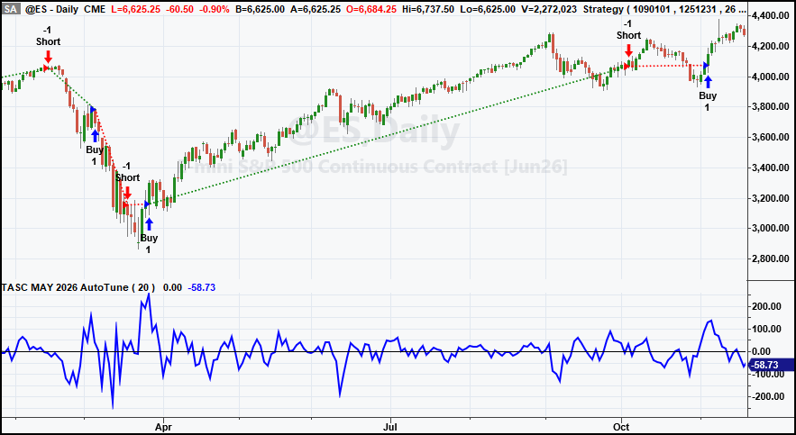
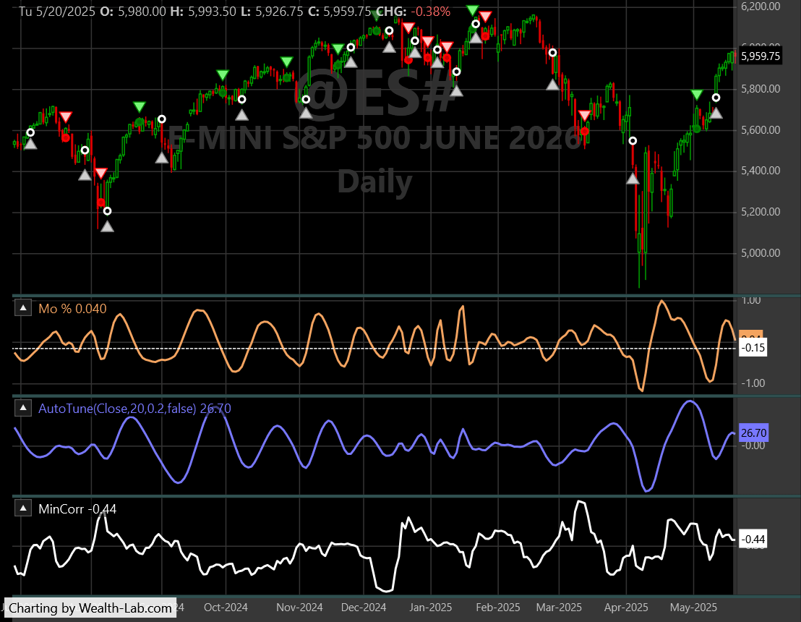
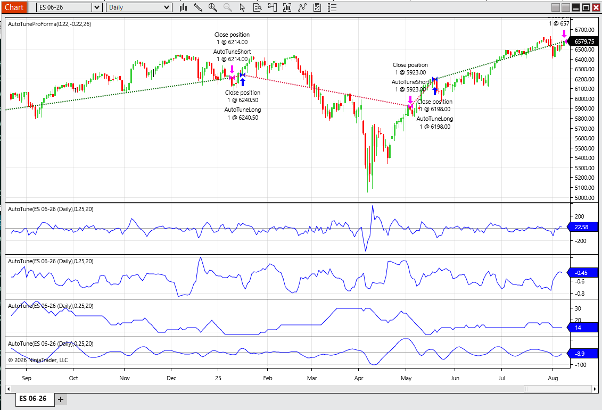
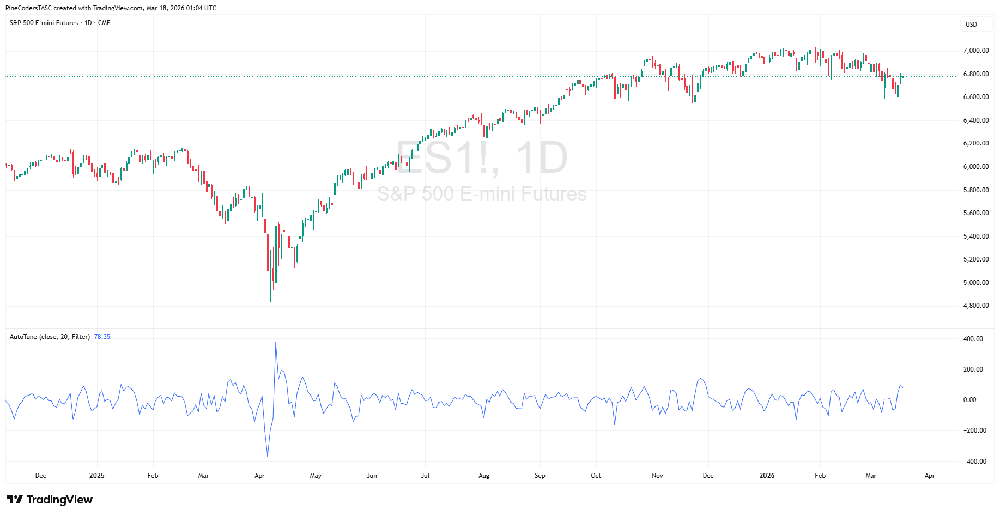
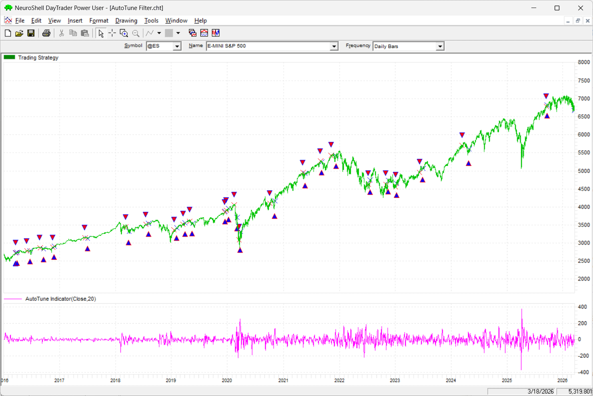
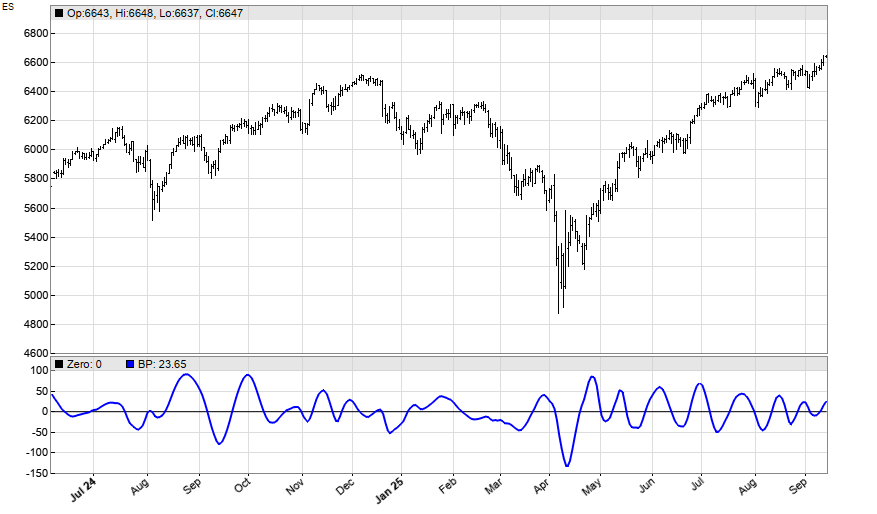
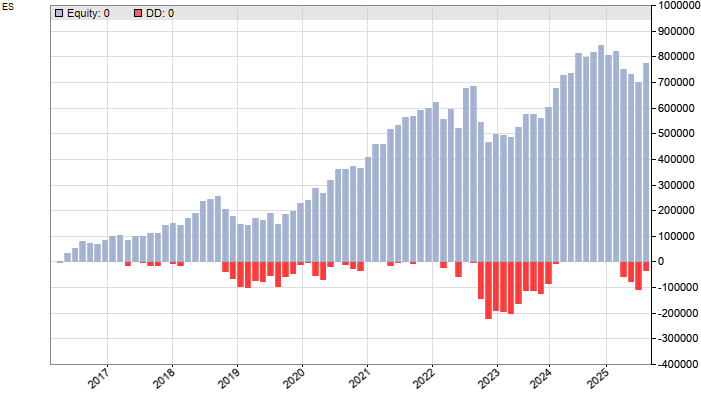

# Traders' Tips: May 2026

- **Article:** The AutoTune Filter by John F. Ehlers
- **Traders' Tips URL:** [Traders' Tips, May 2026](https://www.traders.com/Documentation/FEEDbk_docs/2026/05/TradersTips.html)

---

## TradeStation: May 2026

In "The AutoTune Filter" in this issue, John Ehlers presents an adaptive filter that measures dominant market cycles using rolling autocorrelation, then tunes a bandpass filter to produce smoother, more consistent mean-reversion signals with reduced phase distortion. The tuned bandpass output highlights peaks and troughs that can help identify potential market turning points. In the EasyLanguage code, plots 3, 4, and 5 of the charts have been commented out but can be enabled to display additional values, including the minimum autocorrelation used in cycle detection, resulting dominant cycle length, and tuned bandpass output.


**FIGURE 1: TradeStation.** Sample chart.

```easylanguage
{
AutoTune Indicator & Strategy
TradeStation EasyLanguage
}
// See AutoTune.els for full code listing
```

*Full code: [AutoTune.els](AutoTune.els)*

—John Robinson  
TradeStation Securities, Inc.  
www.TradeStation.com

---

## Wealth-Lab.com: May 2026

WealthLab code is provided here for implementation of the indicator described in John Ehlers' article in this issue, "The AutoTune Filter."

The indicator we are providing, named the AutoTune TASC indicator, has two versions: The first gives the output of the autotuned-to-dominant-cycle bandpass filter, but by passing `true` to the indicator's optional fourth parameter, you'll get the min correlation series for use in strategy rules. In our long-only C# version of the pro forma strategy, we normalized the ROC (rate of change) momentum oscillator and decided on a "turn up from under -0.15" as an entry rule.


**FIGURE 2: Wealth-Lab.** Sample chart.

```csharp
// See AutoTune.cs for full code listing
```

*Full code: [AutoTune.cs](AutoTune.cs)*

—Robert Sucher  
Wealth-Lab team  
www.wealth-lab.com

---

## NinjaTrader: May 2026

In "The AutoTune Filter" in this issue, John Ehlers presents an indicator he named the AutoTune indicator. An indicator based on the description given in the article is available for download at the following link for NinjaTrader 8:

Once the file is downloaded, you can import the indicator into NinjaTrader 8 from within the control center by selecting Tools → Import → NinjaScript Add-On and then selecting the downloaded file for NinjaTrader 8.

You can review the indicator source code in NinjaTrader 8 by selecting the menu New → NinjaScript Editor → Indicators folder from within the control center window and selecting the file.


**FIGURE 3: NinjaTrader.** Sample chart.

NinjaScript uses compiled DLLs that run native, not interpreted, to provide you with the highest performance possible.

*NinjaTrader source files: [ninja-trader/AutoTune.cs](ninja-trader/AutoTune.cs), [ninja-trader/AutoTuneProForma.cs](ninja-trader/AutoTuneProForma.cs), [ninja-trader/Bandpass2.cs](ninja-trader/Bandpass2.cs), [ninja-trader/HighPassFilter.cs](ninja-trader/HighPassFilter.cs)*

—Eduard  
NinjaTrader, LLC  
www.ninjatrader.com

---

## RealTest: May 2026

Provided here is coding for use in the RealTest platform to implement the AutoTune indicator described in John Ehlers' article in this issue, "The AutoTune Filter."

```
// See AutoTune.rtest for full code listing
```

*Full code: [AutoTune.rtest](AutoTune.rtest)*

—Marsten Parker  
MHP Trading  
mhp@mhptrading.com

---

## TradingView: May 2026

The TradingView Pine Script code presented here implements the AutoTune Filter as presented by John Ehlers in his article in this issue, "The AutoTune Filter."


**FIGURE 4: TradingView.** Sample chart.

```pine
// See AutoTune.pine for full code listing
```

*Full code: [AutoTune.pine](AutoTune.pine)*  
*Published script: [PineCodersTASC account](https://www.tradingview.com/u/PineCodersTASC/#published-scripts)*

—PineCoders, for TradingView  
www.TradingView.com

---

## NeuroShell Trader: May 2026

The indicator and demonstration strategy presented in John Ehlers' article in this issue, "The AutoTune Filter," can be easily implemented in NeuroShell Trader using NeuroShell Trader's ability to call external dynamic linked libraries. Dynamic linked libraries can be written in C, C++, or Power Basic.

After moving the code given in the article to your preferred compiler and creating a DLL, you can insert the resulting indicator(s) as follows:

1. Select **New Indicator** from the Insert menu.
2. Choose the **User Function** category.
3. Select the appropriate DLL.

Users of NeuroShell Trader can go to the Stocks & Commodities section of the NeuroShell Trader free technical support website to download a copy of this or any previous Traders' Tips.


**FIGURE 5: NeuroShell Trader.** Sample chart.

—Ward Systems Group, Inc.  
sales@wardsystems.com  
www.neuroshell.com

---

## The Zorro Project: May 2026

Any price curve is a mix of many long-term and short-term cycles. But once in a while, a dominant market cycle emerges and can be exploited for trading. In his article in this issue, "The AutoTune Filter," John Ehlers describes an algorithm for detecting such dominant cycles and using them to tune a bandpass filter. The EasyLanguage code given in the article can be directly converted to C for Zorro. In fact, ChatGPT does it in a few seconds. First, here is the cycle detector:

```c
// AutoTune cycle detector — see AutoTune.c for full code
var AutoTune(vars Data, int Window)
{
    Filt = HighPass3(Data, Window);
    // ... rolling autocorrelation ...
    return DC;  // dominant cycle period
}
```

The output is then used for the center frequency of a bandpass filter. Since Zorro has already a bandpass filter in its arsenal, I named it "BandPass2". Here is the code for reproducing Ehlers' ES chart in the article:

```c
function run()
{
    BarPeriod = 1440;
    StartDate = 2024;
    EndDate = 2025;
    asset("ES");
    var DC = AutoTune(seriesC(), 20);
    var BP = BandPass2(seriesC(), DC, 0.25);
    plot("Zero", 0, NEW, BLACK);
    plot("BP", BP, LINE, BLUE);
}
```


**FIGURE 6: Zorro.** ES chart with tuned bandpass output.

The tiny differences to Ehlers' chart are caused by generating a continuous curve from ES futures contracts, which depends on the most recent contract.

Next, we will use the bandpass output for a trading signal. We will use walk-forward analysis, not in-sample optimization, to produce realistic results here in our test. We will set up the strategy to reinvest profits using the square root rule.

```c
function run()
{
    BarPeriod = 1440;
    StartDate = 2010;
    EndDate = 2025;
    Capital = 100000;
    asset("ES");
    // ... walk-forward optimized strategy
}
```


**FIGURE 7: Zorro.** Equity curve from walk-forward analysis.

Training and testing produces the realistic equity curve shown in Figure 7. This curve does not look as impressive as the sample equity curve shown in Ehlers' article based on the pro-forma strategy, but the CAGR is in the 25% area, which is a much better performance than a buy-and-hold strategy.

*Full code: [AutoTune.c](AutoTune.c)*  
*Download from: [2026 script repository](https://financial-hacker.com)*

—Petra Volkova  
The Zorro Project by oP group Germany  
https://zorro-project.com

---

## Python: May 2026

Provided here is Python code to implement concepts described in John Ehlers' article in this issue, "The AutoTune Filter."

```python
# See AutoTune.py for full code listing
```


**FIGURE 8: Python.** AutoTune Filter indicator plot.

*Full code: [AutoTune.py](AutoTune.py)*  
*Jupyter notebook: [other/May_2026_autotune_filter.ipynb](other/May_2026_autotune_filter.ipynb)*  
*GitHub: [github.com/jainraje/TraderTipArticles](https://github.com/jainraje/TraderTipArticles)*

—Rajeev Jain  
jainraje@yahoo.com

---

Originally published in the May 2026 issue of *Technical Analysis of STOCKS & COMMODITIES* magazine. All rights reserved. © Copyright 2026, Technical Analysis, Inc.

---

## BibTeX

```bibtex
@misc{traders_tips_2026_05,
  author       = {{Technical Analysis of STOCKS \& COMMODITIES}},
  title        = {Traders' Tips: May 2026 -- The AutoTune Filter},
  year         = {2026},
  howpublished = {online},
  url          = {https://www.traders.com/Documentation/FEEDbk_docs/2026/05/TradersTips.html}
}
```
