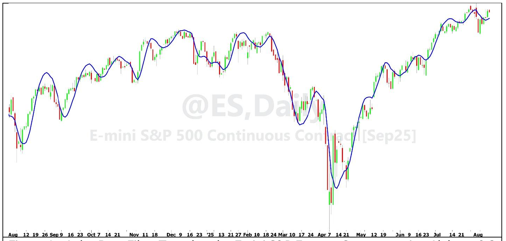
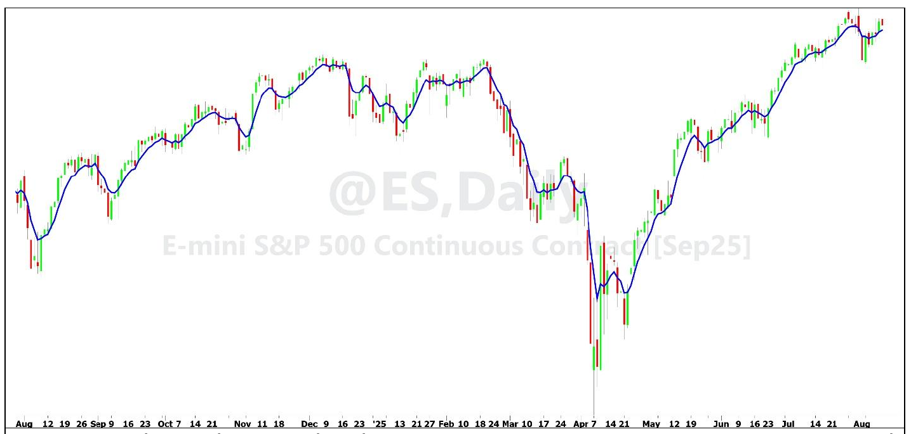

# The Kalman Filter Versus the Alpha-Beta Filter

**By John F. Ehlers**

- **Downloaded from:** [Mesa Software — Kalman and Alpha-Beta Filters](https://www.mesasoftware.com/papers/Kalman%20and%20Alpha-Beta%20Filters.pdf)

The purpose of this article is to dispel some of the mysteries surrounding the Kalman Filter and Alpha-Beta filters. Both are recursive filters that are extensions of the Exponential Moving Average (EMA). Both have been used extensively in ballistics. The terminology used is often in the context of ballistics, which can lead to difficulty in understanding their processes. For example, "Estimate" refers to the filter output; "Position" is a data point, and "Velocity" is the rate of change between two data points. In addition, ballistics studies are conducted in three dimensions, leading to a Kalman error covariance matrix. Filtering price data is a much more simple one dimensional problem; prices can only go up or down, and the data is sampled at a uniform rate.

Since both filters are extensions of an EMA, let's start with that filter. The usual equation for an EMA is:

```
EMA = α*Close + (1 - α)*EMA[1];
```

Where EMA[1] means the value of EMA one bar ago.

This is a neat and tidy equation that can be directly derived from the Z Transform response of a one pole filter. It is easily seen that the filter has unity gain at zero frequency because the two coefficients sum to one.

It may be instructive to see how the EMA is derived as a recursive filter. The new value of the filter starts with the previous filtered value, and then new data is added. That new data is the fraction of the difference between the Price and the previous filtered value. The selected fraction is identified as alpha. So, the equation for an EMA from a recursion perspective is:

```
EMA = EMA[1] + α * (Close - EMA[1]);
```

With a little algebra manipulation, this equation for an EMA is exactly the same as the first equation. It is this form of the EMA that we will see in both the Kalman filter and the Alpha-Beta filter.

## Alpha-Beta Filter

The Alpha-Beta filter is perhaps best described with reference to the code in Code Listing 1. The code is exercised from top to bottom with each bar on the chart. Without initialization, we can start analyzing the code at any point because it is recursive. So, let's start with the EMA equation, where the Alpha-Beta version of the EMA is called AB. After the EMA-type calculation using the Alpha term, a correction term called velocity is computed as the previous velocity plus Beta times the error difference between the current close and the current value of AB. Then, on the next bar, the new value of AB is computed as the old value of AB plus the velocity term. The name of the velocity variable is taken directly from the filter's usage in ballistics. After the new AB is formed in the prediction step, the new value of AB is computed in the EMA equation. The process is repeated on every bar.

Tuning the Alpha-Beta filter is done heuristically. A suggested procedure is to start with a preferred value of Alpha used in an EMA and setting the value of Beta to zero. This results in the filter being exactly the same as an EMA. Next, increase the value of Beta to be about five percent (0.05) the value of alpha. You will see the velocity correction start to form. You get increased velocity correction as you increase Beta. The results of the Alpha-Beta filter are shown in Figure 1 where the settings are Alpha = 0.2 and Beta = 0.1.


**Figure 1. Alpha-Beta Filter Tuned to the Emini S&P Futures Contract, using Alpha = 0.2 and Beta = 0.1**

The effect of making Beta larger is to make the filter values snug up closer to the price values when the market is in a trend. However, the velocity corrections tend to be retained in the Alpha memory part of the filter, with the result that overshoots are created when the trend stops and reverses. The overshoot can be very large if you overdo it with the value of Beta.

## Kalman Filter

The Kalman filter is also perhaps best described with its code listing, in Code Listing 2. Just like the Alpha-Beta filter, the Kalman filter is recursive; with the code being exercised on every bar from top to bottom. Starting with the last line of code before the print statement, it is seen that the expression for a Kalman filter is exactly the same as an EMA except that Kalman Gain has replaced Alpha. Kalman gain is variable, depending on the measurement noise and process noise. On the very next bar after the plot statement the new value of the Estimate Error is computed by reducing the old Estimate Error by the complement of the Kalman gain and increasing it by the value of the Process Noise (Q). Next, the old value of Kalman gain is reduced by adding the Measurement Noise (R) to the old value of Kalman gain and dividing that sum into the old Kalman gain. Then, the new Kalman gain is applied to the filter for plotting on the current bar.

Performance of the Kalman filter is dominated by the selection of the input values for Measurement Noise and Process Noise. Therefore, it is imperative to understand the meaning of these values. Process Noise is information that is not included in the filtering model. Assume the model is built for ballistics but you want to plot the position of an automobile using the Kalman filter. The acceleration and braking of the automobile are not built into the ballistics model and therefore constitute Process Noise in this example. Since the values of process noise are not known, an average dimensionless number is a filter input. Measurement noise is more direct if you know the accuracy of your sensors.

For trading, a reasonable estimate of Measurement Noise (R) is the absolute difference between the closing price and the average of the high and low prices of a single data bar, normalized to the closing price. I got an average value on the order of 0.005 for daily bars of the Emini S&P Futures contract.

The tuning procedure for a Kalman filter is to pick the value of Measurement Noise (R). Then start with a value of Process Noise (Q) that is 1/1000th the value of the Measurement Noise. This will give you a filter response like a rather lazy EMA. Increase the value of the Process Noise (Q) until you reach your desired filter shape. Different values of R and Q can produce similar filter results, particularly if their ratio is the same, but their rate of convergence will be different.

There are some interesting variants to the simple Kalman filter that can be introduced to obtain a marginal in the Kalman filter response. For example, the dynamic measurement noise can be used as a variable instead of a static number. This reduces the tuning complexity of the filter. Here are two candidates:

```
R = AbsValue((High + Low) / 2 - Close) / Close;
```

OR

```
R = (High - Low) / Close;
```

In addition, the variation in velocity can be included in the model by assigning the normalized bar-to-bar difference in price, multiplied by a constant, as the Process Noise variable. The Multiplier would be the indicator input value to scale the amplitude of the Process Noise. The line of code to do this is:

```
Q = Multiplier * AbsValue(Close - Close[1]) / Close;
```

Computed values for Measurement Noise (R) and Process Noise (Q) introduce high frequency noise in the Kalman filter output response. Therefore, it is a good idea to smooth the computed values before they are applied to the Kalman filter.

There are enough tuning controls and variations in the Kalman filter that it can be almost anything you want it to be.


**Figure 2. Kalman Filter Tuned to the Emini S&P Futures Contract, Using R = 0.005 and Q = 0.0005.**

## Conclusions

The Alpha-Beta filter and Kalman filter are recursively computed variants of the EMA. These filters more closely model price action than an EMA and have less lag than adaptive moving averages because the adaptive moving averages first measure volatility and then apply that measurement to alter the Alpha of an EMA in a two-step process. The input parameters of both filters are determined heuristically. In my opinion, the goodness of the filter response is largely subjective.

Just because I have described the Alpha-Beta and Kalman filters does not mean that I endorse them as an answer to a maiden's prayer. As a matter of fact, I think there are superior filters available to traders. For example, the UltimateSmoother[^1] offers a minimum amount of lag for a reasonable amount of smoothing; the SuperSmoother[^2] provides an excellent compromise between smoothing and lag with its second order response; and the Hann-windowed[^3] FIR filter gives excellent smoothing when lag is not a great concern.

[^1]: John F. Ehlers, *Cybernetic Trading Indicators*, 2025, Chapter 9
[^2]: Ibid, Chapter 6
[^3]: Ibid, Chapter 4

---

## Code Listing 1. Alpha-Beta Filter in EasyLanguage

```easylanguage
{
Alpha-Beta Filter
(c) 2025
John F. Ehlers
}
Inputs:
Alpha(0.2),
Beta(0.1);

Variables:
AB(0),
Velocity(0);

If CurrentBar = 1 Then AB = Close;

// Prediction step
AB = AB + Velocity;

// Correction step
AB = AB + Alpha * (Close - AB);
Velocity = Velocity + Beta * (Close - AB);

Plot1(AB);
```

## Code Listing 2. Kalman Filter in EasyLanguage

```easylanguage
{
Kalman Filter
(c) 2025
John F. Ehlers
}
Inputs:
R(.005),            //Measurement Noise
Q(.0005);           //Process Noise

Vars:
EstimateError(0),
KalmanGain(1),
Kalman(0);

If CurrentBar = 1 Then Kalman = Close;

EstimateError = (1 - Kalmangain)*EstimateError[1] + Q;
KalmanGain = EstimateError / (EstimateError + R);
Kalman = Kalman[1] + KalmanGain*(Close - Kalman[1]);

Plot1(Kalman);
```

---

## BibTeX

```bibtex
@misc{ehlers_kalman_alpha_beta,
  author       = {John F. Ehlers},
  title        = {The Kalman Filter Versus the Alpha-Beta Filter},
  year         = {2026},
  howpublished = {online},
  url          = {https://www.mesasoftware.com/papers/Kalman%20and%20Alpha-Beta%20Filters.pdf}
}
```
