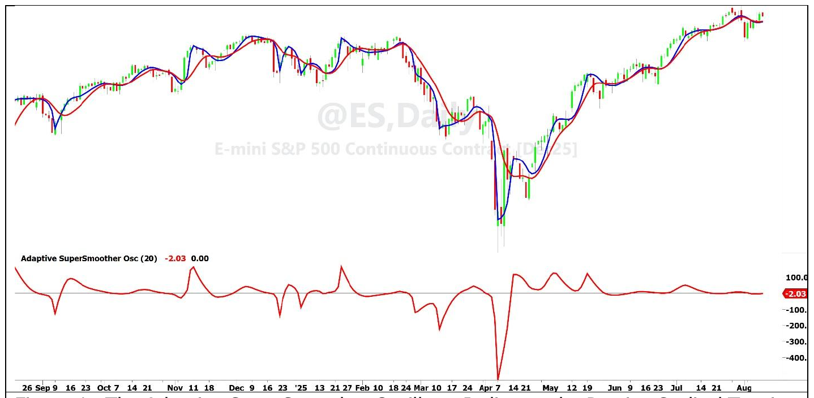

# Adaptive SuperSmoother

**By John F. Ehlers**

- **Downloaded from:** [Mesa Software — Adaptive SuperSmoother](https://www.mesasoftware.com/papers/Adaptive%20SuperSmoother.pdf)

---

There is a plethora of adaptive moving averages. Among them are: KAMA, VIDYA, ALMA, One Euro filter, and the Alpha Beta filter. I might even include the Kalman filter in this category. Each of these have an Exponential Moving Average (EMA) at their core. They are made adaptive by measuring volatility one way or another, and then using that volatility measurement to adjust the EMA alpha.

The problem is that the EMA is just not a very good filter. Let's take a look at how really bad it is. In EasyLanguage the EMA is easily written as:

    Out = alpha*In + (1 - alpha)*Out[1];

Where `Out[1]` is the value of the output one bar ago. Rearranging to put the output on one side of the equation, it becomes

    Out - (1 - alpha)*Out[1] = alpha*In

The transfer response of a filter is the ratio of the output to the input. With Z transforms, the symbol Z⁻¹ means one bar of delay. Therefore, the transfer response of an EMA as a Z transform is

    H = alpha / (1 - (1 - alpha)*Z⁻¹)

At the highest possible frequency (Nyquist) for sampled data Z⁻¹ is equal to -1. Therefore, the maximum attenuation of the filter is

    H = alpha / (2 - alpha)

The EMA alpha is related to the critical period of the filter by the equation

    alpha = 2*PI / (4*PI + Period)

For example, if the filter critical period is 12 bars, the EMA alpha value is approximately 0.25. As a result, the EMA maximum attenuation is 0.143, or about -17 dB. That result makes an EMA a pretty wimpy filter.

## Use a SuperSmoother Instead of an EMA

In my opinion, a SuperSmoother filter should be used in almost all trading applications instead of an EMA because of its improved filter performance. The EMA transfer response has a first order polynomial in its denominator, whereas the SuperSmoother has a second order polynomial in its transfer response. In addition, the SuperSmoother has a zero of transmission in its transfer response at Nyquist frequency. This means the SuperSmoother maximum attenuation is WAY (theoretically infinite) larger than that of the EMA at the Nyquist frequency. The computational lag of a SuperSmoother is not perceptibly greater than the lag of an EMA. Since the SuperSmoother code is written as a function it is no more difficult to implement than an EMA. Therefore, there is no reason not to use a SuperSmoother in preference to an EMA.

The critical period of the SuperSmoother is tuned directly to make it adaptive instead of adjusting the alpha of an EMA. This can be done in a variety of ways, but my preferred approach is described with reference to Code Listing 1.

Disregarding initialization, the adaptive SuperSmoother variable SS is computed using the value of Period computed in the previous bar. The rate of change is then computed as the one bar difference of SS. This ROC1 has a nominal zero mean, so its Standard Deviation is computed as its Root Mean Square (RMS) over 81 bars (which is 3 days of the day session using 15 minute bars or about four months of daily data). The length over which the RMS is taken is not particularly critical. Dividing ROC1 by RMS scales the values of the Rate of Change (ROC) in Standard Deviations. Just to keep things reasonable, the value of ROC is limited to 2 Standard Deviations.

The tuning Period is computed as the value of the input Period0 times the square of the difference of half the ROC from unity. The squaring process is used to give the tuning action some real vigor. If the ROC value happens to be 2, the computed value of Period would turn out to be zero. Therefore, there is a line of code that prohibits the value of Period being less than 2.

The effect of making the SuperSmoother adaptive can be seen by plotting the SuperSmoother using the input value of Period0 and the variable SS together. If you prefer an oscillator style presentation, you can plot the difference of the two in a subgraph. The oscillator has the advantage that the cyclic turning points of the indicator almost perfectly align with the cyclic price turning points. Additionally, its value above the zero reference implies that a long position is preferred and its value below the zero reference implies a short position is preferred. Both plots are shown in Figure 1. Filter results will vary with the selection of the input Period0.


**Figure 1. The Adaptive SuperSmoother Oscillator Indicates the Precise Cyclical Turning Points and the Preferred Trading Position**

## In a Nutshell

The SuperSmoother is a superior filter compared to an EMA with no discernable penalty in computational lag for the same critical period. Since the SuperSmoother is written as a function, it is as easy to implement as an EMA. Therefore, it is recommended to be used in lieu of an EMA in almost all trading applications. The SuperSmoother can be made to be adaptive by tuning its critical period using its response slope in a closed loop. The oscillator presentation precisely identifies cyclical price turning points and its value relative to a zero reference line indicates the preferred trading position.

### For Further Reading

- John F. Ehlers, "Cybernetic Trading Indicators", Amazon

---

## Code Listing 1. Adaptive SuperSmoother in EasyLanguage

```easylanguage
{
Adaptive SuperSmoother
(C) 2025 John F. Ehlers
}
Inputs:
Period0(20);

Vars:
SS(0),
Period(20),
ROC1(0),
ROCRMS(0),
ROC(0);

SS = $SuperSmoother(Close, Period);
ROC1 = SS - SS[1];
ROCRMS = $RMS(ROC1, 81);
If ROCRMS <> 0 Then ROC = AbsValue(ROC1 / ROCRMS);
If ROC > 2 Then ROC = 2;
Period = Period0*(1 - .5*ROC)*(1 - .5*ROC);
If Period < 2 Then Period = 2;
Plot1($SuperSmoother(Close, Period0));
Plot2(SS);
```

## Code Listing 2. $SuperSmoother Function in EasyLanguage

```easylanguage
{
$SuperSmoother Function
(C) 2025 John F. Ehlers
}
Inputs:
Price(numericseries),
Period(numericsimple);

Vars:
a0(0),
Q(0),
c1(0),
c2(0);

Q = expvalue(-1.414*3.14159 / Period);
c1 = 2*Q*Cosine(1.414*180 / Period);
c2 = Q*Q;
a0 = (1 - c1 + c2) / 2;

If CurrentBar >= 4 Then
    $SuperSmoother = a0*(Price + Price[1]) + c1*$SuperSmoother[1] - c2*$SuperSmoother[2];
If Currentbar < 4 Then $SuperSmoother = Price;
```

## Code Listing 3. $RMS Function in EasyLanguage

```easylanguage
{
$RMS Function
(C) 2025 John F. Ehlers
}
Inputs:
Price(numericseries),
Length(numericsimple);

Vars:
SumSq(0),
count(0);

SumSq = 0;
for count = 0 to Length - 1 Begin
    SumSq = SumSq + Price[count]*Price[count];
End;
If SumSq <> 0 Then $RMS = SquareRoot(SumSq / Length);
```

---

## BibTeX

```bibtex
@misc{ehlers_adaptive_super_smoother,
  author       = {John F. Ehlers},
  title        = {Adaptive SuperSmoother},
  year         = {2026},
  howpublished = {online},
  url          = {https://www.mesasoftware.com/papers/Adaptive%20SuperSmoother.pdf}
}
```
