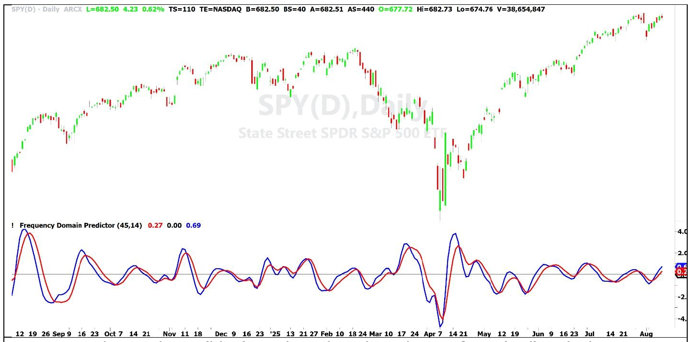

# A New Look at Prediction

**By John Ehlers**

- **Downloaded from:** [Mesa Software — A New Look at Prediction](http://www.mesasoftware.com/papers/A%20New%20Look%20at%20Prediction.pdf)

---

Predicting future prices has long been considered the ultimate goal—almost the Nirvana—of technical analysis. Traders and analysts have historically attempted to forecast price movement using mathematical tools such as linear extrapolation or autoregressive models operating in the time domain. These approaches rely on the assumption that past price behavior contains enough information to estimate what will happen next.

In practice, however, these techniques tend to work only for very short-term forecasts, usually just a few bars into the future. The reason for this limitation becomes clear when we examine autocorrelation, a statistical measure that describes how strongly current prices are related to past prices. When price data is analyzed in this way, it becomes evident that the relationship between current prices and prices several bars in the past fades very quickly. After only a few bars of lag, the correlation typically approaches zero. This means that the present price contains very little statistical relationship to prices that occurred further back in time.

If current prices are essentially uncorrelated with their historical values, the logical conclusion would be that predicting future prices from past prices is impossible. However, when the autocorrelation analysis is extended to longer time lags, an interesting feature often appears. Instead of remaining near zero, the autocorrelation sometimes reaches a minimum value that is actually negative. This negative correlation indicates the presence of anticorrelation, which in turn suggests that the data contains a repeating cyclical component. In other words, even though short-term correlations disappear quickly, there may still be identifiable cycles embedded within the price series.

This observation leads to a different approach to prediction. Rather than analyzing prices purely in the time domain, we can analyze them in the frequency domain. In the frequency domain, price movements are treated as a combination of cycles with different wavelengths and amplitudes. When market data is examined this way, the distribution of cycle amplitudes generally follows what engineers refer to as a pink spectrum.

A pink spectrum means that the data contains many different frequencies simultaneously, and that the amplitude of those cycles tends to increase as the wavelength becomes longer. A useful analogy is the way a prism separates white light into a rainbow of colors. Similarly, frequency analysis separates price data into cycles of varying lengths. In a pink spectrum the longer cycles are stronger than the shorter ones. For example, a quarterly cycle that spans roughly sixty bars might be about three times stronger than a monthly cycle of around twenty bars. This relationship implies that cycle amplitude increases at a rate of approximately six decibels for every doubling of wavelength.

Although the overall spectrum follows this pattern, it is rarely smooth. Short-term variations often create bumps or peaks in the spectrum that represent dominant cycles in the data. In many financial markets, for example, there is frequently a noticeable cycle with a wavelength close to one month. If we can isolate this dominant cycle and determine where the market currently lies within that cycle, we gain valuable information about the likely direction of price movement. The position within the cycle is called the phase of the cycle. By estimating the phase and then projecting it slightly forward, we can obtain a prediction of how the cyclical component of price is likely to evolve in the near future.

To implement this idea, the dominant cycle must first be extracted from the price data. Conventional oscillators such as the RSI, MACD, and the Stochastic oscillator attempt to remove the static component of price by calculating differences one way or another. From a signal processing perspective, this operation behaves like a first-order high-pass filter. A first-order high-pass filter attenuates longer wavelengths at a rate of six decibels per octave. Unfortunately, this attenuation rate happens to match the rate at which amplitudes increase in a pink spectrum. The result is that these oscillators tend to flatten the spectrum rather than truly suppressing the longer cycles. Consequently, long-wavelength components remain mixed with the shorter ones, which forces traders to rely heavily on subjective interpretation when reading these indicators.

## Extracting the Dominant Cycle

A more effective method is to apply a stronger filter that more aggressively removes the long-wavelength components of the data. This can be accomplished by using a second-order high-pass filter, which attenuates longer wavelengths at twelve decibels per octave. Because this rate of attenuation is steeper than the growth rate of the pink spectrum, the longer cycles are significantly reduced. The filter is tuned to a wavelength that is much longer than the dominant cycle we want to detect. Its purpose is not to extract the dominant cycle itself, but rather to remove the slow-moving trend components that obscure it. When this process is applied, the resulting spectrum becomes closer to a blue spectrum, meaning that shorter wavelengths are emphasized relative to longer ones.

After the longer wavelengths have been suppressed, the dominant cycle can be recovered using a band-pass filter. A band-pass filter allows only a specific range of wavelengths to pass through while rejecting both shorter and longer components. Designing this filter requires balancing two competing goals. If the filter bandwidth is made extremely narrow, the resulting waveform will be very clean and will resemble a nearly perfect sine wave. However, such a narrow filter also becomes fragile. If the dominant cycle shifts slightly outside the filter's narrow range, the cycle may be rejected entirely. In addition, narrow filters respond slowly to sudden changes in market behavior.

On the other hand, if the filter bandwidth is made too wide, it will allow many unwanted wavelengths to pass through. The resulting signal then becomes difficult to interpret because it contains multiple overlapping cycles. In practice, a good compromise is to design the band-pass filter to pass a range of wavelengths spanning approximately one octave. This allows the filter to capture variations in the dominant cycle while still suppressing frequencies that are too far away from the desired range.

The band-pass filter used here is constructed by combining two filters. The short-wavelength boundary of the passband is created using a second-order SuperSmoother filter, while the long-wavelength boundary is defined by a second-order high-pass filter tuned to twice the wavelength of the low-pass component. An important characteristic of band-pass filters is that their phase response changes across the passband. In general, the phase shift varies by about ninety degrees across the passband and becomes zero at the geometric center of the band. This property leads to a subtle but important effect. If the dominant cycle lies near the longer-wavelength side of the passband, the filtered signal will lead the underlying price cycle by roughly forty-five degrees. Conversely, if the dominant cycle lies near the shorter-wavelength side of the passband, the filtered signal will lag the price cycle by about forty-five degrees. The only way to reduce this variation in phase shift is to widen the passband of the filter.

## Creating a Phase Lead

To produce an explicit predictive signal, we must intentionally create a phase lead relative to the filtered cycle. Calculus provides an important insight into how this can be done. The derivative of a sine wave is a cosine wave, and a cosine wave leads a sine wave by ninety degrees in phase. In a continuous system, taking the derivative of a sine wave therefore produces a waveform that is shifted forward by ninety degrees. In a discrete data system such as financial time series, the equivalent of a derivative is the difference between successive samples. A one-bar difference therefore produces a signal that approximates a ninety-degree phase lead relative to the original waveform.

However, this operation also introduces strong high-frequency components because it acts as a high-pass filter beginning at the Nyquist wavelength of two bars. Since the dominant cycle we are interested in might be around twenty bars, these high-frequency components are undesirable. A simple modification improves the situation. Taking a two-bar difference instead of a one-bar difference places a transmission zero at the Nyquist wavelength and delays the start of the attenuation slope until around four bars. This reduces the amplitude of the shortest wavelengths so that they can be effectively attenuated by the SuperSmoother filter in the band-pass stage.

The output of the band-pass filter and the phase-lead signal produced by the difference operation have similar shapes but different amplitudes. In order to combine them properly, each signal must be normalized to its root mean square (RMS) value. After this normalization is performed, the phase-shifted signal becomes equivalent to the Hilbert transform of the original filtered waveform. The result is a pair of signals that are identical in amplitude but separated by ninety degrees in phase. One of these signals represents the in-phase component, and the other represents the quadrature component.

Once these two orthogonal components are available, it becomes straightforward to generate a signal with any desired phase shift. This is done by combining the two signals vectorially. The resulting phased signal is computed by multiplying the in-phase component by the cosine of the desired phase angle and multiplying the Hilbert component by the sine of that same angle. The two weighted signals are then added together. By adjusting the phase angle between zero and ninety degrees, we can control how far ahead the predictive signal leads the original cycle.

## Measured Results

It is important to maintain realistic expectations about the predictive capability of this method. The maximum achievable prediction is limited to approximately one quarter of the cycle length. For example, if the shortest wavelength captured by the band-pass filter is about fourteen bars, then one quarter of that cycle corresponds to roughly three and a half bars. Because the two-bar difference filter introduces a delay of about one bar, the practical prediction lead is closer to two and a half bars. If the dominant cycle is much longer, such as a sixty-bar quarterly cycle, the potential prediction horizon increases significantly. In that case a quarter cycle would correspond to fifteen bars, and after accounting for the one-bar delay the effective prediction could extend roughly fourteen bars into the future.

When this technique is applied to data with a dominant cycle of approximately twenty bars, the filtered output reveals the cyclical component of the price movement. If a phase lead of forty-five degrees is introduced, the resulting signal reaches its peaks and troughs earlier than the filtered price signal. Because the cyclical component of price tends to follow the filtered waveform, the phase-advanced signal acts as a predictor of upcoming market turning points.

Figure 1 shows approximately one year of SPY daily data, along with a one octave predictor centered at a 20 day wavelength to capture the "monthly" dominant cycle. The phase advance is set to 45 degrees.


**Figure 1. The Predictor (blue) Predicts the Filtered Waveform (red), Which is in Sync with the Monthly Price Cycle.**

## Reduced to Code

The code to compute the prediction in the frequency domain is described with reference to Code Listing 1. The supporting functions are given in Code Listings 2 – 4.

The default phase advance is set to 45 degrees. This input can be varied from 0 degrees to 90 degrees. The Band Pass filter is designed to have a center wavelength of 20 bars (a nominal one month cycle of daily data) and to have an octave bandwidth. Therefore, the SuperSmoother critical period is set to 14 and the High Pass critical period is set to 28. The critical period of the BlueSpectrum High Pass filter is set to 72 to not interfere with the Band Pass response.

The LP filtered signal has a nominally zero mean. Therefore, its Root Mean Square (RMS) value normalizes so that LP is scaled in Standard Deviations to be the InPhase component. The frequency independent 90 degree phase shift signal, called Quadrature, is computed as a two bar difference of the normalized InPhase signal. When this signal is normalized to its RMS value (QRMS), a Hilbert transform results.

The adjustable phase shifted predictor is computed as the vector sum of the filtered InPhase signal and its Hilbert transform. This summation is done with trigonometric values so the amount of prediction is stated in number of degrees of phase shift.

## In a Nutshell

In summary, market price data tends to exhibit a pink spectral distribution in which longer cycles dominate shorter ones. Standard oscillators do not adequately remove these long cycles, leaving traders with signals that require subjective interpretation. By applying a second-order high-pass filter, the longer wavelengths can be attenuated strongly enough to produce a blue spectrum that emphasizes shorter cycles. The dominant cycle can then be extracted using a band-pass filter with an octave-wide bandwidth constructed from a high-pass filter and a SuperSmoother filter. A two-bar difference operation produces a ninety-degree phase shift relative to the filtered signal, and when this signal is normalized it becomes equivalent to a Hilbert transform. By combining the InPhase and Hilbert components with trigonometric weighting, it becomes possible to generate a controlled phase lead. This phase-advanced signal serves as a prediction of the future behavior of the dominant cycle in market prices.

---

## Code Listing 1. EasyLanguage Code for the Predictor in the Time Domain

```easylanguage
{
Frequency Domain Predictor
(C) 2026 John F. Ehlers
}
Inputs:
PhaseShift(45),
LPPeriod(14);

Vars:
BlueSpectrum(0),
HP(0),
LP(0),
RMS(0),
Inphase(0),
Quadrature(0),
QRMS(0),
Hilbert(0),
Wave(0);

//Compute Bandpass whose center wavelength is 1.4*LPPeriod
BlueSpectrum = $Highpass(Close, 72);
HP = $Highpass(BlueSpectrum, 2*LPPeriod);
LP = $SuperSmoother(HP, LPPeriod);

//Normalize amplitude in Standard Deviations
RMS = $RMS(LP, 135);
If RMS <> 0 Then Inphase = LP / RMS;

//Establish Quadrature Signal
Quadrature = InPhase - InPhase[2];

//Normalize Quadrature amplitude in Standard Deviations
QRMS = $RMS(Quadrature, 135);
If QRMS <> 0 Then Hilbert = Quadrature / QRMS;

//Vectorally add components for variable phase shift
Wave = Cosine(PhaseShift)*Inphase + Sine(PhaseShift)*Hilbert;

//Plot results
Plot1(Inphase);
Plot2(0);
Plot3(Wave);
```

## Code Listing 2. $Highpass Filter Function in EasyLanguage

```easylanguage
{
$Highpass Function
(C) 2025 John F. Ehlers
}
Inputs:
Price(numericseries),
Period(numericsimple);

Vars:
a0(0),
Q(0),
c1(0),
c2(0);

Q = expvalue(-1.414*3.14159 / Period);
c1 = 2*Q*Cosine(1.414*180 / Period);
c2 = Q*Q;
a0 = (1 + c1 + c2) / 4;

If CurrentBar >= 4 Then
    $HighPass = a0*(Price - 2*Price[1] + Price[2]) + c1*$HighPass[1] - c2*$HighPass[2];
If Currentbar < 4 Then $HighPass = 0;
```

## Code Listing 3. $SuperSmoother Filter Function in Easy Language

```easylanguage
{
$SuperSmoother Function
(C) 2025 John F. Ehlers
}
Inputs:
Price(numericseries),
Period(numericsimple);

Vars:
a0(0),
Q(0),
c1(0),
c2(0);

Q = expvalue(-1.414*3.14159 / Period);
c1 = 2*Q*Cosine(1.414*180 / Period);
c2 = Q*Q;
a0 = (1 - c1 + c2) / 2;

If CurrentBar >= 4 Then
    $SuperSmoother = a0*(Price + Price[1]) + c1*$SuperSmoother[1] - c2*$SuperSmoother[2];
If Currentbar < 4 Then $SuperSmoother = Price;
```

## Code Listing 4. $RMS Function in EasyLanguage

```easylanguage
{
$RMS Function
(C) 2025 John F. Ehlers
}
Inputs:
Price(numericseries),
Length(numericsimple);

Vars:
SumSq(0),
count(0);

SumSq = 0;
for count = 0 to Length - 1 Begin
    SumSq = SumSq + Price[count]*Price[count];
End;
If SumSq <> 0 Then $RMS = SquareRoot(SumSq / Length);
```

---

## BibTeX

```bibtex
@misc{ehlers_new_look_prediction,
  author       = {John F. Ehlers},
  title        = {A New Look at Prediction},
  year         = {2026},
  howpublished = {online},
  url          = {http://www.mesasoftware.com/papers/A%20New%20Look%20at%20Prediction.pdf}
}
```
