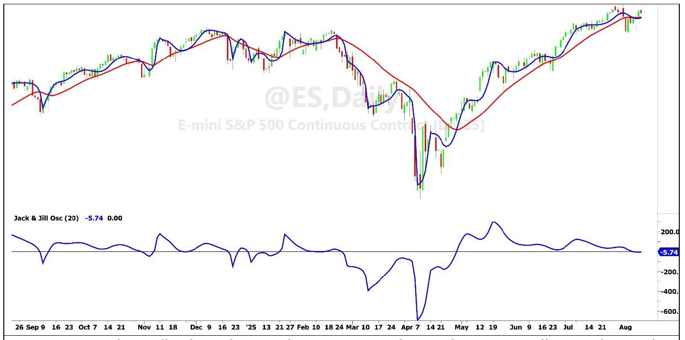

# The Jack & Jill Indicator

**By John F. Ehlers**

- **Downloaded from:** [Mesa Software — The Jack & Jill Indicator](http://www.mesasoftware.com/papers/The%20Jack%20and%20Jill%20Indicator.pdf)

---

Jack & Jill is a trend indicator. It is comprised of two lines: "Jack" that closely follows the price action, and "Jill" that is virtually devoid of cyclic information. The slope of Jill shows the direction of the trend, and the separation between Jack and Jill shows the strength of the trend. Also, when Jack is above Jill going up the hill the market trend is up. When Jack is below Jill falling down the hill the market trend is down.

Jack is an adaptive SuperSmoother that I first described in the *** issue of Stocks & Commodities Magazine. Jill is a contra-adaptive SuperSmoother. Jill is basically computed the same way as Jack except the slope of Jill increases the period of the SuperSmoother for the next bar instead of decreasing it.

The difference between Jack and Jill can be plotted as an oscillator-style indicator in the subgraph below the prices. If the difference is greater than the zero reference, then the market is in an uptrend. If the difference is less than the zero reference, then the market is a downtrend. The amplitude away from the zero difference shows the strength of the trend.

Figure 1 shows Jack & Jill plotted both as an overlay on prices and as an oscillator. This example is plotted on approximately one year of Emini S&P Futures data using a 20 bar value for the input period. The input period can be altered to change the sensitivity of the Jack & Jill indicator.


**Figure 1. Jack & Jill, Plotted as Both a Price Overlay and as an Oscillator, Shows the Trends of the Emini S&P Over a Year.**

The EasyLanguage code to compute the Jack & Jill indicator is given in Code Listing 1. It is fully annotated and should be easy to follow. The EasyLanguage Functions for the SuperSmoother and RMS functions are included in Code Listings 2 and 3 for convenience.

Jack & Jill can also be used on intraday data. However, intraday data usually has gap openings. From a DSP perspective, these gap openings can be viewed as a step function superimposed on the smoother "real" prices. Jack quickly adapts to the step, while Jill has a longer settling time. The result is that the oscillator-style display has an impulse response at the opening time, with an exponential decay. This impulse does not contribute to an interpretation of the trend strength, and so I recommend the use of degapped data if you use Jack & Jill to analyze intraday data. A function to degap the data is given in Code Listing 4.

## In a Nutshell

Jack & Jill is a trend indicator. Jill has been stripped of almost all cyclic information to reliably show the trend as her slope. If Jack is above Jill going up the hill, the trend is up. If Jack is below Jill falling down the hill, the trend is down. The separation between Jack and Jill shows the strength of the trend. The difference between Jack and Jill can be used to plot the indicator as an oscillator.

### For Further Reading

- John F. Ehlers, "Adaptive SuperSmoother", *Stocks & Commodities Magazine*
- John F. Ehlers, "Cybernetic Trading Indicators", Amazon

---

## Code Listing 1. Jack & Jill Indicator in EasyLanguage

```easylanguage
{
Jack & Jill Indicator
(C) 2025 John F. Ehlers
}
Inputs:
Period0(20);

Vars:
Jack(0), Jill(0),
JackPeriod(20), JillPeriod(20),
JackRMS(0), JillRMS(0),
JackROC(0), JillROC(0);

//adaptive SuperSmoother
Jack = $SuperSmoother(Close, JackPeriod);

//RMS for Jack ROC
JackRMS = $RMS(Jack - Jack[1], 81);

//Normalize Jack ROC in Standard Deviations
If JackRMS <> 0 Then JackROC = AbsValue((Jack - Jack[1]) / JackRMS);
If JackROC > 2 Then JackROC = 2;

//Period for adaptive SuperSmoother (Jack) on next bar
JackPeriod = Period0*(1 - .5*JackROC)*(1 - .5*JackROC);
If JackPeriod < 2 Then JackPeriod = 2;

//contra-adaptive SuperSmoother
Jill = $SuperSmoother(Close, JillPeriod);

//RMS for Jill ROC
JillRMS = $RMS((Jill - Jill[1]), 81);

//Normalize Jill ROC in Standard Deviations
If JillRMS <> 0 Then JillROC = AbsValue((Jill - Jill[1]) / JillRMS);
If JillROC > 2 Then JillROC = 2;

//Period for contra-adaptive SuperSmoother (Jill) on next bar
JillPeriod = Period0*(1 + .5*JillROC)*(1 + .5*JillROC);

//Plot results
Plot1(Jack);
Plot2(Jill);
```

## Code Listing 2. $SuperSmoother Function in EasyLanguage

```easylanguage
{
$SuperSmoother Function
(C) 2025 John F. Ehlers
}
Inputs:
Price(numericseries),
Period(numericsimple);

Vars:
a0(0),
Q(0),
c1(0),
c2(0);

Q = expvalue(-1.414*3.14159 / Period);
c1 = 2*Q*Cosine(1.414*180 / Period);
c2 = Q*Q;
a0 = (1 - c1 + c2) / 2;

If CurrentBar >= 4 Then
    $SuperSmoother = a0*(Price + Price[1]) + c1*$SuperSmoother[1] - c2*$SuperSmoother[2];
If Currentbar < 4 Then $SuperSmoother = Price;
```

## Code Listing 3. $RMS Function in EasyLanguage

```easylanguage
{
$RMS Function
(C) 2025 John F. Ehlers
}
Inputs:
Price(numericseries),
Length(numericsimple);

Vars:
SumSq(0),
count(0);

SumSq = 0;
for count = 0 to Length - 1 Begin
    SumSq = SumSq + Price[count]*Price[count];
End;
If SumSq <> 0 Then $RMS = SquareRoot(SumSq / Length);
```

## Code Listing 4. $Degap Function in EasyLanguage

```easylanguage
{
$Degap Function
(C) 2025 John F. Ehlers
}
Inputs:
Price(numericseries),
SessionOpen(numericsimple),
TimeBars(numericsimple);

Vars:
Gap(0);

If Time = SessionOpen + TimeBars Then Gap = Price - $Degap[1];
$Degap = Price - Gap;
```

---

## BibTeX

```bibtex
@misc{ehlers_jack_jill_indicator,
  author       = {John F. Ehlers},
  title        = {The Jack and Jill Indicator},
  year         = {2026},
  howpublished = {online},
  url          = {http://www.mesasoftware.com/papers/The%20Jack%20and%20Jill%20Indicator.pdf}
}
```
