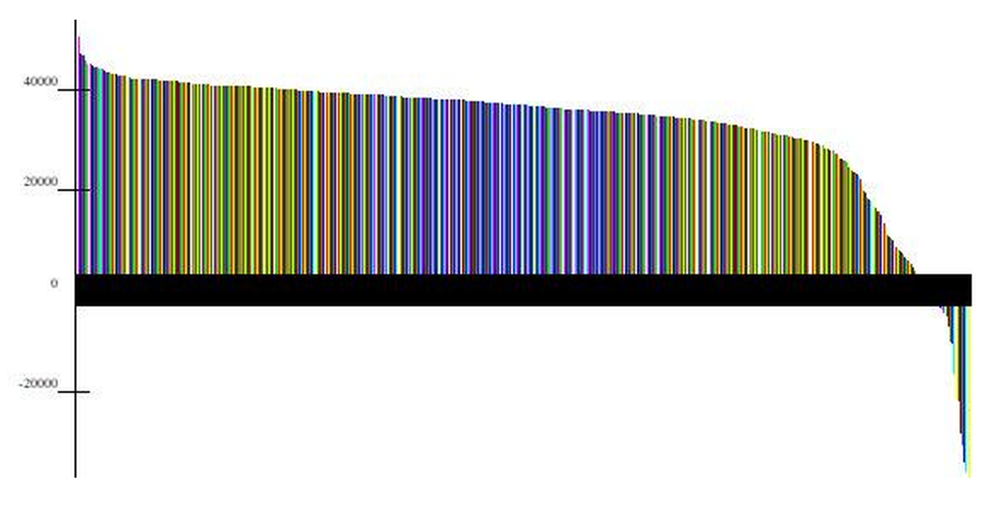
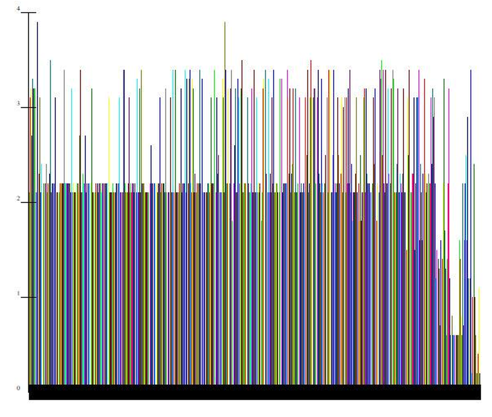

# A Procedure to Evaluate Trading Strategy Robustness

**By John Ehlers**

- **Downloaded from:** [Mesa Software — Robustness](https://www.mesasoftware.com/papers/ROBUSTNESS.pdf)

---

Backtesting trading strategies does not work! Here is a procedure to evaluate them in TradeStation.

It is possible to use several million parameter combinations when "optimizing" a trading strategy. Certainly, the optimization procedure will yield the one parameter combination that produces the maximum result over the provided data history. Since there are over a million combinations available, the odds are vanishingly small that you have identified the correct parameter combination for use with data running into the future. Your best opportunity to retain a semblance of insample performance is that your strategy have parameter combinations that have a high probability of providing results near the maximum and that the conditions that produced those results continue a short while into the future.

I noticed that strategies that rapidly converge to near maximum profit when being optimized with a genetic algorithm are the ones that turn out to be the most robust. This procedure is built on that observation.

This evaluation procedure is actually pretty simple in TradeStation and/or Multicharts. First, change the number of tests retained by the platform from the default of 200 to 2000. Do this by clicking on View…Chart Analysis Preferences and inserting 2000 in the small white window. When you optimize your strategy, choose the genetic method and click on Advanced Setting. Change the population size from the default of 100 to a value of 40. Then, perform the optimization as you otherwise normally would do.

The population size is basically the number of combinations that can be randomly selected at each generation of the optimization. With a combination of 100 generations and a population of 40, you could have up to 4000 tests that are run to complete the optimization. In general, you can expect to have about 25 percent of that number of tests that are actually run. That means, that by keeping the top 2000 tests you will capture all the tests that are run. With these settings, run the genetic optimization.

There are two objectives for keeping all the optimization test results. First, the sensitivity of net profit to parameter combinations can be observed and quantified. Secondly, the relationship between net profit and each parameter can be individually observed and assessed.

To observe the parameter sensitivity click on View…Strategy Optimization Report. Then click on the All:NetProfit column heading until the net profit is ranked from highest to lowest in that column. Then click on a barchart tool to display the results. You will get a result similar to the chart below.


**Figure 1. Net Profit Ranking from Highest to Lowest**

This particular chart is one of my intraday strategies that produced 692 trades over the calendar period from 1 January 2015 to 1 June 2018. There were 88,287,801 potential parameter combinations, but only 1025 genetic optimization tests were done. Robustness of the trading strategy is determined by the slope of the net profit as a function of the number of tests that were run. I use the ratio of the net profit at the midpoint of the number of tests to the maximum net profit. If this ratio is 75%, for example, then you have a reasonable expectation that your out-of-sample performance will be at least 75% of your optimized insample net profit.

The relationship between net profit and any of the constituent parameters can be seen by clicking on the column heading for that parameter and then clicking on the barchart tool to display the results. (This assumes you have already ranked the net profit from high to low.) You will get a result similar to the chart below.


**Figure 2. Relationship Between Net Profit and a Constituent Parameter**

In this case it is easy to see that the low net profit and losses are correlated with the lower setting of this parameter. Therefore, low settings of this parameter are to be avoided when doing walk forward optimizations of the strategy.

Evaluation of the parameter variations that are correlated with net profit can lead to an iterative design of a robust trading strategy.

There can be a temptation to cheat on the procedure. For example, if you throttle back the number of parameter combinations so that you have fewer than 1000 tests, then the procedure does not reflect the impact of optimization. Just think about it. In the limit, if you do not optimize parameters, then your insample and out-of-sample results must be identical. Another way to cheat the procedure is to fail to include a sufficient number of trades in order to make the results statistically significant. My judgement is that you should have at least 100 trades included for the procedure to be meaningful.

Good luck! I hope this procedure helps with your trading.

---

## BibTeX

```bibtex
@misc{ehlers_robustness,
  author       = {John F. Ehlers},
  title        = {A Procedure to Evaluate Trading Strategy Robustness},
  year         = {2018},
  howpublished = {online},
  url          = {https://www.mesasoftware.com/papers/ROBUSTNESS.pdf}
}
```
