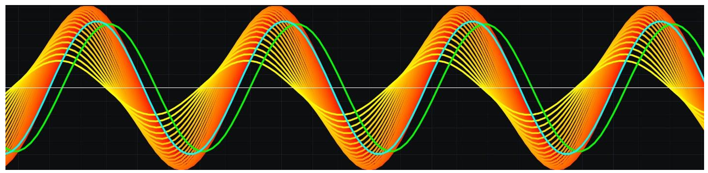
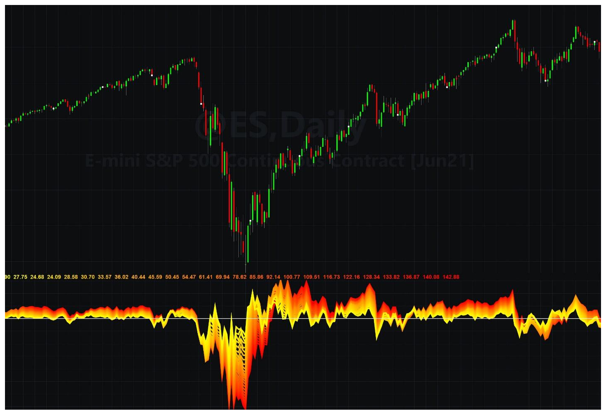
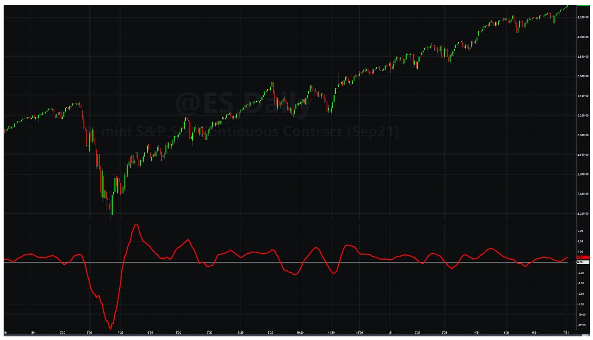
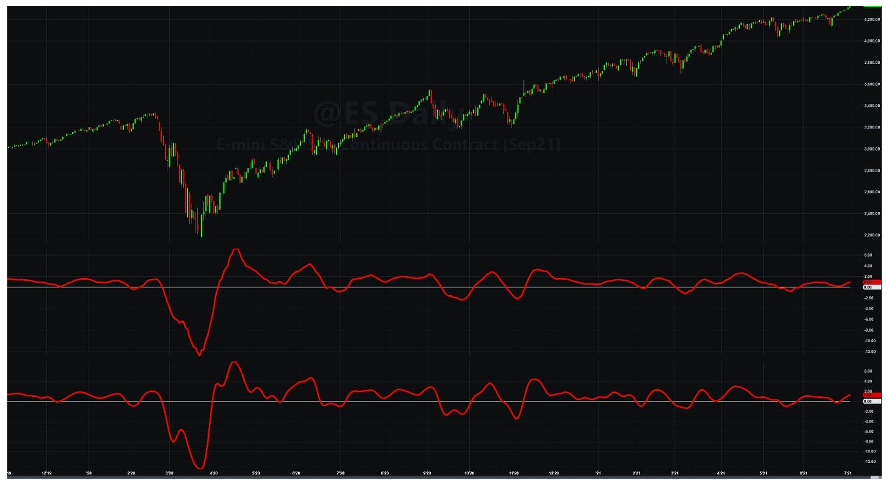

# A Thinking Man's MACD

**By John Ehlers**

- **Downloaded from:** [Mesa Software — A Thinking Man's MACD](http://www.mesasoftware.com/papers/A%20Thinking%20Man's%20MACD.pdf)

---

This is a research report about a project that started as a way to gain insight into the characteristics of cycles in market data and ended with the invention of a new trend indicator that is robust across a range of input parameters and yet has the elegance of simplicity.

One way to create an oscillator-style indicator is to subtract the moving average of price from price itself. The moving average contains the DC (zero frequency) component and the low frequency components of the data. So, subtracting the moving average from price results in an indicator that has a nominal zero mean and the higher frequency cycle components in the data. The research project started as a way to display the oscillator in a way that would demonstrate how the oscillator would behave as the length of the moving average was varied.

With reference to Code Listing 1, the idea was to display the oscillator in a range of colors as a function of the length of the moving average. The default mode is "cycle". In that mode Price, which starts as the Close, is overwritten as a 30 bar period sine wave. A cyan line is plotted to show the input Price as a cyan line. The difference between two moving averages was added later, so that line will be ignored for now. Moving Averages, and the Oscillator (Osc) array were computed over a range from 5 to 30 bars. Each Osc was assigned a value for the color green from 255 to 0 as the length was varied from 5 to 30. This value, combined with the color red, produced a net color of bright yellow when the length is 5 and a color of bright red when the length is 30.

### Code Listing 1. Cycle/Trend Analytics

```easylanguage
{
Cycle/Trend Analytics
(C) 2021 John F. Ehlers
}
Inputs:
    CTMode("cycle");

Vars:
    Price(0),
    Length(0),
    NormalLength(0),
    Color1(0),
    Color2(0),
    Color3(0);

Arrays:
    Osc[50](0);

Plot1(0,"",white, 1, 1);

Price = Close;

If CTMode = "cycle" Then Begin
    Price = Sine(360*CurrentBar / 30);
    Plot2(Price,"", cyan, 4, 4);
    Plot3(Average(Price, 5) - Average(Price, 30),"", green, 4, 4);
End;

Color1 = 255;
Color3 = 0;

For Length = 5 to 30 Begin
    Osc[Length] = Price - Average(Price, Length);
End;

For Length = 5 to 30 Begin
    Color2 = 306 - 10.2*Length;
    If Length = 4 Then Plot4[0](Osc[Length], "S4", RGB(Color1, Color2, Color3),0,4);
    If Length = 5 Then Plot5[0](Osc[Length], "S5", RGB(Color1, Color2, Color3),0,4);
    If Length = 6 Then Plot6[0](Osc[Length], "S6", RGB(Color1, Color2, Color3),0,4);
    If Length = 7 Then Plot7[0](Osc[Length], "S7", RGB(Color1, Color2, Color3),0,4);
    If Length = 8 Then Plot8[0](Osc[Length], "S8", RGB(Color1, Color2, Color3),0,4);
    If Length = 9 Then Plot9[0](Osc[Length], "S9", RGB(Color1, Color2, Color3),0,4);
    If Length = 10 Then Plot10[0](Osc[Length], "S10", RGB(Color1, Color2, Color3),0,4);
    If Length = 11 Then Plot11[0](Osc[Length], "S11", RGB(Color1, Color2, Color3),0,4);
    If Length = 12 Then Plot12[0](Osc[Length], "S12", RGB(Color1, Color2, Color3),0,4);
    If Length = 13 Then Plot13[0](Osc[Length], "S13", RGB(Color1, Color2, Color3),0,4);
    If Length = 14 Then Plot14[0](Osc[Length], "S14", RGB(Color1, Color2, Color3),0,4);
    If Length = 15 Then Plot15[0](Osc[Length], "S15", RGB(Color1, Color2, Color3),0,4);
    If Length = 16 Then Plot16[0](Osc[Length], "S16", RGB(Color1, Color2, Color3),0,4);
    If Length = 17 Then Plot17[0](Osc[Length], "S17", RGB(Color1, Color2, Color3),0,4);
    If Length = 18 Then Plot18[0](Osc[Length], "S18", RGB(Color1, Color2, Color3),0,4);
    If Length = 19 Then Plot19[0](Osc[Length], "S19", RGB(Color1, Color2, Color3),0,4);
    If Length = 20 Then Plot20[0](Osc[Length], "S20", RGB(Color1, Color2, Color3),0,4);
    If Length = 21 Then Plot21[0](Osc[Length], "S21", RGB(Color1, Color2, Color3),0,4);
    If Length = 22 Then Plot22[0](Osc[Length], "S22", RGB(Color1, Color2, Color3),0,4);
    If Length = 23 Then Plot23[0](Osc[Length], "S23", RGB(Color1, Color2, Color3),0,4);
    If Length = 24 Then Plot24[0](Osc[Length], "S24", RGB(Color1, Color2, Color3),0,4);
    If Length = 25 Then Plot25[0](Osc[Length], "S25", RGB(Color1, Color2, Color3),0,4);
    If Length = 26 Then Plot26[0](Osc[Length], "S26", RGB(Color1, Color2, Color3),0,4);
    If Length = 27 Then Plot27[0](Osc[Length], "S27", RGB(Color1, Color2, Color3),0,4);
    If Length = 28 Then Plot28[0](Osc[Length], "S28", RGB(Color1, Color2, Color3),0,4);
    If Length = 29 Then Plot29[0](Osc[Length], "S29", RGB(Color1, Color2, Color3),0,4);
    If Length = 30 Then Plot30[0](Osc[Length], "S30", RGB(Color1, Color2, Color3),0,4);
End;
```

The resulting display for the "cycle" mode is shown in Figure 1. The indicator output leads the input by almost 90 degrees for the shortest moving average. This is no great surprise because a short moving average is almost like the price, but delayed a small amount. It looks like a momentum function when the difference is taken. But a momentum is analogous to a derivative in calculus, and the derivative of a sine wave is a cosine wave. In other words, the indicator output leads the phase of the input by about 90 degrees. The indicator output is exactly in phase with the Price input when the length of the moving average is one half the cycle period. Again, this is no surprise because the summation of a sine wave over a half cycle period is exactly in phase with the Price cycle in the same frame of reference. Again, no surprises. The indicator has a relatively lagging phase when the length of the moving average is greater than a half cycle period.


**Figure 1. Cycle/Trend Analytics Shows the Response to a Pure Cycle Over the Range of Moving Average Values.**

The surprise comes when the mode is changed to "trend". In this case, the value of Price as the Close is not overwritten, and we see the indicator applied to real data. An example of the indicator applied to closing prices is shown in Figure 2. The surprising result (to me) is that the predominant effect is that the separation between the reddest line and the most yellow line reflects the strength of the trend. When the red line is on top, the trend is up. When the red line is on the bottom the trend is down.

Moreover, the high frequency squiggles in all the indicators tend to be nearly the same. That is because when the difference is taken between the Price and its average, all the indicators have similar high frequency content.

So, the idea is to show the trend by taking the difference of two oscillators. The high frequency components are cancelled when the difference is taken. If the difference of the length of the two moving averages are one half the period of the dominant cycle, then the resultant will be exactly in phase with the input Price. You can verify this by changing the length of the second moving average in the plotting of the green line to 20. This makes the difference between the length of the two moving averages to be 15, exactly one half the length of the 30 bar cycle. The result is that the green line is overwritten by the cyan line, showing the two are exactly in phase.

Taking the difference of the two Oscillator indicators is mathematically the same as just taking the difference of the two moving averages because the Price term in each Oscillator is cancelled.


**Figure 2. The Cycle/Trend Analytic Shows the Strength of the Trend as the Width of the Display and the High Frequency Content is Similar for All Indicators**

So there you have it. Although the derivation is convoluted, the MAD (Moving Average Difference) Indicator is basically just the difference of two simple moving averages whose averaging lengths are different by approximately half the period of the dominant cycle in the data. The indicator becomes smoother as the length of the shorter moving average is increased. The length of the longer moving average should be the length of the shorter one plus half the period of the dominant cycle in the data. If the dominant cycle is unknown, just make the length of the longer moving average be twice the length of the shorter one. As a difference of moving averages, the MAD Indicator is a thinking man's MACD because there is a rationale to establish the lengths of the moving averages. Further, simple moving averages have a linear phase response so that the differencing obviates the need for a third smoothing average.

The MAD Indicator code is given in Code Listing 2. For convenience, the indicator is plotted as a percentage of the closing price. The normalizing term is an average to keep the indicator as smooth as possible. An example of the MAD Indicator is plotted in Figure 3. This indicator is relatively insensitive to parameter variations over relatively wide ranges.


**Figure 3. The MAD (Moving Average Difference) Indicator Displays the Trend as an Oscillator Scaled as a Percentage of Price**

### Code Listing 2. The MAD (Moving Average Difference) Indicator

```easylanguage
{
MAD (Moving Average Difference) Indicator
(C) 2021 John F. Ehlers
}
Inputs:
    ShortLength(8),
    LongLength(23);

Vars:
    MAD(0);

MAD = 100*(Average(Close, ShortLength) - Average(Close, LongLength)) / Average(Close, LongLength);

Plot1(MAD, "", red, 4, 4);
Plot2(0,"", white, 1, 1);
```

The MAD indicator is comprised of the difference of two simple moving averages. The length of the shorter moving average is determined by the desired smoothness of the indicator, and the length of the longer moving average is the length of the shorter plus the half-period of the dominant cycle in the data. I have previously shown[^1] that a simple moving average, while being ubiquitous in technical analysis, is not a particularly good filter. The simple moving average uses a rectangular window in its generation, and the Fourier Transform of the sharp edges of this window lead to "sidelobe leakage" in its filter response. The solution to making a better average is to soften the sharp corners of the window. I nominated the Hann window having a cosine squared shape coefficient amplitude distribution across the length of the filter to be a proper compromise for technical traders.

The improved MAD filter is just the combination of the two concepts above. That is, instead of taking the difference of two simple moving averages, the improved version takes the difference of two FIR filters that employ Hann windowing. For simplicity, I will call this new, improved indicator MADH. The comparison of the original MAD indicator and the improved MADH indicator is shown in Figure 4. The same parameter values are used for both indicators. The original MAD is in the first subgraph, and the improved MADH is in the second subgraph. Both have about the same overall response, but the MADH is smoother.

Excellent buy and sell indications are at the valleys and peaks, respectively, of the indicators. The valleys and peaks are determined when the rate of change of the indicators are zero, so when the one bar difference of the indicators cross zero, these are the buy and sell timing signals. Since the one bar difference is analogous to the derivative in calculus, and since taking derivative always increases the noise level, the MADH indicator will have fewer false signals due to noise.

The EasyLanguage Code for the MADH indicator is given in Code Listing 3.


**Figure 4. MADH is an Improved Version of the MAD Indicator**

### Code Listing 3. MADH Indicator

```easylanguage
{
MADH (Moving Average Difference - Hann) Indicator
(C) 2021 John F. Ehlers
}
Inputs:
    ShortLength(8),
    DominantCycle(27);

Vars:
    LongLength(20),
    Filt1(0),
    Filt2(0),
    coef(0),
    count(0),
    MADH(0);

LongLength = IntPortion(ShortLength + DominantCycle / 2);

Filt1 = 0;
coef = 0;
For count = 1 to ShortLength Begin
    Filt1 = Filt1 + (1 - Cosine(360*count / (ShortLength + 1)))*Close[count - 1];
    coef = coef + (1 - Cosine(360*count / (ShortLength + 1)));
End;
If coef <> 0 Then Filt1 = Filt1 / coef;

Filt2 = 0;
coef = 0;
For count = 1 to LongLength Begin
    Filt2 = Filt2 + (1 - Cosine(360*count / (LongLength + 1)))*Close[count - 1];
    coef = coef + (1 - Cosine(360*count / (LongLength + 1)));
End;
If coef <> 0 Then Filt2 = Filt2 / coef;

{Computed as percentage of price}
If Filt2 <> 0 Then MADH = 100*(Filt1 - Filt2) / Filt2;

Plot1(MADH, "", yellow, 4, 4);
Plot2(0, "", white, 1, 1);
```

[^1]: John Ehlers, "Windowing", Stocks & Commodities, September 2021

---

## BibTeX

```bibtex
@misc{ehlers_thinking_mans_macd,
  author       = {John F. Ehlers},
  title        = {A Thinking Man's MACD},
  year         = {2021},
  howpublished = {online},
  url          = {http://www.mesasoftware.com/papers/A%20Thinking%20Man's%20MACD.pdf}
}
```
