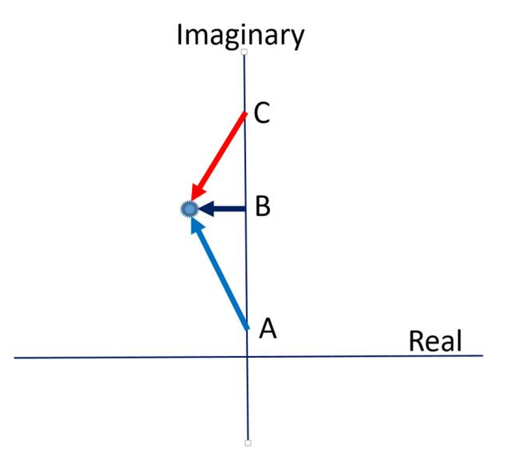
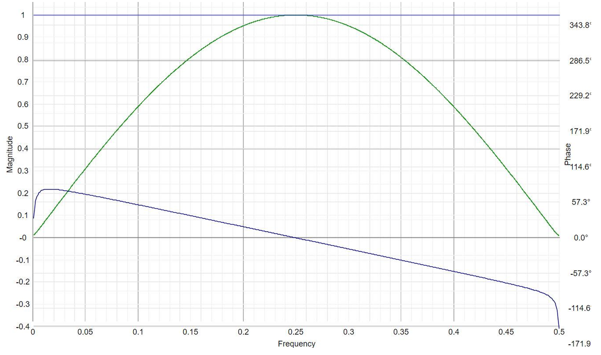
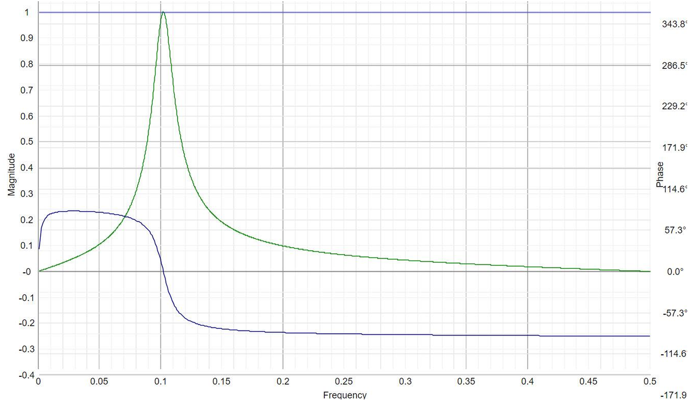

# DSP Tutorial

**By John Ehlers**

- **Downloaded from:** [Mesa Software — DSP Tutorial](https://www.mesasoftware.com/papers/DSPTutorial.pdf)

---

To fully understand all the elements of Digital Signal Processing (DSP) you should have a mathematical background that includes calculus, differential equations, and complex variables as well as electrical engineering filter theory. On the other hand, effective trading demands an approximate answer right now, as opposed to a perfect solution two weeks from now. While DSP is capable of delivering elegant solutions, these solutions require the acquisition of lots of data. Therefore, trading forces the use of only the most simple aspects of DSP. The purpose of this tutorial are to describe the simple, but crucial, aspects of DSP that are useful to quantitative traders.

Memorize these rules even though they may not make much sense right now:

1. Linear filters can be in any order. A Highpass filter can precede a Lowpass filter or vice-versa without changing the overall response of the resulting Bandpass filter.
2. There are two kinds of lag. Group delay impacts transient filter response. If a step response is applied to a low pass filter, the rise time of the filter is delayed by the computation. For example, the group delay of a simple moving average is approximately half the length of the average. Phase lag is the filter lag of a quiescent waveform that is stationary over time (not a transient). Lowpass filters can only have phase lag. A Bandpass filter can actually have a phase lead, depending on the frequency of the input signal relative to the tuned frequency of the filter.
3. Transfer response is a ratio of Z Transform polynomials. The numerator-only variant describes Finite Impulse Response (FIR) filters, like a simple average. A denominator-only response describes Infinite Impulse Response (IIR) filters, like an EMA.
4. Filter transfer response is really computed using vector arithmetic. The roots of the numerator polynomial are called zeros. The roots of the denominator polynomial are called poles. The vectors extend from the frequency of interest on the frequency axis to the zeros and the poles.
5. Filters are described by their critical, or cutoff frequencies. This is where the amplitude attenuation is half power, or -3 dB. This is also where the phase shift is 90 degrees per pole pair; relative to zero frequency for a LowPass filter, relative to Nyquist frequency for a HighPass filter, or relative to the center of a Bandpass filter. It is super important that you remember that there is 90 degrees of phase shift per pole pair of a Lowpass filter at its cutoff frequency. Forget Moving Average length and EMA alpha as filter descriptors.
6. Frequency and period are interchangeable. They are simply reciprocals.

## Math Background

OK. Let's start describing some math concepts. The numbers you know and love can be envisioned as lying on a straight line extending from minus infinity to plus infinity. These numbers can be digits, rational, irrational, or transcendental. It doesn't matter. These are called "real" numbers. In DSP we need to expand our numbering system so the numbers lie in a plane rather than on a straight line. The plane is comprised of the "real" axis and the "imaginary" axis that is at right angles (orthogonal) to the real axis. Numbers in the imaginary axis dimension are preceded with the operator "j". So, a location over 4 units and up 3 units from the origin would be written as 4 + j3. The value of "j" is the square root of minus one, which is why it is called imaginary. "j" is also an operator. As an operator, it rotates by 90 degrees in the plane. So, if we multiply 4 + j3 by j, the result is -3 + j4. Do you see that j*j = -1? I'll leave it as an exercise for you to determine that this is a 90 degree rotation. We will make extensive use of complex numbers, the combination of the real and imaginary components.

Next, let's examine calculus using an example. What happens if we disturb a weight hanging from a spring attached to the ceiling? First, we set up the equations describing the situation. The weight is pulling down with a force due to its mass and the acceleration due to the pull of gravity. Remember F = ma? The equal and opposite force is the tension of the spring F = -kx, where k is the spring constant and x is the distance the spring is stretched. Acceleration is the rate-change of velocity and velocity is the rate-change of distance. Therefore, acceleration is the second derivative of distance. We can set the two forces to be equal to establish the differential equation m\*d^2x/dt^2 = -kx. In order to solve this equation we would already have to know from calculus that the derivative of Sin(ωt) = (1/ω)\*Cos(ωt) and the derivative of Cos(ωt) = -(1/ω)\*Sin(ωt). Therefore, the second derivative of Sin(ωt) is itself multiplied by the reciprocal of the square of the angular frequency. Substituting this knowledge into our differential equation, it becomes m\*(-1/ω^2) = -k. Simplifying, the solution becomes ω = SquareRoot(m/k).

Well, that was pretty complicated. LaPlace transforms were invented to make the solutions of differential equations easier using algebra. They do this by substituting the operator "S" for the derivative (dx/dt). So our differential equation becomes m\*S^2 = -k. Solving for S, S = SquareRoot(-k/m). Now you see why we need imaginary numbers. We didn't account for loss terms like windage and spring losses when we set up the original equation, so there is no transient, and so the solution is just S = jω. The LaPlace transform has simplified the general solution in the complex plane.

The Fourier Transform is exactly the same as the LaPlace Transform except our solutions are constrained to the jω axis. This means that solutions using the Fourier Transform only describe quiescent steady-state conditions, and do not describe transient events. This is an important point that most people miss.

In the complex plane the real axis extends from minus infinity to plus infinity. And the imaginary axis extends from minus infinity to plus infinity. Our solution for the frequency of a weight connected to a spring falls exactly on the imaginary axis. For stability reasons, the poles of filter transfer responses always fall in the left half plane. Zeros of the transfer responses can fall anywhere in the complex plane, and are often located on the imaginary axis.

Transfer response of analog filters are basically computed by vector arithmetic in the complex plane. Consider the cases described in Figure 1. In this example there is a single pole in the transfer response in the left half plane. If the input signal is at point A on the jω axis, the red arrow describes the vector. This vector has nearly a 90 degree leading (positive) phase angle and is relatively long. Since this vector is in the denominator, the amplitude of the transfer response is relatively small. Increasing the input frequency to point B, the phase angle is zero and the length of the arrow is relatively short, meaning the transfer response of the filter is at its maximum. Further increasing the input frequency to point C, the vector has nearly a 90 degree lagging (negative) phase angle and is again relatively long. Thus, this single pole describes a Bandpass filter that is tuned to the frequency at point B. It is important to note there is nearly a 180 degree phase shift at the output of the filter across the entire frequency spectrum. Every addition pole in the filter adds another 180 degree phase shift across the spectrum. 180 degrees of phase shift means your filter can go from being exactly correct in describing the price action to being absolutely wrong, depending on the frequency of the data. This fact forces trading filters to be very simple, with a minimum number of poles. For the purists, there are also conjugate poles and zeros in the negative half plane for negative frequencies.


**Figure 1. Vector Solution for an Analog Bandpass Filter**

Lowpass filters have only zeros or have poles near the negative real axis. Therefore, the output phase shift starts at zero degrees. Lowpass filters can only have phase lag, and that lag can be as much as 90 degrees per pole. If the zero is on the jω axis, there is a 180 degree phase flip at the zero. I find it easiest to understand the phase relationship of filters by analysis in the complex plane.

But with sampled data, the highest possible frequency without aliasing is the Nyquist frequency. Nyquist frequency has only two samples per cycle. It is impossible to have fewer than two samples per cycle without aliasing. Since the complex plane extends to infinity and since sampled data is limited at the Nyquist frequency, the complex plane cannot be used to describe sampled data. A bilinear transformation to Z plane is required. The Z plane is a unit circle whose circumference corresponds to the jω axis in the complex plane. Zero frequency is located at +1 on the circle and Nyquist frequency is located at -1 on this circle. Positive frequencies have an angular position on the unit circle as 360/Period. So, for example, a cycle having a 4 bar period would be located at 90 degrees. We will get to poles and zeros later. Poles must be located interior to the unit circle for stability reasons. Zeros can be located anywhere in the Z plane, but are commonly found on the unit circle. A zero on the unit circle is a notch in the transfer response whose frequency is determined by its angular position.

## Z Transforms

Like LaPlace and Fourier Transforms, Z Transforms are used to simplify solutions. Trying to make the ideas more comprehensible, I will use mixed notation. So, math purists are forewarned. The notation "Z^-1" simply means one unit of lag. Therefore, a four bar simple moving average can be written as SMA = (1 + Z^-1 + Z^-2 + Z^-3) / 4. This is a special case of a Finite Impulse Response (FIR) filter, where the filter only responds to data within its 4 bar window. A more general FIR filter would be:

    H = (1 + 2*Z^-1 + 3*Z^-2 + 3*Z^-3 + 2*Z^-4 + Z^-5) / 12

Note that this filter has unity gain at zero frequency (Z = 1) because all the coefficients sum to 1. Also note the coefficients are [1 2 3 3 2 1], and so the roots of the polynomial are at -1 (Nyquist), -.5 +/- j.866 (3 bar cycle), +/- j (4 bar cycle). The roots of the polynomial are the zeros in the transfer response.

An important characteristic of FIR filters is that all frequency components are delayed by the group delay of the filter. Therefore, the input waveform is not distorted by the filter. This causes a linear phase delay across the spectrum. Suppose there is a group delay of 4 bars. Then, a 4 bar cycle would have a 360 degree lag, an 8 bar cycle would have a 180 degree lag (half cycle), a 16 bar cycle would have 90 degree lag, etc.

By the way, only FIR filters having coefficient values that are symmetrical about the filter center point are worthy discussion here because filters having asymmetrical coefficients have phase distortion. If you want phase distortion, use an IIR filter. Simple Moving Averages are FIR filters, but are not particularly good filters because the rectangular window of a SMA has a Fourier Transform that has a Sin(x)/x shape in the frequency domain. Windowing can soften the sharp edges to produce better filters, but that is the subject of one of my technical articles.

IIR filters have phase distortion. An IIR filter is one that depends on a previous calculation in the process of making its current calculation. An EMA is an example of an IIR filter. The EasyLanguage expression for an EMA is:

    Output = α*Input + (1 – α)*Output[1];

The notation Output[1] means the value of Output one bar ago. By the way, you should always write out an EMA equation as above to ensure the values of the coefficients sum to unity. This avoids typo errors that are difficult to detect. So, now let's do a little algebra to derive the Z Transform transfer response of the EMA:

    Output = α*Input + (1 – α)*Output[1]
    Output - (1 – α)*Output[1] = α*Input
    Output(1 - (1 – α)*Z^-1) = α*Input
    Output / Input = α / (1 - (1 – α)*Z^-1)
    H(z) = α / (1 – (1 – α)*Z^-1)

From this expression we see that an EMA is an IIR filter because it only has a constant in the numerator and the denominator is a simple polynomial in Z Transforms. Further, you can see the ease of going from EasyLanguage to Z Transforms and back.

The most general expression for a trading filter in the Z domain can be written as:

         b0 + b1*Z^-1 + b2*Z^-2
    H = -------------------------
         a0 + a1*Z^-1 + a2*Z^-2

Trading filters are seldom more than second order polynomials because of lag and phase shift concerns of more complex filters. The exception would be simple FIR filters. General filters, and IIR filters in particular, give traders problems if they do not allow enough data to allow initialization transients to settle down before using the filter output. That is, they find changing the start date can change the trading results of their strategies.

## Examples

Once you get to Z Transforms, DSP concepts become pretty simple. The most important things to remember are where you can go astray in computing your indicators and strategies.

One of the more useful FIR filters for trading is a two bar momentum. The transfer response of this filter is:

    H = 1 – Z^-2

The roots of this polynomial are at +1 and -1. Therefore, there are zeros in the transfer response at zero frequency and at Nyquist frequency. The amplitude and phase response of this filter are shown in Figure 2. The filter has an amplitude maximum at a 4 bar cycle period (frequency = .25). More importantly, note that the phase shift is only 180 degrees across the entire spectrum. If the frequency of the input data shifts 10 or 20 percent, the difference in phase is hardly perceptible. That means the interpretation of your indicators will be unambiguous.


**Figure 2. Amplitude and Phase Response of a Two Bar Momentum**

I want to contrast the response of the 2 bar momentum with that of a Bandpass filter, shown in Figure 3. Sure, the amplitude response of the filter is great. However, note that the phase response changes nearly 180 degrees across the critical period passband of the filter. This means that the filter output could be exactly in phase with your trading rules or be exactly out of phase with them if the input frequency changes by 10%. Basically, that means your trading rules are a crapshoot using this filter. The nonstationarity of market data can make your trading rules be deceptive. You can think you have a good system in one case, but if the market characteristics change it falls apart. If you remember the DSP rules you are well on your way toward making more robust trading strategies.


**Figure 3. Bandpass Filter Amplitude and Phase Response**

As a DSP resource, I highly recommend https://www.micromodeler.com/dsp/#. This is an interactive website that lets you design your own filter or just push and pull poles and zeros around to get a feeling of what's happening with your filter. They also have a video that can help you have a better appreciation for filter design.

---

## BibTeX

```bibtex
@misc{ehlers_dsp_tutorial,
  author       = {John F. Ehlers},
  title        = {DSP Tutorial},
  year         = {2021},
  howpublished = {online},
  url          = {https://www.mesasoftware.com/papers/DSPTutorial.pdf}
}
```
