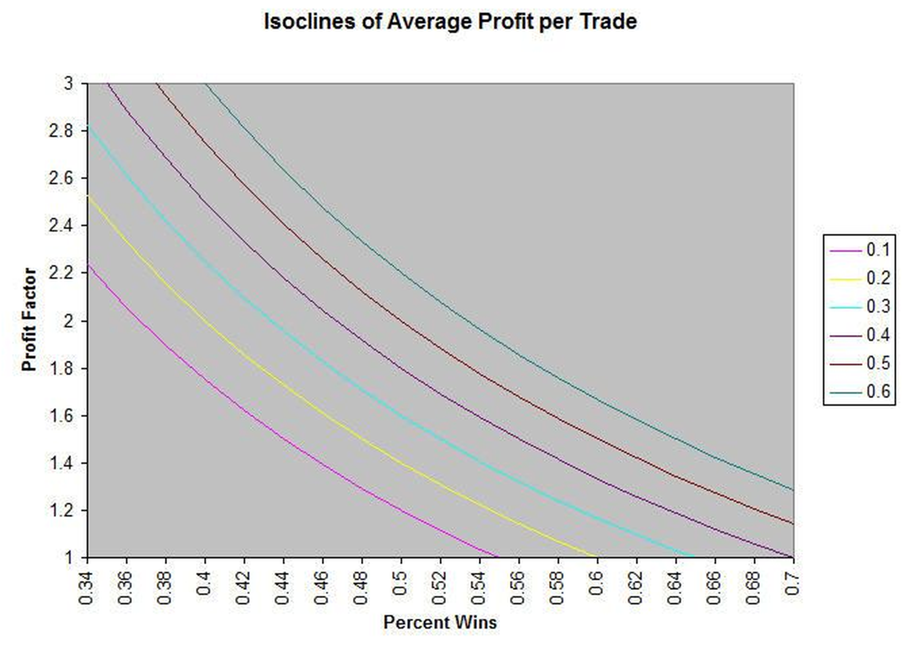
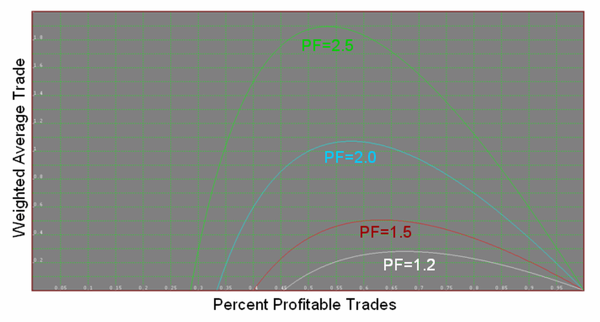
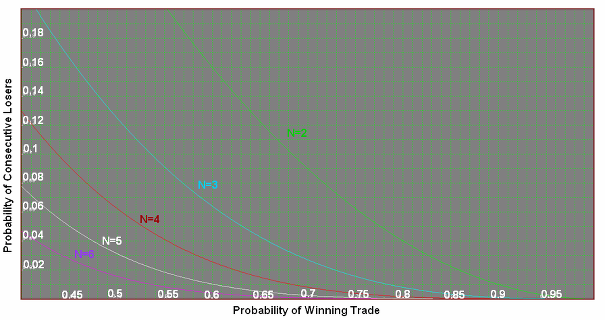
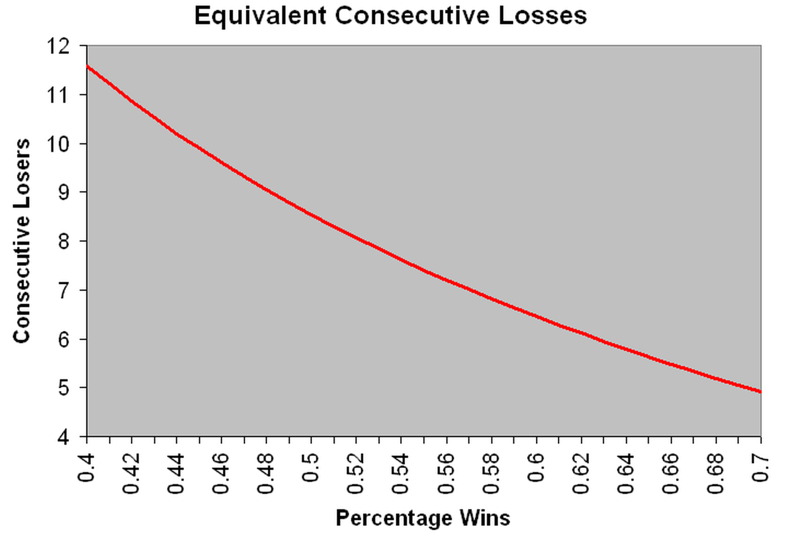

# Evaluating Trading Systems

**By John Ehlers and Ric Way**

- **Downloaded from:** [Mesa Software — System Evaluation](https://www.mesasoftware.com/papers/SystemEvaluation.pdf)

---

## Introduction

What is the best way to evaluate the performance of a trading system? Conventional wisdom holds that the best way is to examine the system's track record over some reasonable amount of time. While this is better than throwing darts, history has shown that systems having a good recent performance often fail when traded into the future. The reasons are many, including changing market conditions, changes in government regulations, changes in technology (such as electronic trading), or even seemingly innocuous changes such as switching from fractional pricing to decimal pricing. Therefore, a more robust evaluation technology is required.

One area of human activity that produces consistent profits through the theory of statistics is gaming. Las Vegas has been built on probability and statistics. At the core, success in gaming is determined only by the odds (percentage winners) and the payout. For example, betting on a single number in roulette offers a payout of 35:1 because there are 35 numbers. However, there are also slots for zero and double zero — So the probability of winning is one in 37. The end result is that the odds are in the favor of the house. There are a plethora of additional rules in roulette, but the odds are always in the favor of the house. The key factors to keep in mind are the probability of winning and the payout.

In trading, the probability of winning trades is obvious. The equivalent of payout is the Profit Factor (PF), which is the ratio of gross winnings to gross losses. In this paper, we will demonstrate that virtually all the significant performance descriptors can be expressed in terms of percent winners and Profit Factor. We also develop a synthetic equity growth curve that relies only on statistics using a Monte Carlo analysis. Since this equity curve is derived strictly from statistics, it is robust because there is no reliance on the factors that can cause a trading system to falter.

## Definitions

Since we will be doing math derivations, we need to shorten our derivation symbols as follows:

- $W = gross winnings
- #W = number of winning trades
- $L = gross losses
- #L = number of losing trades
- PF = Profit Factor
- % = Percent Winning Trades (as a fraction); (1-%) = Percent Losing Trades

In our analyses, we normalize the average gross losses to unity ($L/#L = 1). This way, the average gross winnings is exactly the Profit Factor. Since all losses in trading are not equal, our analysis must be viewed from an overall average perspective.

## Average Win / Average Loss Ratio

The first statistic we examine is the ratio of the average win to the average loss as:

    AveWin   $W / #W   $W   #L         %W + %L       (1-%)
    ------ = ------- = --- * --- = PF * --------- = PF ----
    AveLoss   $L / #L   $L   #W           %W           %

## Average Trade

The average trade profit is the total gross winnings less the total gross losses, divided by the total number of trades. Therefore,

          $W - $L
    T = ----------
          #W + #L

          $W          $L
    T = --------- - ---------
        #W + #L    #W + #L

          PF           1
    T = -------- - --------
        #L           #W
        --- + 1     --- + 1
        #W           #L

          1                1
    T = PF * % - --------------
                    1
                    - - 1
                    %

    T = PF*% - (1 - %)

    T = %(PF + 1) - 1

We can therefore attain the same Average Trade (or Profit Per Trade) with different combinations of Percent Winning Trades and Profit Factor. For example, a trend following system can have a relatively low percentage winning trades because it is continuously trying to find the trend, but have a relatively large Profit Factor because the trend can produce a big winner when it is hit. But the trend system can produce the same average Profit Per Trade as a swing system that has a higher percentage winning trades, but a lower Profit Factor because the market does not move as far in the swing.


**Figure 1. Combinations of Percent Wins and Profit Factor Can Produce Identical Average Profit Per Trade**

## Breakeven Analysis

Breakeven occurs when the average trade, T, is equal to zero. Therefore, the relationship between Profit Factor and Percentage Winners is described as:

    1 = %(PF + 1)

        1
    PF = - - 1
        %

          1 - %
    PF = -------
    B       %

This tells us there is a minimum Profit Factor that must be maintained in order to make a profit using the system, and the relationship of this Profit Factor value to percentage wins. Knowing this minimum allowable Profit Factor for a given percentage winners is pretty cool.

## Optimum Parameter Conditions

Other than the Breakeven Profit Factor, the computations above are nice, but they seem short of meaning. For example, the Average Win to Average Loss ratio goes to infinity when the percentage wins approaches zero. This makes sense, but this singularity gives no insight into the problem of optimizing a system. On the other hand, the average trade is equal to the Profit Factor when the percentage wins approaches unity (no losses). Again, this makes sense, but gives no insight into optimizing a system.

It occurs to us that weighting the Average Trade by the ratio of the Average Win to the Average Loss could be valuable because this weighted product goes to zero at %=1 and goes negative when % is less than at the breakeven point. So, forming this weighted product, we get:

         AveWin
    T * ------- = TW
         AveLoss

                     / PF(1-%) \
    TW = (%(PF+1)-1)| --------  |
                     \   %     /

                    1
    TW = PF((PF+1)- -)(1-%)
                    %

    TW = PF(PF(1-%) - (% + 1/%) + 2)


**Figure 2. An Optimum Weighted Average Trade Exists**

The location of the optimum point can be found by taking the derivative of the Weighted Average Trade and setting that derivative to zero (zero slope at the inflection point). Doing this, we get:

               1
    0 = -PF - 1 + --
                %^2

    so that

               1
    %      = ----------
     OPT     sqrt(1+PF)

OK, that's cool. For example, a PF=2 should have a corresponding % of about .66.

## Consecutive Losing Trades

The question of drawdown is addressed by assuming that the maximum drawdown arises solely from consecutive losing trades. The probability of the first losing trade is (1-%). The probability of the second losing trade is also (1-%), but when compounded, the probability of getting two losing trades in a row is (1-%)^2. Generalizing, the probability of getting N losing trades in a row is (1-%)^N. The threshold of pain is sometimes the number of consecutive losing trades rather than drawdown because consecutive losers tend to make the trader think the trading system is broken. The probability of consecutive trades is shown in Figure 3.

Figure 3 can be used as follows: Assume that your system trades 30 times per year, and that you can stand only one sequence of 4 losing trades in a row in that year. Then, the maximum probability of consecutive losing trades you can stand is 0.033. With reference to Figure 3, you should use a trading system that has a probability of winning trades as .56 or better. If your threshold is 3 consecutive losing trades your system should have a probability of wins greater than .68.


**Figure 3. Probability of Winning Trades must be High to Reduce the Probability of Consecutive Losing Trades.**

On to drawdown. It is unlikely that the maximum drawdown will result solely from consecutive losing trades. The more likely case is produced by a string of losing trades, then a small winning trade followed by another string of losing trades. We therefore need to think in terms of an equivalent number of consecutive losing trades. If we assume a Normal Probability Distribution of these losing trades and further assuming the maximum number of losing trades occurs at the 3 Sigma point of the probability distribution, the remaining area under the Normal curve is just 0.0027. Thus we can find the equivalent number of consecutive losing trades as:

    (1-%)^N = .0027
    N * Log(1-%) = Log(.0027)
          Log(.0027)
    N = ------------
          Log(1-%)

Since the area under the normal curve is directly related to the probability of losing trades, and since exponential is the inverse of a logarithm, the number of consecutive losers increases EXPONENTIALLY as the probability of losing increases. This is not a good thing. In one sense it is the inverse of compound interest. Therefore, you always want to select a trading system that has a high percentage of winners.

Figure 4 shows the relationship between the percentage of profitable trades and the equivalent number of consecutive losing trades. The expected drawdown is computed by multiplying the expected number of consecutive losing trades by the average losing trade value in dollars.


**Figure 4. There is a substantial consecutive losing trades penalty for percentage wins less than 50%.**

## Monte Carlo System Performance Evaluation

In the associated Excel spreadsheet, MonteCarlo.XLS, we show you the future performance that you can expect from your trading system, given that you know its historical percent winners and profit factor and assume these are relatively constant into the future. This is a Monte Carlo analysis, where the results depend only on these parameters and otherwise completely random events. We perform this analysis by placing values for percent profitable trades and Profit Factor in cells B1 and B2 respectively. Then, each time you press F9 to refresh the calculation you will see a new equity curve generated from those parameters. No two equity curves will be the same because they are generated from random events.

The chart additionally shows the cumulative average profit per trade. By definition this is a straight line, and is shown in red. You can compare the equity curve generated by the Monte Carlo analysis in blue with the average equity growth shown in red.

The default settings of 55 percent winners and a Profit Factor of 1.5 describe a reasonably good trading system where these parameters are measured on out-of-sample (not optimized) trades. As you press F9 you can see that the Monte Carlo generated equity curve does not deviate too far from the average equity growth.

Now change the parameters describing a more marginally performing trading system. Insert 52 in cell B1 and 1.1 in cell B2. Now, as you repeatedly press F9, you see two phenomena. First, the cumulative average profit per trade is significantly lower than in the previous example. Secondly, that although there is general success over a very large number of trades, there is a substantial variance of the Monte Carlo generated equity curve and the average equity growth.

The use of the Monte Carlo analysis can provide you with a realistic expectation of how your trading system will perform in the future for the given percent profitable trades and Profit Factor measured from historical performance.

## Monte Carlo Spreadsheet Design

*Extracted from Chapter 15 of "Cybernetic Analysis for Stocks and Futures", John Wiley (modified to add cumulative average profit)*

By determining whether a trade is a winner or a loser using the percentage wins and a random number generator, applying the payout probability to each trade, and summing the randomly selected trades you can provide realistic expectations for the equity growth produced by the system. Only in this sense can randomization be introduced to establish performance. Simply winning or losing is not a random occurrence.

In case you lost the spreadsheet associated with this paper, the following are the directions to recreate the spreadsheet. We need to first insert the two important statistics. In cell A1 type "% Winners" without quotation marks and in cell B1 type 55. In cell A2 type "Profit Factor" without quotation marks and in cell B2 type 1.5. The values of 55 and 1.5 are only initial values, and are representative of a good system. The entries into cells B1 and B2 are system statistics that you can change to visualize their impact on equity growth.

In row 4, insert headings for five columns as "random", "trade profit", "cum profit", "trade #", and "cum avg profit". The quotation marks for the headers are unnecessary.

In cell A5 input "=RAND()" without quotation marks. This creates a random number having a uniform probability density in the range between 0 and 1. This random number is compared to the probability of a win by inserting "=IF(A5<$B$1/100,$B$2,-1)" without the quotation marks into cell B5. This conditional statement says that if the random number falls within the winning probability then assign the payout probability (the Profit Factor) to the trade, otherwise assign a value of -1 to the trade. This is the outcome of the trade. In cell C5 input "=B5" without quotation marks because the first trade profit is the same as the cumulative profit for the first trade. Insert 1 into cell D5 as the first trade number. In cell E5, insert the equation "=D5*(($B$2+1)*$B$1/100-1)" without the quotation marks.

Copy all of row 5 into row 6.

Then change cell C6 to be "=C5+B6" without the quotation marks. This sums the trade profits in column C. Next insert the equation "=D5+1" without quotation marks in cell D6. This increments the trade number.

Finally, copy all of row 6 and paste it into rows 7 through 504. Now you have the data for your analysis over 500 trades. Make a line plot of columns C and E to graph the Monte Carlo equity growth and cumulative average trade profit together.

Just press F9 to recompute the spreadsheet. You will create a new randomized equity growth curve because all the random numbers have changed. Repeat as often as you desire to get a feeling you know what to expect. You can change the data in cells B1 and B2 to assess the sensitivity of success to these basic parameters.

---

## BibTeX

```bibtex
@misc{ehlers_evaluating_systems,
  author       = {John F. Ehlers and Ric Way},
  title        = {Evaluating Trading Systems},
  year         = {2002},
  howpublished = {online},
  url          = {https://www.mesasoftware.com/papers/SystemEvaluation.pdf}
}
```
