# Inferring Trading Strategies from Probability Distribution Functions

**By John Ehlers**

- **Downloaded from:** [Mesa Software — Inferring Trading Strategies](https://www.mesasoftware.com/papers/InferringTradingStrategies.pdf)

---

## Background

The primary purpose of technical analysis is to observe market events and tally their consequences to formulate predictions. In this sense market technicians are dealing with statistical probabilities. In particular, technicians often use a type of indicator known as an oscillator to forecast short-term price movements.

An oscillator can be viewed as a high pass filter in that it removes lower frequency trends while allowing the higher frequency components, i.e., short-term price swings to remain. On the other hand, moving averages act as a low pass filter by removing short-term price movements while permitting longer-term trend components to be retained. Thus moving averages function as trend detectors whereas oscillators act in an opposite manner to "de-trend" data in order to enhance short term price movements. Oscillators and moving averages are filters that convert price inputs into output waveforms to magnify or emphasize certain aspects of the input data. The process of filtering necessarily removes information from the input data and its application is not without consequences.

A significant issue with oscillators (as well as moving averages) for short term trading is that they introduce lag. While academically interesting, the consequences of lag are costly to the trader. Lag stems from the fact that oscillators by design are reactive rather than anticipatory. As a result, traders must wait for confirmation; a process that introduces additional lag into the ability to take action. It is now widely accepted that classical oscillators can be very accurate in hindsight but are typically inadequate for forecasting future short-term market direction, in large part due to lag.

## Probability Distribution Functions

The basic shortcoming of classical oscillators is that they are reactive rather than anticipatory. As a result, the undesirable lag component in oscillators significantly degrades their usefulness as a tool for profitable short-term trading. What is needed is an effective mechanism for anticipating turning points.

The Probability Distribution Function (PDF) can be borrowed from the field of statistics and used to examine detrended market prices for the purpose of inferring trading strategies. The PDF offers an alternative approach to the classical oscillator; one that is non-causal in anticipating short-term turning points.

PDFs place events into "bins" with each bin containing the number of occurrences in the y-axis and the range of events in the x-axis. For example, consider the square wave shown in Figure 1A. Although unrealistic in the real world, if one were to envision the square wave as "quantum" prices that can only have values of -1 or +1, the resultant PDF consists simply of two vertical "spikes" at -1 and +1 as shown in Figure 1B. Such a waveform could not be traded using conventional oscillators because any price movement would be over before the oscillator could yield a signal. However as the PDFs below will show, the theoretical square wave is not far removed from real-world short term cycles.

As a practical example, a theoretical sine wave can be used to more accurately model real-world detrended prices. An idealized sinewave is shown in Figure 1C and its corresponding PDF in Figure 1D. The PDFs of the square wave and that of the sine wave are remarkably similar. In each case there is a high probability of the waveforms being near their extremes as can be seen in the large spikes in Figure 1D. These spikes correspond to short-term turning points in the detrended prices. The probability is high near the turning points because there is very little price movement in these phases of the cycle, with prices ranging only from about 0.8 to 1.0 and -0.8 to -1.0 in Figure 1C.

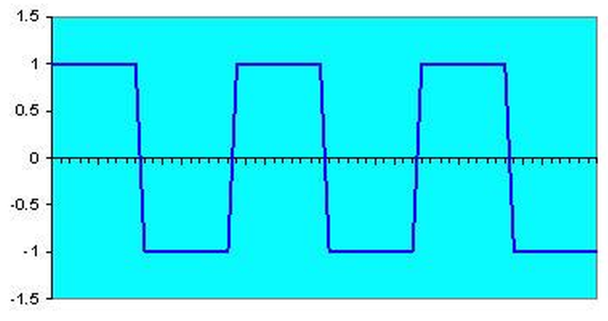
**Figure 1A. Square Wave**

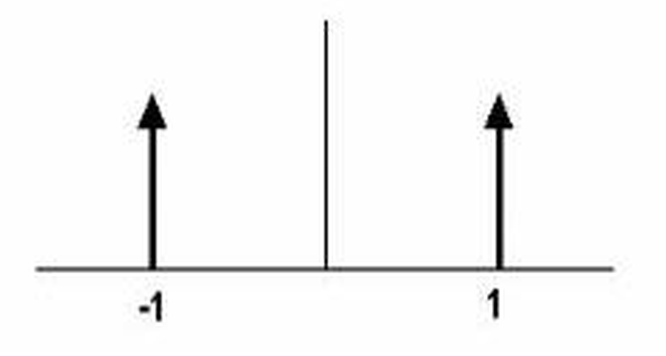
**Figure 1B. Square Wave Binary PDF**

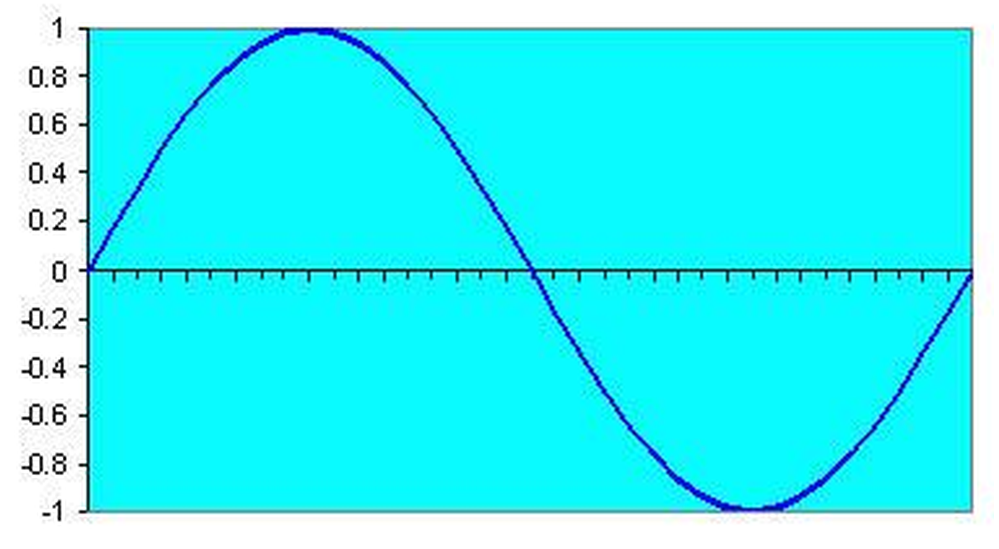
**Figure 1C. Sine Wave**

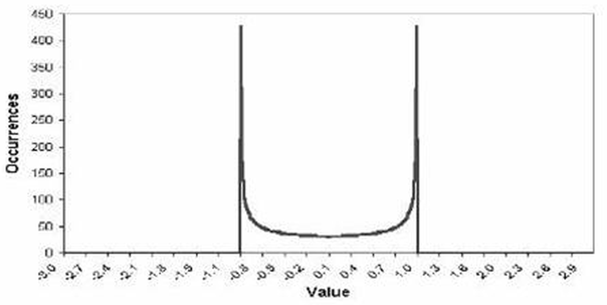
**Figure 1D. Sinewave PDF**

The high probability of short term prices being near their extreme excursions is a principal difficulty in short-term cycle and swing trading. The move has mostly occurred before the oscillators can identify the turning point. The indicator "works" but only in hindsight, rendering its usefulness limited for predicting future price movements.

A possible solution to this lag dilemma is to develop techniques to anticipate turning points. Although exceedingly difficult to accomplish with classical oscillators, the PDF affords us the opportunity to anticipate turning points if properly shaped or to use two alternative methods:

1. Model the market data as a sine wave and shift the modeled waveform into the future by generating a leading cosine wave from it.
2. Apply a transform to the detrended waveform to isolate the peak excursions, i.e., rare occurrences — and anticipate a short-term price reversion from the peak.

Each of these approaches will be examined below. However it is instructive to begin with an analogy for visualizing a theoretical sine wave PDF and then examine PDFs of actual market data. As will be shown, market data PDFs are neither Gaussian as commonly assumed nor random as asserted by the Efficient Market Hypothesis.

## Measuring Probability Distribution Functions

An easy way to visualize how a PDF is measured as in Figure 2B is to envision the waveform as beads strung on parallel horizontal wires on vertical frames as shown in Figure 2A. Rotate the wire-frame clockwise 90 degrees (1/4 turn) so the horizontal wires are now vertical allowing the beads to fall to the bottom. The beads stack up in Figure 2B in direct proportion to their density at each horizontal wire in the waveform with the largest number of occurrences at the extreme turning points of +1 and -1.

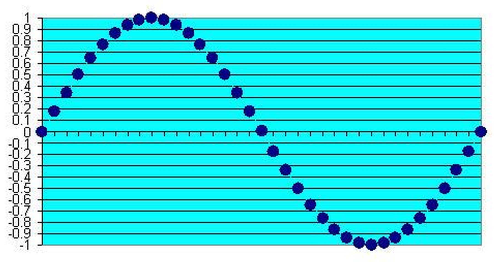
**Figure 2A. Sinewave Bead Waveform**

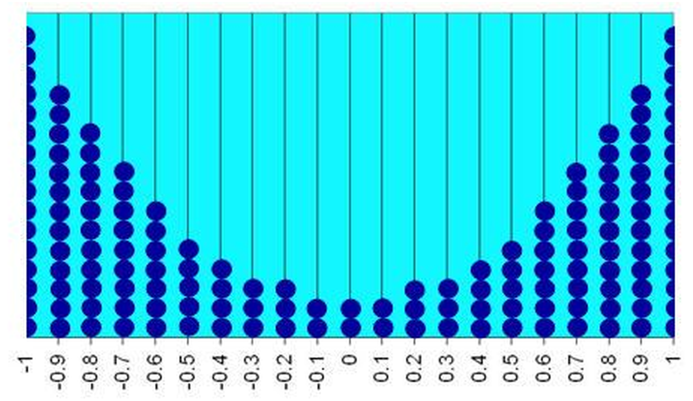
**Figure 2B. Sinewave Bead PDF**

Measuring PDFs of detrended prices using a computer program is conceptually identical to stacking the beads in the wireframe structure. The amplitude of the detrended price waveform is quantized into "bins" (i.e., the vertical wires) and then the occurrences in each bin are summed to generate the measured PDF. The prices are normalized to fall between the highest point and the lowest point within the selected channel period.

Figure 3 shows actual price PDFs measured over thirty years using the continuous contract for US Treasury Bond Futures. Note that the distributions are similar to that of a sine wave in each case. The non-uniform shapes suggest that developing short term trading systems based on sine wave modeling could be successful.

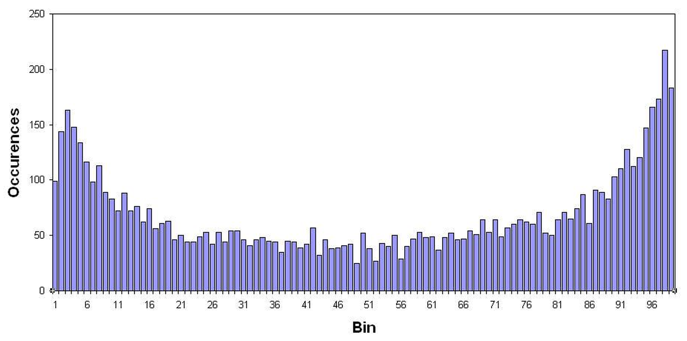
**Figure 3A. PDF of a 20 Bar Channel**

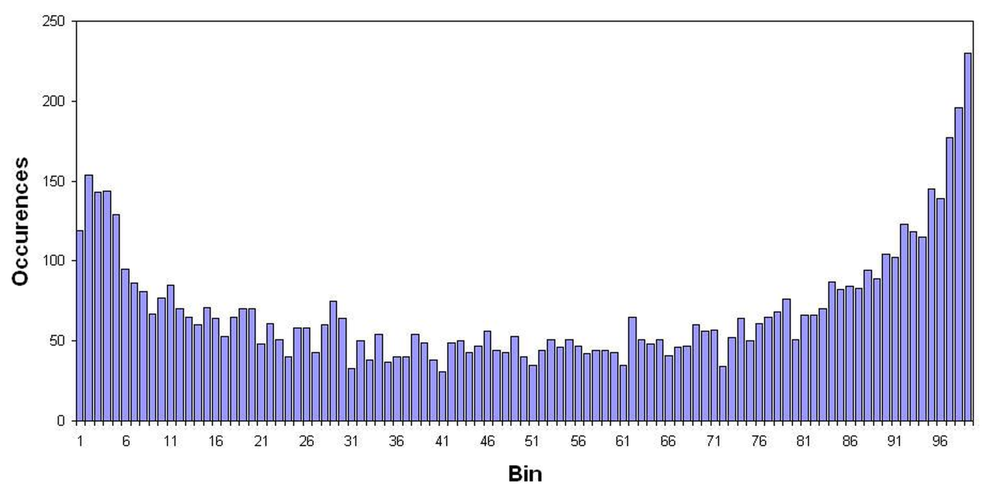
**Figure 3B. PDF of a 40 Bar Channel**

Normalizing prices to their swings within a channel period is not the only way to detrend prices. An alternative method is to sum the up day closing prices independently from down days. That way the differential of these sums can be normalized to their sum. The result is a normalized channel, and is the generic form of the classic RSI indicator. The measured PDF using this method of detrending of the same 30 years of US Treasury Bonds data is shown in Figure 4. In this case, the PDF is more like the familiar bell-shaped curve of a Gaussian PDF. One could conclude from this that a short-term trading system based on cycles would be less than successful as the high probability points are not near the maximum excursion turning points.

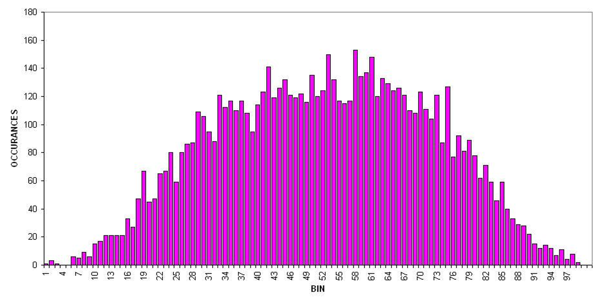
**Figure 4. Measured RSI PDF of US Treasury Bonds Over 30 Years**

Because the turning points have relatively low probability an alternate strategy can be inferred. The idea is to buy when the detrended price crosses below a threshold near the lower bound in anticipation of the prices reversing to higher probability territory. Similarly, the strategy would sell when the detrended price crosses above a threshold near the upper bound. Note that this is not the same as using classical 30/70 or 20/80 thresholds for signals with the RSI because the signal is not waiting for confirmation by crossing back across the thresholds. Here we are anticipating a reversal to a higher probability occurrence — we expect a reversion to normalcy. Using this anticipatory method in the case of a classic indicator such as the Stochastic oscillator can be costly because the Stochastic can easily remain at the extreme excursion point (or "rail" in engineering parlance) for long periods of time.

As previously mentioned, another way to detrend the price data is to use a high pass filter to remove its lower frequency trend components. Once detrended, the result must be normalized to a fixed excursion so that it can be properly binned before applying the PDF. The resulting PDF is shown in Figure 5. In this case, the PDF shape is nearly uniform across all bins. A uniform PDF means the amplitude in one bin is just as likely to occur as another. In this case neither a cycles-based strategy nor a strategy based on low probability events could be expected to be successful. The PDF must somehow be transformed to enhance low probability events in order to be useful in trading.

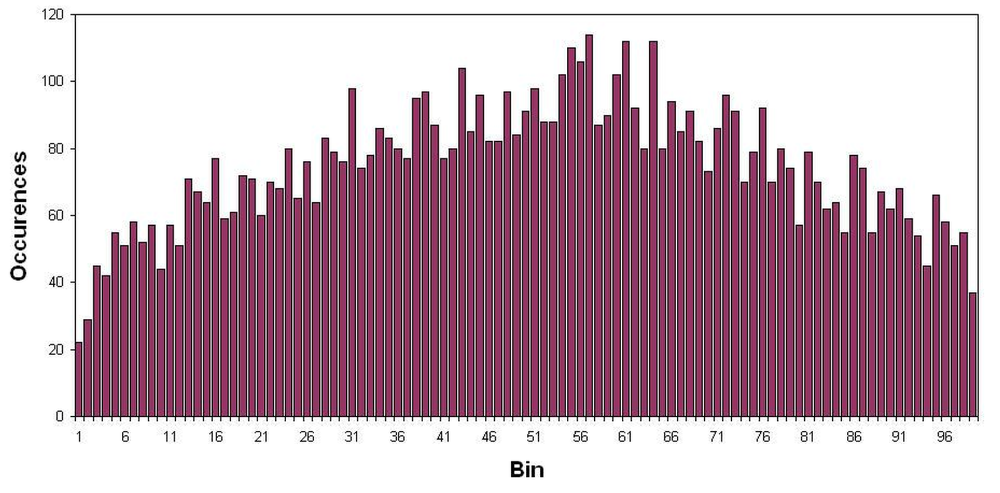
**Figure 5. Measured HighPass Filter PDF of US Treasury Bonds Over 30 Years**

## Transforming the PDF

Not all detrending techniques yield PDFs that suggest a successful trading technique. In much the same way that an oscillator can be applied to price data to enhance short-term turning points, a transformation function can be applied to the detrended prices to enhance identification of "black swan", i.e., highly unlikely events and to develop successful trading strategies based on predicting a reversion back to normalcy following a black swan event.

For example, a PDF can be enhanced through the use of the Fisher Transform. This mathematical function alters input waveforms varying between the limits of -1 and +1 transforming almost any PDF into a waveform that has nearly Gaussian. The Fisher Transform equation, where x is the input and y is the output is:

                 ⎛ 1 + x  ⎞
    y = 0.5 * ln ⎜ ------ ⎟
                 ⎝ 1 - x  ⎠

Unlike an oscillator, the Fisher Transform is a nonlinear function with no lag. The transform expands amplitudes of the input waveforms near the -1 and +1 excursions so they can be identified as low probability events. As shown in Figure 6 the transform is nearly linear when not at the extremes. In simple terms, the Fisher Transform doesn't do anything except at the low-probability extremes. Thus it can be surmised that if low probability events can be identified, trading strategies can be employed to anticipate a reversion to normal probability after their occurrence.

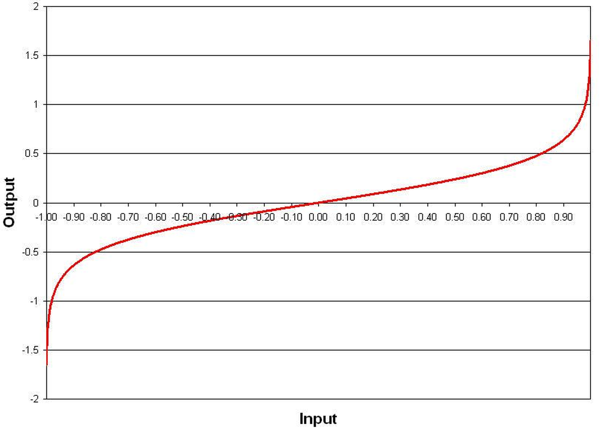
**Figure 6. The Fisher Transform Nonlinearly Converts Signal Amplitudes That Result in Nearly Normal PDFs**

The effect of the Fisher Transform is demonstrated by applying it to the HighPass Filter approach that produced the PDF in Figure 5. The output is rescaled for proper binning to generate the new measured PDF. The new measured PDF is displayed in Figure 7, with the original PDF shown in the inset for reference. Here we have a waveform that suggests a trading strategy using the low probability events. When the transformed prices exceed an upper threshold the expectation is that staying beyond that threshold has a low probability. Therefore, exceeding the upper threshold presents a high probability selling opportunity. Conversely, when the transformed prices fall below a lower threshold the expectation is that staying below that threshold is a low probability and therefore falling below the lower threshold presents a buying opportunity.

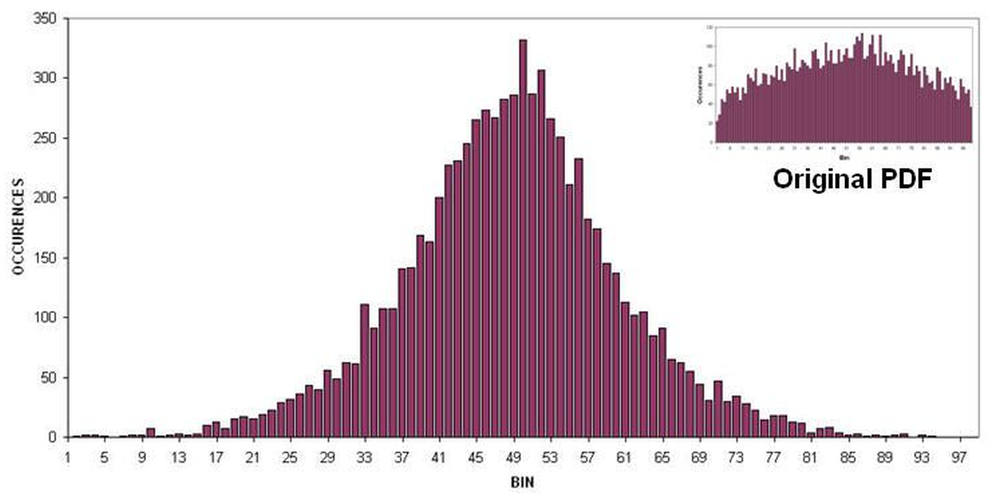
**Figure 7. Measured HighPass Filter with Fisher Transform PDF of US Treasury Bonds Over 30 Years**

## Derived Trading Strategies

It is clear that no single short term trading strategy is suitable for all cases because the PDFs can vary widely depending on the detrending approach. Since the PDF of data detrended by normalizing to peak values has the appearance of a theoretical sinewave, the logical trading strategy would be to assume the waveform is, in fact, a sine wave and then identify the sine wave turning points before they occur. On the other hand, data that is detrended using a generic RSI approach or is detrended using a HighPass filter with a Hilbert Transform should use a trading strategy based on a more statistical approach. Thus, for the RSI and Hilbert Transform approaches, the logical strategy consists of buying when the detrended prices cross below a lower threshold and selling when the detrended prices cross above an upper threshold. Although somewhat counterintuitive, this second strategy is based on the idea that prices outside the threshold excursions are low probability events and the most likely consequence is that the prices will revert to the mean.

Both short term trading strategies share a common problem. The problem is that the detrending removes the trend component, and the trend can continue rather than having the prices revert to the mean. In this case, a short term reversal is exactly the wrong thing to do. Therefore an additional trading rule is required. The rule added to the strategies is to recognize when the prices have moved opposite to the short term position by a percentage of the entry price. If that occurs, the position is simply reversed and the new trade is allowed to go in the direction of the trend.

The "Channel" Cycle Strategy finds the highest close and the lowest close over the channel length are computed by a simple search algorithm over a fixed lookback period. Then, the detrended price is computed as the difference between the current close and the lowest close, normalized to the channel width. The channel width is the difference between the highest close and the lowest close over the channel length. The detrended price is then BandPass filtered[^1] to obtain a near sine wave from the data whose period is the channel length. From the calculus it is known that d(Sin(ωt))/dt = ωCos(ωt). Since a simple one bar difference is a rate-change, it is roughly equivalent to a derivative. Thus, an amplitude corrected leading function is computed as the one bar rate of change divided by the known angular frequency. In this case, the angular frequency is 2π divided by the channel length. Having the sine wave and the leading cosine wave, the major trading signals are the crossings of these two waveforms. The strategy also includes a reversal if the trade has an adverse excursion in excess of a selected percentage of the entry price.

The Generic "RSI" Strategy sums the differences in closes up independently from the closes down over the selected RSI length. The RSI is computed as the differences of these two sums, normalized to their sum. A small amount of smoothing is introduced by a three tap FIR filter. The main trading rules are to sell short if Smoothed Signal crosses above the upper threshold and to buy if Smoothed Signal crosses below the lower threshold. As before, the strategy also includes a reversal if the trade has an adverse excursion in excess of a selected percentage of the entry price.

The High Pass Filter plus Fisher Transform ("Fisher") Strategy filters the closing prices in a high pass filter[^1]. The filtered signal is then normalized to fall between -1 and +1 because this range is required for the Fisher Transform to be effective. The normalized amplitude is smoothed in a three tap FIR filter. This smoothed signal is limited to be greater than -.999 and less than +.999 to avoid having the Fisher Transform blow up if its input is exactly 1. Finally, the Fisher Transform is computed. The main trading rules are to sell short if the Fisher Transform crosses above the upper threshold and to buy if the Fisher Transform crosses below the lower threshold. As before, the strategy also includes a reversal if the trade has an adverse excursion in excess of a selected percentage of the entry price.

The three trading strategies were applied to the continuous contract of US Treasury Bond Futures for data 5 years prior to 12/7/07. The performance of the three systems is summarized in Table 1. All three systems show respectable performance, with the RSI strategy and Fisher strategy having similar performance with respect to percentage of profitable trades and profit factor (gross winnings divided by gross losses). All results are based on trading a single contract with no allowance for slippage and commission. It is emphasized that all settings were held constant over the entire five year period. Since the trading strategies have only a small number of optimizable parameters, optimizing over a shorter period is possible without compromising a trade-to-parameter ratio requisite to avoid curve fitting. Thus, performance can be enhanced by optimizing over a shorter time span.

### Table 1. Trading Strategy Performance Comparison

| Trading Strategy   | Net Profit | # Trades | % Profitable | Profit Factor | Drawdown   |
|--------------------|------------|----------|--------------|---------------|------------|
| Channel            | $54,968    | 142      | 53.5         | 1.72          | ($15,520)  |
| RSI                | $72,468    | 119      | 57.1         | 2.05          | ($11,625)  |
| Fisher Transform   | $73,125    | 135      | 57.0         | 2.10          | ($9,125)   |

Annualized performance of the trading strategies was assessed by applying the real trades over the five year period to a Monte Carlo analysis for 260 days, an approximate trading year. In each case the Monte Carlo analysis used 10,000 iterations, simulating nearly 40 years of trading. Software to do this analysis was MCSPro[^2] by Inside Edge Systems. Due to the central limit theorem, the probability distribution of annual profit has a Normal Distribution and the Drawdown has a Rayleigh Distribution. The Monte Carlo analysis has the advantages that not only are the most likely annual profits and drawdowns produced, but also one can easily assess the probability of breakeven or better. Further, one can make a comparative reward/risk ratio by dividing the most likely annual profit by the most likely annual drawdown. One can also evaluate the amount of tolerable risk and required capitalization in small accounts from the size of the two or three sigma points in the drawdown.

The Monte Carlo results for the Channel strategy are shown in Figure 8. The most likely annual profit is $11,650 and the most likely maximum drawdown is $7,647 for a reward to risk ratio of 1.52. The Channel strategy has an 88.3% chance of break even or better on an annualized basis.

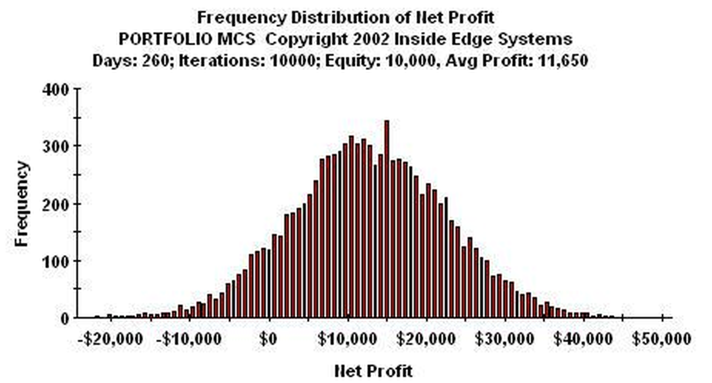
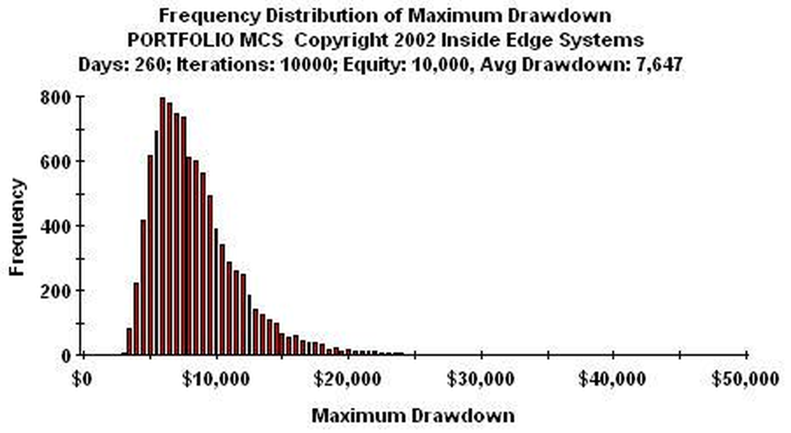
**Figure 8. Annualized Performance Monte Carlo Results for Channel Strategy**

The Monte Carlo results for the RSI strategy are shown in Figure 9. The most likely annual profit is $17,085 and the most likely maximum drawdown is $6,219. Since the profit is higher and the drawdown is lower than for the Channel strategy, the reward to risk ratio is much larger at 2.75. The RSI strategy also has a better 96.6% chance of break even or better on an annualized basis.

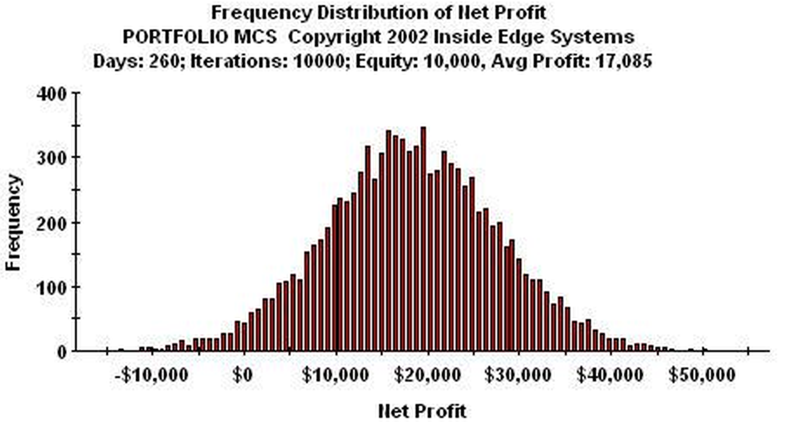
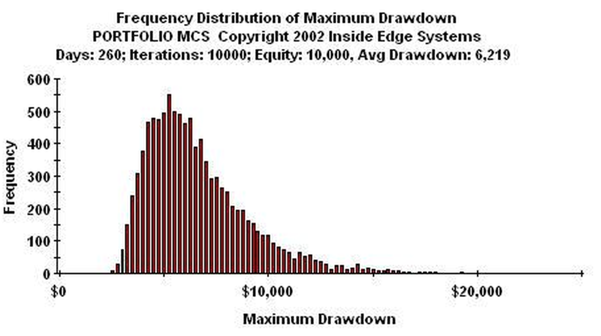
**Figure 9. Annualized Performance Monte Carlo Results for RSI Strategy**

The Monte Carlo results for the Fisher strategy are shown in Figure 10. The most likely annual profit is $16,590 and the most likely maximum drawdown is $6,476. The reward to risk ratio of 2.56 is about the same as for the RSI strategy. The Fisher Transform strategy also has about the same chance of break even or better at 96.1%.

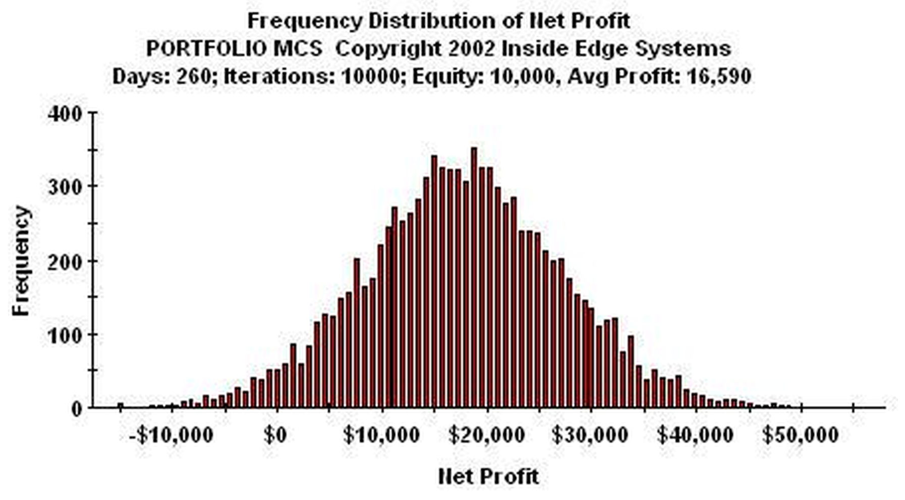
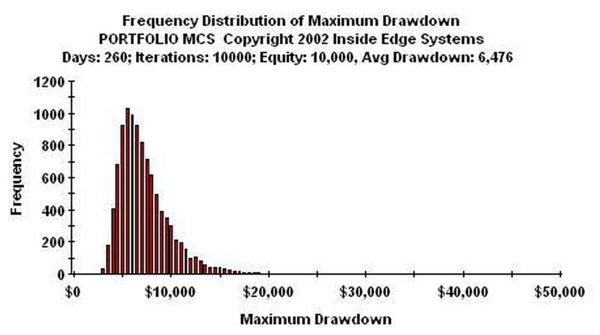
**Figure 10. Annualized Performance Monte Carlo Results for Fisher Strategy**

These studies show that the three trading strategies are robust across time and offer comparable performance when applied to a common symbol. To further demonstrate robustness across time as well as applying to a completely different symbol, performance was evaluated on the S&P Futures, using the continuous contract from its inception in 1982. In this case, we show the equity curve produced by trading a single contract without compounding. There is no allowance for slippage and commission. The shape of the equity curves are explained, in part, by the change of the point size from $500 per point to $250 per point, by inflation, by the increasing absolute value of the contract, and by increased volatility. The major point is that none of the three trading strategies had significant dropouts in equity growth over the entire lifetime of the contract.

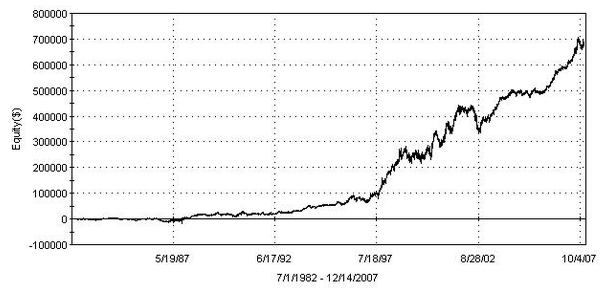
**Figure 11. 25 Year Equity Growth of Channel Strategy Trading the SP Futures Contract**

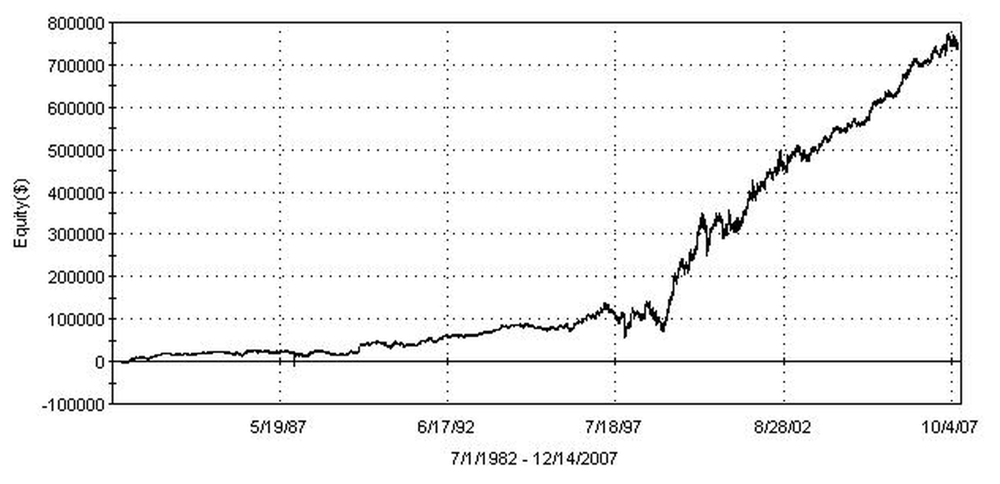
**Figure 12. 25 Year Equity Growth of RSI Strategy Trading the SP Futures Contract**

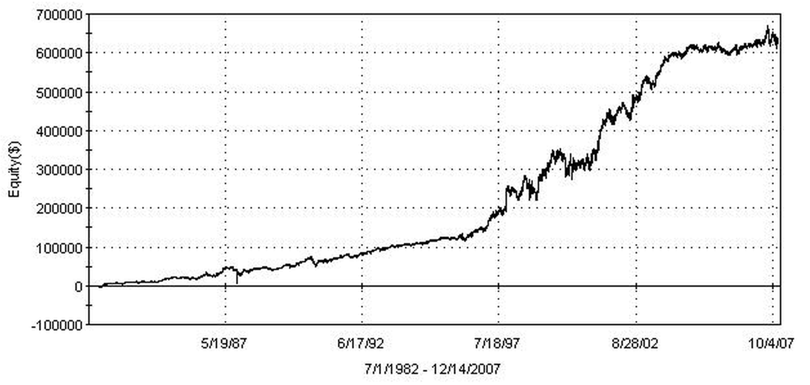
**Figure 13. 25 Year Equity Growth of Fisher Strategy Trading the SP Futures Contract**

The robust performance of these new trading strategies are particularly striking when compared to more conventional trading strategies. For example, Figure 14 shows the equity growth of a conventional RSI trading system that buys when the RSI crosses over the 20% level and sells when the RSI crosses below the 80% level. This system also reverses position when the trade has an adverse excursion more than a few percent from the entry price. This conventional RSI system was optimized for maximum profit over the life of the S&P Futures Contract. Not only has the conventional RSI strategy had huge drawdowns, but its overall profit factor was only 1.05. Any one of the new strategies I have described offers significantly superior performance over the contract lifetime. This difference demonstrates the efficacy of the approach and the robustness of these new systems.

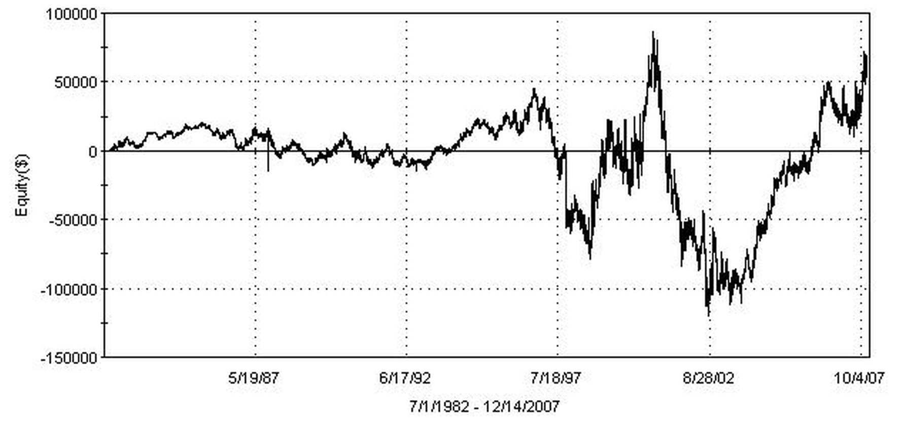
**Figure 14. 25 Year Equity Growth of a Conventional RSI Strategy Trading the SP Futures Contract**

## Conclusions

The PDF has been shown to offer an alternative approach to the classical oscillator, one that is non-causal in anticipating short-term turning points.

Several specific trading strategies have been presented that demonstrate robust performance across a long timespan to accommodate varying market conditions; across a large number of trades to avoid curve fitting; and among different markets to demonstrate freedom from market personalities.

In each case the PDF can infer a trading strategy that is likely to be successful. When no strategy is suggested, the Fisher Transform can be applied to change the PDF to a Gaussian distribution. The Gaussian PDF then infers that a trading strategy using a reversion to the mean can be successful.

## About the Author

John Ehlers is chief scientist for www.eminiz.com and www.isignals.com. The trading strategies described here are used at these websites, additionally with adaptation to measured market conditions and strategy selection based on recent out-of-sample performance. John is a pioneer in introducing the MESA cycles-measuring algorithm and the use of digital signal processing in technical analysis.

John Ehlers
6595 Buckley Drive
Cambria, CA 93428
805-927-3065

[^1]: John Ehlers, "Swiss Army Knife Indicator", Stocks & Commodities Magazine, January 2006, V24:1, pp28-31, 50-53
[^2]: MCSPro, Inside Edge Systems, Bill Brower, 200 Broad St., Stamford, CT 06901

---

## BibTeX

```bibtex
@misc{ehlers_inferring_strategies,
  author       = {John F. Ehlers},
  title        = {Inferring Trading Strategies from Probability Distribution Functions},
  year         = {2008},
  howpublished = {online},
  url          = {https://www.mesasoftware.com/papers/InferringTradingStrategies.pdf}
}
```
