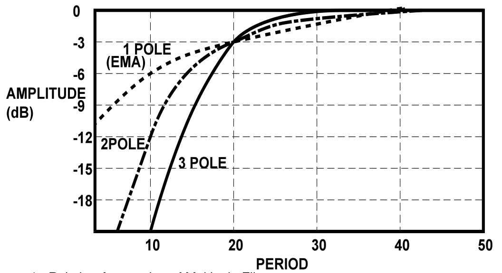
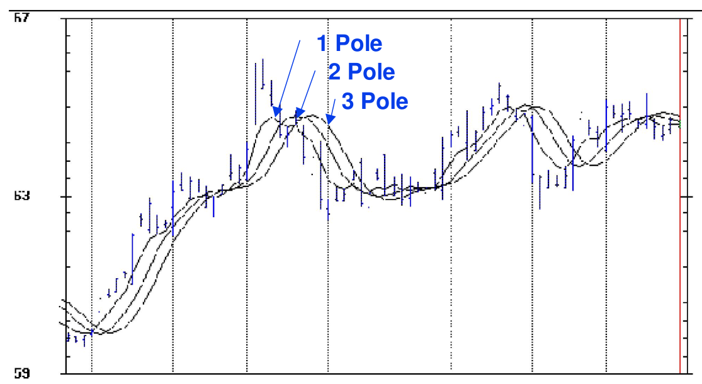
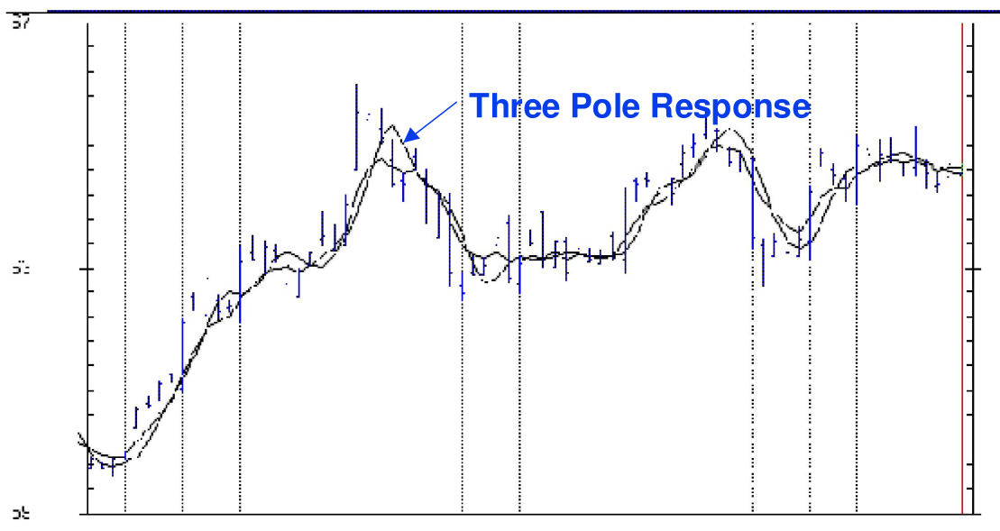

# Poles, Zeros, and Higher Order Filters

**By John Ehlers**

- **Downloaded from:** [Mesa Software — Poles](https://www.mesasoftware.com/papers/Poles.pdf)

---

## Introduction

Smoothing filters are at the very core of what we technical analysts do. All technicians are familiar with Simple Moving Averages, Exponential Moving Averages, and maybe even weighted moving averages. It is surprising that the selection of filter types used by analysts is relatively sparse. I think this is partially due to using techniques the way they have always been done, hailing back to the days when analysis was done by hand or on a calculator. However, today with the power of modern computers there is no reason why more sophisticated filters cannot be employed. Once these filters are functionally understood they are no more difficult to use than simple averages and can possibly have a much greater payback in efficient indicators and trading systems.

In this article we will examine filters from the perspective of a signal analyst, rather than a trader. This will highlight the fundamental differences between simple moving averages and exponential moving averages. Linear system theory will be used to formulate the solution to the problems. With this understanding, higher order Butterworth Filters are introduced because of their enhanced payoff when considering the lag versus smoothing tradeoffs.

## Transforms

Transforms are mathematical techniques where the transform operator is understood to stand for a calculus derivative. This approach enables us to solve very complicated differential equations using relatively simple algebra. Fourier Transforms are used to solve for steady state frequency conditions. The Fourier Transform operator is jω, where ω = 2πF is the angular frequency. The LaPlace Transform operator is "s", and is used to solve for transient conditions. The solutions to problems involving transform arithmetic can be pictured in the complex plane. As we have previously described, the complex plane extends to plus and minus infinity horizontally along the "real" axis and extends to plus and minus infinity vertically along the "imaginary" axis. Just to add to the confusion, the imaginary axis corresponds to physically realizable frequencies in the case of Fourier Transforms.

Transforms are not necessarily limited to continuous functions. In trading we use sampled data. There is only one closing price per day. Therefore, there is a discrete jump in our sampled data as we go from bar to bar. This is true no matter how small the steps are, right down to the tick level. Z Transforms are used for sampled data systems, where difference equations must be used rather than differential equations. Although the distinction between differential equations and difference equations seem fairly subtle, the impact on interpretation is profound. It turns out that realizable frequencies in Z Transforms fall on a unit circle. What was the left half infinite complex plane maps inside this circle while the right half infinite complex plane falls outside. The operator for Z Transforms is Z^-1 = 1/Z, and this operator means one unit of delay.

"So what", I hear you say. The use of Z transforms enables us to solve complicated filter equations using simple algebra. It is exactly this feature that helps us better comprehend what is going on.

## Transfer Functions

In linear system theory it is common to describe the output signal as the product of the input signal times the transfer response of the circuit. Let's look at what that means for an Exponential Moving Average (EMA). Using EasyLanguage notation for lags, the EMA is written as:

    f = α*g + (1-α)*f[1]

where

- f = output
- g = input

Using Z Transform notation, this equation becomes:

    f = α*g + (1-α)*f*Z^-1

Solving for the output in terms of the input, we obtain:

    f*(1 – (1-α)Z^-1) = α*g
    f = (α / (1 – (1-α)Z^-1))*g

This equation is an expression of the signal output of the filter in terms of the data input to the filter times the "Transfer Response" of the filter itself. Therefore, the transfer response of an Exponential Moving Average Filter is:

    H(z) = α / (1 – (1-α)Z^-1)

## Exponential Moving Average Characteristics

What if Z = (1-α)? In this case the denominator of the Transfer Response would go to zero and the Transfer Response itself would go to infinity. This is called a "pole" in the transfer response, and denotes a critical characteristic. A general visualization of the transfer response of a generalized circuit is to think of the complex plane looking like a circus tent. Location of the tent poles is easily pictured. Of course, Z can never have the value of (1-α) because Z is limited to discrete integer steps. Therefore, the transfer response is stable and can never "blow up" (unless you make a typographical error in entering your code). In any event, an exponential moving average only has one pole in its response, and therefore is called a single pole low pass filter. It passes low frequencies and attenuates high frequencies.

It turns out that there is a mapping between poles of continuous functions and poles of difference functions. Without proof, this relationship is that if the continuous function has a pole at ω = -a, the difference function will have a pole at Z = e^aT. In our case the sampling period can be considered unity (one day, for example) because the cycle periods we use are relative to the sample period (a 12 day cycle, for example).

Using the relationships of the poles, we can solve for the critical frequency of an exponential moving average. Since ω = 2π/P, where P is the period of the critical frequency, we have the relationship:

    (1-α) = e^(-2π/P)

Taking the natural logarithm of both sides of this equation and solving for the critical period, we have:

    ln(1-α) = -2π/P
    P = -2π / ln(1-α)

For example, if we use α = .27 in an exponential moving average, we can expect cycle periods shorter than 20 bars to be attenuated. That is, a 20 bar cycle is the critical period for this EMA, where the filter output is approximately .707 times the input signal amplitude. For a single pole filter, the output amplitude is cut in half each time the signal period is cut in half relative to the critical period. A 10 bar cycle output would be reduced to .35 of its input amplitude and a 5 bar cycle output would be reduced to .177 of its input amplitude.

We have now fully characterized an EMA. Its frequency response is defined in terms of α in the previous paragraph. In a previous article[^1] the time lag was derived as

    Lag = (1-α)/α

An impulse input into an EMA at any time in the past will continue to appear in the output (albeit very small as time goes on) into the infinite future. This is because in each iteration of the calculation a little piece of the previous calculation is retained. Thus it is called an Infinite Impulse Response (IIR) filter. All filters having poles in their transfer responses are IIR filters.

## Simple Moving Average Characteristics

A Simple Moving Average (SMA) filter is not an IIR filter. The simple moving average has an observation window whose length can be selected. An impulse data into this filter will appear at its output only as long as the impulse is contained within the window length. Therefore, an SMA falls in the category of a Finite Impulse Response (FIR) filter. Let's examine the transfer response of a SMA.

A 5 period SMA can be written in EasyLanguage notation as:

    f = (g + a1*g[1] + a2*g[2] + a3*g[3] + a4*g[4]) / 5

In Z Transform notation this becomes:

    f = (g/5)*(1 + a1*Z^-1 + a2*Z^-2 + a3*Z^-3 + a4*Z^-4)

There are no poles in this transfer response. Instead, we have a polynomial of order 4 in terms of Z. According to the fundamental theorem of algebra, any Nth order polynomial can be factored into N zeros. These are called zeros of the polynomial, surprisingly enough.

Thus, a simple moving average filter is a FIR and its transfer response is an all-zero response. The time delay of an all-zero FIR filter is the "center of gravity" of the weighting functions (the coefficients of the polynomial). The weighting functions are commonly symmetrical with respect to the center of the observation window, and the resulting lag from such filters is half the observation window width. If a high degree of smoothing is desired the lag can be substantial.

Another use of transforms is that they enable descriptions of the transfer responses to be made in either the time domain or in the frequency domain. For example, the time domain response of a simple average is a rectangle. The Fourier Transform of the rectangle is a Sin(X)/X pattern. That is, the frequency response of a simple average is Sin(X)/X. The first zero of the Sin(X)/X pattern occurs when X = π. We know that we get a zero in the transfer response of a simple average when the length of the average is exactly equal to the Period of the cycle being filtered because in taking the average over the full cycle there are as many points above the mean as below it. As a result, the average for that cycle is zero. An easy to remember approximation is that the simple moving average critical Period is twice the observation window length. All longer cycles are passed through the simple moving average with very little attenuation.

## Multipole Filters

An EMA is a one pole IIR filter. The rule of thumb is that the attenuation is doubled each time the filtered cycle period is halved relative to the critical frequency of the filter. Stated another way, the attenuation increases 6 dB per octave. If we have a well designed filter, the attenuation rule can be generalized to be 6 dB per octave per pole. Thus, a two pole filter having a critical period of 20 bars will attenuate 10 bar cycles to .25 of the input amplitude and 5 bar cycles to .0625 of the input amplitude. A three pole filter having a critical period of 20 bars will attenuate 10 bar cycles to .125 of the input amplitude and 5 bar cycles to .0156 of the input amplitude. The relative filter transfer responses are shown in Figure 1.

Think of that circus tent analogy, and attenuation as a marble rolling along the surface of the tent. If we add more poles to the tent we can increase the slope of the surface to get the marble to roll faster. We could theoretically continue to add poles to our filter design without limit to create a "stonewall" filter response at the critical period. But there is a penalty for adding poles. That penalty is lag.

There are a host of multipole filter designs available. The relative advantages of these different filter types is limited for us traders because we can practically use only a few poles in the response before the lag penalty becomes too severe. One of the more common multipole filter responses is called a Butterworth filter. The lag of Butterworth filters can be computed from:

    Lag = N*P / π^2

Where

- N = number of poles in the filter
- P = critical period of the filter

The equations for a 2 pole Butterworth filter in EasyLanguage notation are:

    a = ExpValue(-1.414*3.14159/P);
    b = 2*a*Cosine(1.414*180/P);
    f = b*f[1] – a*a*f[2] + ((1 – b + a*a)/4)*(g + 2*g[1] + g[2]);

where P = critical period of the 2 pole filter.

The equations for a 3 pole Butterworth filter in EasyLanguage notation are:

    a = ExpValue(-3.14159 / P);
    b = 2*a*Cosine(1.738*180 / P);
    c = a*a;
    f = (b + c)*f[1] - (c + b*c)*f[2] + c*c*f[3] + ((1 - b + c)*(1 - c)/8)*(g + 3*g[1] + 3*g[2] + g[3]);

where P = critical period of the 3 pole filter.

The merits of the higher order filters are compared in Figures 2 and 3. Clearly, the higher order filters offer greater fidelity when the lag is held constant.


**Figure 1. Relative Attenuation of Multipole Filters**


**Figure 2. Responses for 1, 2, and 3 Pole Filters having a 14 Bar Critical Period. Increasing the number of poles increases the lag for a common critical Period.**


**Figure 3. One and Three Pole filter responses when equalized for a 2 Bar Lag. The higher order filter has greater fidelity when the lag is held constant.**

## Butterworth Filter Tables

It is often easier to go to a lookup table to get filter coefficients rather than uniquely calculate the coefficients each time they are used. In the following tables, the notation is that B is used with the price data and A is used with the previously calculated filter output [N] bars ago. I hope these tables make it easier to use higher order filters.

### Two Pole

| Period | B[0]      | B[1]      | B[2]      | A[1]      | A[2]       |
|--------|-----------|-----------|-----------|-----------|------------|
| 2      | 0.285784  | 0.571568  | 0.285784  | -0.131366 | -0.011770  |
| 4      | 0.203973  | 0.407946  | 0.203973  | 0.292597  | -0.108489  |
| 6      | 0.130825  | 0.261650  | 0.130825  | 0.704171  | -0.227470  |
| 8      | 0.088501  | 0.177002  | 0.088501  | 0.975372  | -0.329377  |
| 10     | 0.063284  | 0.126567  | 0.063284  | 1.158161  | -0.411296  |
| 12     | 0.047322  | 0.094643  | 0.047322  | 1.287652  | -0.476938  |
| 14     | 0.036654  | 0.073308  | 0.036654  | 1.383531  | -0.530147  |
| 16     | 0.029198  | 0.058397  | 0.029198  | 1.457120  | -0.573914  |
| 18     | 0.023793  | 0.047586  | 0.023793  | 1.515266  | -0.610438  |
| 20     | 0.019754  | 0.039507  | 0.019754  | 1.562309  | -0.641324  |
| 22     | 0.016658  | 0.033317  | 0.016658  | 1.601119  | -0.667753  |
| 24     | 0.014235  | 0.028470  | 0.014235  | 1.633667  | -0.690607  |
| 26     | 0.012303  | 0.024607  | 0.012303  | 1.661342  | -0.710555  |
| 28     | 0.010739  | 0.021477  | 0.010739  | 1.685157  | -0.728112  |
| 30     | 0.009454  | 0.018908  | 0.009454  | 1.705862  | -0.743678  |
| 32     | 0.008386  | 0.016773  | 0.008386  | 1.724025  | -0.757571  |
| 34     | 0.007490  | 0.014980  | 0.007490  | 1.740086  | -0.770045  |
| 36     | 0.006729  | 0.013459  | 0.006729  | 1.754388  | -0.781305  |
| 38     | 0.006079  | 0.012158  | 0.006079  | 1.767204  | -0.791520  |
| 40     | 0.005518  | 0.011037  | 0.005518  | 1.778753  | -0.800827  |

### Three Pole

| Period | B[0]      | B[1]      | B[2]      | B[3]      | A[1]      | A[2]       | A[3]       |
|--------|-----------|-----------|-----------|-----------|-----------|------------|------------|
| 2      | 0.170149  | 0.510448  | 0.510448  | 0.170149  | -0.336246 | -0.026816  | 0.001867   |
| 4      | 0.100733  | 0.302200  | 0.302200  | 0.100733  | 0.398405  | -0.247486  | 0.043214   |
| 6      | 0.050373  | 0.151118  | 0.151118  | 0.050373  | 1.080990  | -0.607116  | 0.123145   |
| 8      | 0.027610  | 0.082830  | 0.082830  | 0.027610  | 1.505892  | -0.934652  | 0.207880   |
| 10     | 0.016541  | 0.049622  | 0.049622  | 0.016541  | 1.783327  | -1.200263  | 0.284610   |
| 12     | 0.010629  | 0.031887  | 0.031887  | 0.010629  | 1.976163  | -1.412114  | 0.350920   |
| 14     | 0.007213  | 0.021640  | 0.021640  | 0.007213  | 2.117205  | -1.582459  | 0.407548   |
| 16     | 0.005111  | 0.015334  | 0.015334  | 0.005111  | 2.224560  | -1.721388  | 0.455938   |
| 18     | 0.003750  | 0.011250  | 0.011250  | 0.003750  | 2.308883  | -1.836396  | 0.497514   |
| 20     | 0.002831  | 0.008492  | 0.008492  | 0.002831  | 2.376806  | -1.932941  | 0.533488   |
| 22     | 0.002188  | 0.006565  | 0.006565  | 0.002188  | 2.432658  | -2.015013  | 0.564848   |
| 24     | 0.001726  | 0.005179  | 0.005179  | 0.001726  | 2.479376  | -2.085571  | 0.592385   |
| 26     | 0.001385  | 0.004156  | 0.004156  | 0.001385  | 2.519020  | -2.146834  | 0.616731   |
| 28     | 0.001128  | 0.003385  | 0.003385  | 0.001128  | 2.553078  | -2.200500  | 0.638395   |
| 30     | 0.000931  | 0.002794  | 0.002794  | 0.000931  | 2.582648  | -2.247883  | 0.657784   |
| 32     | 0.000778  | 0.002333  | 0.002333  | 0.000778  | 2.608560  | -2.290012  | 0.675232   |
| 34     | 0.000656  | 0.001967  | 0.001967  | 0.000656  | 2.631451  | -2.327708  | 0.691011   |
| 36     | 0.000558  | 0.001674  | 0.001674  | 0.000558  | 2.651819  | -2.361631  | 0.705347   |
| 38     | 0.000479  | 0.001437  | 0.001437  | 0.000479  | 2.670059  | -2.392315  | 0.718425   |
| 40     | 0.000414  | 0.001242  | 0.001242  | 0.000414  | 2.686486  | -2.420202  | 0.730403   |

[^1]: John Ehlers, "Signal Analysis Concepts"

---

## BibTeX

```bibtex
@misc{ehlers_poles_zeros,
  author       = {John F. Ehlers},
  title        = {Poles, Zeros, and Higher Order Filters},
  year         = {2002},
  howpublished = {online},
  url          = {https://www.mesasoftware.com/papers/Poles.pdf}
}
```
