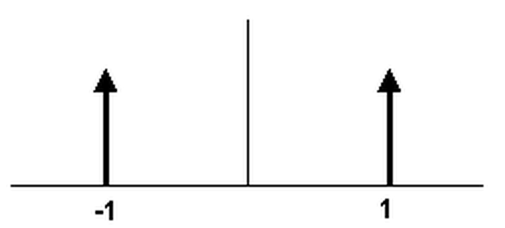
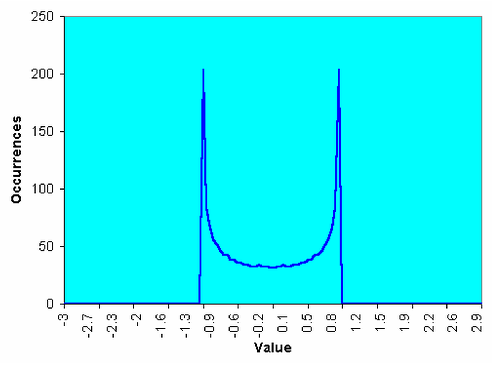
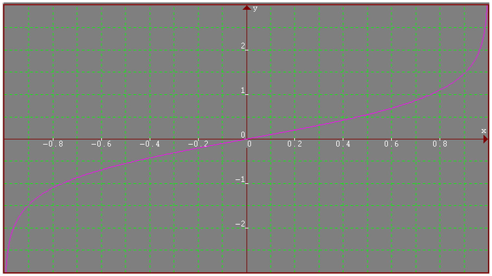
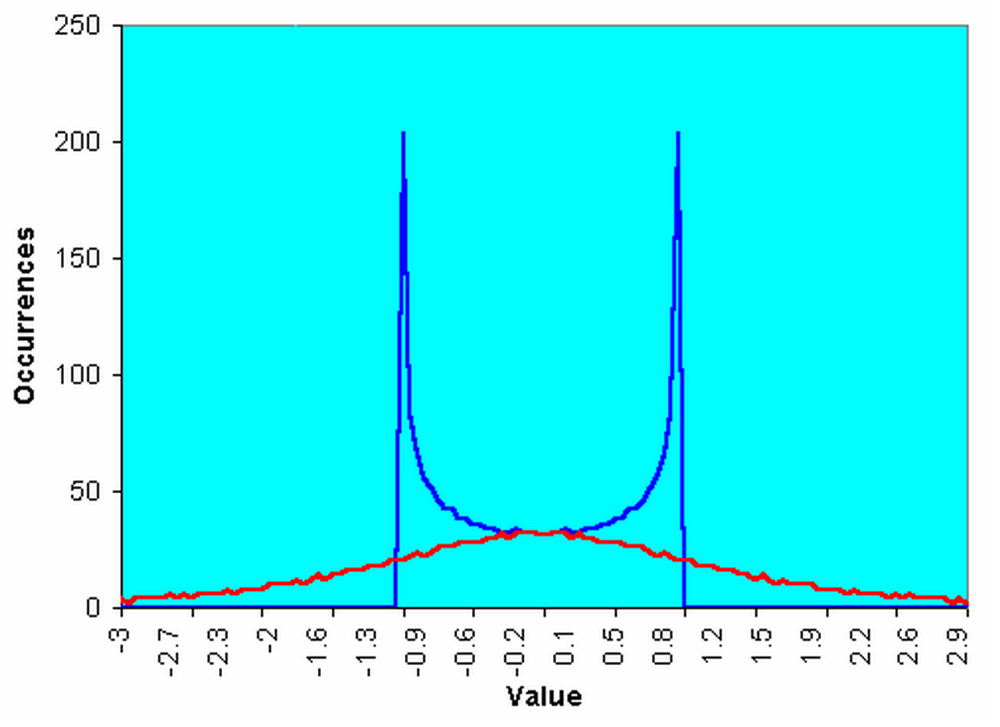
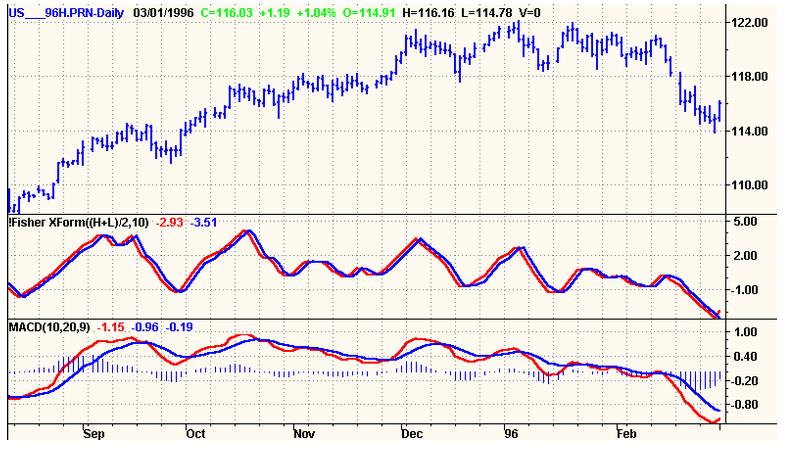
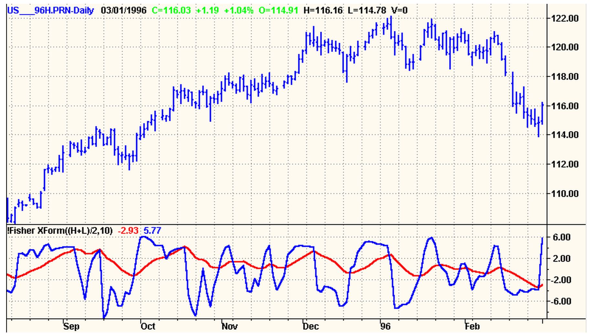

# Using the Fisher Transform

**By John Ehlers**

- **Downloaded from:** [Mesa Software — Using the Fisher Transform](https://www.mesasoftware.com/papers/UsingTheFisherTransform.pdf)

---

It is commonly assumed that prices have a Gaussian, or Normal, Probability Density Function (PDF). A Gaussian PDF is the familiar bell-shaped curve where 68% of all samples fall within one standard deviation about the mean. This is a really bad assumption, and is the reason many trading indicators fail to produce as expected.

Suppose prices behave as a square wave. If you tried to use the price crossing a moving average as a trading system you would be destined for failure because the price has already switched to the opposite value by the time the movement is detected. There are only two price values. Therefore, the probability distribution is 50% that the price will be at one value or the other. There are no other possibilities. The probability distribution of the square wave is shown in Figure 1. Clearly, this probability function is a long way from Gaussian.


**Figure 1. The Probability Distribution of a Square Wave Only has Two Values**

There is no great mystery about the meaning of a probability density or how it is computed. It is simply the likelihood the price will assume a given value. Think of it this way: Construct any waveform you choose by arranging beads strung on a series of parallel horizontal wires. After the waveform is created, turn the frame so the wires are vertical. All the beads will fall to the bottom, and the number of beads on each wire will stack up to demonstrate the probability of the value represented by each wire.

I used a slightly more sophisticated computer code, but nonetheless the same idea, to create the probability distribution of a sine wave in Figure 2. In this case, I used a total of 2000 "beads". This PDF may be surprising, but if you stop and think about it, you will realize that most of the sampled data points of a sine wave occur near the maximum and minimum extremes. The PDF of a simple sine wave cycle is not at all similar to a Gaussian PDF. In fact, cycle PDFs are more closely related to those of a square wave. The high probability of a cycle being near the extreme values is one of the reasons why cycles are difficult to trade. About the only way to successfully trade a cycle is to take advantage of the short term coherency and predict the cyclic turning point. This is the technique used in MESA2002[^1] and with the Hilbert Sinewave Indicator[^2].


**Figure 2. Sinewave Cycle Probability Density Function Does Not Resemble a Gaussian Probability Density Function**

The Fisher Transform changes the PDF of any waveform so that the transformed output has an approximately Gaussian PDF. The Fisher Transform equation is:

                ⎡ 1 + x ⎤
    y = .5 * ln ⎢-------⎥
                ⎣ 1 - x ⎦

Where:

- x is the input
- y is the output
- ln is the natural logarithm

The transfer function of the Fisher Transform is shown in Figure 3.


**Figure 3. The Nonlinear Transfer of the Fisher Transform Converts Inputs (x Axis) to Outputs (y Axis) having a nearly Gaussian Probability Distribution Function**

The input values are constrained to be within the range -1 < x < 1. When the input data is near the mean, the gain is approximately unity. By contrast, when the input approaches either limit within the range the output is greatly amplified. This amplification accentuates the largest deviations from the mean, providing the "tail" of the Gaussian PDF. Figure 4 shows the PDF of the Fisher Transformed output as the red line, compared to the input sinewave PDF. The transformed output Probability Density Function is nearly Gaussian, a radical change in the PDF.


**Figure 4. The Fisher Transformed Sinewave Has a Nearly Gaussian Probability Density Function Shape**

So what does this mean to trading? If the prices are normalized to fall within the range from -1 to +1 and subjected to the Fisher Transform, the extreme price movements are relatively rare events. This means the turning points can be clearly and unambiguously identified. The EasyLanguage code to do this is shown below.

### Code Listing. EasyLanguage Code to Normalize Price to a Ten Day Channel and Compute Its Fisher Transform

```easylanguage
Inputs:
    Price((H+L)/2),
    Len(10);

Vars:
    MaxH(0),
    MinL(0),
    Fish(0);

MaxH = Highest(Price, Len);
MinL = Lowest(Price, Len);

Value1 = .33*2*((Price - MinL)/(MaxH - MinL) - .5) + .67*Value1[1];

If Value1 > .99 then Value1 = .999;
If Value1 < -.99 then Value1 = -.999;

Fish = .5*Log((1 + Value1)/(1 - Value1)) + .5*Fish[1];

Plot1(Fish, "Fisher");
Plot2(Fish[1], "Trigger");
```

The Fisher Transform of the prices within a 10 day channel is plotted in the first subgraph below the price bars in Figure 5. Note that the turning points are not only sharp and distinct, but they occur in a timely fashion so that profitable trades can be entered. The Fisher Transform is also compared to a similarly scaled MACD indicator in subgraph 2 of Figure 5. The MACD is representative of conventional indicators whose turning points are rounded and indistinct in comparison to the Fisher Transform. As a result of the rounded turning points, the entry and exit signals are invariably late.


**Figure 5. The Fisher Transform of Normalized Prices Has Very Sharp Turning Points When Compared to Conventional Indicators such as the MACD**

The sharp turning points of the Fisher Transform mean that these are the positions where the rate of change is the largest. This suggests the use of a momentum function to identify the major turning points. Since a 10 bar channel is used, I multiplied the rate of change of the Fisher Transform by 10 and plotted this amplified rate of change over the Fisher Transform in the subgraph of Figure 6. The crossing of the amplified rate of change and the Fisher Transform clearly identifies each major price turning point.


**Figure 6. Crossing of the Fisher Transform of Normalized Prices and Ten Times its Rate of Change Clearly Identify Major Turning Points**

## Conclusions

Prices do not have a Gaussian PDF. By normalizing prices or creating a normalized indicator such as the RSI or Stochastic, and applying the Fisher Transform, a nearly Gaussian PDF can be created. Such a transformed output creates the peak swings as relatively rare events. The sharp turning points of these peak swings clearly and unambiguously identify price reversals in a timely manner. As a result, superior discretionary trading can be expected and higher performing mechanical trading systems can be developed by using the Fisher Transform.

[^1]: Software available from MESA Software
[^2]: John Ehlers, "Rocket Science for Traders", John Wiley & Sons, New York, chapter 9

---

## BibTeX

```bibtex
@misc{ehlers_fisher_transform,
  author       = {John F. Ehlers},
  title        = {Using the Fisher Transform},
  year         = {2002},
  howpublished = {online},
  url          = {https://www.mesasoftware.com/papers/UsingTheFisherTransform.pdf}
}
```
