# Decoding the Hidden Market Rhythm Part 2: Metonic Cycles by Lars von Thienen

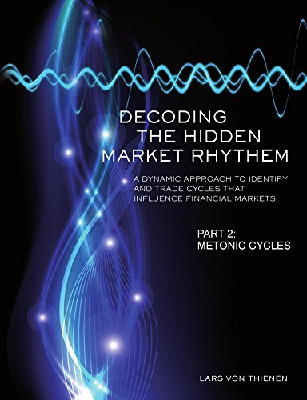

**A dynamic approach to identify and trade cycles that influence financial markets**

*Second Edition, Release 2017 –“Kindle”*
*All Rights Reserved. © Copyright 2010-2017 Lars von Thienen*

This book stands in contradiction to a quote from the world’s bestselling finance book.
> “The past history of stock prices cannot be used to predict the future in any meaningful way. Technical strategies are usually amusing but of no real value. A simple policy of buying and holding will be at least as good as any technical procedure.”

Professor Burton Malkiel
Proponent of the efficient market hypothesis
“A Random Walk Down Wall Street” 2011, 10th Edition, page 161

## Forward: Second Edition – Part 2: Metonic Cycles

This second edition of “Decoding The Hidden Market Rhythm” comes in three parts with extended content. Part 1 is about “Dynamic Cycles”, Part 2 about “Metonic Cycles” and Part 3 about “Genetic Algorithm & Cycles”.

The concepts presented can be replicated using the Standalone WTT Charting Module or the Wave59 Cycles Plug-In.

The original cycles tools were applied prior to the first release in 2010 and they remain the same in this second release. Additional examples have been added for explanatory and demonstration purposes. The additional content can also be reviewed in the video library (“Academy”) on the WhenToTrade Website.

After the initial release in 2010, the standalone WTT Charting Module was introduced in 2012 and it marked a significant milestone. It enabled the implementation of cycle analysis supplementary tools. A new genetic algorithm was implemented as a precursor to the next dimension of cyclic analysis. Researchers can now advance cycle research and push the boundaries.

New tools, such as the Genetic Algorithm, is already available within the WTT Charting Module for our community. The second part “Metonic Cycles” introduces a non-linear predictive cycles model.

Lars von Thienen, February 2014
[www.whentotrade.com](www.whentotrade.com)

## Contents

### Section I - Preface and Basic Assumptions

- 1. Natural Forces
   - 1.1 Mental warm-up session: W.D. Gann
   - 1.2 Basic assumptions Part A: Emotions drive markets
   - 1.3 Basic assumptions Part B: Natural forces drive emotions

### Section II – Cycles within Cycles

- 2. Decoding the Hidden Master Rhythm of the Universe
   - 2.1 Earth, Moon, and Sun alignment on 26 June 2010 – Observation date
   - 2.2 Earth, Moon, and Sun alignment – One tropical month before the observation date
   - 2.3 Earth, Moon, and Sun alignment – One synodic month before the observation date
   - 2.4 Earth, Moon, and Sun alignment – One lunar year before the observation date
   - 2.5 Earth, Moon, and Sun alignment – 19 years before the observation date
   - 2.6 The Master Rhythm – The Universal Harmonic Energy Lock
- 3. Building the superposition wave that drives financial markets
   - 3.1 Market decomposition and cyclic market cloning
   - 3.2 Example: How to build the superposition wave for the year 2008
   - 3.3 Building the superposition wave for 2008
- 4. Decoding future market turns eight years ahead of time
   - 4.1 Swing trading the superposition wave
- 5. Swing trading the Harmonic Energy Cycles – 1995 - 2010
   - 5.1 Automated trading system 5.2 Adding position sizing according to market risk
   - 5.3 Swing trading system with market risk-adjusted position size
   - 5.4 Hypothetical investment comparison
   - 5.5 Robustness test
   - 5.6 System analysis of the Harmonic Energy Cycles model – 1980 – 2010 / 30 years
   - 5.7 Performance Figures – Overall Summary Chart
   - 5.8 Summary
- 6. Cycles Model: “Out-of-Sample” Results and Special Findings
   - 6.1 Performance figures 2011-2014
   - 6.2 Deep Dive review and special findings for 2007 and 2012
- 7. Function to compile a list with all entry/exit signals
- 8. Years with a similar energy alignment

### Section III – Recurring Daily Sentiment Patterns

- 9. Dow Time Travel – “There is nothing new under the Sun”
   - 9.1 Introduction and Technical Analysis Concept
   - 9.2 Trading Hypothesis of Recurring Sentiment Patterns
   - 9.3 Technical Indicator and Trading System Construction
   - 9.4 Mechanical Trading System Performance Review & Equity Curve
   - 9.5 Annual Metonic System Profit vs. Annual Dow Index Profit
   - 9.6 Statistical Test & System Validation
   - 9.7 Review: 2013 out-of-sample results
   - 9.8 Summary and Conclusion
   - 9.9 Electronic Supplement - Download Link
   - 9.10 Addendum
- 10. EasyLanguage Code “Dow Time Travel”
   - 10.1 EasyLanguage Code for the Metonic Sentiment Index Indicator
   - 10.2 EasyLanguage Code for the Metonic Trading Strategy
   - 10.3 EasyLanguage Code for the ZLEMA Function
- 11. How-To Guide: Build a 8-year ahead looking signal list with Excel

### Section IV – The Beauty of Cyclic Time

- 12. Non-Linear Predictive Indicators
   - 12.1 Linear time vs. cyclical time
   - 12.2 Combination of linear and cyclic time to build predictive indicators
   - 12.3 Pseude code on how to transform indicators from linear to cyclic time
   - 12.4 How to read predictive non-linear indicator forecast plots
   - 12.5 Build trading systems with cyclic-time based indicators
- Summary and closing notes

### Section V – Special: Geomagnetic disturbances and the Stock Market

- 13. Decoding and Trading Geomagnetic Ap/Cp Index Data Addendum
- 14. Cycles Toolbox and Charting Platform
- 15. Harmonic Energy Cycles - Detailed annual trade reviews 1995- 2010
- 16. Manual calculation sheet for the superposition wave 2008
- 17. Bibliography

## Section I - Preface and Basic Assumptions

### 1. Natural Forces

Once you have read Part 1 “Dynamic Cycles” of the book series, you will come to understand that I have spent thousands of hours working with cycle analysis on financial markets.

I have tried different approaches. One well-known forecasting approach is to work with composite cycle models and to try calculating the composite model into the future. I have done a lot of my own studies on composite cycle models. They work just like the Cycle Scanner engine introduced in the second chapter. Take all dominant cycles with their phase offset, length, and amplitude. Add them up to a composite wave and plot it into the future. This is what most of the software tools out there are doing, based on their own cycle detection algorithms.

In the end, I have come to the conclusion that you occasionally have an amazingly highly accurate outcome – and occasionally, the output of the composite model is simply garbage. But you only always know what the outcomes are after the fact. That is interesting when you are in “research mode”. But you are losing money when you are in “trading mode”. As a result, I don’t want to introduce yet another composite cycle forecasting model or static cycle framework. I am certainly researching many of these concepts. Don’t get me wrong, I have profound respect for the research and work that has been done on static cycle frameworks and composite forecasting tools.

The question that continued to be on my mind was: “How do I unlock the power of composite cycles?” The mathematical routines to simply build composite waves from dominant cycles cannot be the final answer. And the subjective interpretation of static cycle frameworks left me unsatisfied. And one day, I suddenly had a basic idea I could use as a starting point and which I began to unearth, step-by-step. The outcome still thrills me today.

For this book, I will use a deductive method to narrow down my general assumptions into precise cycle calculation formulas. In the next chapters, I will introduce logical steps from general natural principles down to specific solutions on using cycles in financial markets.

I will begin with prevailing and self-evident facts on the universe. Perhaps even these facts will be of interest for you, because I do not know of many people in financial astronomy that keep track of these simple natural laws. This is the starting point of the assumption that everyone is "on the same track" (outline: Earth/Moon/Sun/Universe Alignment Cycle).

After introducing these facts, I will define several very simple statements and postulate a recurring pattern of gravitational and geomagnetic forces (abstract: These forces have a profound impact on the emotions of all living organisms on Earth).

In the following steps, I will transfer these statements to financial markets. The different statements are combined and the mathematics of cycles applied (outline: Dominant cycle analysis is applied to financial markets).

In the final step, things will get interesting and eerie when we apply this deductive framework to financial markets to prove the hypotheses. Yes, I really do mean eerie, because even I did not expect such an amazing outcome (outline: Calculation of the Superposition Wave eight years ahead of time).

Although this is very scientific and complex physics, I felt like a detective working on a fascinating mystery. Now, let me take you along down this road.

#### 1.1 Mental warm-up session: W.D. Gann

The name W.D. Gann is well-known to most traders. Gann was one of the greatest traders in the early twentieth century. His methods, which are based on mathematics, geometry, and astrology, have never been unequivocally unveiled. He provided numerous hints about his secrets in his books. However, upon close study of his work, the real secret has still not been resolved.

To clarify: I am not a student and follower of Gann and his trading methods. I have not participated in one of the many seminars out there on the net. You have to be careful when using his name – most people use his name for promotional use only. That’s the reason I will not use his name for marketing purposes of my own work. Yet his writings are fascinating. His novel “Tunnel Thru The Air” is, of course, a must-read. His style of writing is “brain opening”.

Therefore, to warm up for the next chapter, please read the following abridged text. And please re-read it after you have finished this chapter. I will also repeat and use excerpts of Gann’s writings on the next few pages of the step-by-step guide to my general approach.

I do not claim that I have “uncovered” some of Gann’s secrets. But when you have finished this chapter, you will understand that the following model corresponds with W.D. Gann’s statements.

> W.D. GANN
>
> “My calculations are based on the cycle theory and on mathematical sequences. History repeats itself. In order to know and predict the future of anything you only have to look up what has happened in the past and get a correct base or starting point.
>
> Everything works according to past cycles, and that history repeats itself in the lives of men, nations and the stock market. Remember, everything in this universe is elliptical or circular in motion; that applies both to the abstract and the concrete, the mental, physical and spiritual. Every thought you think makes a circle, and it comes back to you. It may take years but you will get the effects, good or evil.
>
> In making my calculations on the stock market, or any future event, I get the past history and find out what cycle we are in and then predict the curve for the future, which is a repetition of past market movements.
>
> The limit of future predictions based on exact mathematical law is only restricted by lack of knowledge of correct data on past history to work from. It is just as easy to figure 100 years or 1000 years in the future as one or two years ahead, if you have the correct starting point and know the cycle which is going to be repeated.
>
> Mathematical science, which is the only real science that the entire civilized world has agreed upon, furnishes unmistakable proof of history repeating itself and shows that the cycle theory, or harmonic analysis, is the only thing that we can rely upon to ascertain the future.”
>
>TUNNEL THRU THE AIR, Page 76 - 77

#### 1.2 Basic assumptions Part A: Emotions drive markets

Let’s start with some basic assumptions and common facts. The following statements focus on the causes of cycles and how they affect market behavior. It is all based on two complex yet self-evident chains of events:

*Chain of events:*

1. Financial markets are driven by emotions.
2. Emotions swing from positive to negative over time in the form of interfering cycles.
3. Markets swing from high to low in response to these emotions.

Part A only provides a general outline of how markets work. It is all about expectations and the possible future realization of demand and supply. The way we currently think about expectations and the developments of future supply/demand is what drives today’s markets. But are our decisions on financial actions based only on facts?

Let us review a framework developed by three professors working at business schools on how emotions influence financial markets (Ackert, Church and Deavesa in 2003):

> “Is a ‘rational’ investor a cool, unemotional user of logic and the laws of probability? Two characters from the popular television and movie series Star Trek provide an answer.
>
> Mr. Spock - who is half Vulcan, a species that suppresses emotion and prizes logic - is presented as a rational thinker who thoroughly considers every piece of information.
>
> In contrast, Captain Kirk is likely to respond emotionally. Yet Kirk is portrayed as a good decision maker.
>
> Though Spock fully analyzes each situation, he gets too caught up in the details. Emotion allows Kirk to focus and enhances his ability to make critical decisions.”

In which category can we place ourselves, are we Mr. Spock or Captain Kirk? It’s simple – we are all Captain Kirk-like characters. If markets were not affected by emotions, we would all have to behave like “Mr. Spock”. But we do not behave that way – Mr. Spock remains science fiction.

In other words, our current emotional state will influence financial decision- making. Today, numerous neurobiological studies confirm that emotion influences decision-making in two ways:

1. **Emotion allows focusing without getting caught up in details**
   Emotion pushes individuals to make a decision when making a decision is of high importance. However, because so many alternatives exist, an individual may frequently waste a substantial amount of time on the decision-making process. A trader may simply become overwhelmed by the many possibilities when studying too many technical indicator studies for different time frames. Emotions provide us with positive coping strategies when stress comes into play.
2. **Emotion can assist in making optimal decisions**
   A sizeable literature on psychology ascertains that our emotional state can significantly affect decision-making. While strong emotional responses are often associated with poor decisions in managing finances, recent research in psychology indicates that the absence of emotions can also lead to suboptimal decision making. Emotion helps to optimize beyond the cost of optimization. Even mild emotional states can affect behavior. Positive feelings can make it easier to access information in the brain, promote creativity, improve problem solving, enhance negotiation skills, and foster efficient and thorough decision-making. Emotion facilitates optimal-choice behavior when a person is provided with several courses of action (Ackert, Church & Deaves, 2003).

The direct impact of emotions on financial markets is an ongoing controversial debate. However, a large body of literature exists which determines that emotion is an important aspect of the human condition that can enhance decision making. As the economist David Laibson from Harvard once stated: “Our emotional brain wants to max out the credit card and smoke a cigarette. Our logical brain knows we should save for retirement and quit smoking.” Hard times for decision making. Ultimately, however, we know that psychological factors other than pure reasoning drive people’s decisions.

Following this emotional path, let’s think about what forces have the most important impact on the emotions of all individual beings. This leads to the second chain of events: Natural forces play an important role in this regard.

#### 1.3 Basic assumptions Part B: Natural forces drive emotions

Part B focuses on the hidden forces that drive our emotions.

Life on Earth owes its existence to Earth’s magnetic field and the Sun’s energy cycles. Many effects of the Sun seem trivial, such as, for instance, that changes in the conditions in different regions on Earth depend on the season, which, in turn, is determined by the position of the Earth and the Sun in space.

The Earth’s magnetic field is more complex and provides a protective shield against cosmic rays. However, the interactions between the Sun and the magnetic field can also do great damage, such as in March 1989, when geomagnetically-induced currents caused the collapse of the electrical power distribution system in Québec.

The notion that variations in the Sun and Earth’s magnetic field can affect the emotions of human beings has global implications.

There is growing evidence that the interactions between the Sun, Moon, and Earth are a factor that affects our well-being. Changes in the geomagnetic field affect biological systems, such as the navigational abilities of pigeons. New studies indicate that physically stressed human biological systems may also respond to fluctuations in the geomagnetic field (NOAA Space Weather Prediction Center, 2010).

For example, NASA scientists have determined that something happens every month when the Moon gets a lashing from Earth’s magnetic tail. This can have consequences ranging from lunar dust storms to electrostatic discharges. Our entire planet is enveloped in a bubble of magnetism. Out in space, the solar wind presses against this bubble and stretches it, thereby creating a long magnetotail. The Moon enters the magnetotail three days before it is full and takes about six days to cross and exit on the other side. It is during those six days that strange things may occur. Fine particles on the Moon’s surface can actually float off the ground when they become charged in the magnetotail (Phillips, 2008).

Here is a picture of this effect (taken by the SOHO joint mission NASA/ESA):

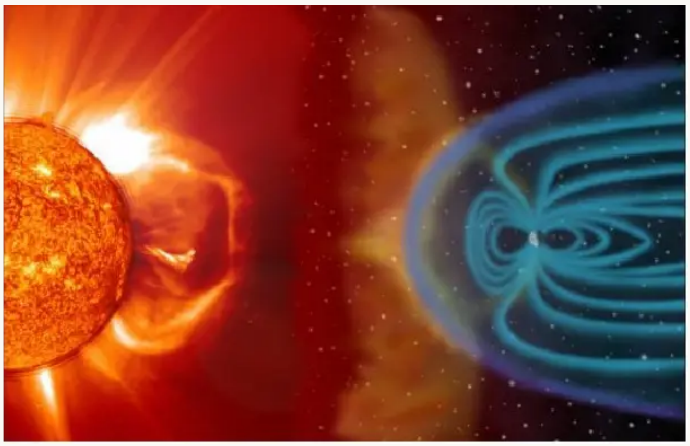

**Figure 1‑1: Earth's magnetotail influenced by the Sun and Moon cycles**

This influence on the magnetotail may explain why lunar cycles are monitored in markets with the fading in and out characteristics. This implies that the Moon does not only have an influence on gravitation. It also has an influence on the geomagnetic forces on Earth in combination with the Sun’s solar cycles.

Today, a large number of studies indicate that human beings respond to variations of these geomagnetic forces. For example, numerous scientific studies have identified statistical correlations between geomagnetic indices and the occurrence of various medical conditions. Mike Jackson, a senior scientist from the University of Minnesota, has presented several examples of the links between geomagnetism and human activity (Jackson, 2003).

Empirical data indicates that a correlation exists between solar activity and the physiological state of individuals. This, for instance, includes changes in the frequency of traffic accidents (Kolesnik, 2005) and a positive association between geomagnetic activity and mental illness (Palmer, 2006). Furthermore, a study from the Federal Reserve Bank of Atlanta found strong empirical evidence that people affected by high geomagnetic activity may be more inclined to sell stocks because they incorrectly attribute their bad mood to negative economic prospects rather than to the given environmental conditions. (Krivelyova, 2003)

Today we have found a scientifically verified link between geomagnetic forces and human emotions. And we know that the geomagnetic forces are influenced by the cyclic motion and interactions of the Sun, Moon, and Earth.

The following figure presents a simplified schematic.

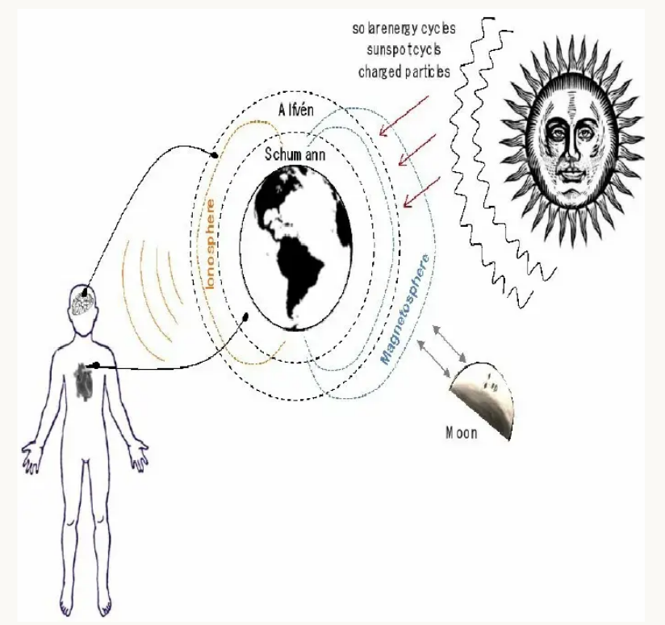

**Figure 1‑2: Mechanism of Sun-Moon-Earth relations and the influence on the human organism (Kolesnik, 2005)**

The cyclic processes that occur on the Sun and the gravitational impact of the Moon’s movement around the Earth are accompanied by substantial changes in the factors that affect the Earth’s atmosphere. These forces affect the Earth’s ionosphere through an extensive range of fairly complicated physical and chemical processes. This means that fundamental characteristics of the natural near-Earth space undergo changes. As a result, the quality factors of these resonators and the frequencies of their fundamental modes change (Alfvén and Schumann resonators). Since the human organism has for millions of years been subjected to continual activity of the electromagnetic fields generated by the global near-Earth resonators, it is logical to assume that the human organism has fully adapted to these fields. As a result, changes in the characteristics of these electromagnetic fields must affect the state of separate systems of the human organism.

Research studies have convincingly demonstrated that variations in the biorhythmic activity of the human brain correlate with changes in the magnetic fields. This correlation is controlled by the levels of solar and geomagnetic activities and grows with increasing solar activity, which confirms the qualitative mechanism of the Sun-Moon-Earth relations illustrated above.

Research has documented links to depression, enhanced anxiety, sleep disturbances, altered moods mainly affecting abstract judgment especially udgment of risk, overly cautious behavior, and greater incidences of psychiatric admissions.

These geomagnetic variations appear to affect human behavior, judgments and decisions about risk: [1]

- 36.2% increase in male hospital admissions diagnosed with the depressed phase of manic depressive illness correlated with active geomagnetic days compared to quiet periods
- Pilots experienced high levels of anxiety and decreased functional activity of the central nervous system resulting in a sharp decline of flying skills during active geomagnetic days
- Doubled daily number of hospitalizations of patients with mental disorders during active geomagnetic days
- 70% of the accidents caused by human factors in the biggest atomic station of the former USSR at Kurskaya corresponded to days of geomagnetic storms
- 70% increase of daily death rates due to heart attacks for active geomagnetic days compared to quiet/unsettled geomagnetic days
- An increase of 130% for daily death rates due to strokes covering severe patients who either died on the way to the hospital or in the admission for active geomagnetic days compared to quiet/unsettled geomagnetic days

The scientific debate about the possibility that conditions on the Sun and in the Earth’s magnetosphere affect human behavior is in an early stage and is still ongoing.

There are, of course, additional complex external forces which have an impact on life on Earth. Alone the fact that these forces exist suffices. Alone the fact that the Universe’s external forces are circular in motion makes this theory interesting. Interesting because we can use the available history of financial market data to decode these cyclic forces.

**The basic assumptions based on the two chains of events presented are:**

- Financial markets are driven by emotions.
- Emotions and the human organism are influenced by the forces of the interaction of the Sun, Moon, and Earth.
- Due to the internal cyclic movements of the Sun, Moon, and Earth within the Universe, various energy filter phases have to repeat over time. This is “the hidden rhythm”.
- As a result of the repetitive external forces and energy filter phases of the Universe that drive emotions, the movement of financial markets has to also be a repetition of cycles that have been active in the past.
- If we know “the hidden rhythm”, which originates from external forces, we are able to measure which cycles have been active during the different phases of this rhythm by means of the dominant cycle analysis.
- We can use this information to predict the cycles that will be active again in the future when the Universe returns to the same energy and energy filter phase of the Sun, Moon, and Earth system.

As this publication focuses on trading, I would like to examine a way to identify the cyclic forces of the Sun-Moon-Earth system which influence the mood of traders and, hence, manifest themselves in the value of the stock market.

In the following chapters, we will analyze these general assumptions in more detail and explore their impact on financial markets, as well as the importance of cycles.

## Section II – Cycles within Cycles

### 2. Decoding the Hidden Master Rhythm of the Universe

The most significant cycles that affect life on Earth are either geomagnetic or gravitational and emerge as the result of interactions between the Sun, Moon, and Earth.

The outcomes of these cycles are visible every day: The recurring 24-hour rhythm of day and night, the four seasons and the tidal ebb and flow on the coast. Knowing when the sun will rise and set may not seem like a prediction per se, because we generally associate prediction with uncertainty and risk, but it is in fact a prediction of future events that is highly accurate.

> The Bible
> “What has been will be again, what has been done will be done again; there is nothing new under the sun.” 
> Ecclesiastes 1:9

All these events belong to the cyclical movement of the Sun and Moon and they influence the emotions of all beings that live on Earth.

As emotions play an important role in investment decisions, it’s worth taking a closer look at them.

There is a lot of literature out there about the influence of the Sun and Moon on financial markets. It would take a separate book to summarize all of the different approaches. I will, however, briefly summarize the main approaches here:

One approach focuses on gravitational or tidal forces and correlates these forces with financial markets. An important study on this approach is Robert Taylor’s book “Paradigm”.

Another approach focuses on researching lunar/solar calendars and the corresponding analysis of correlations with the stock market. I recommend all publications by Christopher Carolan on this approach, in particular “Spiral Calendar” and his Solunar Forecasting Model.

The planetary movements through the zodiac and their relation have to be mentioned here as well. Raymond Merriman’s comprehensive research on solar-lunar correlations for important market turns has been published in his book series “The Ultimate Book on Stock Market Timing” (Volumes I – IV).

However, it’s not only about the position and movements of the Sun, Moon, and Earth. The movement of these planets takes place on the stage of the Universe. That is, a lot of known and unknown interactions are also taking place with the Universe.

The German physicist Burkhard Heim developed the “unified field theory” as the common basis for all forces of the Universe. Heim calculated that the Universe consists of 12 dimensions, a conclusion that corresponds with the main esoteric findings. His unified field theory is used today to calculate the constants in physics, because they are more precise than conventional theories.

We will not use the complex mathematics underlying the “unified field theory” here. But we have to accept the fact that there are more forces (“dimensions”) out there in the Universe that influence our life on Earth and not only those “forces” of the visible planets, especially the Moon and the Sun. If we accept the fact that additional forces exist, which are much more complex, we have to take them into account – even if we are not able to calculate them in detail.

Puetz is the most recent scholar who has developed an approach to place all these external forces into a static cycle framework. His book “The Unified Cycle Theory” is also a must-read for all ‘cycle fans’.

But instead of developing and researching another “static cycle framework” with a given cycle length, I want to use a more dynamic approach. I am not interested in “fixed” cycles. I don’t want to follow the researchers’ path and try to make the market “fit” into just another cycle framework with 2-4 possible alternative outcomes.

I am interested in a dynamic approach to detect and apply cycles. There is no fixed cycle framework that can be adapted to the market.

> W.D. GANN
> “Remember, everything in this universe is elliptical or circular in motion; that applies both to the abstract and the concrete, the mental, physical and spiritual. Every thought you think makes a circle, and it comes back to you. It may take years but you will get the effects, good or evil.”
> TUNNEL THRU THE AIR - Page 76

As previously mentioned, the powers of the Sun and Moon have the most important impact on life on Earth. The cyclical movements of these planets influence gravity and geomagnetic forces. Hence, they influence our emotions. Markets are driven by social emotions.

You will find a great deal of scientific evidence in that statement.

Everything in our Universe is based on cyclic movement. As a result, the gravitational and geomagnetic phases will also repeat themselves. Hence, our emotions follow a recurring pattern as well.

However, we have to take into account that the cyclical movements of the Sun, Moon, and Earth also interact with the “field of the Universe”. This factor is very important when it comes to analyzing cycles. A cycle’s phase, amplitude, and length shift continuously. The external and complex field of the Universe is the reason for the floating character of cycles. But instead of throwing more complex mathematics onto the table, I want to introduce a simplified approach.

We do not only have to review the powers of the Sun, Moon, and Earth - we also have to review the Sun, Moon, and Earth in terms of their actual alignment in the sky/Universe.

> **The same alignment in the Universe of the Moon, Earth, and Sun gives us a good indication of how the forces for all known and unknown energy cycles interact and interfere. Thus, the same cyclic superposition wave will drive our emotions on Earth.**

So let’s start with this simple question:

If you see the Full Moon in Sagittarius tonight, ask yourself when this constellation with the exact same arrangement of the three planets involved (Moon, Earth, and Sun) occurred last.

This is an important question, because if we know when in the past the position of these three planets within the stars of the Universe was the same, we can hypothesize that the same energy filters for gravitation and geomagnetic fields are active again. Thus, the same cyclic behavior that influences our emotions will be visible.

With reference to financial markets, there is no need to precisely calculate these forces using complex physics. We can instead measure how these forces have performed in the past. Here, our cycle analysis engine comes into play. All we have to do is determine the dominant cycles for the period in which the same constellation occurred in the sky! Simple, isn’t it?

However, before we are able to use this “simple” approach, we have to answer the above question: When was the last time you saw the Moon’s given phase and the same position of the stars?

We will use the following observation date for this example: June 26, 2010. Take a breath and try to answer this question before you read on. Simple, isn’t it? Close the book, think, write down the date or number of days you have to go back…

#### 2.1 Earth, Moon, and Sun alignment on 26 June 2010 – Observation date

This was the constellation in the sky observed on June 26, 2010 from New York. The picture below illustrates what the stars would have looked like had you looked at the sky on June 26, 2010.

1. The position of the Moon is highlighted with the corresponding phase (yellow dot).
2. The position of the Earth’s shadow is also highlighted (grey dot).
3. The star signs are marked. We can see the position of the Moon against the background of the stars (red name).

These three factors are required to obtain a picture of the positions of the Earth, Moon, and Sun relative to the stars.

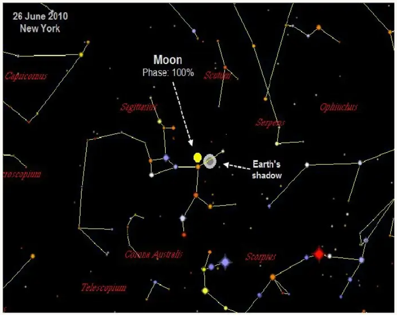

**Figure 2‑1: Earth, Moon, and Sun alignment on 26 June 2010**

We can observe that we have a Full Moon (phase 100%). The Moon is in Sagittarius. The relative position of the Sun is indicated by the shadow of the Earth on the line of Sagittarius.

This is the observation date. Now back to the question: When was the last time we had this same planetary alignment?

#### 2.2 Earth, Moon, and Sun alignment – One tropical month before the observation date

The first answer would perhaps be that the Moon travels around the Earth in around 27.3 days (tropical month). Therefore, the Moon must have been in the same position 27.3 days earlier.

That is, 27.3 days prior to June 26 was May 30.

This was the constellation in the sky as observed on May 30, 2010 from New York:

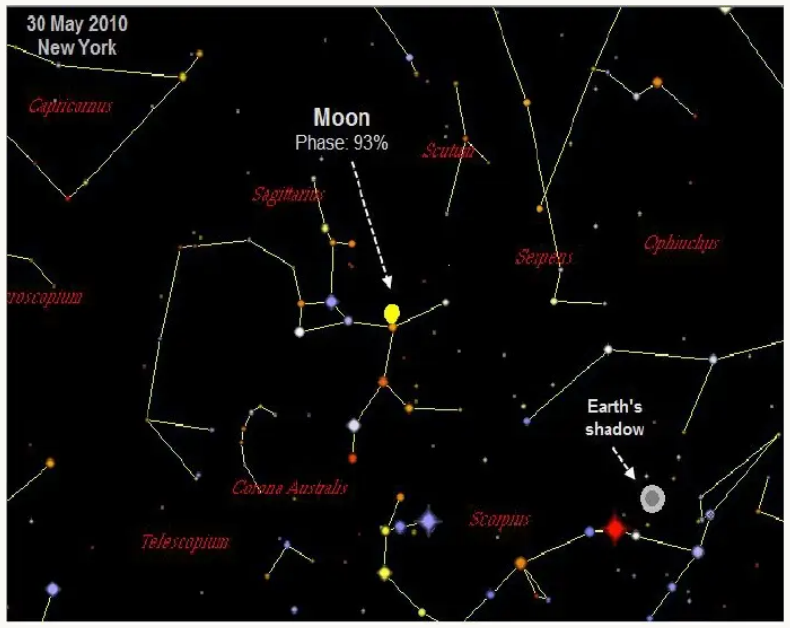

**Figure 2‑2: Earth, Moon, and Sun alignment on 30 May 2010**

We were right about our idea: The Moon has exactly the same position in Sagittarius.

Yet something is different: We had no Full Moon, i.e., the Moon was in a different phase (93%). This is also evident by the location of the shadow of the Earth.

The Moon is thus in the same position against the background of the stars. But the corresponding position of the Sun and Earth are not the same, and we consequently observe a different phase of the Moon and a different location for the shadow of the Earth. This is attributable to the fact that the Earth is also rotating.

To conclude, the idea to use the tropical month was not the correct answer.

#### 2.3 Earth, Moon, and Sun alignment – One synodic month before the observation date

We also know that the Moon returns to the same phase every 29.5 days. This is also known as the synodic month. The Moon, therefore, must have been in the same phase (and hence the position of the Earth in relation to the Sun) 29.5 days earlier. Let’s see what the alignment in the sky looked like at this time.

So, 29.5 days prior to June 26 was May 27.

This was the constellation in the sky as observed on May 27, 2010 from New York:

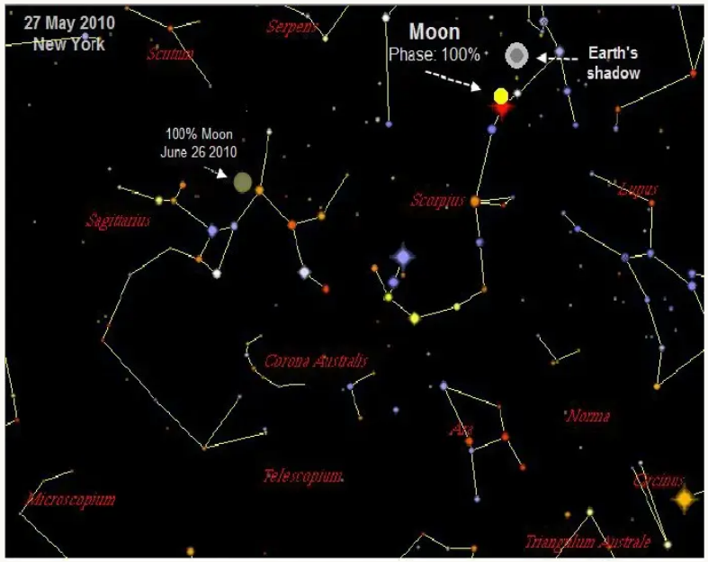

**Figure 2‑3: Earth, Moon, and Sun alignment on 27 May 2010**

We were correct once again. We now have a Full Moon again!

However, something is different: The Moon is in a different location in the Universe and has moved out of Sagittarius completely! The position of the Moon on June 26 is also marked in the picture for comparison.

It’s a bit more complex:

- After 27.3 days (one tropical month), the Moon takes the same position in the sky, however, the position of the Sun relative to the Earth differs. This is evident in the difference in the Moon’s phase and in the location of the Earth’s shadow.
- After 29.5 days (one synodic month), we reach the same phase (the position of the Sun relative to the Earth), but the position of the Moon differs.

What do we do now?

#### 2.4 Earth, Moon, and Sun alignment – One lunar year before the observation date

The period of time known as the lunar year refers to the 12 returns of the Moon to the same phase. During this period, the Moon had exactly 13 returns to the same position. So we have a common full count here: 13 returns to the same position and 12 returns to the same shape, i.e., one lunar year. Sounds interesting for resolving our question.

The lunar year consists of 354.3 days. Let’s try something else now.

This was the constellation in the sky one lunar year earlier as observed on July 7, 2009 from New York:

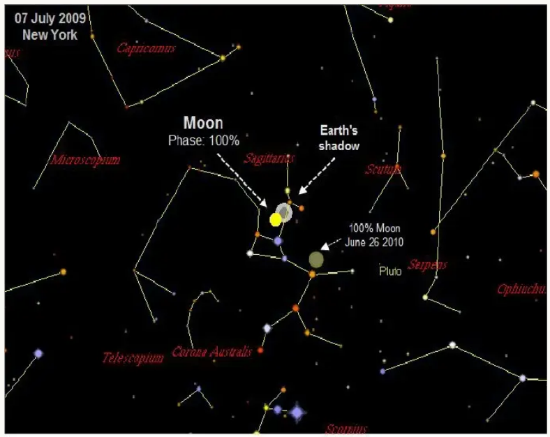

**Figure 2‑4: Earth, Moon, and Sun alignment on 7 July 2009**

We are making some progress, but it is still not perfect:

The phase of the Moon is the same (Full Moon) and the position of the shadow of the Earth relative to the Moon is the same. We thus have a similar alignment between the Sun, Moon, and Earth. But the position of this alignment in the Universe against the background of the stars is not the same! This is visible by the marked position of the Full Moon on June 26 in the picture above.

That is, we do not have the same alignment we would need to attain the same active “energy” filters that influence the gravitational and geomagnetic forces of the Sun and Moon, which, in turn, influence the Earth. 

We are on the right track now, but how do we get the same position?

#### 2.5 Earth, Moon, and Sun alignment – 19 years before the observation date

We have to determine the approximate common multiple of synodic lunar months, tropical lunar months, and of tropical solar years ending at the same time.

Thus, 235 synodic months and 254 tropical lunar months end at the same time as 19 solar tropical years (= 6939 days) do. Let’s check this calculation in the sky: 19 years.

This was the constellation in the sky 19 years before the observation date of June 26, 2010 as observed on June 26, 1991 from New York:

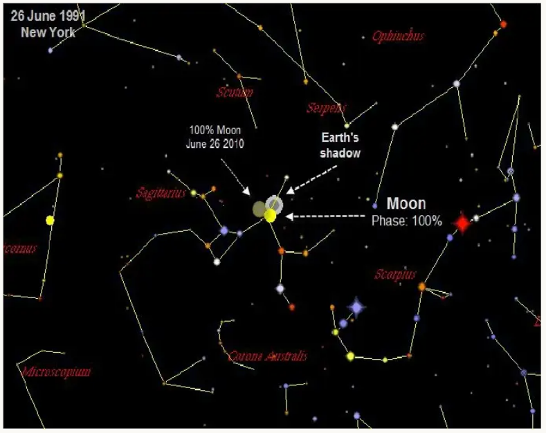

**Figure 2‑5: Earth, Moon, and Sun alignment on 26 June 1991**

Now we’ve hit the nail on the head.

We have the same position, same phase. This is the Metonic cycle, and it brings the Moon and its phase (the position of the Sun in relation to the Earth) back to where we first observed it in Sagittarius those long 19 years ago.

This is what we need to attain the same “energy state / energy grid” that also drives markets here on Earth – the same alignment in the Universe for the Moon, Sun, and Earth.

This is the direct comparison between the observation date (left chart) and the constellation 19 years earlier (right chart):

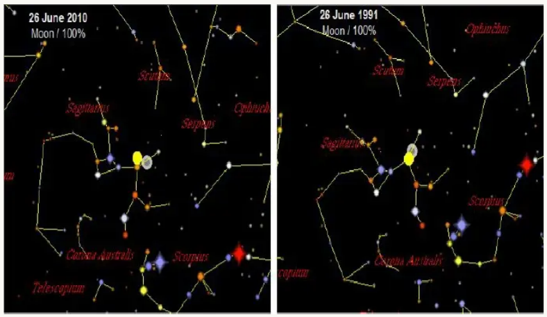

**Figure 2‑6: Earth, Moon, and Sun – Harmonic Energy Lock – Repetition every 19 years**

For visualization purposes, here is the 3D view of what we are talking about (not exactly the same time/day, but it illustrates the idea in a 3D perspective). All elements are in different cyclical motions.

Figure 2‑7: 3D view - Alignment of the Sun, Moon, Earth, and Stars

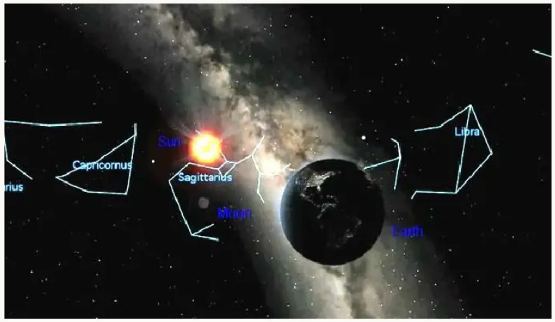

When energies are released in outer space, they create measurable impacts on Earth. But before this energy can reach us and create any impacts, it has to pass through the filter grid generated by the alignment of the Sun, Moon, and Earth. This is an important state at which energy can be measured and compared for different periods here on Earth – it is the important 19-year rhythm of this filter.

#### 2.6 The Master Rhythm – The Universal Harmonic Energy Lock

Now we have found the recurring energy pattern that influences gravitational and geomagnetic forces, which drive our emotions on Earth: 19 years – the Hidden Rhythm.

> W.D. GANN
> “History repeats itself. In order to know and predict the future of anything you only have to look up what has happened in the past and get a correct base or starting point.”
> TUNNEL THRU THE AIR Page 76

We can also call it the “Universal Harmonic Energy Lock”: The dominant energy grid of the Universe that is important for life on Earth vibrates for 19 solar years. Every 19 years, a new base or starting point emerges based on which the “energy flow” from the Universe interferes with the Earth, the Sun, and the Moon.

This hidden rhythm is not perceptible by studying the movements of the planets through the signs of the zodiac only. However, what we have observed here is old knowledge. Very old knowledge.

This 19-year cycle was first used by the Babylonians a long time ago to calculate events. For example, this cycle can be used to predict eclipses. To this day, this cycle remains important: One significant use is for trajectory calculations and the launch of window analysis for lunar spacecraft missions. It represents the basis for the Hebrew calendar's 19-year cycle and is used to calculate the date of Christian Easter.

It's quite impressive. If you see the Moon tonight, watch its position and phase closely, because you won't see it returning to that exact position and phase for another 19 years.

This cycle is called the Metonic cycle. We have seen how this can be uncovered visually, without the need for complex mathematics and astronomical instruments. We do not need to know the actual day count because we can record the cycle with period counts - synodic months, tropical months, and solar years.

The “first calendar computer” (Antikythera Mechanism, dated 80 B.C.) was based on the Metonic cycle. This cycle played an important role in different periods. Please read: “Decoding an Ancient Computer”, “New explorations have revealed how the antikythera mechanism modeled lunar motion and predicted eclipses, among other sophisticated tricks” (Scientific American Journal, December 2009, pp. 76-83).

Now let’s review the mathematical numbers behind this cycle. The Metonic cycle is a particular approximate common multiple of the solar year and the synodic (lunar) month. The Greek astronomer Meton of Athens observed that a period of 19 solar years is almost exactly equal to 235 synodic and 254 tropical months. The difference between the two periods is only 2 hours.

Here are the calculations for the Universal Harmonic Energy Lock of the three planets with the Universe: The 

**19-year Metonic cycle**

| Cycle Type | Day Count | Multiple | Universal Harmonic Energy Lock |
| --- | --- | --- | --- |
| Solar Tropical Year | 365.24 days | 19 | = 6939.56 days |
| Lunar Tropical Month | 27.322 days | 254 | = 6939.78 days |
| Lunar Synodic Month | 29.5306 days | 235 | = 6939.69 days |

19-year cycle error: Approx. 1 day in 219 years

There are also two less accurate subcycles with an accuracy of 1.5 days: The 11 and 8-year harmonic energy cycles.

**The 11-year subcycle:**

| Cycle Type | Day Count | Multiple | Universal Harmonic Energy Lock |
| --- | --- | --- | --- |
| Solar Tropical Year | 365.24 days | 11 | = 4017.64 days |
| Lunar Tropical Month | 27.322 days | 147 | = 4016.33 days |
| Lunar Synodic Month | 29.5306 days | 136 | = 4016.16 days |

11-year subcycle error: Approx. 1 day in 7 years

**The 8-year subcycle**

| Cycle Type | Day Count | Multiple | Universal Harmonic Energy Lock |
| --- | --- | --- | --- |
| Solar Tropical Year | 365.24219 days | 8 | = 2921.92 days |
| Lunar Tropical Month | 27.322 days | 107 | = 2923.45 days |
| Lunar Synodic Month | 29.5306 days | 99 | = 2923.52 days |

8-year subcycle error: Approx. 1 day in 5 years

You can also try and look up the 11-year and 8-year subcycles with the visual inspection method previously introduced. You will see that the location of the Moon and its phase will be very close to that of the observation date – but not as close as the 19-year cycle. You can also try it using a computer program like SkyMap.

Here is our final result:

> Every 19, 11 and 8 years our Universe has the same “Universal Harmonic Energy Lock” between the Moon, the Earth, the Sun, and the Stars.

That’s the hidden rhythm that influences the gravitational and geomagnetic forces that drive emotions on Earth. Now we know when the same energy filters from the Universe were active in the past and will again be active in the future.

If you are familiar with static cycle frameworks, it probably didn’t escape your notice that the Universe’s harmonic energy cycles are similar to other famous cycle discoveries. Just to name a few:

The Juglar Cycle with a length of 7-11 years vibrates with the 8 and 11-year Metonic subcycles. This known economic “business” cycle, which is typical for modern industrial economies, is named after the French economist Juglar who was one of the first to discover and describe this cycle.

Another economic cycle type is named after Nobel laureate Simon Kuznets who first discovered them in 1930. The Kuznets swings or “infrastructure investment cycles” (15-25 years) vibrate with the 19-year Metonic cycle. Kuznets connected these cycles with demographic processes. The important 19-year economic cycle was also researched and confirmed by Edward Dewey. He wrote extensively on this market cycle. And there are a lot of cycle publications out there, which claim to have identified a 19-year panic cycle in the stock market. For example, Steve Puetz presented charts in which the 19-year panic cycle appeared in commodity prices from ancient Babylonia (Puetz, 2009, p. 360ff). It is also interesting that the 19-year cycle fits nicely into a third harmonic of the Kondratiev wave (57 years).

Another important cycle that falls into a different category is the “Schwabe Sunspot Cycle” with a length of 11 years. This is one of the most important cycles impacting the geomagnetic field of the Earth. This cycle also correlates with a Metonic subcycle.

You can add more cycles to this list. Please note that I have introduced these cycles from a completely different perspective, namely from the perspective that different states of energy from the Universe repeat themselves. However, I do not want to simply use these cycles (19, 11, 8 years) to build a static cycle framework, as done by most – if not all – well-respected cycle researchers. I want to introduce a more dynamic approach.

The next step is to use this information to identify the cyclic forces for years that have the same “Harmonic Energy Lock”. After extracting the cyclic forces for these periods, we can build a synthesis based on these cycles for forecasting: The so-called “Hidden Superposition Wave”.

### 3. Building the superposition wave that drives financial markets

Now that we have learned that the alignment of the Earth, Moon, and Sun repeats itself every 19 years, let’s transfer this idea to cycles in financial markets.

This 19-year repetitive energy filter sets the pace for how gravity and geomagnetism influence life on Earth, and, in turn, how our emotions are influenced. The market's extreme highs and lows ‘memorialize’ the emotional shifts, thus providing a clear history of the energy path and the exact day of the emotional change. When properly analyzed, the distribution of these emotional changes gives us information about past active cycles for each active energy filter of the Universe.

We can decode every single year and analyze which cycles have been active this past year. Furthermore, we can “rebuild” past market behavior based entirely on these cycles.

In the assumption that external energy passes through the same harmonic energy filter every 19 (11, 8) years, we can use the cyclic behavior of the past years with the same harmonic energy alignment to build forecast models for the future.

> W.D. GANN
> “It is just as easy to figure 100 years in the future as one year ahead, if you have the correct starting point and know the cycle which is going to be repeated.”
> TUNNEL THRU THE AIR - Page 76

This is not about strict repetitions of the market every 19 years. What I am stating here, however, is that the external cyclic forces which influence the market repeat themselves every 19 (11, 8) years. This is the repetition of timing – not of price! All we have to look up is which cyclic forces were active in the years with the same harmonic energy alignment.

There is a high probability that these time cycles will come into play again.

This is also an explanation why it seems like cycles randomly come and go in the “normal” observation of cycles. Without knowledge about the hidden master rhythm, it looks like this appearance and disappearance is random. It is not. You just have to know which harmonic energy filter is active.

But let’s stick to our idea. Now we will go on and use this 19, 11, and 8-year energy pattern to build our superposition energy cycle. We will use two full Metonic cycles with the subcycles to build our superposition wave.

#### 3.1 Market decomposition and cyclic market cloning

Now we have to adapt our statements to cycle analysis routines. First, we need cycle analysis tools to detect the dominant cycles for the years we are interested in. The hypothesis is that the measured dominant cycles are a market decomposition of the active energy cycles that drive emotions. We need these cycles to know when this situation will recur, i.e., when these dominant cycles will come into play again. This represents the starting point, the base, the non-linear recurring pattern where our mathematical cycle routines will come into play.

If you still have the second chapter in mind, you’ll remember that I introduced a proprietary Cycle Scanner toolkit which can detect active cycles in financial data sets. Do you see it? We will start to connect the dots – from the beginning to the end. Now the time has come for this engine to unleash its power. We will use the engine to detect the active cycles and remodel the composite energy wave for the entire year. But instead of plotting this composite wave into the future (which is done by most of the known cycle models), we will use the wave to build a non-linear superposition wave based on the theory introduced on recurring energy patterns.

Here are the first two mathematical steps for our final model:

**Step 1: Decode the active cycles for the year in review**
    We will use the Cycle Scanner engine introduced in Chapter 2. The Scanner will analyze a complete year (based on trading days) from January 1 to December 31. The output will be a list of cycles that have been active during this period.

**Step 2: Clone the market with a master wave based on the detected dominant cycles**
    As we are not interested in every single wave, we need to build a composite wave that is able to replace the market data. Our hypothesis is that the market is driven by emotions, which in turn are driven by cyclic forces. Therefore, we only need the cyclic energy wave, not the noisy, raw market data elements.
    To realize this idea, I have built an automated routine to combine the detected cycles and build a master wave from the single cycles. Only up to seven single cycles can be used for the master wave. The routine involves checking all of the combinations for the identified dominant cycles and selecting the combination with the highest correlation to the detrended market data.
    The output is a composite energy wave, which is a clone for the market behavior of the year in review, based on the identified cycles.

This involves complex mathematics, but it is all automated for usage in the WhenToTrade Platform. All routines are built into a single technical indicator.

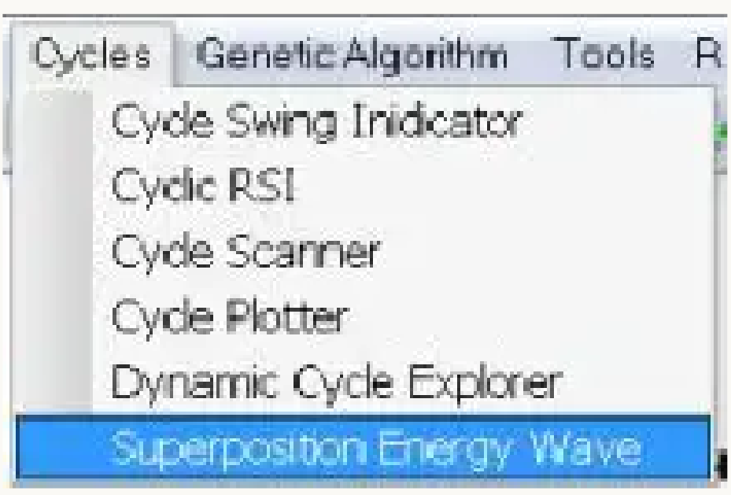

**Figure 7‑9: Cycle Pattern Decoder via the Superposition Wave Builder**

Simply attach the Superposition Energy Wave Builder to the year you want to decode and clone. The output is the composite energy wave plotted on the chart and the raw data can be exported to CSV format for further analysis.

Here is a short example.

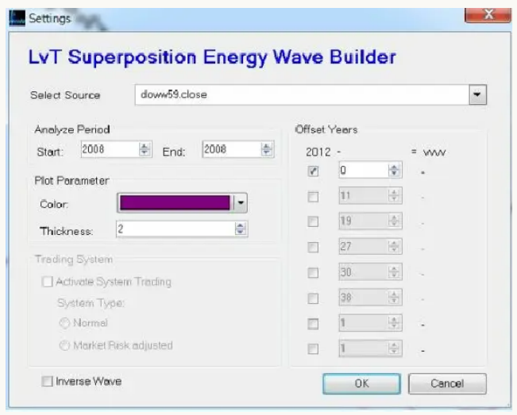

**Figure 7‑10: Parameter to plot a Cycle Pattern Decoder Indicator**

(WTT Charting Platform)

The first one identifies the year that you want to decode and which is to be remodeled based on pure cycles. With the second parameter, the offset year set to “0” you indicate you want to decode the given year of the analyze period. We will use the Dow Jones Index as our master vehicle, because we have a long history of available market data. This is what it would look like:

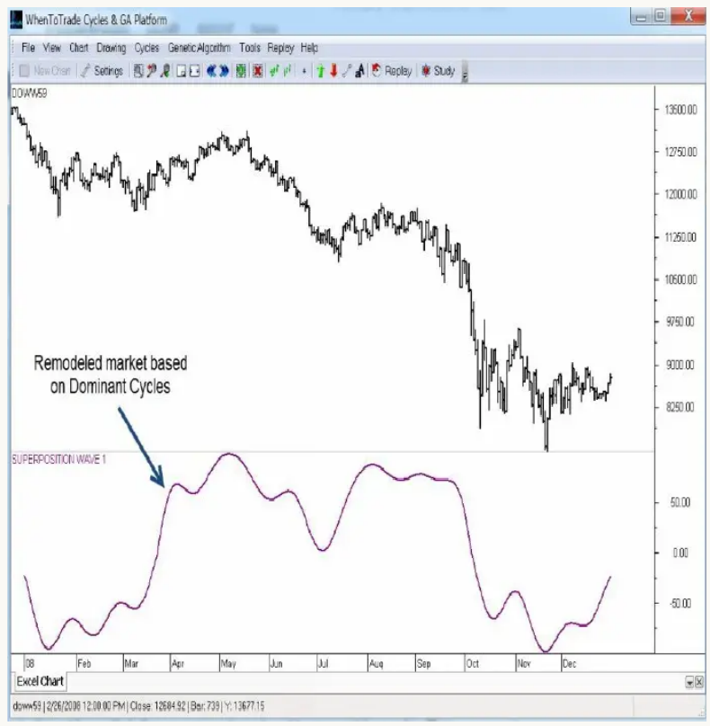

**Figure 7‑11: Cycle Pattern Decoder – Example plot**

You can see that the output is a remodeled market based entirely on cycles. These cycles were detected by our Cycle Scanner engine and passed our “dominant cycle” test earlier. These detected cycles were used to rebuild the market behavior. The shown superposition wave has a high correlation score. We are able to rebuild the complete market behavior with a correlation score of 0.92 (+1.0 stands for perfect correlation, a value of +0.5 represents moderate correlation, 0 indicates no correlation) based on up to maximum seven dominant cycles. This shows us that 6-7 simple cycles can explain 92% of the market behavior. The built-in algorithm is still complex, but the output is kept simple for our approach here. 

The composite cycle represents the change in “energy” flows. We are thus interested in the time at which the trend changes occur. This corresponds to the turns of the composite cycle plot. The remodeled wave does not give us an indication on price targets, only on time and direction. But that’s all we need. We do not predict price targets – we need the energy flow to predict changes in the “rhythm”.

To analyze this composite wave for other purposes, you can look up the detailed raw data in the script log. You can copy this data to a spreadsheet tool and experiment with different techniques later on your own.

You can run a Cycle Scanner on the same period to see the detailed active cycles. The report shows us which cycles were dominant in the year being analyzed and used to build the composite wave.

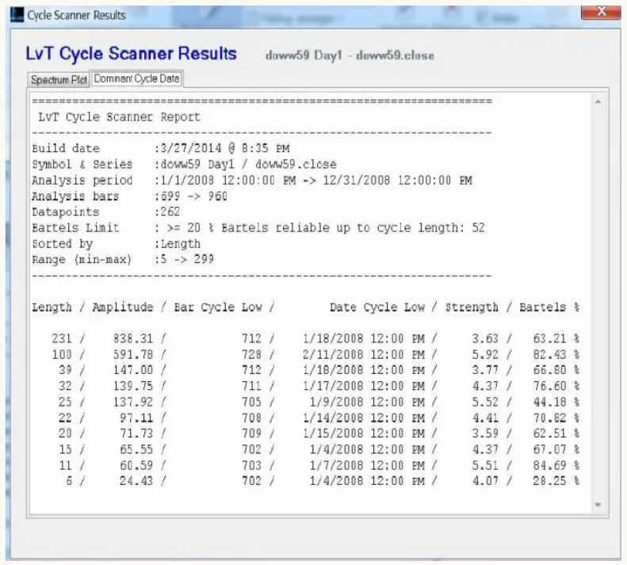

**Figure 7‑12: Output of the Cycle Scanner for 2008**

If you are able to connect the theory with cycle analysis now, try to answer the following question on your own:

When do we need the composite wave data of 2008 to build a cycles prediction model based on the previously introduced theory?

The answer is: The data of 2008 is not relevant until the year 2016. Therefore, the active cycles of 2008 are irrelevant for cycle forecasts from 2009 to 2015. This remodeled energy wave will not have a repeating character until 2015. Did it click? If not, please go back and read the last few chapters again.

We have our theory, we have our tools. Now all we have to do is connect both theory and tools and take a close look at the details. We have only decoded a year. Now we want to build a forecast ahead of time.

#### 3.2 Example: How to build the superposition wave for the year 2008

Here is our example – we want to build the superposition cycle for 2008 ahead of time. In order to do that, we have to identify the years with the same active energy pattern:

**The Superposition Energy Wave for 2008 is based on a synthesis of the active cyclic energy patterns of**

| | | |
| --- | --- | --- |
| Two Metonic Cycles | = 19 + 19 = - 38 years | = 1970 |
| Sub-Pattern 1 | = 19 + 11 = - 30 years | = 1978 |
| Sub-Pattern 2 | = 19 + 8 = - 27 years | = 1981 |
| One Metonic Cycle | = - 19 years | = 1989 |
| Sub-Pattern 1 | = - 11 years | = 1997 |
| Sub-Pattern 2 | = - 8 years | = 2000 |

**Figure 7‑13: Relevant years for building the superposition wave for 2008**

The last similar Sun/Moon/Earth/Universe alignment for 2008 took place in 2000. That is what makes this technique so interesting and fascinating. The Energy Wave for 2008 can be calculated at the end of 2000 – eight years ahead of time. In short, we can calculate our cyclic energy forecast models eight years ahead of time. You simply have to repeat the procedure presented here to identify the years with the same lunar-solar alignment in the sky.

Once you have determined the relevant years, we can use our Cycle Pattern Decoder tool to extract those cycles that were active in each year.

So we will go ahead now and do this for the 2008 example:

##### 3.2.1 Active Cycles Model for 1970

We will use the Dow Jones Industrial Index on a trading daily basis. The black line is the daily close and the blue one the remodeled version based on pure cycles. Most of the high/low turns are indicated by green/red dotted lines (please note: All turns of the yearly wave are relevant. For easier reading, not all turns are marked with lines on the chart. Check the high correlation score). The next figure illustrates the remodeled composite cycle for 1970 based on the identified active dominant cycles.

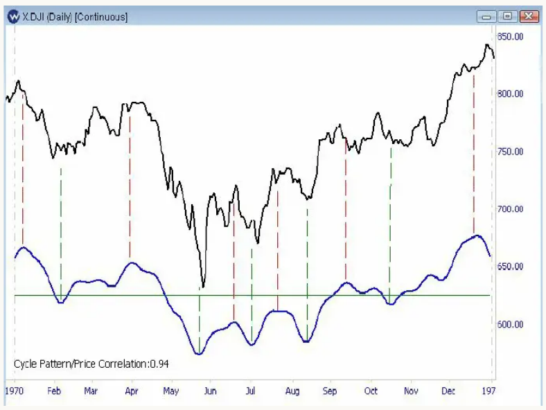

**Figure 3‑14: Remodeled composite energy wave 1970**

**Active cycles 1970:**

- Wave 1 / Length: 229.00 / Amplitude: 46.40 / Low Offset Bar*: 131.26
- Wave 2 / Length: 61.00 / Amplitude: 20.87 / Low Offset Bar*: 36.32
- Wave 3 / Length: 90.00 / Amplitude: 18.67 / Low Offset Bar*: 25.43
- Wave 4 / Length: 35.00 / Amplitude: 13.69 / Low Offset Bar*: 23.51
- Wave 5 / Length: 27.00 / Amplitude: 10.13 / Low Offset Bar*: 23.05
- Wave 7 / Length: 15.00 / Amplitude: 6.63 / Low Offset Bar*: 9.87

The remodeled version is based on six pure cycles. As our idea suggests, these cycles represent the combined gravitational and geomagnetic forces that influenced the emotions of investors in 1970. And we know that the same Moon/Sun/Earth/Universe alignment – considered the gigantic active energy filter – is also active in the year 2008, the year being reviewed in this example.

The remodeled composite cycle is a detrended version. As a result, major long-term trends are not included in the model wave. For example, in strong trending years the major trend is not modeled into the composite energy wave. In fact, my research shows that we can exclude these long-term trends. You will understand what I mean once you have read this complete chapter. Of course, there is always room for improvement. And the long-term trend components will be one factor for optimization.

Finally, I hope you now understand the significance of the Cycle Scanner engine introduced in the first book “Part 1: Dynamic Cycles” [2]. The manual technique to build composite cycles models based on the active dominant cycles discussed in the second chapter of the first book series “Part 1” is the same approach used here. Except that it is automated to keep things easy for research and trading. To fully understand the method presented in this last chapter, I had to write the book series in the precise order I did. You can now rebuild and understand the final method from the beginning.

Let’s go ahead and move on to the next year with the same alignment in the Universe.

##### 3.2.2 Active cycles model for 1978

This is the active decoded cycle model for 1978:

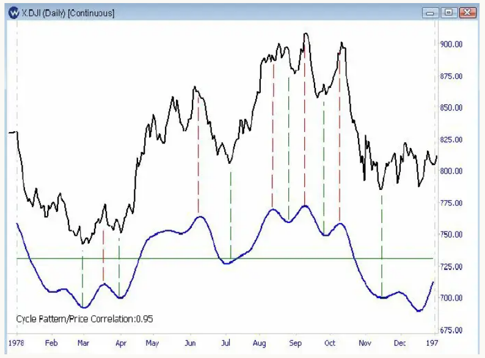

**Figure 3‑1: Remodeled composite energy wave 1978**

The remodeled composite energy wave is built on seven dominant cycles for the year 1978:

**Active cycles:**

- Wave 1 / Length: 212.00 / Amplitude: 42.35 / Low Offset Bar*: 42.08
- Wave 2 / Length: 95.00 / Amplitude: 32.20 / Low Offset Bar*: 44.22
- Wave 3 / Length: 30.00 / Amplitude: 9.47 / Low Offset Bar*: 10.97
- Wave 4 / Length: 39.00 / Amplitude: 8.67 / Low Offset Bar*: 22.17
- Wave 5 / Length: 55.00 / Amplitude: 8.01 / Low Offset Bar*: 20.24
- Wave 6 / Length: 21.00 / Amplitude: 6.49 / Low Offset Bar*: 1.57
- Wave 7 / Length: 26.00 / Amplitude: 5.44 / Low Offset Bar*: 14.89

##### 3.2.3 Active cycles model for 1981

This is the active decoded cycle model for 1981:

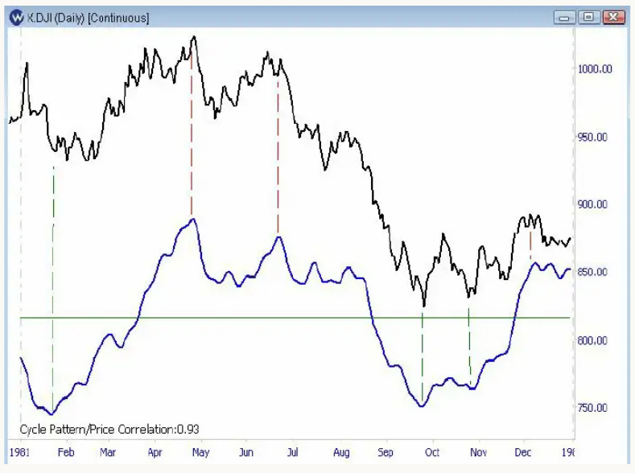

**Figure 3‑2: Remodeled composite energy wave 1981**

The remodeled composite energy wave for 1981 is built on six dominant cycles:

**Active cycles:**

- Wave 1 / Length: 186.00 / Amplitude: 44.29 / Low Offset Bar*: 13.68
- Wave 2 / Length: 89.00 / Amplitude: 20.48 / Low Offset Bar*: 20.20
- Wave 3 / Length: 42.00 / Amplitude: 11.03 / Low Offset Bar*: 13.41
- Wave 5 / Length: 20.00 / Amplitude: 6.04 / Low Offset Bar*: 10.29
- Wave 6 / Length: 14.00 / Amplitude: 2.78 / Low Offset Bar*: 4.87
- Wave 7 / Length: 8.00 / Amplitude: 2.44 / Low Offset Bar*: 6.90

##### 3.2.4 Active cycles model for 1989

This is the active decoded cycle model for 1989:

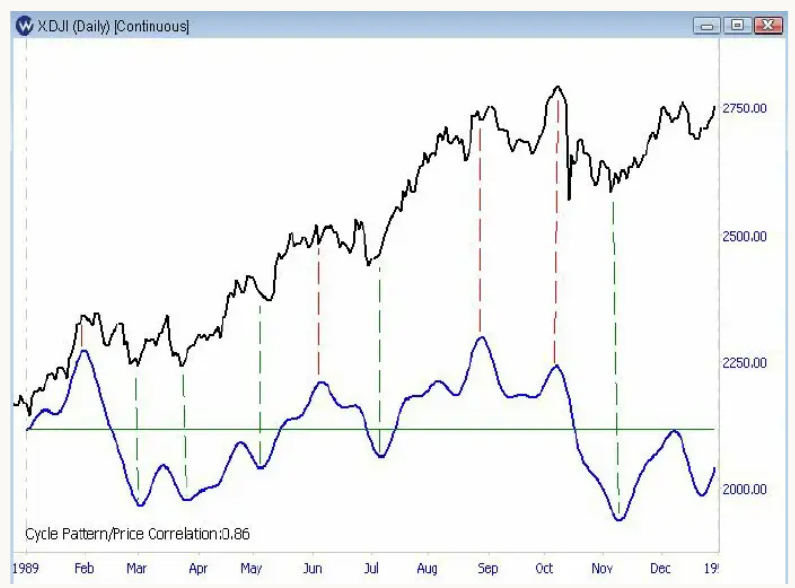

**Figure 3‑3: Remodeled composite energy wave 1989**

The remodeled composite energy wave for 1989 is built on seven dominant cycles:

**Active cycles:**

- Wave 1 / Length:183.00 / Amplitude: 61.56 / Low Offset Bar*: 65.37
- Wave 2 / Length:82.00 / Amplitude: 39.41 / Low Offset Bar*: 58.99
- Wave 3 / Length:43.00 / Amplitude: 25.06 / Low Offset Bar*: 4.53
- Wave 4 / Length:31.00 / Amplitude: 21.35 / Low Offset Bar*: 4.35
- Wave 5 / Length:24.00 / Amplitude: 14.61 / Low Offset Bar*: 16.15
- Wave 6 / Length:15.00 / Amplitude: 14.38 / Low Offset Bar*: 13.51
- Wave 7 / Length:36.00 / Amplitude: 12.37 / Low Offset Bar*: 3.80

##### 3.2.5 Active cycles model for 1997

This is the active decoded cycle model for 1997:

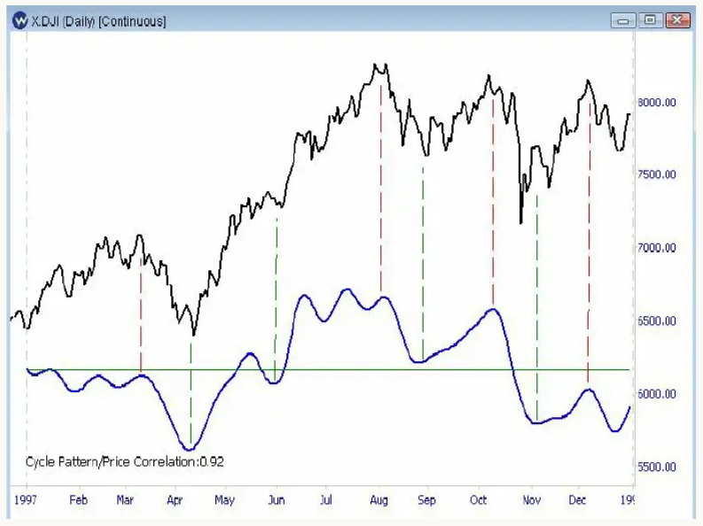

**Figure 3‑4: Remodeled composite energy wave 1997**

The remodeled composite energy wave for 1997 is built on seven dominant cycles:

**Active cycles:**

- Wave 1 / Length: 183.00 / Amplitude: 319.79 / Low Offset Bar*: 58.82
- Wave 2 / Length: 51.00 / Amplitude: 121.38 / Low Offset Bar*: 17.77
- Wave 3 / Length: 82.00 / Amplitude: 118.38 / Low Offset Bar*: 78.17
- Wave 4 / Length: 37.00 / Amplitude: 96.73 / Low Offset Bar*: 32.63
- Wave 5 / Length: 30.00 / Amplitude: 64.91 / Low Offset Bar*: 13.10
- Wave 6 / Length: 21.00 / Amplitude: 53.09 / Low Offset Bar*: 2.13
- Wave 7 / Length: 18.00 / Amplitude: 37.97 / Low Offset Bar*: 1.15

##### 3.2.6 Active cycles model for 2000

This is the active decoded cycle model for 2000:

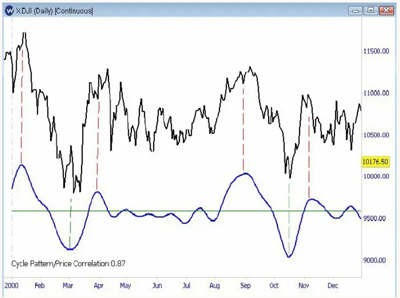

**Figure 3‑5: Remodeled composite energy wave 2000**

The remodeled composite energy wave for 2000 is built on seven dominant cycles:

**Active cycles:**

- Wave 1 / Length: 83.00 / Amplitude: 297.11 / Low Offset Bar*: 43.43
- Wave 2 / Length: 54.00 / Amplitude: 258.05 / Low Offset Bar*: 39.37
- Wave 3 / Length: 174.00 / Amplitude: 174.75 / Low Offset Bar*: 77.67
- Wave 4 / Length: 27.00 / Amplitude: 127.32 / Low Offset Bar*: 19.12
- Wave 5 / Length: 41.00 / Amplitude: 124.86 / Low Offset Bar*: 37.68
- Wave 6 / Length: 31.00 / Amplitude: 70.90 / Low Offset Bar*: 19.73
- Wave 7 / Length: 19.00 / Amplitude: 67.71 / Low Offset Bar*: 16.25

#### 3.3 Building the superposition wave for 2008

Now, we will build the superposition wave for 2008 from the six individual cyclic energy patterns. We have to simply add up all six energy patterns. As we cannot be exactly sure which of these energy patterns will repeat themselves, we will simply use a synthesis of all energy patterns that are equally weighted.

The scheme to build the superposition wave is based on the six remodeled energy waves for the years with similar energy filter grids in the Universe. The general approach is presented in the following figure. 

The formula to obtain the superposition wave for 2008 is:

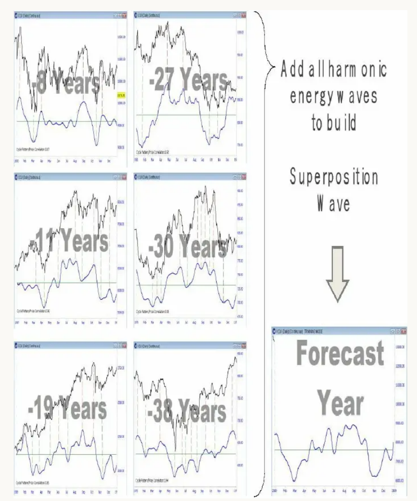

**Figure 3‑6: Calculation scheme for the superposition wave** (with data shown for 2008 forecast year)

> W.D. GANN
> “In making my calculations on the stock market, I get the past history and find out what cycle we are in and then predict the curve for the future, which is a repetition of past market movements.”
> TUNNEL THRU THE AIR

The Cycle Decoder Script will provide us with the “raw” data for each yearly cycle model in the script log. Simply switch on the “raw data = true” option from the “Decoder” Script. Open the script log and you can use the raw data for any trading day, using cut and paste to move this information into a separate spreadsheet. We can use this data to manually build the superposition wave. We simply have to use the output and add it up manually in a separate spreadsheet.

Below is a manual spreadsheet with raw data to build the superposition wave for 2008 (extract):

**Raw Data annually remodeled Cyclic Energy Pattern**

| TD Count | 1970 | 1978 | 1981 | 1989 | 1997 | 2000 |
| - | - | - | - | - | - | - |
| 1 | 63.50341009 | 66.56642245 | -41.6705128 | -1.495508193 | 1.760057442 | 47.93625251 |
| 2 | 69.60918333 | 59.79998744 | -45.72415795 | 0.483085303 | -2.624651999 | 58.98466914 |
| 3 | 74.51816955 | 52.40568513 | -50.79313797 | 4.427002791 | -5.043303 | 69.61759024 |
| 4 | 77.89526403 | 44.53382592 | -57.68379223 | 9.1889141 | -6.251197126 | 79.30241255 |
| … | … | … | … | … | … | … |
| 257 | 95.21454644 | -73.72673334 | 40.42045131 | -67.91316953 | -72.5222822 | -1.84319269 |
| 258 | 90.24712408 | -64.54329791 | 43.98642546 | -61.30592002 | -67.22135811 | -7.168325779 |
| 259 | 83.46729964 | -54.7210911 | 47.81529394 | -52.95187625 | -60.66765155 | -12.75076276 |
| 260 | 75.09882768 | -44.66186371 | 49.79027578 | -43.77550329 | -53.34543758 | -18.13784867 |
| 261 | 65.56252274 | | 48.86666294 | | -45.77227034 | |

**Figure 3‑7: Raw energy waves and superposition result (extract)**

This is only an extract to show you that the superposition wave is simply an addition of all annually remodeled energy waves (divided by six). The entire calculation is attached in the Appendix for you to review.

The plot of the superposition wave based on this data is presented in the following figure.

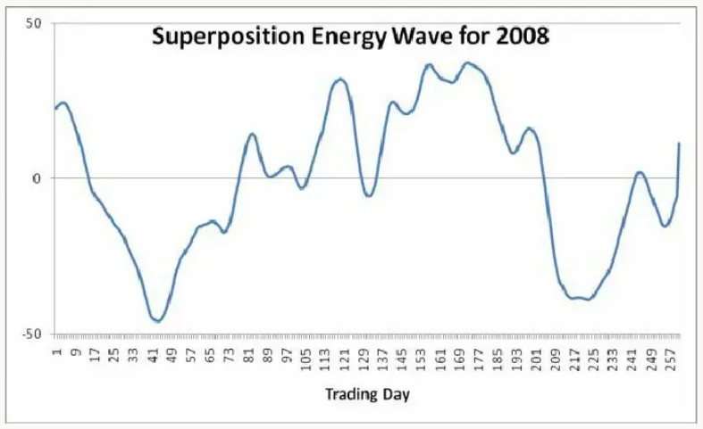

**Figure 3‑8: Superposition wave plot**

This is now the final result based on the theoretical foundation I have outlined. We have built a synthesis from the years with a similar Moon/Sun/Earth/Universe position alignment. If our theoretical foundation is correct, then we should be able to determine how energy will influence the mood of investors in accordance with the gravitational and geomagnetic forces that will come into play. We assume that the way the forces affect the Earth is similar for all of the years used because of the identical alignment in the Universe. 

There are different ways to use this energy plot. However, the main approach is to use the turns of the energy plot and to make use of its predictability to forecast market turns.

To transfer this idea into the trading arena, it would be helpful to build an automated superposition wave directly into the trading software. With the method outlined in full detail, you can rebuild this approach with different tools. The function to do this with the WhenToTrade Platform has already been included. That is, an automated module exists which will perform all individual manual steps I have explained. The module attaches the cyclic decoder to the relevant years, captures the separate energy waves and automatically builds the superposition wave. Trust me, it took a long time for me to get to this point (the module can be found in the Cycles menu: “Superposition Energy Wave”).

You simply have to select the years you want to include in the superposition wave and the rest is automatically done by the cycle decoder engine. You can now see how it all comes full circle. The engine introduced in Chapter 2 to detect cycles in financial data is only one piece of the puzzle.

The next chart reveals what the superposition wave for 2008 looks like in our platform.

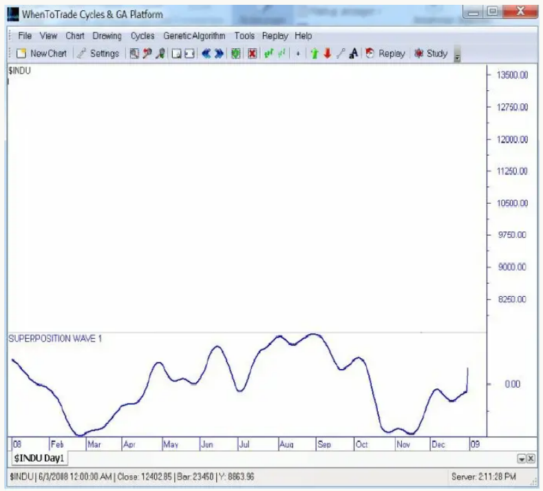

**Figure 3‑9: Automatically build the superposition wave for 2008**

### 4. Decoding future market turns eight years ahead of time

Next, I will explain how to use this superposition energy wave.

In order to decode the curve, we simply extract the days on which a change in the energy flow occurs. These are the points in time when emotions shift from positive to negative or vice versa. These situations will result in trend changes in the stock market, as the stock market is merely a response to emotions. Emotions lead the way – the market will follow.

So don’t get confused by the amplitude of swings – the amplitude does not correlate with the power of price swings in the stock market. The synthesis of the six comparable years with the same energy lock is useful for identifying emotional turns, not price levels.

The next chart demonstrates how to use this model for forecasting. You can build it ahead of time – eight years ahead of time. It doesn’t matter when you build this forecast – it will become interesting when the year arrives. Now you have a concrete map with precise days on when to expect the market trend to change. 

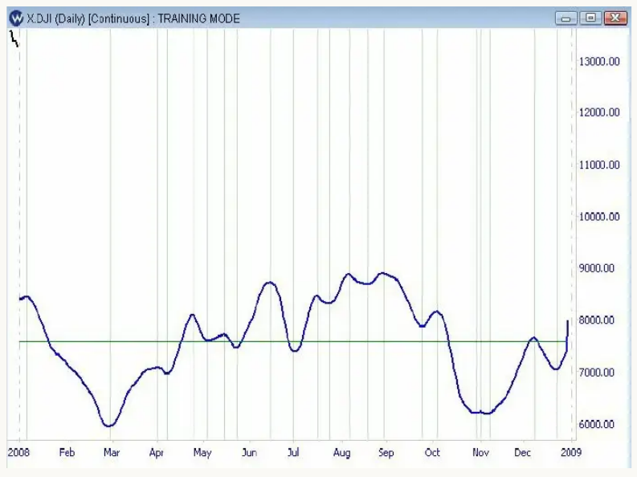

**Figure 4‑1: Decoding the superposition wave for exact days of trend change** All expected days are indicated on the chart with grey lines.

Decoding the superposition wave for trading implies that we are looking for turns on the curve. These turns are aligned with concrete trading days in the future. Just look up the exact calendar day of these marked trading days from the predicted future chart. In addition, the direction of the turn will show you whether to expect a high or low on these trading days. That is, you will obtain two pieces of information while decoding: 1) The days on which a change in trend (CIT) is expected, and 2) whether this CIT will be a high or low. Finally, you also obtain information on the time of the CIT and the direction of the next move. Write them down. These days represent the decoded map of the energy cycles which will correlate with changes in the trend of the stock market. Now you have it – a decoded version of this cycle model for trading.

#### 4.1 Swing trading the superposition wave

Now that we have decoded this wave, we can use this information for trading. The easiest way would be to simply swing trade the decoded dates.

Go long on the market when there is a trough and go short when you are at the top of the superposition cycle. Simple, isn’t it?

The next step will lead us to the final part of this detective story. Will our solution work? Have we found all relevant pieces of this puzzle? Did we draw the right conclusions?

Let’s add the trading component to this model. The chart below presents the same energy wave with the decoded trading days in advance. Now the real market behavior is plotted and the trades are executed “blindly”. Bear in mind that the trades are executed based on the energy cycle only. The real market behavior of the price was and is not taken into account here. That’s why I have mentioned here that the trades are executed “blindly”. They are executed based purely on the energy wave which has been calculated eight years ahead of time.

The trades are highlighted on the chart as follows:

- Red Line: Profitable Short Trade
- Blue Line: Profitable Long Trade
- Yellow Line: Losing Trade (Short or Long)

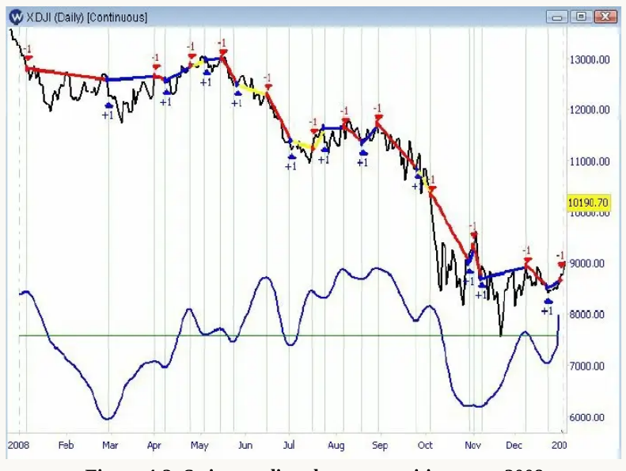

**Figure 4‑2: Swing trading the superposition wave 2008**

There are 22 closed trades during the year 2008. Twelve short and ten long trades. When you review these trades, the following facts crystallize:

- 77% profitability/accuracy
  There are only five losing trades. The duration of these losing trades was very short. The loss was covered quickly with the next swing trade.
- Long trades were profitable despite this being a big down year
  The Dow lost 34% in 2008. However, the “long only” strategy of this system would have been profitable. Eight out of 11 long trades were profitable. This equals an accuracy of 72% on the long side.

These results would not have been possible by chance. The following chart displays the full system report for trading the superposition wave in 2008. Keep in mind that the profit is measured in index points, not dollars.

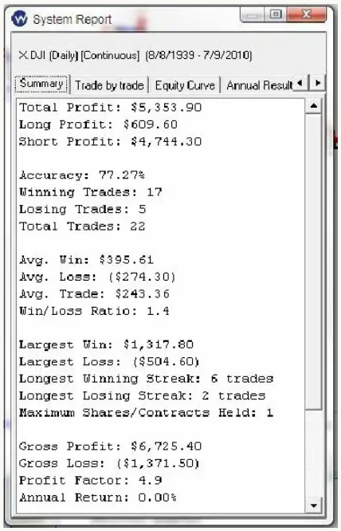

**Figure 4‑3: System report for the superposition wave 2008**

The system traded + 5353 index points while the Dow lost -4485 points during the same period. The equity curve for this year looks like a straight line continuously moving upward.

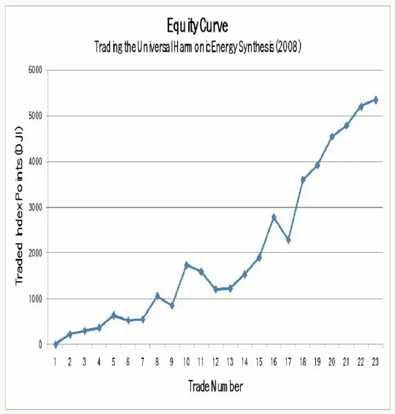

**Figure 4‑4: Superposition equity curve 2008**

Impressive, isn’t it? And this by trading in the year 2008 using a swing trading forecast which was built in 2000, eight years ahead of time!

I have outlined the complete process of how to build this forecast. You can now do this on your own. The trading rules are very simple: The system is always in the market and swings from short to long on the turn dates of the superposition wave.

You now have all the tools in front of you to check this on your own.

### 5. Swing trading the Harmonic Energy Cycles – 1995 - 2010

The real challenge will be a test of this theory on a longer select period. Let’s take 15 years. A common length for backtesting trading systems on a daily time frame. The rules remain the same – the decoding engine works automatically for every year. We can thus be assured that curve-fitting or over-optimizing is not possible. Simply extract the cycles for the relevant years. Build the superposition wave. Trade the turn dates. An entirely automatic system. No subjective interpretation needed.

The years we used for this analysis are depicted in the following table and are based on the approach introduced in the previous chapters.

**Relevant years for superposition wave with similar energy alignment of Earth, Sun, Moon, and the Universe**

| Forecast / Trade Year | | | | | | |
| --- | --- | --- | --- | --- | --- | --- |
| 2010 | 2002 | 1999 | 1991 | 1983 | 1980 | 1972 |
| 2009 | 2001 | 1998 | 1990 | 1982 | 1979 | 1971 |
| 2008 | 2000 | 1997 | 1989 | 1981 | 1978 | 1970 |
| 2007 | 1999 | 1996 | 1988 | 1980 | 1977 | 1969 |
| 2006 | 1998 | 1995 | 1987 | 1979 | 1976 | 1968 |
| 2005 | 1997 | 1994 | 1986 | 1978 | 1975 | 1967 |
| 2004 | 1996 | 1993 | 1985 | 1977 | 1974 | 1966 |
| 2003 | 1995 | 1992 | 1984 | 1976 | 1973 | 1965 |
| 2002 | 1994 | 1991 | 1983 | 1975 | 1972 | 1964 |
| 2001 | 1993 | 1990 | 1982 | 1974 | 1971 | 1963 |
| 2000 | 1992 | 1989 | 1981 | 1973 | 1970 | 1962 |
| 1999 | 1991 | 1988 | 1980 | 1972 | 1969 | 1961 |
| 1998 | 1990 | 1987 | 1979 | 1971 | 1968 | 1960 |
| 1997 | 1989 | 1986 | 1978 | 1970 | 1967 | 1959 |
| 1996 | 1988 | 1985 | 1977 | 1969 | 1966 | 1958 |
| 1995 | 1987 | 1984 | 1976 | 1968 | 1965 | 1957 |

**Figure 5‑1: Relevant years for trade system**

Before we review the 15-year period step-by-step, let’s start with the equity curve. If you are familiar with the evaluation of trading systems, you know that a look at the equity curve says it all. So, here it is, the equity curve for swing trading the DJI from 1995 all the way up to 2010 (June 2010, as I am writing this chapter). The profit is calculated in terms of index points. All trades are executed without regard to actual price. Imagine forwarding theses trading dates to your broker eight years ahead of time and telling him: “Please execute the trades as indicated on the list.”

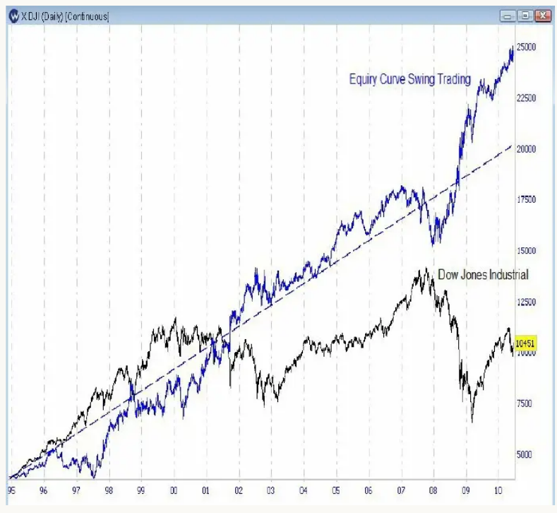

**Figure 5‑2: Equity curve - Swing trading the superposition wave**

The equity curve reveals a constant upsloping – near ideal – line. One important benefit is the constant and smooth upsloping equity. You can be sure that the profit is not based on wild up and down swings. The volatility is low and the drawdowns are acceptable.

During the uptrend years between 1995 and 2000, the system was able to move ahead at a similar pace. However, after the market high in 2000, the market reversed and lost around 30%. The superposition wave system was not impressed by the market and continued to stair-step higher with the same pace from 2000 to the market low in 2003. After 2003, there was a market reversal to the upside again. Our system was also not impressed by the turn in the main market trend. The equity curve smoothly moved higher as if there was nothing in the way. Between 2003 and the market top in 2007, the market and system again moved higher in sync. It is interesting, because it looks as though there was a connection during this period, but there wasn’t. The trade dates are all based on years long before 2003. After the market top in 2007, the market again lost around 50%. It does not surprise us now – the superposition wave system was only impressed a short time at the end of 2007 when it dipped down (perhaps the market emotions ran far beyond the cyclic forces). But just after a short period, the system was immediately in vibration again with the market and during the sharp down move, the system took a run up move not seen before.

The equity curve does not show any longer term trends. The system was perfectly able to vibrate with the market. This is attributable to the fact that our system is in sync with the external energy cycles that impact life on Earth. We simply have to adjust to this hidden rhythm. The main sign is the different starting points used for the cycle analysis – or as Gann asserted: “[…] you only have to look up what has happened in the past and get a correct base or starting point.”

If you are familiar with the analysis of equity curves, you will have noticed straight away. I must say, I have not seen an equity curve like this with predicted turns eight years ahead of time.

Please keep in mind that the parameters for the system have remained constant during this entire 15-year period. And there is no way to over- optimize or curve-fit this system. It involves the automatic detection of dominant cycles for the relevant years and a simple synthesis of all of these composite waves for the year in question.

Each forecast was calculated once a new year began, applying the same rules and calculations. Then all trades were executed blindly as explained in the chapter “Decoding the superposition wave”.

Let’s review some additional facts of this swing trading system. The system has an accuracy of over 62%. The total of 330 trades over the 15-year period show an average of 22 trades each year. This is a good number for daily swing trading. Not too edgy – not too long-term oriented.

The system report presents the traded index points (not dollars). The system pulled 20560 points out of the market while the Dow only gained around 5000 points from 5100 (1995) to 10400 (2010). The system thus outperformed the Dow by a factor of 4 during this period. In other words, it is not only the smooth upsloping equity curve that makes this approach interesting. The absolute numbers also support our theory with impressive gains.

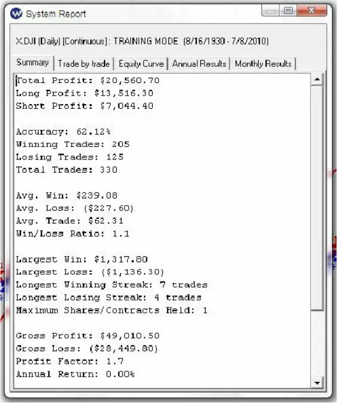

**Figure 5‑3: System report 1995-2010 (simple swing trading)**

But let’s dive deeper into the system’s statistics. For now, we have seen the impressive equity curve and the absolute numbers.

Now let’s review these numbers year-by-year:

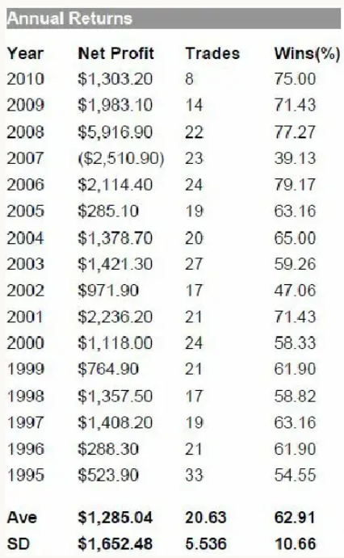

**Figure 5‑4: Annual results (1995-2010)**

When you review this table, you will see that there is only one single year with a loss (2007) out of a total of 16 years. This is a result of the smooth equity curve, but again shows that the predicted energy swings were right on track year after year.

Secondly, the trade distribution was also constant – there were around 20 trades per year on average. The deviation has been minimal over the entire period. Not only did the profit move up smoothly, the trade distribution was of equally similar distance over the years. This also makes this system interesting because trading activities are distributed over the full year and not pressed into small periods.

Furthermore, the accuracy of predicting turns also remained constant over the years with an average of 62.91% winning trades per year. This is the third factor that substantiates the robustness of this system. The profit is not based on random trades with big profits that in the end overrun all losing trades. The profit is based on the majority of trades with no exception over the period shown.

The next chart provides some final figures for the trading system. Even the distribution between short and long trades demonstrates that both strategies would have been profitable on their own. And the results of long only (accuracy: 67%) and short only trades (accuracy of: 56%) is nearly equal. Another aspect of a robust swing trading system.

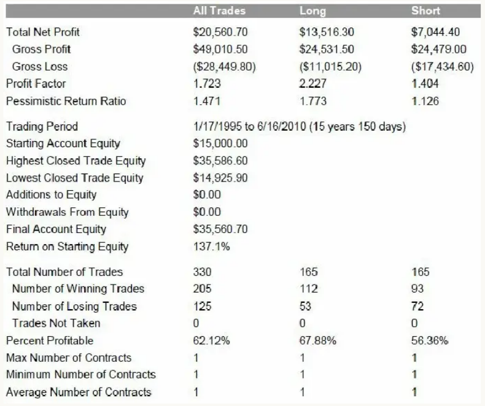

**Figure 5‑5: System statistics (All / Long / Short)**

We have arrived at a final point here. We started with a theory with general assumptions and are now conducting a detailed analysis of the results. Let’ compare just some facts from an investor’s perspective. 

The investor would be interested in trading strategies which:

- outperform the underlying basic stock index,
- assure stable and reliable growth of the equity curve,
- are of low volatility compared to the original market,
- ideally have no yearly losses in the account,
- outperform the best fund managers with a long track record.

Let’s see how our approach would meet these requisites. We will review our system comparing it against the underlying index and one of the best-known investment gurus – Warren Buffet. The following table provides a comparison between the following three systems on an annual basis.

Dow Jones Index, Warren Buffet, and the LvT Swing Cycles system

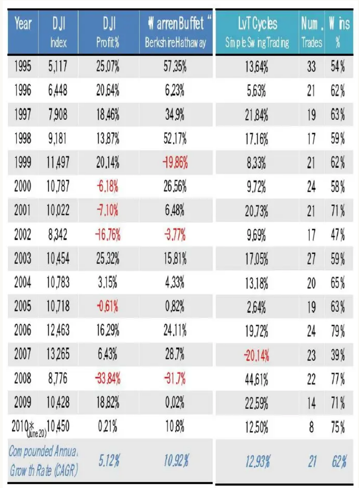

**Figure 5‑6: Comparison of annual results for different trading strategies (Dow, Buffet, Cycles)**

The table shows the current year, the index value at the end of the year, the percentage gain of the index, the Buffet, and the Cycles system. In addition, the trade distribution and accuracy of the Cycles system is displayed for every year. The annual profit is measured in percentage for each system. The percentage in the Dow is calculated by the gain of the index for the given year. Warren Buffet’s gain is based on an investment in his company “Berkshire Hathaway” (BKR). The Cycles system’s percentage profit is based on the index points traded by one contract for the Dow relative to the index at the beginning of the year. We thus use the same time frame and annual gain approaches to compare these three investments.

Let’s review each category introduced above. The Cycles system results in only one negative year. This compared to the Dow with five losing years and Buffet’s investment company with three negative years.

Second, if you review the drawback of the system on an “end of year” basis, you can see that the worst and only negative year in the Cycles system was 2007 with a loss of 20%. The biggest loss of Buffet’s company and the Dow was over 30%.

Third, let’s review the average annual return of the three investments. One problem when talking about average investment returns is what precisely people mean by "average". Many people don't really understand what the return on their investment is.

For example, if an investment went up 100% one year and then came down 50% the next, you wouldn't claim that you had an average return of 25% per year (the average formula is: 100% + (- 50%) / 2 = 25%). The investment is back where it started off: The real annualized gain is zero.

In this example, 25% represents the simple average, the "arithmetic mean". The zero percent that you actually get is the "geometric mean", also called the "annualized return" or the "CAGR" (Compound Annual Growth Rate). 

It is particularly misleading when you read fund advertisements that claim to have certain attractive "average annual returns". The average numbers make the funds look better than they really are.

The average return is incorrect because the value of the portfolio changes over time. Therefore, the order in which the returns occur is important. But if we take an arithmetic average, the order is not relevant. It would be the wrong approach to replace a method in which order is important (=calculation of profit) by a method in which order is not important (=arithmetic average). By using the geometric average, on the other hand, we obtain a number that is identical for each period. The more volatile an investment is, the higher the error between the average return and the CAGR you actually get. It is not surprising that investment firms often use the average return. Finance professionals use geometric averages.

Finally, we will use the compound annual growth rate that allows us to arrive at a clearer evaluation of the performance.

Thus, our CAGR for the investment is equal to 12.93%, representing the smoothed annualized gain we earned over our investment period of 15 years. The CAGR of the Dow is only at around 5% and Buffet’s investment company at around 10%. The Cycles system was again able to outperform the other two systems. It was even able to outperform one of the most important investors in all of the categories: Total profit, annual profit, and CAGR.

These numbers are promising.

The approach of swing trading the calculated trading dates, which were generated eight years in advance, has not only outperformed the underlying index. It also outperformed one of the best-known investment managers over a period of 15 years. It’s not only that the total profit is higher –the Cycles system outperformed the other two in all presented categories over a 15-year period.

For me, this is valid evidence that markets are not random. This method does not perhaps meet all criteria of scientific measurements, but I will leave the rest open to be done by experts of mathematical statistics. 

Obviously, a dynamic approach involving the use of composite cycles models with non-linear offset and starting dates can have an edge in the market. That’s what I missed in most of the cycle approaches out there. Most are static cycle frameworks that have to be “adapted” and “interpreted” according to the actual market conditions. And the worst with regard to trading is that there are at least two possible alternatives for the further development of these static cycle frameworks.

I also try to overcome one of the main problems with cycle forecasts: The superposition cycle model is clean and clear to the point. There is no room for subjective interpretations. There are no alternative outcomes. The model cannot be re-fitted after the fact.

With all the introduced rules, the model turns into a purely automatic trading system. And general physics can explain all rules.

#### 5.1 Automated trading system

The trading system presented is the final consolidation of all of the theories and concepts elaborated in this book, compressed into one tool for use on the trading chart. It is a fully mechanical system. That is, mechanical code can be applied to implement this approach.

All functions needed to use this approach are included. You just swing trade the turns of the superposition wave. All trades are known in advance based on the plot. Within Wave59, the parameters for the trading system can be selected in the configuration box of the superposition wave builder. Therefore, you can change and adapt it to your own rules. And you can expand the research and add different ideas.

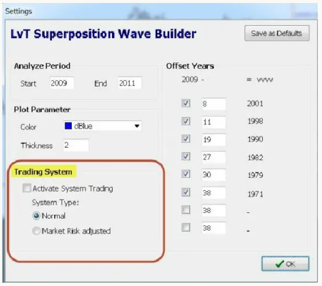

**Figure 5‑7: Energy Wave Swing Trading Parameters** (Wave59 Cycles PlugIn)

You can use this system and script to plot the energy wave ahead for the next years. The trading rules are already included.

### 5.2 Adding position sizing according to market risk

So far, we have not taken the actual market behavior into account in our trade decisions. We have only blindly executed the trades on the given dates. Let’s ust add a simple approach to heed the market a little. Just a little. Because it will not influence our trade decision – to reiterate, the trades are executed at the given times. No trade will be skipped.

We can add rules to reduce the risk of our system:

That means that if the market is in a deep oversold condition, for example, and our next predicted trade is to go short, we will reduce our position size. On the other hand, when the market is deeply oversold and the next trade is to go long, we will increase our position size. And vice versa: When we have an overbought condition and the predicted trade is to go long, we will reduce our position size. If we have overbought conditions and the next trade is to go short, we will increase our position.

The main rules of the model are not touched here. We will swing trade the market with the predicted energy flow over the year. But we will adjust the position size of each trade in accordance with the technical conditions of the market.

We will use simple technical indicators that can tell us whether we have oversold or overbought conditions. In this example, we will use the RSI, momentum, and Keltner Channel Indicator. When these indicators signal an overbought condition, the position size for a possible long trade will be reduced and the position size for a possible short trade increased. On the other hand, when these indicators signal an oversold condition, the position size for a possible short trade will be reduced and that for a possible long trade increased. The signal for the trade execution is still given by the superposition energy wave.

In this example, we will let the trade size float between 1 and 5 contracts. Hence, three contracts imply a neutral status of the market – not overbought and not oversold. If the market is extremely overbought and a long trade is around the corner, just one contract will be traded. If the market is extremely oversold and a long trade is around the corner, five contracts will be bought.

The following table shows the simple position-sizing method:

| Technical market condition based on RSI, momentum and Keltner Channel | Position size for next LONG trade | Position size for next SHORT trade |
| --- | --- | --- |
| extreme overbought | 1 | 5 |
| overbought | 2 | 4 |
| neutral | 3 | 3 |
| oversold | 4 | 2 |
| extreme oversold | 5 | 1 |

**Figure 5‑8: Position size according to market risk**

You can, of course, add more complex rules. I just want to give you some ideas of where to go from here and what is possible with the basic system outlined in this book. These are simple rules for position sizing according to the technical conditions of the market. The next chapter uses the same simple swing trading system but includes the engine for position sizing.

A separate options can be checked in the configuration panel to review this example and to use the position sizing approach on your own. You can go ahead and use this system type as a starting point for your own systems.

To use the swing trading system with the market risk-adjusted position size, simply select the parameter “Market_risk_adjusted” instead of “Normal” without position sizing.

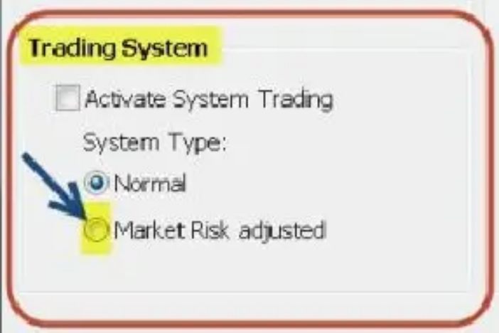

**Figure: Parameter to turn on position sizing engine** (Wave59 Cycles Plug-In)

### 5.3 Swing trading system with market risk-adjusted position size

The following chart presents the new equity curve for the market risk- adjusted cycles model and compares it to the original “blind” one and the Dow Jones Industrial Index.

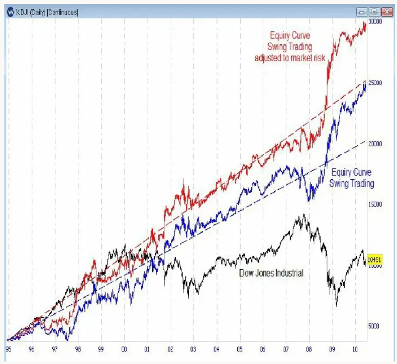

**Figure 5‑9: Equity curve with risk-adjusted position size (red)**

You can see that the risk-adjusted position size is capable of pulling even more points out of the market. The accuracy score is the same, of course, because the same trades are being executed. However, the net profit is continually increasing. The averaged total net profit for one contract (the system trades three contracts on average) is around + 25000 points compared with approximately 20500 points when using the original system. In other words, this risk-adjusted position size is able to increase the original net profit by 20%.

I hope you have acquired a new way of thinking here. Instead of using the technical indicators for market timing, we simply use the technical indicators for position sizing. We derive the market timing from our cycles model. Most trading systems use technical indicators to build entry and exit signals. But technical indicators do not guide, they only sum up the actual conditions, i.e., they have no predictive value for trade entry or exit. But if you have reliable tools to time your trades, the power of technical indicators comes back to life for position sizing.

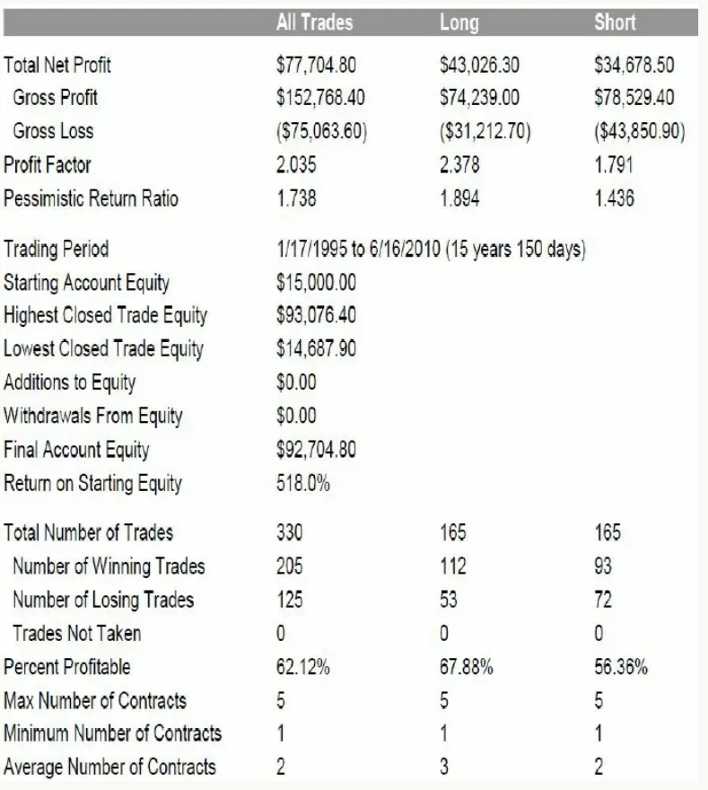

**Figure 5‑10: System statistics with risk-adjusted position size**

One major benefit is that the net profit distribution on long and short trades is very smooth. The total profit equally consists of 50% short trades and 50% long trades. This is only attributable to the fact that we are able to adjust our trade risk in accordance with the market condition. Please compare the numbers with those shown in Figure 5 ‑5: System statistics (All / Long / Short) on page 81. The distribution for the original system was 65% net profit resulting from long and 35% net profit resulting from short trades.

Let’ summarize the investment results for the system so far.

#### 5.4 Hypothetical investment comparison

We will now build a hypothetical investment portfolio with 100,000 USD. Each investment portfolio will be used to invest in our three investment types: Long only on the Dow, managed investment with Warren Buffet, and the Cycles system. The total return after the 15-year period is presented in the table below.

It is interesting that the swing trading system with a market risk-adjusted position size generates two times the profit of the managed investment. A compounded annual return rate of around 15% combined with the smooth equity curve underpins our theory about energy cycles.

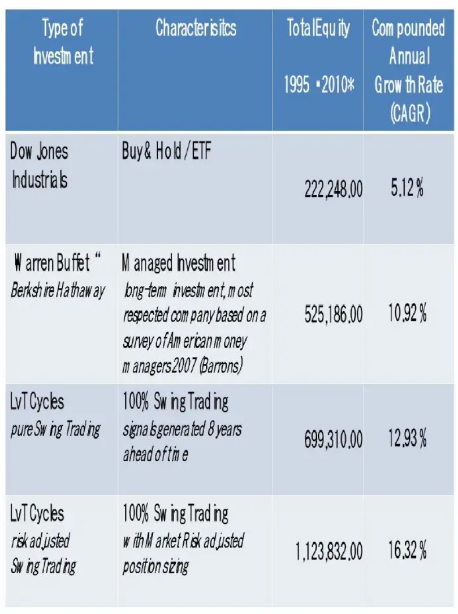

**Figure 5‑11: Investment comparison**

The calculation for the total equity after 15 years is based on the annual profit (measured in percentage) for each approach as shown in Figure 5 ‑6: Comparison of annual results for different trading strategies (Dow, Buffet, Cycles) on page 83.

For the Cycles model, a simple switch of the investment sum placed in a non- leveraged Dow long or short ETF would have provided this result. So imagine what the profit could look like if you traded future contracts, options or leveraged ETFs!

These results – in terms of total net profit and the characteristics of the system – would not have been possible by chance. The next step verifies what the system would look like when using random signals.

#### 5.5 Robustness test

All trade dates have been generated eight years in advance by decoding the turns of the synthetic energy wave. We know that around 21 signals are distributed over one year.

Let’s ask a final question now: How would our system have performed if we had used random trade dates with the same characteristics?

I have developed a random number generator that produces random sell/buy dates in a changing cyclic frequency with a total of 22 signals per year. Hence, the random signal generator’s output has the same characteristics as the decoded signals from our superposition wave: Approximately 21 signals annually with a cyclic distribution over one full year.

Instead of using the dates from the decoded superposition wave, we will use these dates now for trading from 1995-2010.

I don’t have to present the system details. The results are what you would expect from a random swing system. I have conducted numerous different tests with random signals. This is the average outcome we can expect. I will leave the Monte Carlo simulation and all other statistical matters up to the experts. For me, the visual plot of 30 random runs suffices to prove that the outcomes of the superposition wave cannot be achieved by chance.

- Average Accuracy: between 46% and 54%
- Average Win/Loss Ratio: between - 0.9 and + 1.1
- Average Profit Factor: between -0.9 and + 1.1

Again, the equity curve says it all. We have not been able to build a “profitable system” by using randomly generated dates with the same characteristics like the superposition dates. That is no surprise. And even if you had a profitable system – like the ones shown in the upper left and right – there is no continually growing equity curve.

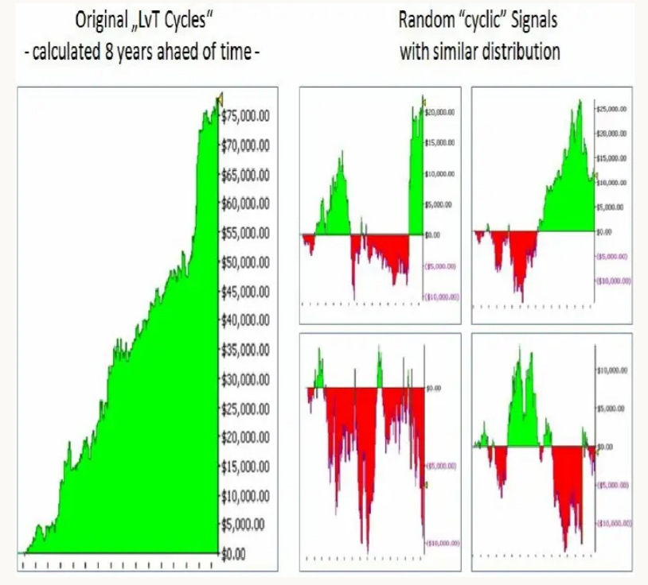

**Figure 5‑12: Equity curve comparison: Superposition and random dates (15 years)**

#### 5.6 System analysis of the Harmonic Energy Cycles model – 1980 – 2010 / 30 years

For the final test, we will again increase the analysis’ time frame. We began with a detailed analysis of one year (2008) in Chapter 4.1 and then moved to a 15-year time frame. Now we will use the cycles model for a 30-year time frame. The new time frame encompasses 1980 up to today, 2010. The approach will remain constant, entirely automatic and will not change over this 30-year period.

The trading dates for 1980 build on an energy synthesis of 1942, 1950, 1953, 1961, 1969, and 1972. The trading system from 1980 to 2010 uses historical data from 1942 up to 2002. This is a real long-time test for a “static” automatic system.

In this test, the profit is not counted in index points. I used a hypothetical account with a starting equity of 15,000 USD. The number of total allowed contracts per trade was increased by 1 for each 10,000 USD in equity. At the beginning, the system was thus only allowed to trade one contract until another 10,000 USD in net profit were gained.

For this test, we simulated a futures contract in which 1 point equals 25 USD. The position size was calculated using the market risk function outlined above. The system traded all signals – no signal was skipped. That is, the timing is 100% based on the forecasted superposition wave. The maximum number of tradable contracts was limited to 10 contracts – regardless of the total equity.

The next chart shows the equity curve for the period from 1980 to 2010. It is set to log scale due to the long time frame we are using and comparing here. Again, the equity curve is still constantly upsloping in an ideal line (dotted red line) – even over this long period.

The main figures for the evaluation of our superposition energy theory for a 30-year period are:

- Accuracy / Profitability:58%
- Profit Factor:1.8
- Win/Loss Ratio:1.3
- Compounded Annual Growth Rate: 20 %

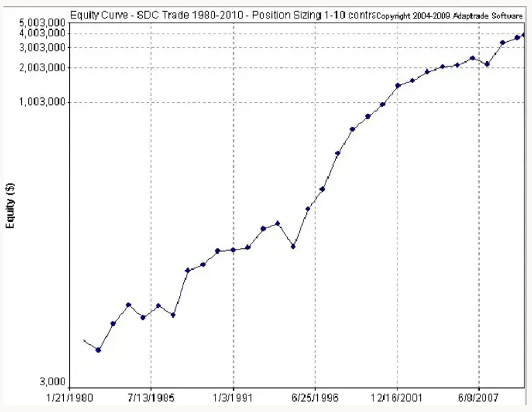

**Figure 5‑13: Equity curve for trading cycles model 1980 – 2010 (log scale)**

Here are the detailed statistics for review. Some interesting facts are highlighted.

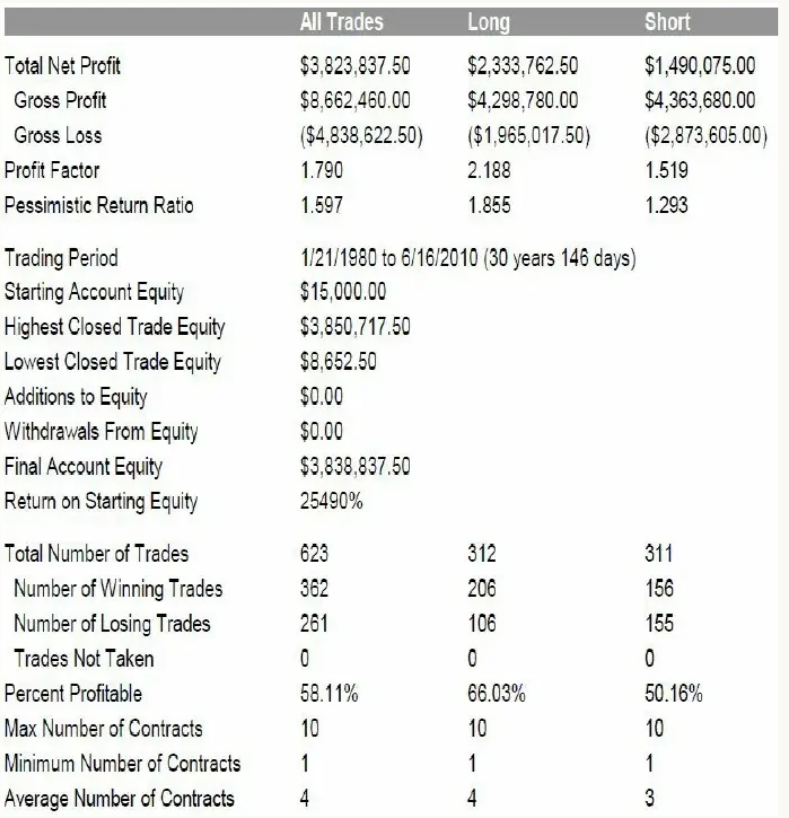

**Figure 5‑14: System report - 1980-2010 (Part I)**

It is evident that this superposition energy wave system is very robust and delivers constant performance measures:

- Both trading strategies would have been profitable on their own. Even the short only trading strategy would have generated a considerable profit.
- The profit factor of 1.79 is equal to the factor we achieved for the 15- year period (profit factor of 1.72 for the 15-year period). It verifies that the numbers are stable even over the 30-year period.
- The total number of trades lies at 623 over the 30-year period and confirms that we again have around 21 trades per year.
- The accuracy of 58% remains in the same high range we got for the 15-year system (=62%).

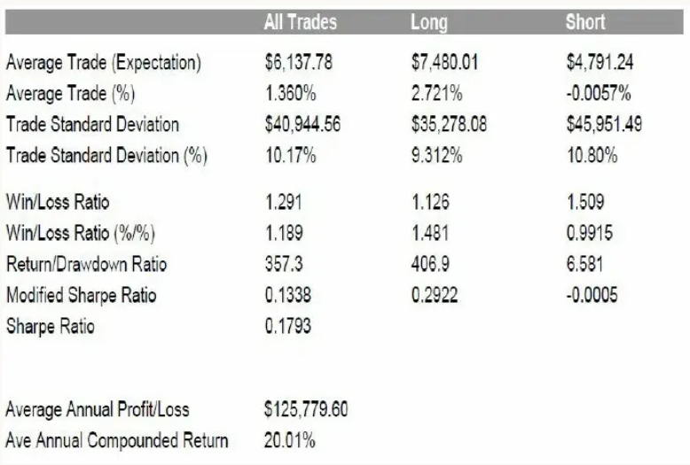

**Figure 5‑15: System report - 1980-2010 (Part II)**

Here are some additional facts that reveal that the results of the 30-year period were better than those of the 15-year period:

- The win/loss ratio is slightly higher for the 30-year period with 1.29 compared to 1.1 for the 15-year period.
- The average annual compounded growth rate is also higher from 12.91% for the simple swing trading system to 20.01% for the 30-year period with the added position sizing.

The “end-of-year” statistics indicate that the system performs really well – nearly every year is profitable. Only 6 out of 30 years ended with a negative return. So we have an 80% annual winning rate.

The average drawdown is around 12%, and it looks good at first glance. However, when we take a second, closer look we find some interesting facts: The “intra-year” drawdown, in particular, is worth mentioning and there is definitely room for improvement.

The worst drawdown was achieved on 7/7 in 1997 …nonetheless… please look at the annual table of profits for this year (see Figure 5 ‑17: Annual results - 1980-2010 (Part III) on page 100).

On the one hand, the year of 1997 was the one with the largest drawdown of 63%. On the other hand, it was also the year with the highest profit of over 100% for 1997. What a heavy ride for 1997.

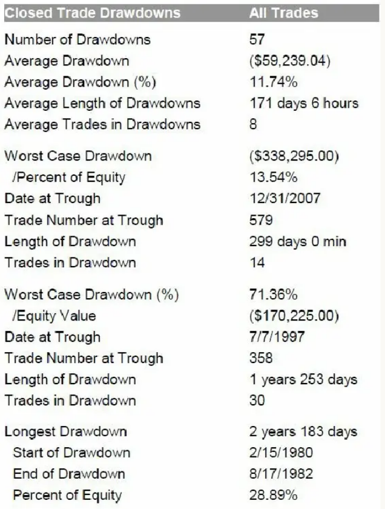

**Figure 5‑16: Intra-year drawdown**

The system presented can be used as a starting point for further optimization. There is no integrated stop-loss, profit trailing or profit-taking rule. This becomes visible in the drawdown figures. As the figures in the table demonstrate, the “intra-year” noise can lead to heavy swings. However, at the end of each year, these intra-year swings are no longer visible.

The next step would be to begin applying and optimizing trading rules. I just outlined the basic swing trading system, which is already highly accurate and profitable. This is attributable to the fact that the timing information can be decoded from the superposition energy wave with a high probability.

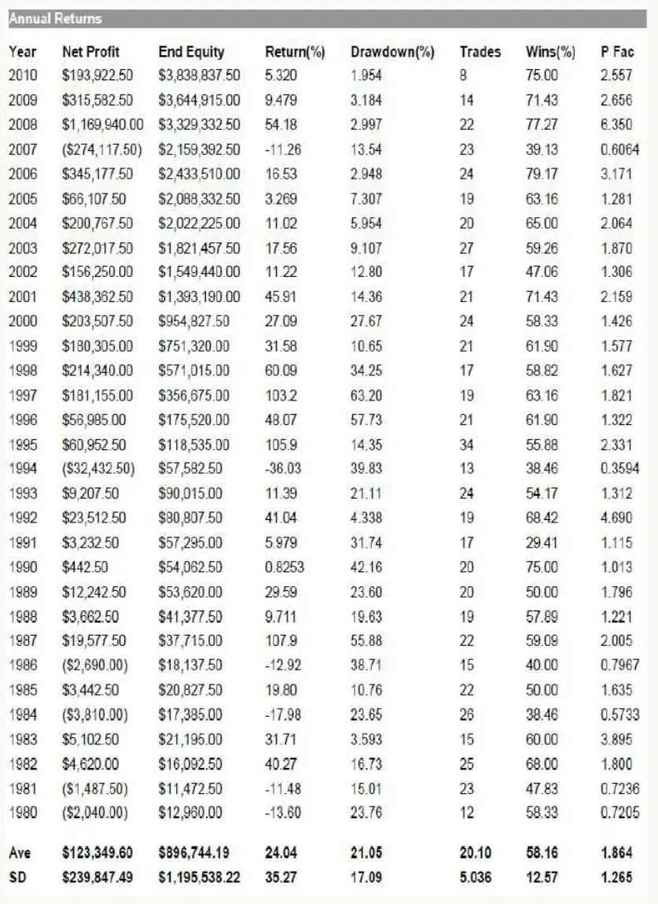

**Figure 5‑17: Annual results - 1980-2010 (Part III)**

#### 5.7 Performance Figures – Overall Summary Chart

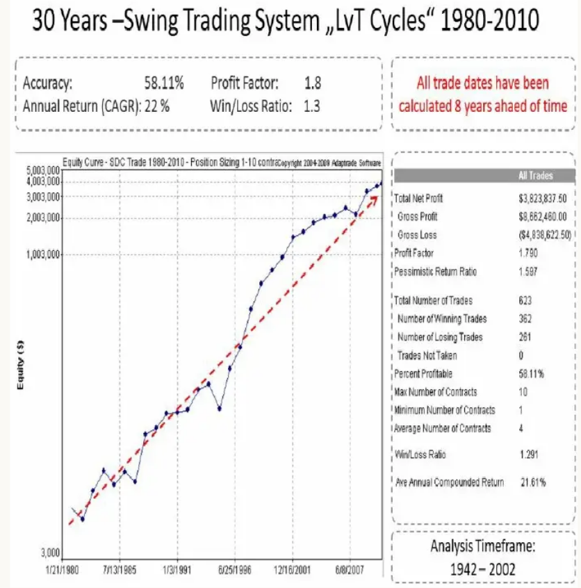

#### 5.8 Summary

We have arrived at the end of this detective story.

The story started out with the general assumption that markets are driven by emotions and that our emotions are influenced by external energy cycles from our Universe, like geomagnetic and gravitational forces. This energy “comes down to earth” in composite waves. The key to unlock the power of cycles for this theory is the recurring harmonic energy state of the most important planets that influence life on Earth: The Earth, Moon, Sun, and Universe. This repetitive pattern builds a solid backbone and the basis to start the dominant cycle analysis.

I have presented a detailed automatic approach to corroborate my theory. The results are fascinating. The equity curve presented and its characteristics perform better than most of the professional fund managers out there. The fact that there has not been any back-optimizing or curve-fitting adds even more significance to these positive results.

My primary objective was not to publish a book on a trading system. The trading system approach was only used here to test my theory. A theory can only be substantiated by a practical approach. All cycle approaches with subjective interpretation rules and which allow alternative outcomes that can only be determined after the fact cannot be judged and compared in such a way. That’s one of the negative aspects of all subjective cycle frameworks which have to be adapted to the market.

The approach presented here is a dynamic cycle approach which can decode future market turns eight years ahead of time entirely automatically. It gives you plenty of opportunities to further build on this:

- TRADE:
  Just trade it - 12 - 21% Compounded Annual Growth Rate (CAGR).
- IMPROVE:
  Add position sizing, money management, and technical indicators to improve results.
- READ:
  Re-read Gann’s novel “Tunnel Thru the Air” keeping the approach presented here in mind.
- TRANSFER:
  Transfer approach to other financial instruments like Gold, Silver, Oil, Indices.
- FINE-TUNE:
  Use the presented “Astro Filter / Master Rhythm” to fine-tune other astrology-based techniques.
- COMBINE: Combine with and/or add to other techniques.

I would love to hear about other ideas and approaches that will further expand the approach outlined here. You don’t have to be a scientist or expert in each of the presented areas. Take me as an example, I am not an expert in these areas – I just tried to connect the dots.

You can do it, too. Try it, because

> “Imagination is more important than knowledge.”
> Albert Einstein

### 6. Cycles Model: “Out-of- Sample” Results and Special Findings

This chapter was added for the second edition of this book in 2014. It includes now the results of the presented Cycles Model for the years after the initial public release. The performance figures for 2011 to 2014 are included. On top of that, additional findings will be presented that offer valuable insights into the years with negative results.

#### 6.1 Performance figures 2011-2014

We use daily data from CQG for historical open, high, low close values for the Dow Jones Index. You need to make sure that you always use high quality historical data as the system depends on reliable data of the past. We have encountered that most low-end “consumer-focused” data feeds don’t provide reliable historical values for open, high low close price data which will finally impact the performance figures. These data feeds may provide accurate current data, but don’t focus on high quality for history dated over 10 years back and more. Or examples here are based on daily data from CQG for the Dow Jones Index.

The system was purely activated with the standard settings from the menu (Wave59 Cycles Plug-In). The following steps have been executed to derive the system results:

1. First, we opened a new daily chart via the INDU.X from the IQFeed datafeed to get a valid chart with all trading days shown.

2. To ensure quality for historical data, we pasted in data from a csv file via the menu “Paste in data from file”. We use a csv file with daily open/high/low/close data from CQG. This overrides the data with the high- quality historical values we need. I recommend to everyone to ensure high- quality historical data before rebuilding these examples.

3. After we have prepared our chart with the data-source, we just activate the standard cycles superposition wave builder from the menu and activate the trading engine as shown in Figure 1.

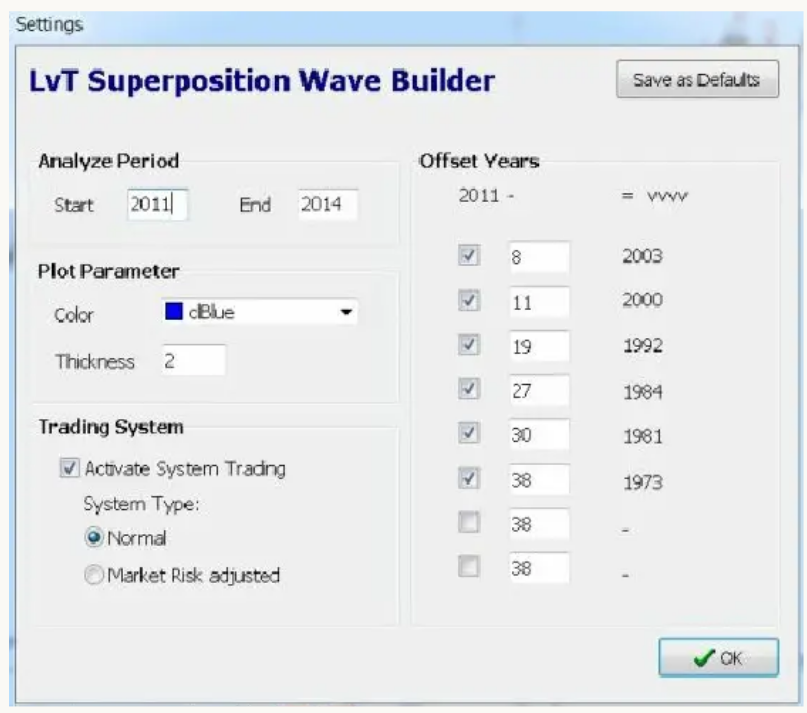

**Figure 1: Standard Indicator setting to activate system trading** (using Wave59 Cycles Plug-In)

After executing the system, we got the following system reports for 2011- 2014.

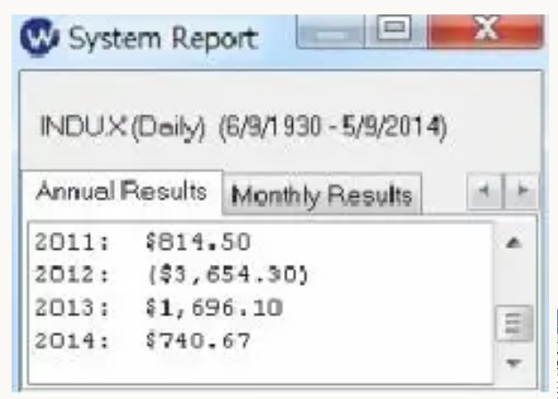

**Figure 2: Trading results of the Metonic superposition wave for 2011- 2014** (System type: normal swing trading without position sizing)

The following table shown in Figure 3 summarizes the yearly results and compares the year-end figures against the performance of the Dow Jones Index.

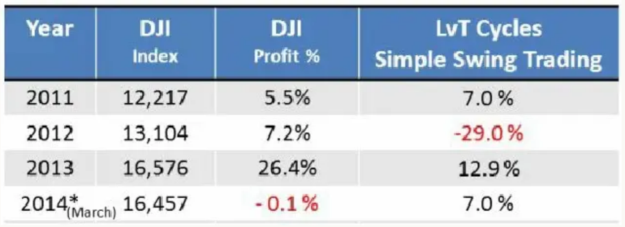

**Figure 3: Table with yearly metonic system results vs. DJI profit**

The year of 2012 pops up into our eyes based on the hugh draw-down for this year. We will analyze this situation in the next chapter in detail.

However, by now adding these new trading results to the yearly results table 1995-2010 from Figure 5‑6 Figure 5‑6: Comparison of annual results for different trading strategies (Dow, Buffet, Cycles)on page 83, we cover now a full period from 1995 up to 2014 with 19 years of performance results. And only 2 out of these 19 years have resulted in a loss. That equals a yearly win rate of 85%.

The only two loosing years have been 2007 and 2012. The year 2007 was closed with a loss of 20% and the year 2012 was closed with a loss of 29%.

Noticable is the extrem high draw-down figure for these two years. So these two years look quite exeptional regarding the performance figures. They don’t fall in the expected statistical range and parameters for the performance metrics and have a high deviation from the norm.

Once we can observe this kind of eye-catching anomaly, we should look into the matter and check the details. The following two chapters will show interesting correlations between these two years and verfiy that the supersposition wave was again on track. Lets review these two years now in detail.

#### 6.2 Deep Dive review and special findings for 2007 and 2012

Cycles are turning points in time. We cannot always ascertain what the event will be near-term. However, it is a turning point producing an event. The standard way to interpret the superposition wave plot is to derive a price high from superposition wave high. That’s how we derived our performance metrics.

However, based on the assumption that cycles represent turning points in time – lets flip the view. We stay to the fact that there should be a turn in the market given by the turns in the superposition wave. But this time, let’s assume that the energy cycles impact just turned around. So a superposition wave low should be in parallel with a market high and vice-versa.

To check this impact-flip, we can activate the wave plot as “Inverse Wave” via the Cycles menu in the WhenToTrade Charting Platform. Figure 4 highlights this additional option.

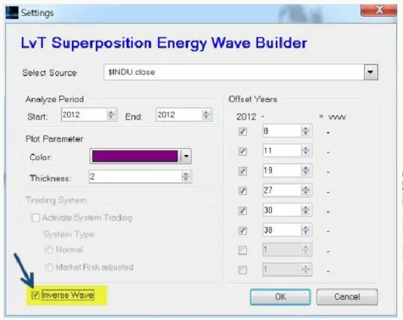

**Figure 4: Activate inverse superposition plot on chart** (WTT Charting Module)

#### 6.2.1 Inverse Superposition Wave for 2007

The next chart in Figure 5 shows the price movement for the Dow Jones Index and the inverse superposition wave plotted as indicator on the chart. The cycle lows are marked with green arrows and the cycle tops with red arrows to link them with the corresponding DJI price value at that point in time.

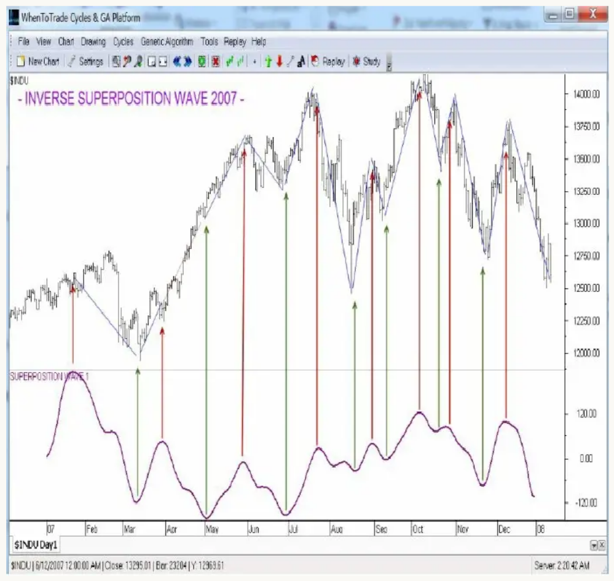

**Figure 5: DJI and inverse superposition wave plot in WTT Charting Module**

Now, interstingly, all major changes in trend (“CIT”) of the Dow Jones Index are in alginment with turns on the superposition wave. So all cycle turns correspond to major CIT events for the prive movements of the Dow Jones.

This underpins our strategy that metonic cycles predict major market turns. So the big loss of 2007 was not a result of purely aligned entry/exit signals. The energy impact just fipped 180 degrees around. This is often also named as “inversion”.

The next table in Figure 6 shows the detailed performance figures of the inverse superposition wave.

| Inverse Cycles Performance | 2007 |
| --- | --- |
| System Profit (Index Points) | 3,271.04 |
| System Profit % | 26% |
| vs. 2007 DJ Index % Profit | 6.34% |
| Winning Trades | 15 |
| Losing Trades | 6 |
| Total Trades | 21 |
| Profitability | 71% |

**Figure 6: Performance results trading the inverse superposition wave 2007**

Now, lets have a look into the other loosing year 2012 to check whether we observe a similar behaviour.

##### 6.2.2 Inverse Superposition Wave for 2012

We just repeat the steps from the chapter above and activate the inverse superposition plot within the WhenToTrade Cycles option box. Figure 7 shows the result for 2012. Again the cycle lows are marked with green and the cycle tops with red arrows to align with the price situation at the given time.

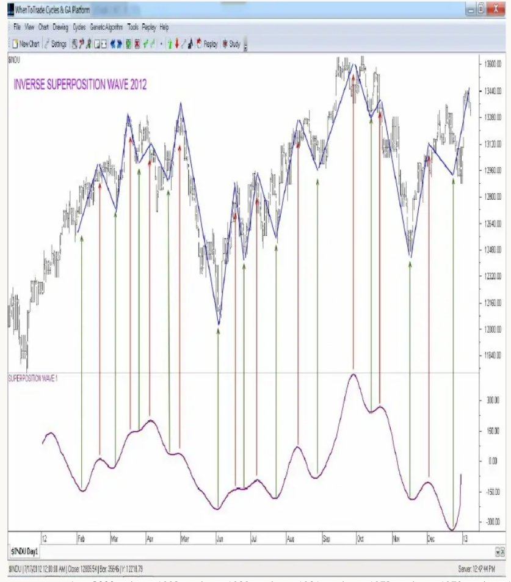

**Figure 7: DJI and inverse superposition wave plot in WTT Charting Module**

Again, the turns of the inverse wave are in alignment with the price turns of the Dow Jones index. The accuracy of the turns if over 80% for the inverse version. Using the flipped energy version results in a yearly profit of 24%.

| Inverse Cycles Performance | 2012 |
| --- | --- |
| System Profit (Index Points) | 3,000.61 |
| System Profit % | 24% |
| vs. 2012 DJ Index % Profit | 5.70% |
| Winning Trades | 13 |
| Losing Trades | 3 |
| Total Trades | 16 |
| Profitability | 81% |

**Figure 8: Performance results trading the inverse superposition wave 2012**

So again, it looks like that our metonic system gave us the correct points in time for events that we reverse the market direction. The years with the exeptional high loss shows us that there might be polarity shifts of how the energy effects the market movements. We can derive this statement as the inverse Metonic superposition wave has such a high correlation with the price movements, which could not have occurred by chance alone.

The following figure 7 shows an overlay of the inverse superposition wave on the price chart. So the x-scale of the inverse superposition wave has been adjusted to plot it as overlay on the price chart.

Please be aware: the blue line is not a moving average of price. It is composite wave forecast based on the metonic cycles – just plotted as inverse superposition wave.

It is not only suprising that the turns have been in alignment with the points in time – also the amplitude of the price movements was given 90% accurate. A forecast of time and amplitude, created 8 years ahead of time. The inverse superposition predicted also the price highs/lows correctly: A major top in mid March, followed by a major low end of June going into the high of the year expected for end September with moving to a low afterwards expected for mid November. See for yourself how this forecast of price and time was given by the inverse superposition wave plot in Figure 9.


**Figure 9: Performance results trading the inverse superposition wave 2012**

### 7. Function to compile a list with all entry/exit signals

The WTT Charting Module allows to print a detailed trade signal list based on the superposition wave plot for the future. The “Signal List” output window can be activated in the settings window.


The detailed trade signales are then showsn in table view and can be used to feed any trading system or performance analysis reporting tools.


**Figure: Included module to show all entry and exit signals with dates**

### 8. Years with a similar energy alignment

**Years with similar energy alignment of Earth, Sun, Moon & the Universe**

| Forecast / TradeYear  | Sub-Cycle 8 years | Sub-Cycle 11 years | Metonic 19 years | Sub-Cycle 27 years | Sub-Cycle 30 years | Metonic 38 years |
| --- | --- | --- | --- | --- | --- | --- |
| 2020 | 2012 | 2009 | 2001 | 1993 | 1990 | 1982 |
| 2019 | 2011 | 2008 | 2000 | 1992 | 1989 | 1981 |
| 2018 | 2010 | 2007 | 1999 | 1991 | 1988 | 1980 |
| 2017 | 2009 | 2006 | 1998 | 1990 | 1987 | 1979 |
| 2016 | 2008 | 2005 | 1997 | 1989 | 1986 | 1978 |
| 2015 | 2007 | 2004 | 1996 | 1988 | 1985 | 1977 |
| 2014 | 2006 | 2003 | 1995 | 1987 | 1984 | 1976 |
| 2013 | 2005 | 2002 | 1994 | 1986 | 1983 | 1975 |
| 2012 | 2004 | 2001 | 1993 | 1985 | 1982 | 1974 |
| 2011 | 2003 | 2000 | 1992 | 1984 | 1981 | 1973 |
| 2010 | 2002 | 1999 | 1991 | 1983 | 1980 | 1972 |
| 2009 | 2001 | 1998 | 1990 | 1982 | 1979 | 1971 |
| 2008 | 2000 | 1997 | 1989 | 1981 | 1978 | 1970 |
| 2007 | 1999 | 1996 | 1988 | 1980 | 1977 | 1969 |
| 2006 | 1998 | 1995 | 1987 | 1979 | 1976 | 1968 |
| 2005 | 1997 | 1994 | 1986 | 1978 | 1975 | 1967 |
| 2004 | 1996 | 1993 | 1985 | 1977 | 1974 | 1966 |
| 2003 | 1995 | 1992 | 1984 | 1976 | 1973 | 1965 |
| 2002 | 1994 | 1991 | 1983 | 1975 | 1972 | 1964 |
| 2001 | 1993 | 1990 | 1982 | 1974 | 1971 | 1963 |
| 2000 | 1992 | 1989 | 1981 | 1973 | 1970 | 1962 |
| 1999 | 1991 | 1988 | 1980 | 1972 | 1969 | 1961 |
| 1998 | 1990 | 1987 | 1979 | 1971 | 1968 | 1960 |
| 1997 | 1989 | 1986 | 1978 | 1970 | 1967 | 1959 |
| 1996 | 1988 | 1985 | 1977 | 1969 | 1966 | 1958 |
| 1995 | 1987 | 1984 | 1976 | 1968 | 1965 | 1957 |

**Figure 8‑1: Years with a similar energy alignment 1995 -2020**

## Section III – Recurring Daily Sentiment Patterns

### 9. Dow Time Travel – “There is nothing new under the Sun”

This chapter assesses the significance of a cyclic sentiment predictor for the Dow Jones Industrial Average Index.

To that end, and using daily data covering the period 1990–2012, we consider Metonic cycles as predictors to forecast daily sentiment 8 years ahead of time. The forecast plotted as an indicator is transformed into a mechanical trading rule whose profitability has been evaluated against the Dow Buy & Hold performance. The results suggest that trading based on recurring sentiment, which can be determined using a Metonic cycle indicator, statistically significantly outperforms the Dow in nearly all performance metrics, including net return, profitability and Sharpe ratio.

#### 9.1 Introduction and Technical Analysis Concept

In this chapter, a trading system based on a technical analysis approach is developed, which aims to identify repeating sentiment patterns. The system analyzes market behavior from the distant past to predict future market direction. The pattern used to isolate trader sentiment through technical analysis is derived from the most important ancient cycles: the Metonic cycles.[3]

The Metonic cycles are used for this sentiment research, because they represent a recurring alignment of the Sun, Moon and Earth before the stars in the sky.[4]

In fact, these three planets significantly influence life on Earth. They also cause geomagnetic disturbances and are responsible for different solar/lunar effects that affect humans’ emotional state. Since financial markets are driven solely by emotions, it seems logical that this repetitive solar/lunar pattern must also be reflected in developments on the stock market.

If we can isolate this cyclical sentiment pattern, we can analyze past stock market developments to forecast future market direction.

Using the Metonic cycles to predict future events is not new. The repetitive pattern of the Metonic cycles was already used by ancient societies to predict agricultural cycles and religious festivals. This knowledge was ‘lost’ when the Romans introduced their rigid solar calendar and no longer paid heed to lunar-related cycles.

The technical analysis approach presented here will be kept static and as simple as possible, thus ensuring that the isolated results are as clean as possible and can be directly correlated to the repetitive pattern. In addition to the three Metonic cycles, randomly generated cycles will be used in the same technical trading system. The output of the randomly selected cycles will be compared with the results of the Metonic cycles and a statistical verification will be carried out based on the expected Gaussian distribution.

The research shows that the introduced technical trading approach based on Metonic cycles considerably outperforms the stock market. Final statistical tests demonstrate that the profitability did not—with a probability of over 98%—occur by chance.

#### 9.2 Trading Hypothesis of Recurring Sentiment Patterns

Financial markets are driven by emotions. Markets swing from relative price highs to price lows in response to emotions.

The direct impact of emotions on financial markets is an ongoing controversial debate between proponents of the efficient market hypothesis and of behavioral finance. It is, however, well-established in the field of behavioral finance that psychological factors other than pure reasoning drive people’s trading and investment decisions (Shefrin, 2002). Hence, the question which forces influence our emotions is of particular relevance. Natural forces certainly play a significant role in this regard.

Life on Earth owes its existence to Earth’s magnetic field and the Sun’s energy cycles. Many effects of the Sun seem trivial, such as, for instance, the fact that changes in the conditions in different regions on Earth depend on the given season, which, in turn, is determined by the position of the Earth and Sun in the universe. In addition to the Sun’s energy, the Earth’s magnetic field is also more complex and provides a protective shield against cosmic rays.

Recent studies indicate that physically stressed human biological systems respond to fluctuations in the geomagnetic field (NOAA Space Weather Prediction Center, 2010). The notion that variations in the Sun and Earth’s magnetic field can affect the emotions of humans has global implications. A large number of studies indicate that humans respond to the variations of these geomagnetic forces. For example, numerous scientific studies have identified statistical correlations between geomagnetic indices and the occurrence of various medical conditions.[5] Empirical data indicates that a correlation exists between solar activity and the physiological state of individuals.[6] [7]

Furthermore, a study by the Federal Reserve Bank of Atlanta found strong empirical evidence that people who are more strongly affected by high geomagnetic activity may be more inclined to sell stocks because they misread their apprehension (Krivelyova, 2003).

That links exist between the Sun’s energy, geomagnetic forces, and human emotions has been scientifically verified. Figure 1 illustrates a simplified scheme.


**Figure 2: Mechanism of Sun-Moon-Earth relations and the influence on the human organism (Kolesnik, 2005 / Puetz, 2009)**

The scientific debate concerning the possibility that the position of the Sun and the Earth’s magnetosphere affect human behavior is in an early stage and is still ongoing. However, the most significant cycles that affect life on Earth are either geomagnetic or gravitational, and emerge as a result of interactions between the Sun, Moon, and Earth. These interactions influence the operation of our electrochemical nervous system which is linked to the limbic system which at the end controls our emotions. (Puetz, 2009)

The outcomes of these cycles are visible every day: The recurring 24-hour rhythm of day and night, the four seasons, and the tidal ebb and flow on the coasts. These occurrences all belong to the cyclical movement of the Sun and Moon and influence the emotions of all beings on Earth. As emotions play an important role in investment decisions, it is worth mapping these effects onto the stock market.

An abundance of literature on the influence of the Sun and Moon on financial markets is available (e.g., Merriman, 1997). As we are interested in the movements of the Sun, Earth and Moon, considering that they significantly influence our lives, we need to identify some cyclical patterns between these planets.

Here, the Metonic cycles come into play. A Metonic cycle refers to the 19- year cycle in which the Sun, Moon, and Earth return to the same relative positions (during the exact same phase of the Moon).

This 19-year cycle was first used by the Babylonians to calculate events, and remains important to this day. For example, it can be used to predict eclipses. It is also used for trajectory calculations and the launch of window analysis for lunar spacecraft missions. Furthermore, the Hebrew calendar's 19-year cycle is based on the Metonic cycle and it is used to calculate the date of Easter. Clearly, the Metonic cycle is quite impressive. If you see the Moon tonight, watch its position and phase closely, because it will not return to that exact position and phase for another 19 years.

If we know when in the past the position of the Moon, Sun, and Earth in the universe was the same, we can hypothesize that the effect on our emotions then will be the same or very similar again, i.e., we will experience the same cyclical behavior that influences our financial decision making process. With reference to financial markets, there is no need to meticulously calculate these influences on our emotions using complex geomagnetic physics. We can instead measure the past impact of these forces by looking at historical market data.

It takes 19 years (~6939 days) for a similar alignment of the Moon, Sun, and Earth to recur in the sky. The Metonic cycle is a particular approximate common multiple of the solar year and the synodic (lunar) month. There are also two sub-cycles at 11 (~4016 days) and 8 years (~2922 days).

The deduction of Metonic Cycle lengths can be taken from the following table.

**19-Year Cycle ~ 6939 calendar days**

| Cycle Type | Day Count | Multiple | Position Alignment |
| --- | --- | --- | --- |
| Solar Tropical Year | 365.24 days | 19 | = 6939.56 days |
| Lunar Tropical Month | 27.322 days | 254 | = 6939.78 days |
| Lunar Synodic Month | 29.5306 days | 235 | = 6939.69 days |

**11-Year Sub-cycle ~ 4016 calendar days**

| Cycle Type | Day Count | Multiple | Position Alignment |
| --- | --- | --- | --- |
| Solar Tropical Year | 365.24 days | 11 | = 4017.64 days |
| Lunar Tropical Month | 27.322 days | 147 | = 4016.33 days |
| Lunar Synodic Month | 29.5306 days | 136 | = 4016.16 days |

**8-Year Sub-cycle ~ 2922 calendar days**

| Cycle Type | Day Count | Multiple | Position Alignment |
| --- | --- | --- | --- |
| Solar Tropical Year | 365.24219 days | 8 | = 2921.92 days |
| Lunar Tropical Month | 27.322 days | 107 | = 2923.45 days |
| Lunar Synodic Month | 29.5306 days | 99 | = 2923.52 days |

**Table: Yearly/daily cycles with Earth, Moon & Sun position alignment in the sky**

As previously mentioned, the force of the Sun and Moon have a substantial impact on life on Earth. That is, they influence our emotions, which in turn drive markets. As everything in our universe is based on cyclical movement, our emotions follow a recurring pattern as well. Hence, this effect must also be embedded in the stock market’s movements.

This is why the three cycles of 6393, 4016 and 2922 calendar days are important for further analysis in terms of their effect on the stock market.

The next chapter introduces a technical analysis approach to evaluate these cycles and their influence on the Dow Jones Index with the development of a technical indicator and a mechanical trading concept.

#### 9.3 Technical Indicator and Trading System Construction

We have to select a financial ‘vehicle’ which we will analyze based on the Metonic “emotions” cycles. First, we need a financial vehicle that has sufficient price history. We have to go back 19 years to evaluate the present day, and if we want to analyze the daily stock market data of the last two decades, we need a publicly available, continuous price history of at least 39 years. Second, the financial vehicle that fulfills the data history requirement must also be one that attracts a large part of global attention. Because the effect we aim to analyze influences global emotions, we need a vehicle which draws a majority of global public financial attention.

The Dow Jones Industrial Index best fulfills both requirements. It has attracted the highest global media coverage for decades and is still considered the leading global stock market index. This at least still holds from the investor’s emotional point of view. The Dow Index is the most reported stock market index and is followed by individuals across the world.

Once we have selected our financial vehicle, we need to develop a technical methodology to determine the sentiment of investors which drove the stock market n-years (days) ago. To keep the research simple, we will only check whether it was an up- or a down-day. If the close of the day was higher than the opening price, we will assume that stock market investor sentiment was positive (+1). If the close of the day was lower than the opening price, we will assume that it was negative (-1). It is therefore quite simple to determine investor sentiment n-days ago. The formula to analyze investor sentiment in pseudo-code is:

```easylanguage
(a) If Close[n]-Open[n] > 0 then sentiment_value[n] = +1
(b) If Close[n]-Open[n] < 0 then sentiment_value[n] = -1
```

As we will evaluate the recurrence of three cycles (19, 11 and 8 years), we need a technical approach which builds a composite score based on the sentiment 19, 11 and 8 years ago. Hence, we will summarize the sentiment score of these three cycles. Consequently, the formula for determining today’s sentiment score in pseudo code is:

```easylanguage
(c) Composite_sentiment_value[today] = sentiment_value [6393 days ago] + sentiment_value [4016 days ago] + sentiment_value [2922 days ago]
```

Finally, we must construct a new technical indicator which oscillates between -3 to +3 and which can be plotted like any technical indicator on the price chart. As the shortest cycle is 2922 calendar days (=8 year Metonic cycle), we can calculate the composite sentiment score into the future for the next 2921 bars from today. This indicator thus plots 8 years into the future and is fully independent from current price behavior.

Since we are using calendar days, the reference back to 6939, 4016 or 2922 days may lead to days in the past for which we have no price/sentiment history, for example, weekends. We therefore need a technical approach to bridge the non-existing price on weekends. We will simply use a moving average instead of absolute open/close values. The average will bridge the weekend and offers additional benefits: Mathematically, a moving average can be viewed as a low-pass filter used in signal processing. The moving average also evens out short-term fluctuations and filters out the “noise” which may not be related to the swings of human emotions. [8]

This entails two advantages: First, instead of using the noisy raw open/close values, we can use ‘smooth’ open/close values to calculate the sentiment score for each day. This will filter out noisy and abrupt short-term influences that disrupt our original theory. Second, we obtain smooth data for weekend/holiday gaps by using the previous open/close values for calculations on those days.

We will use a ‘Zero-Lag’ Exponential Moving Average (ZLEMA), which is a variation of the EMA. The Zero-Lag EMA tries to remove the lagging characteristic of the EMA to provide better price averaging and faster response to price swings.

For a given N-day period, the pseudo code is [9]:

```easylanguage
(d) ZLEMA = EMA of (price + (price - price[lag])) with lag = (N-1) / 2
```

Applying the Zero-Lag EMA gives us smooth open and close price data for each day of the week, including weekends and holidays, and will be used to calculate the sentiment score for any given day in the past. [10]

**Trading logic based on the sentiment composite scores**

Now we have our composite indicator which oscillates between -3 and +3 and provides us with all the values for the next 2921 days. Or, alternatively, this means that today’s composite value was already known 8 years ago. Finally, we have to base our trading strategy on the calculated sentiment score. The approach will be kept simple on a straightforward cross-over rule:

- Long position: If the composite indicator moves beyond 1, we will go long the market. If the indicator moves back below 1, we exit the long position.
- Short position: If the composite indicator falls below -1, we will sell short the market. If the indicator moves back beyond -1, we will buy to cover the short trade.

Figure 3 summarizes the steps for calculating entry/exit signals: 


**Figure 3: Trade Logic for the Mechanical Metonic Sentiment Trading System**

Using this simple trading logic, we are able to establish long and short trades based on the oscillating composite sentiment indicator. As the indicator already plots 8 years into the future, all entry and exit signals are known in advance. We will therefore go long/short the day after the signal is in place at the opening price. Entry and exit signals that occur on weekends will be applied on Friday before the weekend (for exit signals) and on Monday at the open (for entry signals).

The sequence of the introduced formulas can be summarized as follows:

1. Calculating the smooth open and close price values with the Zero-Lag EMA to bridge weekends and to filter out short-term noise
2. Determining the composite sentiment score based on the sum of 6939, 4016 and 2922 calendar days back (i.e., an up- or down-day)
3. Applying the cross-over logic to go long/short if the composite score moves beyond/below 1 for long positions and below/beyond -1 for short positions.

The “Metonic Sentiment Index” as a technical indicator with integrated trade color-code logic applied to the chart is shown in Figure 4.


**Figure 4: Indicator “Metonic Sentiment Index” which plots up to 8 years into the future**

To keep the trading logic as closely to the introduced sentiment cycles as possible, no additional restrictions are added to, for example, integrate the current technical market conditions or position management.

Finally, the introduced system is a purely static system which cannot be curve-fitted or backward-optimized to past market behavior. The only variable parameter is the period for the Zero-Lag EMA (used with a length of 13 as the standard setting for most indicators). Hence, we will have to apply a statistical robustness test to check whether the selected period has an influence on the system results or not. This will be done in the final statistical section of this paper.

The EasyLanguage Script code for this Indicator and Trade Strategy is included in Chapter 10.

#### 9.4 Mechanical Trading System Performance Review & Equity Curve

To validate the trading system, we have to use market data from at least two big market phases. We will use the period from 1990 to today to verify the trading logic. Using this period for our analysis, we will have a range of over 20 years with a static system rule set, which includes 8381 bars of data. The strategy is applied to the calendar day Dow Jones Index [11]. As the system starts trading in 1990, we have to apply data for at least 19 years prior to that start date to ensure that the calculation is correct. Hence, the system under review covers a data period of 41 years.

As the Dow Jones Industrial Average is our benchmark, we compare the system results with the performance of the Dow (Buy & Hold strategy). If the hypothesis of recurring sentiment patterns has any value, the Metonic logic must outperform the Dow performance.

The following table shows the system evaluation and key performance metrics of the Metonic trading logic compared with the Dow Jones Buy & Hold strategy for the trading period 1990-2012

| | System Parameter | Metonic Logic | Dow Buy & Hold |
| --- | --- | --- | --- |
| 1 | Total Profit [Index Points] | 14,659 | 10,418 |
| 2 | Profit Factor | 1.39 | - |
| 3 | % Profitable | 56.26% | - |
| 4 | Positive Years | 17 | 17 |
| 5 | Negative Years | 6 | 6 |
| 6 | % Win Years | 74% | 74% |
| 7 | Average Annual Return | 9.14% | 8.14% |
| 8 | Annual Return Std. Deviation | 14.41% | 15.43% |
| 9 | Sharpe Ratio (vs. 1% RiskFree return rate) | 0.565 | 0.463 |
| 10 | Annualized Return (CAGR) | 8.27% | 6.97% |
| 11 | Max. DrawDown | (5,665) | (7,728) |
| 12 | Max. DrawDown Date | 11/21/2008 | 3/6/2009 |
| 13 | Max. Time Between Equity Profit Peaks | 925 d / 2.5 y | 2454 d / 6,7 y |
| 14 | Total # Trades | 615 | 1 |
| 15 | Avg. # Trades per Year / Month | 27.2/y - 2.3/m | - |
| 16 | Avg. Time in Trades | 6d | - |
| 17 | Avg. Time Between Trades | 8d | - |
| 18 | Longest Flat Period | 49 d | 0d |
| 19 | Avg. Trade Net Profit [Index Points] | 24 | - |
| 20 | Avg. Winning Trade [Index Points] | 150 | - |
| 21 | Avg. Losing Trade [Index Points] | (139) | - |
| 22 | Win: Loss Ratio | 1.08 | - |

**Figure 5: System evaluation and key performance metrics of the Metonic trading logic compared with the Dow Jones Buy & Hold strategy for the trading period 1990-2012**

The system statistics show that the Metonic logic outperforms the Buy & Hold strategy in all performance metrics. With an average of 27 trades/year and an average time in trade of about 6 days, the system features ideal characteristics for a swing trading strategy. The profitability of 56% and the profit factor of 1.4 with an annualized return rate of 8.2% make it a very reliable, robust, consistent and profitable trading system. Despite the fact that the annualized return is higher than the Dow Index, the Sharpe ratio is still higher. We thus get a higher return with lower risk in comparison with the Dow Buy & Hold strategy—which is not what you would expect. Usually, the risk metrics increase when choosing higher return ratios.

In addition to the pure system metrics, an equity curve also holds important information about a “robust” system which is required for a conservative trading approach.


**Figure 6: Equity curve Metonic logic & Dow Jones Industrial Average (1990-2012)**

The equity is set to log-scale as we observe a period of >20 years of daily data. This implies that a straight line equity curve represents a constant daily return percentage.

As can be seen, the Metonic equity closely follows the dotted straight line and therefore has a uniform daily growth rate. It even follows the straight line more closely than the Dow itself.

So by trading the Dow based on past Metonic cycles, we obtain a smooth and constant upward sloping equity curve—a near theoretical ideal constant upward sloping equity line. It took the Dow over 6 years from the equity top in 2000 to recover to a new high. In comparison, the Metonic system grew at a steady rate, even during the negative and flat periods between 2000 and 2006. This is also shown by the metric (13) “max. peak-to-peak distance”. We can therefore conclude that the Metonic equity curve comes close to an ideal equity curve measured by a straight line fit.

#### 9.5 Annual Metonic System Profit vs. Annual Dow Index Profit

The following table shows the yearly performance results in summary. The Metonic System shows higher profit while in parallel providing lower risk and better yearly draw-down figures compared to the original Dow performance.

| Year | DOW Profit | % Gain | Metonic Profit | % Gain | Factor Profit | # Trades | % Wins |
| --- | --- | --- | --- | --- | --- | --- | --- |
| 2012 | 953 | 7.76% | (245) | -1.38% | 0.89 | 28 | 46.43% |
| 2011 | 640 | 5.50% | 671 | 3.93% | 1.24 | 27 | 59.26% |
| 2010 | 1,150 | 10.96% | 613 | 3.73% | 1.26 | 30 | 56.67% |
| 2009 | 1,652 | 18.70% | 1,698 | 11.51% | 1.91 | 26 | 57.69% |
| 2008 | (4,488) | -33.69% | (3,074) | -17.24% | 0.49 | 26 | 53.85% |
| 2007 | 802 | 6.40% | 2,542 | 16.63% | 2.46 | 30 | 66.67% |
| 2006 | 1,746 | 16.20% | 1,093 | 7.70% | 2.64 | 24 | 70.83% |
| 2005 | (66) | -0.60% | 846 | 6.34% | 1.96 | 30 | 60.00% |
| 2004 | 329 | 3.13% | 156 | 1.18% | 1.11 | 25 | 48.00% |
| 2003 | 2,112 | 25.15% | 1,422 | 12.09% | 1.93 | 30 | 53.33% |
| 2002 | (1,680) | -16.67% | (582) | -4.71% | 0.86 | 28 | 42.86% |
| 2001 | (767) | -7.07% | 3,673 | 42.34% | 3.86 | 29 | 65.52% |
| 2000 | (709) | -6.14% | 2,467 | 39.73% | 3.11 | 29 | 68.97% |
| 1999 | 2,316 | 25.07% | 604 | 10.77% | 1.23 | 28 | 50.00% |
| 1998 | 1,273 | 15.98% | 34 | 0.61% | 1.01 | 26 | 61.54% |
| 1997 | 1,460 | 22.44% | 1,343 | 31.75% | 2.61 | 23 | 52.17% |
| 1996 | 1,331 | 25.73% | 786 | 22.83% | 2.57 | 26 | 65.38% |
| 1995 | 1,283 | 32.96% | (34) | -0.98% | 0.95 | 27 | 44.44% |
| 1994 | 80 | 2.11% | (279) | -7.43% | 0.64 | 29 | 44.83% |
| 1993 | 453 | 13.49% | 198 | 5.56% | 1.77 | 24 | 45.83% |
| 1992 | 132 | 4.10% | 380 | 11.96% | 2.39 | 25 | 64.00% |
| 1991 | 535 | 19.89% | (62) | -1.92% | 0.92 | 30 | 56.67% |
| 1990 | (119) | -4.24% | 430 | 15.32% | 2.17 | 26 | 65.38% |
| Profit | 10,418 | | 14,680 | | Avg. Trades | 27.21 | |

| | DOW | Metonic |
| --- | --- | --- |
| Avg. Return/y | 8.14% | 9.14% |
| Deviation | 15.43% | 14.41% |
| Risk Save Return | 1.00% | 1.00% |
| Sharpe Ratio | 0.46 | 0.57 |
| Years | 23 | 23 |
| Start Equity | 2810 | 2810 |
| End Equity | $13,227 | $17,489 |
| CAGR | 6.97% | 8.27% |

#### 9.6 Statistical Test & System Validation

***a) Robustness test for the selected moving average function and parameters***

We must ensure that the system results are not sensitive to the chosen moving average function and to the standard length setting of 13 for the calculation of the Zero-Lag EMA. The derived system results should be robust. This means that they should not deviate significantly if we use different settings for the ZLEMA period.

| ZL EMA length | Net Profit | Profitability [% Wins] | Profit Factor |
| --- | --- | --- | --- |
| 11 | 13,510 | 56.3 | 1.32 |
| 12 | 13,061 | 56.0 | 1.35 |
| 13 | 14,659 | 56.3 | 1.39 |
| 14 | 13,830 | 55.4 | 1.38 |
| 15 | 10,711 | 53.6 | 1.28 |
| Average | 13,154 | 55.5 | 1.3 |
| Std. Deviation | 1,486 | 1.1 | 0.04 |
| Rel. Std. Deviation | 11 % | 2% | 3% |

**Figure 7: System performance results for different ZL EMA length settings**

The system performance metrics remain stable with a relative standard deviation of only 2-3%. The absolute net profit also has a small relative standard deviation of 11%, which is small if we take into account that it covers a period of 22 years.

The results show that the system results are not sensitive to the chosen standard setting of 13 for the ZLEMA length setting.

In addition, we will check the same system with a completely different moving average calculation, the TradeStation built-in Adaptive Moving Average[12].

The same strategy was applied. Instead of using ZLEMA for the calculation, the AdaptiveMovAvg function was used. Two lines have been modified to generate system statistics:

| AdaptiveMovAvg EffRatio Length (ama1) | AdaptiveMovAvg SlowAvg Length (ama3) | Net Profit | Profitability [%Wins] | Profit Factor |
| --- | --- | --- | --- | --- |
| 4 | 9 | 12,908.32 | 55.12 | 1.33 |
| 4 | 10 | 13,634.62 | 55.52 | 1.35 |
| 4 | 11 | 14,571.21 | 55.78 | 1.39 |
| 4 | 12 | 15,430.12 | 55.97 | 1.42 |
| 4 | 13 | 15,746.11 | 55.96 | 1.43 |
| 5 | 9 | 10,023.63 | 54.62 | 1.27 |
| 5 | 10 | 10,290.52 | 54.62 | 1.27 |
| 5 | 11 | 10,160.52 | 54.28 | 1.27 |
| 5 | 12 | 8,308.32 | 54.39 | 1.21 |
| 5 | 13 | 8,216.41 | 53.63 | 1.21 |
| 6 | 9 | 10,005.00 | 52.70 | 1.28 |
| 6 | 10 | 8,444.20 | 53.13 | 1.23 |
| 6 | 11 | 10,611.10 | 53.40 | 1.30 |
| 6 | 12 | 10,711.50 | 53.32 | 1.30 |
| 6 | 13 | 9,620.00 | 53.32 | 1.27 |

| | Net Profit | Profitability [%Wins] | Profit Factor |
| --- | --- | --- | --- |
| Average | 11,245.44 | 54.38 | 1.30 |
| Std. Deviation | 2,555.11 | 1.11 | 0.07 |
| Relative Std. Deviation | 23% | 2% | 5% |

**Figure 8: System performance results for different Adaptive Moving Average settings**

Original Script:

```easylanguage
// Calculate smoothed open/close values to bridge weekends & holidays
ac = ZLEMA(close, len)
 ao = ZLEMA(open, len);
```

was replaced with:

```easylanguage
ac = AdaptiveMovAvg( close, ama1, 2, ama3 );
ao = AdaptiveMovAvg( open, ama1, 2, ama3 );
```

with [ama1] and [ama3] parameter runs using different settings as shown in the table above.

The results for the performance metrics using the adaptive average function are: Ø11,245 Profit, Ø54.3 %Wins and Ø1.3 Profit Factor.

With a relative standard deviation for these performance metrics of 2 - 5%, they fall exactly within the range of the results derived with the ZLEMA calculation.

Based on these results, our system neither depends on the chosen moving average approach nor on the parameter settings. No subjective parameters remain which can be subject to curve-fitting or backward optimization. The only parameters are the trading logic derived from static Metonic cycles which can be explained by natural law.

**b) Statistical verification and significance test of performance metrics caused by chance**

Now we have to verify whether the observed superior trade system metrics are attributable to the Metonic cycles selected or whether we were just lucky. The simulation presented here tests the null hypothesis that the predicted long/short/neutral positions generated by the Metonic cycles strategy are random. The alternative research hypothesis is that the Metonic logic is so advanced that it can predict positions in such a way to produce superior trading system results.

This test is performed by generating a large number of system result samples (n=10,000), produced by using the same strategy applied during the same period. But instead of using the three previously used Metonic cycle lengths, we will use three randomly generated cycle lengths for each test. Using random cycle lengths instead of raw random trades to generate the strategy also has the benefit that similar trade distribution characteristics in the test collection are compared with our Metonic logic.

Because of the central limit theorem, the performance metrics derived from the test collection should be normally distributed, very similar to a system with random trade characteristics. If a normal distribution for the system result metrics can be confirmed, we can apply a statistical test to reject the null hypothesis. Thereby, we can determine whether the z-score and p-value of the result are attributable to chance.

Our test will control the trade performance characteristics of net profit, profitability, and profit factor.

We compute these three performance statistics of each system generated by random cycles and find the fraction of the collection whose performance metric equals or exceeds that of the Metonic cycles. This fraction is the probability that the supposedly superior performance of the Metonic model could have been obtained by nothing more than mere luck. If we find that this chance probability or p-value[13] is lower than a significance level of 1% (alpha=0.01), we can reject the null hypothesis. The results are shown in Figure 9 chart 1-3:

**Figure 9 | Chart 1-3: Performance range distribution of test collection with random cycle lengths (n=10,001) plotted as the count of observed systems vs. expected Gaussian distribution (with z- & p-values for the Metonic candidate)**

Chart 1:


Chart 2:


Chart 3:


The match between the plotted observed performance ranges (red) and the expected Gaussian distribution (blue line) proves that the chosen approach is valid. And with p-values of 0.084% (profitability), 0.212% (net profit) and 0.149% (profit factor) being far below the significance level of 1%, we can reject the null hypothesis. This confirms our hypothesis that the usage of recurring Metonic Dow sentiment cycles leads to statistically significant superior than random Dow trade system performance results.

More details of the test collection are made available in the electronic supplement described in Chapter 9.9: “Electronic Supplement”.

**c) Cross-validation with significance test to select cycles by chance with a realistic and reliable system**

As shown, the chance probability of selecting a trading system with 3 cycles, which performs similar or better than the Metonic cycles combination lies far below the significance level of 1%. However, as the derived performance metrics for the Metonic cycles are already very high, we need another form of evidence to cross-validate the chance probability.

In this test, we will lower the cut-off values that have to be achieved for each performance metric of the samples from our test collection to be qualified as a valid trading system. We will define a set of criteria which defines the minimum requirements for a reliable and profitable trading system. The conservative minimum levels used here are based on the fact that every investor will only accept a trading system which has:

A) at least positive performance metrics,
B) delivers a smooth and linear upward sloping equity curve, and
C) performs at least similar or better than the benchmark index in total equity return.

To derive a mathematical metric to measure the requirement (B) for a smooth and upward sloping equity curve, we will add another performance metric:

The Pearson product-moment correlation coefficient for the generated equity curve of the sample compared to the ideal linear upward sloping equity curve with the equity top set to the last bar. In mathematical terms, a smooth and near-linear upward sloping equity curve can be defined via a correlation coefficient higher than 0.6 between the observed and the ideal linear equity curve.

**Calculation of Correlation Coefficients for Equity Curve**

The figure below illustrates how the ideal equity between the observed and “ideal” equity is constructed: It is a linear upward sloping line from zero to the maximum equity from the observed test system at the end of the period.


**Figure: Correlation Coefficients Calculation**

Instead of simply using the overall Pearson correlation coefficient, we divide the period into three segments of the same length. We calculate a separate correlation coefficient for each segment while using part of the ideal and the observed system. We use this approach because the overall correlation could be misinterpreted. The shown example has an overall correlation coefficient of 0.93, which suggests a solid correlation and ideal equity curve for the test system. However, if you take a closer look at the first 7 years, the test system only realized losses and dropped below zero. No one would accept systems that generate constant losses over a period of 7 years. The segmented correlation scores reveal this effect with a negative coefficient of -0.71 for this period. So instead of simply measuring a cut-off level against the overall Pearson correlation, we measure the minimum cut-off level against all segments. This reflects reality more closely as we aim for systems which generate a constant upward sloping equity in each segment of approx. 7.2 years. As a result, even if the performance figures of the randomly selected cycles look good or better than the Metonic candidate, this system fails to meet our minimum requirements outlined in the statistics section, and is not part of the 147 systems.

**Complete Set of Metrics**

The set of metrics, which represents the minimum requirement to qualify as a reliable and realistic opportunity to be selected as a trading system in the real world, are shown in Figure 10.

| Set of criteria | # | Metric | Minimum level required | Description for minimum level to qualify as “realistic trading system” |
| --- | --- | --- | --- | --- |
| Set (A) at least positive performance metrics | 1 | Profitability [% Wins] | > 51 % | Only systems where % winning trades is higher than % losing trades |
| *the same* | 2 | Profit factor |  > 1.1 |  The gross profit has to be higher than the gross loss / Only positive net returns |
| Set (B) smooth & linear up-sloping equity curve | 3 | Pearson correlation to ideallinear equity curve [14] | > 0.6 | Only medium or higher correlation between the observed and theoretical idea linear equity curve (smooth equity curve) |
| Set (C) performs better than the benchmark | 4 | Net profit | > 10,000 | At least the same or higher total profit than the Dow Buy & Hold strategy in the period under review |
| *the same* | 5 | Allowed max. peak-to-peak equity pause | < 2400 days | The maximal pause measured in day between new equity peaks should be at least the same or lower than the Dow in the period under review |

**Figure 10: Minimum set of performance metric requirements**

If we apply this set of minimum requirements to our sample test collection, we obtain a total count of 147 systems, which means that only 1.47 % of all generated cycle combinations qualify as “valid” trading system options which perform at least positive with a similar or better outcome than the benchmark (147 out of 10,001). The Metonic cycle combination is one of these 147 systems.[15]

In statistical terms, the chance probability of selecting a cycle combination for our trading logic that leads to at least positive performance metrics and similar absolute net profits as the Dow is 1.47 %.

#### 9.7 Review: 2013 out-of-sample results

In addition to the statistical verification, we can already present out-of- sample system results. The chapter “Dow Time Travel” was originally prepared as article in 2012 for the 2013 MTA Dow Award submission.

Now, as 2013 represents a documented out-of-sample period in relation to the original work, the judgment of the model in its predictive ability will become even more important for reflecting the behavior in real time.

Given the pervasive assumption that in-sample predictive ability fails to translate into out-of-sample predictive ability, many researchers consider out- of-sample performance as the “ultimate test of a forecasting model.” [16]

Hence, the “ultimate test” for the Dow Award submission from 2013 is now available.

| System parameter | Metonic Logic (2013 - oos period) | Avg. Metonic Logic (1990-2012) |
| --- | --- | --- |
| Profit factor | 3.25 | 1.39 |
| % Profitable | 63.33 % | 56.26 % |
| # trades (average) | 30 | 27.2 |
| Annual return (average) | + 17.7 % | + 9.14 % |

**Table: Historical average performance vs. out-of-sample performance for 2013**

As expected, the performance metrics described above are robust. Of the twelve months for 2013, eleven were profitable. The Dow Index tended to increase throughout 2013; however, even the “short-only” part of the strategy (in which 16 of 30 trades were considered) was shown to be profitable on its own.

The Metonic sentiment strategy forecasted the trades for the full course of 2013 before the fact as it was already submitted in January 2013. Therefore, these results represent the out-of-sample period of the original work.

Moreover, the constant up sloping equity curve in 2013 indicates that the predicted trades could not have been randomly chosen.

**2013 Equity Curve** *Equity is measured in DJIA Index Points, not USD [$]. Period 01/01/2013 – 12/27/2013*


**Graph: Equity$^1$ curve for the 2013 out-of-sample period** *($^1$Equity: measured in DOW index points)*

The formula from my original submission projected 30 trades over the course of 2013 on the basis of a sentiment predictor that considered pre-2006 data. Hence, all trades were predicted long ago and are independent from current price behavior. Therefore, the out-of-sample results reinforce the importance of the non-linear Metonic approach in performing technical analysis.

Only the main title has changed for this book. Additional tables and content was added to show more details. The original article and formula from 2012 remains unchanged.

#### 9.8 Summary and Conclusion

This chapter has introduced a trading concept for recurring patterns based on Metonic cycles. An overview of these cycles and their influence on our emotional state has been provided. This factor was incorporated into a technical indicator and trading strategy. The verification approach demonstrates that the derived performance metrics differ statistically significant from metrics which we would expect from randomly selected cycles. To that end, the probability of selecting a profitable cycle sequence by chance is only 1.47%. In addition, the chance probability of selecting a trading system as profitable as the Metonic logic is only 0.212%. To conclude, we can claim with 98.53% confidence that the Metonic cycles have an impact on the movements of the Dow Index and that the trade dates could not have been picked based on pure luck alone.

Furthermore, the out-of-sample results for 2013 underpin the statistical verification within the expected performance metrics after making the system public to the MTA.

The presented trading algorithm is solely based on the Metonic pattern. The next step could be adding classic money management, exit strategies and traditional indicators to improve system performance. I will leave this task open to the reader, as the basic concept already provides an edge of its own.

Another way of using these research results is to take the same approach to derive new indicators based on the recurring Metonic pattern. Instead of simply identifying up- or down-days, it makes sense to use different indicators from the distant past (e.g., momentum) to derive stock market predictors.[17]

In today’s world, computer power and available historical market data offers the opportunity to apply this approach and to develop non-linear, predictive indicators based on recurring patterns.

Finally, to come back to the quote on the first page of this book taken from the finance bestseller:

> Professor Burton Malkiel
> “The past history of stock prices cannot be used to predict the future in any meaningful way. Technical strategies are usually amusing but of no real value. A simple policy of buying and holding will be at least as good as any technical procedure.”
>
> “A Random Walk Down Wall Street” 2011, 10th Edition, page 161

We not only proved that you can beat the Buy & Hold strategy with technical analysis, we did it by predicting the trades for the next 8 years in advance based on technical analysis with a simple crossover logic. Let’s close this chapter with a quote from W.D. Gann.

> W.D. GANN
> “History repeats itself. In order to know and predict the future of anything you only have to look up what has happened in the past and get a correct base or starting point.”
>
> TUNNEL THRU THE AIR, 1927, Chapter VII: Future Cycles, Page 75ff

#### 9.9 Electronic Supplement - Download Link

Detailed performance and statistical data for all random generated cycle sets is made available via the electronic supplement. All data is put into an Excel spreadsheet for further reference. The file is available and labeled “MetonicCycles_Statistical_Datasets.xlsx”.

[whentotrade.com/DowTimeTravelSheet](http://whentotrade.com/DowTimeTravelSheet/)

The following sheets are included in the Excel file:

- **Worksheet “TestCollection_RandomCycleSets”** All 10,000 randomly generated cycle sets that are used for the statistical test.
- **Worksheet “Test collection results”** For each random cycle set, the Metonic system was executed with the included TradeStation Strategy. The performance results of the TradeStation performance log are stored for each cycle set.
- **Worksheet “Stats”** Based on the system performance results of each cycle set, systems are counted within similar performance metrics ranges to build the distribution charts.
- **Worksheet “Graphs”** Show the graphical plot of the performance ranges count as distribution charts with the expected Gaussian distribution curve vs. the observed counts per range.
- **Worksheet “EquityCurves”** Plot of the Dow Jones “Buy & Hold” and the Metonic System Equity curves based on daily data.
- **Worksheet “SystemPerformanceMetrics”** Summary & extract of the TradeStation performance report for the Metonic cycle set.
- **Worksheet “Yearly results”** Extract of the TradeStation performance report for the Metonic cycles in comparison to the Dow Index data on a yearly basis.
- **Worksheet “MinReqSystem_Filter_147”** Show the settings for the filter logic to count the number of profitable, robust systems within the total count of 10,001 generated systems. See explanation in the related chapter.

#### 9.10 Addendum

##### 9.10.1 Evidence for original submission and out-of-sample period

This chapter was prepared in 2012 for the MTA Dow Award submission of 2013. The article & indicator as published in this book was originally submitted for the Dow Award on Jan. 7th 2013.


**Figure: Proof for MTA submission, original work is time-stamped by MTA**

##### 9.10.2 TradeStation Performance Summary for Strategy (1990-2012)

| | All Trades | Long Trades | Short Trades |
| --- | --- | --- | --- |
| Total Net Profit | $14,659.40 | $12,826.80 | $1,832.60 |
| Gross Profit | $51,789.30 | $31,819.60 | $19,969.70 |
| Gross Loss | ($37,129.90) | ($18,992.80) | ($18,137.10) |
| Profit Factor | 1.39 | 1.68 | 1.1 |
| | | | |
| Total Number of Trades | 615 | 344 | 271 |
| Percent Profitable | 56.26% | 64.24% | 46.13% |
| Winning Trades | 346 | 221 | 125 |
| Losing Trades | 268 | 122 | 146 |
| Even Trades | 1 | 1 | 0 |
| | | | |
| Avg. Trade Net Profit | $23.84 | $37.29 | $6.76 |
| Avg. Winning Trade | $149.68 | $143.98 | $159.76 |
| Avg. Losing Trade | ($138.54) | ($155.68) | ($124.23) |
| Ratio Avg. Win:Avg. Loss | 1.08 | 0.92 | 1.29 |
| Largest Winning Trade | $1,034.10 | $1,034.10 | $914.20 |
| Largest Losing Trade | ($1,702.40) | ($1,702.40) | ($712.20) |
| Largest Winner as % of Gross Profit | 2.00% | 3.25% | 4.58% |
| Largest Loser as % of Gross Loss | 4.58% | 8.96% | 3.93% |
| | | | |
| Max. Drawdown (Intra-day Peak to Valley) | | | |
| Value | ($5,664.80) | ($5,646.60) | ($2,604.00) |
| Date | 11/21/2008 16:00 | | |
| as % of Initial Capital | 201.59% | 200.95% | 92.67% |
| Net Profit as % of Drawdown | 258.78% | 227.16% | 70.38% |
| | | | |
| Max. Drawdown (Trade Close to Trade Close) | | | |
| Value | ($4,938.10) | ($4,505.00) | ($2,456.10) |
| Date | 11/6/2008 16:00 | | |
| as % of Initial Capital | 175.73% | 160.32% | 87.41% |
| Net Profit as % of Drawdown | 296.86% | 284.72% | 74.61% |
| | | | |
| Max. Trade Drawdown | ($1,702.40) | ($1,702.40) | ($1,332.00) |

*System period: 01/01/1990 - Last Bar: 12/13/2012*
*Chart type: Calendar Days / Weekend/Holidays are filled with OHLC bars of last day*
*Data provider: CQG*
*EasyLanguage Strategy Name: LvT_Metonic_Strategy*

##### 9.10.3 TradeStation Performance Summary for Strategy (out-of-sample)

**TradeStation Performance Summary** (01. January 2013 – 31. December 2013)
*all performance metrics measured in DJIA Index points*

| | All Trades | Long Trades | Short Trades |
| --- | --- | --- | --- |
| Total Net Profit | 2.327,10 | 1.593,70 | 733,40 |
| Gross Profit | 3.363,40 | 2.128,00 | 1.235,40 |
| Gross Loss | -1.036,30 | -534,30 | -502,00 |
| Profit Factor | 3,25 | 3,98 | 2,46 |
| | | | |
| Total Number of Trades | 30 | 14 | 16 |
| Percent Profitable | 63,33% | 64,29% | 62,50% |
| Winning Trades | 19 | 9 | 10 |
| Losing Trades | 11 | 5 | 6 |
| | | | |
| Avg. Trade Net Profit | 77,57 | 113,84 | 45,84 |
| Avg. Winning Trade | 177,02 | 236,44 | 123,54 |
| Avg. Losing Trade | -94,21 | -106,86 | -83,67 |
| Ratio Avg. Win:Avg. Loss | 1,88 | 2,21 | 1,48 |
| | | | |
| Max. Consecutive Winning Trades | 4 | 3 | 5 |
| Max. Consecutive Losing Trades | 2 | 2 | 2 |
| Avg. Bars in Total Trades | 5,93 | 7 | 5 |
| Avg. Bars in Winning Trades | 5,89 | 7,33 | 4,6 |
| Avg. Bars in Losing Trades | 6 | 6,4 | 5,67 |
| Avg. Bars in Even Trades | 0 | 0 | 0 |
| | | | |
| Max. Shares/Contracts Held | 1 | 1 | 1 |
| Total Shares/Contracts Held | 30 | 14 | 16 |
| Account Size Required | 339,20 | 392,50 | 305,60 |
| Total Slippage | 0,00 | 0,00 | 0,00 |
| Total Commission | 0,00 | 0,00 | 0,00 |
| | | | |
| Max. Trade Drawdown | -366,30 | -366,30 | -287,50 |

*Created by TradeStation: 28.12.2013 20:17:07, Copyright (c) 1991-2004 TradeStation Technologies, Inc.*

**Tradestation Parameter Setup**
*TradeStation Strategies Applied:LvT Metonic Strategy(On)*
*TradeStation Strategy Inputs: LvT Metonic Strategy - len 13*
*LvT Metonic Strategy - c1 6939*
*LvT Metonic Strategy - c2 4016*
*LvT Metonic Strategy - c3 2922*
*TradeStation Chart Data:DJIA daily bars*
*Weekends/holidays filled with OHLC of last trading day*
*ASCII file with data, see CD folder: Supplements/DowData*

##### 9.10.4 TradeStation 2013 trade-by-trade list (out-of-sample)

| # | Type | Date/Time | DJIA | Trade Result [DJIA Index Points] | Total Profit |
| --- | --- | --- | --- | --- | --- |
| 1 | Buy | 04.02.2013 | 14.009,70 | | |
| | Sell | 15.02.2013 | 13.981,70 | -28,00 | -28,00 |
| 2 | Sell Short | 18.02.2013 | 13.973,30 | | |
| | Buy to Cover | 22.02.2013 | 13.880,60 | 92,70 | 64,70 |
| 3 | Buy | 04.03.2013 | 14.089,60 | | |
| | Sell | 12.03.2013 | 14.447,20 | 357,60 | 422,30 |
| 4 | Sell Short | 25.03.2013 | 14.512,00 | | |
| | Buy to Cover | 05.04.2013 | 14.565,20 | -53,20 | 369,10 |
| 5 | Buy | 08.04.2013 | 14.565,20 | | |
| | Sell | 10.04.2013 | 14.673,40 | 108,20 | 477,30 |
| 6 | Sell Short | 11.04.2013 | 14.802,20 | | |
| | Buy to Cover | 23.04.2013 | 14.567,10 | 235,10 | 712,40 |
| 7 | Sell Short | 29.04.2013 | 14.712,50 | | |
| | Buy to Cover | 30.04.2013 | 14.818,70 | -106,20 | 606,20 |
| 8 | Buy | 01.05.2013 | 14.839,80 | | |
| | Sell | 03.05.2013 | 14.973,90 | 134,10 | 740,30 |
| 9 | Sell Short | 13.05.2013 | 15.113,40 | | |
| | Buy to Cover | 14.05.2013 | 15.092,10 | 21,30 | 761,60 |
| 10 | Buy | 20.05.2013 | 15.348,30 | | |
| | Sell | 24.05.2013 | 15.303,10 | -45,20 | 716,40 |
| 11 | Sell Short | 27.05.2013 | 15.290,70 | | |
| | Buy to Cover | 29.05.2013 | 15.399,90 | -109,20 | 607,20 |
| 12 | Sell Short | 10.06.2013 | 15.247,80 | | |
| | Buy to Cover | 11.06.2013 | 15.231,30 | 16,50 | 623,70 |
| 13 | Buy | 17.06.2013 | 15.078,70 | | |
| | Sell | 19.06.2013 | 15.315,40 | 236,70 | 860,40 |
| 14 | Sell Short | 24.06.2013 | 14.795,70 | | |
| | Buy to Cover | 03.07.2013 | 14.923,70 | -128,00 | 732,40 |
| 15 | Buy | 04.07.2013 | 14.923,70 | | |
| | Sell | 19.07.2013 | 15.524,20 | 600,50 | 1.332,90 |
| 16 | Sell Short | 22.07.2013 | 15.543,90 | | |
| | Buy to Cover | 25.07.2013 | 15.539,10 | 4,80 | 1.337,70 |
| 17 | Buy | 29.07.2013 | 15.557,10 | | |
| | Sell | 01.08.2013 | 15.503,80 | -53,30 | 1.284,40 |
| 18 | Sell Short | 05.08.2013 | 15.651,90 | | |
| | Buy to Cover | 09.08.2013 | 15.425,50 | 226,40 | 1.510,80 |
| 19 | Buy | 13.08.2013 | 15.420,60 | | |
| | Sell | 16.08.2013 | 15.081,40 | -339,20 | 1.171,60 |
| 20 | Sell Short | 05.09.2013 | 14.929,40 | | |
| | Buy to Cover | 06.09.2013 | 14.922,50 | 6,90 | 1.178,50 |
| 21 | Sell Short | 23.09.2013 | 15.452,30 | | |
| | Buy to Cover | 27.09.2013 | 15.258,20 | 194,10 | 1.372,60 |
| 22 | Sell Short | 07.10.2013 | 15.069,30 | | |
| | Buy to Cover | 10.10.2013 | 14.806,30 | 263,00 | 1.635,60 |
| 23 | Buy | 15.10.2013 | 15.300,30 | | |
| | Sell | 22.10.2013 | 15.394,20 | 93,90 | 1.729,50 |
| 24 | Sell Short | 23.10.2013 | 15.465,30 | | |
| | Buy to Cover | 25.10.2013 | 15.523,70 | -58,40 | 1.671,10 |
| 25 | Buy | 29.10.2013 | 15.572,20 | | |
| | Sell | 07.11.2013 | 15.751,30 | 179,10 | 1.850,20 |
| 26 | Sell Short | 11.11.2013 | 15.759,20 | | |
| | Buy to Cover | 14.11.2013 | 15.806,20 | -47,00 | 1.803,20 |
| 27 | Buy | 18.11.2013 | 15.962,70 | | |
| | Sell | 22.11.2013 | 16.064,70 | 102,00 | 1.905,20 |
| 28 | Buy | 27.11.2013 | 16.073,30 | | |
| | Sell | 03.12.2013 | 16.004,70 | -68,60 | 1.836,60 |
| 29 | Sell Short | 09.12.2013 | 16.019,40 | | |
| | Buy to Cover | 12.12.2013 | 15.844,80 | 174,60 | 2.011,20 |
| 30 | Buy | 19.12.2013 | 16.162,50 | | |
| | Sell | 27.12.2013 | 16.478,40 | 315,90 | 2.327,10 |

*(All trade dates have been available with the original article dated 7th Jan. 2013.)*

##### 9.10.5 Raw Table Data of Statistical Observation

**A) Profitability distribution data of 10,001 test system runs with randomly generated cycle lengths**

| Profitability Range | Observed systems from collection | Expected normal distribution |
| --- | --- | --- |
| <44 | 5 | 4 |
| 44 | 16 | 21 |
| 45 | 55 | 85 |
| 46 | 209 | 266 |
| 47 | 505 | 644 |
| 48 | 1,008 | 1,210 |
| 49 | 1,602 | 1,767 |
| 50 | 2,075 | 2,005 |
| 51 | 1,819 | 1,767 |
| 52 | 1,324 | 1,210 |
| 53 | 841 | 644 |
| 54 | 364 | 266 |
| 55 | 138 | 85 |
| 56 | 30 | 21 |
| >=57 | 10 | 4 |
| Total | 10,001 | 10,000 |

| | |
| --- | --- |
| %Wins Std. Deviation | 1.99 |
| Metonic candidate result % | 56.26 |
| Metonic candidate z-Score | 3.1448 |

Info: The range is measured from the shown number in the first column up to the next level. The total count of systems from the test collection which fall into this range is counted and shown. Example: The line of 53 holds all system counts for which profitability is >=53 and <54.

z-Score = ( candidate result – mean ) / std. deviation

**B) Total Net Profit distribution data of 10,001 test system runs with randomly generated cycle lengths**

| Profitability Range | Observed systems from collection | Expected normal distribution |
| --- | --- | --- |
| (20,000.00) | 1 | 1 |
| (18,000.00) | 3 | 3 |
| (16,000.00) | 7 | 12 |
| (14,000.00) | 38 | 37 |
| (12,000.00) | 90 | 99 |
| (10,000.00) | 202 | 230 |
| (8,000.00) | 423 | 459 |
| (6,000.00) | 710 | 784 |
| (4,000.00) | 1,078 | 1,149 |
| (2,000.00) | 1,406 | 1,446 |
| - | 1,638 | 1,561 |
| 2,000.00 | 1,497 | 1,446 |
| 4,000.00 | 1,167 | 1,149 |
| 6,000.00 | 817 | 784 |
| 8,000.00 | 457 | 459 |
| 10,000.00 | 244 | 230 |
| 12,000.00 | 147 | 99 |
| 14,000.00 | 56 | 37 |
| 16,000.00 | 13 | 12 |
| 18,000.00 | 5 | 3 |
| 20,000.00 | 2 | 1 |
| Total | 10,001 | 10,001 |

| | |
| --- | --- |
| Net Profit Std. Deviation | 5,112 |
| Metonic candidate result | 14,659 |
| Metonic candidate z-Score | 2.868 |

Info: The range is measured from the shown number in the first column up to the next level. The total count of systems from the test collection which fall into this range is counted and shown. Example: the line of 10,000 holds all system counts for which profitability is >=10,000 and <12,000.

z-Score = ( candidate result – mean ) / std. deviation

**C) Profit Factor distribution data of 10,001 test system runs with randomly generated cycle lengths**

| Profitability Range | Observed systems from collection | Expected normal distribution |
| --- | --- | --- |
| <0.7 | 10 | 29 |
| 0.7 | 208 | 221 |
| 0.8 | 1,120 | 949 |
| 0.9 | 2,620 | 2,278 |
| 1.0 | 3,069 | 3,049 |
| 1.1 | 1,860 | 2,278 |
| 1.2 | 753 | 949 |
| 1.3 | 272 | 221 |
| >1.4 | 89 | 29 |
| Total | 10,001 | 10,001 |

| | |
| --- | --- |
| Profit Factor Std. Deviation | 0.13 |
| Metonic candidate result | 1.39 |
| Metonic candidate z-Score | 2.979 |

Info: The range is measured from the shown number in the first column up to the next level. The total count of systems from the test collection which fall into this range is counted and shown. Example: The line of 1.2 holds all system counts for which the Profit Factor is >=1.2 and <1.3.

z-Score = ( candidate result – mean ) / std. deviation

Details of the test collection are made available in the electronic supplement described in the electronic supplement.

### 10. EasyLanguage Code “Dow Time Travel”

#### 10.1 EasyLanguage Code for the Metonic Sentiment Index Indicator

```easylanguage
{ ** LvT Metonic Sentiment Index - Indicator
Adjust Format Indicator
General Tab: maximum number of bars referenced = 50
Style Tab: Plot as histogram ** }
inputs:
    len(13),
    // used to smooth the data and to close weekend data gaps
    c1(6939), // 19 years (Metonic Cycle)
    c2(4016), // 11 years (Subcycle 1)
    c3(2922), // 8 years (Subcycle 2)
    plotahead(100);

variables: cond(1), ac(0), ao(0), indicatorvalue(0);
Array: compo_values[40000](0);

// ---Zero-Lag Expotential Moving Average
// used instead of pure open/close values
ac=ZLEMA(close,len);
ao=ZLEMA(open,len);

// set composite sentiment for future bars if current day is an up- or downday

//-- 3 metonic cycles (19, 11 & 8 years)
if ((ac-ao)>0) then
begin
  // positive "UP" sentiment day,add +1 to the composite sentiment score
  compo_values[CurrentBar+c1]=compo_values[CurrentBar+c1]+1;
  compo_values[CurrentBar+c2]=compo_values[CurrentBar+c2]+1;
  compo_values[CurrentBar+c3]=compo_values[CurrentBar+c3]+1;
end else
begin
  // negative "DOWN" sentiment day / -1 to the composite sentiment score
  compo_values[CurrentBar+c1]=compo_values[CurrentBar+c1]-1;
  compo_values[CurrentBar+c2]=compo_values[CurrentBar+c2]-1;
  compo_values[CurrentBar+c3]=compo_values[CurrentBar+c3]-1;
end;

indicatorvalue=compo_values[currentbar];

// make sure that enough history is on chart to calculate
if (CurrentBar>8000) then
begin
  If indicatorvalue crosses below 1 then cond=cyan; // exit long
  If indicatorvalue crosses above -1 then cond=cyan; // exit short
  If cond[1]=cyan then cond=LightGray;
  If indicatorvalue crosses above 1 then cond=blue;// long entry
  If indicatorvalue crosses below -1 then cond=red;// short entry

  plot1(compo_values[CurrentBar],"Metonic UpDn",cond,0,2);
  plot2(compo_values[CurrentBar],"MLine",LightGray);
end;

//Plot n-bars into the future at end of chart
If LastBarOnChart then Begin
  For Value5 = 1 To plotahead Begin
      Value6=indicatorvalue;
      indicatorvalue=compo_values[CurrentBar+Value5];
      Value3=cond;

      If value6>=1 and indicatorvalue<1 and Value3<>LightGray then
          cond=cyan;
      If value6<=-1 and indicatorvalue>-1 and Value3<>LightGray then
          cond=cyan;
      If Value3=cyan then
          cond=LightGray;
      If Value6<=1 and indicatorvalue>1 then
          cond=blue;
      If Value6>=-1 and indicatorvalue<-1 then
         cond=red;

      plot1[-1*Value5](compo_values[CurrentBar+Value5], "Metonic UpDn",cond,0,2);
      plot2[-1*Value5](compo_values[CurrentBar+Value5],"MLine",LightGray);
   End;
end;
```

#### 10.2 EasyLanguage Code for the Metonic Trading Strategy

```easylanguage
{ ** LvT Metonic Sentiment Strategy ** }

Inputs: len(13), c1(6939), c2(4016), c3(2922);

Variables: ac(0),ao(0),myval(0),myval1(0),myval2(0),myvalm1(0),myvalm2(0);

Array: compo_values[40000](0);

Const: tradingstartdate(900101);

// Calculate smoothed open/close values to bridge weekends & holidays
ac=ZLEMA(close,len);
ao=ZLEMA(open,len);

// Walk-forward calculation of metonic cycles composite indicator
// based on up- or downday situation
if ((ac-ao)>0) then
begin
   compo_values[CurrentBar+c1]=compo_values[CurrentBar+c1]+1;
   compo_values[CurrentBar+c2]=compo_values[CurrentBar+c2]+1;
   compo_values[CurrentBar+c3]=compo_values[CurrentBar+c3]+1;
end else
begin
   compo_values[CurrentBar+c1]=compo_values[CurrentBar+c1]-1;
   compo_values[CurrentBar+c2]=compo_values[CurrentBar+c2]-1;
   compo_values[CurrentBar+c3]=compo_values[CurrentBar+c3]-1;
end;

//Trading Section
If (CurrentBar>5) then
begin
   myvalm2=compo_values[CurrentBar-2];
   myvalm1=compo_values[CurrentBar-1];
   myval=compo_values[CurrentBar];
   myval1=compo_values[CurrentBar+1];
   myval2=compo_values[CurrentBar+2];
end;

// Entry & Exit check for Monday-Thursday
If (Date>tradingstartdate and DayOfWeek(Date)>0 and DayOfWeek(Date)<5) then
begin
   // long entry
   if (myval crosses above 1 and marketposition(0)<=0 ) then
      Buy next bar at open;

   // long exit
   if (myval crosses below 1 and marketposition(0)>0 ) then
      Sell next Bar at Open;

   // short entry
   if (myval crosses below -1 and marketposition(0)>=0 ) then
      Sellshort next bar at open;

   // short exit
   if (myval crosses above -1 and marketposition(0)<0 ) then
      BuyToCover next Bar at Open;
end;

// Check if friday and exit signal will be triggered on weekend?
If (Date>tradingstartdate and DayOfWeek(Date)=5) then
begin
   if ((myval crosses above -1 or myval1 crosses above -1 or myval2 crosses above -1) and marketposition(0)<0 ) then
      BuyToCover this Bar at Close;

   if ((myval crosses below 1 or myval1 crosses below 1 or myval2 crosses below 1) and marketposition(0)>0 ) then
      Sell this Bar at Close;
end;

// Check if we have sunday and a trade was triggered on the weekend or on friday?
If (Date>tradingstartdate and DayOfWeek(Date)=0) then
begin
   // long entry
   if ((myvalm2 crosses above 1 or myvalm1 crosses above 1 or myval crosses above 1) and marketposition(0)<=0 ) then
      Buy next bar at open;

   // short entry
   if ((myvalm2 crosses below -1 or myvalm1 crosses below -1 or myval crosses below -1) and marketposition(0)>=0 ) then
      Sellshort next bar at open;
end;
```

#### 10.3 EasyLanguage Code for the ZLEMA Function

```easylanguage
variables:
   factor( 0 ),
   lag( 0 ),
   avg( 0 );

if CurrentBar = 1 then
begin
   ZLEMA = Price;
   factor = 2 / (Length + 1);
   lag = AbsValue((length-1)/2);
   avg = Price;
end
else
   ZLEMA = factor*(2*Price-Price[lag]) + (1-factor)*ZLEMA[1];
```

### 11. How-To Guide: Build a 8-year ahead looking signal list with Excel

As the Metonic Cycles deliver a static composite cycle framework with 6939, 4016, and 2029 days, we can easily build the forecast for the trading signals with a manually prepared spreadsheet. This chapters describes step by step how to build your own signals forecast spreadsheet.

It helps to utilize the power of the presented approach “Dow Time Travel” in the previous chapter without any specific charting platform or scripting language.

#### 1 Step: Load Index Data

As starting point, we need to load enough daily history onto the chart. I will use free available data sources to build this example. First, open the WTT Charting Software - or any other charting software you use – and load the Dow Jones Industrial Average daily data onto the chart. It is important that you make sure that you load calendar days and that you don’t skip weekend or holidays.

Quandl delivers free Dow Jones Index data dated back to 1896. The data is provided from the Central Bank of Brazil. The following screen shows how to select this data source as starting point. The Quandl code is BCB/UDJIAD1.


**Figure 1: Chart parameters to open Dow Jones daily chart**

Important settings are marked with a yellow highlight in Figure 1.

a) Quandl Symbol: BCB/UDJIAD1
b) Make sure to load enough history to rebuild the example. To get the current day, you need to go back 19 years in history. (here 50.000 bars back)
c) Fill missing weekends and holidays with the last bar data. We need every calendar day plotted on the chat to ensure correct Metonic cycle formulas.

Once we have the data, it is plotted on the chart as shown in Figure 2. The chart is set to log-scale and starts in 1896. So we have all needed history to rebuild our trading strategy for the Metonic cycles system. This is the starting point as we have the needed raw source data now available.


**Figure 2: Dow Jones Industrial Average data from 1896 as starting point for our setup**

After we have now our original data, we need to add the smoothing routine to filter out noise and bridge the weekend gaps. This procedure is described in the previous chapter and rebuild here with adding the “Cycle Smoother” – an indicator which is an improved ZLEMA version.

#### 2 Step: Add indicator to smooth data

The indicator can be found in the “Study” button to add technical studies. The following settings are applied. If you use another charting software, add the ZLEMA script as given in this book or use a similar smoothing algorithm.


**Figure 3: Indicator to deliver smoothed data and bridge weekend added to chart**

Now we have our smoothed data on the chart. In this example, we only receive close values instead of open/high/low/close values. If you switch to other datafeeds, like CQG, you can of course get datafeed with all values per day. However, as we are only interested in positive/negative days, we can also detect a positive/negative days by comparing the close with the previous close. So we will use this simplified version instead the open/close comparison.

The next step is to export this data into an excel spreadsheet to setup or signal rules.

#### 3 Step: Export Data to Excel

Now, we open the following menu to export the raw data into an excel spreadsheet. We can directly export and save the data as .csv file. So we will be able to open our data in whatever spreadsheet program we prefer. The export also includes all indicator values which have been added to the chart. So we will get the smoothed data in the .csv file after a successful export was performed. The CSV export function can be activated via the menu “File -> Save/Export as CSV” as shown in Figure 4.


**Figure 4: Export data to a csv file for later signal sheet preperation**

Once the export is finished, we can open and import the datatable in our prefered spreadsheet program. We will use Microsoft Excel in this example to build now our forecasting table.

#### 4 Step: Open Excel and import csv data

After opening the csv data in Excel, the spreadsheet should look like Figure 5.


**Figure 5: Imported DJIA data and smoothed values**

The first row shows the data headlines. The export gives us the raw data with columns A-G labeled with “Date”, “O” for open, “H” for high, “L” for low, “C” for close, “V” for volume and finally in column G our smoothing indicator. The data fields for open, high, low and close values are filled with the same data as the used source only provided the close data.

We can see that the table starts on 7/14/1896 and moves down to the current day. In this case, 1st May 2014 is the last line for the current day as this example is prepared.

Now we can start and setup our formulas according to the rules outlined in the previous chapter for the “Dow Time Travel” logic. We will use the same rules which have presented here for the mechanical trading system that you will be able to rebuild the shown system on your own within a separate excel spreadsheet which can afterwards project all signals 8 years into the future. So you can use this spreadsheet later as reference to lookup future trade signals for this system.

#### 5 Step: Add formula for Up/Downdays

We start by adding our first formula to simply detect if the days was and up- or downday. Therefore we just need to check if the current close is higher than the close of the previous day. If we have an upday, we give the day a “+1” score. If it was a downday, it gets a score of “-1”. We will reference the smoothed data and not the raw close values.

We add the headline “Up/Downday” manually in column H and add the following formula in cell H3: = IF(G3-G2)>0,1,-1)


**Figure 6: Put formula into cell H3**

This simple formula will put a +1 or -1 into the cells if it was and up- or downday. Now as we have the formula in the first cell, we need to copy it down the entire column into all rows. We just need to select the cell where we put the formula and copy it to the clipboard by pressing “STRG/CTRL + C”.

We then need to select all empty cells for this entire column down to the last value. This can be done by simply pressing “SHIFT + CTRL + END” on the keyboard. Now all cells should be marked on the screen for this full column. After that, we can just paste in the formula from the clipboard by pressing “CTRL + V”. Now the formula is copied into all cells with its correct references. Just give a short visual cross-check if the up/down day scores are correct.

Figure 7 shows how the table should look like after you have performed these steps.


**Figure 7: Up/Downday scores in column H for all rows**

Once you have validated the correct results by checking some sample rows, we can move on. As we will add formlas to calculate the composite score based on three values from the past, we will switch the excel reference type to make it quite simple.

#### 6 Step: Switch to R1C1 cell reference type

R1C1 is a reference style for excel cells, just like the more ubiquitous A1 reference style. A1 works with a letter code for the column (A) and a number code for the row(1), with absolute positions preceded by the $ sign. The R1C1 reference works with numbers for both rows and columns, with the prefix R for Rows, and C for Columns, with the lack of numbers meaning you work in the same row and / or column as the formula. The numbers that follow R and C are either relative positions (between [ ]) or absolute positions (no [ ]).

Examples:

R[2]C refers to the cell two rows below the cell in which the formula’s in:

R[2] means two rows below, C without any number means same column

RC[-1] refers to the cell one column to the left: R without a number means same row as the formula, C[-1] without any number means same column

R1C1 refers the cell in the first row and first cell ($A$1): R1 is first row, C1 is first column.

So any numbers in square brackets refer to relative distance from the current cell. Unlike A1 which refers to columns followed by row number, R1C1 does the opposite: rows followed by columns (which does take some getting used to).

Positive numbers will refer to cells below and/or across to the right. Negative numbers will refer to cells above and/or to the left.

For example R[2]C[3] is a cell 2 rows down and 3 columns to the right. R[-1]C[-4] is a cell 1 row up and 4 columns to the left. If no number is shown in brackets then you are referring to the same row or column i.e. R[3]C will be a cell 3 rows below the current cell in the SAME column.

The reason activating this reference typ is that it will make coding our formulas much easier. As we refer to a static count into the past, the reference type is much more comfortable for us. As a trader we are also more familiar with refereces like close[1] which references to the close of the previous bar. This is now quite similar for references in the excel sheet.

To turn on, you’d have to go to Tools - Options - General, and then check R1C1 reference style.


**Figure 8: Activate R1C1 reference style**

When you activate it, the thing to notice is that the top row of the spreadsheet, the row that normally has the A, B, C labels for columns, has changed to numbers. (see Figure 9 in the upper left corner). What R1C1 involves is using numbers to denote rows and columns, instead of a combination of letters and numbers.

#### 7 Step: Add composite sentiment score column

Now, we add the next column to build the metonic score for each day. We start to add the headline “Metonic Score” in Row 9 / Column 1 – please see that the labeling has changed from A1 to R1C1 format:


**Figure 9: New header for our metonic composite sentiment score formula in column 9**

Now, we move down to line 6941. This is needed as we will reference 6939 lines back – therefore we must scroll down to line 6941 first. Now put our formula in cell R6941 C9:

```text
= R[-6939]C[-1] + R[-4016]C[-1] + R[-2922]C[-1]
```


**Figure 10: Formula to build composite metonic sentiment score**

Now copy the entered formula from R6941 C9 into the clipboard via [ CRTL + C ].

Press [ SHIFT + CTRL + END ] to select the full colum until the end of the data table. Paste the formula into all cells of the column with pressing [ CTRL + V ].

Now, the spreadsheet holds the metonic score floating between -3 and +3 and the colum 9 should look similar like this:


**Figure 11: Calculated Metonic Composite Sentiment score**

#### 8 Step: Extend data-series into the future

Now we need to add new data as new rows to expand the score into the future to build your forecast. Finally we want to calculate the sentiment score for the future. Therefore, we must extend the spreadsheet by adding days into the future. As the shortest cycle references 2922 days back, we can add up to 2921 days (= 8 years) into the future! To to this, move to the end of the current spreadsheet by pressing [ CTRL + END ].

Now select the last cell in the first column which holds the current date. In our example this is row 43026 and column 1. Now, you need to move with the mouse above the lower right corner of the cell, click the left mouse button and expand the area down how much days you like to add – while holding down the left mouse button. Excel will automatically add a new day with the correct date in the table. It looks similar like Figure 12a (left side):


**Figure 12a-b: Expand days into the future**

After release of the left mouse button, the dates are expanded into the future and it should look like shown in Figure 12b (right side).

Once we have extended our spreadsheet into the future, we can now extend our metonic sentiment score calculation.

#### 9 Step: Copy composite sentiment “Metonic” score into the future

Now, we just need to copy and paste our formula from cell R43026 C9 (yellow area) into the new empty cells for the metonic score row (blue area). There is now need to extend the columns 2-8 into the future as there is no data and the score will be calculated on past Up/Downday scores based on the metonic cycles.


**Figure 13: Copy composite sentiment score formula down to new added cells**

Now you have build your first forecast by just using a simple standard charting platform and an Excel spreadsheet. We can now move forward and even add the detailed entry and exit strategies in our spreadsheet.

#### 10 Step: Add Long Entry & Exit signal formulas

The final step is just to put another formula in to see the results of our crossover rule for our entry/exit signals. First we put our new headlines into the next empty columns 10 and 11:


**Figure 14: Enter headlines for Long Entry / Exit**

Now we will code the crossover formula into the cells to get the resutls in your sheet. Therefore, move to row 6943 and column 10 to put our first formula for the long entry rule in:

```text
LONG ENTRY:
        = IF( AND(R[-1]C[-1]<=1, RC[-1]>1),"LONG","")
```

Please review the color coded sections in the Excel sheet. The formula checks that the previous composite score was below 1 and the current score is above 1. If this results to “true”, the text “LONG” will be shown in the cell. Otherwise the cell we be left empy. This way, we easily see the days where a long signal is projected.

***Figure 15: Enter formula for LONG entry***


Now, move to the next colum 11 in the same row and put the long exit formula in.

```text
LONG EXIT:
        = IF( AND(R[-1]C[-2]>=1, RC[-2]<1),"EXIT LONG","")
```


**Figure 16: Enter formula for LONG exit**

Select both cells with the entered formulas (colum 10 + 11) with the left mouse button and copy to clipboard.

Press [ CTRL + C ] to do that. Press [ SHIFT + CTRL + END ] to move to the end of the data table as selected area. Paste in the formulas from the clipboard by pressing [ CRTL + V ]. Now, the spreadsheet should look like Figure 17 with our long entry and exit signals extrapolated into the future. The highlighted yellow area shows the new entered formulas.


**Figure 17: Final list of Long entry and exit signals shwon in the sheet**

The columns 10 holds the signals for GO LONG signals and the column 11 holds our signals for corresponding EXIT LONG signals. So it shows where the metonic score is crossing over/below 1.

The same procedure (Step 10) needs to be done to put in the signals for short entry and exit rules. Start again up in column 6943 and now use the next two rows 12 and 13.

```text
Short Entry:
        =IF( AND(R[-1]C[-3]>=-1, RC[-3]<-1) ,"SHORT","")
```


**Figure 18: Enter short entry signal formula**

```text
Short Exit:
        =IF( AND(R[-1]C[-4]<=-1, RC[-4]>-1) ,"EXIT SHORT","")
```

Copy & paste the formulas down the full columns until the end of the spreadsheet again as done with the Long entry and exit forumals. Now you have build your full excel spreadsheet which can show you all future trade dates for the next 8 years. The strategy used in the same as presented in the chapter “Dow Time Travel” with detailed statistical verification information.

#### 11 Step: Signal Interpretation

The following table shows you an extract from the generated signal table. The yellow marked signals are the one where to place your trades. You can see that some signals are irrelevant. Like on 1/7/2014 – the long signal can be skipped as there is an active long trade running at this time. These occurances will be seen from time to time. These signals are normal to be seen as it is a pure interpretation of the composite metonic score crossing rules. We only use the first occurrence of an entry or exit signal and can ignore the same signals afterwards.


**Figure 19: Example signal interpretation**

And we have all future trade signals extrapolated into the future. This example was build on May 1st 2014. So all data beyond first of May is extrapolated future data. Figure 20 shows the future area highlighted in yellow and the current data with history marked in red.


**Figure 20: Final future trade table list**

#### 20 Step: Save as Excel file

Finally, don’t forget to save this spreadsheet as Excel xlsx file instead of the initial csv file. You can now use this file to spot future trade signals. You are now prepared for the next years ahead with this trade signal list and can use it for whatever trade strategy you prefer.

*Disclaimer:*
*Stock market trading has large potential rewards, but also large potential risk. You must be aware of the risks and be willing to accept them in order to invest in the futures or index options. Don't trade with money you can't afford to lose. This chapter and example is neither a solicitation nor an offer to Buy/Sell futures or other financial products. No representation is being made that any account will or is likely to achieve profits or losses similar to those discussed in any material here. The past performance of any trading system or methodology is not necessarily indicative of future results. Given this representation, all information and material provided is for educational urposes only and should not be considered specific investment advice.*

## Section IV – The Beauty of Cyclic Time

### 12. Non-Linear Predictive Indicators

> The beauty of cyclic time is that she repeats.
>
> By looking what is happening today, we can understand what will happen tomorrow. And at the same time we then will have understood the past.

#### 12.1 Linear time vs. cyclical time

Today, as per modern understanding it is considered that the time progresses in a linear manner. There are many theories, which explain the nature, origin, its end and other matters related to the Time.

Ancient people also had thought about these problems related to the time and formulated concepts and proposed various models to satisfy the observations with naked eye and deduction based on logic.

Most of the ancient societies believed that the time progressed in a cyclic manner. They observed the cyclic nature of the day and night, similar repeating pattern of seasons year after year; monthly cycles of moon's change of form etc. and extended the same for larger time scales too.


**Figure 1: Linear vs. Cyclic time thinking**

In our “western thinking” and “left-brained” world, we always use the linear concept of time. It has become so “normal” in our today’s world, that no one is questioning about it. However, it can have a huge impact if you are aware of the consequences for building technical indicators and trading system.

Today and in every charting application Technical Analysis is placed in the logic of linear time.

- Technical Analysis is solely based on linear time thinking.
- Every TA Indicator or Study uses the last n-bars period to judge the current condition and to derive trading rules & logics. e.g. RSI(13)

The important question now is: Why don’t we use the last n-bars some years ago instead of using it from the present to derive the current condition? (That would be a cyclical logic.)

Why are the current last n-bars important to judge the current condition? Nobody questions this as we think there is only one ruleset for time: linear. So all indicators we have are based on linear time thinking of our “modern” world.

However, perhaps the bars n-days/years back in the past, related to a certain cycle, are more important to rate the present condition than the current last n- bars? This would correspond to cyclical thinking. Unfortunately this idea for building technical indicators is not available in any technical analysis platform.

Figure 2 shows the different approaches on time transferred to the concept of technical analysis:


**Figure 2: Linear vs. Cyclical Time in Technical Analysis (TA)**

Let’s now transfer the thinking of cyclic time into our world of technical analysis, charting and trading system. 

#### 12.2 Combination of linear and cyclic time to build predictive indicators

We need to consider two key factors to be able to convert the idea of cyclic time into our “linear” time based charting and trading logic:

1. WE ARE USING AN INDICATOR FROM THE CYCLICAL TIME DOMAIN… We are using a cyclical time concept for the Technical Analysis. This means that we will assess the current market condition based on a distant past and not from the current past. So use the same indicator calculation but are just putting in bars from the past instead of the current linear past. To do that, we need to define a point in time from where we will get the data, e.g. 365 bars back, instead of 1 bar back.

2. ….TO DERIVE TRADE DECISION FOR THE LINEAR TIME DOMAIN. We will make a linear time concept prediction and decision for our trade logic. Which means that if a cyclic state gives us special conditions that will result in a “linear” consequence, we will derive trading rules to be placed on the linear time concept of charting and trading. To be able to use a forecast for trading and charting, we must convert the future projection again back to a linear time-based forecast for the current next n bars into the future. Trading in today’s world occurs on the right site of the chart in terms of linear time.

Once we understand the basic concept and differences between linear and cyclical time and the impacts on the calculation of technical indicators, it will become easy to implement cyclical, non-linear indicators.

We are already aware of 3 important cycles which reflect a recurring pattern that impacts or living on Earth. The Metonic cycles introduced and explained in the first two sections of this book. The Metonic Cyclies represent a classical real example of cyclic time as they give give us a cyclic pattern for the same position of the planets Earth, Moon and Sun before our stars.

Lets take these cycles to build non-linear, cyclic indicators now. The basic concept looks like shown in Figure 3.


**Figure 3: Concept of using cyclical time to build linear time based indicators**

We can see a conceptual chart with the current past on the left site and the future on the right site – divided by the red line indicating today. To rate the situation for today – or to build the indicator score for today – we will use the bar 8 years, 11 years and 19 years ago. Not the current last n-bars – they are completely worthless if we follow a cyclic time concept.

Based on this concept, we can build the indicator already into the future as long as the shortest chosen cycle is. In this case, we can calculate the indicator already 8 years into the future. Figure 4 shows the conceptual view.


**Figure 4: Predictive forecast period of cyclic-time based indicators**

To transfer this concept into indicator calculation is quite easy. For example, to build a cyclic RSI indicator, we will do the following:

a) Calculate the linear-time indicator for the past: e.g. us a standard RSI(13)
b) To build the cyclic-time indicator score, build another indicator which simply uses the outcome from the linear-time indicator and build a composite from the used cyclies. For our Metonic RSI indicator the pseudo code would look like: RSI |cyclic-time| = ( RSI(13)[6939] + RSI(13)[4016] RSI(13)[2922] ) /3

#### 12.3 Pseude code on how to transform indicators from linear to cyclic time

The pseudo code to build an indicator based on cyclic time by using one Metonic Cycle as guiding clock looks like this:

```easylanguage
linearIndicator = RSI(13);
cyclicIndicator = (linearIndicator[6939] + linearIndicator[4016] + linearIndicator[2922]) / 3;
```

You can replace the indicator RSI(13) with any of your favorite indicators to be transformed into cyclic time domain based on the Metonic Cycles. You have to make sure that you use calendar days charts without holiday and weekend filtering active.

For sure there are other patterns and cycles than the Metonic Cycles. However, as I have outlined to power of Metonic Cycles in the previous sections I and II of this book already, lets now examine the performance of our “metonic” cyclic-time based indicators.

You could also use two full metonic cycles to have more history for the cyclic version. In this case, just add another three values for 27, 30 and 38 years back and divide the total by 6.

#### 12.4 How to read predictive non-linear indicator forecast plots

The following charts are real-case examples which have been used during private trading seminars and they demonstrate one possible way on how to interpret a non-linear indicator plot. In these instances, the PercentageR time- based indicator was used to build the cyclic version via the Metonic Cycles pattern. Exactly the formula as shown in the pseudo code presented above. The indicator has been plotted in advance into the future.

One of the possible ways is to look out for the maximum and minimum readings of the indicator plot to identify future areas of potential market highs and lows. As the indicator does not give an exact forecast per day, the first usage would be to check the general extrems.

##### 12.4.1 Example 1: Crude Oil – CL

This example shows the Crude Oil futures contract at the end of 2011 with a full predictive non-linear indicator plot for the course of 2012. The extreme situations are marked with red and green arrows on the chart. The second chart shows how this forecast was able to predict the major turning points of crude oil for 2012 in advance.


***Figure 5a-b: Crude Oil non-linear indicator forecast & results**

##### 12.4.2 Example 2: 10-Year T-Note – TNX

Again, the PercentageR indicator is transformed into its cyclic-time version and plotted into the future. The extreme indicator readings are highlighted with yellow background on the chart. These are the areas where to expect major market turns. The second chart shows the outcome.


**Figure 6a-b: TNX non-linear indicator forecast & results**

#### 12.5 Build trading systems with cyclic-time based indicators

After we have seen the predictive power of this technique in the previous chapter, I will introduce another technique to build mechanical trading rules based on the created cyclic-time based in indicators. I will introduce two pure mechanical trading systems in the next chapters and compare the standard linear-time based against the cyclic-time based version to show the predictive advantages of the new non-linear indicators.

##### 12.5.1 Momentum Trading System (linear-time)

The first idea is a basic momentum trading idea. The system is based on simply trading the turns of a momentum indicator. The primary technical indicator of interest is the momentum indicator - the accumulated net change of a stock's closing/ending price over a series of defined time periods. The momentum line is plotted as indicator on the chart and it displays a zero axis, with positive values indicating a sustained upward movement and negative values indicating a potentially sustained downward movement.

The turns of the momentum indicator are mainly in sync with a turn on the price chart. The following chart shows how a turn on momentum is in sync with a turn on the price chart.


**Figure 7: Smooth Momentum Indicator shows price turns**

So the simple trading rule we want to examine is: Go long when momentum reverses from down to up and go short when momentum reverses from up to down.

Figure 8 shows the corresponding system strategy performance metrics using this strategy on the daily S&P500 Index from 2000 to 2012 (using trading days chart).


**Figure 8: Momentum swing trading results on the S&P 500 / 2000-2012**

Unfortunately, our strategy has not been successful. It generated an overall loss and the performance metrics are not looking good. Why?

Momentum is a lagging indicator. The problem is that they are “late” to the ball, meaning they fire off a buy or sell signal into a trending market after the market has already started to trend, and just as it is probably about ready for a counter-trend retracement.

The other problem with lagging indicators is that they will chop you to pieces in consolidating markets; firing off buy and sell signals just as the market is about ready to reverse and re-test the other side of the trading range or consolidation area.

So, essentially, the problem is that it looks good on the price chart after the fact, but for trading the entry rules are only visible too late to generate profitable strategies out of it.

But let’s see how the indicator settings can influence the performance results. The momentum indicator has two parameters. The first for length (8) and the second indicating the smoothness of the signals (2). Let check all parameter combinations now to see whether we can get profitable systems by just using other parameter combinations. Figure 9 shows the trading results for each parameter combination in one row. In column 1 of the table, parameter #1# shows which length setting was used and #2# the used smoothing factor.


**Figure 9: Performance results for all parameter combinations (2000- 2012)**

We have a total of 32 possible system combinations. Only 1 out of these 32 trading systems – or 3% - has been able to generate a profit overall; however with bad metrics. So mainly all combinations have not lead us to a profitable system by using the standard momentum indicator.

But before we skip the momentum indicator now, lets see how the performance would look like if we transform the liner-time based indicator with the introduced rules into a cyclic-time based indicator. We will then examine the results of the same simple trading rules.

##### 12.5.2 Momentum Trading System (cyclic-time)

We will again use the metonic cycles as “clock” to transform the linear-time based indicator into our cyclic one. For this example we will use two full Metonic cycles. To build the indicator I will use the same procedure to transform the linear one into a cyclic-tradingday based momentum indicator. We will now sync the metonic years to trading days. So that we build the composite score for trading day 10 of year Y based on the indicator score of trading day 10 from 38 years back (Y-38). This way, we sync the trading days of the Metonic years and get our cyclic-time based indicator version.

The pseudo code is simply to build the indicator score for trading day X of year Y by summing up the momentum values of the same trading days in the past years of interest.

```easylanguage
  cyclicMomentum[Y][TD] = ( linearMomentum[Y-38][TD]
            + linearMomentum[Y-30][TD]
            + linearMomentum[Y-27][TD]
            + linearMomentum[Y-19][TD]
            + linearMomentum[Y-11][TD]
            + linearMomentum[Y- 8][TD] )/ 6;
  with

  Y:year (2000 - 2013)
  TD : trading day of the year

  linearMomentum[Y][TD] : array with values of USM(8,2)
            for year [Y] and
            trading day [TD] of that year
```

We mimic the patterns of the trading days instead of pure calendar day time, as trading takes place on trading days. My research shows that this procedure is more reliable. Figure 10 shows the performance results for using the same USM(8,2) indicator by just transforming it in the predictive cyclic-time based version.


**Figure 10: Performance of cyclic-time based momentum (2000-2013)**

Now thats interesting. We are getting very good performance metrics here with a balanced profit deriving from equally distributed short and long trades. Just trading the swings of the cyclic-time based momentum indicator. Remember, the time-based version of this indicator was not able to provide positive results at all.

You can run a monte-carlo simulation for the metrics Accuracy 55.2%, Win/Loss ratio of 1.1 and Profit Factor of 1.3 and will come to the conclusion that it results in good equity curves.

To get a detailed picture of how the cyclic indicator version looks like, Figure 11 shows the year of 2001 with all trading signals highlighted on the chart.


**Figure 11: Detailed trades based on the cyclic-time based momentum indicator 2001**

You can observe how nicely this cyclic-time based momentum indicator, which is build on data 8 years and longer ago back, deciphers mainly all price swings of the year. Keep in mind that the indicator plot below the price chart has nothing to do with the current price movements of the year. It was already there for 8 years and stayed fixed during this full period. A real- predictive indicator, not leading 1-2 days. Leading 8 years in our scenario.

Now, maybe the system metrics have only been profitable by chance and pure luck for this year and we get just fooled?

Lets apply the same test for our trading scenario as we had done it to the linear time based version. We will now check all possible parameter combinations to check wheter the profitable outcome here was just based on pure luck or not.

Figure 12 shows again the table with each system represented by a single row for each parameter combination.


**Figure 12: Metonic-based momentum indicator trading results (2000- 2013) [Profit measured in S&P500 index points, not $)**

Have a close look on the table. Again please. Wait and take a deep breath.

All available parameter combinations that you could have used would have led to a profitable trading system! All. Not 1 or 2 – all combinations. That’s an impressive finding. And even the performance metrics are very stable – regardless of the parameter you would have chosen.

This kind of positive results was not expected at all.

So here we have our comparison of trading linear-time based momentum versus the cyclic-time based version:


So the equity curve will give additional information on the quality of the system performance. The next chart shows the equity curve of pure simple mechanical swing trading the turns of the cyclic-time based momentum indicator (red) plotted against the S&P 500 Index (blue). The profit is measured in index points, not USD. It can be seen that we get a constant up sloping equity curve which outperformed the S&P500 Index in the period under review. However, the trading system is just based on the S&P itself – ust using the momentum of 38, 30, 27, 19, 11 and 8 years back.


**Figure 13: Equity curve for cyclic-time based momentum system**

Lets apply another cross-check and execute the same indicator with the trading rules on the Dow Jones Industrial Average Index and see whether we can similar performance metrics or not. If the generic rules are of value, we should see similar results by applying the same indicator and system logic to the Dow Jones.

We get the same performance metrics for Accuracy, Profit Factor and Win/Loss Ration on the DJI.

| Index | Long Profit | Short Profit | Total Profit | % Wins | Profit Factor | Win/Loss Ratio |
| --- | --- | --- | --- | --- | --- | --- |
| S&P500 | 972 | 995 | 1,967 | 56 % | 1.3 | 1.1 |
| Index | | | -30 | | | |
| DJIA | 7,769 | 5,840 | 13,609 | 53 % | 1.3 | 1.1 |
| Index | | | 1,400 | | | |

**Figure 14: Performance metrics on S&P500 and DJIA Index**

This presented approach is not linked to the momentum indicator. It can be used to transform any indicator into its cyclic-time based version.

The trading rules have been kept as simple as possible just for comparison of the performance results using both indicators for mechanical trading. The performance results showed that the cyclic-time based indicator outperformed the time-based version and the market at a high degree.

##### 12.5.3 Example cyclic-time based 100% mechanical indicator trading system

Now you have a general concept at hand to build your own cyclic-time based indicators and derive forecasts, to spot extreme situations and to build mechanical trading systems. The core benefit is that the data is available ahead of time and you are aware of all upcoming situation quite ahead of time.

The following example shows a trading system which I have built for a private traders seminar. It was based on the concept outlined in the previous chapter and just used two cyclic-time based indicators with mechanical trading rules. Instead of just using one indicator, you can further smooth out the equity by using different indicators to trade. The red line shows the equity curve for simple swing trading both cyclic-time based indicators.


**Figure 15: Example mechanical trading system equity curve (2000-2012)**

You can see that we get a smooth up sloping equity curve with only small draw down periods. So we get a higher reward with lower risk values by trading the S&P Index with the cyclic-time based indicators.

The green equity shows the same trading rules just applying now position sizing mechanism based on the current market condition.

One of the logical next steps would be to add position management and stop/loss rules to complete your trading strategy. So the green equity curve ust checks the current market condition with the linear-based technical indicators at that time and increases or decreases the taken position size. So the trade entry and exit signals are purely given based on cyclic-time and the position size is then derived from linear-time based indicators at the actual point in time.

I showed you this example to give additional hints on how to move forward with this concept. It is a very nice example on how to combine cyclic-time based indicators with linear-time based indicators. This way, the equity stays linear up sloping (as we don’t change any entry/exit signal) but just gets steeper moving upwards. It shows us that linear technical indicators more give indication on the current deviation from the mean, nothing more – but the trades itself are derived from cyclic time. So if you know how to combine both strategies, you can boost your equity curve even more to the upside.

## Summary and closing notes

This books presented ways to use the knowledge from ancient times of Metonic cycles. These cycles had a long tradition which have been lost during our modern western world. However, the importance of these recurring patterns is so powerful that it can be observed in the financial markets. I have presented three major approaches to build profitable trading strategies from the Metonic cycles with all system details, statistic verifications and the needed pseudo code.

In Section I, I have revealed how dominant cycles from the distant past could be detected and used to build composite cycle forecast models. Section II has used the Metonic cycles to analyze daily sentiment to predict future market turn. Finally, Section III introduced a new way on how to build and successfully trade non-linear predictive indicators.

All three sections have been kept as simple as possible in order to outline the basic concepts. The power of these basic ideas have been proven by included system statistics for each section. Now, the door is open to extend your own ideas and build your own trading strategies upon the given concepts: What about implementing position sizing mechanism to the “Dow Time Travel” strategies outlined in Section II? What about finding your own set of indicators to build non-linear versions which can be built into a mechanical trading system? What about adding stop/loss rules to the introduced concepts?

This book is “Part 2” of our book series and adds special knowledge on using cycles. All concepts have been enriched with pseudo code, examples and ready-made trading scripts for EasyLanguage, Wave59 and the WhenToTrade Trading platform. The generic code included in this book can be scripted and transferred to the charting platform of your choice.

Now, you have everything at hand to understand and use Metonic cycles in your own trading strategies.

## Section V – Special: Geomagnetic disturbances and the Stock Market

### 13. Decoding and Trading Geomagnetic Ap/Cp Index Data

The following seminar is available on our website and shows an approach on how to de-cycle the geomagnetic Ap/Cp Index. Detailed examples are included on how to use this information for trading purposes. The original slides and scripts are included and can be downloaded on demand.


[Video Lesson: Geomagnetic Reversal Dates](http://www.whentotrade.com/mgr)

## Addendum

### 14. Cycles Toolbox and Charting Platform

This book uses the scripts and codes available in the WhenToTrade Standalone Charting Platform. The Cycles Module is also available for existing Wave59 customers. However, the WTT module has additional research and analysis functionalities such as a Genetic Engineering Module. The module interacts with the cycles tools and offers new areas of cycle research in addition to that described in this book. The main cycle engine is built into high-speed code based on C++. The core algorithms use heavy mathematics and signal processing algorithms. These calculations cannot be done in a script language because of coding limitations and executing speed.

The WTT Charting Platform Module is available from the WhenToTrade.com website.


**Chart: WTT Charting Platform Screenshot**

The cycle functions can also be accessed from the Wave59 menu if you are an existing Wave59 customer. The cycle plug-in must be purchased and activated. The W59 Cycles menu is only visible after you have registered for the additional WTT cycle plug-in.


**Chart: Wave59 Cycle Menu Screenshot**

My aim is to provide you with professional cycles tools that can be used for your own trading and research purposes. Therefore, the cycles toolbox is not limited to the information presented here. You can use these cyclic tools to expand and research your own ideas.

### 15. Harmonic Energy Cycles - Detailed annual trade reviews 1995-2010

The following charts show the detailed trade review for each year from 1995 to today (June 20, 2010) with the following information:

- Superposition wave generated eight years ahead of time as an indicator plot
- Trades indicated in blue +1 (long) and red -1 (short) arrows
- Profitable closed trades in blue (long) or red (short) lines
- Losing trades indicated in yellow lines.

The table presents the trade statistics for each year as presented in Chapter 5: “Swing trading the Harmonic Energy Cycles – 1995 - 2010” on page 75. The net profit is indicated in DJ Index Points (not $).


**Figure 15‑1: Detailed trade review 1995-2010**


### 16. Manual calculation sheet for the superposition wave 2008

Manual spreadsheet with raw data to rebuild the superposition wave for 2008 (first 97 days):

**Raw Data - Annual remodeled Cyclic Energy Pattern**

| TD Count | 1970 | 1978 | 1981 | 1989 | 1997 | 2000 |
| --- | --- | --- | --- | --- | --- | --- |
| 1 | 63.50341009 | 66.56642245 | -41.6705128 | -1.495508193 | 1.760057442 | 47.93625251 |
| 2 | 69.60918333 | 59.79998744 | -45.72415795 | 0.483085303 | -2.624651999 | 58.98466914 |
| 3 | 74.51816955 | 52.40568513 | -50.79313797 | 4.427002791 | -5.043303 | 69.61759024 |
| 4 | 77.89526403 | 44.53382592 | -57.68379223 | 9.1889141 | -6.251197126 | 79.30241255 |
| 5 | 79.59944089 | 36.29854789 | -66.34792291 | 13.85229191 | -6.341255293 | 87.54452689 |
| 6 | 79.68731816 | 27.77730612 | -75.69455858 | 17.62323063 | -5.523950675 | 93.92557351 |
| 7 | 78.38468253 | 19.01557832 | -84.02543906 | 19.96715053 | -4.101488457 | 98.1361727 |
| 8 | 76.03181551 | 10.03592743 | -89.86366262 | 20.69992921 | -2.432272982 | 100 |
| 9 | 73.01288166 | 0.850112084 | -92.70591332 | 20.01762222 | -0.889721668 | 99.48686328 |
| 10 | 69.68224381 | -5.580983117 | -93.26283 | 18.45938158 |  0.327497095 | 96.71347125 |
| 11 | 66.30091439 | -11.8238751 | -93.04152096 | 16.80958768 |  0.903110097 | 91.93175534 |
| 12 | 62.99438647 | -18.13465203 | -93.50138976 | 15.95562055 | -0.125083536 | 85.50580056 |
| 13 | 59.73916198 | -24.45297511 | -95.25981256 | 16.72532554 | -1.752228719 | 77.87953443 |
| 14 | 56.38009779 | -30.69391027 | -97.79468092 | 19.7317641 | -4.331423973 | 69.53820418 |
| 15 | 52.6751334 | -36.74950754 | -99.80341243 | 25.2516757 | -7.694087577 | 60.96725268 |
| 16 | 48.35901791 | -42.49390025 | -100 | 33.15840959 | -11.57686111 | 52.61242241 |
| 17 | 43.21418532 | -47.79157998 | -97.88280642 | 42.92088696 | -15.65181491 | 44.84475566 |
| 18 | 37.13554446 | -52.50814542 | -94.03003731 | 53.66900112 | -19.56335052 | 37.93363434 |
| 19 | 30.17689927 | -56.52252704 | -89.76129237 | 64.31466567 | -22.96760047 | 32.0301712 |
| 20 | 22.5698387 | -59.73948573 | -86.37631568 | 73.70839301 | -25.56992391 | 27.1622137 |
| 21 | 14.71069449 | -62.10109256 | -84.42738361 | 80.80541687 | -27.15639147 | 23.24106072 |
| 22 | 7.116738595 | -63.595932 | -83.45651138 | 84.8139558 | -27.61590151 | 20.07884208 |
| 23 | 0.358212555 | -64.26492966 | -82.34889141 | 85.30147156 | -26.95068027 | 17.4144884 |
| 24 | -6.810505978 | -64.20297785 | -80.08532481 | 82.24212806 | -25.27425685 | 14.94542851 |
| 25 | -11.65242467 | -63.55589378 | -76.43666255 | 75.99881759 | -22.79741505 | 12.36167024 |
| 26 | -13.69295025 | -62.51266508 | -72.17441774 | 67.2443284 | -19.80394668 | 9.37879352 |
| 27 | -12.88168879 | -61.29337743 | -68.65640545 | 56.83654331 | -16.61911699 | 5.766618042 |
| 28 | -9.478050857 | -60.1336393 | -67.01779454 | 45.670206 | -13.5744854 | 1.370870527 |
| 29 | -4.017615564 | -59.26667958 | -67.43784176 | 34.53146244 | -10.97302954 | -4.038376115 |
| 30 | 2.037844602 | -58.90456066 | -68.9187109 | 23.98046323 | -9.058373424 | -10.36353661 |
| 31 | 7.398374433 | -59.22009469 | -69.72296121 | 14.28198449 | -7.991351656 | -17.42996536 |
| 32 | 12.52001136 | -60.33105888 | -68.23820415 | 5.395237963 | -7.836226363 | -25.04742189 |
| 33 | 16.90173181 | -62.28817108 | -63.79084031 | -2.525839493 | -8.557727212 | -32.97373699 |
| 34 | 20.20404145 | -65.06801851 | -56.95916113 | -9.57823338 | -10.02884529 | -40.94042274 |
| 35 | 22.28521943 | -68.57175035 | -49.22278032 | -16.98812791 | -12.0481235 | -48.67901916 |
| 36 | 23.20452636 | -72.62987996 | -42.16337021 | -25.07390727 | -14.36418391 | -55.94518956 |
| 37 | 23.19277723 | -77.01303323 | -36.68137781 | -33.9657506 | -16.70452512 | -62.53796407 |
| 38 | 22.59619772 | -81.44797022 | -32.67081987 | -43.54390714 | -18.8052805 | -68.31220121 |
| 39 | 21.80393723 | -85.63774067 | -29.31502465 | -53.42527956 | -20.43867741 | -73.18321244 |
| 40 | 21.17224497 | -89.28445344 | -25.79590113 | -63.00224299 | -21.43535606 | -77.12347048 |
| 41 | 20.95867964 | -92.11287806 | -21.96616227 | -71.52826033 | -21.69943153 | -80.15228628 |
| 42 | 21.27776742 | -93.89297993 | -18.56062021 | -78.23635063 | -21.21511432 | -82.32018194 |
| 43 | 22.08559593 | -94.4595306 | -16.80278328 | -82.47032084 | -20.04472501 | -83.69031077 |
| 44 | 23.19562353 | -93.72713176 | -17.63071531 | -83.80597038 | -18.31892223 | -84.31961112 |
| 45 | 24.3224046 | -91.69933077 | -21.00372456 | -82.1407202 | -16.22079294 | -84.24238975 |
| 46 | 25.14495477 | -88.47096142 | -25.71722856 | -77.73511654 | -13.96603906 | -83.45871275 |
| 47 | 25.37797392 | -84.22337863 | -29.8649005 | -71.1975789 | -11.78177381 | -81.92937445 |
| 48 | 24.83771915 | -79.21282664 | -31.7122363 | -63.41325576 | -9.886397682 | -79.57838711 |
| 49 | 23.49022443 | -73.75273937 | -30.50305034 | -55.42729942 | -8.47267862 | -76.30298179 |
| 50 | 21.47264215 | -68.1912722 | -26.75270916 | -48.3006516 | -7.69557347 | -71.99014367 |
| 51 | 19.08319864 | -62.88576415 | -21.87164116 | -42.96120574 | -7.665585817 | -66.5378351 |
| 52 | 16.74079238 | -58.17609434 | -17.34218085 | -40.07415351 | -8.447662603 | -59.87839039 |
| 53 | 14.92065505 | -54.35900372 | -13.9211454 | -39.95226002 | -10.06489542 | -52.00117646 |
| 54 | 14.07680178 | -51.66539215 | -11.31579871 | -42.52025937 | -12.50570749 | -42.97155501 |
| 55 | 14.56446503 | -50.24237696 | -8.498102608 | -47.33863007 | -15.73284631 | -32.94346638 |
| 56 | 16.57589836 | -50.14152926 | -4.447729161 | -53.68221783 | -19.69240493 | -22.16355872 |
| 57 | 20.10081067 | -51.31421886 | 1.601585711 | -60.66018447 | -24.32126501 | -10.96564703 |
| 58 | 24.91860451 | -53.61443828 | 10.69339796 | -67.35710038 | -29.55175955 | 0.234725581 |
| 59 | 30.62424358 | -56.80888561 | 19.14984887 | -72.97178679 | -35.31292698 | 10.56611316 |
| 60 | 36.68388073 | -60.59351521 | 25.33074002 | -76.93128097 | -41.52838565 | 20.02494868 |
| 61 | 42.51131865 | -64.61526003 | 28.7830413 | -78.96188713 | -48.11149998 | 28.18018182 |
| 62 | 47.5528213 | -68.49723152 | 30.54852997 | -79.1068784 | -54.95904265 | 34.65473758 |
| 63 | 51.36635917 | -71.86544494 | 32.58700263 | -77.68970557 | -61.94490246 | 39.15808716 |
| 64 | 53.68230338 | -74.37501855 | 36.63743056 | -75.23093729 | -68.9154914 | 41.5129721 |
| 65 | 54.435725 | -75.73386353 | 43.17800466 | -72.33498915 | -75.68834813 | 41.67345673 |
| 66 | 53.76526808 | -75.72210787 | 51.09864117 | -69.56765264 | -82.0550356 | 39.73226838 |
| 67 | 51.97922164 | -74.20586342 | 58.29137151 | -67.34667157 | -87.78883854 | 35.91639779 |
| 68 | 49.49494724 | -71.14441815 | 62.83195574 | -65.86494188 | -92.65706194 | 30.57106947 |
| 69 | 46.76227631 | -66.59047432 | 64.08029042 | -65.0598206 | -96.43700966 | 24.13333777 |
| 70 | 44.18411318 | -60.68361327 | 63.06996718 | -64.63360211 | -98.93408563 | 17.09759885 |
| 71 | 42.04782055 | -53.63770075 | 61.96451784 | -64.12094079 | -100 | 9.976124829 |
| 72 | 40.47897321 | -45.72341015 | 62.8928748 | -62.99050036 | -99.54885139 | 3.258236338 |
| 73 | 39.42509393 | -37.24739627 | 66.82857003 | -60.76188379 | -97.56893365 | -2.739633797 |
| 74 | 38.67172448 | -28.52987266 | 73.1426835 | -57.11603909 | -94.12848457 | -7.660666849 |
| 75 | 37.8875483 | -19.88241414 | 80.06196887 | -51.97835125 | -89.374219 | -11.14074557 |
| 76 | 36.69024517 | -11.58772133 | 85.73568492 | -45.55834995 | -83.5222994 | -13.08953112 |
| 77 | 34.72119342 | -3.882855756 | 89.26670131 | -38.33756729 | -76.84229528 | -13.55284331 |
| 78 | 31.7156551 | 4.664621408 | 91.09697036 | -31.00624755 | -69.63555826 | -12.70098811 |
| 79 | 27.55593728 | 13.91152307 | 92.53186629 | -24.35874034 | -62.21017751 | -10.80616916 |
| 80 | 22.29806292 | 21.73308675 | 94.70811733 | -19.16490293 | -54.85518234 | -8.211419897 |
| 81 | 16.1671765 | 28.14852021 | 97.64825498 | -16.03937514 | -47.81685271 | -5.294284066 |
| 82 | 9.522433543 | 33.25764356 | 100 | -15.33136269 | -41.27984716 | -2.428926786 |
| 83 | 2.797516354 | 37.22195769 | 99.65636014 | -17.05441105 | -35.35536865 | 0.047550532 |
| 84 | -4.844279929 | 40.24228948 | 94.92716901 | -20.86909262 | -30.07781031 | 1.798938676 |
| 85 | -12.51053321 |  42.5352659 | 85.5942314 | -26.12267764 | -25.41034146 | 2.756107706 |
| 86 | -18.8987704 | 44.31086685 | 73.23103411 | -31.94022648 | -21.25882513 | 2.849087673 |
| 87 | -23.93808121 | 45.75310036 | 60.5788739 | -37.35278091 | -17.49242939 | 2.106280805 |
| 88 | -27.80468753 | 47.00545454 | 50.30703989 | -41.44195429 | -13.96843493 | 0.644630078 |
| 89 | -30.88936208 | 48.16225122 | 43.83451966 | -43.47732667 | -10.55816117 | -1.40618224 |
| 90 | -33.72625299 | 49.26640556 | 40.85161232 | -43.02414943 | -7.170712573 | -3.797085295 |
| 91 | -36.89506039 | 50.31344599 | 39.77527437 | -40.00377593 | -3.771424048 | -6.241745301 |
| 92 | -40.9132499 | 51.26102883 | 38.83801241 | -34.69712853 | -0.392450026 | -8.493932707 |
| 93 | -46.1368642 | 52.04265071 | 37.15718192 | -27.69104345 | 5.216569771 | -10.34717223 |
| 94 | -52.68717571 | 52.58386765 | 35.16320023 | -19.77687749 | 10.63900924 | -11.65592134 |
| 95 | -60.41612662 | 52.81910735 | 34.15937466 | -11.81868831 | 15.18976205 | -12.34879851 |
| 96 | -68.91696019 | 52.70713092 | 35.30869661 | -4.613262916 | 18.47848298 | -12.43267428 |
| 97 | -77.57877983 | 52.24336176 | 38.68564337 | 1.454917919 | 20.14289431 | -11.98748865 |

### 17. Bibliography

Ackert L., Church B., Deaves R. (2003): “Emotion and Financial Markets”, Federal Reserve Bank of Atlanta, Economic Review, Second Quarter 2003, Page 33-41.
Bartels, R. (1982): “The Rank Version of von Neumann's Ratio Test for Randomness”, Journal of the American Statistical Association, Vol. 77, No. 377, (Mar., 1982), pp. 40-46.
Bressert, Walter (1991): “The Power of Oscillator/Cycle Combinations”, Published by Bressert Marketing Group, Chicago.
Carolan, C. (1993): “The Spiral Calendar and Its Effect on Financial Markets and Human Events”, New Classics Library.
Freeth, Tony (2009): “Decoding an Ancient Computer: New explorations have revealed how the antikythera mechanism modeled lunar motion and predicted eclipses, among other sophisticated tricks”, SCIENTIFIC AMERICAN, December 2009, Page 76-83.
Hurst, J.M. (1970): “The Profit MAGIC of Stock Transaction Timing”, Traders Press, Reprinted February 2000.
Jackson, M. (2003): “Out, Dammed Spot!”, The IRM Quarterly, Volume 13 Number 1.
Krivelyova, A., Robotti, C. (2003): “Playing the Field: Geomagnetic Storms and the Stock Market“, Working Paper, October 2003, Federal Reserve Bank of Atlanta.
http://www.frbatlanta.org/filelegacydocs/wp0305b.pdf
Kolesnik, A.; Borodin, A.; Pobachenko, S.; Kolesnik, S. (2005): “An electromagnetic mechanism of solar-terrestrial relations”, Discussion paper, INTERNATIONAL JOURNAL OF GEOMAGNETISM AND AERONOMY, VOL. 6, 18 October 2005.
Lo, A.; Mamaysky, H.; Wang, J. (2000): “Foundations of Technical Analysis: Computational Algorithms, Statistical Inference and Empirical Implementation”, Working Paper 7613, National Bureau of Economic Research, MIT laboratory for Financial Engineering. 
Marchant, J. (2009): “Decoding the Heavens. Solving the mystery of the world’s first computer”, Windmill Books.
Marusek, J.A. (2007): “Solar Storm Threat Analysis”, Source: http://projectcamelot.org/Solar_Storm_Threat_Analysis_James_Marusek_I 
Malkiel, B. (2011): “A random walk down Wall Street: the time-tested strategy for successful investing”, 10 th Edition, Norton. 
Merriman, R. (1997): “The Ultimate Book on Stock Market Timing, Vol. IV: Solar-Lunar Correlations to Short-Term Trading Cycles”, Seek It Publications.
Meyer, D. (2003): “MESA vs Goertzel-DFT“, Working Paper, http://www.meyersanalytics.com/publications/MesaVsGDFT.pdf
Millard, B. (1999): “Channels & Cycles: A Tribute to J.M. Hurst”, Traders Press.
Muller, R., Rohde R. (2005): “Biodiversity Comes and Goes”, University of California at Berkeley, http://www.lbl.gov/Science- Articles/Archive/Phys-fossil-biodiversity.html
NOAA Space Weather Prediction Center (2010): “A Profile of Space Weather”, http://www.swpc.noaa.gov/primer/primer_2010.pdf
Palmer, S.; Rycroft, M.; Cermack, M. (2006): “Solar and geomagnetic activity, extremely low frequency magnetic and electric fields and human health at the Earth’s surface”, Surveys in Geophysics, Volume 27, Number 5, page 557-595.
Puetz, Stephen J. (2009): “The Unified Cycle Theory: How Cycles Dominate the Structure of the Universe and Influence Life on Earth”, Outskirts Press.
Phillips, T. (2008): “The Moon and the Magnetotail.” NASA Goddard Space Flight Center, www.nasa.gov/topics/moonmars/features/magnetotail_080416.html
Schwarzschild, B. (2007): “Varying cosmic-ray flux may explain cycles of biodiversity”, Physics Today, American Institute of Physics, October 2007, Page 18-20. http://www.physics.ku.edu/top/PTO000018.pdf
Shefrin, H. (2002): “Beyond Greed and Fear: Understanding Behavioral Finance and the Psychology of Investing”, Oxford University Press. 
Taylor, R. (2006): “Paradigm”, Savas Beatie.
Tomes, R. (1989): “Towards a Unified Theory of Cycles”, Foundation for the Study of Cycles, Conference Proceedings February 1990, Cycles Research Institute.
von Thienen, L.(2014): “Decoding the Hidden Market Rhythm. Part 1: Dynamic Cycles”, CreateSpace Independent Publishing, Germany. http://amzn.com/1499283490

[1] Source: James A. Marusek (2007): “Solar Storm Threat Analysis”
[2] von Thienen, Lars (2014): “Decoding the Hidden Market Rhythm. Part 1: Dynamic Cycles”, Hamburg., Germany. http://amzn.com/1499283490
[3] These cycles have also been identified as one of the drivers of the world’s first analog computer dated 87 BC, the Antikythera mechanism. (Marchant, 2009).
[4] http://en.wikipedia.org/wiki/Metonic_cycle
[5] Mike Jackson, a senior scientist from the University of Minnesota, has presented several examples of the links between geomagnetism and human activity (Jackson, 2003).
[6] This, for instance, includes changes in the frequency of traffic accidents (Kolesnik, 2005) and a positive association between geomagnetic activity and mental illness (Palmer, 2006).
[7] Additional research has documented links to depression, enhanced anxiety, sleep disturbances, altered moods mainly affecting abstract judgment, especially judgment of risk, overly cautious behavior, and greater incidences of psychiatric admissions (Marusek, 2007).
[8] John Ehlers has done a lot of work on using different filtering algorithms on financial data: http://www.mesasoftware.com/Papers/Ehlers Filters.pdf
[9] Another way of expressing the calculation is: ZLEMA = factor * ( 2 * price-price[lag] ) + (1-factor) * ZLEMA[1]; with factor = 2 / (N + 1)
[10] The TradeStation EasyLanguage code for the ZLEMA function is included in Appendix I.
[11] Data obtained from CQG.
[12] TradeStation EasyLanguage function name: AdaptiveMovAvg.
[13] p-value: Assuming that the null hypothesis is true, the probability of observing a result that is at least as extreme as the test statistic. Probability P (=p-value) of the result being attributable to chance is calculated by the measured z-score of the test collection. Where the probability under the null hypothesis of observing a result that is at least as extreme is: P (z > observed z) = 1 – P(z< observed z). P(z<observed z) can be determined by looking up the z-score in a table for probabilities of the Standard Normal Distribution Z: http://www.math.ucdavis.edu/~gravner/MAT135A/materials/standardnormaltable.pdf https://www.msu.edu/user/sw/tables/ztable.pdf http://davidmlane.com/hyperstat/z_table.html
[14] The full period of 22 years is divided into 3 segments of approx. 7.2 years. For each period, a separate r coefficient is derived. The Pearson correlation must be above the cut-off level in all 3 segments. See Appendix D for details.
[15] Refer to the electronic supplement to review the raw data and filter results as described in Appendix J.
[16] Stock, J. & Watson, M. (2007), Introduction to Econometrics, page 571, 2nd Edition, Addison Wesley.
[17] Christopher Carolan, author of the “The Spiral Calender”, uses a similar logic in his “Solunar Model”. For further reference: http://spiralcalendar.com/indicators/


```bibtex
@book{vonthienen2017decoding2,
  title={Decoding the Hidden Market Rhythm - Part 2: Metonic Cycles: A Non-Linear Approach to Identify and Trade Cycles That Influence Financial Markets},
  author={von Thienen, L.},
  asin={B075LZJK8S},
  series={WhenToTrade Series},
  url={https://books.google.nl/books?id=VHXjoAEACAAJ},
  year={2017},
  publisher={CreateSpace Independent Publishing Platform}
}
@book{vonthienen2014decoding2,
  title={Decoding the Hidden Market Rhythm - Part 2: Metonic Cycles: A Non-Linear Approach to Identify and Trade Cycles That Influence Financial Markets},
  author={von Thienen, L.},
  isbn={9781499562590},
  series={WhenToTrade Series},
  url={https://books.google.nl/books?id=VHXjoAEACAAJ},
  year={2014},
  publisher={CreateSpace Independent Publishing Platform}
}
```
