# “Cycles On Parade”

Synchrony of Turning Points
Stock Market Cycles, August 2020

© 2020 FSC, Lars von Thienen

Lars von Thienen
Member of the Board
lars@cycles.org
https://cycles.org

## The Synchrony of Cycles

> “Maybe we were just playing games with numbers. […] Then we began to look more closely at all the cycles with the same length, and what we discovered convinced not only me but a large body of previously doubting scientists that cycles are a reality. The ultimate clue finally came to light! We discovered that all cycles of the same length tend to turn at the same time! They act in synchrony. […] We have a synchrony of turning points.“
>
> Edward R. Dewey (1971):
> “CYCLES: The Mysterious Forces That Trigger Events”,
> Chapter “The Ultimate Clue”, Page 189-190
                                                         2
## Content

Section 1: Cycles 101 – Introduction
Section 2: Review: The 170er Cycle in HY1 2020
Section 3: Outlook: Daily Stock Market Cycles, August 2020

## Cycles 101 - Introduction

### Basic Cycle & Cycle Detection Example, Temperature in Hamburg

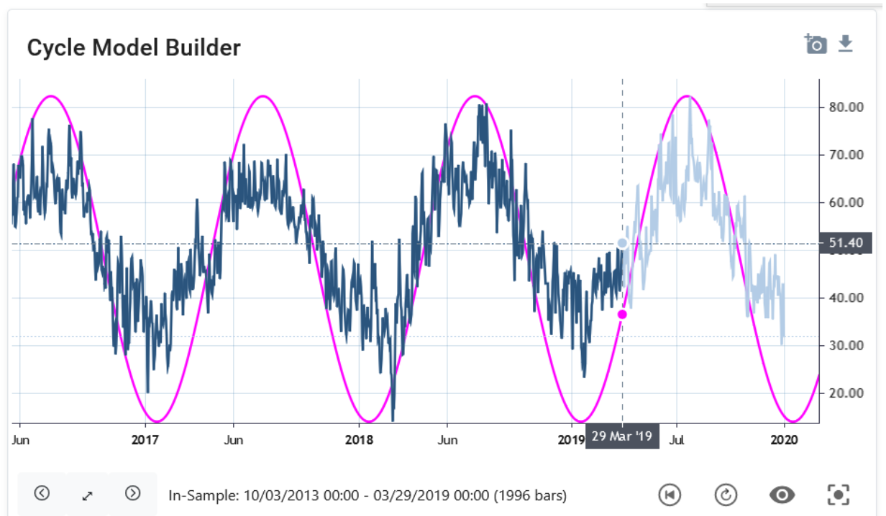

Dataset: Daily Temperature Hamburg, Germany (F), 29. Mar. 2019

Cycle Detection Results:

- Cycle Length: 362 d (pink)
- Next high:    ~Aug 2019
- Next low:     ~Jan 2020

### Cycle Spectrum Analysis, Temperature in Hamburg

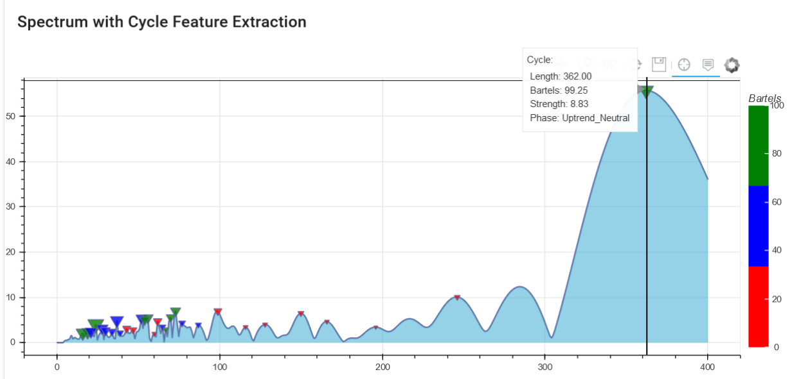

Dataset: Daily Temperature Hamburg, Germany (F), 29. Mar. 2019

- Cycle Length: 362 d
- Next high:    ~Aug 2019
- Next low:     ~Jan 2020

Cycle Spectrum reveals:

a) Currently active dominant cycles
b) Length of these cycles
c) Current status of its phase
d) Significance of the cycle

### Components of Stock Market data: Trend, Noise & Different Cycles

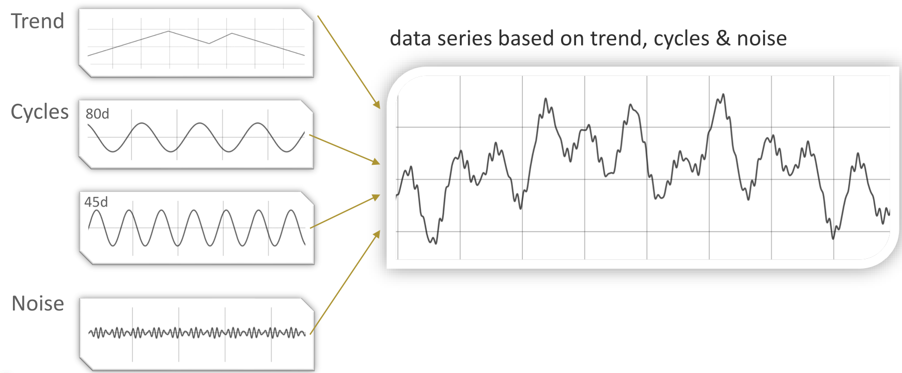

- Input: Trend, Cycles 80d, Cycles 45d, Noise
- Output: data series based on trend, cycles & noise

### Cycle Analysis removes noise & trend to output cycle spectrum

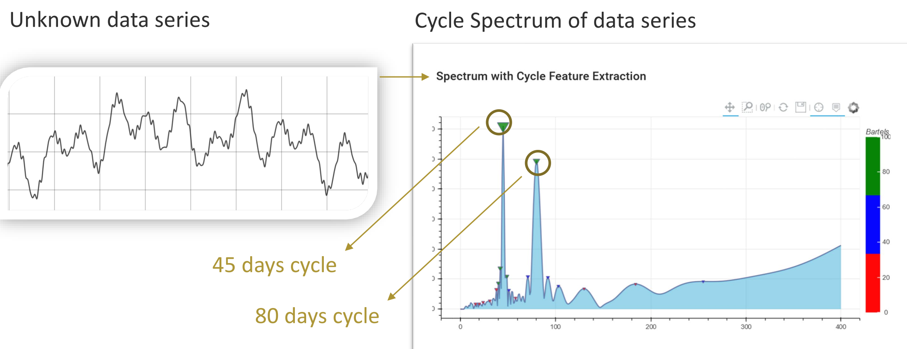

- Input: Unknown data series
- Output: Cycle Spectrum of data series (45 days cycle, 80 days cycle)

### Cycle Spectrum allows to plot cycle projections

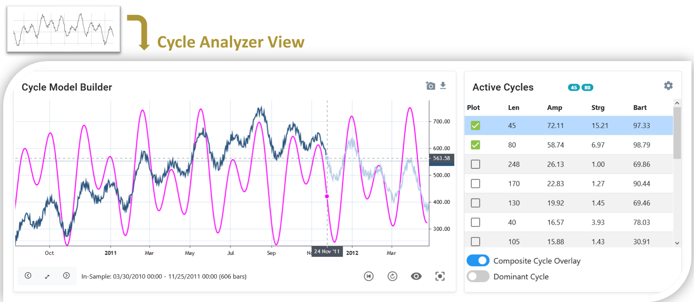

## Section 2: Review: The 170er Cycle in HY1 2020

### The Cycle Scanner: S&P 500 Cycle Analysis Spectrum as of 14 Feb. 2020

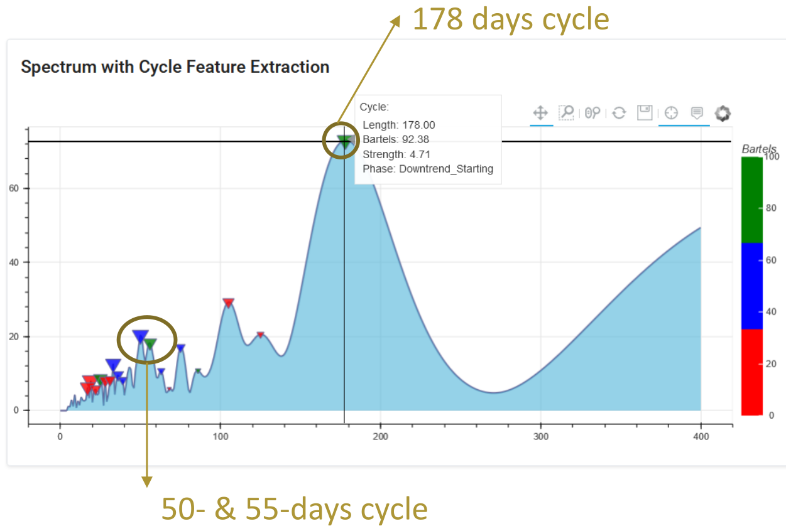

- 178 days cycle
- 50- & 55-days cycle

### The current 170er parade in the S&P in Feb. 2020

S&P 500 with dominant cycle length 178, Situation 14 Feb. 2020

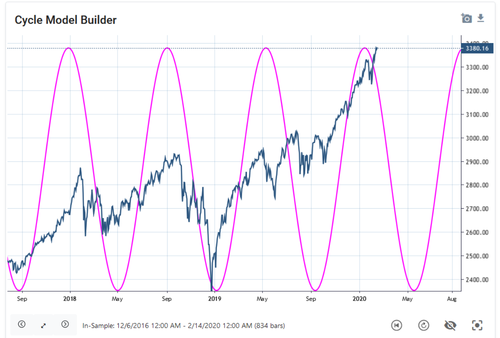

### The ~170-day market cycle marched in a parade with sentiment indicators

VIX Dominant Cycles 178/104 Projection, Date: 14 Feb 2020

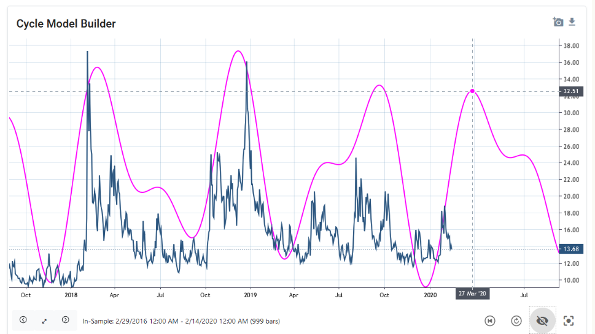

projected sentiment high turning point; ~27. March 2020

### A Review: The ~170 days parade called the top and low in Q1 2020

VIX Dominant Cycles 178/104 projection …. and outcome (light blue line)

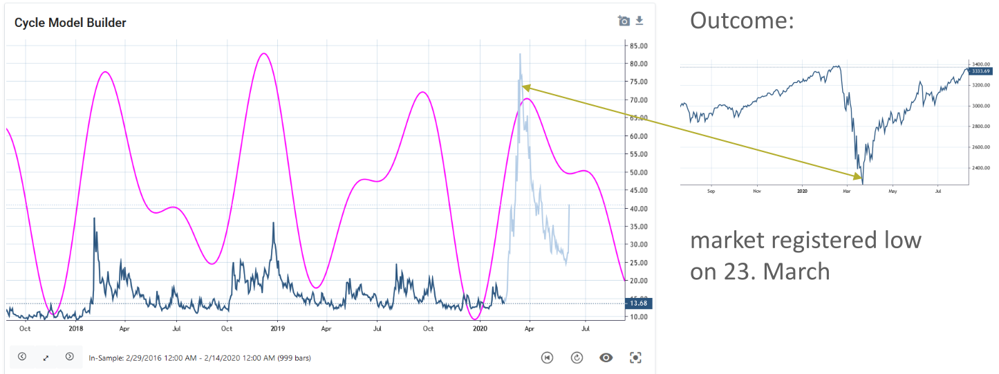

Outcome: market registered low on 23. March

### The detected sub-cycles of 50d/55d helped to identify a bottom

S&P 500 Dominant Cycles (50, 55 days) projection, 27 February
(The 50- and 55-days cycle showed up as peaks in the spectrum on 14th Feb.)

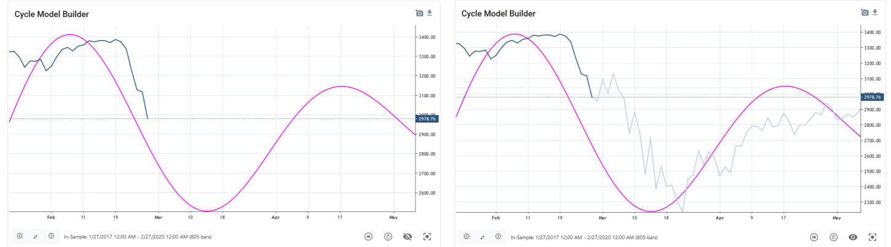

### Analysis & charts on the 170er cycle published publicly in Feb. 2020

> “The Importance of Cycles in Predicting Future Turning Points”
> published in: “Traders World, The Official Magazine of Technical Analysis”, Issue #76 - Feb/Mar/Apr
>
> “By combining different data sets and the analysis of the dominant cycle, we can detect a cyclical synchronicity. […] Synchronous cycles […] could indicate a trend reversal for the market under investigation”
>15. Feb. 2020, Lars von Thienen, Traders World Magazine #76

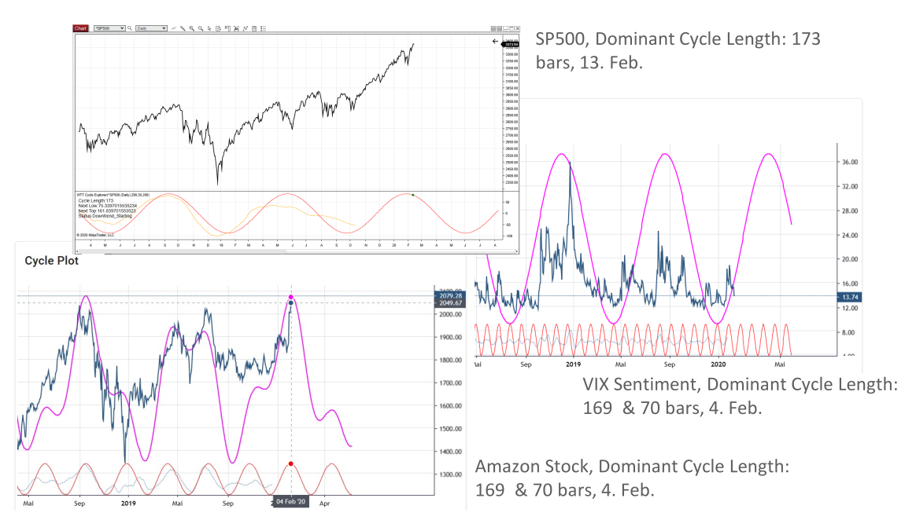

- SP500, Dominant Cycle Length: 173 bars, 13. Feb.
- VIX Sentiment, Dominant Cycle Length: 169 & 70 bars, 4. Feb.
- Amazon Stock, Dominant Cycle Length: 169 & 70 bars, 4. Feb.

## Section 3: Outlook: Daily Stock Market Cycles, August 2020

### Real Cycle Spectrum S&P500 – 14. Aug. 2020

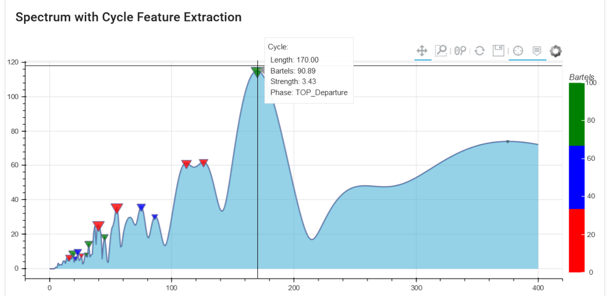

A current parade?
Stock Market Cycle Analysis, FSC Cycle Scanner, August 2020
> ”You too are in the parade.” (Dewey)

### 170 Days Cycle - Equal Weight S&P500

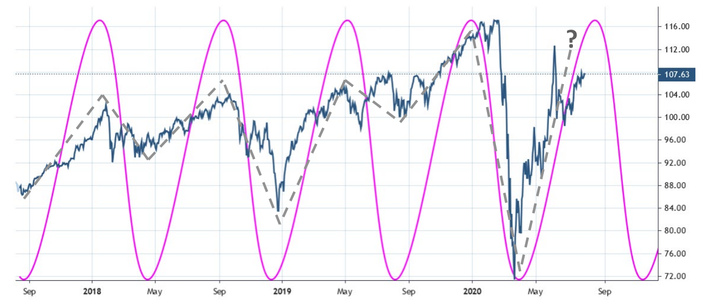

RSP - Invesco S&P 500 Equal Weight ETF, Date: 7 August 2020

## 168 days Cycle – NASDAQ 100

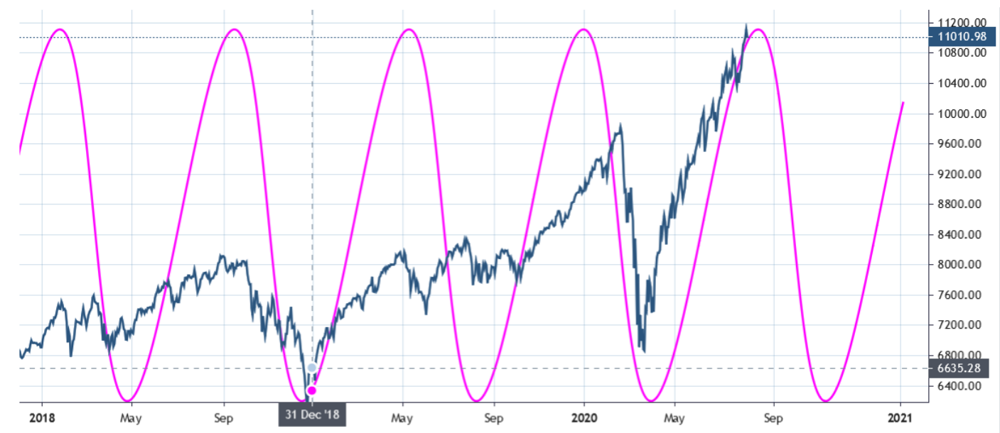

### 167 Days Cycle – Apple (AAPL)

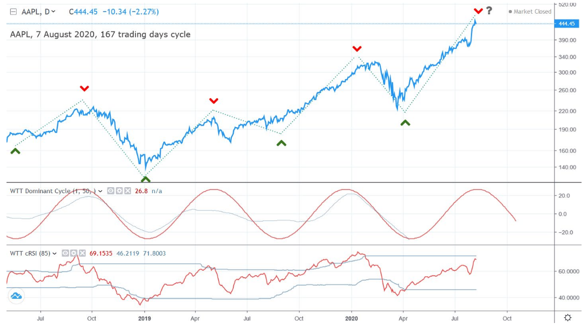

### 177 Days US Tech. Sentiment Cycle NASDAQ-100 Volatility Index (VXN)

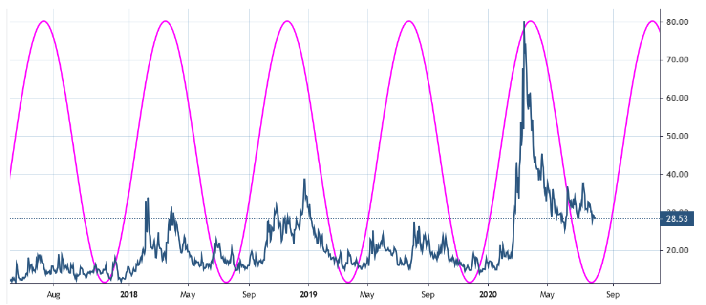

### 184 days China sentiment cycle

CBOE China ETF Volatility Index

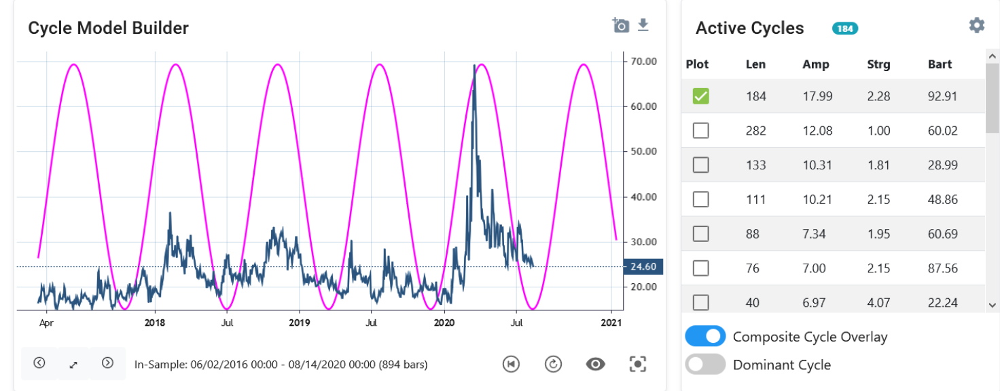

Date: 14. Aug. 2020, Data Source: https://fred.stlouisfed.org/series/VXFXICLS

### S&P 500 Index 170 days + Top 5 Cycles

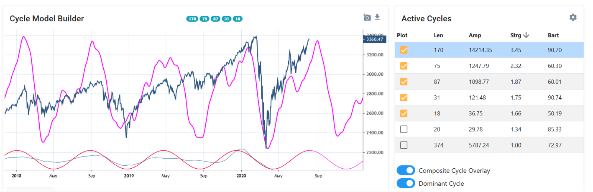

### The longer parade: Update on the 5.91y cycle (~310 weeks)

DAX Futures, Continuous Contract, Front Month, Date: 14.08.2020,

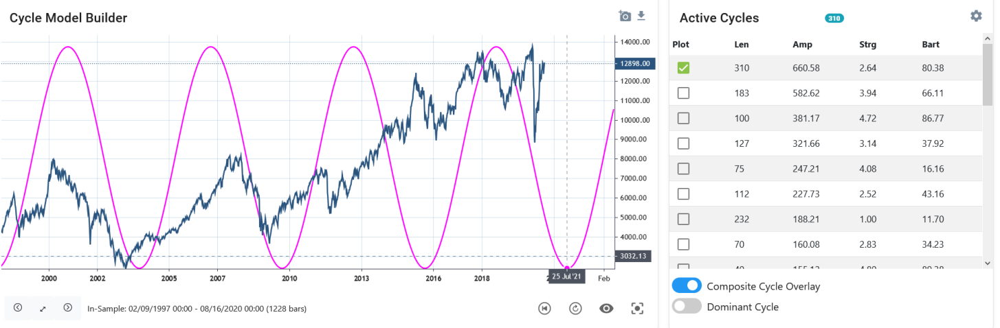

Data Souce: Quandl Futures

### Will the U.S. Dollar Index join the parade? Top 3 Cycles Composite

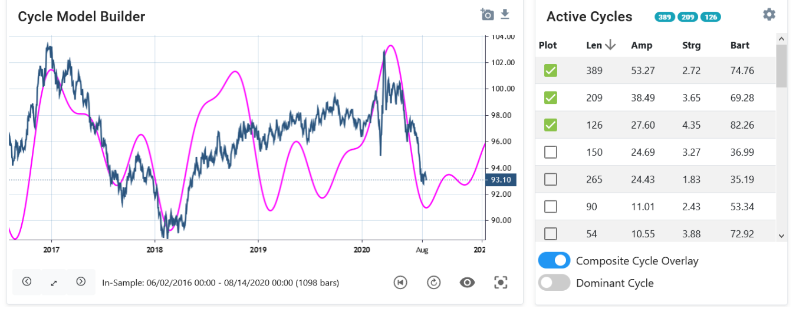

U.S. Dollar Index, Data: DX-Y.NYB – Yahoo Finance, 14.Aug. 2020

### TLT iShares 20+ Year Treasury Bond ETF Top 4 Active Cycles, 17. Aug

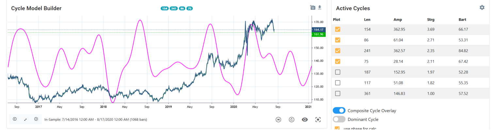

### Gold – Top 3 Active Cycles, 14. Aug. 2020

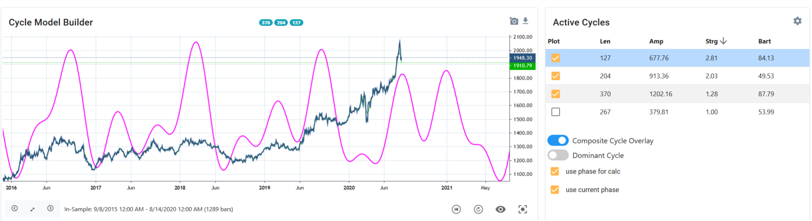

## About the Author

Lars von Thienen
FSC Board Member

As founder and CEO of Noggle AG, Lars von Thienen invented the independent desktop search and knowledge management app. He holds a degree in business engineering. As a member of the Aequitas Group board of directors, he is responsible for a group of companies with more than 400 internationally active business and IT consultants. Appointed by the Minister of Justice, von Thienen practices as a commercial judge. He develops algorithms and software for cycle recognition and has published two books on cycles which have been ranked in the Top100 books for Financial Engineering on Amazon (“Decoding The Hidden Market Rhythm”). Von Thienen is based in Hamburg, Germany.

Contact: lars@cycles.org
